Size of Experiment Set = 4
Experiment has 1 result sets
ResultSet has 18 results

## Performance Results (Detector = FAST, Descriptor = BRISK)

Frame | Lidar points | TTC Lidar | TTC Camera
---:  | ---:  | ---:  | ---: 
1 | 340 | 12.5156 | 12.3
2 | 309 | 12.6142 | 12.3453
3 | 326 | 14.091 | 16.6163
4 | 322 | 16.6894 | 12.8857
5 | 344 | 15.9082 | -inf
6 | 352 | 12.6787 | 13.0386
7 | 317 | 11.9844 | 12.041
8 | 312 | 13.1241 | 11.4066
9 | 311 | 13.0241 | 11.8684
10 | 286 | 11.1746 | 13.3473
11 | 302 | 12.8086 | 12.9492
12 | 302 | 8.95978 | 12.1174
13 | 316 | 9.96439 | 12.7784
14 | 312 | 9.59863 | 11.6077
15 | 289 | 8.57352 | 11.4079
16 | 297 | 9.51617 | 12.2566
17 | 279 | 9.54658 | 9.2933
18 | 303 | 8.3988 | 11.8606

## Performance Results (Detector = FAST, Descriptor = BRISK)

Frame | Top view perspective of Lidar points showing distance markers | Image with TTC estimates from Lidar and Camera | Lidar points | TTC Lidar | TTC Camera
:---:  | :---:  | :---:  | ---:  | ---:  | ---: 
1 |  |  | 340 | 12.5156 | 12.3
2 |  |  | 309 | 12.6142 | 12.3453
3 |  |  | 326 | 14.091 | 16.6163
4 |  |  | 322 | 16.6894 | 12.8857
5 |  |  | 344 | 15.9082 | -inf
6 |  |  | 352 | 12.6787 | 13.0386
7 |  |  | 317 | 11.9844 | 12.041
8 |  | 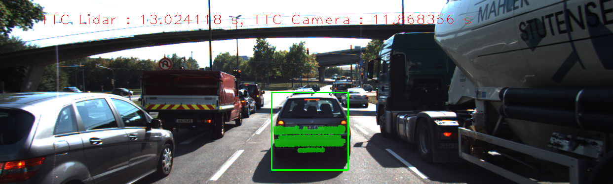 | 312 | 13.1241 | 11.4066
9 |  |  | 311 | 13.0241 | 11.8684
10 |  |  | 286 | 11.1746 | 13.3473
11 |  |  | 302 | 12.8086 | 12.9492
12 |  |  | 302 | 8.95978 | 12.1174
13 |  |  | 316 | 9.96439 | 12.7784
14 |  |  | 312 | 9.59863 | 11.6077
15 |  |  | 289 | 8.57352 | 11.4079
16 |  | 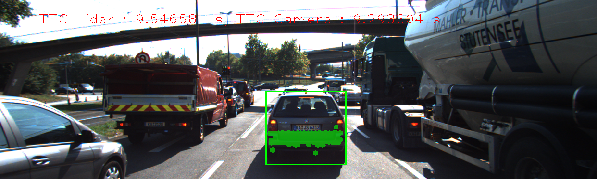 | 297 | 9.51617 | 12.2566
17 |  | 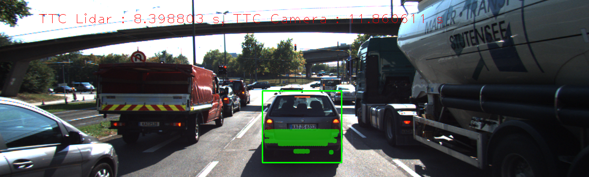 | 279 | 9.54658 | 9.2933
18 |  |  | 303 | 8.3988 | 11.8606
Experiment has 1 result sets
ResultSet has 18 results

## Performance Results (Detector = FAST, Descriptor = BRIEF)

Frame | Lidar points | TTC Lidar | TTC Camera
---:  | ---:  | ---:  | ---: 
1 | 340 | 12.5156 | 11.1776
2 | 309 | 12.6142 | 13.0069
3 | 326 | 14.091 | 14.8206
4 | 322 | 16.6894 | 13.6686
5 | 344 | 15.9082 | -inf
6 | 352 | 12.6787 | 41.7823
7 | 317 | 11.9844 | 12.7583
8 | 312 | 13.1241 | 12.7664
9 | 311 | 13.0241 | 13.9231
10 | 286 | 11.1746 | 16.2141
11 | 302 | 12.8086 | 13.6355
12 | 302 | 8.95978 | 12.9831
13 | 316 | 9.96439 | 13.1487
14 | 312 | 9.59863 | 11.7034
15 | 289 | 8.57352 | 12.6071
16 | 297 | 9.51617 | 13.0069
17 | 279 | 9.54658 | 11.2586
18 | 303 | 8.3988 | 13.7908

## Performance Results (Detector = FAST, Descriptor = BRIEF)

Frame | Top view perspective of Lidar points showing distance markers | Image with TTC estimates from Lidar and Camera | Lidar points | TTC Lidar | TTC Camera
:---:  | :---:  | :---:  | ---:  | ---:  | ---: 
1 |  |  | 340 | 12.5156 | 11.1776
2 |  |  | 309 | 12.6142 | 13.0069
3 |  | 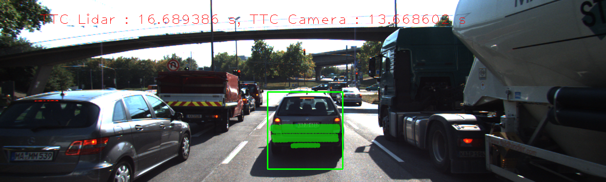 | 326 | 14.091 | 14.8206
4 |  |  | 322 | 16.6894 | 13.6686
5 |  |  | 344 | 15.9082 | -inf
6 |  |  | 352 | 12.6787 | 41.7823
7 |  |  | 317 | 11.9844 | 12.7583
8 |  | 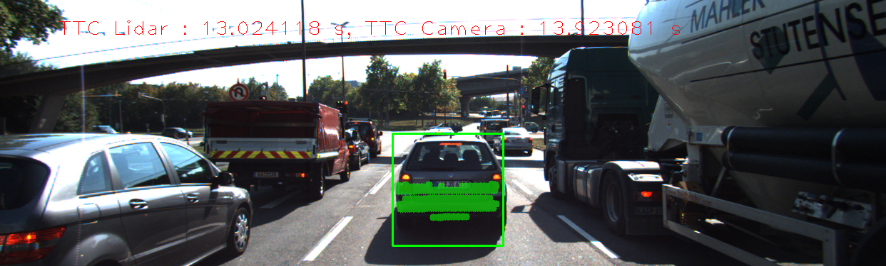 | 312 | 13.1241 | 12.7664
9 |  |  | 311 | 13.0241 | 13.9231
10 |  |  | 286 | 11.1746 | 16.2141
11 |  | 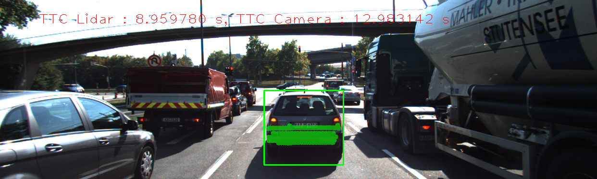 | 302 | 12.8086 | 13.6355
12 |  | 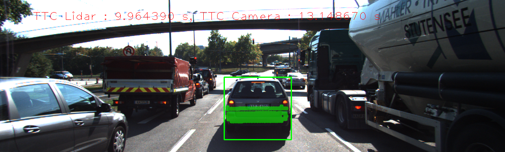 | 302 | 8.95978 | 12.9831
13 |  |  | 316 | 9.96439 | 13.1487
14 |  | 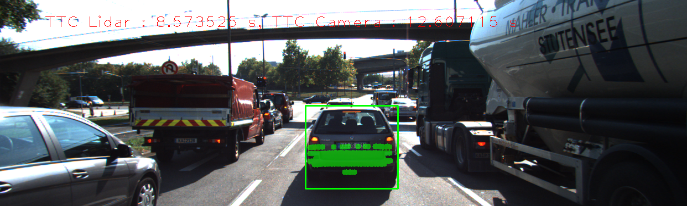 | 312 | 9.59863 | 11.7034
15 |  | 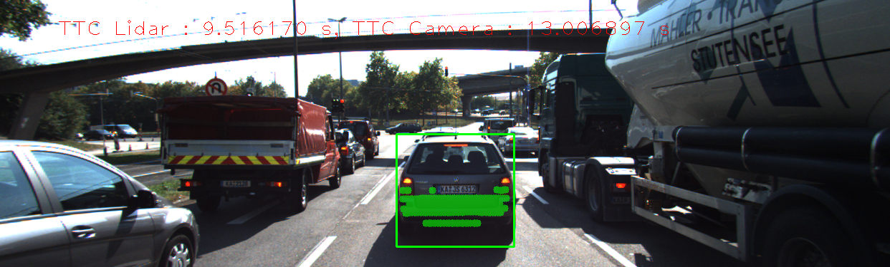 | 289 | 8.57352 | 12.6071
16 |  |  | 297 | 9.51617 | 13.0069
17 |  |  | 279 | 9.54658 | 11.2586
18 |  |  | 303 | 8.3988 | 13.7908
Experiment has 1 result sets
ResultSet has 18 results

## Performance Results (Detector = ORB, Descriptor = BRISK)

Frame | Lidar points | TTC Lidar | TTC Camera
---:  | ---:  | ---:  | ---: 
1 | 340 | 12.5156 | 37.4084
2 | 309 | 12.6142 | -inf
3 | 326 | 14.091 | 36.2012
4 | 322 | 16.6894 | 21.7788
5 | 344 | 15.9082 | -inf
6 | 352 | 12.6787 | 11.1075
7 | 317 | 11.9844 | -inf
8 | 312 | 13.1241 | 51.3026
9 | 311 | 13.0241 | -inf
10 | 286 | 11.1746 | -inf
11 | 302 | 12.8086 | 8.46717
12 | 302 | 8.95978 | -inf
13 | 316 | 9.96439 | 7.53169
14 | 312 | 9.59863 | 24.6173
15 | 289 | 8.57352 | 13.594
16 | 297 | 9.51617 | -inf
17 | 279 | 9.54658 | 23.6587
18 | 303 | 8.3988 | 29.89

## Performance Results (Detector = ORB, Descriptor = BRISK)

Frame | Top view perspective of Lidar points showing distance markers | Image with TTC estimates from Lidar and Camera | Lidar points | TTC Lidar | TTC Camera
:---:  | :---:  | :---:  | ---:  | ---:  | ---: 
1 |  |  | 340 | 12.5156 | 37.4084
2 |  | 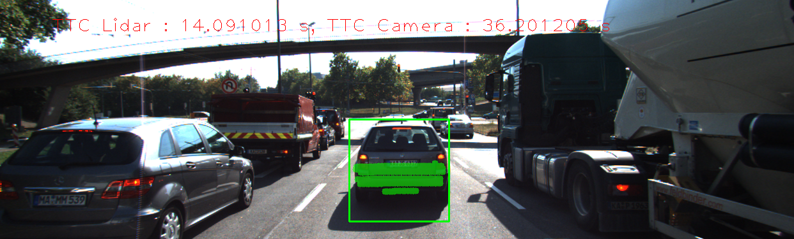 | 309 | 12.6142 | -inf
3 |  | 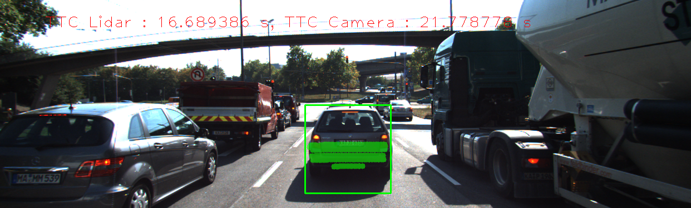 | 326 | 14.091 | 36.2012
4 |  |  | 322 | 16.6894 | 21.7788
5 |  | 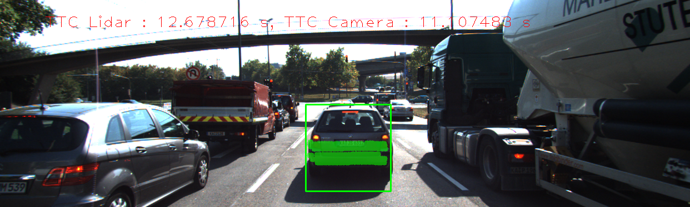 | 344 | 15.9082 | -inf
6 |  | 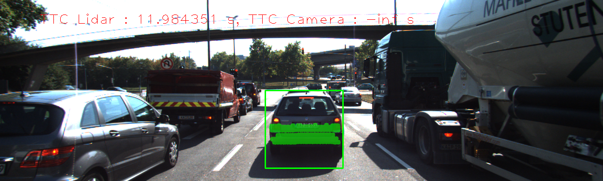 | 352 | 12.6787 | 11.1075
7 |  |  | 317 | 11.9844 | -inf
8 |  |  | 312 | 13.1241 | 51.3026
9 |  |  | 311 | 13.0241 | -inf
10 |  |  | 286 | 11.1746 | -inf
11 |  |  | 302 | 12.8086 | 8.46717
12 |  |  | 302 | 8.95978 | -inf
13 |  |  | 316 | 9.96439 | 7.53169
14 |  |  | 312 | 9.59863 | 24.6173
15 |  |  | 289 | 8.57352 | 13.594
16 |  |  | 297 | 9.51617 | -inf
17 |  |  | 279 | 9.54658 | 23.6587
18 |  |  | 303 | 8.3988 | 29.89
Experiment has 1 result sets
ResultSet has 18 results

## Performance Results (Detector = ORB, Descriptor = BRIEF)

Frame | Lidar points | TTC Lidar | TTC Camera
---:  | ---:  | ---:  | ---: 
1 | 340 | 12.5156 | 27.5288
2 | 309 | 12.6142 | -inf
3 | 326 | 14.091 | 113.496
4 | 322 | 16.6894 | 16.7244
5 | 344 | 15.9082 | 28.5454
6 | 352 | 12.6787 | -48.152
7 | 317 | 11.9844 | -inf
8 | 312 | 13.1241 | 34.6298
9 | 311 | 13.0241 | -inf
10 | 286 | 11.1746 | 168.345
11 | 302 | 12.8086 | 33.5123
12 | 302 | 8.95978 | 36.2236
13 | 316 | 9.96439 | -inf
14 | 312 | 9.59863 | 13.5006
15 | 289 | 8.57352 | -inf
16 | 297 | 9.51617 | 13.0005
17 | 279 | 9.54658 | 20.3758
18 | 303 | 8.3988 | 25.8155

## Performance Results (Detector = ORB, Descriptor = BRIEF)

Frame | Top view perspective of Lidar points showing distance markers | Image with TTC estimates from Lidar and Camera | Lidar points | TTC Lidar | TTC Camera
:---:  | :---:  | :---:  | ---:  | ---:  | ---: 
1 |  | 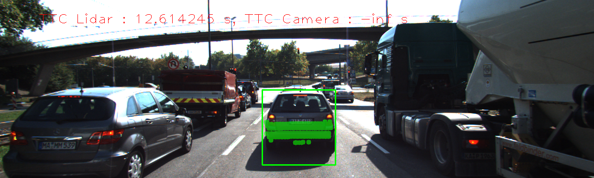 | 340 | 12.5156 | 27.5288
2 |  |  | 309 | 12.6142 | -inf
3 |  |  | 326 | 14.091 | 113.496
4 |  | 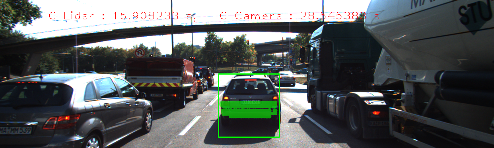 | 322 | 16.6894 | 16.7244
5 |  |  | 344 | 15.9082 | 28.5454
6 |  |  | 352 | 12.6787 | -48.152
7 |  | 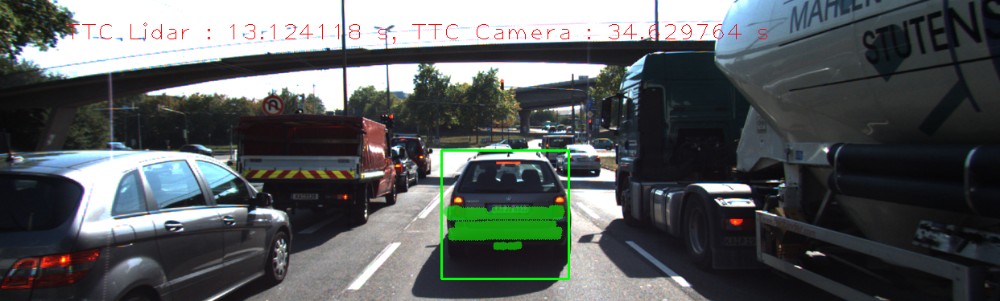 | 317 | 11.9844 | -inf
8 |  |  | 312 | 13.1241 | 34.6298
9 | 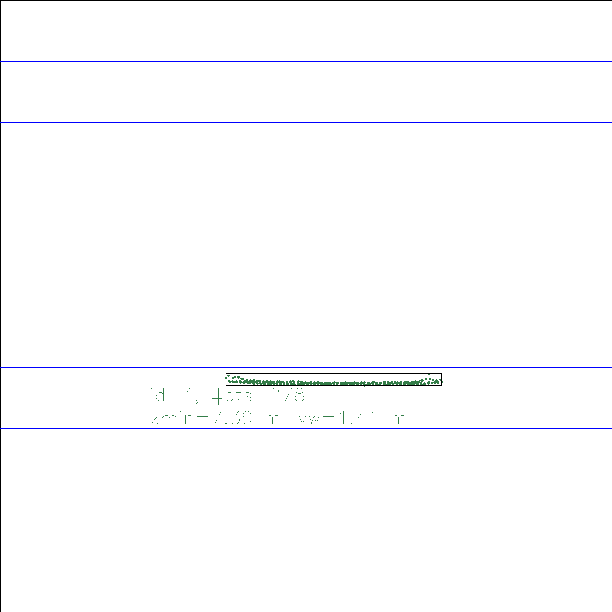 | 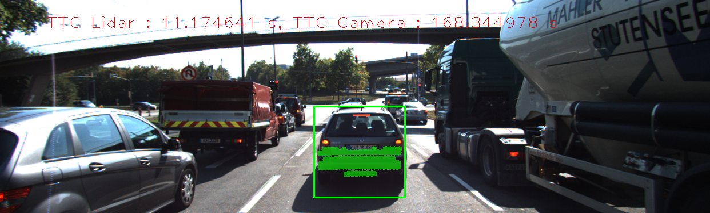 | 311 | 13.0241 | -inf
10 |  | 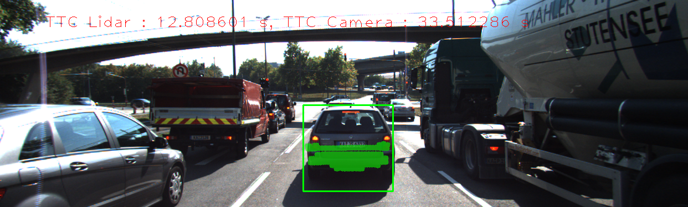 | 286 | 11.1746 | 168.345
11 |  |  | 302 | 12.8086 | 33.5123
12 |  |  | 302 | 8.95978 | 36.2236
13 |  |  | 316 | 9.96439 | -inf
14 |  | 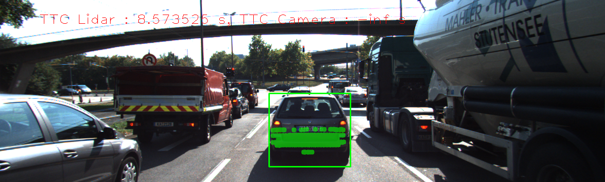 | 312 | 9.59863 | 13.5006
15 |  |  | 289 | 8.57352 | -inf
16 |  |  | 297 | 9.51617 | 13.0005
17 |  |  | 279 | 9.54658 | 20.3758
18 |  |  | 303 | 8.3988 | 25.8155
