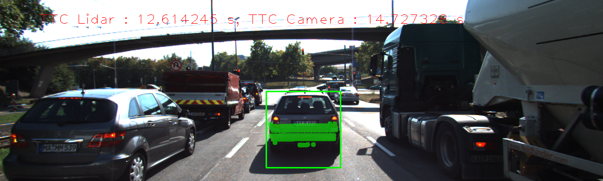
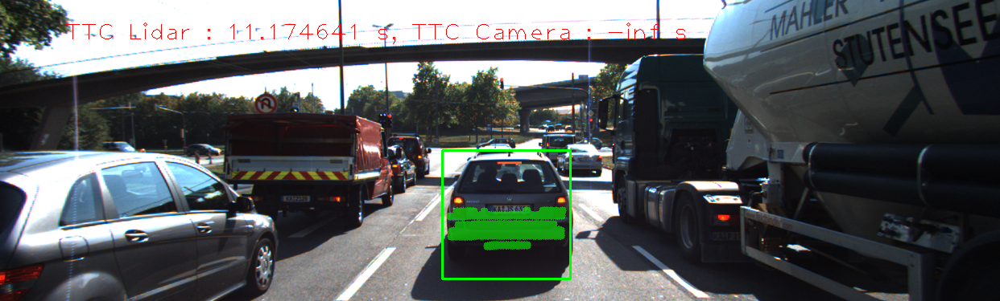
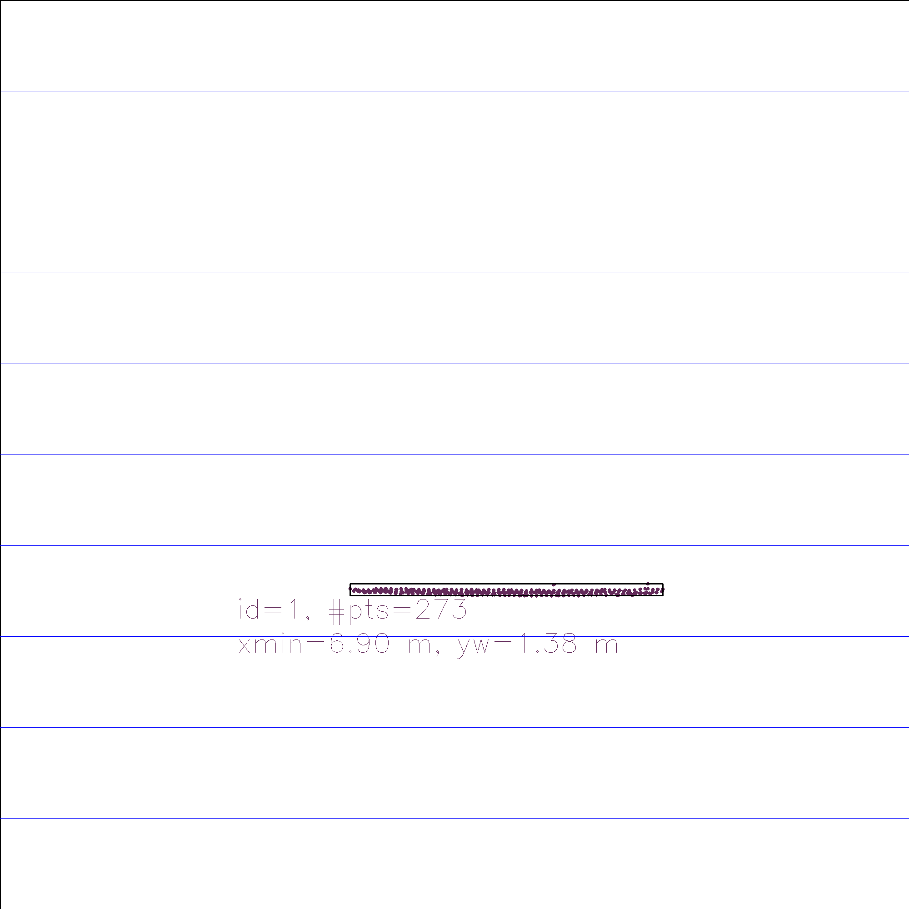

# Performance Evaluation
These results are recorded from running a total of 2 experiments based on combinations of 2 detectors and 1 descriptors.

Performance Results
* Detector = Shi_Tomasi
* Descriptor = BRISK

Frame | Lidar points | TTC Lidar | TTC Camera
---:  | ---:  | ---:  | ---: 
1 | 340 | 12.5156 | 14.1119
2 | 309 | 12.6142 | 14.7273
3 | 326 | 14.091 | 13.4904
4 | 322 | 16.6894 | 12.398
5 | 344 | 15.9082 | 12.6754
6 | 352 | 12.6787 | -inf
7 | 317 | 11.9844 | -inf
8 | 312 | 13.1241 | -inf
9 | 311 | 13.0241 | 11.5126
10 | 286 | 11.1746 | -inf
11 | 302 | 12.8086 | 11.3024
12 | 302 | 8.95978 | 11.6524
13 | 316 | 9.96439 | 11.7243
14 | 312 | 9.59863 | 11.8781
15 | 289 | 8.57352 | 9.33785
16 | 297 | 9.51617 | 11.3079
17 | 279 | 9.54658 | 11.4487
18 | 303 | 8.3988 | 9.12792

Performance Results
* Detector = Shi_Tomasi
* Descriptor = BRISK

Frame | Top view perspective of Lidar points showing distance markers | Image with TTC estimates from Lidar and Camera | Lidar points | TTC Lidar | TTC Camera
:---:  | :---:  | :---:  | ---:  | ---:  | ---: 
1 |  |  | 340 | 12.5156 | 14.1119
2 |  |  | 309 | 12.6142 | 14.7273
3 |  |  | 326 | 14.091 | 13.4904
4 |  |  | 322 | 16.6894 | 12.398
5 |  |  | 344 | 15.9082 | 12.6754
6 |  |  | 352 | 12.6787 | -inf
7 |  |  | 317 | 11.9844 | -inf
8 |  |  | 312 | 13.1241 | -inf
9 |  |  | 311 | 13.0241 | 11.5126
10 |  |  | 286 | 11.1746 | -inf
11 |  |  | 302 | 12.8086 | 11.3024
12 |  |  | 302 | 8.95978 | 11.6524
13 |  |  | 316 | 9.96439 | 11.7243
14 |  |  | 312 | 9.59863 | 11.8781
15 |  |  | 289 | 8.57352 | 9.33785
16 |  |  | 297 | 9.51617 | 11.3079
17 |  |  | 279 | 9.54658 | 11.4487
18 |  |  | 303 | 8.3988 | 9.12792

Performance Results
* Detector = SIFT
* Descriptor = BRISK

Frame | Lidar points | TTC Lidar | TTC Camera
---:  | ---:  | ---:  | ---: 
1 | 340 | 12.5156 | 12.4999
1 | 340 | 12.5156 | 12.4999
3 | 326 | 14.091 | 13.6066
3 | 326 | 14.091 | 13.6066
5 | 344 | 15.9082 | 20.201
5 | 344 | 15.9082 | 20.201
7 | 317 | 11.9844 | 15.8119
7 | 317 | 11.9844 | 15.8119
9 | 311 | 13.0241 | 12.6421
9 | 311 | 13.0241 | 12.6421
11 | 302 | 12.8086 | 12.9654
11 | 302 | 12.8086 | 12.9654
13 | 316 | 9.96439 | 10.0226
13 | 316 | 9.96439 | 10.0226
15 | 289 | 8.57352 | 12.501
15 | 289 | 8.57352 | 12.501
17 | 279 | 9.54658 | 9.65169
17 | 279 | 9.54658 | 9.65169

Performance Results
* Detector = SIFT
* Descriptor = BRISK

Frame | Top view perspective of Lidar points showing distance markers | Image with TTC estimates from Lidar and Camera | Lidar points | TTC Lidar | TTC Camera
:---:  | :---:  | :---:  | ---:  | ---:  | ---: 
1 |  |  | 340 | 12.5156 | 12.4999
1 |  |  | 340 | 12.5156 | 12.4999
3 |  |  | 326 | 14.091 | 13.6066
3 |  |  | 326 | 14.091 | 13.6066
5 |  |  | 344 | 15.9082 | 20.201
5 |  |  | 344 | 15.9082 | 20.201
7 |  |  | 317 | 11.9844 | 15.8119
7 |  |  | 317 | 11.9844 | 15.8119
9 |  |  | 311 | 13.0241 | 12.6421
9 |  |  | 311 | 13.0241 | 12.6421
11 |  |  | 302 | 12.8086 | 12.9654
11 |  |  | 302 | 12.8086 | 12.9654
13 |  |  | 316 | 9.96439 | 10.0226
13 |  |  | 316 | 9.96439 | 10.0226
15 |  |  | 289 | 8.57352 | 12.501
15 |  |  | 289 | 8.57352 | 12.501
17 |  |  | 279 | 9.54658 | 9.65169
17 |  |  | 279 | 9.54658 | 9.65169
