# Track an Object in 3D Space

This project is part of the camera course in Udacity's sensor fusion nanodegree. The following program schematic outlines what is included in this project.


This project implements the missing parts in the schematic. To accomplish this, there are four major tasks to complete: 
1. First, develop a way to match 3D objects over time by using keypoint correspondences. 
2. Second, compute the TTC based on Lidar measurements. 
3. Then proceed to do the same using the camera, which requires to first associate keypoint matches to regions of interest and then to compute the TTC based on those matches. 
4. And lastly, conduct various tests with the framework. The goal is to identify the most suitable detector/descriptor combination for TTC estimation and also to search for problems that can lead to faulty measurements by the camera or Lidar sensor. 

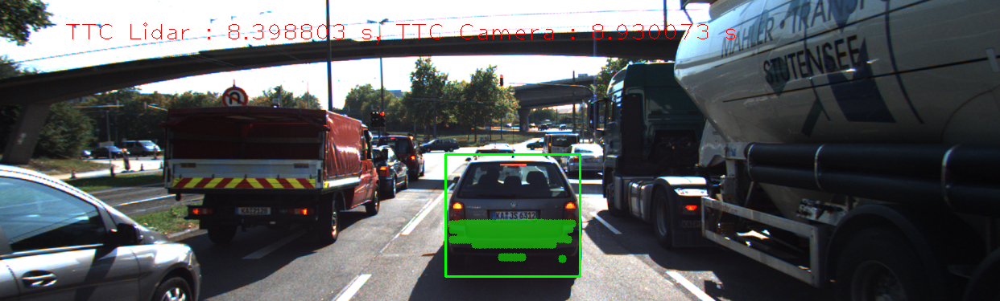

# Contents

* [Project Specification](#Project-Specification)
* [Project Report](#Project-Report)
  * [Match 3D Objects](#Match-3D-Objects)
  * [Compute Lidar-based TTC](#Compute-Lidar-based-TTC)
  * [Associate Keypoint Correspondences with Bounding Boxes](#Associate-Keypoint-Correspondences-with-Bounding-Boxes)
  * [Compute Camera-based TTC](#Compute-Camera-based-TTC)
* [Performance Evaluation](#Performance-Evaluation)
  * [Performance Evaluation 1](#Performance-Evaluation-1)
  * [Performance Evaluation 2](#Performance-Evaluation-2)
* [Building and Running the Project](#Building-and-Running-the-Project)
* [References](#References)
* [Additional Project Files](#Additional-Project-Files)


# Project Specification

#|Req| Criteria | Specification | Status
:--- | :--- | :--- | :--- | :---
FP.0|[Report](#Project-Report)|Provide a Writeup / README that includes all the rubric points and how you addressed each one. You can submit your writeup as markdown or pdf.|The writeup / README should include a statement and supporting figures / images that explain how each rubric item was addressed, and specifically where in the code each step was handled.| DONE
FP.1|[Match 3D Objects](#Match-3D-Objects)|Implement the method "matchBoundingBoxes", which takes as input both the previous and the current data frames and provides as output the ids of the matched regions of interest (i.e. the boxID property). Matches must be the ones with the highest number of keypoint correspondences.|Code is functional and returns the specified output, where each bounding box is assigned the match candidate with the highest number of occurrences.| DONE
FP.2|[Compute Lidar-based TTC](#Compute-Camera-based-TTC)|Compute the time-to-collision in second for all matched 3D objects using only Lidar measurements from the matched bounding boxes between current and previous frame.]()|Code is functional and returns the specified output. Also, the code is able to deal with outlier Lidar points in a statistically robust way to avoid severe estimation errors.| DONE
FP.3|[Associate Keypoint Correspondences with Bounding Boxes](#Associate-Keypoint-Correspondences-with-Bounding-Boxes)|Prepare the TTC computation based on camera measurements by associating keypoint correspondences to the bounding boxes which enclose them. All matches which satisfy this condition must be added to a vector in the respective bounding box.|Code performs as described and adds the keypoint correspondences to the "kptMatches" property of the respective bounding boxes. Also, outlier matches have been removed based on the euclidean distance between them in relation to all the matches in the bounding box.| DONE
FP.4|[Compute Camera-based TTC](#Compute-Camera-based-TTC)|Compute the time-to-collision in second for all matched 3D objects using only keypoint correspondences from the matched bounding boxes between current and previous frame.|Code is functional and returns the specified output. Also, the code is able to deal with outlier correspondences in a statistically robust way to avoid severe estimation errors.| DONE
FP.5|[Performance Evaluation 1](#Performance-Evaluation-1)|Find examples where the TTC estimate of the Lidar sensor does not seem plausible. Describe your observations and provide a sound argumentation why you think this happened.|Several examples (2-3) have been identified and described in detail. The assertion that the TTC is off has been based on manually estimating the distance to the rear of the preceding vehicle from a top view perspective of the Lidar points.| DONE
FP.6|[Performance Evaluation 2](#Performance-Evaluation-2)|Run several detector / descriptor combinations and look at the differences in TTC estimation. Find out which methods perform best and also include several examples where camera-based TTC estimation is way off. As with Lidar, describe your observations again and also look into potential reasons.|All detector / descriptor combinations implemented in previous chapters have been compared with regard to the TTC estimate on a frame-by-frame basis. To facilitate comparison, a spreadsheet and graph should be used to represent the different TTCs.| DONE


# Project Report

## Match 3D Objects
The goal of this task is to implement the method `matchBoundingBoxes`, which takes as input both the previous and the current data frames and provides as output the ids of the matched regions of interest (i.e. the boxID property)“. Matches must be the ones with the highest number of keypoint correspondences.

The task is complete once the code is functional and returns the specified output, where each bounding box is assigned the match candidate with the highest number of occurrences.

The method `matchBoundingBoxes` is called from [FinalProject_Camera.cpp](src/FinalProject_Camera.cpp) like this:
```c++
map<int, int> boundingBoxBestMatches;
DataFrame & previousFrame = *(dataBuffer.end() - 2);
DataFrame & currentFrame = *(dataBuffer.end() - 1);

// associate bounding boxes between current and previous frame using keypoint matches
matchBoundingBoxes(matches,
                   boundingBoxBestMatches,
                   previousFrame,
                   currentFrame);
```

This is the implementation of the method `matchBoundingBoxes` in [camFusion_Student.cpp](src/camFusion_Student.cpp):

```c++
void matchBoundingBoxes(std::vector<cv::DMatch> & matches,
                        std::map<int, int> & boundingBoxBestMatches,
                        DataFrame & previousFrame,
                        DataFrame & currentFrame)
{
    std::multimap<int, int> boundingBoxMatches{};  // A pair of IDs to track bounding boxes

    for(auto & match : matches)
    {
        cv::KeyPoint keypointsPreviousFrame = previousFrame.keypoints[match.queryIdx];
        cv::KeyPoint keypointsCurrentFrame = currentFrame.keypoints[match.trainIdx];

        unsigned int boxIdPreviousFrame;
        unsigned int boxIdCurrentFrame;

        for(auto & boundingBox : previousFrame.boundingBoxes)
        {
            if(boundingBox.roi.contains(keypointsPreviousFrame.pt))
            {
                boxIdPreviousFrame = boundingBox.boxID;
            }
        }

        for(auto & boundingBox : currentFrame.boundingBoxes)
        {
            if(boundingBox.roi.contains(keypointsCurrentFrame.pt))
            {
                boxIdCurrentFrame = boundingBox.boxID;
            }
        }

        boundingBoxMatches.insert({boxIdCurrentFrame, boxIdPreviousFrame});
    }

    vector<int> boundingBoxIdsCurrentFrame{};

    for(auto & boundingBox : currentFrame.boundingBoxes)
    {
        boundingBoxIdsCurrentFrame.push_back(boundingBox.boxID);
    }

    for(int boxIdCurrentFrame : boundingBoxIdsCurrentFrame)
    {
        auto it = boundingBoxMatches.equal_range(boxIdCurrentFrame);
        unordered_map<int, int> boundingBoxIdMatches;
        for(auto itr = it.first; itr != it.second; ++itr)
        {
            boundingBoxIdMatches[itr->second]++;
        }

        // find the max frequency
        unsigned int maxBoxID = 0;
        int matchingBoxID = -1;

        for(auto & boxIdMatch : boundingBoxIdMatches)
        {
            if(maxBoxID < boxIdMatch.second)
            {
                matchingBoxID = boxIdMatch.first;
                maxBoxID = boxIdMatch.second;
            }
        }

        boundingBoxBestMatches.insert({matchingBoxID, boxIdCurrentFrame});
    }
}
```


## Compute Lidar-based TTC

The goal of this part of the project is to compute the time-to-collision for all matched 3D objects based on Lidar measurements alone. 

The estimation is implemented in a way that makes it robust against outliers which might be way too close and thus lead to faulty estimates of the TTC. The TCC is returned to the main function at the end of `computeTTCLidar`.

The task is complete once the code is functional and returns the specified output. Also, the code is able to deal with outlier Lidar points in a statistically robust way to avoid severe estimation errors.

```c++
void computeTTCLidar(std::vector<LidarPoint> & lidarPointsPreviousFrame,
                     std::vector<LidarPoint> & lidarPointsCurrentFrame,
                     double frameRate,
                     double & TTC)
{
    std::cout << "Lidar Previous Frame: " << lidarPointsPreviousFrame.size() << " points" << "\t Lidar Current Frame: "
              << lidarPointsCurrentFrame.size() << " points" << std::endl;

    // auxiliary variables
    double dT = 0.1 / frameRate;        // time between two measurements in seconds
    double laneWidth = 4.0; // assumed width of the ego lane

    // find closest distance to Lidar points within ego lane
    double minXPrev = 1e9, minXCurr = 1e9;

    for(auto it = lidarPointsPreviousFrame.begin(); it != lidarPointsPreviousFrame.end(); ++it)
    {
        if(abs(it->y) <= laneWidth / 2.0)
        { // 3D point within ego lane?
            minXPrev = minXPrev > it->x ? it->x : minXPrev;
        }
    }

    for(auto it = lidarPointsCurrentFrame.begin(); it != lidarPointsCurrentFrame.end(); ++it)
    {
        if(abs(it->y) <= laneWidth / 2.0)
        { // 3D point within ego lane?
            minXCurr = minXCurr > it->x ? it->x : minXCurr;
        }
    }

    std::cout << "Final minXPrev: " << minXPrev << "\t Final minXCurr: " << minXCurr << std::endl;

    // compute TTC from both measurements
    TTC = minXCurr * dT / (minXPrev - minXCurr);
}
```

## Associate Keypoint Correspondences with Bounding Boxes

Before a TTC estimate can be computed in the next part of the project, we need to find all keypoint matches that belong to each 3D object. 

We can do this by simply checking whether the corresponding keypoints are within the region of interest in the camera image. All matches which satisfy this condition should be added to a vector. The problem you will find is that there will be outliers among the matches. To eliminate those, we compute a robust mean of all the euclidean distances between keypoint matches and then remove those that are too far away from the mean.

The task is complete once the code performs as described and adds the keypoint correspondences to the `kptMatches` property of the respective bounding boxes. Also, outlier matches have been removed based on the euclidean distance between them in relation to all the matches in the bounding box.

```c++
// associate a given bounding box with the keypoints it contains
void clusterKptMatchesWithROI(BoundingBox & boundingBox,
                              std::vector<cv::KeyPoint> & kptsPrev,
                              std::vector<cv::KeyPoint> & kptsCurr,
                              std::vector<cv::DMatch> & kptMatches)
{
    std::vector<double> euclideanDistance;

    for(auto it = kptMatches.begin(); it != kptMatches.end(); it++)
    {
        int currKptIndex = (*it).trainIdx;
        const auto & currKeyPoint = kptsCurr[currKptIndex];

        if(boundingBox.roi.contains(currKeyPoint.pt))
        {
            int prevKptIndex = (*it).queryIdx;
            const auto & prevKeyPoint = kptsPrev[prevKptIndex];

            euclideanDistance.push_back(cv::norm(currKeyPoint.pt - prevKeyPoint.pt));
        }
    }

    int pair_num = euclideanDistance.size();
    double euclideanDistanceMean = std::accumulate(euclideanDistance.begin(), euclideanDistance.end(), 0.0) / pair_num;

    for(auto it = kptMatches.begin(); it != kptMatches.end(); it++)
    {
        int currKptIndex = (*it).trainIdx;
        const auto & currKeyPoint = kptsCurr[currKptIndex];

        if(boundingBox.roi.contains(currKeyPoint.pt))
        {
            int prevKptIndex = (*it).queryIdx;
            const auto & prevKeyPoint = kptsPrev[prevKptIndex];

            double temp = cv::norm(currKeyPoint.pt - prevKeyPoint.pt);

            double euclideanDistanceMean_Augment = euclideanDistanceMean * 1.3;
            if(temp < euclideanDistanceMean_Augment)
            {
                boundingBox.keypoints.push_back(currKeyPoint);
                boundingBox.kptMatches.push_back(*it);
            }
        }
    }
}
```

## Compute Camera-based TTC

Once keypoint matches have been added to the bounding boxes, the next step is to compute the TTC estimate. 

Once we have our estimate of the TTC, we return it to the `main` function at the end of `computeTTCCamera`.

The task is complete once the code is functional and returns the specified output. Also, the code must be able to deal with outlier correspondences in a statistically robust way to avoid severe estimation errors.

```c++
// Compute time-to-collision (TTC) based on keypoint correspondences in successive images
void computeTTCCamera(std::vector<cv::KeyPoint> & kptsPrev,
                      std::vector<cv::KeyPoint> & kptsCurr,
                      std::vector<cv::DMatch> kptMatches,
                      double frameRate,
                      double & TTC,
                      cv::Mat *visImg)
{
    // compute distance ratios between all matched keypoints
    vector<double> distRatios; // stores the distance ratios for all keypoints between curr. and prev. frame

    for(auto it1 = kptMatches.begin(); it1 != kptMatches.end() - 1; ++it1)
    { // outer keypoint loop

        // get current keypoint and its matched partner in the prev. frame
        cv::KeyPoint kpOuterCurr = kptsCurr.at(it1->trainIdx);
        cv::KeyPoint kpOuterPrev = kptsPrev.at(it1->queryIdx);

        for(auto it2 = kptMatches.begin() + 1; it2 != kptMatches.end(); ++it2)
        { // inner keypoint loop

            double minDist = 100.0; // min. required distance

            // get next keypoint and its matched partner in the prev. frame
            cv::KeyPoint kpInnerCurr = kptsCurr.at(it2->trainIdx);
            cv::KeyPoint kpInnerPrev = kptsPrev.at(it2->queryIdx);

            // compute distances and distance ratios
            double distCurr = cv::norm(kpOuterCurr.pt - kpInnerCurr.pt);
            double distPrev = cv::norm(kpOuterPrev.pt - kpInnerPrev.pt);

            if(distPrev > std::numeric_limits<double>::epsilon() && distCurr >= minDist)
            { // avoid division by zero

                double distRatio = distCurr / distPrev;
                distRatios.push_back(distRatio);
            }
        } // eof inner loop over all matched kpts
    }     // eof outer loop over all matched kpts

    // only continue if list of distance ratios is not empty
    if(distRatios.size() == 0)
    {
        TTC = NAN;
        return;
    }

    // compute camera-based TTC from distance ratios
    //double meanDistRatio = std::accumulate(distRatios.begin(), distRatios.end(), 0.0) / distRatios.size();

    std::sort(distRatios.begin(), distRatios.end());
    long medIndex = floor(distRatios.size() / 2.0);
    double medDistRatio = distRatios.size() % 2 == 0 ? (distRatios[medIndex - 1] + distRatios[medIndex]) / 2.0
                                                     : distRatios[medIndex]; // compute median dist. ratio to remove outlier influence

    double dT = 1 / frameRate;
    TTC = -dT / (1 - medDistRatio);
}
```

# Performance Evaluation

## Performance Evaluation 1
### Goal
This exercise is about conducting tests with the final project code, especially with regard to the Lidar part. Look for several examples where you have the impression that the Lidar-based TTC estimate is way off. Once you have found those, describe your observations and provide a sound argumentation why you think this happened.

The task is complete once several examples (2-3) have been identified and described in detail. The assertion that the TTC is off should be based on manually estimating the distance to the rear of the preceding vehicle from a top view perspective of the Lidar points.

### Response

#### Observation 1: Traffic light is red
One immediate factor that is evident from the camera images is the vehicles are facing a red light, which means the preceding vehicles are likely either already stopped at the red light, or slowing to a stop as they approach the red light. Hence, TTC should not be very large, and we should look out for large TTC estimates. 

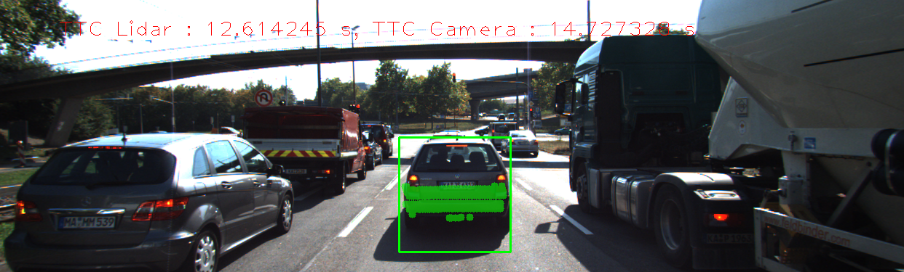

#### Observation 2: Sort the lidar points
The first implementation of `computeTTCLidar` did not sort the lidar points. This resulted in the majority of Lidar TTC estaimtes looking way off. These results can be seen in the following table.  

##### Before sorting the lidar points

Frame | Lidar points | TTC Lidar | TTC Camera
---:  | ---:  | ---:  | ---: 
1 | 340 | 9.99495 | 15.3278
2 | 309 | 46.9361 | 12.7634
3 | 326 | 8.76554 | 13.5261
4 | 322 | 13.9876 | 13.81
5 | 344 | 28.9112 | 13.0276
6 | 352 | 15.5119 | 11.426
7 | 317 | 40.7209 | 12.8408
8 | 312 | 7.13085 | 13.9921
9 | 311 | 8.57043 | 11.274
10 | 286 | 8.09783 | 35.585
11 | 302 | -43.923 | 12.7762
12 | 302 | 5.97072 | 11.5836
13 | 316 | 48.8604 | 11.4876
14 | 312 | 8.62499 | 12.2294
15 | 289 | 6.14571 | 10.225
16 | 297 | 6.82135 | 10.6857
17 | 279 | 702.551 | 10.0052
18 | 303 | 9.26663 | 10.5152

The following table shows the Lidar TTC estimates side-by-side with the Lidar top view perspective. Each marker in the top view perspective image is 2m. Clearly, the car detected in the image in frame 2 is not 46.9361 seconds away. It is approximately 8 metres away. The image in frame 17 shows an extreme example, where the Lidar TTC is 702.551 seconds, while the image shows the preceding vehicle is actually closer to 7 metres away.

Frame | Top view perspective of Lidar points showing distance markers | Image with TTC estimates from Lidar and Camera | Lidar points | TTC Lidar | TTC Camera
:---:  | :---:  | :---:  | ---:  | ---:  | ---: 
2 |  | 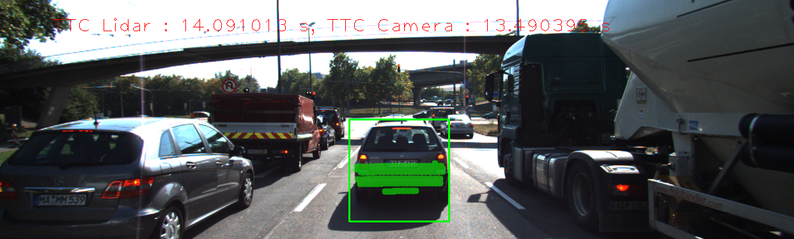 | 309 | 46.9361 | 12.7634
4 | 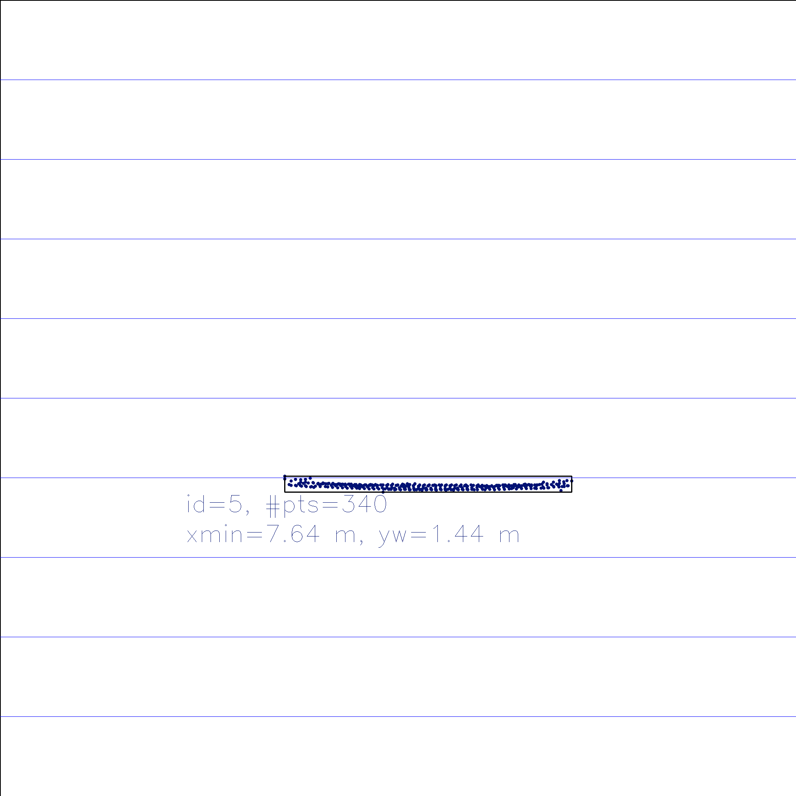 | 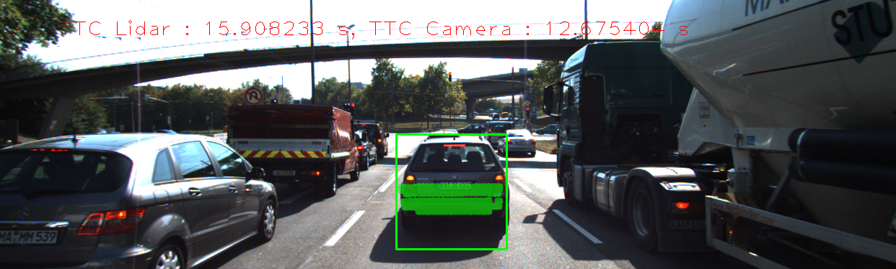 | 322 | 13.9876 | 13.81
6 |  |  | 352 | 15.5119 | 11.426
7 |  | 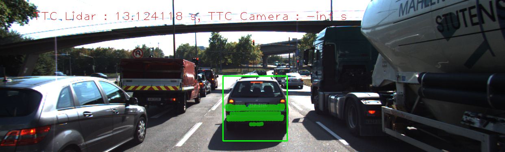 | 317 | 40.7209 | 12.8408
11 |  | 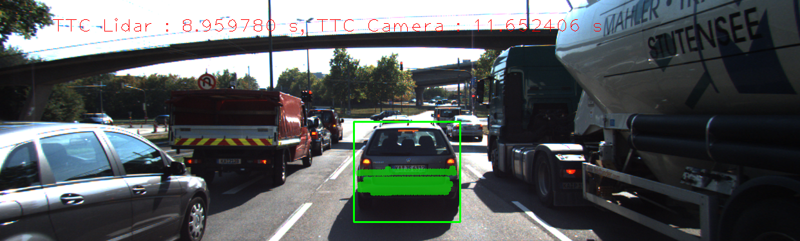 | 302 | -43.923 | 12.7762
17 |  |  | 279 | 702.551 | 10.0052


The Lidar sensor in the following scenario (image courtesy of Udacity) gives the distance to the closest 3D point in the path of driving. In the figure below, the closest point is indicated by a red line emanating from a Lidar sensor on top of the measuring vehicle.

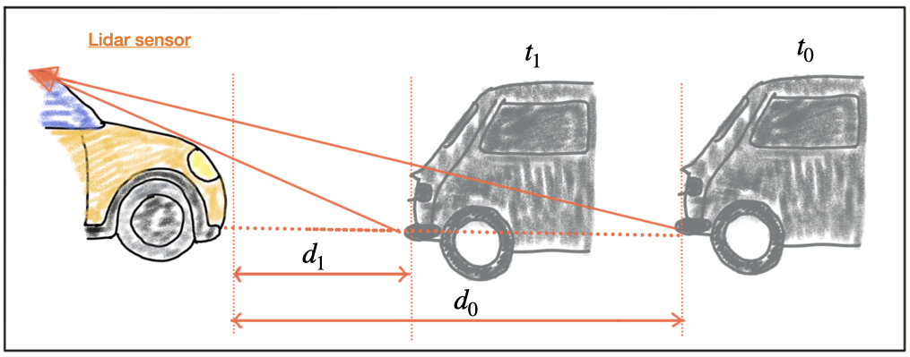

Based on the constant-velocity model, the velocity `v0` can be calculated from two successive Lidar measurements as follows  (image courtesy of Udacity):

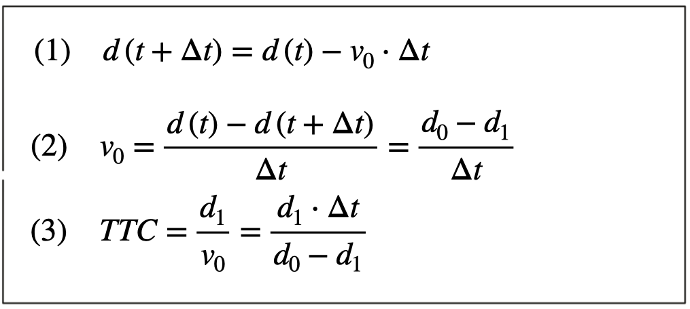

Once the relative velocity `v0` is known, the time to collision can easily be computed by dividing the remaining distance between both vehicles by `v0`.

The following table shows a set of manual calculations, based on an estimate of the distance to the rear of the preceding vehicle. It also shows manually estimating the distance to the rear of the preceding vehicle from a top view perspective of the Lidar points.

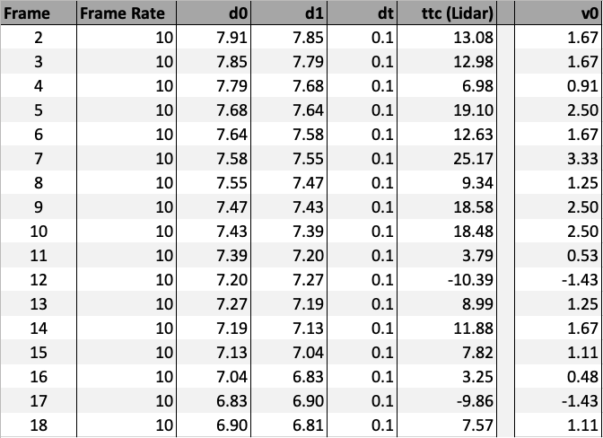

The calculations are in the [results spreadsheet](results/results.xlsx). The top view perspectives of the Lidar points for each frame are shown below, and in the [Image Results markdown file](ImageResults.md). These are used to estimate the distance to the preceding vehicle in each frame.

A graph of `v0` shows the velocity per frame:

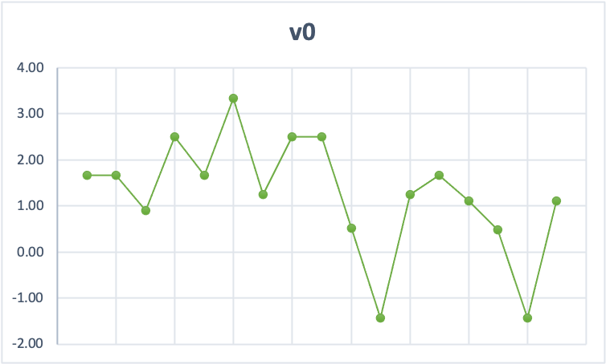

The negative velocities in frames 12 and 17 could mean the vehicle is moving backwards, but that is unlikely given that it is just one frame each time. There could be deceleration happening in general from around frame 10, which makes sense if the vehicle is approaching a red light.

#### Improving the Lidar TTC estimates 
The TTC estimates improved after sorting the lidar points on closing distance (front-to-rear bumper). This is implemented in the `computeTTCLidar` in [camFusion_Student.cpp](src/camFusion_Student.cpp):

```c++
void computeTTCLidar(std::vector<LidarPoint> & lidarPointsPreviousFrame,
                     std::vector<LidarPoint> & lidarPointsCurrentFrame,
                     double frameRate,
                     double & TTC)
{
    // Sort ascending on the x coordinate only
    std::sort(lidarPointsPreviousFrame.begin(), lidarPointsPreviousFrame.end(), [](LidarPoint a, LidarPoint b) {
        return a.x < b.x;
    }
    );
    
    std::sort(lidarPointsCurrentFrame.begin(), lidarPointsCurrentFrame.end(), [](LidarPoint a, LidarPoint b) {
        return a.x < b.x;
    }
    );
    
    /**
     Using the constant-velocity model (as opposed to a constant-acceleration model)
    
            TTC = d1 * dt / (d0 - d1);
    
     where:
            d0: the previous frame's closing distance (front-to-rear bumper)
            d1: the current frame's closing distance (front-to-rear bumper)
            dt: (delta t) the time elapsed between images (1 / frameRate)
    
     Note: this function does not take into account the distance from the lidar origin to the front bumper of our vehicle.
     It also does not account for the curvature or protrusions from the rear bumper of the preceding vehicle.
    */
    double d0 = lidarPointsPreviousFrame[lidarPointsPreviousFrame.size() / 2].x;
    double d1 = lidarPointsCurrentFrame[lidarPointsCurrentFrame.size() / 2].x;
    double dt = 1.0 / frameRate;
    
    TTC = d1 * dt / (d0 - d1);
}
```

Sorting the lidar points on the `x` dimension (distance to the preceding vehicle) before calculating the TTC produces a much better result, as can be seen in the next table.

Frame | Lidar points | TTC Lidar | TTC Camera
---:  | ---:  | ---:  | ---: 
1 | 340 | 12.5156 | 15.3278
2 | 309 | 12.6142 | 12.7634
3 | 326 | 14.091 | 13.5261
4 | 322 | 16.6894 | 13.81
5 | 344 | 15.9082 | 13.0276
6 | 352 | 12.6787 | 11.426
7 | 317 | 11.9844 | 12.8408
8 | 312 | 13.1241 | 13.9921
9 | 311 | 13.0241 | 11.274
10 | 286 | 11.1746 | 35.585
11 | 302 | 12.8086 | 12.7762
12 | 302 | 8.95978 | 11.5836
13 | 316 | 9.96439 | 11.4876
14 | 312 | 9.59863 | 12.2294
15 | 289 | 8.57352 | 10.225
16 | 297 | 9.51617 | 10.6857
17 | 279 | 9.54658 | 10.0052
18 | 303 | 8.3988 | 10.5152

Using this data, and the formulae above, we can calculate `v0`:

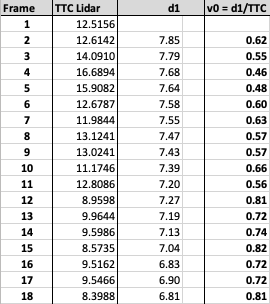

Now, when we graph `v0` the graph shows that velocity is steadily increasing. This is consistent with the TTC results in the table above: the TTC is steadily decreasing. So, as velocity is increasing, TTC is decreasing, which means we are getting steadily closer to the preceding vehicle. 

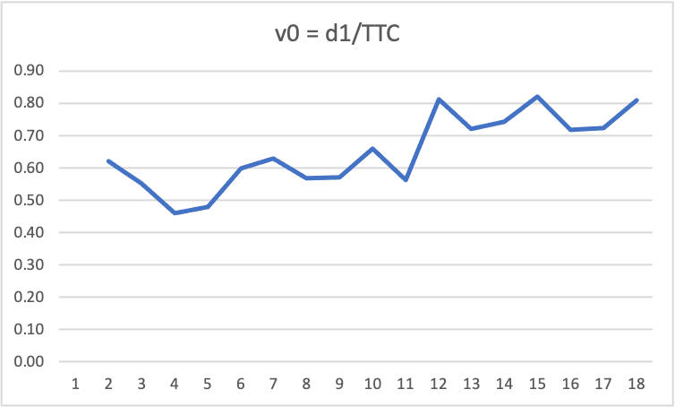

Again, these tables and graphs are in [the results spreadheet](results/results.xlsx).

## Performance Evaluation 2

This performance evaluation is about running the different detector / descriptor combinations and looking at the differences in TTC estimation. 
The goal is to find out which methods perform best and also include several examples where camera-based TTC estimation is way off. 
As with Lidar, describe your observations again and also look into potential reasons.

The task is complete once all detector / descriptor combinations implemented in previous chapters have been compared with regard to the TTC estimate on a frame-by-frame basis. To facilitate the comparison, a spreadsheet and graph should be used to represent the different TTCs.

### Notes on Performance Evaluation

The spreadsheet with all results is in the [FP6_performance_results.xlsx spreadsheet](results/FP6_performance_results.xlsx).


### Examples of detector/descriptor combinations that perform best

The following graph shows a selection of 9 detector/descriptor combinations for camera-based TTC estimation. The Lidar-based TTC estimate is shown in blue for comparison. 

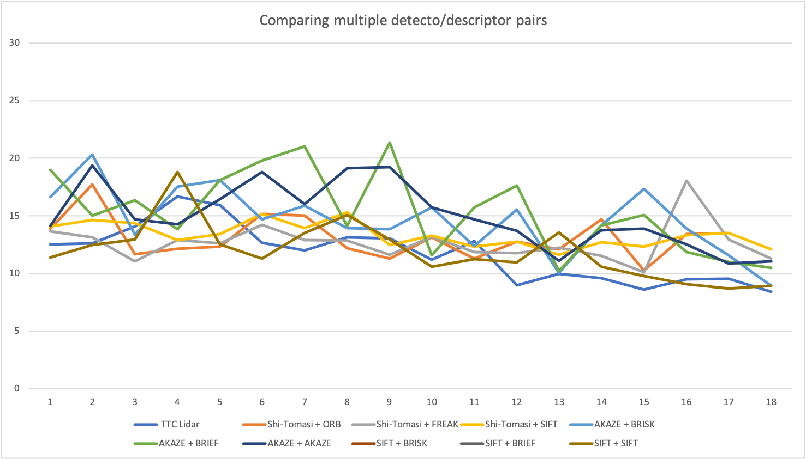

Even among these better-performing camera-based detector/descriptor combinations, several of them diverge significantly from the Lidar-based TTC around frames 4-5, and again around frames 9 and 12.


The following 3 graphs show a selection of the best-performing detector/descriptor combinations for camera-based TTC estimation.

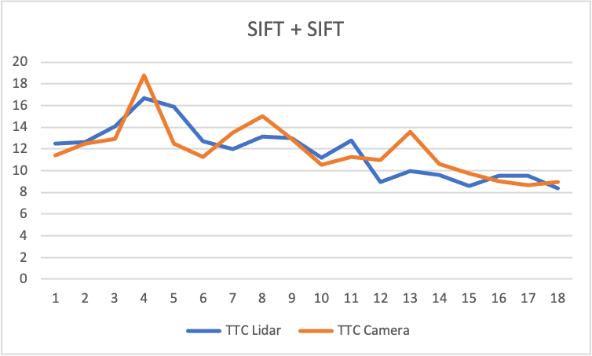

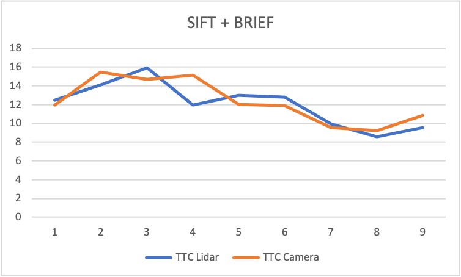

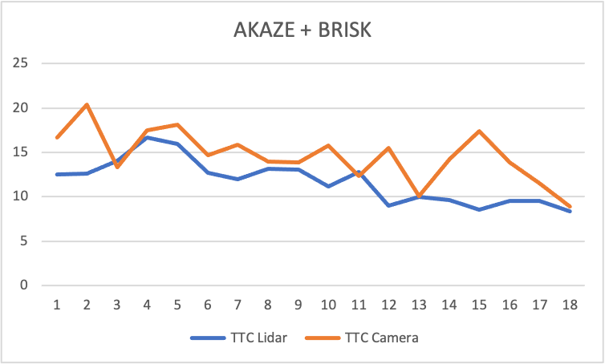


### Examples of detector/descriptor combinations where camera-based TTC estimation is way off

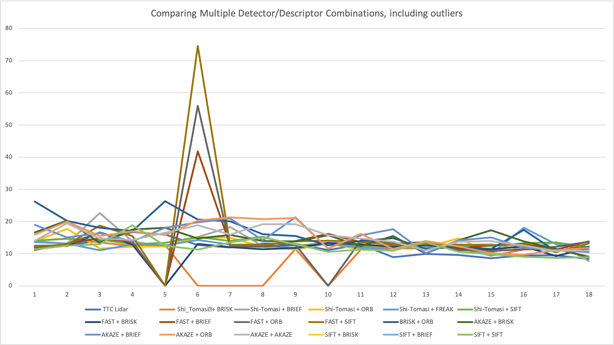

The following 3 graphs show a selection of the worst-performing detector/descriptor combinations for camera-based TTC estimation, where the camera-based TTC is way off.

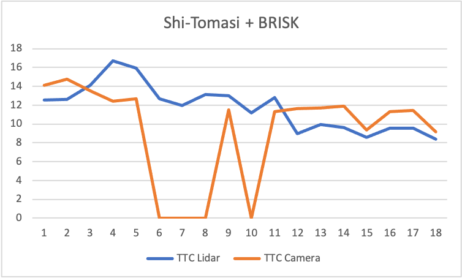

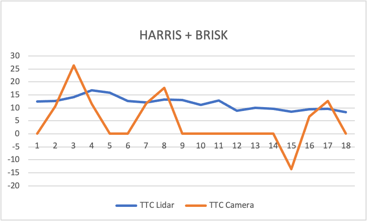

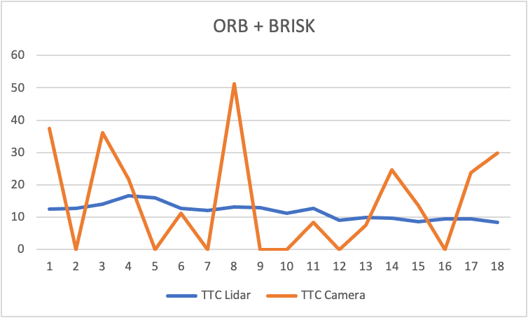

There are examples where the camera-based TTC is way off only for certain frames, but not for others. The following graphs show a selection of these detector/descriptor combinations.   

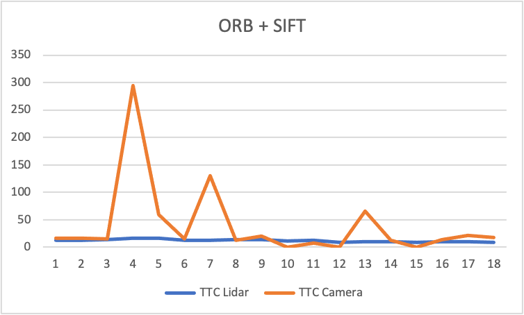

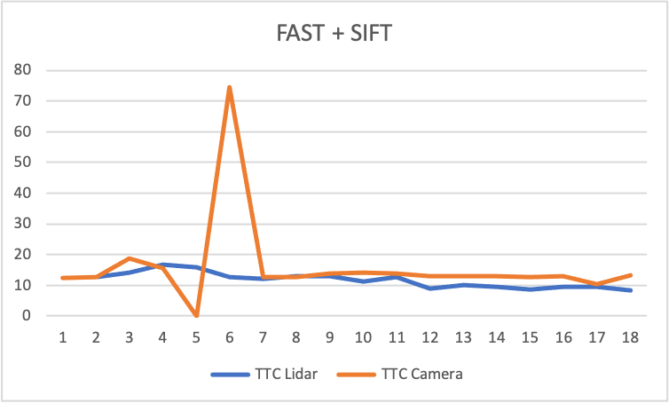

Although the camera-based TTC eventually aligns with the Lidar-based TTC in later frames, they are too inconsistent to be reliable.

# Building and Running the Project

## Dependencies for Running Locally
* cmake >= 3.1
  * All OSes: [click here for installation instructions](https://cmake.org/install/)
* make >= 4.1 (Linux, Mac), 3.81 (Windows)
  * Linux: make is installed by default on most Linux distros
  * Mac: [install Xcode command line tools to get make](https://developer.apple.com/xcode/features/)
  * Windows: [Click here for installation instructions](http://gnuwin32.sourceforge.net/packages/make.htm)
* Git LFS
  * Weight files are handled using [LFS](https://git-lfs.github.com/)
* OpenCV >= 4.5.1
  * This must be compiled from source using the `-D OPENCV_ENABLE_NONFREE=ON` cmake flag for testing the SIFT and SURF detectors.
  * The OpenCV 4.1.0 source code can be found [here](https://github.com/opencv/opencv/tree/4.1.0)
* gcc/g++ >= 5.4
  * Linux: gcc / g++ is installed by default on most Linux distros
  * Mac: same deal as make - [install Xcode command line tools](https://developer.apple.com/xcode/features/)
  * Windows: recommend using [MinGW](http://www.mingw.org/)
* Boost >= 1.75.0
  * The Boost C++ Libraries can be found [here](https://www.boost.org/)

## Basic Build Instructions

1. Clone this repo.
2. Make a build directory in the top level project directory: `mkdir build && cd build`
3. Compile: `cmake .. && make`
4. Run it: `./3D_object_tracking`.

## Notes on the Code

* The file [MidTermProject_Camera_Student.cpp](src/MidTermProject_Camera_Student.cpp) contains the `main()` function, and is the starting point for the program.
* The file [dataStructures.h](src/dataStructures.h) contains data structures used throughout the proejct code, including `DataFrame`, `KeypointDetector`, and `Hyperparameters`.
* The files [matching2D.hpp](src/matching2D.hpp) and [matching2D_Student.cpp](src/matching2D_Student.cpp) define the functions that perform keypoint detection and matching.
* The files [](src/reporting.h) and [](src/reporting.cpp) define structures and functions used to auto-generate the results in markdown format. I use these to easily generate all the performance evaluation tables, and then insert them into this README document, and into the [results spreadsheet](results/results.xlsx).

### The `main()` funciton

Rather than re-run the program manually for each detector-descriptor pair, and then manually gather the results from the console, I run the program once for all detector-descriptor pairs. The project is structured around the model of an `Experiment`. Each `Experiment` runs one detector-descriptor pair, and gathers the results. The `main()` function invokes a function called `RunExperimentSet`, which runs a set of experiments - one for each valid detector-descriptor combination.


The `main()` function defines three variables - the hyperparameters, the set of detectors to use, and the set of descriptors to use in the experiments.

```c++
int main()
{
    Hyperparameters hyperparameters = Hyperparameters();

    std::vector<string> detectors = {
            "Shi_Tomasi",
            "HARRIS",
            "FAST",
            "BRISK",
            "ORB",
            "AKAZE",
            "SIFT"
    };

    std::vector<string> descriptors = {
            "BRISK",
            "BRIEF",
            "ORB",
            "FREAK",
            "AKAZE",
            "SIFT"
    };

    // Run experiments for all combinations of detectors and descriptors
    std::vector<Experiment> experiments = RunExperimentSet(hyperparameters, detectors, descriptors);
    
    ...
    
    return 0;
}
```

To run the project for a subset of the detectors and descriptors, simply comment out the ones you do not want to run, e.g.,:
```c++
    std::vector<string> detectors = {
          "Shi_Tomasi",
//          "HARRIS",
//         "FAST",
//          "BRISK",
//          "ORB",
//          "AKAZE",
          "SIFT"
    };

    std::vector<string> descriptors = {
            "BRISK",
//            "BRIEF",
//            "ORB",
//            "FREAK",
//            "AKAZE",
            "SIFT"
    };

```
This scenario results in running a total of 4 experiments based on combinations of 2 detectors and 2 descriptors. The following tables illustrate what the results would look like for this scenario:

### Hyperparameters

The `Hyperparameters` are implemented as a `struct` in [dataStructures.h](src/dataStructures.h):

```c++
struct Hyperparameters
{
    Hyperparameters()= default;
    
    string keypointDetector = "Shi_Tomasi"; // Shi_Tomasi, HARRIS, FAST, BRISK, ORB, AKAZE, SIFT
    string descriptor = "BRIEF";                    // BRISK, BRIEF, ORB, FREAK, AKAZE, SIFT
    string matcherType = "MAT_BF";                  // MAT_BF, MAT_FLANN
    string descriptorType = "DES_BINARY";           // DES_BINARY, DES_HOG
    string selectorType = "SEL_KNN";                // SEL_NN, SEL_KNN
};
```
### Running experiments

The `RunExperimentSet()` function calls the `RunExperiment()` function one time for each valid detector-descriptor combination. The `RunExperiment()` function is where you will find much of the student assignment code.

```c++
/*
 * This function encapsulates running an experiment with a given combination of detector, descriptor, matcher,
 * descriptor type, and selector.
 */
void RunExperiment(Experiment &experiment)
{
    ...
    ...
}

```

An `Experiment` uses the `Hyperparameters` described earlier, and stores the results. It also has some configuration options that can be set via the `Experiment` struct in [reporting.h](src/reporting.h):

```c++
struct Experiment
{
    Experiment()= default;
    std::vector<ResultSet> resultSet;
    Hyperparameters hyperparameters;

    // Visualization and image saving options
    bool displayImageWindows = false;               // visualize matches between current and previous image?
    bool isFocusOnPrecedingVehicleOnly = true;      // only keep keypoints on the preceding vehicle?
    bool saveKeypointDetectionImagesToFile = true;  // save keypoint detection images to file
    bool saveKeypointMatchImagesToFile = true;      // save keypoint matching images to file
};
```

The confiuration shown above means that the image windows are not displayed when running the program. This allows a set of experiments to run quickly without needing any human intervention. If you want to see the images during an experiment run, then set the `displayImageWindows` variable to `true`:
```c++
struct Experiment
{
...
    bool displayImageWindows = true;               // visualize matches between current and previous image?
...
};
```


# References
* Rangesh, A. and Trivedi, M.M., 2019. [_No blind spots: Full-surround multi-object tracking for autonomous vehicles using cameras and lidars_](https://arxiv.org/pdf/1802.08755). IEEE Transactions on Intelligent Vehicles, 4(4), pp.588-599.
* Kilicarslan, M. and Zheng, J.Y., 2018. [_Predict vehicle collision by TTC from motion using a single video camera_](https://ieeexplore.ieee.org/abstract/document/8360483). IEEE Transactions on Intelligent Transportation Systems, 20(2), pp.522-533.
* Huang, J.K. and Grizzle, J.W., 2019. [_Improvements to Target-Based 3D LiDAR to Camera Calibration_](https://arxiv.org/pdf/1910.03126.pdf). arXiv preprint arXiv:1910.03126.
* Raphael, E., Kiefer, R., Reisman, P. and Hayon, G., 2011. _Development of a camera-based forward collision alert system_. SAE International Journal of Passenger Cars-Mechanical Systems, 4(2011-01-0579), pp.467-478.
* Jan Gaspar. [_Chapter 7. Boost.Circular Buffer_](https://www.boost.org/doc/libs/1_61_0/doc/html/circular_buffer.html). [Boost C++ Libraries](https://www.boost.org/).
* StackOverflow. [_How to link C++ program with Boost using CMake_](https://stackoverflow.com/questions/3897839/how-to-link-c-program-with-boost-using-cmake).

# Additional Project Files
This repository contains the following additional files:
