#Program Output
```shell

*** RUNNING EXPERIMENT 0 WITH detector = Shi_Tomasi  and descriptor = BRISK ***
#1 : LOAD IMAGE INTO BUFFER done
#2 : DETECT & CLASSIFY OBJECTS done
#3 : CROP LIDAR POINTS done
#4 : CLUSTER LIDAR POINT CLOUD done
Shi-Tomasi detection with n=1723 keypoints in 10.4172 ms
#5 : DETECT KEYPOINTS done
BRISK descriptor extraction in 13.806 ms
#6 : EXTRACT DESCRIPTORS done
#1 : LOAD IMAGE INTO BUFFER done
#2 : DETECT & CLASSIFY OBJECTS done
#3 : CROP LIDAR POINTS done
#4 : CLUSTER LIDAR POINT CLOUD done
Shi-Tomasi detection with n=1759 keypoints in 12.2472 ms
#5 : DETECT KEYPOINTS done
BRISK descriptor extraction in 13.3305 ms
#6 : EXTRACT DESCRIPTORS done
 (KNN) with n=1630 matches in 4.75019 ms; matches = 797, KNN matches = 1630 => keypoints removed = 833 (51.1043%)
ALL OK
Result Line Item
Frame: 0
TTC Lidar: 0
TTC Camera: 0
Lidar Points: 0
--- Experiment Details --- 
Number of results: 0
Hyperparpameters: 
  -- Detector:	Shi_Tomasi
  -- Descriptor:	BRISK
  -- Matcher Type:	MAT_BF
  -- Descriptor Type:	DES_BINARY
  -- Selector Type:	SEL_KNN
Visualization Settings: 
  -- Display Image Windows:		0
  -- Focus on Preceding Vehicle Only:		1
  -- Save Keypoint Detection Images:		0
  -- Save Keypoint Matching Images:		1
#7 : MATCH KEYPOINT DESCRIPTORS done
#8 : TRACK 3D OBJECT BOUNDING BOXES done
#1 : LOAD IMAGE INTO BUFFER done
#2 : DETECT & CLASSIFY OBJECTS done
#3 : CROP LIDAR POINTS done
#4 : CLUSTER LIDAR POINT CLOUD done
Shi-Tomasi detection with n=1820 keypoints in 21.679 ms
#5 : DETECT KEYPOINTS done
BRISK descriptor extraction in 14.1133 ms
#6 : EXTRACT DESCRIPTORS done
 (KNN) with n=1662 matches in 4.99258 ms; matches = 779, KNN matches = 1662 => keypoints removed = 883 (53.1288%)
ALL OK
Result Line Item
Frame: 1
TTC Lidar: 12.5156
TTC Camera: 14.1119
Lidar Points: 340
--- Experiment Details --- 
Number of results: 0
Hyperparpameters: 
  -- Detector:	Shi_Tomasi
  -- Descriptor:	BRISK
  -- Matcher Type:	MAT_BF
  -- Descriptor Type:	DES_BINARY
  -- Selector Type:	SEL_KNN
Visualization Settings: 
  -- Display Image Windows:		0
  -- Focus on Preceding Vehicle Only:		1
  -- Save Keypoint Detection Images:		0
  -- Save Keypoint Matching Images:		1
#7 : MATCH KEYPOINT DESCRIPTORS done
#8 : TRACK 3D OBJECT BOUNDING BOXES done
#1 : LOAD IMAGE INTO BUFFER done
#2 : DETECT & CLASSIFY OBJECTS done
#3 : CROP LIDAR POINTS done
#4 : CLUSTER LIDAR POINT CLOUD done
Shi-Tomasi detection with n=1850 keypoints in 11.4678 ms
#5 : DETECT KEYPOINTS done
BRISK descriptor extraction in 14.3078 ms
#6 : EXTRACT DESCRIPTORS done
 (KNN) with n=1717 matches in 5.17337 ms; matches = 843, KNN matches = 1717 => keypoints removed = 874 (50.9027%)
ALL OK
Result Line Item
Frame: 2
TTC Lidar: 12.6142
TTC Camera: 14.7273
Lidar Points: 309
--- Experiment Details --- 
Number of results: 0
Hyperparpameters: 
  -- Detector:	Shi_Tomasi
  -- Descriptor:	BRISK
  -- Matcher Type:	MAT_BF
  -- Descriptor Type:	DES_BINARY
  -- Selector Type:	SEL_KNN
Visualization Settings: 
  -- Display Image Windows:		0
  -- Focus on Preceding Vehicle Only:		1
  -- Save Keypoint Detection Images:		0
  -- Save Keypoint Matching Images:		1
#7 : MATCH KEYPOINT DESCRIPTORS done
#8 : TRACK 3D OBJECT BOUNDING BOXES done
#1 : LOAD IMAGE INTO BUFFER done
#2 : DETECT & CLASSIFY OBJECTS done
#3 : CROP LIDAR POINTS done
#4 : CLUSTER LIDAR POINT CLOUD done
Shi-Tomasi detection with n=1828 keypoints in 19.9968 ms
#5 : DETECT KEYPOINTS done
BRISK descriptor extraction in 14.3482 ms
#6 : EXTRACT DESCRIPTORS done
 (KNN) with n=1752 matches in 5.53657 ms; matches = 792, KNN matches = 1752 => keypoints removed = 960 (54.7945%)
ALL OK
Result Line Item
Frame: 3
TTC Lidar: 14.091
TTC Camera: 13.4904
Lidar Points: 326
--- Experiment Details --- 
Number of results: 0
Hyperparpameters: 
  -- Detector:	Shi_Tomasi
  -- Descriptor:	BRISK
  -- Matcher Type:	MAT_BF
  -- Descriptor Type:	DES_BINARY
  -- Selector Type:	SEL_KNN
Visualization Settings: 
  -- Display Image Windows:		0
  -- Focus on Preceding Vehicle Only:		1
  -- Save Keypoint Detection Images:		0
  -- Save Keypoint Matching Images:		1
#7 : MATCH KEYPOINT DESCRIPTORS done
#8 : TRACK 3D OBJECT BOUNDING BOXES done
#1 : LOAD IMAGE INTO BUFFER done
#2 : DETECT & CLASSIFY OBJECTS done
#3 : CROP LIDAR POINTS done
#4 : CLUSTER LIDAR POINT CLOUD done
Shi-Tomasi detection with n=1806 keypoints in 17.8797 ms
#5 : DETECT KEYPOINTS done
BRISK descriptor extraction in 18.8619 ms
#6 : EXTRACT DESCRIPTORS done
 (KNN) with n=1729 matches in 5.02537 ms; matches = 817, KNN matches = 1729 => keypoints removed = 912 (52.7473%)
ALL OK
Result Line Item
Frame: 4
TTC Lidar: 16.6894
TTC Camera: 12.398
Lidar Points: 322
--- Experiment Details --- 
Number of results: 0
Hyperparpameters: 
  -- Detector:	Shi_Tomasi
  -- Descriptor:	BRISK
  -- Matcher Type:	MAT_BF
  -- Descriptor Type:	DES_BINARY
  -- Selector Type:	SEL_KNN
Visualization Settings: 
  -- Display Image Windows:		0
  -- Focus on Preceding Vehicle Only:		1
  -- Save Keypoint Detection Images:		0
  -- Save Keypoint Matching Images:		1
#7 : MATCH KEYPOINT DESCRIPTORS done
#8 : TRACK 3D OBJECT BOUNDING BOXES done
#1 : LOAD IMAGE INTO BUFFER done
#2 : DETECT & CLASSIFY OBJECTS done
#3 : CROP LIDAR POINTS done
#4 : CLUSTER LIDAR POINT CLOUD done
Shi-Tomasi detection with n=1877 keypoints in 11.3183 ms
#5 : DETECT KEYPOINTS done
BRISK descriptor extraction in 23.1542 ms
#6 : EXTRACT DESCRIPTORS done
 (KNN) with n=1689 matches in 5.51165 ms; matches = 805, KNN matches = 1689 => keypoints removed = 884 (52.3387%)
ALL OK
Result Line Item
Frame: 5
TTC Lidar: 15.9082
TTC Camera: 12.6754
Lidar Points: 344
--- Experiment Details --- 
Number of results: 0
Hyperparpameters: 
  -- Detector:	Shi_Tomasi
  -- Descriptor:	BRISK
  -- Matcher Type:	MAT_BF
  -- Descriptor Type:	DES_BINARY
  -- Selector Type:	SEL_KNN
Visualization Settings: 
  -- Display Image Windows:		0
  -- Focus on Preceding Vehicle Only:		1
  -- Save Keypoint Detection Images:		0
  -- Save Keypoint Matching Images:		1
#7 : MATCH KEYPOINT DESCRIPTORS done
#8 : TRACK 3D OBJECT BOUNDING BOXES done
#1 : LOAD IMAGE INTO BUFFER done
#2 : DETECT & CLASSIFY OBJECTS done
#3 : CROP LIDAR POINTS done
#4 : CLUSTER LIDAR POINT CLOUD done
Shi-Tomasi detection with n=1894 keypoints in 27.0717 ms
#5 : DETECT KEYPOINTS done
BRISK descriptor extraction in 53.071 ms
#6 : EXTRACT DESCRIPTORS done
 (KNN) with n=1736 matches in 5.38366 ms; matches = 780, KNN matches = 1736 => keypoints removed = 956 (55.0691%)
ALL OK
Result Line Item
Frame: 6
TTC Lidar: 12.6787
TTC Camera: -inf
Lidar Points: 352
--- Experiment Details --- 
Number of results: 0
Hyperparpameters: 
  -- Detector:	Shi_Tomasi
  -- Descriptor:	BRISK
  -- Matcher Type:	MAT_BF
  -- Descriptor Type:	DES_BINARY
  -- Selector Type:	SEL_KNN
Visualization Settings: 
  -- Display Image Windows:		0
  -- Focus on Preceding Vehicle Only:		1
  -- Save Keypoint Detection Images:		0
  -- Save Keypoint Matching Images:		1
#7 : MATCH KEYPOINT DESCRIPTORS done
#8 : TRACK 3D OBJECT BOUNDING BOXES done
#1 : LOAD IMAGE INTO BUFFER done
#2 : DETECT & CLASSIFY OBJECTS done
#3 : CROP LIDAR POINTS done
#4 : CLUSTER LIDAR POINT CLOUD done
Shi-Tomasi detection with n=1889 keypoints in 17.0788 ms
#5 : DETECT KEYPOINTS done
BRISK descriptor extraction in 24.721 ms
#6 : EXTRACT DESCRIPTORS done
 (KNN) with n=1758 matches in 9.11397 ms; matches = 850, KNN matches = 1758 => keypoints removed = 908 (51.6496%)
ALL OK
Result Line Item
Frame: 7
TTC Lidar: 11.9844
TTC Camera: -inf
Lidar Points: 317
--- Experiment Details --- 
Number of results: 0
Hyperparpameters: 
  -- Detector:	Shi_Tomasi
  -- Descriptor:	BRISK
  -- Matcher Type:	MAT_BF
  -- Descriptor Type:	DES_BINARY
  -- Selector Type:	SEL_KNN
Visualization Settings: 
  -- Display Image Windows:		0
  -- Focus on Preceding Vehicle Only:		1
  -- Save Keypoint Detection Images:		0
  -- Save Keypoint Matching Images:		1
#7 : MATCH KEYPOINT DESCRIPTORS done
#8 : TRACK 3D OBJECT BOUNDING BOXES done
#1 : LOAD IMAGE INTO BUFFER done
#2 : DETECT & CLASSIFY OBJECTS done
#3 : CROP LIDAR POINTS done
#4 : CLUSTER LIDAR POINT CLOUD done
Shi-Tomasi detection with n=1917 keypoints in 30.8896 ms
#5 : DETECT KEYPOINTS done
BRISK descriptor extraction in 14.1574 ms
#6 : EXTRACT DESCRIPTORS done
 (KNN) with n=1757 matches in 6.06463 ms; matches = 842, KNN matches = 1757 => keypoints removed = 915 (52.0774%)
ALL OK
Result Line Item
Frame: 8
TTC Lidar: 13.1241
TTC Camera: -inf
Lidar Points: 312
--- Experiment Details --- 
Number of results: 0
Hyperparpameters: 
  -- Detector:	Shi_Tomasi
  -- Descriptor:	BRISK
  -- Matcher Type:	MAT_BF
  -- Descriptor Type:	DES_BINARY
  -- Selector Type:	SEL_KNN
Visualization Settings: 
  -- Display Image Windows:		0
  -- Focus on Preceding Vehicle Only:		1
  -- Save Keypoint Detection Images:		0
  -- Save Keypoint Matching Images:		1
#7 : MATCH KEYPOINT DESCRIPTORS done
#8 : TRACK 3D OBJECT BOUNDING BOXES done
#1 : LOAD IMAGE INTO BUFFER done
#2 : DETECT & CLASSIFY OBJECTS done
#3 : CROP LIDAR POINTS done
#4 : CLUSTER LIDAR POINT CLOUD done
Shi-Tomasi detection with n=1874 keypoints in 25.4375 ms
#5 : DETECT KEYPOINTS done
BRISK descriptor extraction in 23.268 ms
#6 : EXTRACT DESCRIPTORS done
 (KNN) with n=1778 matches in 8.08757 ms; matches = 832, KNN matches = 1778 => keypoints removed = 946 (53.2058%)
ALL OK
Result Line Item
Frame: 9
TTC Lidar: 13.0241
TTC Camera: 11.5126
Lidar Points: 311
--- Experiment Details --- 
Number of results: 0
Hyperparpameters: 
  -- Detector:	Shi_Tomasi
  -- Descriptor:	BRISK
  -- Matcher Type:	MAT_BF
  -- Descriptor Type:	DES_BINARY
  -- Selector Type:	SEL_KNN
Visualization Settings: 
  -- Display Image Windows:		0
  -- Focus on Preceding Vehicle Only:		1
  -- Save Keypoint Detection Images:		0
  -- Save Keypoint Matching Images:		1
#7 : MATCH KEYPOINT DESCRIPTORS done
#8 : TRACK 3D OBJECT BOUNDING BOXES done
#1 : LOAD IMAGE INTO BUFFER done
#2 : DETECT & CLASSIFY OBJECTS done
#3 : CROP LIDAR POINTS done
#4 : CLUSTER LIDAR POINT CLOUD done
Shi-Tomasi detection with n=1912 keypoints in 24.338 ms
#5 : DETECT KEYPOINTS done
BRISK descriptor extraction in 21.5542 ms
#6 : EXTRACT DESCRIPTORS done
 (KNN) with n=1739 matches in 5.43194 ms; matches = 857, KNN matches = 1739 => keypoints removed = 882 (50.7188%)
ALL OK
Result Line Item
Frame: 10
TTC Lidar: 11.1746
TTC Camera: -inf
Lidar Points: 286
--- Experiment Details --- 
Number of results: 0
Hyperparpameters: 
  -- Detector:	Shi_Tomasi
  -- Descriptor:	BRISK
  -- Matcher Type:	MAT_BF
  -- Descriptor Type:	DES_BINARY
  -- Selector Type:	SEL_KNN
Visualization Settings: 
  -- Display Image Windows:		0
  -- Focus on Preceding Vehicle Only:		1
  -- Save Keypoint Detection Images:		0
  -- Save Keypoint Matching Images:		1
#7 : MATCH KEYPOINT DESCRIPTORS done
#8 : TRACK 3D OBJECT BOUNDING BOXES done
#1 : LOAD IMAGE INTO BUFFER done
#2 : DETECT & CLASSIFY OBJECTS done
#3 : CROP LIDAR POINTS done
#4 : CLUSTER LIDAR POINT CLOUD done
Shi-Tomasi detection with n=1930 keypoints in 13.6664 ms
#5 : DETECT KEYPOINTS done
BRISK descriptor extraction in 27.5776 ms
#6 : EXTRACT DESCRIPTORS done
 (KNN) with n=1787 matches in 5.49249 ms; matches = 849, KNN matches = 1787 => keypoints removed = 938 (52.4902%)
ALL OK
Result Line Item
Frame: 11
TTC Lidar: 12.8086
TTC Camera: 11.3024
Lidar Points: 302
--- Experiment Details --- 
Number of results: 0
Hyperparpameters: 
  -- Detector:	Shi_Tomasi
  -- Descriptor:	BRISK
  -- Matcher Type:	MAT_BF
  -- Descriptor Type:	DES_BINARY
  -- Selector Type:	SEL_KNN
Visualization Settings: 
  -- Display Image Windows:		0
  -- Focus on Preceding Vehicle Only:		1
  -- Save Keypoint Detection Images:		0
  -- Save Keypoint Matching Images:		1
#7 : MATCH KEYPOINT DESCRIPTORS done
#8 : TRACK 3D OBJECT BOUNDING BOXES done
#1 : LOAD IMAGE INTO BUFFER done
#2 : DETECT & CLASSIFY OBJECTS done
#3 : CROP LIDAR POINTS done
#4 : CLUSTER LIDAR POINT CLOUD done
Shi-Tomasi detection with n=1881 keypoints in 12.8574 ms
#5 : DETECT KEYPOINTS done
BRISK descriptor extraction in 23.281 ms
#6 : EXTRACT DESCRIPTORS done
 (KNN) with n=1794 matches in 5.92617 ms; matches = 884, KNN matches = 1794 => keypoints removed = 910 (50.7246%)
ALL OK
Result Line Item
Frame: 12
TTC Lidar: 8.95978
TTC Camera: 11.6524
Lidar Points: 302
--- Experiment Details --- 
Number of results: 0
Hyperparpameters: 
  -- Detector:	Shi_Tomasi
  -- Descriptor:	BRISK
  -- Matcher Type:	MAT_BF
  -- Descriptor Type:	DES_BINARY
  -- Selector Type:	SEL_KNN
Visualization Settings: 
  -- Display Image Windows:		0
  -- Focus on Preceding Vehicle Only:		1
  -- Save Keypoint Detection Images:		0
  -- Save Keypoint Matching Images:		1
#7 : MATCH KEYPOINT DESCRIPTORS done
#8 : TRACK 3D OBJECT BOUNDING BOXES done
#1 : LOAD IMAGE INTO BUFFER done
#2 : DETECT & CLASSIFY OBJECTS done
#3 : CROP LIDAR POINTS done
#4 : CLUSTER LIDAR POINT CLOUD done
Shi-Tomasi detection with n=1886 keypoints in 14.448 ms
#5 : DETECT KEYPOINTS done
BRISK descriptor extraction in 24.3019 ms
#6 : EXTRACT DESCRIPTORS done
 (KNN) with n=1769 matches in 9.2818 ms; matches = 889, KNN matches = 1769 => keypoints removed = 880 (49.7456%)
ALL OK
Result Line Item
Frame: 13
TTC Lidar: 9.96439
TTC Camera: 11.7243
Lidar Points: 316
--- Experiment Details --- 
Number of results: 0
Hyperparpameters: 
  -- Detector:	Shi_Tomasi
  -- Descriptor:	BRISK
  -- Matcher Type:	MAT_BF
  -- Descriptor Type:	DES_BINARY
  -- Selector Type:	SEL_KNN
Visualization Settings: 
  -- Display Image Windows:		0
  -- Focus on Preceding Vehicle Only:		1
  -- Save Keypoint Detection Images:		0
  -- Save Keypoint Matching Images:		1
#7 : MATCH KEYPOINT DESCRIPTORS done
#8 : TRACK 3D OBJECT BOUNDING BOXES done
#1 : LOAD IMAGE INTO BUFFER done
#2 : DETECT & CLASSIFY OBJECTS done
#3 : CROP LIDAR POINTS done
#4 : CLUSTER LIDAR POINT CLOUD done
Shi-Tomasi detection with n=1957 keypoints in 19.9937 ms
#5 : DETECT KEYPOINTS done
BRISK descriptor extraction in 20.8257 ms
#6 : EXTRACT DESCRIPTORS done
 (KNN) with n=1776 matches in 13.2057 ms; matches = 906, KNN matches = 1776 => keypoints removed = 870 (48.9865%)
ALL OK
Result Line Item
Frame: 14
TTC Lidar: 9.59863
TTC Camera: 11.8781
Lidar Points: 312
--- Experiment Details --- 
Number of results: 0
Hyperparpameters: 
  -- Detector:	Shi_Tomasi
  -- Descriptor:	BRISK
  -- Matcher Type:	MAT_BF
  -- Descriptor Type:	DES_BINARY
  -- Selector Type:	SEL_KNN
Visualization Settings: 
  -- Display Image Windows:		0
  -- Focus on Preceding Vehicle Only:		1
  -- Save Keypoint Detection Images:		0
  -- Save Keypoint Matching Images:		1
#7 : MATCH KEYPOINT DESCRIPTORS done
#8 : TRACK 3D OBJECT BOUNDING BOXES done
#1 : LOAD IMAGE INTO BUFFER done
#2 : DETECT & CLASSIFY OBJECTS done
#3 : CROP LIDAR POINTS done
#4 : CLUSTER LIDAR POINT CLOUD done
Shi-Tomasi detection with n=1888 keypoints in 35.2195 ms
#5 : DETECT KEYPOINTS done
BRISK descriptor extraction in 18.0936 ms
#6 : EXTRACT DESCRIPTORS done
 (KNN) with n=1849 matches in 6.52852 ms; matches = 878, KNN matches = 1849 => keypoints removed = 971 (52.5149%)
ALL OK
Result Line Item
Frame: 15
TTC Lidar: 8.57352
TTC Camera: 9.33785
Lidar Points: 289
--- Experiment Details --- 
Number of results: 0
Hyperparpameters: 
  -- Detector:	Shi_Tomasi
  -- Descriptor:	BRISK
  -- Matcher Type:	MAT_BF
  -- Descriptor Type:	DES_BINARY
  -- Selector Type:	SEL_KNN
Visualization Settings: 
  -- Display Image Windows:		0
  -- Focus on Preceding Vehicle Only:		1
  -- Save Keypoint Detection Images:		0
  -- Save Keypoint Matching Images:		1
#7 : MATCH KEYPOINT DESCRIPTORS done
#8 : TRACK 3D OBJECT BOUNDING BOXES done
#1 : LOAD IMAGE INTO BUFFER done
#2 : DETECT & CLASSIFY OBJECTS done
#3 : CROP LIDAR POINTS done
#4 : CLUSTER LIDAR POINT CLOUD done
Shi-Tomasi detection with n=1919 keypoints in 14.5742 ms
#5 : DETECT KEYPOINTS done
BRISK descriptor extraction in 16.3115 ms
#6 : EXTRACT DESCRIPTORS done
 (KNN) with n=1778 matches in 9.30984 ms; matches = 914, KNN matches = 1778 => keypoints removed = 864 (48.5939%)
ALL OK
Result Line Item
Frame: 16
TTC Lidar: 9.51617
TTC Camera: 11.3079
Lidar Points: 297
--- Experiment Details --- 
Number of results: 0
Hyperparpameters: 
  -- Detector:	Shi_Tomasi
  -- Descriptor:	BRISK
  -- Matcher Type:	MAT_BF
  -- Descriptor Type:	DES_BINARY
  -- Selector Type:	SEL_KNN
Visualization Settings: 
  -- Display Image Windows:		0
  -- Focus on Preceding Vehicle Only:		1
  -- Save Keypoint Detection Images:		0
  -- Save Keypoint Matching Images:		1
#7 : MATCH KEYPOINT DESCRIPTORS done
#8 : TRACK 3D OBJECT BOUNDING BOXES done
#1 : LOAD IMAGE INTO BUFFER done
#2 : DETECT & CLASSIFY OBJECTS done
#3 : CROP LIDAR POINTS done
#4 : CLUSTER LIDAR POINT CLOUD done
Shi-Tomasi detection with n=2057 keypoints in 19.4417 ms
#5 : DETECT KEYPOINTS done
BRISK descriptor extraction in 19.3348 ms
#6 : EXTRACT DESCRIPTORS done
 (KNN) with n=1815 matches in 13.2346 ms; matches = 960, KNN matches = 1815 => keypoints removed = 855 (47.1074%)
ALL OK
Result Line Item
Frame: 17
TTC Lidar: 9.54658
TTC Camera: 11.4487
Lidar Points: 279
--- Experiment Details --- 
Number of results: 0
Hyperparpameters: 
  -- Detector:	Shi_Tomasi
  -- Descriptor:	BRISK
  -- Matcher Type:	MAT_BF
  -- Descriptor Type:	DES_BINARY
  -- Selector Type:	SEL_KNN
Visualization Settings: 
  -- Display Image Windows:		0
  -- Focus on Preceding Vehicle Only:		1
  -- Save Keypoint Detection Images:		0
  -- Save Keypoint Matching Images:		1
#7 : MATCH KEYPOINT DESCRIPTORS done
#8 : TRACK 3D OBJECT BOUNDING BOXES done

*** RUNNING EXPERIMENT 1 WITH detector = Shi_Tomasi  and descriptor = BRIEF ***
#1 : LOAD IMAGE INTO BUFFER done
#2 : DETECT & CLASSIFY OBJECTS done
#3 : CROP LIDAR POINTS done
#4 : CLUSTER LIDAR POINT CLOUD done
Shi-Tomasi detection with n=1723 keypoints in 25.7997 ms
#5 : DETECT KEYPOINTS done
BRIEF descriptor extraction in 3.19584 ms
#6 : EXTRACT DESCRIPTORS done
#1 : LOAD IMAGE INTO BUFFER done
#2 : DETECT & CLASSIFY OBJECTS done
#3 : CROP LIDAR POINTS done
#4 : CLUSTER LIDAR POINT CLOUD done
Shi-Tomasi detection with n=1759 keypoints in 30.5871 ms
#5 : DETECT KEYPOINTS done
BRIEF descriptor extraction in 4.48777 ms
#6 : EXTRACT DESCRIPTORS done
 (KNN) with n=1534 matches in 5.75602 ms; matches = 1148, KNN matches = 1534 => keypoints removed = 386 (25.163%)
ALL OK
Result Line Item
Frame: 0
TTC Lidar: 0
TTC Camera: 0
Lidar Points: 0
--- Experiment Details --- 
Number of results: 0
Hyperparpameters: 
  -- Detector:	Shi_Tomasi
  -- Descriptor:	BRIEF
  -- Matcher Type:	MAT_BF
  -- Descriptor Type:	DES_BINARY
  -- Selector Type:	SEL_KNN
Visualization Settings: 
  -- Display Image Windows:		0
  -- Focus on Preceding Vehicle Only:		1
  -- Save Keypoint Detection Images:		0
  -- Save Keypoint Matching Images:		1
#7 : MATCH KEYPOINT DESCRIPTORS done
#8 : TRACK 3D OBJECT BOUNDING BOXES done
#1 : LOAD IMAGE INTO BUFFER done
#2 : DETECT & CLASSIFY OBJECTS done
#3 : CROP LIDAR POINTS done
#4 : CLUSTER LIDAR POINT CLOUD done
Shi-Tomasi detection with n=1820 keypoints in 15.7346 ms
#5 : DETECT KEYPOINTS done
BRIEF descriptor extraction in 3.0146 ms
#6 : EXTRACT DESCRIPTORS done
 (KNN) with n=1564 matches in 4.47254 ms; matches = 1167, KNN matches = 1564 => keypoints removed = 397 (25.3836%)
ALL OK
Result Line Item
Frame: 1
TTC Lidar: 12.5156
TTC Camera: 13.8948
Lidar Points: 340
--- Experiment Details --- 
Number of results: 0
Hyperparpameters: 
  -- Detector:	Shi_Tomasi
  -- Descriptor:	BRIEF
  -- Matcher Type:	MAT_BF
  -- Descriptor Type:	DES_BINARY
  -- Selector Type:	SEL_KNN
Visualization Settings: 
  -- Display Image Windows:		0
  -- Focus on Preceding Vehicle Only:		1
  -- Save Keypoint Detection Images:		0
  -- Save Keypoint Matching Images:		1
#7 : MATCH KEYPOINT DESCRIPTORS done
#8 : TRACK 3D OBJECT BOUNDING BOXES done
#1 : LOAD IMAGE INTO BUFFER done
#2 : DETECT & CLASSIFY OBJECTS done
#3 : CROP LIDAR POINTS done
#4 : CLUSTER LIDAR POINT CLOUD done
Shi-Tomasi detection with n=1850 keypoints in 37.9535 ms
#5 : DETECT KEYPOINTS done
BRIEF descriptor extraction in 3.17496 ms
#6 : EXTRACT DESCRIPTORS done
 (KNN) with n=1621 matches in 5.21714 ms; matches = 1221, KNN matches = 1621 => keypoints removed = 400 (24.6761%)
ALL OK
Result Line Item
Frame: 2
TTC Lidar: 12.6142
TTC Camera: 13.1487
Lidar Points: 309
--- Experiment Details --- 
Number of results: 0
Hyperparpameters: 
  -- Detector:	Shi_Tomasi
  -- Descriptor:	BRIEF
  -- Matcher Type:	MAT_BF
  -- Descriptor Type:	DES_BINARY
  -- Selector Type:	SEL_KNN
Visualization Settings: 
  -- Display Image Windows:		0
  -- Focus on Preceding Vehicle Only:		1
  -- Save Keypoint Detection Images:		0
  -- Save Keypoint Matching Images:		1
#7 : MATCH KEYPOINT DESCRIPTORS done
#8 : TRACK 3D OBJECT BOUNDING BOXES done
#1 : LOAD IMAGE INTO BUFFER done
#2 : DETECT & CLASSIFY OBJECTS done
#3 : CROP LIDAR POINTS done
#4 : CLUSTER LIDAR POINT CLOUD done
Shi-Tomasi detection with n=1828 keypoints in 13.398 ms
#5 : DETECT KEYPOINTS done
BRIEF descriptor extraction in 5.62616 ms
#6 : EXTRACT DESCRIPTORS done
 (KNN) with n=1652 matches in 6.088 ms; matches = 1210, KNN matches = 1652 => keypoints removed = 442 (26.7554%)
ALL OK
Result Line Item
Frame: 3
TTC Lidar: 14.091
TTC Camera: 22.6781
Lidar Points: 326
--- Experiment Details --- 
Number of results: 0
Hyperparpameters: 
  -- Detector:	Shi_Tomasi
  -- Descriptor:	BRIEF
  -- Matcher Type:	MAT_BF
  -- Descriptor Type:	DES_BINARY
  -- Selector Type:	SEL_KNN
Visualization Settings: 
  -- Display Image Windows:		0
  -- Focus on Preceding Vehicle Only:		1
  -- Save Keypoint Detection Images:		0
  -- Save Keypoint Matching Images:		1
#7 : MATCH KEYPOINT DESCRIPTORS done
#8 : TRACK 3D OBJECT BOUNDING BOXES done
#1 : LOAD IMAGE INTO BUFFER done
#2 : DETECT & CLASSIFY OBJECTS done
#3 : CROP LIDAR POINTS done
#4 : CLUSTER LIDAR POINT CLOUD done
Shi-Tomasi detection with n=1806 keypoints in 26.6526 ms
#5 : DETECT KEYPOINTS done
BRIEF descriptor extraction in 2.89668 ms
#6 : EXTRACT DESCRIPTORS done
 (KNN) with n=1621 matches in 4.24079 ms; matches = 1221, KNN matches = 1621 => keypoints removed = 400 (24.6761%)
ALL OK
Result Line Item
Frame: 4
TTC Lidar: 16.6894
TTC Camera: 13.81
Lidar Points: 322
--- Experiment Details --- 
Number of results: 0
Hyperparpameters: 
  -- Detector:	Shi_Tomasi
  -- Descriptor:	BRIEF
  -- Matcher Type:	MAT_BF
  -- Descriptor Type:	DES_BINARY
  -- Selector Type:	SEL_KNN
Visualization Settings: 
  -- Display Image Windows:		0
  -- Focus on Preceding Vehicle Only:		1
  -- Save Keypoint Detection Images:		0
  -- Save Keypoint Matching Images:		1
#7 : MATCH KEYPOINT DESCRIPTORS done
#8 : TRACK 3D OBJECT BOUNDING BOXES done
#1 : LOAD IMAGE INTO BUFFER done
#2 : DETECT & CLASSIFY OBJECTS done
#3 : CROP LIDAR POINTS done
#4 : CLUSTER LIDAR POINT CLOUD done
Shi-Tomasi detection with n=1877 keypoints in 15.5573 ms
#5 : DETECT KEYPOINTS done
BRIEF descriptor extraction in 2.87925 ms
#6 : EXTRACT DESCRIPTORS done
 (KNN) with n=1582 matches in 5.66877 ms; matches = 1155, KNN matches = 1582 => keypoints removed = 427 (26.9911%)
ALL OK
Result Line Item
Frame: 5
TTC Lidar: 15.9082
TTC Camera: 12.1886
Lidar Points: 344
--- Experiment Details --- 
Number of results: 0
Hyperparpameters: 
  -- Detector:	Shi_Tomasi
  -- Descriptor:	BRIEF
  -- Matcher Type:	MAT_BF
  -- Descriptor Type:	DES_BINARY
  -- Selector Type:	SEL_KNN
Visualization Settings: 
  -- Display Image Windows:		0
  -- Focus on Preceding Vehicle Only:		1
  -- Save Keypoint Detection Images:		0
  -- Save Keypoint Matching Images:		1
#7 : MATCH KEYPOINT DESCRIPTORS done
#8 : TRACK 3D OBJECT BOUNDING BOXES done
#1 : LOAD IMAGE INTO BUFFER done
#2 : DETECT & CLASSIFY OBJECTS done
#3 : CROP LIDAR POINTS done
#4 : CLUSTER LIDAR POINT CLOUD done
Shi-Tomasi detection with n=1894 keypoints in 16.6387 ms
#5 : DETECT KEYPOINTS done
BRIEF descriptor extraction in 4.30497 ms
#6 : EXTRACT DESCRIPTORS done
 (KNN) with n=1609 matches in 4.50988 ms; matches = 1190, KNN matches = 1609 => keypoints removed = 419 (26.041%)
ALL OK
Result Line Item
Frame: 6
TTC Lidar: 12.6787
TTC Camera: 15.1561
Lidar Points: 352
--- Experiment Details --- 
Number of results: 0
Hyperparpameters: 
  -- Detector:	Shi_Tomasi
  -- Descriptor:	BRIEF
  -- Matcher Type:	MAT_BF
  -- Descriptor Type:	DES_BINARY
  -- Selector Type:	SEL_KNN
Visualization Settings: 
  -- Display Image Windows:		0
  -- Focus on Preceding Vehicle Only:		1
  -- Save Keypoint Detection Images:		0
  -- Save Keypoint Matching Images:		1
#7 : MATCH KEYPOINT DESCRIPTORS done
#8 : TRACK 3D OBJECT BOUNDING BOXES done
#1 : LOAD IMAGE INTO BUFFER done
#2 : DETECT & CLASSIFY OBJECTS done
#3 : CROP LIDAR POINTS done
#4 : CLUSTER LIDAR POINT CLOUD done
Shi-Tomasi detection with n=1889 keypoints in 26.9357 ms
#5 : DETECT KEYPOINTS done
BRIEF descriptor extraction in 4.32522 ms
#6 : EXTRACT DESCRIPTORS done
 (KNN) with n=1622 matches in 4.17238 ms; matches = 1214, KNN matches = 1622 => keypoints removed = 408 (25.1541%)
ALL OK
Result Line Item
Frame: 7
TTC Lidar: 11.9844
TTC Camera: 18.3368
Lidar Points: 317
--- Experiment Details --- 
Number of results: 0
Hyperparpameters: 
  -- Detector:	Shi_Tomasi
  -- Descriptor:	BRIEF
  -- Matcher Type:	MAT_BF
  -- Descriptor Type:	DES_BINARY
  -- Selector Type:	SEL_KNN
Visualization Settings: 
  -- Display Image Windows:		0
  -- Focus on Preceding Vehicle Only:		1
  -- Save Keypoint Detection Images:		0
  -- Save Keypoint Matching Images:		1
#7 : MATCH KEYPOINT DESCRIPTORS done
#8 : TRACK 3D OBJECT BOUNDING BOXES done
#1 : LOAD IMAGE INTO BUFFER done
#2 : DETECT & CLASSIFY OBJECTS done
#3 : CROP LIDAR POINTS done
#4 : CLUSTER LIDAR POINT CLOUD done
Shi-Tomasi detection with n=1917 keypoints in 15.8251 ms
#5 : DETECT KEYPOINTS done
BRIEF descriptor extraction in 3.22672 ms
#6 : EXTRACT DESCRIPTORS done
 (KNN) with n=1621 matches in 5.15423 ms; matches = 1205, KNN matches = 1621 => keypoints removed = 416 (25.6632%)
ALL OK
Result Line Item
Frame: 8
TTC Lidar: 13.1241
TTC Camera: 12.3793
Lidar Points: 312
--- Experiment Details --- 
Number of results: 0
Hyperparpameters: 
  -- Detector:	Shi_Tomasi
  -- Descriptor:	BRIEF
  -- Matcher Type:	MAT_BF
  -- Descriptor Type:	DES_BINARY
  -- Selector Type:	SEL_KNN
Visualization Settings: 
  -- Display Image Windows:		0
  -- Focus on Preceding Vehicle Only:		1
  -- Save Keypoint Detection Images:		0
  -- Save Keypoint Matching Images:		1
#7 : MATCH KEYPOINT DESCRIPTORS done
#8 : TRACK 3D OBJECT BOUNDING BOXES done
#1 : LOAD IMAGE INTO BUFFER done
#2 : DETECT & CLASSIFY OBJECTS done
#3 : CROP LIDAR POINTS done
#4 : CLUSTER LIDAR POINT CLOUD done
Shi-Tomasi detection with n=1874 keypoints in 14.7344 ms
#5 : DETECT KEYPOINTS done
BRIEF descriptor extraction in 9.73231 ms
#6 : EXTRACT DESCRIPTORS done
 (KNN) with n=1654 matches in 5.36172 ms; matches = 1187, KNN matches = 1654 => keypoints removed = 467 (28.2346%)
ALL OK
Result Line Item
Frame: 9
TTC Lidar: 13.0241
TTC Camera: 12.463
Lidar Points: 311
--- Experiment Details --- 
Number of results: 0
Hyperparpameters: 
  -- Detector:	Shi_Tomasi
  -- Descriptor:	BRIEF
  -- Matcher Type:	MAT_BF
  -- Descriptor Type:	DES_BINARY
  -- Selector Type:	SEL_KNN
Visualization Settings: 
  -- Display Image Windows:		0
  -- Focus on Preceding Vehicle Only:		1
  -- Save Keypoint Detection Images:		0
  -- Save Keypoint Matching Images:		1
#7 : MATCH KEYPOINT DESCRIPTORS done
#8 : TRACK 3D OBJECT BOUNDING BOXES done
#1 : LOAD IMAGE INTO BUFFER done
#2 : DETECT & CLASSIFY OBJECTS done
#3 : CROP LIDAR POINTS done
#4 : CLUSTER LIDAR POINT CLOUD done
Shi-Tomasi detection with n=1912 keypoints in 8.95674 ms
#5 : DETECT KEYPOINTS done
BRIEF descriptor extraction in 3.03574 ms
#6 : EXTRACT DESCRIPTORS done
 (KNN) with n=1608 matches in 4.79252 ms; matches = 1193, KNN matches = 1608 => keypoints removed = 415 (25.8085%)
ALL OK
Result Line Item
Frame: 10
TTC Lidar: 11.1746
TTC Camera: 13.3448
Lidar Points: 286
--- Experiment Details --- 
Number of results: 0
Hyperparpameters: 
  -- Detector:	Shi_Tomasi
  -- Descriptor:	BRIEF
  -- Matcher Type:	MAT_BF
  -- Descriptor Type:	DES_BINARY
  -- Selector Type:	SEL_KNN
Visualization Settings: 
  -- Display Image Windows:		0
  -- Focus on Preceding Vehicle Only:		1
  -- Save Keypoint Detection Images:		0
  -- Save Keypoint Matching Images:		1
#7 : MATCH KEYPOINT DESCRIPTORS done
#8 : TRACK 3D OBJECT BOUNDING BOXES done
#1 : LOAD IMAGE INTO BUFFER done
#2 : DETECT & CLASSIFY OBJECTS done
#3 : CROP LIDAR POINTS done
#4 : CLUSTER LIDAR POINT CLOUD done
Shi-Tomasi detection with n=1930 keypoints in 18.0558 ms
#5 : DETECT KEYPOINTS done
BRIEF descriptor extraction in 3.18968 ms
#6 : EXTRACT DESCRIPTORS done
 (KNN) with n=1657 matches in 5.62401 ms; matches = 1239, KNN matches = 1657 => keypoints removed = 418 (25.2263%)
ALL OK
Result Line Item
Frame: 11
TTC Lidar: 12.8086
TTC Camera: 12.2
Lidar Points: 302
--- Experiment Details --- 
Number of results: 0
Hyperparpameters: 
  -- Detector:	Shi_Tomasi
  -- Descriptor:	BRIEF
  -- Matcher Type:	MAT_BF
  -- Descriptor Type:	DES_BINARY
  -- Selector Type:	SEL_KNN
Visualization Settings: 
  -- Display Image Windows:		0
  -- Focus on Preceding Vehicle Only:		1
  -- Save Keypoint Detection Images:		0
  -- Save Keypoint Matching Images:		1
#7 : MATCH KEYPOINT DESCRIPTORS done
#8 : TRACK 3D OBJECT BOUNDING BOXES done
#1 : LOAD IMAGE INTO BUFFER done
#2 : DETECT & CLASSIFY OBJECTS done
#3 : CROP LIDAR POINTS done
#4 : CLUSTER LIDAR POINT CLOUD done
Shi-Tomasi detection with n=1881 keypoints in 15.3474 ms
#5 : DETECT KEYPOINTS done
BRIEF descriptor extraction in 6.73269 ms
#6 : EXTRACT DESCRIPTORS done
 (KNN) with n=1654 matches in 7.56275 ms; matches = 1250, KNN matches = 1654 => keypoints removed = 404 (24.4256%)
ALL OK
Result Line Item
Frame: 12
TTC Lidar: 8.95978
TTC Camera: 12.2294
Lidar Points: 302
--- Experiment Details --- 
Number of results: 0
Hyperparpameters: 
  -- Detector:	Shi_Tomasi
  -- Descriptor:	BRIEF
  -- Matcher Type:	MAT_BF
  -- Descriptor Type:	DES_BINARY
  -- Selector Type:	SEL_KNN
Visualization Settings: 
  -- Display Image Windows:		0
  -- Focus on Preceding Vehicle Only:		1
  -- Save Keypoint Detection Images:		0
  -- Save Keypoint Matching Images:		1
#7 : MATCH KEYPOINT DESCRIPTORS done
#8 : TRACK 3D OBJECT BOUNDING BOXES done
#1 : LOAD IMAGE INTO BUFFER done
#2 : DETECT & CLASSIFY OBJECTS done
#3 : CROP LIDAR POINTS done
#4 : CLUSTER LIDAR POINT CLOUD done
Shi-Tomasi detection with n=1886 keypoints in 11.554 ms
#5 : DETECT KEYPOINTS done
BRIEF descriptor extraction in 2.95352 ms
#6 : EXTRACT DESCRIPTORS done
 (KNN) with n=1634 matches in 5.2313 ms; matches = 1248, KNN matches = 1634 => keypoints removed = 386 (23.623%)
ALL OK
Result Line Item
Frame: 13
TTC Lidar: 9.96439
TTC Camera: 12.3292
Lidar Points: 316
--- Experiment Details --- 
Number of results: 0
Hyperparpameters: 
  -- Detector:	Shi_Tomasi
  -- Descriptor:	BRIEF
  -- Matcher Type:	MAT_BF
  -- Descriptor Type:	DES_BINARY
  -- Selector Type:	SEL_KNN
Visualization Settings: 
  -- Display Image Windows:		0
  -- Focus on Preceding Vehicle Only:		1
  -- Save Keypoint Detection Images:		0
  -- Save Keypoint Matching Images:		1
#7 : MATCH KEYPOINT DESCRIPTORS done
#8 : TRACK 3D OBJECT BOUNDING BOXES done
#1 : LOAD IMAGE INTO BUFFER done
#2 : DETECT & CLASSIFY OBJECTS done
#3 : CROP LIDAR POINTS done
#4 : CLUSTER LIDAR POINT CLOUD done
Shi-Tomasi detection with n=1957 keypoints in 35.8869 ms
#5 : DETECT KEYPOINTS done
BRIEF descriptor extraction in 3.8803 ms
#6 : EXTRACT DESCRIPTORS done
 (KNN) with n=1640 matches in 6.42957 ms; matches = 1262, KNN matches = 1640 => keypoints removed = 378 (23.0488%)
ALL OK
Result Line Item
Frame: 14
TTC Lidar: 9.59863
TTC Camera: 12.7102
Lidar Points: 312
--- Experiment Details --- 
Number of results: 0
Hyperparpameters: 
  -- Detector:	Shi_Tomasi
  -- Descriptor:	BRIEF
  -- Matcher Type:	MAT_BF
  -- Descriptor Type:	DES_BINARY
  -- Selector Type:	SEL_KNN
Visualization Settings: 
  -- Display Image Windows:		0
  -- Focus on Preceding Vehicle Only:		1
  -- Save Keypoint Detection Images:		0
  -- Save Keypoint Matching Images:		1
#7 : MATCH KEYPOINT DESCRIPTORS done
#8 : TRACK 3D OBJECT BOUNDING BOXES done
#1 : LOAD IMAGE INTO BUFFER done
#2 : DETECT & CLASSIFY OBJECTS done
#3 : CROP LIDAR POINTS done
#4 : CLUSTER LIDAR POINT CLOUD done
Shi-Tomasi detection with n=1888 keypoints in 13.344 ms
#5 : DETECT KEYPOINTS done
BRIEF descriptor extraction in 3.57109 ms
#6 : EXTRACT DESCRIPTORS done
 (KNN) with n=1707 matches in 7.09035 ms; matches = 1281, KNN matches = 1707 => keypoints removed = 426 (24.9561%)
ALL OK
Result Line Item
Frame: 15
TTC Lidar: 8.57352
TTC Camera: 12.9788
Lidar Points: 289
--- Experiment Details --- 
Number of results: 0
Hyperparpameters: 
  -- Detector:	Shi_Tomasi
  -- Descriptor:	BRIEF
  -- Matcher Type:	MAT_BF
  -- Descriptor Type:	DES_BINARY
  -- Selector Type:	SEL_KNN
Visualization Settings: 
  -- Display Image Windows:		0
  -- Focus on Preceding Vehicle Only:		1
  -- Save Keypoint Detection Images:		0
  -- Save Keypoint Matching Images:		1
#7 : MATCH KEYPOINT DESCRIPTORS done
#8 : TRACK 3D OBJECT BOUNDING BOXES done
#1 : LOAD IMAGE INTO BUFFER done
#2 : DETECT & CLASSIFY OBJECTS done
#3 : CROP LIDAR POINTS done
#4 : CLUSTER LIDAR POINT CLOUD done
Shi-Tomasi detection with n=1919 keypoints in 19.7193 ms
#5 : DETECT KEYPOINTS done
BRIEF descriptor extraction in 3.45893 ms
#6 : EXTRACT DESCRIPTORS done
 (KNN) with n=1646 matches in 5.74788 ms; matches = 1270, KNN matches = 1646 => keypoints removed = 376 (22.8433%)
ALL OK
Result Line Item
Frame: 16
TTC Lidar: 9.51617
TTC Camera: 11.3856
Lidar Points: 297
--- Experiment Details --- 
Number of results: 0
Hyperparpameters: 
  -- Detector:	Shi_Tomasi
  -- Descriptor:	BRIEF
  -- Matcher Type:	MAT_BF
  -- Descriptor Type:	DES_BINARY
  -- Selector Type:	SEL_KNN
Visualization Settings: 
  -- Display Image Windows:		0
  -- Focus on Preceding Vehicle Only:		1
  -- Save Keypoint Detection Images:		0
  -- Save Keypoint Matching Images:		1
#7 : MATCH KEYPOINT DESCRIPTORS done
#8 : TRACK 3D OBJECT BOUNDING BOXES done
#1 : LOAD IMAGE INTO BUFFER done
#2 : DETECT & CLASSIFY OBJECTS done
#3 : CROP LIDAR POINTS done
#4 : CLUSTER LIDAR POINT CLOUD done
Shi-Tomasi detection with n=2057 keypoints in 40.4763 ms
#5 : DETECT KEYPOINTS done
BRIEF descriptor extraction in 3.46445 ms
#6 : EXTRACT DESCRIPTORS done
 (KNN) with n=1683 matches in 5.4548 ms; matches = 1320, KNN matches = 1683 => keypoints removed = 363 (21.5686%)
ALL OK
Result Line Item
Frame: 17
TTC Lidar: 9.54658
TTC Camera: 13.6063
Lidar Points: 279
--- Experiment Details --- 
Number of results: 0
Hyperparpameters: 
  -- Detector:	Shi_Tomasi
  -- Descriptor:	BRIEF
  -- Matcher Type:	MAT_BF
  -- Descriptor Type:	DES_BINARY
  -- Selector Type:	SEL_KNN
Visualization Settings: 
  -- Display Image Windows:		0
  -- Focus on Preceding Vehicle Only:		1
  -- Save Keypoint Detection Images:		0
  -- Save Keypoint Matching Images:		1
#7 : MATCH KEYPOINT DESCRIPTORS done
#8 : TRACK 3D OBJECT BOUNDING BOXES done

*** RUNNING EXPERIMENT 2 WITH detector = Shi_Tomasi  and descriptor = ORB ***
#1 : LOAD IMAGE INTO BUFFER done
#2 : DETECT & CLASSIFY OBJECTS done
#3 : CROP LIDAR POINTS done
#4 : CLUSTER LIDAR POINT CLOUD done
Shi-Tomasi detection with n=1723 keypoints in 21.9591 ms
#5 : DETECT KEYPOINTS done
ORB descriptor extraction in 3.26253 ms
#6 : EXTRACT DESCRIPTORS done
#1 : LOAD IMAGE INTO BUFFER done
#2 : DETECT & CLASSIFY OBJECTS done
#3 : CROP LIDAR POINTS done
#4 : CLUSTER LIDAR POINT CLOUD done
Shi-Tomasi detection with n=1759 keypoints in 17.7346 ms
#5 : DETECT KEYPOINTS done
ORB descriptor extraction in 3.17479 ms
#6 : EXTRACT DESCRIPTORS done
 (KNN) with n=1517 matches in 5.86212 ms; matches = 1032, KNN matches = 1517 => keypoints removed = 485 (31.971%)
ALL OK
Result Line Item
Frame: 0
TTC Lidar: 0
TTC Camera: 0
Lidar Points: 0
--- Experiment Details --- 
Number of results: 0
Hyperparpameters: 
  -- Detector:	Shi_Tomasi
  -- Descriptor:	ORB
  -- Matcher Type:	MAT_BF
  -- Descriptor Type:	DES_BINARY
  -- Selector Type:	SEL_KNN
Visualization Settings: 
  -- Display Image Windows:		0
  -- Focus on Preceding Vehicle Only:		1
  -- Save Keypoint Detection Images:		0
  -- Save Keypoint Matching Images:		1
#7 : MATCH KEYPOINT DESCRIPTORS done
#8 : TRACK 3D OBJECT BOUNDING BOXES done
#1 : LOAD IMAGE INTO BUFFER done
#2 : DETECT & CLASSIFY OBJECTS done
#3 : CROP LIDAR POINTS done
#4 : CLUSTER LIDAR POINT CLOUD done
Shi-Tomasi detection with n=1820 keypoints in 12.7746 ms
#5 : DETECT KEYPOINTS done
ORB descriptor extraction in 3.27391 ms
#6 : EXTRACT DESCRIPTORS done
 (KNN) with n=1548 matches in 4.07043 ms; matches = 1056, KNN matches = 1548 => keypoints removed = 492 (31.7829%)
ALL OK
Result Line Item
Frame: 1
TTC Lidar: 12.5156
TTC Camera: 13.8801
Lidar Points: 340
--- Experiment Details --- 
Number of results: 0
Hyperparpameters: 
  -- Detector:	Shi_Tomasi
  -- Descriptor:	ORB
  -- Matcher Type:	MAT_BF
  -- Descriptor Type:	DES_BINARY
  -- Selector Type:	SEL_KNN
Visualization Settings: 
  -- Display Image Windows:		0
  -- Focus on Preceding Vehicle Only:		1
  -- Save Keypoint Detection Images:		0
  -- Save Keypoint Matching Images:		1
#7 : MATCH KEYPOINT DESCRIPTORS done
#8 : TRACK 3D OBJECT BOUNDING BOXES done
#1 : LOAD IMAGE INTO BUFFER done
#2 : DETECT & CLASSIFY OBJECTS done
#3 : CROP LIDAR POINTS done
#4 : CLUSTER LIDAR POINT CLOUD done
Shi-Tomasi detection with n=1850 keypoints in 8.52381 ms
#5 : DETECT KEYPOINTS done
ORB descriptor extraction in 8.1049 ms
#6 : EXTRACT DESCRIPTORS done
 (KNN) with n=1598 matches in 4.52265 ms; matches = 1118, KNN matches = 1598 => keypoints removed = 480 (30.0375%)
ALL OK
Result Line Item
Frame: 2
TTC Lidar: 12.6142
TTC Camera: 17.7333
Lidar Points: 309
--- Experiment Details --- 
Number of results: 0
Hyperparpameters: 
  -- Detector:	Shi_Tomasi
  -- Descriptor:	ORB
  -- Matcher Type:	MAT_BF
  -- Descriptor Type:	DES_BINARY
  -- Selector Type:	SEL_KNN
Visualization Settings: 
  -- Display Image Windows:		0
  -- Focus on Preceding Vehicle Only:		1
  -- Save Keypoint Detection Images:		0
  -- Save Keypoint Matching Images:		1
#7 : MATCH KEYPOINT DESCRIPTORS done
#8 : TRACK 3D OBJECT BOUNDING BOXES done
#1 : LOAD IMAGE INTO BUFFER done
#2 : DETECT & CLASSIFY OBJECTS done
#3 : CROP LIDAR POINTS done
#4 : CLUSTER LIDAR POINT CLOUD done
Shi-Tomasi detection with n=1828 keypoints in 16.1518 ms
#5 : DETECT KEYPOINTS done
ORB descriptor extraction in 3.23867 ms
#6 : EXTRACT DESCRIPTORS done
 (KNN) with n=1628 matches in 5.05903 ms; matches = 1084, KNN matches = 1628 => keypoints removed = 544 (33.4152%)
ALL OK
Result Line Item
Frame: 3
TTC Lidar: 14.091
TTC Camera: 11.6626
Lidar Points: 326
--- Experiment Details --- 
Number of results: 0
Hyperparpameters: 
  -- Detector:	Shi_Tomasi
  -- Descriptor:	ORB
  -- Matcher Type:	MAT_BF
  -- Descriptor Type:	DES_BINARY
  -- Selector Type:	SEL_KNN
Visualization Settings: 
  -- Display Image Windows:		0
  -- Focus on Preceding Vehicle Only:		1
  -- Save Keypoint Detection Images:		0
  -- Save Keypoint Matching Images:		1
#7 : MATCH KEYPOINT DESCRIPTORS done
#8 : TRACK 3D OBJECT BOUNDING BOXES done
#1 : LOAD IMAGE INTO BUFFER done
#2 : DETECT & CLASSIFY OBJECTS done
#3 : CROP LIDAR POINTS done
#4 : CLUSTER LIDAR POINT CLOUD done
Shi-Tomasi detection with n=1806 keypoints in 16.3345 ms
#5 : DETECT KEYPOINTS done
ORB descriptor extraction in 4.11939 ms
#6 : EXTRACT DESCRIPTORS done
 (KNN) with n=1603 matches in 4.79354 ms; matches = 1079, KNN matches = 1603 => keypoints removed = 524 (32.6887%)
ALL OK
Result Line Item
Frame: 4
TTC Lidar: 16.6894
TTC Camera: 12.1506
Lidar Points: 322
--- Experiment Details --- 
Number of results: 0
Hyperparpameters: 
  -- Detector:	Shi_Tomasi
  -- Descriptor:	ORB
  -- Matcher Type:	MAT_BF
  -- Descriptor Type:	DES_BINARY
  -- Selector Type:	SEL_KNN
Visualization Settings: 
  -- Display Image Windows:		0
  -- Focus on Preceding Vehicle Only:		1
  -- Save Keypoint Detection Images:		0
  -- Save Keypoint Matching Images:		1
#7 : MATCH KEYPOINT DESCRIPTORS done
#8 : TRACK 3D OBJECT BOUNDING BOXES done
#1 : LOAD IMAGE INTO BUFFER done
#2 : DETECT & CLASSIFY OBJECTS done
#3 : CROP LIDAR POINTS done
#4 : CLUSTER LIDAR POINT CLOUD done
Shi-Tomasi detection with n=1877 keypoints in 9.20186 ms
#5 : DETECT KEYPOINTS done
ORB descriptor extraction in 3.35117 ms
#6 : EXTRACT DESCRIPTORS done
 (KNN) with n=1569 matches in 4.74 ms; matches = 1064, KNN matches = 1569 => keypoints removed = 505 (32.1861%)
ALL OK
Result Line Item
Frame: 5
TTC Lidar: 15.9082
TTC Camera: 12.3305
Lidar Points: 344
--- Experiment Details --- 
Number of results: 0
Hyperparpameters: 
  -- Detector:	Shi_Tomasi
  -- Descriptor:	ORB
  -- Matcher Type:	MAT_BF
  -- Descriptor Type:	DES_BINARY
  -- Selector Type:	SEL_KNN
Visualization Settings: 
  -- Display Image Windows:		0
  -- Focus on Preceding Vehicle Only:		1
  -- Save Keypoint Detection Images:		0
  -- Save Keypoint Matching Images:		1
#7 : MATCH KEYPOINT DESCRIPTORS done
#8 : TRACK 3D OBJECT BOUNDING BOXES done
#1 : LOAD IMAGE INTO BUFFER done
#2 : DETECT & CLASSIFY OBJECTS done
#3 : CROP LIDAR POINTS done
#4 : CLUSTER LIDAR POINT CLOUD done
Shi-Tomasi detection with n=1894 keypoints in 13.5027 ms
#5 : DETECT KEYPOINTS done
ORB descriptor extraction in 3.23407 ms
#6 : EXTRACT DESCRIPTORS done
 (KNN) with n=1585 matches in 4.34443 ms; matches = 1063, KNN matches = 1585 => keypoints removed = 522 (32.9338%)
ALL OK
Result Line Item
Frame: 6
TTC Lidar: 12.6787
TTC Camera: 15.1536
Lidar Points: 352
--- Experiment Details --- 
Number of results: 0
Hyperparpameters: 
  -- Detector:	Shi_Tomasi
  -- Descriptor:	ORB
  -- Matcher Type:	MAT_BF
  -- Descriptor Type:	DES_BINARY
  -- Selector Type:	SEL_KNN
Visualization Settings: 
  -- Display Image Windows:		0
  -- Focus on Preceding Vehicle Only:		1
  -- Save Keypoint Detection Images:		0
  -- Save Keypoint Matching Images:		1
#7 : MATCH KEYPOINT DESCRIPTORS done
#8 : TRACK 3D OBJECT BOUNDING BOXES done
#1 : LOAD IMAGE INTO BUFFER done
#2 : DETECT & CLASSIFY OBJECTS done
#3 : CROP LIDAR POINTS done
#4 : CLUSTER LIDAR POINT CLOUD done
Shi-Tomasi detection with n=1889 keypoints in 10.5038 ms
#5 : DETECT KEYPOINTS done
ORB descriptor extraction in 3.76853 ms
#6 : EXTRACT DESCRIPTORS done
 (KNN) with n=1604 matches in 5.77022 ms; matches = 1097, KNN matches = 1604 => keypoints removed = 507 (31.6085%)
ALL OK
Result Line Item
Frame: 7
TTC Lidar: 11.9844
TTC Camera: 15.0065
Lidar Points: 317
--- Experiment Details --- 
Number of results: 0
Hyperparpameters: 
  -- Detector:	Shi_Tomasi
  -- Descriptor:	ORB
  -- Matcher Type:	MAT_BF
  -- Descriptor Type:	DES_BINARY
  -- Selector Type:	SEL_KNN
Visualization Settings: 
  -- Display Image Windows:		0
  -- Focus on Preceding Vehicle Only:		1
  -- Save Keypoint Detection Images:		0
  -- Save Keypoint Matching Images:		1
#7 : MATCH KEYPOINT DESCRIPTORS done
#8 : TRACK 3D OBJECT BOUNDING BOXES done
#1 : LOAD IMAGE INTO BUFFER done
#2 : DETECT & CLASSIFY OBJECTS done
#3 : CROP LIDAR POINTS done
#4 : CLUSTER LIDAR POINT CLOUD done
Shi-Tomasi detection with n=1917 keypoints in 16.6929 ms
#5 : DETECT KEYPOINTS done
ORB descriptor extraction in 9.94369 ms
#6 : EXTRACT DESCRIPTORS done
 (KNN) with n=1602 matches in 4.35162 ms; matches = 1081, KNN matches = 1602 => keypoints removed = 521 (32.5218%)
ALL OK
Result Line Item
Frame: 8
TTC Lidar: 13.1241
TTC Camera: 12.1848
Lidar Points: 312
--- Experiment Details --- 
Number of results: 0
Hyperparpameters: 
  -- Detector:	Shi_Tomasi
  -- Descriptor:	ORB
  -- Matcher Type:	MAT_BF
  -- Descriptor Type:	DES_BINARY
  -- Selector Type:	SEL_KNN
Visualization Settings: 
  -- Display Image Windows:		0
  -- Focus on Preceding Vehicle Only:		1
  -- Save Keypoint Detection Images:		0
  -- Save Keypoint Matching Images:		1
#7 : MATCH KEYPOINT DESCRIPTORS done
#8 : TRACK 3D OBJECT BOUNDING BOXES done
#1 : LOAD IMAGE INTO BUFFER done
#2 : DETECT & CLASSIFY OBJECTS done
#3 : CROP LIDAR POINTS done
#4 : CLUSTER LIDAR POINT CLOUD done
Shi-Tomasi detection with n=1874 keypoints in 10.7449 ms
#5 : DETECT KEYPOINTS done
ORB descriptor extraction in 3.2017 ms
#6 : EXTRACT DESCRIPTORS done
 (KNN) with n=1634 matches in 4.98785 ms; matches = 1053, KNN matches = 1634 => keypoints removed = 581 (35.5569%)
ALL OK
Result Line Item
Frame: 9
TTC Lidar: 13.0241
TTC Camera: 11.274
Lidar Points: 311
--- Experiment Details --- 
Number of results: 0
Hyperparpameters: 
  -- Detector:	Shi_Tomasi
  -- Descriptor:	ORB
  -- Matcher Type:	MAT_BF
  -- Descriptor Type:	DES_BINARY
  -- Selector Type:	SEL_KNN
Visualization Settings: 
  -- Display Image Windows:		0
  -- Focus on Preceding Vehicle Only:		1
  -- Save Keypoint Detection Images:		0
  -- Save Keypoint Matching Images:		1
#7 : MATCH KEYPOINT DESCRIPTORS done
#8 : TRACK 3D OBJECT BOUNDING BOXES done
#1 : LOAD IMAGE INTO BUFFER done
#2 : DETECT & CLASSIFY OBJECTS done
#3 : CROP LIDAR POINTS done
#4 : CLUSTER LIDAR POINT CLOUD done
Shi-Tomasi detection with n=1912 keypoints in 10.1009 ms
#5 : DETECT KEYPOINTS done
ORB descriptor extraction in 3.51506 ms
#6 : EXTRACT DESCRIPTORS done
 (KNN) with n=1581 matches in 5.35525 ms; matches = 1060, KNN matches = 1581 => keypoints removed = 521 (32.9538%)
ALL OK
Result Line Item
Frame: 10
TTC Lidar: 11.1746
TTC Camera: 13.1345
Lidar Points: 286
--- Experiment Details --- 
Number of results: 0
Hyperparpameters: 
  -- Detector:	Shi_Tomasi
  -- Descriptor:	ORB
  -- Matcher Type:	MAT_BF
  -- Descriptor Type:	DES_BINARY
  -- Selector Type:	SEL_KNN
Visualization Settings: 
  -- Display Image Windows:		0
  -- Focus on Preceding Vehicle Only:		1
  -- Save Keypoint Detection Images:		0
  -- Save Keypoint Matching Images:		1
#7 : MATCH KEYPOINT DESCRIPTORS done
#8 : TRACK 3D OBJECT BOUNDING BOXES done
#1 : LOAD IMAGE INTO BUFFER done
#2 : DETECT & CLASSIFY OBJECTS done
#3 : CROP LIDAR POINTS done
#4 : CLUSTER LIDAR POINT CLOUD done
Shi-Tomasi detection with n=1930 keypoints in 22.5219 ms
#5 : DETECT KEYPOINTS done
ORB descriptor extraction in 3.26002 ms
#6 : EXTRACT DESCRIPTORS done
 (KNN) with n=1630 matches in 5.45516 ms; matches = 1092, KNN matches = 1630 => keypoints removed = 538 (33.0061%)
ALL OK
Result Line Item
Frame: 11
TTC Lidar: 12.8086
TTC Camera: 11.3027
Lidar Points: 302
--- Experiment Details --- 
Number of results: 0
Hyperparpameters: 
  -- Detector:	Shi_Tomasi
  -- Descriptor:	ORB
  -- Matcher Type:	MAT_BF
  -- Descriptor Type:	DES_BINARY
  -- Selector Type:	SEL_KNN
Visualization Settings: 
  -- Display Image Windows:		0
  -- Focus on Preceding Vehicle Only:		1
  -- Save Keypoint Detection Images:		0
  -- Save Keypoint Matching Images:		1
#7 : MATCH KEYPOINT DESCRIPTORS done
#8 : TRACK 3D OBJECT BOUNDING BOXES done
#1 : LOAD IMAGE INTO BUFFER done
#2 : DETECT & CLASSIFY OBJECTS done
#3 : CROP LIDAR POINTS done
#4 : CLUSTER LIDAR POINT CLOUD done
Shi-Tomasi detection with n=1881 keypoints in 9.77905 ms
#5 : DETECT KEYPOINTS done
ORB descriptor extraction in 3.21241 ms
#6 : EXTRACT DESCRIPTORS done
 (KNN) with n=1630 matches in 4.97305 ms; matches = 1107, KNN matches = 1630 => keypoints removed = 523 (32.0859%)
ALL OK
Result Line Item
Frame: 12
TTC Lidar: 8.95978
TTC Camera: 12.7698
Lidar Points: 302
--- Experiment Details --- 
Number of results: 0
Hyperparpameters: 
  -- Detector:	Shi_Tomasi
  -- Descriptor:	ORB
  -- Matcher Type:	MAT_BF
  -- Descriptor Type:	DES_BINARY
  -- Selector Type:	SEL_KNN
Visualization Settings: 
  -- Display Image Windows:		0
  -- Focus on Preceding Vehicle Only:		1
  -- Save Keypoint Detection Images:		0
  -- Save Keypoint Matching Images:		1
#7 : MATCH KEYPOINT DESCRIPTORS done
#8 : TRACK 3D OBJECT BOUNDING BOXES done
#1 : LOAD IMAGE INTO BUFFER done
#2 : DETECT & CLASSIFY OBJECTS done
#3 : CROP LIDAR POINTS done
#4 : CLUSTER LIDAR POINT CLOUD done
Shi-Tomasi detection with n=1886 keypoints in 8.43077 ms
#5 : DETECT KEYPOINTS done
ORB descriptor extraction in 3.24177 ms
#6 : EXTRACT DESCRIPTORS done
 (KNN) with n=1612 matches in 4.61017 ms; matches = 1077, KNN matches = 1612 => keypoints removed = 535 (33.1886%)
ALL OK
Result Line Item
Frame: 13
TTC Lidar: 9.96439
TTC Camera: 12.1119
Lidar Points: 316
--- Experiment Details --- 
Number of results: 0
Hyperparpameters: 
  -- Detector:	Shi_Tomasi
  -- Descriptor:	ORB
  -- Matcher Type:	MAT_BF
  -- Descriptor Type:	DES_BINARY
  -- Selector Type:	SEL_KNN
Visualization Settings: 
  -- Display Image Windows:		0
  -- Focus on Preceding Vehicle Only:		1
  -- Save Keypoint Detection Images:		0
  -- Save Keypoint Matching Images:		1
#7 : MATCH KEYPOINT DESCRIPTORS done
#8 : TRACK 3D OBJECT BOUNDING BOXES done
#1 : LOAD IMAGE INTO BUFFER done
#2 : DETECT & CLASSIFY OBJECTS done
#3 : CROP LIDAR POINTS done
#4 : CLUSTER LIDAR POINT CLOUD done
Shi-Tomasi detection with n=1957 keypoints in 7.63699 ms
#5 : DETECT KEYPOINTS done
ORB descriptor extraction in 4.99646 ms
#6 : EXTRACT DESCRIPTORS done
 (KNN) with n=1609 matches in 4.82973 ms; matches = 1112, KNN matches = 1609 => keypoints removed = 497 (30.8888%)
ALL OK
Result Line Item
Frame: 14
TTC Lidar: 9.59863
TTC Camera: 14.6845
Lidar Points: 312
--- Experiment Details --- 
Number of results: 0
Hyperparpameters: 
  -- Detector:	Shi_Tomasi
  -- Descriptor:	ORB
  -- Matcher Type:	MAT_BF
  -- Descriptor Type:	DES_BINARY
  -- Selector Type:	SEL_KNN
Visualization Settings: 
  -- Display Image Windows:		0
  -- Focus on Preceding Vehicle Only:		1
  -- Save Keypoint Detection Images:		0
  -- Save Keypoint Matching Images:		1
#7 : MATCH KEYPOINT DESCRIPTORS done
#8 : TRACK 3D OBJECT BOUNDING BOXES done
#1 : LOAD IMAGE INTO BUFFER done
#2 : DETECT & CLASSIFY OBJECTS done
#3 : CROP LIDAR POINTS done
#4 : CLUSTER LIDAR POINT CLOUD done
Shi-Tomasi detection with n=1888 keypoints in 17.22 ms
#5 : DETECT KEYPOINTS done
ORB descriptor extraction in 3.25154 ms
#6 : EXTRACT DESCRIPTORS done
 (KNN) with n=1676 matches in 4.5817 ms; matches = 1137, KNN matches = 1676 => keypoints removed = 539 (32.1599%)
ALL OK
Result Line Item
Frame: 15
TTC Lidar: 8.57352
TTC Camera: 10.2642
Lidar Points: 289
--- Experiment Details --- 
Number of results: 0
Hyperparpameters: 
  -- Detector:	Shi_Tomasi
  -- Descriptor:	ORB
  -- Matcher Type:	MAT_BF
  -- Descriptor Type:	DES_BINARY
  -- Selector Type:	SEL_KNN
Visualization Settings: 
  -- Display Image Windows:		0
  -- Focus on Preceding Vehicle Only:		1
  -- Save Keypoint Detection Images:		0
  -- Save Keypoint Matching Images:		1
#7 : MATCH KEYPOINT DESCRIPTORS done
#8 : TRACK 3D OBJECT BOUNDING BOXES done
#1 : LOAD IMAGE INTO BUFFER done
#2 : DETECT & CLASSIFY OBJECTS done
#3 : CROP LIDAR POINTS done
#4 : CLUSTER LIDAR POINT CLOUD done
Shi-Tomasi detection with n=1919 keypoints in 8.33935 ms
#5 : DETECT KEYPOINTS done
ORB descriptor extraction in 3.33719 ms
#6 : EXTRACT DESCRIPTORS done
 (KNN) with n=1619 matches in 5.6253 ms; matches = 1167, KNN matches = 1619 => keypoints removed = 452 (27.9185%)
ALL OK
Result Line Item
Frame: 16
TTC Lidar: 9.51617
TTC Camera: 13.4357
Lidar Points: 297
--- Experiment Details --- 
Number of results: 0
Hyperparpameters: 
  -- Detector:	Shi_Tomasi
  -- Descriptor:	ORB
  -- Matcher Type:	MAT_BF
  -- Descriptor Type:	DES_BINARY
  -- Selector Type:	SEL_KNN
Visualization Settings: 
  -- Display Image Windows:		0
  -- Focus on Preceding Vehicle Only:		1
  -- Save Keypoint Detection Images:		0
  -- Save Keypoint Matching Images:		1
#7 : MATCH KEYPOINT DESCRIPTORS done
#8 : TRACK 3D OBJECT BOUNDING BOXES done
#1 : LOAD IMAGE INTO BUFFER done
#2 : DETECT & CLASSIFY OBJECTS done
#3 : CROP LIDAR POINTS done
#4 : CLUSTER LIDAR POINT CLOUD done
Shi-Tomasi detection with n=2057 keypoints in 7.37495 ms
#5 : DETECT KEYPOINTS done
ORB descriptor extraction in 3.35648 ms
#6 : EXTRACT DESCRIPTORS done
 (KNN) with n=1660 matches in 5.47425 ms; matches = 1197, KNN matches = 1660 => keypoints removed = 463 (27.8916%)
ALL OK
Result Line Item
Frame: 17
TTC Lidar: 9.54658
TTC Camera: 13.5261
Lidar Points: 279
--- Experiment Details --- 
Number of results: 0
Hyperparpameters: 
  -- Detector:	Shi_Tomasi
  -- Descriptor:	ORB
  -- Matcher Type:	MAT_BF
  -- Descriptor Type:	DES_BINARY
  -- Selector Type:	SEL_KNN
Visualization Settings: 
  -- Display Image Windows:		0
  -- Focus on Preceding Vehicle Only:		1
  -- Save Keypoint Detection Images:		0
  -- Save Keypoint Matching Images:		1
#7 : MATCH KEYPOINT DESCRIPTORS done
#8 : TRACK 3D OBJECT BOUNDING BOXES done
#1 : LOAD IMAGE INTO BUFFER done
#2 : DETECT & CLASSIFY OBJECTS done
#3 : CROP LIDAR POINTS done
#4 : CLUSTER LIDAR POINT CLOUD done
Shi-Tomasi detection with n=1723 keypoints in 12.7535 ms
#5 : DETECT KEYPOINTS done
ORB descriptor extraction in 3.89124 ms
#6 : EXTRACT DESCRIPTORS done
#1 : LOAD IMAGE INTO BUFFER done
#2 : DETECT & CLASSIFY OBJECTS done
#3 : CROP LIDAR POINTS done
#4 : CLUSTER LIDAR POINT CLOUD done
Shi-Tomasi detection with n=1759 keypoints in 9.28992 ms
#5 : DETECT KEYPOINTS done
ORB descriptor extraction in 3.16338 ms
#6 : EXTRACT DESCRIPTORS done
 (KNN) with n=1517 matches in 4.23833 ms; matches = 1032, KNN matches = 1517 => keypoints removed = 485 (31.971%)
ALL OK
Result Line Item
Frame: 0
TTC Lidar: 0
TTC Camera: 0
Lidar Points: 0
--- Experiment Details --- 
Number of results: 1
Hyperparpameters: 
  -- Detector:	Shi_Tomasi
  -- Descriptor:	ORB
  -- Matcher Type:	MAT_BF
  -- Descriptor Type:	DES_BINARY
  -- Selector Type:	SEL_KNN
Visualization Settings: 
  -- Display Image Windows:		0
  -- Focus on Preceding Vehicle Only:		1
  -- Save Keypoint Detection Images:		0
  -- Save Keypoint Matching Images:		1
#7 : MATCH KEYPOINT DESCRIPTORS done
#8 : TRACK 3D OBJECT BOUNDING BOXES done
#1 : LOAD IMAGE INTO BUFFER done
#2 : DETECT & CLASSIFY OBJECTS done
#3 : CROP LIDAR POINTS done
#4 : CLUSTER LIDAR POINT CLOUD done
Shi-Tomasi detection with n=1820 keypoints in 20.9408 ms
#5 : DETECT KEYPOINTS done
ORB descriptor extraction in 3.24909 ms
#6 : EXTRACT DESCRIPTORS done
 (KNN) with n=1548 matches in 4.33827 ms; matches = 1056, KNN matches = 1548 => keypoints removed = 492 (31.7829%)
ALL OK
Result Line Item
Frame: 1
TTC Lidar: 12.5156
TTC Camera: 13.8801
Lidar Points: 340
--- Experiment Details --- 
Number of results: 1
Hyperparpameters: 
  -- Detector:	Shi_Tomasi
  -- Descriptor:	ORB
  -- Matcher Type:	MAT_BF
  -- Descriptor Type:	DES_BINARY
  -- Selector Type:	SEL_KNN
Visualization Settings: 
  -- Display Image Windows:		0
  -- Focus on Preceding Vehicle Only:		1
  -- Save Keypoint Detection Images:		0
  -- Save Keypoint Matching Images:		1
#7 : MATCH KEYPOINT DESCRIPTORS done
#8 : TRACK 3D OBJECT BOUNDING BOXES done
#1 : LOAD IMAGE INTO BUFFER done
#2 : DETECT & CLASSIFY OBJECTS done
#3 : CROP LIDAR POINTS done
#4 : CLUSTER LIDAR POINT CLOUD done
Shi-Tomasi detection with n=1850 keypoints in 8.52116 ms
#5 : DETECT KEYPOINTS done
ORB descriptor extraction in 3.29506 ms
#6 : EXTRACT DESCRIPTORS done
 (KNN) with n=1598 matches in 4.6037 ms; matches = 1118, KNN matches = 1598 => keypoints removed = 480 (30.0375%)
ALL OK
Result Line Item
Frame: 2
TTC Lidar: 12.6142
TTC Camera: 17.7333
Lidar Points: 309
--- Experiment Details --- 
Number of results: 1
Hyperparpameters: 
  -- Detector:	Shi_Tomasi
  -- Descriptor:	ORB
  -- Matcher Type:	MAT_BF
  -- Descriptor Type:	DES_BINARY
  -- Selector Type:	SEL_KNN
Visualization Settings: 
  -- Display Image Windows:		0
  -- Focus on Preceding Vehicle Only:		1
  -- Save Keypoint Detection Images:		0
  -- Save Keypoint Matching Images:		1
#7 : MATCH KEYPOINT DESCRIPTORS done
#8 : TRACK 3D OBJECT BOUNDING BOXES done
#1 : LOAD IMAGE INTO BUFFER done
#2 : DETECT & CLASSIFY OBJECTS done
#3 : CROP LIDAR POINTS done
#4 : CLUSTER LIDAR POINT CLOUD done
Shi-Tomasi detection with n=1828 keypoints in 11.2199 ms
#5 : DETECT KEYPOINTS done
ORB descriptor extraction in 4.91019 ms
#6 : EXTRACT DESCRIPTORS done
 (KNN) with n=1628 matches in 5.4365 ms; matches = 1084, KNN matches = 1628 => keypoints removed = 544 (33.4152%)
ALL OK
Result Line Item
Frame: 3
TTC Lidar: 14.091
TTC Camera: 11.6626
Lidar Points: 326
--- Experiment Details --- 
Number of results: 1
Hyperparpameters: 
  -- Detector:	Shi_Tomasi
  -- Descriptor:	ORB
  -- Matcher Type:	MAT_BF
  -- Descriptor Type:	DES_BINARY
  -- Selector Type:	SEL_KNN
Visualization Settings: 
  -- Display Image Windows:		0
  -- Focus on Preceding Vehicle Only:		1
  -- Save Keypoint Detection Images:		0
  -- Save Keypoint Matching Images:		1
#7 : MATCH KEYPOINT DESCRIPTORS done
#8 : TRACK 3D OBJECT BOUNDING BOXES done
#1 : LOAD IMAGE INTO BUFFER done
#2 : DETECT & CLASSIFY OBJECTS done
#3 : CROP LIDAR POINTS done
#4 : CLUSTER LIDAR POINT CLOUD done
Shi-Tomasi detection with n=1806 keypoints in 11.2773 ms
#5 : DETECT KEYPOINTS done
ORB descriptor extraction in 3.16309 ms
#6 : EXTRACT DESCRIPTORS done
 (KNN) with n=1603 matches in 3.95823 ms; matches = 1079, KNN matches = 1603 => keypoints removed = 524 (32.6887%)
ALL OK
Result Line Item
Frame: 4
TTC Lidar: 16.6894
TTC Camera: 12.1506
Lidar Points: 322
--- Experiment Details --- 
Number of results: 1
Hyperparpameters: 
  -- Detector:	Shi_Tomasi
  -- Descriptor:	ORB
  -- Matcher Type:	MAT_BF
  -- Descriptor Type:	DES_BINARY
  -- Selector Type:	SEL_KNN
Visualization Settings: 
  -- Display Image Windows:		0
  -- Focus on Preceding Vehicle Only:		1
  -- Save Keypoint Detection Images:		0
  -- Save Keypoint Matching Images:		1
#7 : MATCH KEYPOINT DESCRIPTORS done
#8 : TRACK 3D OBJECT BOUNDING BOXES done
#1 : LOAD IMAGE INTO BUFFER done
#2 : DETECT & CLASSIFY OBJECTS done
#3 : CROP LIDAR POINTS done
#4 : CLUSTER LIDAR POINT CLOUD done
Shi-Tomasi detection with n=1877 keypoints in 17.8738 ms
#5 : DETECT KEYPOINTS done
ORB descriptor extraction in 3.19107 ms
#6 : EXTRACT DESCRIPTORS done
 (KNN) with n=1569 matches in 4.10576 ms; matches = 1064, KNN matches = 1569 => keypoints removed = 505 (32.1861%)
ALL OK
Result Line Item
Frame: 5
TTC Lidar: 15.9082
TTC Camera: 12.3305
Lidar Points: 344
--- Experiment Details --- 
Number of results: 1
Hyperparpameters: 
  -- Detector:	Shi_Tomasi
  -- Descriptor:	ORB
  -- Matcher Type:	MAT_BF
  -- Descriptor Type:	DES_BINARY
  -- Selector Type:	SEL_KNN
Visualization Settings: 
  -- Display Image Windows:		0
  -- Focus on Preceding Vehicle Only:		1
  -- Save Keypoint Detection Images:		0
  -- Save Keypoint Matching Images:		1
#7 : MATCH KEYPOINT DESCRIPTORS done
#8 : TRACK 3D OBJECT BOUNDING BOXES done
#1 : LOAD IMAGE INTO BUFFER done
#2 : DETECT & CLASSIFY OBJECTS done
#3 : CROP LIDAR POINTS done
#4 : CLUSTER LIDAR POINT CLOUD done
Shi-Tomasi detection with n=1894 keypoints in 10.9282 ms
#5 : DETECT KEYPOINTS done
ORB descriptor extraction in 3.29334 ms
#6 : EXTRACT DESCRIPTORS done
 (KNN) with n=1585 matches in 3.94727 ms; matches = 1063, KNN matches = 1585 => keypoints removed = 522 (32.9338%)
ALL OK
Result Line Item
Frame: 6
TTC Lidar: 12.6787
TTC Camera: 15.1536
Lidar Points: 352
--- Experiment Details --- 
Number of results: 1
Hyperparpameters: 
  -- Detector:	Shi_Tomasi
  -- Descriptor:	ORB
  -- Matcher Type:	MAT_BF
  -- Descriptor Type:	DES_BINARY
  -- Selector Type:	SEL_KNN
Visualization Settings: 
  -- Display Image Windows:		0
  -- Focus on Preceding Vehicle Only:		1
  -- Save Keypoint Detection Images:		0
  -- Save Keypoint Matching Images:		1
#7 : MATCH KEYPOINT DESCRIPTORS done
#8 : TRACK 3D OBJECT BOUNDING BOXES done
#1 : LOAD IMAGE INTO BUFFER done
#2 : DETECT & CLASSIFY OBJECTS done
#3 : CROP LIDAR POINTS done
#4 : CLUSTER LIDAR POINT CLOUD done
Shi-Tomasi detection with n=1889 keypoints in 11.5627 ms
#5 : DETECT KEYPOINTS done
ORB descriptor extraction in 3.31319 ms
#6 : EXTRACT DESCRIPTORS done
 (KNN) with n=1604 matches in 5.09101 ms; matches = 1097, KNN matches = 1604 => keypoints removed = 507 (31.6085%)
ALL OK
Result Line Item
Frame: 7
TTC Lidar: 11.9844
TTC Camera: 15.0065
Lidar Points: 317
--- Experiment Details --- 
Number of results: 1
Hyperparpameters: 
  -- Detector:	Shi_Tomasi
  -- Descriptor:	ORB
  -- Matcher Type:	MAT_BF
  -- Descriptor Type:	DES_BINARY
  -- Selector Type:	SEL_KNN
Visualization Settings: 
  -- Display Image Windows:		0
  -- Focus on Preceding Vehicle Only:		1
  -- Save Keypoint Detection Images:		0
  -- Save Keypoint Matching Images:		1
#7 : MATCH KEYPOINT DESCRIPTORS done
#8 : TRACK 3D OBJECT BOUNDING BOXES done
#1 : LOAD IMAGE INTO BUFFER done
#2 : DETECT & CLASSIFY OBJECTS done
#3 : CROP LIDAR POINTS done
#4 : CLUSTER LIDAR POINT CLOUD done
Shi-Tomasi detection with n=1917 keypoints in 9.81167 ms
#5 : DETECT KEYPOINTS done
ORB descriptor extraction in 8.52428 ms
#6 : EXTRACT DESCRIPTORS done
 (KNN) with n=1602 matches in 5.10074 ms; matches = 1081, KNN matches = 1602 => keypoints removed = 521 (32.5218%)
ALL OK
Result Line Item
Frame: 8
TTC Lidar: 13.1241
TTC Camera: 12.1848
Lidar Points: 312
--- Experiment Details --- 
Number of results: 1
Hyperparpameters: 
  -- Detector:	Shi_Tomasi
  -- Descriptor:	ORB
  -- Matcher Type:	MAT_BF
  -- Descriptor Type:	DES_BINARY
  -- Selector Type:	SEL_KNN
Visualization Settings: 
  -- Display Image Windows:		0
  -- Focus on Preceding Vehicle Only:		1
  -- Save Keypoint Detection Images:		0
  -- Save Keypoint Matching Images:		1
#7 : MATCH KEYPOINT DESCRIPTORS done
#8 : TRACK 3D OBJECT BOUNDING BOXES done
#1 : LOAD IMAGE INTO BUFFER done
#2 : DETECT & CLASSIFY OBJECTS done
#3 : CROP LIDAR POINTS done
#4 : CLUSTER LIDAR POINT CLOUD done
Shi-Tomasi detection with n=1874 keypoints in 12.1406 ms
#5 : DETECT KEYPOINTS done
ORB descriptor extraction in 3.86152 ms
#6 : EXTRACT DESCRIPTORS done
 (KNN) with n=1634 matches in 4.65129 ms; matches = 1053, KNN matches = 1634 => keypoints removed = 581 (35.5569%)
ALL OK
Result Line Item
Frame: 9
TTC Lidar: 13.0241
TTC Camera: 11.274
Lidar Points: 311
--- Experiment Details --- 
Number of results: 1
Hyperparpameters: 
  -- Detector:	Shi_Tomasi
  -- Descriptor:	ORB
  -- Matcher Type:	MAT_BF
  -- Descriptor Type:	DES_BINARY
  -- Selector Type:	SEL_KNN
Visualization Settings: 
  -- Display Image Windows:		0
  -- Focus on Preceding Vehicle Only:		1
  -- Save Keypoint Detection Images:		0
  -- Save Keypoint Matching Images:		1
#7 : MATCH KEYPOINT DESCRIPTORS done
#8 : TRACK 3D OBJECT BOUNDING BOXES done
#1 : LOAD IMAGE INTO BUFFER done
#2 : DETECT & CLASSIFY OBJECTS done
#3 : CROP LIDAR POINTS done
#4 : CLUSTER LIDAR POINT CLOUD done
Shi-Tomasi detection with n=1912 keypoints in 11.7812 ms
#5 : DETECT KEYPOINTS done
ORB descriptor extraction in 3.29558 ms
#6 : EXTRACT DESCRIPTORS done
 (KNN) with n=1581 matches in 4.28927 ms; matches = 1060, KNN matches = 1581 => keypoints removed = 521 (32.9538%)
ALL OK
Result Line Item
Frame: 10
TTC Lidar: 11.1746
TTC Camera: 13.1345
Lidar Points: 286
--- Experiment Details --- 
Number of results: 1
Hyperparpameters: 
  -- Detector:	Shi_Tomasi
  -- Descriptor:	ORB
  -- Matcher Type:	MAT_BF
  -- Descriptor Type:	DES_BINARY
  -- Selector Type:	SEL_KNN
Visualization Settings: 
  -- Display Image Windows:		0
  -- Focus on Preceding Vehicle Only:		1
  -- Save Keypoint Detection Images:		0
  -- Save Keypoint Matching Images:		1
#7 : MATCH KEYPOINT DESCRIPTORS done
#8 : TRACK 3D OBJECT BOUNDING BOXES done
#1 : LOAD IMAGE INTO BUFFER done
#2 : DETECT & CLASSIFY OBJECTS done
#3 : CROP LIDAR POINTS done
#4 : CLUSTER LIDAR POINT CLOUD done
Shi-Tomasi detection with n=1930 keypoints in 12.341 ms
#5 : DETECT KEYPOINTS done
ORB descriptor extraction in 7.32454 ms
#6 : EXTRACT DESCRIPTORS done
 (KNN) with n=1630 matches in 4.58088 ms; matches = 1092, KNN matches = 1630 => keypoints removed = 538 (33.0061%)
ALL OK
Result Line Item
Frame: 11
TTC Lidar: 12.8086
TTC Camera: 11.3027
Lidar Points: 302
--- Experiment Details --- 
Number of results: 1
Hyperparpameters: 
  -- Detector:	Shi_Tomasi
  -- Descriptor:	ORB
  -- Matcher Type:	MAT_BF
  -- Descriptor Type:	DES_BINARY
  -- Selector Type:	SEL_KNN
Visualization Settings: 
  -- Display Image Windows:		0
  -- Focus on Preceding Vehicle Only:		1
  -- Save Keypoint Detection Images:		0
  -- Save Keypoint Matching Images:		1
#7 : MATCH KEYPOINT DESCRIPTORS done
#8 : TRACK 3D OBJECT BOUNDING BOXES done
#1 : LOAD IMAGE INTO BUFFER done
#2 : DETECT & CLASSIFY OBJECTS done
#3 : CROP LIDAR POINTS done
#4 : CLUSTER LIDAR POINT CLOUD done
Shi-Tomasi detection with n=1881 keypoints in 8.9151 ms
#5 : DETECT KEYPOINTS done
ORB descriptor extraction in 3.20338 ms
#6 : EXTRACT DESCRIPTORS done
 (KNN) with n=1630 matches in 4.1195 ms; matches = 1107, KNN matches = 1630 => keypoints removed = 523 (32.0859%)
ALL OK
Result Line Item
Frame: 12
TTC Lidar: 8.95978
TTC Camera: 12.7698
Lidar Points: 302
--- Experiment Details --- 
Number of results: 1
Hyperparpameters: 
  -- Detector:	Shi_Tomasi
  -- Descriptor:	ORB
  -- Matcher Type:	MAT_BF
  -- Descriptor Type:	DES_BINARY
  -- Selector Type:	SEL_KNN
Visualization Settings: 
  -- Display Image Windows:		0
  -- Focus on Preceding Vehicle Only:		1
  -- Save Keypoint Detection Images:		0
  -- Save Keypoint Matching Images:		1
#7 : MATCH KEYPOINT DESCRIPTORS done
#8 : TRACK 3D OBJECT BOUNDING BOXES done
#1 : LOAD IMAGE INTO BUFFER done
#2 : DETECT & CLASSIFY OBJECTS done
#3 : CROP LIDAR POINTS done
#4 : CLUSTER LIDAR POINT CLOUD done
Shi-Tomasi detection with n=1886 keypoints in 8.45142 ms
#5 : DETECT KEYPOINTS done
ORB descriptor extraction in 3.26289 ms
#6 : EXTRACT DESCRIPTORS done
 (KNN) with n=1612 matches in 4.07986 ms; matches = 1077, KNN matches = 1612 => keypoints removed = 535 (33.1886%)
ALL OK
Result Line Item
Frame: 13
TTC Lidar: 9.96439
TTC Camera: 12.1119
Lidar Points: 316
--- Experiment Details --- 
Number of results: 1
Hyperparpameters: 
  -- Detector:	Shi_Tomasi
  -- Descriptor:	ORB
  -- Matcher Type:	MAT_BF
  -- Descriptor Type:	DES_BINARY
  -- Selector Type:	SEL_KNN
Visualization Settings: 
  -- Display Image Windows:		0
  -- Focus on Preceding Vehicle Only:		1
  -- Save Keypoint Detection Images:		0
  -- Save Keypoint Matching Images:		1
#7 : MATCH KEYPOINT DESCRIPTORS done
#8 : TRACK 3D OBJECT BOUNDING BOXES done
#1 : LOAD IMAGE INTO BUFFER done
#2 : DETECT & CLASSIFY OBJECTS done
#3 : CROP LIDAR POINTS done
#4 : CLUSTER LIDAR POINT CLOUD done
Shi-Tomasi detection with n=1957 keypoints in 8.33835 ms
#5 : DETECT KEYPOINTS done
ORB descriptor extraction in 6.09556 ms
#6 : EXTRACT DESCRIPTORS done
 (KNN) with n=1609 matches in 4.20167 ms; matches = 1112, KNN matches = 1609 => keypoints removed = 497 (30.8888%)
ALL OK
Result Line Item
Frame: 14
TTC Lidar: 9.59863
TTC Camera: 14.6845
Lidar Points: 312
--- Experiment Details --- 
Number of results: 1
Hyperparpameters: 
  -- Detector:	Shi_Tomasi
  -- Descriptor:	ORB
  -- Matcher Type:	MAT_BF
  -- Descriptor Type:	DES_BINARY
  -- Selector Type:	SEL_KNN
Visualization Settings: 
  -- Display Image Windows:		0
  -- Focus on Preceding Vehicle Only:		1
  -- Save Keypoint Detection Images:		0
  -- Save Keypoint Matching Images:		1
#7 : MATCH KEYPOINT DESCRIPTORS done
#8 : TRACK 3D OBJECT BOUNDING BOXES done
#1 : LOAD IMAGE INTO BUFFER done
#2 : DETECT & CLASSIFY OBJECTS done
#3 : CROP LIDAR POINTS done
#4 : CLUSTER LIDAR POINT CLOUD done
Shi-Tomasi detection with n=1888 keypoints in 10.3955 ms
#5 : DETECT KEYPOINTS done
ORB descriptor extraction in 3.19829 ms
#6 : EXTRACT DESCRIPTORS done
 (KNN) with n=1676 matches in 4.22647 ms; matches = 1137, KNN matches = 1676 => keypoints removed = 539 (32.1599%)
ALL OK
Result Line Item
Frame: 15
TTC Lidar: 8.57352
TTC Camera: 10.2642
Lidar Points: 289
--- Experiment Details --- 
Number of results: 1
Hyperparpameters: 
  -- Detector:	Shi_Tomasi
  -- Descriptor:	ORB
  -- Matcher Type:	MAT_BF
  -- Descriptor Type:	DES_BINARY
  -- Selector Type:	SEL_KNN
Visualization Settings: 
  -- Display Image Windows:		0
  -- Focus on Preceding Vehicle Only:		1
  -- Save Keypoint Detection Images:		0
  -- Save Keypoint Matching Images:		1
#7 : MATCH KEYPOINT DESCRIPTORS done
#8 : TRACK 3D OBJECT BOUNDING BOXES done
#1 : LOAD IMAGE INTO BUFFER done
#2 : DETECT & CLASSIFY OBJECTS done
#3 : CROP LIDAR POINTS done
#4 : CLUSTER LIDAR POINT CLOUD done
Shi-Tomasi detection with n=1919 keypoints in 6.20299 ms
#5 : DETECT KEYPOINTS done
ORB descriptor extraction in 3.29949 ms
#6 : EXTRACT DESCRIPTORS done
 (KNN) with n=1619 matches in 4.18205 ms; matches = 1167, KNN matches = 1619 => keypoints removed = 452 (27.9185%)
ALL OK
Result Line Item
Frame: 16
TTC Lidar: 9.51617
TTC Camera: 13.4357
Lidar Points: 297
--- Experiment Details --- 
Number of results: 1
Hyperparpameters: 
  -- Detector:	Shi_Tomasi
  -- Descriptor:	ORB
  -- Matcher Type:	MAT_BF
  -- Descriptor Type:	DES_BINARY
  -- Selector Type:	SEL_KNN
Visualization Settings: 
  -- Display Image Windows:		0
  -- Focus on Preceding Vehicle Only:		1
  -- Save Keypoint Detection Images:		0
  -- Save Keypoint Matching Images:		1
#7 : MATCH KEYPOINT DESCRIPTORS done
#8 : TRACK 3D OBJECT BOUNDING BOXES done
#1 : LOAD IMAGE INTO BUFFER done
#2 : DETECT & CLASSIFY OBJECTS done
#3 : CROP LIDAR POINTS done
#4 : CLUSTER LIDAR POINT CLOUD done
Shi-Tomasi detection with n=2057 keypoints in 10.3716 ms
#5 : DETECT KEYPOINTS done
ORB descriptor extraction in 3.44838 ms
#6 : EXTRACT DESCRIPTORS done
 (KNN) with n=1660 matches in 5.03461 ms; matches = 1197, KNN matches = 1660 => keypoints removed = 463 (27.8916%)
ALL OK
Result Line Item
Frame: 17
TTC Lidar: 9.54658
TTC Camera: 13.5261
Lidar Points: 279
--- Experiment Details --- 
Number of results: 1
Hyperparpameters: 
  -- Detector:	Shi_Tomasi
  -- Descriptor:	ORB
  -- Matcher Type:	MAT_BF
  -- Descriptor Type:	DES_BINARY
  -- Selector Type:	SEL_KNN
Visualization Settings: 
  -- Display Image Windows:		0
  -- Focus on Preceding Vehicle Only:		1
  -- Save Keypoint Detection Images:		0
  -- Save Keypoint Matching Images:		1
#7 : MATCH KEYPOINT DESCRIPTORS done
#8 : TRACK 3D OBJECT BOUNDING BOXES done

*** RUNNING EXPERIMENT 3 WITH detector = Shi_Tomasi  and descriptor = FREAK ***
#1 : LOAD IMAGE INTO BUFFER done
#2 : DETECT & CLASSIFY OBJECTS done
#3 : CROP LIDAR POINTS done
#4 : CLUSTER LIDAR POINT CLOUD done
Shi-Tomasi detection with n=1723 keypoints in 9.78002 ms
#5 : DETECT KEYPOINTS done
FREAK descriptor extraction in 23.2643 ms
#6 : EXTRACT DESCRIPTORS done
#1 : LOAD IMAGE INTO BUFFER done
#2 : DETECT & CLASSIFY OBJECTS done
#3 : CROP LIDAR POINTS done
#4 : CLUSTER LIDAR POINT CLOUD done
Shi-Tomasi detection with n=1759 keypoints in 9.36192 ms
#5 : DETECT KEYPOINTS done
FREAK descriptor extraction in 23.5643 ms
#6 : EXTRACT DESCRIPTORS done
 (KNN) with n=1563 matches in 4.32659 ms; matches = 822, KNN matches = 1563 => keypoints removed = 741 (47.4088%)
ALL OK
Result Line Item
Frame: 0
TTC Lidar: 0
TTC Camera: 0
Lidar Points: 0
--- Experiment Details --- 
Number of results: 0
Hyperparpameters: 
  -- Detector:	Shi_Tomasi
  -- Descriptor:	FREAK
  -- Matcher Type:	MAT_BF
  -- Descriptor Type:	DES_BINARY
  -- Selector Type:	SEL_KNN
Visualization Settings: 
  -- Display Image Windows:		0
  -- Focus on Preceding Vehicle Only:		1
  -- Save Keypoint Detection Images:		0
  -- Save Keypoint Matching Images:		1
#7 : MATCH KEYPOINT DESCRIPTORS done
#8 : TRACK 3D OBJECT BOUNDING BOXES done
#1 : LOAD IMAGE INTO BUFFER done
#2 : DETECT & CLASSIFY OBJECTS done
#3 : CROP LIDAR POINTS done
#4 : CLUSTER LIDAR POINT CLOUD done
Shi-Tomasi detection with n=1820 keypoints in 5.97257 ms
#5 : DETECT KEYPOINTS done
FREAK descriptor extraction in 24.0698 ms
#6 : EXTRACT DESCRIPTORS done
 (KNN) with n=1586 matches in 4.34362 ms; matches = 808, KNN matches = 1586 => keypoints removed = 778 (49.0542%)
ALL OK
Result Line Item
Frame: 1
TTC Lidar: 12.5156
TTC Camera: 13.6546
Lidar Points: 340
--- Experiment Details --- 
Number of results: 0
Hyperparpameters: 
  -- Detector:	Shi_Tomasi
  -- Descriptor:	FREAK
  -- Matcher Type:	MAT_BF
  -- Descriptor Type:	DES_BINARY
  -- Selector Type:	SEL_KNN
Visualization Settings: 
  -- Display Image Windows:		0
  -- Focus on Preceding Vehicle Only:		1
  -- Save Keypoint Detection Images:		0
  -- Save Keypoint Matching Images:		1
#7 : MATCH KEYPOINT DESCRIPTORS done
#8 : TRACK 3D OBJECT BOUNDING BOXES done
#1 : LOAD IMAGE INTO BUFFER done
#2 : DETECT & CLASSIFY OBJECTS done
#3 : CROP LIDAR POINTS done
#4 : CLUSTER LIDAR POINT CLOUD done
Shi-Tomasi detection with n=1850 keypoints in 6.81672 ms
#5 : DETECT KEYPOINTS done
FREAK descriptor extraction in 23.9677 ms
#6 : EXTRACT DESCRIPTORS done
 (KNN) with n=1648 matches in 4.63038 ms; matches = 879, KNN matches = 1648 => keypoints removed = 769 (46.6626%)
ALL OK
Result Line Item
Frame: 2
TTC Lidar: 12.6142
TTC Camera: 13.1487
Lidar Points: 309
--- Experiment Details --- 
Number of results: 0
Hyperparpameters: 
  -- Detector:	Shi_Tomasi
  -- Descriptor:	FREAK
  -- Matcher Type:	MAT_BF
  -- Descriptor Type:	DES_BINARY
  -- Selector Type:	SEL_KNN
Visualization Settings: 
  -- Display Image Windows:		0
  -- Focus on Preceding Vehicle Only:		1
  -- Save Keypoint Detection Images:		0
  -- Save Keypoint Matching Images:		1
#7 : MATCH KEYPOINT DESCRIPTORS done
#8 : TRACK 3D OBJECT BOUNDING BOXES done
#1 : LOAD IMAGE INTO BUFFER done
#2 : DETECT & CLASSIFY OBJECTS done
#3 : CROP LIDAR POINTS done
#4 : CLUSTER LIDAR POINT CLOUD done
Shi-Tomasi detection with n=1828 keypoints in 10.2398 ms
#5 : DETECT KEYPOINTS done
FREAK descriptor extraction in 25.5516 ms
#6 : EXTRACT DESCRIPTORS done
 (KNN) with n=1685 matches in 5.05472 ms; matches = 849, KNN matches = 1685 => keypoints removed = 836 (49.6142%)
ALL OK
Result Line Item
Frame: 3
TTC Lidar: 14.091
TTC Camera: 11.0399
Lidar Points: 326
--- Experiment Details --- 
Number of results: 0
Hyperparpameters: 
  -- Detector:	Shi_Tomasi
  -- Descriptor:	FREAK
  -- Matcher Type:	MAT_BF
  -- Descriptor Type:	DES_BINARY
  -- Selector Type:	SEL_KNN
Visualization Settings: 
  -- Display Image Windows:		0
  -- Focus on Preceding Vehicle Only:		1
  -- Save Keypoint Detection Images:		0
  -- Save Keypoint Matching Images:		1
#7 : MATCH KEYPOINT DESCRIPTORS done
#8 : TRACK 3D OBJECT BOUNDING BOXES done
#1 : LOAD IMAGE INTO BUFFER done
#2 : DETECT & CLASSIFY OBJECTS done
#3 : CROP LIDAR POINTS done
#4 : CLUSTER LIDAR POINT CLOUD done
Shi-Tomasi detection with n=1806 keypoints in 6.72845 ms
#5 : DETECT KEYPOINTS done
FREAK descriptor extraction in 24.3587 ms
#6 : EXTRACT DESCRIPTORS done
 (KNN) with n=1649 matches in 4.64631 ms; matches = 874, KNN matches = 1649 => keypoints removed = 775 (46.9982%)
ALL OK
Result Line Item
Frame: 4
TTC Lidar: 16.6894
TTC Camera: 12.9162
Lidar Points: 322
--- Experiment Details --- 
Number of results: 0
Hyperparpameters: 
  -- Detector:	Shi_Tomasi
  -- Descriptor:	FREAK
  -- Matcher Type:	MAT_BF
  -- Descriptor Type:	DES_BINARY
  -- Selector Type:	SEL_KNN
Visualization Settings: 
  -- Display Image Windows:		0
  -- Focus on Preceding Vehicle Only:		1
  -- Save Keypoint Detection Images:		0
  -- Save Keypoint Matching Images:		1
#7 : MATCH KEYPOINT DESCRIPTORS done
#8 : TRACK 3D OBJECT BOUNDING BOXES done
#1 : LOAD IMAGE INTO BUFFER done
#2 : DETECT & CLASSIFY OBJECTS done
#3 : CROP LIDAR POINTS done
#4 : CLUSTER LIDAR POINT CLOUD done
Shi-Tomasi detection with n=1877 keypoints in 27.8625 ms
#5 : DETECT KEYPOINTS done
FREAK descriptor extraction in 24.4045 ms
#6 : EXTRACT DESCRIPTORS done
 (KNN) with n=1614 matches in 4.7705 ms; matches = 847, KNN matches = 1614 => keypoints removed = 767 (47.5217%)
ALL OK
Result Line Item
Frame: 5
TTC Lidar: 15.9082
TTC Camera: 12.5939
Lidar Points: 344
--- Experiment Details --- 
Number of results: 0
Hyperparpameters: 
  -- Detector:	Shi_Tomasi
  -- Descriptor:	FREAK
  -- Matcher Type:	MAT_BF
  -- Descriptor Type:	DES_BINARY
  -- Selector Type:	SEL_KNN
Visualization Settings: 
  -- Display Image Windows:		0
  -- Focus on Preceding Vehicle Only:		1
  -- Save Keypoint Detection Images:		0
  -- Save Keypoint Matching Images:		1
#7 : MATCH KEYPOINT DESCRIPTORS done
#8 : TRACK 3D OBJECT BOUNDING BOXES done
#1 : LOAD IMAGE INTO BUFFER done
#2 : DETECT & CLASSIFY OBJECTS done
#3 : CROP LIDAR POINTS done
#4 : CLUSTER LIDAR POINT CLOUD done
Shi-Tomasi detection with n=1894 keypoints in 10.8008 ms
#5 : DETECT KEYPOINTS done
FREAK descriptor extraction in 31.0718 ms
#6 : EXTRACT DESCRIPTORS done
 (KNN) with n=1649 matches in 5.04066 ms; matches = 836, KNN matches = 1649 => keypoints removed = 813 (49.3026%)
ALL OK
Result Line Item
Frame: 6
TTC Lidar: 12.6787
TTC Camera: 14.2385
Lidar Points: 352
--- Experiment Details --- 
Number of results: 0
Hyperparpameters: 
  -- Detector:	Shi_Tomasi
  -- Descriptor:	FREAK
  -- Matcher Type:	MAT_BF
  -- Descriptor Type:	DES_BINARY
  -- Selector Type:	SEL_KNN
Visualization Settings: 
  -- Display Image Windows:		0
  -- Focus on Preceding Vehicle Only:		1
  -- Save Keypoint Detection Images:		0
  -- Save Keypoint Matching Images:		1
#7 : MATCH KEYPOINT DESCRIPTORS done
#8 : TRACK 3D OBJECT BOUNDING BOXES done
#1 : LOAD IMAGE INTO BUFFER done
#2 : DETECT & CLASSIFY OBJECTS done
#3 : CROP LIDAR POINTS done
#4 : CLUSTER LIDAR POINT CLOUD done
Shi-Tomasi detection with n=1889 keypoints in 6.56722 ms
#5 : DETECT KEYPOINTS done
FREAK descriptor extraction in 28.3865 ms
#6 : EXTRACT DESCRIPTORS done
 (KNN) with n=1661 matches in 4.58484 ms; matches = 858, KNN matches = 1661 => keypoints removed = 803 (48.3444%)
ALL OK
Result Line Item
Frame: 7
TTC Lidar: 11.9844
TTC Camera: 12.8908
Lidar Points: 317
--- Experiment Details --- 
Number of results: 0
Hyperparpameters: 
  -- Detector:	Shi_Tomasi
  -- Descriptor:	FREAK
  -- Matcher Type:	MAT_BF
  -- Descriptor Type:	DES_BINARY
  -- Selector Type:	SEL_KNN
Visualization Settings: 
  -- Display Image Windows:		0
  -- Focus on Preceding Vehicle Only:		1
  -- Save Keypoint Detection Images:		0
  -- Save Keypoint Matching Images:		1
#7 : MATCH KEYPOINT DESCRIPTORS done
#8 : TRACK 3D OBJECT BOUNDING BOXES done
#1 : LOAD IMAGE INTO BUFFER done
#2 : DETECT & CLASSIFY OBJECTS done
#3 : CROP LIDAR POINTS done
#4 : CLUSTER LIDAR POINT CLOUD done
Shi-Tomasi detection with n=1917 keypoints in 16.3585 ms
#5 : DETECT KEYPOINTS done
FREAK descriptor extraction in 24.6514 ms
#6 : EXTRACT DESCRIPTORS done
 (KNN) with n=1658 matches in 4.92811 ms; matches = 886, KNN matches = 1658 => keypoints removed = 772 (46.5621%)
ALL OK
Result Line Item
Frame: 8
TTC Lidar: 13.1241
TTC Camera: 12.8515
Lidar Points: 312
--- Experiment Details --- 
Number of results: 0
Hyperparpameters: 
  -- Detector:	Shi_Tomasi
  -- Descriptor:	FREAK
  -- Matcher Type:	MAT_BF
  -- Descriptor Type:	DES_BINARY
  -- Selector Type:	SEL_KNN
Visualization Settings: 
  -- Display Image Windows:		0
  -- Focus on Preceding Vehicle Only:		1
  -- Save Keypoint Detection Images:		0
  -- Save Keypoint Matching Images:		1
#7 : MATCH KEYPOINT DESCRIPTORS done
#8 : TRACK 3D OBJECT BOUNDING BOXES done
#1 : LOAD IMAGE INTO BUFFER done
#2 : DETECT & CLASSIFY OBJECTS done
#3 : CROP LIDAR POINTS done
#4 : CLUSTER LIDAR POINT CLOUD done
Shi-Tomasi detection with n=1874 keypoints in 11.8648 ms
#5 : DETECT KEYPOINTS done
FREAK descriptor extraction in 29.4243 ms
#6 : EXTRACT DESCRIPTORS done
 (KNN) with n=1689 matches in 4.84603 ms; matches = 858, KNN matches = 1689 => keypoints removed = 831 (49.2007%)
ALL OK
Result Line Item
Frame: 9
TTC Lidar: 13.0241
TTC Camera: 11.6077
Lidar Points: 311
--- Experiment Details --- 
Number of results: 0
Hyperparpameters: 
  -- Detector:	Shi_Tomasi
  -- Descriptor:	FREAK
  -- Matcher Type:	MAT_BF
  -- Descriptor Type:	DES_BINARY
  -- Selector Type:	SEL_KNN
Visualization Settings: 
  -- Display Image Windows:		0
  -- Focus on Preceding Vehicle Only:		1
  -- Save Keypoint Detection Images:		0
  -- Save Keypoint Matching Images:		1
#7 : MATCH KEYPOINT DESCRIPTORS done
#8 : TRACK 3D OBJECT BOUNDING BOXES done
#1 : LOAD IMAGE INTO BUFFER done
#2 : DETECT & CLASSIFY OBJECTS done
#3 : CROP LIDAR POINTS done
#4 : CLUSTER LIDAR POINT CLOUD done
Shi-Tomasi detection with n=1912 keypoints in 10.9008 ms
#5 : DETECT KEYPOINTS done
FREAK descriptor extraction in 24.3742 ms
#6 : EXTRACT DESCRIPTORS done
 (KNN) with n=1643 matches in 5.28609 ms; matches = 855, KNN matches = 1643 => keypoints removed = 788 (47.961%)
ALL OK
Result Line Item
Frame: 10
TTC Lidar: 11.1746
TTC Camera: 13.203
Lidar Points: 286
--- Experiment Details --- 
Number of results: 0
Hyperparpameters: 
  -- Detector:	Shi_Tomasi
  -- Descriptor:	FREAK
  -- Matcher Type:	MAT_BF
  -- Descriptor Type:	DES_BINARY
  -- Selector Type:	SEL_KNN
Visualization Settings: 
  -- Display Image Windows:		0
  -- Focus on Preceding Vehicle Only:		1
  -- Save Keypoint Detection Images:		0
  -- Save Keypoint Matching Images:		1
#7 : MATCH KEYPOINT DESCRIPTORS done
#8 : TRACK 3D OBJECT BOUNDING BOXES done
#1 : LOAD IMAGE INTO BUFFER done
#2 : DETECT & CLASSIFY OBJECTS done
#3 : CROP LIDAR POINTS done
#4 : CLUSTER LIDAR POINT CLOUD done
Shi-Tomasi detection with n=1930 keypoints in 14.1534 ms
#5 : DETECT KEYPOINTS done
FREAK descriptor extraction in 27.9277 ms
#6 : EXTRACT DESCRIPTORS done
 (KNN) with n=1693 matches in 5.8028 ms; matches = 886, KNN matches = 1693 => keypoints removed = 807 (47.6669%)
ALL OK
Result Line Item
Frame: 11
TTC Lidar: 12.8086
TTC Camera: 11.8783
Lidar Points: 302
--- Experiment Details --- 
Number of results: 0
Hyperparpameters: 
  -- Detector:	Shi_Tomasi
  -- Descriptor:	FREAK
  -- Matcher Type:	MAT_BF
  -- Descriptor Type:	DES_BINARY
  -- Selector Type:	SEL_KNN
Visualization Settings: 
  -- Display Image Windows:		0
  -- Focus on Preceding Vehicle Only:		1
  -- Save Keypoint Detection Images:		0
  -- Save Keypoint Matching Images:		1
#7 : MATCH KEYPOINT DESCRIPTORS done
#8 : TRACK 3D OBJECT BOUNDING BOXES done
#1 : LOAD IMAGE INTO BUFFER done
#2 : DETECT & CLASSIFY OBJECTS done
#3 : CROP LIDAR POINTS done
#4 : CLUSTER LIDAR POINT CLOUD done
Shi-Tomasi detection with n=1881 keypoints in 11.6076 ms
#5 : DETECT KEYPOINTS done
FREAK descriptor extraction in 25.0386 ms
#6 : EXTRACT DESCRIPTORS done
 (KNN) with n=1700 matches in 5.74076 ms; matches = 878, KNN matches = 1700 => keypoints removed = 822 (48.3529%)
ALL OK
Result Line Item
Frame: 12
TTC Lidar: 8.95978
TTC Camera: 11.7855
Lidar Points: 302
--- Experiment Details --- 
Number of results: 0
Hyperparpameters: 
  -- Detector:	Shi_Tomasi
  -- Descriptor:	FREAK
  -- Matcher Type:	MAT_BF
  -- Descriptor Type:	DES_BINARY
  -- Selector Type:	SEL_KNN
Visualization Settings: 
  -- Display Image Windows:		0
  -- Focus on Preceding Vehicle Only:		1
  -- Save Keypoint Detection Images:		0
  -- Save Keypoint Matching Images:		1
#7 : MATCH KEYPOINT DESCRIPTORS done
#8 : TRACK 3D OBJECT BOUNDING BOXES done
#1 : LOAD IMAGE INTO BUFFER done
#2 : DETECT & CLASSIFY OBJECTS done
#3 : CROP LIDAR POINTS done
#4 : CLUSTER LIDAR POINT CLOUD done
Shi-Tomasi detection with n=1886 keypoints in 12.1794 ms
#5 : DETECT KEYPOINTS done
FREAK descriptor extraction in 25.2937 ms
#6 : EXTRACT DESCRIPTORS done
 (KNN) with n=1678 matches in 5.74136 ms; matches = 894, KNN matches = 1678 => keypoints removed = 784 (46.7223%)
ALL OK
Result Line Item
Frame: 13
TTC Lidar: 9.96439
TTC Camera: 12.26
Lidar Points: 316
--- Experiment Details --- 
Number of results: 0
Hyperparpameters: 
  -- Detector:	Shi_Tomasi
  -- Descriptor:	FREAK
  -- Matcher Type:	MAT_BF
  -- Descriptor Type:	DES_BINARY
  -- Selector Type:	SEL_KNN
Visualization Settings: 
  -- Display Image Windows:		0
  -- Focus on Preceding Vehicle Only:		1
  -- Save Keypoint Detection Images:		0
  -- Save Keypoint Matching Images:		1
#7 : MATCH KEYPOINT DESCRIPTORS done
#8 : TRACK 3D OBJECT BOUNDING BOXES done
#1 : LOAD IMAGE INTO BUFFER done
#2 : DETECT & CLASSIFY OBJECTS done
#3 : CROP LIDAR POINTS done
#4 : CLUSTER LIDAR POINT CLOUD done
Shi-Tomasi detection with n=1957 keypoints in 6.23729 ms
#5 : DETECT KEYPOINTS done
FREAK descriptor extraction in 24.6723 ms
#6 : EXTRACT DESCRIPTORS done
 (KNN) with n=1682 matches in 5.57241 ms; matches = 879, KNN matches = 1682 => keypoints removed = 803 (47.7408%)
ALL OK
Result Line Item
Frame: 14
TTC Lidar: 9.59863
TTC Camera: 11.5161
Lidar Points: 312
--- Experiment Details --- 
Number of results: 0
Hyperparpameters: 
  -- Detector:	Shi_Tomasi
  -- Descriptor:	FREAK
  -- Matcher Type:	MAT_BF
  -- Descriptor Type:	DES_BINARY
  -- Selector Type:	SEL_KNN
Visualization Settings: 
  -- Display Image Windows:		0
  -- Focus on Preceding Vehicle Only:		1
  -- Save Keypoint Detection Images:		0
  -- Save Keypoint Matching Images:		1
#7 : MATCH KEYPOINT DESCRIPTORS done
#8 : TRACK 3D OBJECT BOUNDING BOXES done
#1 : LOAD IMAGE INTO BUFFER done
#2 : DETECT & CLASSIFY OBJECTS done
#3 : CROP LIDAR POINTS done
#4 : CLUSTER LIDAR POINT CLOUD done
Shi-Tomasi detection with n=1888 keypoints in 10.9378 ms
#5 : DETECT KEYPOINTS done
FREAK descriptor extraction in 32.5112 ms
#6 : EXTRACT DESCRIPTORS done
 (KNN) with n=1747 matches in 5.51341 ms; matches = 896, KNN matches = 1747 => keypoints removed = 851 (48.7121%)
ALL OK
Result Line Item
Frame: 15
TTC Lidar: 8.57352
TTC Camera: 10.1
Lidar Points: 289
--- Experiment Details --- 
Number of results: 0
Hyperparpameters: 
  -- Detector:	Shi_Tomasi
  -- Descriptor:	FREAK
  -- Matcher Type:	MAT_BF
  -- Descriptor Type:	DES_BINARY
  -- Selector Type:	SEL_KNN
Visualization Settings: 
  -- Display Image Windows:		0
  -- Focus on Preceding Vehicle Only:		1
  -- Save Keypoint Detection Images:		0
  -- Save Keypoint Matching Images:		1
#7 : MATCH KEYPOINT DESCRIPTORS done
#8 : TRACK 3D OBJECT BOUNDING BOXES done
#1 : LOAD IMAGE INTO BUFFER done
#2 : DETECT & CLASSIFY OBJECTS done
#3 : CROP LIDAR POINTS done
#4 : CLUSTER LIDAR POINT CLOUD done
Shi-Tomasi detection with n=1919 keypoints in 14.776 ms
#5 : DETECT KEYPOINTS done
FREAK descriptor extraction in 24.4044 ms
#6 : EXTRACT DESCRIPTORS done
 (KNN) with n=1682 matches in 4.78088 ms; matches = 952, KNN matches = 1682 => keypoints removed = 730 (43.4007%)
ALL OK
Result Line Item
Frame: 16
TTC Lidar: 9.51617
TTC Camera: 18.0421
Lidar Points: 297
--- Experiment Details --- 
Number of results: 0
Hyperparpameters: 
  -- Detector:	Shi_Tomasi
  -- Descriptor:	FREAK
  -- Matcher Type:	MAT_BF
  -- Descriptor Type:	DES_BINARY
  -- Selector Type:	SEL_KNN
Visualization Settings: 
  -- Display Image Windows:		0
  -- Focus on Preceding Vehicle Only:		1
  -- Save Keypoint Detection Images:		0
  -- Save Keypoint Matching Images:		1
#7 : MATCH KEYPOINT DESCRIPTORS done
#8 : TRACK 3D OBJECT BOUNDING BOXES done
#1 : LOAD IMAGE INTO BUFFER done
#2 : DETECT & CLASSIFY OBJECTS done
#3 : CROP LIDAR POINTS done
#4 : CLUSTER LIDAR POINT CLOUD done
Shi-Tomasi detection with n=2057 keypoints in 13.5917 ms
#5 : DETECT KEYPOINTS done
FREAK descriptor extraction in 25.65 ms
#6 : EXTRACT DESCRIPTORS done
 (KNN) with n=1716 matches in 5.48964 ms; matches = 962, KNN matches = 1716 => keypoints removed = 754 (43.9394%)
ALL OK
Result Line Item
Frame: 17
TTC Lidar: 9.54658
TTC Camera: 12.963
Lidar Points: 279
--- Experiment Details --- 
Number of results: 0
Hyperparpameters: 
  -- Detector:	Shi_Tomasi
  -- Descriptor:	FREAK
  -- Matcher Type:	MAT_BF
  -- Descriptor Type:	DES_BINARY
  -- Selector Type:	SEL_KNN
Visualization Settings: 
  -- Display Image Windows:		0
  -- Focus on Preceding Vehicle Only:		1
  -- Save Keypoint Detection Images:		0
  -- Save Keypoint Matching Images:		1
#7 : MATCH KEYPOINT DESCRIPTORS done
#8 : TRACK 3D OBJECT BOUNDING BOXES done

*** RUNNING EXPERIMENT 4 WITH detector = Shi_Tomasi  and descriptor = AKAZE ***

*** RUNNING EXPERIMENT 4 WITH detector = Shi_Tomasi  and descriptor = SIFT ***
#1 : LOAD IMAGE INTO BUFFER done
#2 : DETECT & CLASSIFY OBJECTS done
#3 : CROP LIDAR POINTS done
#4 : CLUSTER LIDAR POINT CLOUD done
Shi-Tomasi detection with n=1723 keypoints in 10.2638 ms
#5 : DETECT KEYPOINTS done
SIFT descriptor extraction in 12.8984 ms
#6 : EXTRACT DESCRIPTORS done
#1 : LOAD IMAGE INTO BUFFER done
#2 : DETECT & CLASSIFY OBJECTS done
#3 : CROP LIDAR POINTS done
#4 : CLUSTER LIDAR POINT CLOUD done
Shi-Tomasi detection with n=1759 keypoints in 7.74489 ms
#5 : DETECT KEYPOINTS done
SIFT descriptor extraction in 10.8169 ms
#6 : EXTRACT DESCRIPTORS done
 (KNN) with n=1723 matches in 22.3196 ms; matches = 1284, KNN matches = 1723 => keypoints removed = 439 (25.4788%)
ALL OK
Result Line Item
Frame: 0
TTC Lidar: 0
TTC Camera: 0
Lidar Points: 0
--- Experiment Details --- 
Number of results: 0
Hyperparpameters: 
  -- Detector:	Shi_Tomasi
  -- Descriptor:	SIFT
  -- Matcher Type:	MAT_FLANN
  -- Descriptor Type:	DES_HOG
  -- Selector Type:	SEL_KNN
Visualization Settings: 
  -- Display Image Windows:		0
  -- Focus on Preceding Vehicle Only:		1
  -- Save Keypoint Detection Images:		0
  -- Save Keypoint Matching Images:		1
#7 : MATCH KEYPOINT DESCRIPTORS done
#8 : TRACK 3D OBJECT BOUNDING BOXES done
#1 : LOAD IMAGE INTO BUFFER done
#2 : DETECT & CLASSIFY OBJECTS done
#3 : CROP LIDAR POINTS done
#4 : CLUSTER LIDAR POINT CLOUD done
Shi-Tomasi detection with n=1820 keypoints in 6.70063 ms
#5 : DETECT KEYPOINTS done
SIFT descriptor extraction in 13.551 ms
#6 : EXTRACT DESCRIPTORS done
 (KNN) with n=1759 matches in 22.6964 ms; matches = 1265, KNN matches = 1759 => keypoints removed = 494 (28.0841%)
ALL OK
Result Line Item
Frame: 1
TTC Lidar: 12.5156
TTC Camera: 14.0746
Lidar Points: 340
--- Experiment Details --- 
Number of results: 0
Hyperparpameters: 
  -- Detector:	Shi_Tomasi
  -- Descriptor:	SIFT
  -- Matcher Type:	MAT_FLANN
  -- Descriptor Type:	DES_HOG
  -- Selector Type:	SEL_KNN
Visualization Settings: 
  -- Display Image Windows:		0
  -- Focus on Preceding Vehicle Only:		1
  -- Save Keypoint Detection Images:		0
  -- Save Keypoint Matching Images:		1
#7 : MATCH KEYPOINT DESCRIPTORS done
#8 : TRACK 3D OBJECT BOUNDING BOXES done
#1 : LOAD IMAGE INTO BUFFER done
#2 : DETECT & CLASSIFY OBJECTS done
#3 : CROP LIDAR POINTS done
#4 : CLUSTER LIDAR POINT CLOUD done
Shi-Tomasi detection with n=1850 keypoints in 11.0037 ms
#5 : DETECT KEYPOINTS done
SIFT descriptor extraction in 9.72609 ms
#6 : EXTRACT DESCRIPTORS done
 (KNN) with n=1820 matches in 23.7814 ms; matches = 1335, KNN matches = 1820 => keypoints removed = 485 (26.6484%)
ALL OK
Result Line Item
Frame: 2
TTC Lidar: 12.6142
TTC Camera: 14.6503
Lidar Points: 309
--- Experiment Details --- 
Number of results: 0
Hyperparpameters: 
  -- Detector:	Shi_Tomasi
  -- Descriptor:	SIFT
  -- Matcher Type:	MAT_FLANN
  -- Descriptor Type:	DES_HOG
  -- Selector Type:	SEL_KNN
Visualization Settings: 
  -- Display Image Windows:		0
  -- Focus on Preceding Vehicle Only:		1
  -- Save Keypoint Detection Images:		0
  -- Save Keypoint Matching Images:		1
#7 : MATCH KEYPOINT DESCRIPTORS done
#8 : TRACK 3D OBJECT BOUNDING BOXES done
#1 : LOAD IMAGE INTO BUFFER done
#2 : DETECT & CLASSIFY OBJECTS done
#3 : CROP LIDAR POINTS done
#4 : CLUSTER LIDAR POINT CLOUD done
Shi-Tomasi detection with n=1828 keypoints in 13.1844 ms
#5 : DETECT KEYPOINTS done
SIFT descriptor extraction in 10.5635 ms
#6 : EXTRACT DESCRIPTORS done
 (KNN) with n=1850 matches in 23.9022 ms; matches = 1357, KNN matches = 1850 => keypoints removed = 493 (26.6486%)
ALL OK
Result Line Item
Frame: 3
TTC Lidar: 14.091
TTC Camera: 14.3827
Lidar Points: 326
--- Experiment Details --- 
Number of results: 0
Hyperparpameters: 
  -- Detector:	Shi_Tomasi
  -- Descriptor:	SIFT
  -- Matcher Type:	MAT_FLANN
  -- Descriptor Type:	DES_HOG
  -- Selector Type:	SEL_KNN
Visualization Settings: 
  -- Display Image Windows:		0
  -- Focus on Preceding Vehicle Only:		1
  -- Save Keypoint Detection Images:		0
  -- Save Keypoint Matching Images:		1
#7 : MATCH KEYPOINT DESCRIPTORS done
#8 : TRACK 3D OBJECT BOUNDING BOXES done
#1 : LOAD IMAGE INTO BUFFER done
#2 : DETECT & CLASSIFY OBJECTS done
#3 : CROP LIDAR POINTS done
#4 : CLUSTER LIDAR POINT CLOUD done
Shi-Tomasi detection with n=1806 keypoints in 6.60123 ms
#5 : DETECT KEYPOINTS done
SIFT descriptor extraction in 12.718 ms
#6 : EXTRACT DESCRIPTORS done
 (KNN) with n=1828 matches in 23.2378 ms; matches = 1340, KNN matches = 1828 => keypoints removed = 488 (26.6958%)
ALL OK
Result Line Item
Frame: 4
TTC Lidar: 16.6894
TTC Camera: 12.9162
Lidar Points: 322
--- Experiment Details --- 
Number of results: 0
Hyperparpameters: 
  -- Detector:	Shi_Tomasi
  -- Descriptor:	SIFT
  -- Matcher Type:	MAT_FLANN
  -- Descriptor Type:	DES_HOG
  -- Selector Type:	SEL_KNN
Visualization Settings: 
  -- Display Image Windows:		0
  -- Focus on Preceding Vehicle Only:		1
  -- Save Keypoint Detection Images:		0
  -- Save Keypoint Matching Images:		1
#7 : MATCH KEYPOINT DESCRIPTORS done
#8 : TRACK 3D OBJECT BOUNDING BOXES done
#1 : LOAD IMAGE INTO BUFFER done
#2 : DETECT & CLASSIFY OBJECTS done
#3 : CROP LIDAR POINTS done
#4 : CLUSTER LIDAR POINT CLOUD done
Shi-Tomasi detection with n=1877 keypoints in 6.04609 ms
#5 : DETECT KEYPOINTS done
SIFT descriptor extraction in 13.1089 ms
#6 : EXTRACT DESCRIPTORS done
 (KNN) with n=1806 matches in 25.0407 ms; matches = 1304, KNN matches = 1806 => keypoints removed = 502 (27.7962%)
ALL OK
Result Line Item
Frame: 5
TTC Lidar: 15.9082
TTC Camera: 13.4113
Lidar Points: 344
--- Experiment Details --- 
Number of results: 0
Hyperparpameters: 
  -- Detector:	Shi_Tomasi
  -- Descriptor:	SIFT
  -- Matcher Type:	MAT_FLANN
  -- Descriptor Type:	DES_HOG
  -- Selector Type:	SEL_KNN
Visualization Settings: 
  -- Display Image Windows:		0
  -- Focus on Preceding Vehicle Only:		1
  -- Save Keypoint Detection Images:		0
  -- Save Keypoint Matching Images:		1
#7 : MATCH KEYPOINT DESCRIPTORS done
#8 : TRACK 3D OBJECT BOUNDING BOXES done
#1 : LOAD IMAGE INTO BUFFER done
#2 : DETECT & CLASSIFY OBJECTS done
#3 : CROP LIDAR POINTS done
#4 : CLUSTER LIDAR POINT CLOUD done
Shi-Tomasi detection with n=1894 keypoints in 15.7174 ms
#5 : DETECT KEYPOINTS done
SIFT descriptor extraction in 13.6782 ms
#6 : EXTRACT DESCRIPTORS done
 (KNN) with n=1877 matches in 24.5344 ms; matches = 1326, KNN matches = 1877 => keypoints removed = 551 (29.3554%)
ALL OK
Result Line Item
Frame: 6
TTC Lidar: 12.6787
TTC Camera: 15.1561
Lidar Points: 352
--- Experiment Details --- 
Number of results: 0
Hyperparpameters: 
  -- Detector:	Shi_Tomasi
  -- Descriptor:	SIFT
  -- Matcher Type:	MAT_FLANN
  -- Descriptor Type:	DES_HOG
  -- Selector Type:	SEL_KNN
Visualization Settings: 
  -- Display Image Windows:		0
  -- Focus on Preceding Vehicle Only:		1
  -- Save Keypoint Detection Images:		0
  -- Save Keypoint Matching Images:		1
#7 : MATCH KEYPOINT DESCRIPTORS done
#8 : TRACK 3D OBJECT BOUNDING BOXES done
#1 : LOAD IMAGE INTO BUFFER done
#2 : DETECT & CLASSIFY OBJECTS done
#3 : CROP LIDAR POINTS done
#4 : CLUSTER LIDAR POINT CLOUD done
Shi-Tomasi detection with n=1889 keypoints in 7.07724 ms
#5 : DETECT KEYPOINTS done
SIFT descriptor extraction in 13.3466 ms
#6 : EXTRACT DESCRIPTORS done
 (KNN) with n=1894 matches in 25.0667 ms; matches = 1343, KNN matches = 1894 => keypoints removed = 551 (29.0919%)
ALL OK
Result Line Item
Frame: 7
TTC Lidar: 11.9844
TTC Camera: 13.935
Lidar Points: 317
--- Experiment Details --- 
Number of results: 0
Hyperparpameters: 
  -- Detector:	Shi_Tomasi
  -- Descriptor:	SIFT
  -- Matcher Type:	MAT_FLANN
  -- Descriptor Type:	DES_HOG
  -- Selector Type:	SEL_KNN
Visualization Settings: 
  -- Display Image Windows:		0
  -- Focus on Preceding Vehicle Only:		1
  -- Save Keypoint Detection Images:		0
  -- Save Keypoint Matching Images:		1
#7 : MATCH KEYPOINT DESCRIPTORS done
#8 : TRACK 3D OBJECT BOUNDING BOXES done
#1 : LOAD IMAGE INTO BUFFER done
#2 : DETECT & CLASSIFY OBJECTS done
#3 : CROP LIDAR POINTS done
#4 : CLUSTER LIDAR POINT CLOUD done
Shi-Tomasi detection with n=1917 keypoints in 11.2691 ms
#5 : DETECT KEYPOINTS done
SIFT descriptor extraction in 12.1337 ms
#6 : EXTRACT DESCRIPTORS done
 (KNN) with n=1889 matches in 25.2557 ms; matches = 1356, KNN matches = 1889 => keypoints removed = 533 (28.216%)
ALL OK
Result Line Item
Frame: 8
TTC Lidar: 13.1241
TTC Camera: 15.3284
Lidar Points: 312
--- Experiment Details --- 
Number of results: 0
Hyperparpameters: 
  -- Detector:	Shi_Tomasi
  -- Descriptor:	SIFT
  -- Matcher Type:	MAT_FLANN
  -- Descriptor Type:	DES_HOG
  -- Selector Type:	SEL_KNN
Visualization Settings: 
  -- Display Image Windows:		0
  -- Focus on Preceding Vehicle Only:		1
  -- Save Keypoint Detection Images:		0
  -- Save Keypoint Matching Images:		1
#7 : MATCH KEYPOINT DESCRIPTORS done
#8 : TRACK 3D OBJECT BOUNDING BOXES done
#1 : LOAD IMAGE INTO BUFFER done
#2 : DETECT & CLASSIFY OBJECTS done
#3 : CROP LIDAR POINTS done
#4 : CLUSTER LIDAR POINT CLOUD done
Shi-Tomasi detection with n=1874 keypoints in 6.58717 ms
#5 : DETECT KEYPOINTS done
SIFT descriptor extraction in 10.057 ms
#6 : EXTRACT DESCRIPTORS done
 (KNN) with n=1917 matches in 24.5419 ms; matches = 1332, KNN matches = 1917 => keypoints removed = 585 (30.5164%)
ALL OK
Result Line Item
Frame: 9
TTC Lidar: 13.0241
TTC Camera: 12.4803
Lidar Points: 311
--- Experiment Details --- 
Number of results: 0
Hyperparpameters: 
  -- Detector:	Shi_Tomasi
  -- Descriptor:	SIFT
  -- Matcher Type:	MAT_FLANN
  -- Descriptor Type:	DES_HOG
  -- Selector Type:	SEL_KNN
Visualization Settings: 
  -- Display Image Windows:		0
  -- Focus on Preceding Vehicle Only:		1
  -- Save Keypoint Detection Images:		0
  -- Save Keypoint Matching Images:		1
#7 : MATCH KEYPOINT DESCRIPTORS done
#8 : TRACK 3D OBJECT BOUNDING BOXES done
#1 : LOAD IMAGE INTO BUFFER done
#2 : DETECT & CLASSIFY OBJECTS done
#3 : CROP LIDAR POINTS done
#4 : CLUSTER LIDAR POINT CLOUD done
Shi-Tomasi detection with n=1912 keypoints in 6.27242 ms
#5 : DETECT KEYPOINTS done
SIFT descriptor extraction in 12.2404 ms
#6 : EXTRACT DESCRIPTORS done
 (KNN) with n=1874 matches in 24.684 ms; matches = 1321, KNN matches = 1874 => keypoints removed = 553 (29.5091%)
ALL OK
Result Line Item
Frame: 10
TTC Lidar: 11.1746
TTC Camera: 13.2947
Lidar Points: 286
--- Experiment Details --- 
Number of results: 0
Hyperparpameters: 
  -- Detector:	Shi_Tomasi
  -- Descriptor:	SIFT
  -- Matcher Type:	MAT_FLANN
  -- Descriptor Type:	DES_HOG
  -- Selector Type:	SEL_KNN
Visualization Settings: 
  -- Display Image Windows:		0
  -- Focus on Preceding Vehicle Only:		1
  -- Save Keypoint Detection Images:		0
  -- Save Keypoint Matching Images:		1
#7 : MATCH KEYPOINT DESCRIPTORS done
#8 : TRACK 3D OBJECT BOUNDING BOXES done
#1 : LOAD IMAGE INTO BUFFER done
#2 : DETECT & CLASSIFY OBJECTS done
#3 : CROP LIDAR POINTS done
#4 : CLUSTER LIDAR POINT CLOUD done
Shi-Tomasi detection with n=1930 keypoints in 11.0147 ms
#5 : DETECT KEYPOINTS done
SIFT descriptor extraction in 11.8727 ms
#6 : EXTRACT DESCRIPTORS done
 (KNN) with n=1912 matches in 24.9732 ms; matches = 1372, KNN matches = 1912 => keypoints removed = 540 (28.2427%)
ALL OK
Result Line Item
Frame: 11
TTC Lidar: 12.8086
TTC Camera: 12.3562
Lidar Points: 302
--- Experiment Details --- 
Number of results: 0
Hyperparpameters: 
  -- Detector:	Shi_Tomasi
  -- Descriptor:	SIFT
  -- Matcher Type:	MAT_FLANN
  -- Descriptor Type:	DES_HOG
  -- Selector Type:	SEL_KNN
Visualization Settings: 
  -- Display Image Windows:		0
  -- Focus on Preceding Vehicle Only:		1
  -- Save Keypoint Detection Images:		0
  -- Save Keypoint Matching Images:		1
#7 : MATCH KEYPOINT DESCRIPTORS done
#8 : TRACK 3D OBJECT BOUNDING BOXES done
#1 : LOAD IMAGE INTO BUFFER done
#2 : DETECT & CLASSIFY OBJECTS done
#3 : CROP LIDAR POINTS done
#4 : CLUSTER LIDAR POINT CLOUD done
Shi-Tomasi detection with n=1881 keypoints in 22.6429 ms
#5 : DETECT KEYPOINTS done
SIFT descriptor extraction in 13.4637 ms
#6 : EXTRACT DESCRIPTORS done
 (KNN) with n=1930 matches in 25.1767 ms; matches = 1391, KNN matches = 1930 => keypoints removed = 539 (27.9275%)
ALL OK
Result Line Item
Frame: 12
TTC Lidar: 8.95978
TTC Camera: 12.7698
Lidar Points: 302
--- Experiment Details --- 
Number of results: 0
Hyperparpameters: 
  -- Detector:	Shi_Tomasi
  -- Descriptor:	SIFT
  -- Matcher Type:	MAT_FLANN
  -- Descriptor Type:	DES_HOG
  -- Selector Type:	SEL_KNN
Visualization Settings: 
  -- Display Image Windows:		0
  -- Focus on Preceding Vehicle Only:		1
  -- Save Keypoint Detection Images:		0
  -- Save Keypoint Matching Images:		1
#7 : MATCH KEYPOINT DESCRIPTORS done
#8 : TRACK 3D OBJECT BOUNDING BOXES done
#1 : LOAD IMAGE INTO BUFFER done
#2 : DETECT & CLASSIFY OBJECTS done
#3 : CROP LIDAR POINTS done
#4 : CLUSTER LIDAR POINT CLOUD done
Shi-Tomasi detection with n=1886 keypoints in 10.8329 ms
#5 : DETECT KEYPOINTS done
SIFT descriptor extraction in 13.847 ms
#6 : EXTRACT DESCRIPTORS done
 (KNN) with n=1881 matches in 24.9497 ms; matches = 1379, KNN matches = 1881 => keypoints removed = 502 (26.6879%)
ALL OK
Result Line Item
Frame: 13
TTC Lidar: 9.96439
TTC Camera: 11.6194
Lidar Points: 316
--- Experiment Details --- 
Number of results: 0
Hyperparpameters: 
  -- Detector:	Shi_Tomasi
  -- Descriptor:	SIFT
  -- Matcher Type:	MAT_FLANN
  -- Descriptor Type:	DES_HOG
  -- Selector Type:	SEL_KNN
Visualization Settings: 
  -- Display Image Windows:		0
  -- Focus on Preceding Vehicle Only:		1
  -- Save Keypoint Detection Images:		0
  -- Save Keypoint Matching Images:		1
#7 : MATCH KEYPOINT DESCRIPTORS done
#8 : TRACK 3D OBJECT BOUNDING BOXES done
#1 : LOAD IMAGE INTO BUFFER done
#2 : DETECT & CLASSIFY OBJECTS done
#3 : CROP LIDAR POINTS done
#4 : CLUSTER LIDAR POINT CLOUD done
Shi-Tomasi detection with n=1957 keypoints in 22.7797 ms
#5 : DETECT KEYPOINTS done
SIFT descriptor extraction in 11.7115 ms
#6 : EXTRACT DESCRIPTORS done
 (KNN) with n=1886 matches in 24.8038 ms; matches = 1424, KNN matches = 1886 => keypoints removed = 462 (24.4963%)
ALL OK
Result Line Item
Frame: 14
TTC Lidar: 9.59863
TTC Camera: 12.7102
Lidar Points: 312
--- Experiment Details --- 
Number of results: 0
Hyperparpameters: 
  -- Detector:	Shi_Tomasi
  -- Descriptor:	SIFT
  -- Matcher Type:	MAT_FLANN
  -- Descriptor Type:	DES_HOG
  -- Selector Type:	SEL_KNN
Visualization Settings: 
  -- Display Image Windows:		0
  -- Focus on Preceding Vehicle Only:		1
  -- Save Keypoint Detection Images:		0
  -- Save Keypoint Matching Images:		1
#7 : MATCH KEYPOINT DESCRIPTORS done
#8 : TRACK 3D OBJECT BOUNDING BOXES done
#1 : LOAD IMAGE INTO BUFFER done
#2 : DETECT & CLASSIFY OBJECTS done
#3 : CROP LIDAR POINTS done
#4 : CLUSTER LIDAR POINT CLOUD done
Shi-Tomasi detection with n=1888 keypoints in 7.04547 ms
#5 : DETECT KEYPOINTS done
SIFT descriptor extraction in 10.6282 ms
#6 : EXTRACT DESCRIPTORS done
 (KNN) with n=1957 matches in 25.1188 ms; matches = 1436, KNN matches = 1957 => keypoints removed = 521 (26.6224%)
ALL OK
Result Line Item
Frame: 15
TTC Lidar: 8.57352
TTC Camera: 12.3541
Lidar Points: 289
--- Experiment Details --- 
Number of results: 0
Hyperparpameters: 
  -- Detector:	Shi_Tomasi
  -- Descriptor:	SIFT
  -- Matcher Type:	MAT_FLANN
  -- Descriptor Type:	DES_HOG
  -- Selector Type:	SEL_KNN
Visualization Settings: 
  -- Display Image Windows:		0
  -- Focus on Preceding Vehicle Only:		1
  -- Save Keypoint Detection Images:		0
  -- Save Keypoint Matching Images:		1
#7 : MATCH KEYPOINT DESCRIPTORS done
#8 : TRACK 3D OBJECT BOUNDING BOXES done
#1 : LOAD IMAGE INTO BUFFER done
#2 : DETECT & CLASSIFY OBJECTS done
#3 : CROP LIDAR POINTS done
#4 : CLUSTER LIDAR POINT CLOUD done
Shi-Tomasi detection with n=1919 keypoints in 8.40727 ms
#5 : DETECT KEYPOINTS done
SIFT descriptor extraction in 15.8453 ms
#6 : EXTRACT DESCRIPTORS done
 (KNN) with n=1888 matches in 24.9967 ms; matches = 1455, KNN matches = 1888 => keypoints removed = 433 (22.9343%)
ALL OK
Result Line Item
Frame: 16
TTC Lidar: 9.51617
TTC Camera: 13.3159
Lidar Points: 297
--- Experiment Details --- 
Number of results: 0
Hyperparpameters: 
  -- Detector:	Shi_Tomasi
  -- Descriptor:	SIFT
  -- Matcher Type:	MAT_FLANN
  -- Descriptor Type:	DES_HOG
  -- Selector Type:	SEL_KNN
Visualization Settings: 
  -- Display Image Windows:		0
  -- Focus on Preceding Vehicle Only:		1
  -- Save Keypoint Detection Images:		0
  -- Save Keypoint Matching Images:		1
#7 : MATCH KEYPOINT DESCRIPTORS done
#8 : TRACK 3D OBJECT BOUNDING BOXES done
#1 : LOAD IMAGE INTO BUFFER done
#2 : DETECT & CLASSIFY OBJECTS done
#3 : CROP LIDAR POINTS done
#4 : CLUSTER LIDAR POINT CLOUD done
Shi-Tomasi detection with n=2057 keypoints in 7.67776 ms
#5 : DETECT KEYPOINTS done
SIFT descriptor extraction in 14.8682 ms
#6 : EXTRACT DESCRIPTORS done
 (KNN) with n=1919 matches in 26.576 ms; matches = 1501, KNN matches = 1919 => keypoints removed = 418 (21.7822%)
ALL OK
Result Line Item
Frame: 17
TTC Lidar: 9.54658
TTC Camera: 13.5261
Lidar Points: 279
--- Experiment Details --- 
Number of results: 0
Hyperparpameters: 
  -- Detector:	Shi_Tomasi
  -- Descriptor:	SIFT
  -- Matcher Type:	MAT_FLANN
  -- Descriptor Type:	DES_HOG
  -- Selector Type:	SEL_KNN
Visualization Settings: 
  -- Display Image Windows:		0
  -- Focus on Preceding Vehicle Only:		1
  -- Save Keypoint Detection Images:		0
  -- Save Keypoint Matching Images:		1
#7 : MATCH KEYPOINT DESCRIPTORS done
#8 : TRACK 3D OBJECT BOUNDING BOXES done

*** RUNNING EXPERIMENT 5 WITH detector = HARRIS  and descriptor = BRISK ***
#1 : LOAD IMAGE INTO BUFFER done
#2 : DETECT & CLASSIFY OBJECTS done
#3 : CROP LIDAR POINTS done
#4 : CLUSTER LIDAR POINT CLOUD done
Harris detection with n=115 keypoints in 13.9497 ms
#5 : DETECT KEYPOINTS done
BRISK descriptor extraction in 1.81969 ms
#6 : EXTRACT DESCRIPTORS done
#1 : LOAD IMAGE INTO BUFFER done
#2 : DETECT & CLASSIFY OBJECTS done
#3 : CROP LIDAR POINTS done
#4 : CLUSTER LIDAR POINT CLOUD done
Harris detection with n=209 keypoints in 8.78176 ms
#5 : DETECT KEYPOINTS done
BRISK descriptor extraction in 2.13955 ms
#6 : EXTRACT DESCRIPTORS done
 (KNN) with n=114 matches in 0.15996 ms; matches = 74, KNN matches = 114 => keypoints removed = 40 (35.0877%)
ALL OK
Result Line Item
Frame: 0
TTC Lidar: 0
TTC Camera: 0
Lidar Points: 0
--- Experiment Details --- 
Number of results: 0
Hyperparpameters: 
  -- Detector:	HARRIS
  -- Descriptor:	BRISK
  -- Matcher Type:	MAT_BF
  -- Descriptor Type:	DES_BINARY
  -- Selector Type:	SEL_KNN
Visualization Settings: 
  -- Display Image Windows:		0
  -- Focus on Preceding Vehicle Only:		1
  -- Save Keypoint Detection Images:		0
  -- Save Keypoint Matching Images:		1
#7 : MATCH KEYPOINT DESCRIPTORS done
#8 : TRACK 3D OBJECT BOUNDING BOXES done
#1 : LOAD IMAGE INTO BUFFER done
#2 : DETECT & CLASSIFY OBJECTS done
#3 : CROP LIDAR POINTS done
#4 : CLUSTER LIDAR POINT CLOUD done
Harris detection with n=114 keypoints in 7.44644 ms
#5 : DETECT KEYPOINTS done
BRISK descriptor extraction in 1.42587 ms
#6 : EXTRACT DESCRIPTORS done
 (KNN) with n=205 matches in 0.201121 ms; matches = 91, KNN matches = 205 => keypoints removed = 114 (55.6098%)
ALL OK
Result Line Item
Frame: 1
TTC Lidar: 12.5156
TTC Camera: -inf
Lidar Points: 340
--- Experiment Details --- 
Number of results: 0
Hyperparpameters: 
  -- Detector:	HARRIS
  -- Descriptor:	BRISK
  -- Matcher Type:	MAT_BF
  -- Descriptor Type:	DES_BINARY
  -- Selector Type:	SEL_KNN
Visualization Settings: 
  -- Display Image Windows:		0
  -- Focus on Preceding Vehicle Only:		1
  -- Save Keypoint Detection Images:		0
  -- Save Keypoint Matching Images:		1
#7 : MATCH KEYPOINT DESCRIPTORS done
#8 : TRACK 3D OBJECT BOUNDING BOXES done
#1 : LOAD IMAGE INTO BUFFER done
#2 : DETECT & CLASSIFY OBJECTS done
#3 : CROP LIDAR POINTS done
#4 : CLUSTER LIDAR POINT CLOUD done
Harris detection with n=178 keypoints in 7.8377 ms
#5 : DETECT KEYPOINTS done
BRISK descriptor extraction in 1.98352 ms
#6 : EXTRACT DESCRIPTORS done
 (KNN) with n=114 matches in 0.144401 ms; matches = 76, KNN matches = 114 => keypoints removed = 38 (33.3333%)
ALL OK
Result Line Item
Frame: 2
TTC Lidar: 12.6142
TTC Camera: 10.586
Lidar Points: 309
--- Experiment Details --- 
Number of results: 0
Hyperparpameters: 
  -- Detector:	HARRIS
  -- Descriptor:	BRISK
  -- Matcher Type:	MAT_BF
  -- Descriptor Type:	DES_BINARY
  -- Selector Type:	SEL_KNN
Visualization Settings: 
  -- Display Image Windows:		0
  -- Focus on Preceding Vehicle Only:		1
  -- Save Keypoint Detection Images:		0
  -- Save Keypoint Matching Images:		1
#7 : MATCH KEYPOINT DESCRIPTORS done
#8 : TRACK 3D OBJECT BOUNDING BOXES done
#1 : LOAD IMAGE INTO BUFFER done
#2 : DETECT & CLASSIFY OBJECTS done
#3 : CROP LIDAR POINTS done
#4 : CLUSTER LIDAR POINT CLOUD done
Harris detection with n=250 keypoints in 8.53625 ms
#5 : DETECT KEYPOINTS done
BRISK descriptor extraction in 7.76291 ms
#6 : EXTRACT DESCRIPTORS done
 (KNN) with n=175 matches in 0.201656 ms; matches = 109, KNN matches = 175 => keypoints removed = 66 (37.7143%)
ALL OK
Result Line Item
Frame: 3
TTC Lidar: 14.091
TTC Camera: 26.2905
Lidar Points: 326
--- Experiment Details --- 
Number of results: 0
Hyperparpameters: 
  -- Detector:	HARRIS
  -- Descriptor:	BRISK
  -- Matcher Type:	MAT_BF
  -- Descriptor Type:	DES_BINARY
  -- Selector Type:	SEL_KNN
Visualization Settings: 
  -- Display Image Windows:		0
  -- Focus on Preceding Vehicle Only:		1
  -- Save Keypoint Detection Images:		0
  -- Save Keypoint Matching Images:		1
#7 : MATCH KEYPOINT DESCRIPTORS done
#8 : TRACK 3D OBJECT BOUNDING BOXES done
#1 : LOAD IMAGE INTO BUFFER done
#2 : DETECT & CLASSIFY OBJECTS done
#3 : CROP LIDAR POINTS done
#4 : CLUSTER LIDAR POINT CLOUD done
Harris detection with n=241 keypoints in 21.5936 ms
#5 : DETECT KEYPOINTS done
BRISK descriptor extraction in 8.97252 ms
#6 : EXTRACT DESCRIPTORS done
 (KNN) with n=244 matches in 0.252722 ms; matches = 134, KNN matches = 244 => keypoints removed = 110 (45.082%)
ALL OK
Result Line Item
Frame: 4
TTC Lidar: 16.6894
TTC Camera: 11.5792
Lidar Points: 322
--- Experiment Details --- 
Number of results: 0
Hyperparpameters: 
  -- Detector:	HARRIS
  -- Descriptor:	BRISK
  -- Matcher Type:	MAT_BF
  -- Descriptor Type:	DES_BINARY
  -- Selector Type:	SEL_KNN
Visualization Settings: 
  -- Display Image Windows:		0
  -- Focus on Preceding Vehicle Only:		1
  -- Save Keypoint Detection Images:		0
  -- Save Keypoint Matching Images:		1
#7 : MATCH KEYPOINT DESCRIPTORS done
#8 : TRACK 3D OBJECT BOUNDING BOXES done
#1 : LOAD IMAGE INTO BUFFER done
#2 : DETECT & CLASSIFY OBJECTS done
#3 : CROP LIDAR POINTS done
#4 : CLUSTER LIDAR POINT CLOUD done
Harris detection with n=259 keypoints in 13.2139 ms
#5 : DETECT KEYPOINTS done
BRISK descriptor extraction in 2.35421 ms
#6 : EXTRACT DESCRIPTORS done
 (KNN) with n=233 matches in 0.22848 ms; matches = 124, KNN matches = 233 => keypoints removed = 109 (46.7811%)
ALL OK
Result Line Item
Frame: 5
TTC Lidar: 15.9082
TTC Camera: -inf
Lidar Points: 344
--- Experiment Details --- 
Number of results: 0
Hyperparpameters: 
  -- Detector:	HARRIS
  -- Descriptor:	BRISK
  -- Matcher Type:	MAT_BF
  -- Descriptor Type:	DES_BINARY
  -- Selector Type:	SEL_KNN
Visualization Settings: 
  -- Display Image Windows:		0
  -- Focus on Preceding Vehicle Only:		1
  -- Save Keypoint Detection Images:		0
  -- Save Keypoint Matching Images:		1
#7 : MATCH KEYPOINT DESCRIPTORS done
#8 : TRACK 3D OBJECT BOUNDING BOXES done
#1 : LOAD IMAGE INTO BUFFER done
#2 : DETECT & CLASSIFY OBJECTS done
#3 : CROP LIDAR POINTS done
#4 : CLUSTER LIDAR POINT CLOUD done
Harris detection with n=272 keypoints in 9.50493 ms
#5 : DETECT KEYPOINTS done
BRISK descriptor extraction in 2.50964 ms
#6 : EXTRACT DESCRIPTORS done
 (KNN) with n=251 matches in 0.233834 ms; matches = 144, KNN matches = 251 => keypoints removed = 107 (42.6295%)
ALL OK
Result Line Item
Frame: 6
TTC Lidar: 12.6787
TTC Camera: nan
Lidar Points: 352
--- Experiment Details --- 
Number of results: 0
Hyperparpameters: 
  -- Detector:	HARRIS
  -- Descriptor:	BRISK
  -- Matcher Type:	MAT_BF
  -- Descriptor Type:	DES_BINARY
  -- Selector Type:	SEL_KNN
Visualization Settings: 
  -- Display Image Windows:		0
  -- Focus on Preceding Vehicle Only:		1
  -- Save Keypoint Detection Images:		0
  -- Save Keypoint Matching Images:		1
#7 : MATCH KEYPOINT DESCRIPTORS done
#8 : TRACK 3D OBJECT BOUNDING BOXES done
#1 : LOAD IMAGE INTO BUFFER done
#2 : DETECT & CLASSIFY OBJECTS done
#3 : CROP LIDAR POINTS done
#4 : CLUSTER LIDAR POINT CLOUD done
Harris detection with n=193 keypoints in 13.9632 ms
#5 : DETECT KEYPOINTS done
BRISK descriptor extraction in 2.07382 ms
#6 : EXTRACT DESCRIPTORS done
 (KNN) with n=264 matches in 0.212469 ms; matches = 124, KNN matches = 264 => keypoints removed = 140 (53.0303%)
ALL OK
Result Line Item
Frame: 7
TTC Lidar: 11.9844
TTC Camera: 11.6947
Lidar Points: 317
--- Experiment Details --- 
Number of results: 0
Hyperparpameters: 
  -- Detector:	HARRIS
  -- Descriptor:	BRISK
  -- Matcher Type:	MAT_BF
  -- Descriptor Type:	DES_BINARY
  -- Selector Type:	SEL_KNN
Visualization Settings: 
  -- Display Image Windows:		0
  -- Focus on Preceding Vehicle Only:		1
  -- Save Keypoint Detection Images:		0
  -- Save Keypoint Matching Images:		1
#7 : MATCH KEYPOINT DESCRIPTORS done
#8 : TRACK 3D OBJECT BOUNDING BOXES done
#1 : LOAD IMAGE INTO BUFFER done
#2 : DETECT & CLASSIFY OBJECTS done
#3 : CROP LIDAR POINTS done
#4 : CLUSTER LIDAR POINT CLOUD done
Harris detection with n=129 keypoints in 7.8726 ms
#5 : DETECT KEYPOINTS done
BRISK descriptor extraction in 1.60848 ms
#6 : EXTRACT DESCRIPTORS done
 (KNN) with n=190 matches in 0.177484 ms; matches = 93, KNN matches = 190 => keypoints removed = 97 (51.0526%)
ALL OK
Result Line Item
Frame: 8
TTC Lidar: 13.1241
TTC Camera: 17.6204
Lidar Points: 312
--- Experiment Details --- 
Number of results: 0
Hyperparpameters: 
  -- Detector:	HARRIS
  -- Descriptor:	BRISK
  -- Matcher Type:	MAT_BF
  -- Descriptor Type:	DES_BINARY
  -- Selector Type:	SEL_KNN
Visualization Settings: 
  -- Display Image Windows:		0
  -- Focus on Preceding Vehicle Only:		1
  -- Save Keypoint Detection Images:		0
  -- Save Keypoint Matching Images:		1
#7 : MATCH KEYPOINT DESCRIPTORS done
#8 : TRACK 3D OBJECT BOUNDING BOXES done
#1 : LOAD IMAGE INTO BUFFER done
#2 : DETECT & CLASSIFY OBJECTS done
#3 : CROP LIDAR POINTS done
#4 : CLUSTER LIDAR POINT CLOUD done
Harris detection with n=248 keypoints in 9.77676 ms
#5 : DETECT KEYPOINTS done
BRISK descriptor extraction in 2.45495 ms
#6 : EXTRACT DESCRIPTORS done
 (KNN) with n=128 matches in 0.152949 ms; matches = 77, KNN matches = 128 => keypoints removed = 51 (39.8438%)
ALL OK
Result Line Item
Frame: 9
TTC Lidar: 13.0241
TTC Camera: nan
Lidar Points: 311
--- Experiment Details --- 
Number of results: 0
Hyperparpameters: 
  -- Detector:	HARRIS
  -- Descriptor:	BRISK
  -- Matcher Type:	MAT_BF
  -- Descriptor Type:	DES_BINARY
  -- Selector Type:	SEL_KNN
Visualization Settings: 
  -- Display Image Windows:		0
  -- Focus on Preceding Vehicle Only:		1
  -- Save Keypoint Detection Images:		0
  -- Save Keypoint Matching Images:		1
#7 : MATCH KEYPOINT DESCRIPTORS done
#8 : TRACK 3D OBJECT BOUNDING BOXES done
#1 : LOAD IMAGE INTO BUFFER done
#2 : DETECT & CLASSIFY OBJECTS done
#3 : CROP LIDAR POINTS done
#4 : CLUSTER LIDAR POINT CLOUD done
Harris detection with n=147 keypoints in 11.7329 ms
#5 : DETECT KEYPOINTS done
BRISK descriptor extraction in 1.68251 ms
#6 : EXTRACT DESCRIPTORS done
 (KNN) with n=243 matches in 0.200629 ms; matches = 101, KNN matches = 243 => keypoints removed = 142 (58.4362%)
ALL OK
Result Line Item
Frame: 10
TTC Lidar: 11.1746
TTC Camera: -inf
Lidar Points: 286
--- Experiment Details --- 
Number of results: 0
Hyperparpameters: 
  -- Detector:	HARRIS
  -- Descriptor:	BRISK
  -- Matcher Type:	MAT_BF
  -- Descriptor Type:	DES_BINARY
  -- Selector Type:	SEL_KNN
Visualization Settings: 
  -- Display Image Windows:		0
  -- Focus on Preceding Vehicle Only:		1
  -- Save Keypoint Detection Images:		0
  -- Save Keypoint Matching Images:		1
#7 : MATCH KEYPOINT DESCRIPTORS done
#8 : TRACK 3D OBJECT BOUNDING BOXES done
#1 : LOAD IMAGE INTO BUFFER done
#2 : DETECT & CLASSIFY OBJECTS done
#3 : CROP LIDAR POINTS done
#4 : CLUSTER LIDAR POINT CLOUD done
Harris detection with n=168 keypoints in 16.8658 ms
#5 : DETECT KEYPOINTS done
BRISK descriptor extraction in 2.90141 ms
#6 : EXTRACT DESCRIPTORS done
 (KNN) with n=145 matches in 0.18105 ms; matches = 87, KNN matches = 145 => keypoints removed = 58 (40%)
ALL OK
Result Line Item
Frame: 11
TTC Lidar: 12.8086
TTC Camera: -inf
Lidar Points: 302
--- Experiment Details --- 
Number of results: 0
Hyperparpameters: 
  -- Detector:	HARRIS
  -- Descriptor:	BRISK
  -- Matcher Type:	MAT_BF
  -- Descriptor Type:	DES_BINARY
  -- Selector Type:	SEL_KNN
Visualization Settings: 
  -- Display Image Windows:		0
  -- Focus on Preceding Vehicle Only:		1
  -- Save Keypoint Detection Images:		0
  -- Save Keypoint Matching Images:		1
#7 : MATCH KEYPOINT DESCRIPTORS done
#8 : TRACK 3D OBJECT BOUNDING BOXES done
#1 : LOAD IMAGE INTO BUFFER done
#2 : DETECT & CLASSIFY OBJECTS done
#3 : CROP LIDAR POINTS done
#4 : CLUSTER LIDAR POINT CLOUD done
Harris detection with n=181 keypoints in 7.79523 ms
#5 : DETECT KEYPOINTS done
BRISK descriptor extraction in 2.22731 ms
#6 : EXTRACT DESCRIPTORS done
 (KNN) with n=164 matches in 0.163721 ms; matches = 101, KNN matches = 164 => keypoints removed = 63 (38.4146%)
ALL OK
Result Line Item
Frame: 12
TTC Lidar: 8.95978
TTC Camera: -inf
Lidar Points: 302
--- Experiment Details --- 
Number of results: 0
Hyperparpameters: 
  -- Detector:	HARRIS
  -- Descriptor:	BRISK
  -- Matcher Type:	MAT_BF
  -- Descriptor Type:	DES_BINARY
  -- Selector Type:	SEL_KNN
Visualization Settings: 
  -- Display Image Windows:		0
  -- Focus on Preceding Vehicle Only:		1
  -- Save Keypoint Detection Images:		0
  -- Save Keypoint Matching Images:		1
#7 : MATCH KEYPOINT DESCRIPTORS done
#8 : TRACK 3D OBJECT BOUNDING BOXES done
#1 : LOAD IMAGE INTO BUFFER done
#2 : DETECT & CLASSIFY OBJECTS done
#3 : CROP LIDAR POINTS done
#4 : CLUSTER LIDAR POINT CLOUD done
Harris detection with n=144 keypoints in 10.6564 ms
#5 : DETECT KEYPOINTS done
BRISK descriptor extraction in 1.74352 ms
#6 : EXTRACT DESCRIPTORS done
 (KNN) with n=180 matches in 0.187894 ms; matches = 99, KNN matches = 180 => keypoints removed = 81 (45%)
ALL OK
Result Line Item
Frame: 13
TTC Lidar: 9.96439
TTC Camera: -inf
Lidar Points: 316
--- Experiment Details --- 
Number of results: 0
Hyperparpameters: 
  -- Detector:	HARRIS
  -- Descriptor:	BRISK
  -- Matcher Type:	MAT_BF
  -- Descriptor Type:	DES_BINARY
  -- Selector Type:	SEL_KNN
Visualization Settings: 
  -- Display Image Windows:		0
  -- Focus on Preceding Vehicle Only:		1
  -- Save Keypoint Detection Images:		0
  -- Save Keypoint Matching Images:		1
#7 : MATCH KEYPOINT DESCRIPTORS done
#8 : TRACK 3D OBJECT BOUNDING BOXES done
#1 : LOAD IMAGE INTO BUFFER done
#2 : DETECT & CLASSIFY OBJECTS done
#3 : CROP LIDAR POINTS done
#4 : CLUSTER LIDAR POINT CLOUD done
Harris detection with n=243 keypoints in 10.4533 ms
#5 : DETECT KEYPOINTS done
BRISK descriptor extraction in 2.48778 ms
#6 : EXTRACT DESCRIPTORS done
 (KNN) with n=144 matches in 0.210903 ms; matches = 89, KNN matches = 144 => keypoints removed = 55 (38.1944%)
ALL OK
Result Line Item
Frame: 14
TTC Lidar: 9.59863
TTC Camera: nan
Lidar Points: 312
--- Experiment Details --- 
Number of results: 0
Hyperparpameters: 
  -- Detector:	HARRIS
  -- Descriptor:	BRISK
  -- Matcher Type:	MAT_BF
  -- Descriptor Type:	DES_BINARY
  -- Selector Type:	SEL_KNN
Visualization Settings: 
  -- Display Image Windows:		0
  -- Focus on Preceding Vehicle Only:		1
  -- Save Keypoint Detection Images:		0
  -- Save Keypoint Matching Images:		1
#7 : MATCH KEYPOINT DESCRIPTORS done
#8 : TRACK 3D OBJECT BOUNDING BOXES done
#1 : LOAD IMAGE INTO BUFFER done
#2 : DETECT & CLASSIFY OBJECTS done
#3 : CROP LIDAR POINTS done
#4 : CLUSTER LIDAR POINT CLOUD done
Harris detection with n=213 keypoints in 8.99161 ms
#5 : DETECT KEYPOINTS done
BRISK descriptor extraction in 2.17794 ms
#6 : EXTRACT DESCRIPTORS done
 (KNN) with n=239 matches in 0.246323 ms; matches = 126, KNN matches = 239 => keypoints removed = 113 (47.2803%)
ALL OK
Result Line Item
Frame: 15
TTC Lidar: 8.57352
TTC Camera: -13.6263
Lidar Points: 289
--- Experiment Details --- 
Number of results: 0
Hyperparpameters: 
  -- Detector:	HARRIS
  -- Descriptor:	BRISK
  -- Matcher Type:	MAT_BF
  -- Descriptor Type:	DES_BINARY
  -- Selector Type:	SEL_KNN
Visualization Settings: 
  -- Display Image Windows:		0
  -- Focus on Preceding Vehicle Only:		1
  -- Save Keypoint Detection Images:		0
  -- Save Keypoint Matching Images:		1
#7 : MATCH KEYPOINT DESCRIPTORS done
#8 : TRACK 3D OBJECT BOUNDING BOXES done
#1 : LOAD IMAGE INTO BUFFER done
#2 : DETECT & CLASSIFY OBJECTS done
#3 : CROP LIDAR POINTS done
#4 : CLUSTER LIDAR POINT CLOUD done
Harris detection with n=126 keypoints in 9.93172 ms
#5 : DETECT KEYPOINTS done
BRISK descriptor extraction in 9.65623 ms
#6 : EXTRACT DESCRIPTORS done
 (KNN) with n=208 matches in 0.205952 ms; matches = 89, KNN matches = 208 => keypoints removed = 119 (57.2115%)
ALL OK
Result Line Item
Frame: 16
TTC Lidar: 9.51617
TTC Camera: 6.65726
Lidar Points: 297
--- Experiment Details --- 
Number of results: 0
Hyperparpameters: 
  -- Detector:	HARRIS
  -- Descriptor:	BRISK
  -- Matcher Type:	MAT_BF
  -- Descriptor Type:	DES_BINARY
  -- Selector Type:	SEL_KNN
Visualization Settings: 
  -- Display Image Windows:		0
  -- Focus on Preceding Vehicle Only:		1
  -- Save Keypoint Detection Images:		0
  -- Save Keypoint Matching Images:		1
#7 : MATCH KEYPOINT DESCRIPTORS done
#8 : TRACK 3D OBJECT BOUNDING BOXES done
#1 : LOAD IMAGE INTO BUFFER done
#2 : DETECT & CLASSIFY OBJECTS done
#3 : CROP LIDAR POINTS done
#4 : CLUSTER LIDAR POINT CLOUD done
Harris detection with n=158 keypoints in 10.8832 ms
#5 : DETECT KEYPOINTS done
BRISK descriptor extraction in 2.52499 ms
#6 : EXTRACT DESCRIPTORS done
 (KNN) with n=123 matches in 0.182792 ms; matches = 73, KNN matches = 123 => keypoints removed = 50 (40.6504%)
ALL OK
Result Line Item
Frame: 17
TTC Lidar: 9.54658
TTC Camera: 12.5848
Lidar Points: 279
--- Experiment Details --- 
Number of results: 0
Hyperparpameters: 
  -- Detector:	HARRIS
  -- Descriptor:	BRISK
  -- Matcher Type:	MAT_BF
  -- Descriptor Type:	DES_BINARY
  -- Selector Type:	SEL_KNN
Visualization Settings: 
  -- Display Image Windows:		0
  -- Focus on Preceding Vehicle Only:		1
  -- Save Keypoint Detection Images:		0
  -- Save Keypoint Matching Images:		1
#7 : MATCH KEYPOINT DESCRIPTORS done
#8 : TRACK 3D OBJECT BOUNDING BOXES done

*** RUNNING EXPERIMENT 6 WITH detector = HARRIS  and descriptor = BRIEF ***
#1 : LOAD IMAGE INTO BUFFER done
#2 : DETECT & CLASSIFY OBJECTS done
#3 : CROP LIDAR POINTS done
#4 : CLUSTER LIDAR POINT CLOUD done
Harris detection with n=115 keypoints in 6.69744 ms
#5 : DETECT KEYPOINTS done
BRIEF descriptor extraction in 0.384974 ms
#6 : EXTRACT DESCRIPTORS done
#1 : LOAD IMAGE INTO BUFFER done
#2 : DETECT & CLASSIFY OBJECTS done
#3 : CROP LIDAR POINTS done
#4 : CLUSTER LIDAR POINT CLOUD done
Harris detection with n=209 keypoints in 10.6518 ms
#5 : DETECT KEYPOINTS done
BRIEF descriptor extraction in 0.784697 ms
#6 : EXTRACT DESCRIPTORS done
 (KNN) with n=113 matches in 0.135041 ms; matches = 95, KNN matches = 113 => keypoints removed = 18 (15.9292%)
ALL OK
Result Line Item
Frame: 0
TTC Lidar: 0
TTC Camera: 0
Lidar Points: 0
--- Experiment Details --- 
Number of results: 0
Hyperparpameters: 
  -- Detector:	HARRIS
  -- Descriptor:	BRIEF
  -- Matcher Type:	MAT_BF
  -- Descriptor Type:	DES_BINARY
  -- Selector Type:	SEL_KNN
Visualization Settings: 
  -- Display Image Windows:		0
  -- Focus on Preceding Vehicle Only:		1
  -- Save Keypoint Detection Images:		0
  -- Save Keypoint Matching Images:		1
#7 : MATCH KEYPOINT DESCRIPTORS done
#8 : TRACK 3D OBJECT BOUNDING BOXES done
#1 : LOAD IMAGE INTO BUFFER done
#2 : DETECT & CLASSIFY OBJECTS done
#3 : CROP LIDAR POINTS done
#4 : CLUSTER LIDAR POINT CLOUD done
Harris detection with n=114 keypoints in 11.2739 ms
#5 : DETECT KEYPOINTS done
BRIEF descriptor extraction in 0.750389 ms
#6 : EXTRACT DESCRIPTORS done
 (KNN) with n=202 matches in 0.157565 ms; matches = 120, KNN matches = 202 => keypoints removed = 82 (40.5941%)
ALL OK
Result Line Item
Frame: 1
TTC Lidar: 12.5156
TTC Camera: 10.9082
Lidar Points: 340
--- Experiment Details --- 
Number of results: 0
Hyperparpameters: 
  -- Detector:	HARRIS
  -- Descriptor:	BRIEF
  -- Matcher Type:	MAT_BF
  -- Descriptor Type:	DES_BINARY
  -- Selector Type:	SEL_KNN
Visualization Settings: 
  -- Display Image Windows:		0
  -- Focus on Preceding Vehicle Only:		1
  -- Save Keypoint Detection Images:		0
  -- Save Keypoint Matching Images:		1
#7 : MATCH KEYPOINT DESCRIPTORS done
#8 : TRACK 3D OBJECT BOUNDING BOXES done
#1 : LOAD IMAGE INTO BUFFER done
#2 : DETECT & CLASSIFY OBJECTS done
#3 : CROP LIDAR POINTS done
#4 : CLUSTER LIDAR POINT CLOUD done
Harris detection with n=178 keypoints in 7.36483 ms
#5 : DETECT KEYPOINTS done
BRIEF descriptor extraction in 0.464777 ms
#6 : EXTRACT DESCRIPTORS done
 (KNN) with n=113 matches in 0.128084 ms; matches = 95, KNN matches = 113 => keypoints removed = 18 (15.9292%)
ALL OK
Result Line Item
Frame: 2
TTC Lidar: 12.6142
TTC Camera: nan
Lidar Points: 309
--- Experiment Details --- 
Number of results: 0
Hyperparpameters: 
  -- Detector:	HARRIS
  -- Descriptor:	BRIEF
  -- Matcher Type:	MAT_BF
  -- Descriptor Type:	DES_BINARY
  -- Selector Type:	SEL_KNN
Visualization Settings: 
  -- Display Image Windows:		0
  -- Focus on Preceding Vehicle Only:		1
  -- Save Keypoint Detection Images:		0
  -- Save Keypoint Matching Images:		1
#7 : MATCH KEYPOINT DESCRIPTORS done
#8 : TRACK 3D OBJECT BOUNDING BOXES done
#1 : LOAD IMAGE INTO BUFFER done
#2 : DETECT & CLASSIFY OBJECTS done
#3 : CROP LIDAR POINTS done
#4 : CLUSTER LIDAR POINT CLOUD done
Harris detection with n=250 keypoints in 8.84144 ms
#5 : DETECT KEYPOINTS done
BRIEF descriptor extraction in 0.80204 ms
#6 : EXTRACT DESCRIPTORS done
 (KNN) with n=172 matches in 0.19084 ms; matches = 146, KNN matches = 172 => keypoints removed = 26 (15.1163%)
ALL OK
Result Line Item
Frame: 3
TTC Lidar: 14.091
TTC Camera: -inf
Lidar Points: 326
--- Experiment Details --- 
Number of results: 0
Hyperparpameters: 
  -- Detector:	HARRIS
  -- Descriptor:	BRIEF
  -- Matcher Type:	MAT_BF
  -- Descriptor Type:	DES_BINARY
  -- Selector Type:	SEL_KNN
Visualization Settings: 
  -- Display Image Windows:		0
  -- Focus on Preceding Vehicle Only:		1
  -- Save Keypoint Detection Images:		0
  -- Save Keypoint Matching Images:		1
#7 : MATCH KEYPOINT DESCRIPTORS done
#8 : TRACK 3D OBJECT BOUNDING BOXES done
#1 : LOAD IMAGE INTO BUFFER done
#2 : DETECT & CLASSIFY OBJECTS done
#3 : CROP LIDAR POINTS done
#4 : CLUSTER LIDAR POINT CLOUD done
Harris detection with n=241 keypoints in 8.54752 ms
#5 : DETECT KEYPOINTS done
BRIEF descriptor extraction in 0.728392 ms
#6 : EXTRACT DESCRIPTORS done
 (KNN) with n=239 matches in 0.206577 ms; matches = 180, KNN matches = 239 => keypoints removed = 59 (24.6862%)
ALL OK
Result Line Item
Frame: 4
TTC Lidar: 16.6894
TTC Camera: 11.5792
Lidar Points: 322
--- Experiment Details --- 
Number of results: 0
Hyperparpameters: 
  -- Detector:	HARRIS
  -- Descriptor:	BRIEF
  -- Matcher Type:	MAT_BF
  -- Descriptor Type:	DES_BINARY
  -- Selector Type:	SEL_KNN
Visualization Settings: 
  -- Display Image Windows:		0
  -- Focus on Preceding Vehicle Only:		1
  -- Save Keypoint Detection Images:		0
  -- Save Keypoint Matching Images:		1
#7 : MATCH KEYPOINT DESCRIPTORS done
#8 : TRACK 3D OBJECT BOUNDING BOXES done
#1 : LOAD IMAGE INTO BUFFER done
#2 : DETECT & CLASSIFY OBJECTS done
#3 : CROP LIDAR POINTS done
#4 : CLUSTER LIDAR POINT CLOUD done
Harris detection with n=259 keypoints in 8.57006 ms
#5 : DETECT KEYPOINTS done
BRIEF descriptor extraction in 0.81036 ms
#6 : EXTRACT DESCRIPTORS done
 (KNN) with n=226 matches in 0.194989 ms; matches = 174, KNN matches = 226 => keypoints removed = 52 (23.0089%)
ALL OK
Result Line Item
Frame: 5
TTC Lidar: 15.9082
TTC Camera: 35.3833
Lidar Points: 344
--- Experiment Details --- 
Number of results: 0
Hyperparpameters: 
  -- Detector:	HARRIS
  -- Descriptor:	BRIEF
  -- Matcher Type:	MAT_BF
  -- Descriptor Type:	DES_BINARY
  -- Selector Type:	SEL_KNN
Visualization Settings: 
  -- Display Image Windows:		0
  -- Focus on Preceding Vehicle Only:		1
  -- Save Keypoint Detection Images:		0
  -- Save Keypoint Matching Images:		1
#7 : MATCH KEYPOINT DESCRIPTORS done
#8 : TRACK 3D OBJECT BOUNDING BOXES done
#1 : LOAD IMAGE INTO BUFFER done
#2 : DETECT & CLASSIFY OBJECTS done
#3 : CROP LIDAR POINTS done
#4 : CLUSTER LIDAR POINT CLOUD done
Harris detection with n=272 keypoints in 9.14042 ms
#5 : DETECT KEYPOINTS done
BRIEF descriptor extraction in 1.01762 ms
#6 : EXTRACT DESCRIPTORS done
 (KNN) with n=242 matches in 0.236242 ms; matches = 193, KNN matches = 242 => keypoints removed = 49 (20.2479%)
ALL OK
Result Line Item
Frame: 6
TTC Lidar: 12.6787
TTC Camera: 13.5907
Lidar Points: 352
--- Experiment Details --- 
Number of results: 0
Hyperparpameters: 
  -- Detector:	HARRIS
  -- Descriptor:	BRIEF
  -- Matcher Type:	MAT_BF
  -- Descriptor Type:	DES_BINARY
  -- Selector Type:	SEL_KNN
Visualization Settings: 
  -- Display Image Windows:		0
  -- Focus on Preceding Vehicle Only:		1
  -- Save Keypoint Detection Images:		0
  -- Save Keypoint Matching Images:		1
#7 : MATCH KEYPOINT DESCRIPTORS done
#8 : TRACK 3D OBJECT BOUNDING BOXES done
#1 : LOAD IMAGE INTO BUFFER done
#2 : DETECT & CLASSIFY OBJECTS done
#3 : CROP LIDAR POINTS done
#4 : CLUSTER LIDAR POINT CLOUD done
Harris detection with n=193 keypoints in 8.60978 ms
#5 : DETECT KEYPOINTS done
BRIEF descriptor extraction in 0.62417 ms
#6 : EXTRACT DESCRIPTORS done
 (KNN) with n=259 matches in 0.203844 ms; matches = 174, KNN matches = 259 => keypoints removed = 85 (32.8185%)
ALL OK
Result Line Item
Frame: 7
TTC Lidar: 11.9844
TTC Camera: 14.2744
Lidar Points: 317
--- Experiment Details --- 
Number of results: 0
Hyperparpameters: 
  -- Detector:	HARRIS
  -- Descriptor:	BRIEF
  -- Matcher Type:	MAT_BF
  -- Descriptor Type:	DES_BINARY
  -- Selector Type:	SEL_KNN
Visualization Settings: 
  -- Display Image Windows:		0
  -- Focus on Preceding Vehicle Only:		1
  -- Save Keypoint Detection Images:		0
  -- Save Keypoint Matching Images:		1
#7 : MATCH KEYPOINT DESCRIPTORS done
#8 : TRACK 3D OBJECT BOUNDING BOXES done
#1 : LOAD IMAGE INTO BUFFER done
#2 : DETECT & CLASSIFY OBJECTS done
#3 : CROP LIDAR POINTS done
#4 : CLUSTER LIDAR POINT CLOUD done
Harris detection with n=129 keypoints in 10.3969 ms
#5 : DETECT KEYPOINTS done
BRIEF descriptor extraction in 0.756498 ms
#6 : EXTRACT DESCRIPTORS done
 (KNN) with n=186 matches in 0.160761 ms; matches = 122, KNN matches = 186 => keypoints removed = 64 (34.4086%)
ALL OK
Result Line Item
Frame: 8
TTC Lidar: 13.1241
TTC Camera: -inf
Lidar Points: 312
--- Experiment Details --- 
Number of results: 0
Hyperparpameters: 
  -- Detector:	HARRIS
  -- Descriptor:	BRIEF
  -- Matcher Type:	MAT_BF
  -- Descriptor Type:	DES_BINARY
  -- Selector Type:	SEL_KNN
Visualization Settings: 
  -- Display Image Windows:		0
  -- Focus on Preceding Vehicle Only:		1
  -- Save Keypoint Detection Images:		0
  -- Save Keypoint Matching Images:		1
#7 : MATCH KEYPOINT DESCRIPTORS done
#8 : TRACK 3D OBJECT BOUNDING BOXES done
#1 : LOAD IMAGE INTO BUFFER done
#2 : DETECT & CLASSIFY OBJECTS done
#3 : CROP LIDAR POINTS done
#4 : CLUSTER LIDAR POINT CLOUD done
Harris detection with n=248 keypoints in 15.8445 ms
#5 : DETECT KEYPOINTS done
BRIEF descriptor extraction in 0.530772 ms
#6 : EXTRACT DESCRIPTORS done
 (KNN) with n=127 matches in 0.135684 ms; matches = 109, KNN matches = 127 => keypoints removed = 18 (14.1732%)
ALL OK
Result Line Item
Frame: 9
TTC Lidar: 13.0241
TTC Camera: nan
Lidar Points: 311
--- Experiment Details --- 
Number of results: 0
Hyperparpameters: 
  -- Detector:	HARRIS
  -- Descriptor:	BRIEF
  -- Matcher Type:	MAT_BF
  -- Descriptor Type:	DES_BINARY
  -- Selector Type:	SEL_KNN
Visualization Settings: 
  -- Display Image Windows:		0
  -- Focus on Preceding Vehicle Only:		1
  -- Save Keypoint Detection Images:		0
  -- Save Keypoint Matching Images:		1
#7 : MATCH KEYPOINT DESCRIPTORS done
#8 : TRACK 3D OBJECT BOUNDING BOXES done
#1 : LOAD IMAGE INTO BUFFER done
#2 : DETECT & CLASSIFY OBJECTS done
#3 : CROP LIDAR POINTS done
#4 : CLUSTER LIDAR POINT CLOUD done
Harris detection with n=147 keypoints in 7.87534 ms
#5 : DETECT KEYPOINTS done
BRIEF descriptor extraction in 0.716967 ms
#6 : EXTRACT DESCRIPTORS done
 (KNN) with n=238 matches in 0.17461 ms; matches = 142, KNN matches = 238 => keypoints removed = 96 (40.3361%)
ALL OK
Result Line Item
Frame: 10
TTC Lidar: 11.1746
TTC Camera: 20.5862
Lidar Points: 286
--- Experiment Details --- 
Number of results: 0
Hyperparpameters: 
  -- Detector:	HARRIS
  -- Descriptor:	BRIEF
  -- Matcher Type:	MAT_BF
  -- Descriptor Type:	DES_BINARY
  -- Selector Type:	SEL_KNN
Visualization Settings: 
  -- Display Image Windows:		0
  -- Focus on Preceding Vehicle Only:		1
  -- Save Keypoint Detection Images:		0
  -- Save Keypoint Matching Images:		1
#7 : MATCH KEYPOINT DESCRIPTORS done
#8 : TRACK 3D OBJECT BOUNDING BOXES done
#1 : LOAD IMAGE INTO BUFFER done
#2 : DETECT & CLASSIFY OBJECTS done
#3 : CROP LIDAR POINTS done
#4 : CLUSTER LIDAR POINT CLOUD done
Harris detection with n=168 keypoints in 13.5461 ms
#5 : DETECT KEYPOINTS done
BRIEF descriptor extraction in 0.742432 ms
#6 : EXTRACT DESCRIPTORS done
 (KNN) with n=144 matches in 0.14454 ms; matches = 116, KNN matches = 144 => keypoints removed = 28 (19.4444%)
ALL OK
Result Line Item
Frame: 11
TTC Lidar: 12.8086
TTC Camera: -inf
Lidar Points: 302
--- Experiment Details --- 
Number of results: 0
Hyperparpameters: 
  -- Detector:	HARRIS
  -- Descriptor:	BRIEF
  -- Matcher Type:	MAT_BF
  -- Descriptor Type:	DES_BINARY
  -- Selector Type:	SEL_KNN
Visualization Settings: 
  -- Display Image Windows:		0
  -- Focus on Preceding Vehicle Only:		1
  -- Save Keypoint Detection Images:		0
  -- Save Keypoint Matching Images:		1
#7 : MATCH KEYPOINT DESCRIPTORS done
#8 : TRACK 3D OBJECT BOUNDING BOXES done
#1 : LOAD IMAGE INTO BUFFER done
#2 : DETECT & CLASSIFY OBJECTS done
#3 : CROP LIDAR POINTS done
#4 : CLUSTER LIDAR POINT CLOUD done
Harris detection with n=181 keypoints in 12.7223 ms
#5 : DETECT KEYPOINTS done
BRIEF descriptor extraction in 0.755969 ms
#6 : EXTRACT DESCRIPTORS done
 (KNN) with n=161 matches in 0.160652 ms; matches = 131, KNN matches = 161 => keypoints removed = 30 (18.6335%)
ALL OK
Result Line Item
Frame: 12
TTC Lidar: 8.95978
TTC Camera: 12.245
Lidar Points: 302
--- Experiment Details --- 
Number of results: 0
Hyperparpameters: 
  -- Detector:	HARRIS
  -- Descriptor:	BRIEF
  -- Matcher Type:	MAT_BF
  -- Descriptor Type:	DES_BINARY
  -- Selector Type:	SEL_KNN
Visualization Settings: 
  -- Display Image Windows:		0
  -- Focus on Preceding Vehicle Only:		1
  -- Save Keypoint Detection Images:		0
  -- Save Keypoint Matching Images:		1
#7 : MATCH KEYPOINT DESCRIPTORS done
#8 : TRACK 3D OBJECT BOUNDING BOXES done
#1 : LOAD IMAGE INTO BUFFER done
#2 : DETECT & CLASSIFY OBJECTS done
#3 : CROP LIDAR POINTS done
#4 : CLUSTER LIDAR POINT CLOUD done
Harris detection with n=144 keypoints in 14.4352 ms
#5 : DETECT KEYPOINTS done
BRIEF descriptor extraction in 0.635017 ms
#6 : EXTRACT DESCRIPTORS done
 (KNN) with n=179 matches in 0.138944 ms; matches = 130, KNN matches = 179 => keypoints removed = 49 (27.3743%)
ALL OK
Result Line Item
Frame: 13
TTC Lidar: 9.96439
TTC Camera: 13.4327
Lidar Points: 316
--- Experiment Details --- 
Number of results: 0
Hyperparpameters: 
  -- Detector:	HARRIS
  -- Descriptor:	BRIEF
  -- Matcher Type:	MAT_BF
  -- Descriptor Type:	DES_BINARY
  -- Selector Type:	SEL_KNN
Visualization Settings: 
  -- Display Image Windows:		0
  -- Focus on Preceding Vehicle Only:		1
  -- Save Keypoint Detection Images:		0
  -- Save Keypoint Matching Images:		1
#7 : MATCH KEYPOINT DESCRIPTORS done
#8 : TRACK 3D OBJECT BOUNDING BOXES done
#1 : LOAD IMAGE INTO BUFFER done
#2 : DETECT & CLASSIFY OBJECTS done
#3 : CROP LIDAR POINTS done
#4 : CLUSTER LIDAR POINT CLOUD done
Harris detection with n=243 keypoints in 9.31361 ms
#5 : DETECT KEYPOINTS done
BRIEF descriptor extraction in 0.840763 ms
#6 : EXTRACT DESCRIPTORS done
 (KNN) with n=142 matches in 0.151884 ms; matches = 121, KNN matches = 142 => keypoints removed = 21 (14.7887%)
ALL OK
Result Line Item
Frame: 14
TTC Lidar: 9.59863
TTC Camera: 5.6061
Lidar Points: 312
--- Experiment Details --- 
Number of results: 0
Hyperparpameters: 
  -- Detector:	HARRIS
  -- Descriptor:	BRIEF
  -- Matcher Type:	MAT_BF
  -- Descriptor Type:	DES_BINARY
  -- Selector Type:	SEL_KNN
Visualization Settings: 
  -- Display Image Windows:		0
  -- Focus on Preceding Vehicle Only:		1
  -- Save Keypoint Detection Images:		0
  -- Save Keypoint Matching Images:		1
#7 : MATCH KEYPOINT DESCRIPTORS done
#8 : TRACK 3D OBJECT BOUNDING BOXES done
#1 : LOAD IMAGE INTO BUFFER done
#2 : DETECT & CLASSIFY OBJECTS done
#3 : CROP LIDAR POINTS done
#4 : CLUSTER LIDAR POINT CLOUD done
Harris detection with n=213 keypoints in 7.8774 ms
#5 : DETECT KEYPOINTS done
BRIEF descriptor extraction in 0.769835 ms
#6 : EXTRACT DESCRIPTORS done
 (KNN) with n=233 matches in 0.179165 ms; matches = 174, KNN matches = 233 => keypoints removed = 59 (25.3219%)
ALL OK
Result Line Item
Frame: 15
TTC Lidar: 8.57352
TTC Camera: -inf
Lidar Points: 289
--- Experiment Details --- 
Number of results: 0
Hyperparpameters: 
  -- Detector:	HARRIS
  -- Descriptor:	BRIEF
  -- Matcher Type:	MAT_BF
  -- Descriptor Type:	DES_BINARY
  -- Selector Type:	SEL_KNN
Visualization Settings: 
  -- Display Image Windows:		0
  -- Focus on Preceding Vehicle Only:		1
  -- Save Keypoint Detection Images:		0
  -- Save Keypoint Matching Images:		1
#7 : MATCH KEYPOINT DESCRIPTORS done
#8 : TRACK 3D OBJECT BOUNDING BOXES done
#1 : LOAD IMAGE INTO BUFFER done
#2 : DETECT & CLASSIFY OBJECTS done
#3 : CROP LIDAR POINTS done
#4 : CLUSTER LIDAR POINT CLOUD done
Harris detection with n=126 keypoints in 7.20263 ms
#5 : DETECT KEYPOINTS done
BRIEF descriptor extraction in 0.408226 ms
#6 : EXTRACT DESCRIPTORS done
 (KNN) with n=202 matches in 0.146327 ms; matches = 132, KNN matches = 202 => keypoints removed = 70 (34.6535%)
ALL OK
Result Line Item
Frame: 16
TTC Lidar: 9.51617
TTC Camera: 6.71705
Lidar Points: 297
--- Experiment Details --- 
Number of results: 0
Hyperparpameters: 
  -- Detector:	HARRIS
  -- Descriptor:	BRIEF
  -- Matcher Type:	MAT_BF
  -- Descriptor Type:	DES_BINARY
  -- Selector Type:	SEL_KNN
Visualization Settings: 
  -- Display Image Windows:		0
  -- Focus on Preceding Vehicle Only:		1
  -- Save Keypoint Detection Images:		0
  -- Save Keypoint Matching Images:		1
#7 : MATCH KEYPOINT DESCRIPTORS done
#8 : TRACK 3D OBJECT BOUNDING BOXES done
#1 : LOAD IMAGE INTO BUFFER done
#2 : DETECT & CLASSIFY OBJECTS done
#3 : CROP LIDAR POINTS done
#4 : CLUSTER LIDAR POINT CLOUD done
Harris detection with n=158 keypoints in 7.35631 ms
#5 : DETECT KEYPOINTS done
BRIEF descriptor extraction in 0.452133 ms
#6 : EXTRACT DESCRIPTORS done
 (KNN) with n=120 matches in 0.110981 ms; matches = 100, KNN matches = 120 => keypoints removed = 20 (16.6667%)
ALL OK
Result Line Item
Frame: 17
TTC Lidar: 9.54658
TTC Camera: 12.5848
Lidar Points: 279
--- Experiment Details --- 
Number of results: 0
Hyperparpameters: 
  -- Detector:	HARRIS
  -- Descriptor:	BRIEF
  -- Matcher Type:	MAT_BF
  -- Descriptor Type:	DES_BINARY
  -- Selector Type:	SEL_KNN
Visualization Settings: 
  -- Display Image Windows:		0
  -- Focus on Preceding Vehicle Only:		1
  -- Save Keypoint Detection Images:		0
  -- Save Keypoint Matching Images:		1
#7 : MATCH KEYPOINT DESCRIPTORS done
#8 : TRACK 3D OBJECT BOUNDING BOXES done

*** RUNNING EXPERIMENT 7 WITH detector = HARRIS  and descriptor = ORB ***
#1 : LOAD IMAGE INTO BUFFER done
#2 : DETECT & CLASSIFY OBJECTS done
#3 : CROP LIDAR POINTS done
#4 : CLUSTER LIDAR POINT CLOUD done
Harris detection with n=115 keypoints in 13.7525 ms
#5 : DETECT KEYPOINTS done
ORB descriptor extraction in 1.70312 ms
#6 : EXTRACT DESCRIPTORS done
#1 : LOAD IMAGE INTO BUFFER done
#2 : DETECT & CLASSIFY OBJECTS done
#3 : CROP LIDAR POINTS done
#4 : CLUSTER LIDAR POINT CLOUD done
Harris detection with n=209 keypoints in 8.01838 ms
#5 : DETECT KEYPOINTS done
ORB descriptor extraction in 1.86033 ms
#6 : EXTRACT DESCRIPTORS done
 (KNN) with n=112 matches in 0.16494 ms; matches = 93, KNN matches = 112 => keypoints removed = 19 (16.9643%)
ALL OK
Result Line Item
Frame: 0
TTC Lidar: 0
TTC Camera: 0
Lidar Points: 0
--- Experiment Details --- 
Number of results: 0
Hyperparpameters: 
  -- Detector:	HARRIS
  -- Descriptor:	ORB
  -- Matcher Type:	MAT_BF
  -- Descriptor Type:	DES_BINARY
  -- Selector Type:	SEL_KNN
Visualization Settings: 
  -- Display Image Windows:		0
  -- Focus on Preceding Vehicle Only:		1
  -- Save Keypoint Detection Images:		0
  -- Save Keypoint Matching Images:		1
#7 : MATCH KEYPOINT DESCRIPTORS done
#8 : TRACK 3D OBJECT BOUNDING BOXES done
#1 : LOAD IMAGE INTO BUFFER done
#2 : DETECT & CLASSIFY OBJECTS done
#3 : CROP LIDAR POINTS done
#4 : CLUSTER LIDAR POINT CLOUD done
Harris detection with n=114 keypoints in 7.05668 ms
#5 : DETECT KEYPOINTS done
ORB descriptor extraction in 1.7405 ms
#6 : EXTRACT DESCRIPTORS done
 (KNN) with n=202 matches in 0.197216 ms; matches = 105, KNN matches = 202 => keypoints removed = 97 (48.0198%)
ALL OK
Result Line Item
Frame: 1
TTC Lidar: 12.5156
TTC Camera: 10.9082
Lidar Points: 340
--- Experiment Details --- 
Number of results: 0
Hyperparpameters: 
  -- Detector:	HARRIS
  -- Descriptor:	ORB
  -- Matcher Type:	MAT_BF
  -- Descriptor Type:	DES_BINARY
  -- Selector Type:	SEL_KNN
Visualization Settings: 
  -- Display Image Windows:		0
  -- Focus on Preceding Vehicle Only:		1
  -- Save Keypoint Detection Images:		0
  -- Save Keypoint Matching Images:		1
#7 : MATCH KEYPOINT DESCRIPTORS done
#8 : TRACK 3D OBJECT BOUNDING BOXES done
#1 : LOAD IMAGE INTO BUFFER done
#2 : DETECT & CLASSIFY OBJECTS done
#3 : CROP LIDAR POINTS done
#4 : CLUSTER LIDAR POINT CLOUD done
Harris detection with n=178 keypoints in 14.4079 ms
#5 : DETECT KEYPOINTS done
ORB descriptor extraction in 1.82814 ms
#6 : EXTRACT DESCRIPTORS done
 (KNN) with n=111 matches in 0.142173 ms; matches = 94, KNN matches = 111 => keypoints removed = 17 (15.3153%)
ALL OK
Result Line Item
Frame: 2
TTC Lidar: 12.6142
TTC Camera: nan
Lidar Points: 309
--- Experiment Details --- 
Number of results: 0
Hyperparpameters: 
  -- Detector:	HARRIS
  -- Descriptor:	ORB
  -- Matcher Type:	MAT_BF
  -- Descriptor Type:	DES_BINARY
  -- Selector Type:	SEL_KNN
Visualization Settings: 
  -- Display Image Windows:		0
  -- Focus on Preceding Vehicle Only:		1
  -- Save Keypoint Detection Images:		0
  -- Save Keypoint Matching Images:		1
#7 : MATCH KEYPOINT DESCRIPTORS done
#8 : TRACK 3D OBJECT BOUNDING BOXES done
#1 : LOAD IMAGE INTO BUFFER done
#2 : DETECT & CLASSIFY OBJECTS done
#3 : CROP LIDAR POINTS done
#4 : CLUSTER LIDAR POINT CLOUD done
Harris detection with n=250 keypoints in 15.1642 ms
#5 : DETECT KEYPOINTS done
ORB descriptor extraction in 1.87541 ms
#6 : EXTRACT DESCRIPTORS done
 (KNN) with n=171 matches in 0.219033 ms; matches = 134, KNN matches = 171 => keypoints removed = 37 (21.6374%)
ALL OK
Result Line Item
Frame: 3
TTC Lidar: 14.091
TTC Camera: -inf
Lidar Points: 326
--- Experiment Details --- 
Number of results: 0
Hyperparpameters: 
  -- Detector:	HARRIS
  -- Descriptor:	ORB
  -- Matcher Type:	MAT_BF
  -- Descriptor Type:	DES_BINARY
  -- Selector Type:	SEL_KNN
Visualization Settings: 
  -- Display Image Windows:		0
  -- Focus on Preceding Vehicle Only:		1
  -- Save Keypoint Detection Images:		0
  -- Save Keypoint Matching Images:		1
#7 : MATCH KEYPOINT DESCRIPTORS done
#8 : TRACK 3D OBJECT BOUNDING BOXES done
#1 : LOAD IMAGE INTO BUFFER done
#2 : DETECT & CLASSIFY OBJECTS done
#3 : CROP LIDAR POINTS done
#4 : CLUSTER LIDAR POINT CLOUD done
Harris detection with n=241 keypoints in 8.68647 ms
#5 : DETECT KEYPOINTS done
ORB descriptor extraction in 1.88247 ms
#6 : EXTRACT DESCRIPTORS done
 (KNN) with n=238 matches in 0.252348 ms; matches = 174, KNN matches = 238 => keypoints removed = 64 (26.8908%)
ALL OK
Result Line Item
Frame: 4
TTC Lidar: 16.6894
TTC Camera: 11.5792
Lidar Points: 322
--- Experiment Details --- 
Number of results: 0
Hyperparpameters: 
  -- Detector:	HARRIS
  -- Descriptor:	ORB
  -- Matcher Type:	MAT_BF
  -- Descriptor Type:	DES_BINARY
  -- Selector Type:	SEL_KNN
Visualization Settings: 
  -- Display Image Windows:		0
  -- Focus on Preceding Vehicle Only:		1
  -- Save Keypoint Detection Images:		0
  -- Save Keypoint Matching Images:		1
#7 : MATCH KEYPOINT DESCRIPTORS done
#8 : TRACK 3D OBJECT BOUNDING BOXES done
#1 : LOAD IMAGE INTO BUFFER done
#2 : DETECT & CLASSIFY OBJECTS done
#3 : CROP LIDAR POINTS done
#4 : CLUSTER LIDAR POINT CLOUD done
Harris detection with n=259 keypoints in 8.71024 ms
#5 : DETECT KEYPOINTS done
ORB descriptor extraction in 1.81702 ms
#6 : EXTRACT DESCRIPTORS done
 (KNN) with n=224 matches in 0.261303 ms; matches = 157, KNN matches = 224 => keypoints removed = 67 (29.9107%)
ALL OK
Result Line Item
Frame: 5
TTC Lidar: 15.9082
TTC Camera: 35.3833
Lidar Points: 344
--- Experiment Details --- 
Number of results: 0
Hyperparpameters: 
  -- Detector:	HARRIS
  -- Descriptor:	ORB
  -- Matcher Type:	MAT_BF
  -- Descriptor Type:	DES_BINARY
  -- Selector Type:	SEL_KNN
Visualization Settings: 
  -- Display Image Windows:		0
  -- Focus on Preceding Vehicle Only:		1
  -- Save Keypoint Detection Images:		0
  -- Save Keypoint Matching Images:		1
#7 : MATCH KEYPOINT DESCRIPTORS done
#8 : TRACK 3D OBJECT BOUNDING BOXES done
#1 : LOAD IMAGE INTO BUFFER done
#2 : DETECT & CLASSIFY OBJECTS done
#3 : CROP LIDAR POINTS done
#4 : CLUSTER LIDAR POINT CLOUD done
Harris detection with n=272 keypoints in 9.83708 ms
#5 : DETECT KEYPOINTS done
ORB descriptor extraction in 1.87041 ms
#6 : EXTRACT DESCRIPTORS done
 (KNN) with n=241 matches in 0.30311 ms; matches = 181, KNN matches = 241 => keypoints removed = 60 (24.8963%)
ALL OK
Result Line Item
Frame: 6
TTC Lidar: 12.6787
TTC Camera: nan
Lidar Points: 352
--- Experiment Details --- 
Number of results: 0
Hyperparpameters: 
  -- Detector:	HARRIS
  -- Descriptor:	ORB
  -- Matcher Type:	MAT_BF
  -- Descriptor Type:	DES_BINARY
  -- Selector Type:	SEL_KNN
Visualization Settings: 
  -- Display Image Windows:		0
  -- Focus on Preceding Vehicle Only:		1
  -- Save Keypoint Detection Images:		0
  -- Save Keypoint Matching Images:		1
#7 : MATCH KEYPOINT DESCRIPTORS done
#8 : TRACK 3D OBJECT BOUNDING BOXES done
#1 : LOAD IMAGE INTO BUFFER done
#2 : DETECT & CLASSIFY OBJECTS done
#3 : CROP LIDAR POINTS done
#4 : CLUSTER LIDAR POINT CLOUD done
Harris detection with n=193 keypoints in 9.19309 ms
#5 : DETECT KEYPOINTS done
ORB descriptor extraction in 4.00124 ms
#6 : EXTRACT DESCRIPTORS done
 (KNN) with n=257 matches in 0.23848 ms; matches = 154, KNN matches = 257 => keypoints removed = 103 (40.0778%)
ALL OK
Result Line Item
Frame: 7
TTC Lidar: 11.9844
TTC Camera: 13.497
Lidar Points: 317
--- Experiment Details --- 
Number of results: 0
Hyperparpameters: 
  -- Detector:	HARRIS
  -- Descriptor:	ORB
  -- Matcher Type:	MAT_BF
  -- Descriptor Type:	DES_BINARY
  -- Selector Type:	SEL_KNN
Visualization Settings: 
  -- Display Image Windows:		0
  -- Focus on Preceding Vehicle Only:		1
  -- Save Keypoint Detection Images:		0
  -- Save Keypoint Matching Images:		1
#7 : MATCH KEYPOINT DESCRIPTORS done
#8 : TRACK 3D OBJECT BOUNDING BOXES done
#1 : LOAD IMAGE INTO BUFFER done
#2 : DETECT & CLASSIFY OBJECTS done
#3 : CROP LIDAR POINTS done
#4 : CLUSTER LIDAR POINT CLOUD done
Harris detection with n=129 keypoints in 7.18267 ms
#5 : DETECT KEYPOINTS done
ORB descriptor extraction in 1.73878 ms
#6 : EXTRACT DESCRIPTORS done
 (KNN) with n=185 matches in 0.184877 ms; matches = 109, KNN matches = 185 => keypoints removed = 76 (41.0811%)
ALL OK
Result Line Item
Frame: 8
TTC Lidar: 13.1241
TTC Camera: -inf
Lidar Points: 312
--- Experiment Details --- 
Number of results: 0
Hyperparpameters: 
  -- Detector:	HARRIS
  -- Descriptor:	ORB
  -- Matcher Type:	MAT_BF
  -- Descriptor Type:	DES_BINARY
  -- Selector Type:	SEL_KNN
Visualization Settings: 
  -- Display Image Windows:		0
  -- Focus on Preceding Vehicle Only:		1
  -- Save Keypoint Detection Images:		0
  -- Save Keypoint Matching Images:		1
#7 : MATCH KEYPOINT DESCRIPTORS done
#8 : TRACK 3D OBJECT BOUNDING BOXES done
#1 : LOAD IMAGE INTO BUFFER done
#2 : DETECT & CLASSIFY OBJECTS done
#3 : CROP LIDAR POINTS done
#4 : CLUSTER LIDAR POINT CLOUD done
Harris detection with n=248 keypoints in 8.7877 ms
#5 : DETECT KEYPOINTS done
ORB descriptor extraction in 1.92419 ms
#6 : EXTRACT DESCRIPTORS done
 (KNN) with n=127 matches in 0.1482 ms; matches = 97, KNN matches = 127 => keypoints removed = 30 (23.622%)
ALL OK
Result Line Item
Frame: 9
TTC Lidar: 13.0241
TTC Camera: nan
Lidar Points: 311
--- Experiment Details --- 
Number of results: 0
Hyperparpameters: 
  -- Detector:	HARRIS
  -- Descriptor:	ORB
  -- Matcher Type:	MAT_BF
  -- Descriptor Type:	DES_BINARY
  -- Selector Type:	SEL_KNN
Visualization Settings: 
  -- Display Image Windows:		0
  -- Focus on Preceding Vehicle Only:		1
  -- Save Keypoint Detection Images:		0
  -- Save Keypoint Matching Images:		1
#7 : MATCH KEYPOINT DESCRIPTORS done
#8 : TRACK 3D OBJECT BOUNDING BOXES done
#1 : LOAD IMAGE INTO BUFFER done
#2 : DETECT & CLASSIFY OBJECTS done
#3 : CROP LIDAR POINTS done
#4 : CLUSTER LIDAR POINT CLOUD done
Harris detection with n=147 keypoints in 7.443 ms
#5 : DETECT KEYPOINTS done
ORB descriptor extraction in 1.80712 ms
#6 : EXTRACT DESCRIPTORS done
 (KNN) with n=238 matches in 0.207795 ms; matches = 127, KNN matches = 238 => keypoints removed = 111 (46.6387%)
ALL OK
Result Line Item
Frame: 10
TTC Lidar: 11.1746
TTC Camera: 20.5862
Lidar Points: 286
--- Experiment Details --- 
Number of results: 0
Hyperparpameters: 
  -- Detector:	HARRIS
  -- Descriptor:	ORB
  -- Matcher Type:	MAT_BF
  -- Descriptor Type:	DES_BINARY
  -- Selector Type:	SEL_KNN
Visualization Settings: 
  -- Display Image Windows:		0
  -- Focus on Preceding Vehicle Only:		1
  -- Save Keypoint Detection Images:		0
  -- Save Keypoint Matching Images:		1
#7 : MATCH KEYPOINT DESCRIPTORS done
#8 : TRACK 3D OBJECT BOUNDING BOXES done
#1 : LOAD IMAGE INTO BUFFER done
#2 : DETECT & CLASSIFY OBJECTS done
#3 : CROP LIDAR POINTS done
#4 : CLUSTER LIDAR POINT CLOUD done
Harris detection with n=168 keypoints in 9.8389 ms
#5 : DETECT KEYPOINTS done
ORB descriptor extraction in 1.81398 ms
#6 : EXTRACT DESCRIPTORS done
 (KNN) with n=143 matches in 0.117394 ms; matches = 109, KNN matches = 143 => keypoints removed = 34 (23.7762%)
ALL OK
Result Line Item
Frame: 11
TTC Lidar: 12.8086
TTC Camera: 11.7414
Lidar Points: 302
--- Experiment Details --- 
Number of results: 0
Hyperparpameters: 
  -- Detector:	HARRIS
  -- Descriptor:	ORB
  -- Matcher Type:	MAT_BF
  -- Descriptor Type:	DES_BINARY
  -- Selector Type:	SEL_KNN
Visualization Settings: 
  -- Display Image Windows:		0
  -- Focus on Preceding Vehicle Only:		1
  -- Save Keypoint Detection Images:		0
  -- Save Keypoint Matching Images:		1
#7 : MATCH KEYPOINT DESCRIPTORS done
#8 : TRACK 3D OBJECT BOUNDING BOXES done
#1 : LOAD IMAGE INTO BUFFER done
#2 : DETECT & CLASSIFY OBJECTS done
#3 : CROP LIDAR POINTS done
#4 : CLUSTER LIDAR POINT CLOUD done
Harris detection with n=181 keypoints in 7.71508 ms
#5 : DETECT KEYPOINTS done
ORB descriptor extraction in 1.81058 ms
#6 : EXTRACT DESCRIPTORS done
 (KNN) with n=161 matches in 0.182356 ms; matches = 126, KNN matches = 161 => keypoints removed = 35 (21.7391%)
ALL OK
Result Line Item
Frame: 12
TTC Lidar: 8.95978
TTC Camera: 12.245
Lidar Points: 302
--- Experiment Details --- 
Number of results: 0
Hyperparpameters: 
  -- Detector:	HARRIS
  -- Descriptor:	ORB
  -- Matcher Type:	MAT_BF
  -- Descriptor Type:	DES_BINARY
  -- Selector Type:	SEL_KNN
Visualization Settings: 
  -- Display Image Windows:		0
  -- Focus on Preceding Vehicle Only:		1
  -- Save Keypoint Detection Images:		0
  -- Save Keypoint Matching Images:		1
#7 : MATCH KEYPOINT DESCRIPTORS done
#8 : TRACK 3D OBJECT BOUNDING BOXES done
#1 : LOAD IMAGE INTO BUFFER done
#2 : DETECT & CLASSIFY OBJECTS done
#3 : CROP LIDAR POINTS done
#4 : CLUSTER LIDAR POINT CLOUD done
Harris detection with n=144 keypoints in 6.99207 ms
#5 : DETECT KEYPOINTS done
ORB descriptor extraction in 1.7921 ms
#6 : EXTRACT DESCRIPTORS done
 (KNN) with n=178 matches in 0.179652 ms; matches = 117, KNN matches = 178 => keypoints removed = 61 (34.2697%)
ALL OK
Result Line Item
Frame: 13
TTC Lidar: 9.96439
TTC Camera: 568.322
Lidar Points: 316
--- Experiment Details --- 
Number of results: 0
Hyperparpameters: 
  -- Detector:	HARRIS
  -- Descriptor:	ORB
  -- Matcher Type:	MAT_BF
  -- Descriptor Type:	DES_BINARY
  -- Selector Type:	SEL_KNN
Visualization Settings: 
  -- Display Image Windows:		0
  -- Focus on Preceding Vehicle Only:		1
  -- Save Keypoint Detection Images:		0
  -- Save Keypoint Matching Images:		1
#7 : MATCH KEYPOINT DESCRIPTORS done
#8 : TRACK 3D OBJECT BOUNDING BOXES done
#1 : LOAD IMAGE INTO BUFFER done
#2 : DETECT & CLASSIFY OBJECTS done
#3 : CROP LIDAR POINTS done
#4 : CLUSTER LIDAR POINT CLOUD done
Harris detection with n=243 keypoints in 8.69823 ms
#5 : DETECT KEYPOINTS done
ORB descriptor extraction in 1.8399 ms
#6 : EXTRACT DESCRIPTORS done
 (KNN) with n=141 matches in 0.186336 ms; matches = 110, KNN matches = 141 => keypoints removed = 31 (21.9858%)
ALL OK
Result Line Item
Frame: 14
TTC Lidar: 9.59863
TTC Camera: 5.66097
Lidar Points: 312
--- Experiment Details --- 
Number of results: 0
Hyperparpameters: 
  -- Detector:	HARRIS
  -- Descriptor:	ORB
  -- Matcher Type:	MAT_BF
  -- Descriptor Type:	DES_BINARY
  -- Selector Type:	SEL_KNN
Visualization Settings: 
  -- Display Image Windows:		0
  -- Focus on Preceding Vehicle Only:		1
  -- Save Keypoint Detection Images:		0
  -- Save Keypoint Matching Images:		1
#7 : MATCH KEYPOINT DESCRIPTORS done
#8 : TRACK 3D OBJECT BOUNDING BOXES done
#1 : LOAD IMAGE INTO BUFFER done
#2 : DETECT & CLASSIFY OBJECTS done
#3 : CROP LIDAR POINTS done
#4 : CLUSTER LIDAR POINT CLOUD done
Harris detection with n=213 keypoints in 8.12161 ms
#5 : DETECT KEYPOINTS done
ORB descriptor extraction in 1.80939 ms
#6 : EXTRACT DESCRIPTORS done
 (KNN) with n=228 matches in 0.197414 ms; matches = 154, KNN matches = 228 => keypoints removed = 74 (32.4561%)
ALL OK
Result Line Item
Frame: 15
TTC Lidar: 8.57352
TTC Camera: -inf
Lidar Points: 289
--- Experiment Details --- 
Number of results: 0
Hyperparpameters: 
  -- Detector:	HARRIS
  -- Descriptor:	ORB
  -- Matcher Type:	MAT_BF
  -- Descriptor Type:	DES_BINARY
  -- Selector Type:	SEL_KNN
Visualization Settings: 
  -- Display Image Windows:		0
  -- Focus on Preceding Vehicle Only:		1
  -- Save Keypoint Detection Images:		0
  -- Save Keypoint Matching Images:		1
#7 : MATCH KEYPOINT DESCRIPTORS done
#8 : TRACK 3D OBJECT BOUNDING BOXES done
#1 : LOAD IMAGE INTO BUFFER done
#2 : DETECT & CLASSIFY OBJECTS done
#3 : CROP LIDAR POINTS done
#4 : CLUSTER LIDAR POINT CLOUD done
Harris detection with n=126 keypoints in 7.67731 ms
#5 : DETECT KEYPOINTS done
ORB descriptor extraction in 1.80942 ms
#6 : EXTRACT DESCRIPTORS done
 (KNN) with n=201 matches in 0.161344 ms; matches = 113, KNN matches = 201 => keypoints removed = 88 (43.7811%)
ALL OK
Result Line Item
Frame: 16
TTC Lidar: 9.51617
TTC Camera: 10.9325
Lidar Points: 297
--- Experiment Details --- 
Number of results: 0
Hyperparpameters: 
  -- Detector:	HARRIS
  -- Descriptor:	ORB
  -- Matcher Type:	MAT_BF
  -- Descriptor Type:	DES_BINARY
  -- Selector Type:	SEL_KNN
Visualization Settings: 
  -- Display Image Windows:		0
  -- Focus on Preceding Vehicle Only:		1
  -- Save Keypoint Detection Images:		0
  -- Save Keypoint Matching Images:		1
#7 : MATCH KEYPOINT DESCRIPTORS done
#8 : TRACK 3D OBJECT BOUNDING BOXES done
#1 : LOAD IMAGE INTO BUFFER done
#2 : DETECT & CLASSIFY OBJECTS done
#3 : CROP LIDAR POINTS done
#4 : CLUSTER LIDAR POINT CLOUD done
Harris detection with n=158 keypoints in 7.31024 ms
#5 : DETECT KEYPOINTS done
ORB descriptor extraction in 1.79409 ms
#6 : EXTRACT DESCRIPTORS done
 (KNN) with n=120 matches in 0.129054 ms; matches = 94, KNN matches = 120 => keypoints removed = 26 (21.6667%)
ALL OK
Result Line Item
Frame: 17
TTC Lidar: 9.54658
TTC Camera: 12.5848
Lidar Points: 279
--- Experiment Details --- 
Number of results: 0
Hyperparpameters: 
  -- Detector:	HARRIS
  -- Descriptor:	ORB
  -- Matcher Type:	MAT_BF
  -- Descriptor Type:	DES_BINARY
  -- Selector Type:	SEL_KNN
Visualization Settings: 
  -- Display Image Windows:		0
  -- Focus on Preceding Vehicle Only:		1
  -- Save Keypoint Detection Images:		0
  -- Save Keypoint Matching Images:		1
#7 : MATCH KEYPOINT DESCRIPTORS done
#8 : TRACK 3D OBJECT BOUNDING BOXES done
#1 : LOAD IMAGE INTO BUFFER done
#2 : DETECT & CLASSIFY OBJECTS done
#3 : CROP LIDAR POINTS done
#4 : CLUSTER LIDAR POINT CLOUD done
Harris detection with n=115 keypoints in 7.68641 ms
#5 : DETECT KEYPOINTS done
ORB descriptor extraction in 1.77547 ms
#6 : EXTRACT DESCRIPTORS done
#1 : LOAD IMAGE INTO BUFFER done
#2 : DETECT & CLASSIFY OBJECTS done
#3 : CROP LIDAR POINTS done
#4 : CLUSTER LIDAR POINT CLOUD done
Harris detection with n=209 keypoints in 8.4589 ms
#5 : DETECT KEYPOINTS done
ORB descriptor extraction in 2.25483 ms
#6 : EXTRACT DESCRIPTORS done
 (KNN) with n=112 matches in 0.134946 ms; matches = 93, KNN matches = 112 => keypoints removed = 19 (16.9643%)
ALL OK
Result Line Item
Frame: 0
TTC Lidar: 0
TTC Camera: 0
Lidar Points: 0
--- Experiment Details --- 
Number of results: 1
Hyperparpameters: 
  -- Detector:	HARRIS
  -- Descriptor:	ORB
  -- Matcher Type:	MAT_BF
  -- Descriptor Type:	DES_BINARY
  -- Selector Type:	SEL_KNN
Visualization Settings: 
  -- Display Image Windows:		0
  -- Focus on Preceding Vehicle Only:		1
  -- Save Keypoint Detection Images:		0
  -- Save Keypoint Matching Images:		1
#7 : MATCH KEYPOINT DESCRIPTORS done
#8 : TRACK 3D OBJECT BOUNDING BOXES done
#1 : LOAD IMAGE INTO BUFFER done
#2 : DETECT & CLASSIFY OBJECTS done
#3 : CROP LIDAR POINTS done
#4 : CLUSTER LIDAR POINT CLOUD done
Harris detection with n=114 keypoints in 7.69697 ms
#5 : DETECT KEYPOINTS done
ORB descriptor extraction in 1.82605 ms
#6 : EXTRACT DESCRIPTORS done
 (KNN) with n=202 matches in 0.168802 ms; matches = 105, KNN matches = 202 => keypoints removed = 97 (48.0198%)
ALL OK
Result Line Item
Frame: 1
TTC Lidar: 12.5156
TTC Camera: 10.9082
Lidar Points: 340
--- Experiment Details --- 
Number of results: 1
Hyperparpameters: 
  -- Detector:	HARRIS
  -- Descriptor:	ORB
  -- Matcher Type:	MAT_BF
  -- Descriptor Type:	DES_BINARY
  -- Selector Type:	SEL_KNN
Visualization Settings: 
  -- Display Image Windows:		0
  -- Focus on Preceding Vehicle Only:		1
  -- Save Keypoint Detection Images:		0
  -- Save Keypoint Matching Images:		1
#7 : MATCH KEYPOINT DESCRIPTORS done
#8 : TRACK 3D OBJECT BOUNDING BOXES done
#1 : LOAD IMAGE INTO BUFFER done
#2 : DETECT & CLASSIFY OBJECTS done
#3 : CROP LIDAR POINTS done
#4 : CLUSTER LIDAR POINT CLOUD done
Harris detection with n=178 keypoints in 7.391 ms
#5 : DETECT KEYPOINTS done
ORB descriptor extraction in 1.83313 ms
#6 : EXTRACT DESCRIPTORS done
 (KNN) with n=111 matches in 0.143757 ms; matches = 94, KNN matches = 111 => keypoints removed = 17 (15.3153%)
ALL OK
Result Line Item
Frame: 2
TTC Lidar: 12.6142
TTC Camera: nan
Lidar Points: 309
--- Experiment Details --- 
Number of results: 1
Hyperparpameters: 
  -- Detector:	HARRIS
  -- Descriptor:	ORB
  -- Matcher Type:	MAT_BF
  -- Descriptor Type:	DES_BINARY
  -- Selector Type:	SEL_KNN
Visualization Settings: 
  -- Display Image Windows:		0
  -- Focus on Preceding Vehicle Only:		1
  -- Save Keypoint Detection Images:		0
  -- Save Keypoint Matching Images:		1
#7 : MATCH KEYPOINT DESCRIPTORS done
#8 : TRACK 3D OBJECT BOUNDING BOXES done
#1 : LOAD IMAGE INTO BUFFER done
#2 : DETECT & CLASSIFY OBJECTS done
#3 : CROP LIDAR POINTS done
#4 : CLUSTER LIDAR POINT CLOUD done
Harris detection with n=250 keypoints in 9.26854 ms
#5 : DETECT KEYPOINTS done
ORB descriptor extraction in 1.90458 ms
#6 : EXTRACT DESCRIPTORS done
 (KNN) with n=171 matches in 0.214517 ms; matches = 134, KNN matches = 171 => keypoints removed = 37 (21.6374%)
ALL OK
Result Line Item
Frame: 3
TTC Lidar: 14.091
TTC Camera: -inf
Lidar Points: 326
--- Experiment Details --- 
Number of results: 1
Hyperparpameters: 
  -- Detector:	HARRIS
  -- Descriptor:	ORB
  -- Matcher Type:	MAT_BF
  -- Descriptor Type:	DES_BINARY
  -- Selector Type:	SEL_KNN
Visualization Settings: 
  -- Display Image Windows:		0
  -- Focus on Preceding Vehicle Only:		1
  -- Save Keypoint Detection Images:		0
  -- Save Keypoint Matching Images:		1
#7 : MATCH KEYPOINT DESCRIPTORS done
#8 : TRACK 3D OBJECT BOUNDING BOXES done
#1 : LOAD IMAGE INTO BUFFER done
#2 : DETECT & CLASSIFY OBJECTS done
#3 : CROP LIDAR POINTS done
#4 : CLUSTER LIDAR POINT CLOUD done
Harris detection with n=241 keypoints in 8.74475 ms
#5 : DETECT KEYPOINTS done
ORB descriptor extraction in 1.81261 ms
#6 : EXTRACT DESCRIPTORS done
 (KNN) with n=238 matches in 0.289785 ms; matches = 174, KNN matches = 238 => keypoints removed = 64 (26.8908%)
ALL OK
Result Line Item
Frame: 4
TTC Lidar: 16.6894
TTC Camera: 11.5792
Lidar Points: 322
--- Experiment Details --- 
Number of results: 1
Hyperparpameters: 
  -- Detector:	HARRIS
  -- Descriptor:	ORB
  -- Matcher Type:	MAT_BF
  -- Descriptor Type:	DES_BINARY
  -- Selector Type:	SEL_KNN
Visualization Settings: 
  -- Display Image Windows:		0
  -- Focus on Preceding Vehicle Only:		1
  -- Save Keypoint Detection Images:		0
  -- Save Keypoint Matching Images:		1
#7 : MATCH KEYPOINT DESCRIPTORS done
#8 : TRACK 3D OBJECT BOUNDING BOXES done
#1 : LOAD IMAGE INTO BUFFER done
#2 : DETECT & CLASSIFY OBJECTS done
#3 : CROP LIDAR POINTS done
#4 : CLUSTER LIDAR POINT CLOUD done
Harris detection with n=259 keypoints in 8.6012 ms
#5 : DETECT KEYPOINTS done
ORB descriptor extraction in 1.88715 ms
#6 : EXTRACT DESCRIPTORS done
 (KNN) with n=224 matches in 0.244935 ms; matches = 157, KNN matches = 224 => keypoints removed = 67 (29.9107%)
ALL OK
Result Line Item
Frame: 5
TTC Lidar: 15.9082
TTC Camera: 35.3833
Lidar Points: 344
--- Experiment Details --- 
Number of results: 1
Hyperparpameters: 
  -- Detector:	HARRIS
  -- Descriptor:	ORB
  -- Matcher Type:	MAT_BF
  -- Descriptor Type:	DES_BINARY
  -- Selector Type:	SEL_KNN
Visualization Settings: 
  -- Display Image Windows:		0
  -- Focus on Preceding Vehicle Only:		1
  -- Save Keypoint Detection Images:		0
  -- Save Keypoint Matching Images:		1
#7 : MATCH KEYPOINT DESCRIPTORS done
#8 : TRACK 3D OBJECT BOUNDING BOXES done
#1 : LOAD IMAGE INTO BUFFER done
#2 : DETECT & CLASSIFY OBJECTS done
#3 : CROP LIDAR POINTS done
#4 : CLUSTER LIDAR POINT CLOUD done
Harris detection with n=272 keypoints in 9.51949 ms
#5 : DETECT KEYPOINTS done
ORB descriptor extraction in 1.8994 ms
#6 : EXTRACT DESCRIPTORS done
 (KNN) with n=241 matches in 0.267896 ms; matches = 181, KNN matches = 241 => keypoints removed = 60 (24.8963%)
ALL OK
Result Line Item
Frame: 6
TTC Lidar: 12.6787
TTC Camera: nan
Lidar Points: 352
--- Experiment Details --- 
Number of results: 1
Hyperparpameters: 
  -- Detector:	HARRIS
  -- Descriptor:	ORB
  -- Matcher Type:	MAT_BF
  -- Descriptor Type:	DES_BINARY
  -- Selector Type:	SEL_KNN
Visualization Settings: 
  -- Display Image Windows:		0
  -- Focus on Preceding Vehicle Only:		1
  -- Save Keypoint Detection Images:		0
  -- Save Keypoint Matching Images:		1
#7 : MATCH KEYPOINT DESCRIPTORS done
#8 : TRACK 3D OBJECT BOUNDING BOXES done
#1 : LOAD IMAGE INTO BUFFER done
#2 : DETECT & CLASSIFY OBJECTS done
#3 : CROP LIDAR POINTS done
#4 : CLUSTER LIDAR POINT CLOUD done
Harris detection with n=193 keypoints in 8.78995 ms
#5 : DETECT KEYPOINTS done
ORB descriptor extraction in 1.77404 ms
#6 : EXTRACT DESCRIPTORS done
 (KNN) with n=257 matches in 0.244193 ms; matches = 154, KNN matches = 257 => keypoints removed = 103 (40.0778%)
ALL OK
Result Line Item
Frame: 7
TTC Lidar: 11.9844
TTC Camera: 13.497
Lidar Points: 317
--- Experiment Details --- 
Number of results: 1
Hyperparpameters: 
  -- Detector:	HARRIS
  -- Descriptor:	ORB
  -- Matcher Type:	MAT_BF
  -- Descriptor Type:	DES_BINARY
  -- Selector Type:	SEL_KNN
Visualization Settings: 
  -- Display Image Windows:		0
  -- Focus on Preceding Vehicle Only:		1
  -- Save Keypoint Detection Images:		0
  -- Save Keypoint Matching Images:		1
#7 : MATCH KEYPOINT DESCRIPTORS done
#8 : TRACK 3D OBJECT BOUNDING BOXES done
#1 : LOAD IMAGE INTO BUFFER done
#2 : DETECT & CLASSIFY OBJECTS done
#3 : CROP LIDAR POINTS done
#4 : CLUSTER LIDAR POINT CLOUD done
Harris detection with n=129 keypoints in 7.03526 ms
#5 : DETECT KEYPOINTS done
ORB descriptor extraction in 1.80917 ms
#6 : EXTRACT DESCRIPTORS done
 (KNN) with n=185 matches in 0.167422 ms; matches = 109, KNN matches = 185 => keypoints removed = 76 (41.0811%)
ALL OK
Result Line Item
Frame: 8
TTC Lidar: 13.1241
TTC Camera: -inf
Lidar Points: 312
--- Experiment Details --- 
Number of results: 1
Hyperparpameters: 
  -- Detector:	HARRIS
  -- Descriptor:	ORB
  -- Matcher Type:	MAT_BF
  -- Descriptor Type:	DES_BINARY
  -- Selector Type:	SEL_KNN
Visualization Settings: 
  -- Display Image Windows:		0
  -- Focus on Preceding Vehicle Only:		1
  -- Save Keypoint Detection Images:		0
  -- Save Keypoint Matching Images:		1
#7 : MATCH KEYPOINT DESCRIPTORS done
#8 : TRACK 3D OBJECT BOUNDING BOXES done
#1 : LOAD IMAGE INTO BUFFER done
#2 : DETECT & CLASSIFY OBJECTS done
#3 : CROP LIDAR POINTS done
#4 : CLUSTER LIDAR POINT CLOUD done
Harris detection with n=248 keypoints in 9.51195 ms
#5 : DETECT KEYPOINTS done
ORB descriptor extraction in 1.83156 ms
#6 : EXTRACT DESCRIPTORS done
 (KNN) with n=127 matches in 0.1964 ms; matches = 97, KNN matches = 127 => keypoints removed = 30 (23.622%)
ALL OK
Result Line Item
Frame: 9
TTC Lidar: 13.0241
TTC Camera: nan
Lidar Points: 311
--- Experiment Details --- 
Number of results: 1
Hyperparpameters: 
  -- Detector:	HARRIS
  -- Descriptor:	ORB
  -- Matcher Type:	MAT_BF
  -- Descriptor Type:	DES_BINARY
  -- Selector Type:	SEL_KNN
Visualization Settings: 
  -- Display Image Windows:		0
  -- Focus on Preceding Vehicle Only:		1
  -- Save Keypoint Detection Images:		0
  -- Save Keypoint Matching Images:		1
#7 : MATCH KEYPOINT DESCRIPTORS done
#8 : TRACK 3D OBJECT BOUNDING BOXES done
#1 : LOAD IMAGE INTO BUFFER done
#2 : DETECT & CLASSIFY OBJECTS done
#3 : CROP LIDAR POINTS done
#4 : CLUSTER LIDAR POINT CLOUD done
Harris detection with n=147 keypoints in 7.39523 ms
#5 : DETECT KEYPOINTS done
ORB descriptor extraction in 1.81658 ms
#6 : EXTRACT DESCRIPTORS done
 (KNN) with n=238 matches in 0.164573 ms; matches = 127, KNN matches = 238 => keypoints removed = 111 (46.6387%)
ALL OK
Result Line Item
Frame: 10
TTC Lidar: 11.1746
TTC Camera: 20.5862
Lidar Points: 286
--- Experiment Details --- 
Number of results: 1
Hyperparpameters: 
  -- Detector:	HARRIS
  -- Descriptor:	ORB
  -- Matcher Type:	MAT_BF
  -- Descriptor Type:	DES_BINARY
  -- Selector Type:	SEL_KNN
Visualization Settings: 
  -- Display Image Windows:		0
  -- Focus on Preceding Vehicle Only:		1
  -- Save Keypoint Detection Images:		0
  -- Save Keypoint Matching Images:		1
#7 : MATCH KEYPOINT DESCRIPTORS done
#8 : TRACK 3D OBJECT BOUNDING BOXES done
#1 : LOAD IMAGE INTO BUFFER done
#2 : DETECT & CLASSIFY OBJECTS done
#3 : CROP LIDAR POINTS done
#4 : CLUSTER LIDAR POINT CLOUD done
Harris detection with n=168 keypoints in 7.38741 ms
#5 : DETECT KEYPOINTS done
ORB descriptor extraction in 3.71571 ms
#6 : EXTRACT DESCRIPTORS done
 (KNN) with n=143 matches in 0.148733 ms; matches = 109, KNN matches = 143 => keypoints removed = 34 (23.7762%)
ALL OK
Result Line Item
Frame: 11
TTC Lidar: 12.8086
TTC Camera: 11.7414
Lidar Points: 302
--- Experiment Details --- 
Number of results: 1
Hyperparpameters: 
  -- Detector:	HARRIS
  -- Descriptor:	ORB
  -- Matcher Type:	MAT_BF
  -- Descriptor Type:	DES_BINARY
  -- Selector Type:	SEL_KNN
Visualization Settings: 
  -- Display Image Windows:		0
  -- Focus on Preceding Vehicle Only:		1
  -- Save Keypoint Detection Images:		0
  -- Save Keypoint Matching Images:		1
#7 : MATCH KEYPOINT DESCRIPTORS done
#8 : TRACK 3D OBJECT BOUNDING BOXES done
#1 : LOAD IMAGE INTO BUFFER done
#2 : DETECT & CLASSIFY OBJECTS done
#3 : CROP LIDAR POINTS done
#4 : CLUSTER LIDAR POINT CLOUD done
Harris detection with n=181 keypoints in 8.21014 ms
#5 : DETECT KEYPOINTS done
ORB descriptor extraction in 1.88322 ms
#6 : EXTRACT DESCRIPTORS done
 (KNN) with n=161 matches in 0.136923 ms; matches = 126, KNN matches = 161 => keypoints removed = 35 (21.7391%)
ALL OK
Result Line Item
Frame: 12
TTC Lidar: 8.95978
TTC Camera: 12.245
Lidar Points: 302
--- Experiment Details --- 
Number of results: 1
Hyperparpameters: 
  -- Detector:	HARRIS
  -- Descriptor:	ORB
  -- Matcher Type:	MAT_BF
  -- Descriptor Type:	DES_BINARY
  -- Selector Type:	SEL_KNN
Visualization Settings: 
  -- Display Image Windows:		0
  -- Focus on Preceding Vehicle Only:		1
  -- Save Keypoint Detection Images:		0
  -- Save Keypoint Matching Images:		1
#7 : MATCH KEYPOINT DESCRIPTORS done
#8 : TRACK 3D OBJECT BOUNDING BOXES done
#1 : LOAD IMAGE INTO BUFFER done
#2 : DETECT & CLASSIFY OBJECTS done
#3 : CROP LIDAR POINTS done
#4 : CLUSTER LIDAR POINT CLOUD done
Harris detection with n=144 keypoints in 7.43041 ms
#5 : DETECT KEYPOINTS done
ORB descriptor extraction in 1.82419 ms
#6 : EXTRACT DESCRIPTORS done
 (KNN) with n=178 matches in 0.178731 ms; matches = 117, KNN matches = 178 => keypoints removed = 61 (34.2697%)
ALL OK
Result Line Item
Frame: 13
TTC Lidar: 9.96439
TTC Camera: 568.322
Lidar Points: 316
--- Experiment Details --- 
Number of results: 1
Hyperparpameters: 
  -- Detector:	HARRIS
  -- Descriptor:	ORB
  -- Matcher Type:	MAT_BF
  -- Descriptor Type:	DES_BINARY
  -- Selector Type:	SEL_KNN
Visualization Settings: 
  -- Display Image Windows:		0
  -- Focus on Preceding Vehicle Only:		1
  -- Save Keypoint Detection Images:		0
  -- Save Keypoint Matching Images:		1
#7 : MATCH KEYPOINT DESCRIPTORS done
#8 : TRACK 3D OBJECT BOUNDING BOXES done
#1 : LOAD IMAGE INTO BUFFER done
#2 : DETECT & CLASSIFY OBJECTS done
#3 : CROP LIDAR POINTS done
#4 : CLUSTER LIDAR POINT CLOUD done
Harris detection with n=243 keypoints in 9.52011 ms
#5 : DETECT KEYPOINTS done
ORB descriptor extraction in 1.88369 ms
#6 : EXTRACT DESCRIPTORS done
 (KNN) with n=141 matches in 0.150785 ms; matches = 110, KNN matches = 141 => keypoints removed = 31 (21.9858%)
ALL OK
Result Line Item
Frame: 14
TTC Lidar: 9.59863
TTC Camera: 5.66097
Lidar Points: 312
--- Experiment Details --- 
Number of results: 1
Hyperparpameters: 
  -- Detector:	HARRIS
  -- Descriptor:	ORB
  -- Matcher Type:	MAT_BF
  -- Descriptor Type:	DES_BINARY
  -- Selector Type:	SEL_KNN
Visualization Settings: 
  -- Display Image Windows:		0
  -- Focus on Preceding Vehicle Only:		1
  -- Save Keypoint Detection Images:		0
  -- Save Keypoint Matching Images:		1
#7 : MATCH KEYPOINT DESCRIPTORS done
#8 : TRACK 3D OBJECT BOUNDING BOXES done
#1 : LOAD IMAGE INTO BUFFER done
#2 : DETECT & CLASSIFY OBJECTS done
#3 : CROP LIDAR POINTS done
#4 : CLUSTER LIDAR POINT CLOUD done
Harris detection with n=213 keypoints in 8.50073 ms
#5 : DETECT KEYPOINTS done
ORB descriptor extraction in 1.8209 ms
#6 : EXTRACT DESCRIPTORS done
 (KNN) with n=228 matches in 0.279992 ms; matches = 154, KNN matches = 228 => keypoints removed = 74 (32.4561%)
ALL OK
Result Line Item
Frame: 15
TTC Lidar: 8.57352
TTC Camera: -inf
Lidar Points: 289
--- Experiment Details --- 
Number of results: 1
Hyperparpameters: 
  -- Detector:	HARRIS
  -- Descriptor:	ORB
  -- Matcher Type:	MAT_BF
  -- Descriptor Type:	DES_BINARY
  -- Selector Type:	SEL_KNN
Visualization Settings: 
  -- Display Image Windows:		0
  -- Focus on Preceding Vehicle Only:		1
  -- Save Keypoint Detection Images:		0
  -- Save Keypoint Matching Images:		1
#7 : MATCH KEYPOINT DESCRIPTORS done
#8 : TRACK 3D OBJECT BOUNDING BOXES done
#1 : LOAD IMAGE INTO BUFFER done
#2 : DETECT & CLASSIFY OBJECTS done
#3 : CROP LIDAR POINTS done
#4 : CLUSTER LIDAR POINT CLOUD done
Harris detection with n=126 keypoints in 7.14627 ms
#5 : DETECT KEYPOINTS done
ORB descriptor extraction in 1.733 ms
#6 : EXTRACT DESCRIPTORS done
 (KNN) with n=201 matches in 0.144057 ms; matches = 113, KNN matches = 201 => keypoints removed = 88 (43.7811%)
ALL OK
Result Line Item
Frame: 16
TTC Lidar: 9.51617
TTC Camera: 10.9325
Lidar Points: 297
--- Experiment Details --- 
Number of results: 1
Hyperparpameters: 
  -- Detector:	HARRIS
  -- Descriptor:	ORB
  -- Matcher Type:	MAT_BF
  -- Descriptor Type:	DES_BINARY
  -- Selector Type:	SEL_KNN
Visualization Settings: 
  -- Display Image Windows:		0
  -- Focus on Preceding Vehicle Only:		1
  -- Save Keypoint Detection Images:		0
  -- Save Keypoint Matching Images:		1
#7 : MATCH KEYPOINT DESCRIPTORS done
#8 : TRACK 3D OBJECT BOUNDING BOXES done
#1 : LOAD IMAGE INTO BUFFER done
#2 : DETECT & CLASSIFY OBJECTS done
#3 : CROP LIDAR POINTS done
#4 : CLUSTER LIDAR POINT CLOUD done
Harris detection with n=158 keypoints in 7.4424 ms
#5 : DETECT KEYPOINTS done
ORB descriptor extraction in 1.79357 ms
#6 : EXTRACT DESCRIPTORS done
 (KNN) with n=120 matches in 0.139349 ms; matches = 94, KNN matches = 120 => keypoints removed = 26 (21.6667%)
ALL OK
Result Line Item
Frame: 17
TTC Lidar: 9.54658
TTC Camera: 12.5848
Lidar Points: 279
--- Experiment Details --- 
Number of results: 1
Hyperparpameters: 
  -- Detector:	HARRIS
  -- Descriptor:	ORB
  -- Matcher Type:	MAT_BF
  -- Descriptor Type:	DES_BINARY
  -- Selector Type:	SEL_KNN
Visualization Settings: 
  -- Display Image Windows:		0
  -- Focus on Preceding Vehicle Only:		1
  -- Save Keypoint Detection Images:		0
  -- Save Keypoint Matching Images:		1
#7 : MATCH KEYPOINT DESCRIPTORS done
#8 : TRACK 3D OBJECT BOUNDING BOXES done

*** RUNNING EXPERIMENT 8 WITH detector = HARRIS  and descriptor = FREAK ***
#1 : LOAD IMAGE INTO BUFFER done
#2 : DETECT & CLASSIFY OBJECTS done
#3 : CROP LIDAR POINTS done
#4 : CLUSTER LIDAR POINT CLOUD done
Harris detection with n=115 keypoints in 7.02688 ms
#5 : DETECT KEYPOINTS done
FREAK descriptor extraction in 15.6953 ms
#6 : EXTRACT DESCRIPTORS done
#1 : LOAD IMAGE INTO BUFFER done
#2 : DETECT & CLASSIFY OBJECTS done
#3 : CROP LIDAR POINTS done
#4 : CLUSTER LIDAR POINT CLOUD done
Harris detection with n=209 keypoints in 11.8607 ms
#5 : DETECT KEYPOINTS done
FREAK descriptor extraction in 15.947 ms
#6 : EXTRACT DESCRIPTORS done
 (KNN) with n=113 matches in 0.199416 ms; matches = 79, KNN matches = 113 => keypoints removed = 34 (30.0885%)
ALL OK
Result Line Item
Frame: 0
TTC Lidar: 0
TTC Camera: 0
Lidar Points: 0
--- Experiment Details --- 
Number of results: 0
Hyperparpameters: 
  -- Detector:	HARRIS
  -- Descriptor:	FREAK
  -- Matcher Type:	MAT_BF
  -- Descriptor Type:	DES_BINARY
  -- Selector Type:	SEL_KNN
Visualization Settings: 
  -- Display Image Windows:		0
  -- Focus on Preceding Vehicle Only:		1
  -- Save Keypoint Detection Images:		0
  -- Save Keypoint Matching Images:		1
#7 : MATCH KEYPOINT DESCRIPTORS done
#8 : TRACK 3D OBJECT BOUNDING BOXES done
#1 : LOAD IMAGE INTO BUFFER done
#2 : DETECT & CLASSIFY OBJECTS done
#3 : CROP LIDAR POINTS done
#4 : CLUSTER LIDAR POINT CLOUD done
Harris detection with n=114 keypoints in 7.22282 ms
#5 : DETECT KEYPOINTS done
FREAK descriptor extraction in 15.9769 ms
#6 : EXTRACT DESCRIPTORS done
 (KNN) with n=203 matches in 0.251687 ms; matches = 94, KNN matches = 203 => keypoints removed = 109 (53.6946%)
ALL OK
Result Line Item
Frame: 1
TTC Lidar: 12.5156
TTC Camera: 21.8164
Lidar Points: 340
--- Experiment Details --- 
Number of results: 0
Hyperparpameters: 
  -- Detector:	HARRIS
  -- Descriptor:	FREAK
  -- Matcher Type:	MAT_BF
  -- Descriptor Type:	DES_BINARY
  -- Selector Type:	SEL_KNN
Visualization Settings: 
  -- Display Image Windows:		0
  -- Focus on Preceding Vehicle Only:		1
  -- Save Keypoint Detection Images:		0
  -- Save Keypoint Matching Images:		1
#7 : MATCH KEYPOINT DESCRIPTORS done
#8 : TRACK 3D OBJECT BOUNDING BOXES done
#1 : LOAD IMAGE INTO BUFFER done
#2 : DETECT & CLASSIFY OBJECTS done
#3 : CROP LIDAR POINTS done
#4 : CLUSTER LIDAR POINT CLOUD done
Harris detection with n=178 keypoints in 7.72868 ms
#5 : DETECT KEYPOINTS done
FREAK descriptor extraction in 16.2159 ms
#6 : EXTRACT DESCRIPTORS done
 (KNN) with n=113 matches in 0.18911 ms; matches = 78, KNN matches = 113 => keypoints removed = 35 (30.9735%)
ALL OK
Result Line Item
Frame: 2
TTC Lidar: 12.6142
TTC Camera: nan
Lidar Points: 309
--- Experiment Details --- 
Number of results: 0
Hyperparpameters: 
  -- Detector:	HARRIS
  -- Descriptor:	FREAK
  -- Matcher Type:	MAT_BF
  -- Descriptor Type:	DES_BINARY
  -- Selector Type:	SEL_KNN
Visualization Settings: 
  -- Display Image Windows:		0
  -- Focus on Preceding Vehicle Only:		1
  -- Save Keypoint Detection Images:		0
  -- Save Keypoint Matching Images:		1
#7 : MATCH KEYPOINT DESCRIPTORS done
#8 : TRACK 3D OBJECT BOUNDING BOXES done
#1 : LOAD IMAGE INTO BUFFER done
#2 : DETECT & CLASSIFY OBJECTS done
#3 : CROP LIDAR POINTS done
#4 : CLUSTER LIDAR POINT CLOUD done
Harris detection with n=250 keypoints in 8.63899 ms
#5 : DETECT KEYPOINTS done
FREAK descriptor extraction in 16.3131 ms
#6 : EXTRACT DESCRIPTORS done
 (KNN) with n=173 matches in 0.205568 ms; matches = 105, KNN matches = 173 => keypoints removed = 68 (39.3064%)
ALL OK
Result Line Item
Frame: 3
TTC Lidar: 14.091
TTC Camera: -80.8525
Lidar Points: 326
--- Experiment Details --- 
Number of results: 0
Hyperparpameters: 
  -- Detector:	HARRIS
  -- Descriptor:	FREAK
  -- Matcher Type:	MAT_BF
  -- Descriptor Type:	DES_BINARY
  -- Selector Type:	SEL_KNN
Visualization Settings: 
  -- Display Image Windows:		0
  -- Focus on Preceding Vehicle Only:		1
  -- Save Keypoint Detection Images:		0
  -- Save Keypoint Matching Images:		1
#7 : MATCH KEYPOINT DESCRIPTORS done
#8 : TRACK 3D OBJECT BOUNDING BOXES done
#1 : LOAD IMAGE INTO BUFFER done
#2 : DETECT & CLASSIFY OBJECTS done
#3 : CROP LIDAR POINTS done
#4 : CLUSTER LIDAR POINT CLOUD done
Harris detection with n=241 keypoints in 9.11913 ms
#5 : DETECT KEYPOINTS done
FREAK descriptor extraction in 19.8289 ms
#6 : EXTRACT DESCRIPTORS done
 (KNN) with n=241 matches in 0.310102 ms; matches = 139, KNN matches = 241 => keypoints removed = 102 (42.3237%)
ALL OK
Result Line Item
Frame: 4
TTC Lidar: 16.6894
TTC Camera: 12.1284
Lidar Points: 322
--- Experiment Details --- 
Number of results: 0
Hyperparpameters: 
  -- Detector:	HARRIS
  -- Descriptor:	FREAK
  -- Matcher Type:	MAT_BF
  -- Descriptor Type:	DES_BINARY
  -- Selector Type:	SEL_KNN
Visualization Settings: 
  -- Display Image Windows:		0
  -- Focus on Preceding Vehicle Only:		1
  -- Save Keypoint Detection Images:		0
  -- Save Keypoint Matching Images:		1
#7 : MATCH KEYPOINT DESCRIPTORS done
#8 : TRACK 3D OBJECT BOUNDING BOXES done
#1 : LOAD IMAGE INTO BUFFER done
#2 : DETECT & CLASSIFY OBJECTS done
#3 : CROP LIDAR POINTS done
#4 : CLUSTER LIDAR POINT CLOUD done
Harris detection with n=259 keypoints in 9.01936 ms
#5 : DETECT KEYPOINTS done
FREAK descriptor extraction in 16.5894 ms
#6 : EXTRACT DESCRIPTORS done
 (KNN) with n=228 matches in 0.29029 ms; matches = 127, KNN matches = 228 => keypoints removed = 101 (44.2982%)
ALL OK
Result Line Item
Frame: 5
TTC Lidar: 15.9082
TTC Camera: 39.584
Lidar Points: 344
--- Experiment Details --- 
Number of results: 0
Hyperparpameters: 
  -- Detector:	HARRIS
  -- Descriptor:	FREAK
  -- Matcher Type:	MAT_BF
  -- Descriptor Type:	DES_BINARY
  -- Selector Type:	SEL_KNN
Visualization Settings: 
  -- Display Image Windows:		0
  -- Focus on Preceding Vehicle Only:		1
  -- Save Keypoint Detection Images:		0
  -- Save Keypoint Matching Images:		1
#7 : MATCH KEYPOINT DESCRIPTORS done
#8 : TRACK 3D OBJECT BOUNDING BOXES done
#1 : LOAD IMAGE INTO BUFFER done
#2 : DETECT & CLASSIFY OBJECTS done
#3 : CROP LIDAR POINTS done
#4 : CLUSTER LIDAR POINT CLOUD done
Harris detection with n=272 keypoints in 9.9107 ms
#5 : DETECT KEYPOINTS done
FREAK descriptor extraction in 17.7626 ms
#6 : EXTRACT DESCRIPTORS done
 (KNN) with n=247 matches in 0.304138 ms; matches = 131, KNN matches = 247 => keypoints removed = 116 (46.9636%)
ALL OK
Result Line Item
Frame: 6
TTC Lidar: 12.6787
TTC Camera: nan
Lidar Points: 352
--- Experiment Details --- 
Number of results: 0
Hyperparpameters: 
  -- Detector:	HARRIS
  -- Descriptor:	FREAK
  -- Matcher Type:	MAT_BF
  -- Descriptor Type:	DES_BINARY
  -- Selector Type:	SEL_KNN
Visualization Settings: 
  -- Display Image Windows:		0
  -- Focus on Preceding Vehicle Only:		1
  -- Save Keypoint Detection Images:		0
  -- Save Keypoint Matching Images:		1
#7 : MATCH KEYPOINT DESCRIPTORS done
#8 : TRACK 3D OBJECT BOUNDING BOXES done
#1 : LOAD IMAGE INTO BUFFER done
#2 : DETECT & CLASSIFY OBJECTS done
#3 : CROP LIDAR POINTS done
#4 : CLUSTER LIDAR POINT CLOUD done
Harris detection with n=193 keypoints in 11.8128 ms
#5 : DETECT KEYPOINTS done
FREAK descriptor extraction in 19.693 ms
#6 : EXTRACT DESCRIPTORS done
 (KNN) with n=262 matches in 0.235574 ms; matches = 131, KNN matches = 262 => keypoints removed = 131 (50%)
ALL OK
Result Line Item
Frame: 7
TTC Lidar: 11.9844
TTC Camera: 12.3379
Lidar Points: 317
--- Experiment Details --- 
Number of results: 0
Hyperparpameters: 
  -- Detector:	HARRIS
  -- Descriptor:	FREAK
  -- Matcher Type:	MAT_BF
  -- Descriptor Type:	DES_BINARY
  -- Selector Type:	SEL_KNN
Visualization Settings: 
  -- Display Image Windows:		0
  -- Focus on Preceding Vehicle Only:		1
  -- Save Keypoint Detection Images:		0
  -- Save Keypoint Matching Images:		1
#7 : MATCH KEYPOINT DESCRIPTORS done
#8 : TRACK 3D OBJECT BOUNDING BOXES done
#1 : LOAD IMAGE INTO BUFFER done
#2 : DETECT & CLASSIFY OBJECTS done
#3 : CROP LIDAR POINTS done
#4 : CLUSTER LIDAR POINT CLOUD done
Harris detection with n=129 keypoints in 7.87059 ms
#5 : DETECT KEYPOINTS done
FREAK descriptor extraction in 15.8985 ms
#6 : EXTRACT DESCRIPTORS done
 (KNN) with n=187 matches in 0.156912 ms; matches = 88, KNN matches = 187 => keypoints removed = 99 (52.9412%)
ALL OK
Result Line Item
Frame: 7
TTC Lidar: 11.9844
TTC Camera: 12.3379
Lidar Points: 317
--- Experiment Details --- 
Number of results: 0
Hyperparpameters: 
  -- Detector:	HARRIS
  -- Descriptor:	FREAK
  -- Matcher Type:	MAT_BF
  -- Descriptor Type:	DES_BINARY
  -- Selector Type:	SEL_KNN
Visualization Settings: 
  -- Display Image Windows:		0
  -- Focus on Preceding Vehicle Only:		1
  -- Save Keypoint Detection Images:		0
  -- Save Keypoint Matching Images:		1
#7 : MATCH KEYPOINT DESCRIPTORS done
#8 : TRACK 3D OBJECT BOUNDING BOXES done
#1 : LOAD IMAGE INTO BUFFER done
#2 : DETECT & CLASSIFY OBJECTS done
#3 : CROP LIDAR POINTS done
#4 : CLUSTER LIDAR POINT CLOUD done
Harris detection with n=248 keypoints in 10.6456 ms
#5 : DETECT KEYPOINTS done
FREAK descriptor extraction in 16.4875 ms
#6 : EXTRACT DESCRIPTORS done
 (KNN) with n=127 matches in 0.186077 ms; matches = 73, KNN matches = 127 => keypoints removed = 54 (42.5197%)
ALL OK
Result Line Item
Frame: 9
TTC Lidar: 13.0241
TTC Camera: nan
Lidar Points: 311
--- Experiment Details --- 
Number of results: 0
Hyperparpameters: 
  -- Detector:	HARRIS
  -- Descriptor:	FREAK
  -- Matcher Type:	MAT_BF
  -- Descriptor Type:	DES_BINARY
  -- Selector Type:	SEL_KNN
Visualization Settings: 
  -- Display Image Windows:		0
  -- Focus on Preceding Vehicle Only:		1
  -- Save Keypoint Detection Images:		0
  -- Save Keypoint Matching Images:		1
#7 : MATCH KEYPOINT DESCRIPTORS done
#8 : TRACK 3D OBJECT BOUNDING BOXES done
#1 : LOAD IMAGE INTO BUFFER done
#2 : DETECT & CLASSIFY OBJECTS done
#3 : CROP LIDAR POINTS done
#4 : CLUSTER LIDAR POINT CLOUD done
Harris detection with n=147 keypoints in 8.05063 ms
#5 : DETECT KEYPOINTS done
FREAK descriptor extraction in 26.2792 ms
#6 : EXTRACT DESCRIPTORS done
 (KNN) with n=240 matches in 0.19699 ms; matches = 102, KNN matches = 240 => keypoints removed = 138 (57.5%)
ALL OK
Result Line Item
Frame: 10
TTC Lidar: 11.1746
TTC Camera: -inf
Lidar Points: 286
--- Experiment Details --- 
Number of results: 0
Hyperparpameters: 
  -- Detector:	HARRIS
  -- Descriptor:	FREAK
  -- Matcher Type:	MAT_BF
  -- Descriptor Type:	DES_BINARY
  -- Selector Type:	SEL_KNN
Visualization Settings: 
  -- Display Image Windows:		0
  -- Focus on Preceding Vehicle Only:		1
  -- Save Keypoint Detection Images:		0
  -- Save Keypoint Matching Images:		1
#7 : MATCH KEYPOINT DESCRIPTORS done
#8 : TRACK 3D OBJECT BOUNDING BOXES done
#1 : LOAD IMAGE INTO BUFFER done
#2 : DETECT & CLASSIFY OBJECTS done
#3 : CROP LIDAR POINTS done
#4 : CLUSTER LIDAR POINT CLOUD done
Harris detection with n=168 keypoints in 7.40517 ms
#5 : DETECT KEYPOINTS done
FREAK descriptor extraction in 16.2554 ms
#6 : EXTRACT DESCRIPTORS done
 (KNN) with n=144 matches in 0.13158 ms; matches = 91, KNN matches = 144 => keypoints removed = 53 (36.8056%)
ALL OK
Result Line Item
Frame: 11
TTC Lidar: 12.8086
TTC Camera: -inf
Lidar Points: 302
--- Experiment Details --- 
Number of results: 0
Hyperparpameters: 
  -- Detector:	HARRIS
  -- Descriptor:	FREAK
  -- Matcher Type:	MAT_BF
  -- Descriptor Type:	DES_BINARY
  -- Selector Type:	SEL_KNN
Visualization Settings: 
  -- Display Image Windows:		0
  -- Focus on Preceding Vehicle Only:		1
  -- Save Keypoint Detection Images:		0
  -- Save Keypoint Matching Images:		1
#7 : MATCH KEYPOINT DESCRIPTORS done
#8 : TRACK 3D OBJECT BOUNDING BOXES done
#1 : LOAD IMAGE INTO BUFFER done
#2 : DETECT & CLASSIFY OBJECTS done
#3 : CROP LIDAR POINTS done
#4 : CLUSTER LIDAR POINT CLOUD done
Harris detection with n=181 keypoints in 8.1334 ms
#5 : DETECT KEYPOINTS done
FREAK descriptor extraction in 16.2846 ms
#6 : EXTRACT DESCRIPTORS done
 (KNN) with n=161 matches in 0.163093 ms; matches = 101, KNN matches = 161 => keypoints removed = 60 (37.2671%)
ALL OK
Result Line Item
Frame: 12
TTC Lidar: 8.95978
TTC Camera: -inf
Lidar Points: 302
--- Experiment Details --- 
Number of results: 0
Hyperparpameters: 
  -- Detector:	HARRIS
  -- Descriptor:	FREAK
  -- Matcher Type:	MAT_BF
  -- Descriptor Type:	DES_BINARY
  -- Selector Type:	SEL_KNN
Visualization Settings: 
  -- Display Image Windows:		0
  -- Focus on Preceding Vehicle Only:		1
  -- Save Keypoint Detection Images:		0
  -- Save Keypoint Matching Images:		1
#7 : MATCH KEYPOINT DESCRIPTORS done
#8 : TRACK 3D OBJECT BOUNDING BOXES done
#1 : LOAD IMAGE INTO BUFFER done
#2 : DETECT & CLASSIFY OBJECTS done
#3 : CROP LIDAR POINTS done
#4 : CLUSTER LIDAR POINT CLOUD done
Harris detection with n=144 keypoints in 24.4428 ms
#5 : DETECT KEYPOINTS done
FREAK descriptor extraction in 16.3671 ms
#6 : EXTRACT DESCRIPTORS done
 (KNN) with n=179 matches in 0.165905 ms; matches = 99, KNN matches = 179 => keypoints removed = 80 (44.6927%)
ALL OK
Result Line Item
Frame: 13
TTC Lidar: 9.96439
TTC Camera: 13.4327
Lidar Points: 316
--- Experiment Details --- 
Number of results: 0
Hyperparpameters: 
  -- Detector:	HARRIS
  -- Descriptor:	FREAK
  -- Matcher Type:	MAT_BF
  -- Descriptor Type:	DES_BINARY
  -- Selector Type:	SEL_KNN
Visualization Settings: 
  -- Display Image Windows:		0
  -- Focus on Preceding Vehicle Only:		1
  -- Save Keypoint Detection Images:		0
  -- Save Keypoint Matching Images:		1
#7 : MATCH KEYPOINT DESCRIPTORS done
#8 : TRACK 3D OBJECT BOUNDING BOXES done
#1 : LOAD IMAGE INTO BUFFER done
#2 : DETECT & CLASSIFY OBJECTS done
#3 : CROP LIDAR POINTS done
#4 : CLUSTER LIDAR POINT CLOUD done
Harris detection with n=243 keypoints in 8.84514 ms
#5 : DETECT KEYPOINTS done
FREAK descriptor extraction in 16.6278 ms
#6 : EXTRACT DESCRIPTORS done
 (KNN) with n=144 matches in 0.150376 ms; matches = 88, KNN matches = 144 => keypoints removed = 56 (38.8889%)
ALL OK
Result Line Item
Frame: 14
TTC Lidar: 9.59863
TTC Camera: nan
Lidar Points: 312
--- Experiment Details --- 
Number of results: 0
Hyperparpameters: 
  -- Detector:	HARRIS
  -- Descriptor:	FREAK
  -- Matcher Type:	MAT_BF
  -- Descriptor Type:	DES_BINARY
  -- Selector Type:	SEL_KNN
Visualization Settings: 
  -- Display Image Windows:		0
  -- Focus on Preceding Vehicle Only:		1
  -- Save Keypoint Detection Images:		0
  -- Save Keypoint Matching Images:		1
#7 : MATCH KEYPOINT DESCRIPTORS done
#8 : TRACK 3D OBJECT BOUNDING BOXES done
#1 : LOAD IMAGE INTO BUFFER done
#2 : DETECT & CLASSIFY OBJECTS done
#3 : CROP LIDAR POINTS done
#4 : CLUSTER LIDAR POINT CLOUD done
Harris detection with n=213 keypoints in 8.12131 ms
#5 : DETECT KEYPOINTS done
FREAK descriptor extraction in 16.0325 ms
#6 : EXTRACT DESCRIPTORS done
 (KNN) with n=234 matches in 0.22197 ms; matches = 127, KNN matches = 234 => keypoints removed = 107 (45.7265%)
ALL OK
Result Line Item
Frame: 15
TTC Lidar: 8.57352
TTC Camera: -inf
Lidar Points: 289
--- Experiment Details --- 
Number of results: 0
Hyperparpameters: 
  -- Detector:	HARRIS
  -- Descriptor:	FREAK
  -- Matcher Type:	MAT_BF
  -- Descriptor Type:	DES_BINARY
  -- Selector Type:	SEL_KNN
Visualization Settings: 
  -- Display Image Windows:		0
  -- Focus on Preceding Vehicle Only:		1
  -- Save Keypoint Detection Images:		0
  -- Save Keypoint Matching Images:		1
#7 : MATCH KEYPOINT DESCRIPTORS done
#8 : TRACK 3D OBJECT BOUNDING BOXES done
#1 : LOAD IMAGE INTO BUFFER done
#2 : DETECT & CLASSIFY OBJECTS done
#3 : CROP LIDAR POINTS done
#4 : CLUSTER LIDAR POINT CLOUD done
Harris detection with n=126 keypoints in 7.55145 ms
#5 : DETECT KEYPOINTS done
FREAK descriptor extraction in 16.0021 ms
#6 : EXTRACT DESCRIPTORS done
 (KNN) with n=205 matches in 0.162435 ms; matches = 93, KNN matches = 205 => keypoints removed = 112 (54.6341%)
ALL OK
Result Line Item
Frame: 16
TTC Lidar: 9.51617
TTC Camera: 6.71705
Lidar Points: 297
--- Experiment Details --- 
Number of results: 0
Hyperparpameters: 
  -- Detector:	HARRIS
  -- Descriptor:	FREAK
  -- Matcher Type:	MAT_BF
  -- Descriptor Type:	DES_BINARY
  -- Selector Type:	SEL_KNN
Visualization Settings: 
  -- Display Image Windows:		0
  -- Focus on Preceding Vehicle Only:		1
  -- Save Keypoint Detection Images:		0
  -- Save Keypoint Matching Images:		1
#7 : MATCH KEYPOINT DESCRIPTORS done
#8 : TRACK 3D OBJECT BOUNDING BOXES done
#1 : LOAD IMAGE INTO BUFFER done
#2 : DETECT & CLASSIFY OBJECTS done
#3 : CROP LIDAR POINTS done
#4 : CLUSTER LIDAR POINT CLOUD done
Harris detection with n=158 keypoints in 7.39077 ms
#5 : DETECT KEYPOINTS done
FREAK descriptor extraction in 15.789 ms
#6 : EXTRACT DESCRIPTORS done
 (KNN) with n=120 matches in 0.149043 ms; matches = 77, KNN matches = 120 => keypoints removed = 43 (35.8333%)
ALL OK
Result Line Item
Frame: 17
TTC Lidar: 9.54658
TTC Camera: nan
Lidar Points: 279
--- Experiment Details --- 
Number of results: 0
Hyperparpameters: 
  -- Detector:	HARRIS
  -- Descriptor:	FREAK
  -- Matcher Type:	MAT_BF
  -- Descriptor Type:	DES_BINARY
  -- Selector Type:	SEL_KNN
Visualization Settings: 
  -- Display Image Windows:		0
  -- Focus on Preceding Vehicle Only:		1
  -- Save Keypoint Detection Images:		0
  -- Save Keypoint Matching Images:		1
#7 : MATCH KEYPOINT DESCRIPTORS done
#8 : TRACK 3D OBJECT BOUNDING BOXES done

*** RUNNING EXPERIMENT 9 WITH detector = HARRIS  and descriptor = AKAZE ***

*** RUNNING EXPERIMENT 9 WITH detector = HARRIS  and descriptor = SIFT ***
#1 : LOAD IMAGE INTO BUFFER done
#2 : DETECT & CLASSIFY OBJECTS done
#3 : CROP LIDAR POINTS done
#4 : CLUSTER LIDAR POINT CLOUD done
Harris detection with n=115 keypoints in 9.70374 ms
#5 : DETECT KEYPOINTS done
SIFT descriptor extraction in 15.8661 ms
#6 : EXTRACT DESCRIPTORS done
#1 : LOAD IMAGE INTO BUFFER done
#2 : DETECT & CLASSIFY OBJECTS done
#3 : CROP LIDAR POINTS done
#4 : CLUSTER LIDAR POINT CLOUD done
Harris detection with n=209 keypoints in 9.17692 ms
#5 : DETECT KEYPOINTS done
SIFT descriptor extraction in 16.0377 ms
#6 : EXTRACT DESCRIPTORS done
 (KNN) with n=115 matches in 1.88647 ms; matches = 98, KNN matches = 115 => keypoints removed = 17 (14.7826%)
ALL OK
Result Line Item
Frame: 0
TTC Lidar: 0
TTC Camera: 0
Lidar Points: 0
--- Experiment Details --- 
Number of results: 0
Hyperparpameters: 
  -- Detector:	HARRIS
  -- Descriptor:	SIFT
  -- Matcher Type:	MAT_FLANN
  -- Descriptor Type:	DES_HOG
  -- Selector Type:	SEL_KNN
Visualization Settings: 
  -- Display Image Windows:		0
  -- Focus on Preceding Vehicle Only:		1
  -- Save Keypoint Detection Images:		0
  -- Save Keypoint Matching Images:		1
#7 : MATCH KEYPOINT DESCRIPTORS done
#8 : TRACK 3D OBJECT BOUNDING BOXES done
#1 : LOAD IMAGE INTO BUFFER done
#2 : DETECT & CLASSIFY OBJECTS done
#3 : CROP LIDAR POINTS done
#4 : CLUSTER LIDAR POINT CLOUD done
Harris detection with n=114 keypoints in 7.59118 ms
#5 : DETECT KEYPOINTS done
SIFT descriptor extraction in 15.6436 ms
#6 : EXTRACT DESCRIPTORS done
 (KNN) with n=209 matches in 2.0283 ms; matches = 122, KNN matches = 209 => keypoints removed = 87 (41.6268%)
ALL OK
Result Line Item
Frame: 1
TTC Lidar: 12.5156
TTC Camera: 10.9082
Lidar Points: 340
--- Experiment Details --- 
Number of results: 0
Hyperparpameters: 
  -- Detector:	HARRIS
  -- Descriptor:	SIFT
  -- Matcher Type:	MAT_FLANN
  -- Descriptor Type:	DES_HOG
  -- Selector Type:	SEL_KNN
Visualization Settings: 
  -- Display Image Windows:		0
  -- Focus on Preceding Vehicle Only:		1
  -- Save Keypoint Detection Images:		0
  -- Save Keypoint Matching Images:		1
#7 : MATCH KEYPOINT DESCRIPTORS done
#8 : TRACK 3D OBJECT BOUNDING BOXES done
#1 : LOAD IMAGE INTO BUFFER done
#2 : DETECT & CLASSIFY OBJECTS done
#3 : CROP LIDAR POINTS done
#4 : CLUSTER LIDAR POINT CLOUD done
Harris detection with n=178 keypoints in 8.32808 ms
#5 : DETECT KEYPOINTS done
SIFT descriptor extraction in 10.6108 ms
#6 : EXTRACT DESCRIPTORS done
 (KNN) with n=114 matches in 1.5744 ms; matches = 104, KNN matches = 114 => keypoints removed = 10 (8.77193%)
ALL OK
Result Line Item
Frame: 2
TTC Lidar: 12.6142
TTC Camera: nan
Lidar Points: 309
--- Experiment Details --- 
Number of results: 0
Hyperparpameters: 
  -- Detector:	HARRIS
  -- Descriptor:	SIFT
  -- Matcher Type:	MAT_FLANN
  -- Descriptor Type:	DES_HOG
  -- Selector Type:	SEL_KNN
Visualization Settings: 
  -- Display Image Windows:		0
  -- Focus on Preceding Vehicle Only:		1
  -- Save Keypoint Detection Images:		0
  -- Save Keypoint Matching Images:		1
#7 : MATCH KEYPOINT DESCRIPTORS done
#8 : TRACK 3D OBJECT BOUNDING BOXES done
#1 : LOAD IMAGE INTO BUFFER done
#2 : DETECT & CLASSIFY OBJECTS done
#3 : CROP LIDAR POINTS done
#4 : CLUSTER LIDAR POINT CLOUD done
Harris detection with n=250 keypoints in 8.96051 ms
#5 : DETECT KEYPOINTS done
SIFT descriptor extraction in 15.4098 ms
#6 : EXTRACT DESCRIPTORS done
 (KNN) with n=178 matches in 2.26801 ms; matches = 149, KNN matches = 178 => keypoints removed = 29 (16.2921%)
ALL OK
Result Line Item
Frame: 3
TTC Lidar: 14.091
TTC Camera: -11.4731
Lidar Points: 326
--- Experiment Details --- 
Number of results: 0
Hyperparpameters: 
  -- Detector:	HARRIS
  -- Descriptor:	SIFT
  -- Matcher Type:	MAT_FLANN
  -- Descriptor Type:	DES_HOG
  -- Selector Type:	SEL_KNN
Visualization Settings: 
  -- Display Image Windows:		0
  -- Focus on Preceding Vehicle Only:		1
  -- Save Keypoint Detection Images:		0
  -- Save Keypoint Matching Images:		1
#7 : MATCH KEYPOINT DESCRIPTORS done
#8 : TRACK 3D OBJECT BOUNDING BOXES done
#1 : LOAD IMAGE INTO BUFFER done
#2 : DETECT & CLASSIFY OBJECTS done
#3 : CROP LIDAR POINTS done
#4 : CLUSTER LIDAR POINT CLOUD done
Harris detection with n=241 keypoints in 8.14282 ms
#5 : DETECT KEYPOINTS done
SIFT descriptor extraction in 10.6131 ms
#6 : EXTRACT DESCRIPTORS done
 (KNN) with n=250 matches in 2.81684 ms; matches = 200, KNN matches = 250 => keypoints removed = 50 (20%)
ALL OK
Result Line Item
Frame: 4
TTC Lidar: 16.6894
TTC Camera: 11.5792
Lidar Points: 322
--- Experiment Details --- 
Number of results: 0
Hyperparpameters: 
  -- Detector:	HARRIS
  -- Descriptor:	SIFT
  -- Matcher Type:	MAT_FLANN
  -- Descriptor Type:	DES_HOG
  -- Selector Type:	SEL_KNN
Visualization Settings: 
  -- Display Image Windows:		0
  -- Focus on Preceding Vehicle Only:		1
  -- Save Keypoint Detection Images:		0
  -- Save Keypoint Matching Images:		1
#7 : MATCH KEYPOINT DESCRIPTORS done
#8 : TRACK 3D OBJECT BOUNDING BOXES done
#1 : LOAD IMAGE INTO BUFFER done
#2 : DETECT & CLASSIFY OBJECTS done
#3 : CROP LIDAR POINTS done
#4 : CLUSTER LIDAR POINT CLOUD done
Harris detection with n=259 keypoints in 9.27146 ms
#5 : DETECT KEYPOINTS done
SIFT descriptor extraction in 11.5325 ms
#6 : EXTRACT DESCRIPTORS done
 (KNN) with n=241 matches in 2.80137 ms; matches = 198, KNN matches = 241 => keypoints removed = 43 (17.8423%)
ALL OK
Result Line Item
Frame: 5
TTC Lidar: 15.9082
TTC Camera: 35.3833
Lidar Points: 344
--- Experiment Details --- 
Number of results: 0
Hyperparpameters: 
  -- Detector:	HARRIS
  -- Descriptor:	SIFT
  -- Matcher Type:	MAT_FLANN
  -- Descriptor Type:	DES_HOG
  -- Selector Type:	SEL_KNN
Visualization Settings: 
  -- Display Image Windows:		0
  -- Focus on Preceding Vehicle Only:		1
  -- Save Keypoint Detection Images:		0
  -- Save Keypoint Matching Images:		1
#7 : MATCH KEYPOINT DESCRIPTORS done
#8 : TRACK 3D OBJECT BOUNDING BOXES done
#1 : LOAD IMAGE INTO BUFFER done
#2 : DETECT & CLASSIFY OBJECTS done
#3 : CROP LIDAR POINTS done
#4 : CLUSTER LIDAR POINT CLOUD done
Harris detection with n=272 keypoints in 10.0991 ms
#5 : DETECT KEYPOINTS done
SIFT descriptor extraction in 8.39955 ms
#6 : EXTRACT DESCRIPTORS done
 (KNN) with n=259 matches in 3.17347 ms; matches = 203, KNN matches = 259 => keypoints removed = 56 (21.6216%)
ALL OK
Result Line Item
Frame: 6
TTC Lidar: 12.6787
TTC Camera: 13.6217
Lidar Points: 352
--- Experiment Details --- 
Number of results: 0
Hyperparpameters: 
  -- Detector:	HARRIS
  -- Descriptor:	SIFT
  -- Matcher Type:	MAT_FLANN
  -- Descriptor Type:	DES_HOG
  -- Selector Type:	SEL_KNN
Visualization Settings: 
  -- Display Image Windows:		0
  -- Focus on Preceding Vehicle Only:		1
  -- Save Keypoint Detection Images:		0
  -- Save Keypoint Matching Images:		1
#7 : MATCH KEYPOINT DESCRIPTORS done
#8 : TRACK 3D OBJECT BOUNDING BOXES done
#1 : LOAD IMAGE INTO BUFFER done
#2 : DETECT & CLASSIFY OBJECTS done
#3 : CROP LIDAR POINTS done
#4 : CLUSTER LIDAR POINT CLOUD done
Harris detection with n=193 keypoints in 15.2604 ms
#5 : DETECT KEYPOINTS done
SIFT descriptor extraction in 11.3002 ms
#6 : EXTRACT DESCRIPTORS done
 (KNN) with n=272 matches in 2.90922 ms; matches = 192, KNN matches = 272 => keypoints removed = 80 (29.4118%)
ALL OK
Result Line Item
Frame: 7
TTC Lidar: 11.9844
TTC Camera: 13.497
Lidar Points: 317
--- Experiment Details --- 
Number of results: 0
Hyperparpameters: 
  -- Detector:	HARRIS
  -- Descriptor:	SIFT
  -- Matcher Type:	MAT_FLANN
  -- Descriptor Type:	DES_HOG
  -- Selector Type:	SEL_KNN
Visualization Settings: 
  -- Display Image Windows:		0
  -- Focus on Preceding Vehicle Only:		1
  -- Save Keypoint Detection Images:		0
  -- Save Keypoint Matching Images:		1
#7 : MATCH KEYPOINT DESCRIPTORS done
#8 : TRACK 3D OBJECT BOUNDING BOXES done
#1 : LOAD IMAGE INTO BUFFER done
#2 : DETECT & CLASSIFY OBJECTS done
#3 : CROP LIDAR POINTS done
#4 : CLUSTER LIDAR POINT CLOUD done
Harris detection with n=129 keypoints in 7.12527 ms
#5 : DETECT KEYPOINTS done
SIFT descriptor extraction in 11.216 ms
#6 : EXTRACT DESCRIPTORS done
 (KNN) with n=193 matches in 1.96137 ms; matches = 124, KNN matches = 193 => keypoints removed = 69 (35.7513%)
ALL OK
Result Line Item
Frame: 8
TTC Lidar: 13.1241
TTC Camera: -inf
Lidar Points: 312
--- Experiment Details --- 
Number of results: 0
Hyperparpameters: 
  -- Detector:	HARRIS
  -- Descriptor:	SIFT
  -- Matcher Type:	MAT_FLANN
  -- Descriptor Type:	DES_HOG
  -- Selector Type:	SEL_KNN
Visualization Settings: 
  -- Display Image Windows:		0
  -- Focus on Preceding Vehicle Only:		1
  -- Save Keypoint Detection Images:		0
  -- Save Keypoint Matching Images:		1
#7 : MATCH KEYPOINT DESCRIPTORS done
#8 : TRACK 3D OBJECT BOUNDING BOXES done
#1 : LOAD IMAGE INTO BUFFER done
#2 : DETECT & CLASSIFY OBJECTS done
#3 : CROP LIDAR POINTS done
#4 : CLUSTER LIDAR POINT CLOUD done
Harris detection with n=248 keypoints in 9.76041 ms
#5 : DETECT KEYPOINTS done
SIFT descriptor extraction in 12.0098 ms
#6 : EXTRACT DESCRIPTORS done
 (KNN) with n=129 matches in 1.94881 ms; matches = 117, KNN matches = 129 => keypoints removed = 12 (9.30233%)
ALL OK
Result Line Item
Frame: 9
TTC Lidar: 13.0241
TTC Camera: nan
Lidar Points: 311
--- Experiment Details --- 
Number of results: 0
Hyperparpameters: 
  -- Detector:	HARRIS
  -- Descriptor:	SIFT
  -- Matcher Type:	MAT_FLANN
  -- Descriptor Type:	DES_HOG
  -- Selector Type:	SEL_KNN
Visualization Settings: 
  -- Display Image Windows:		0
  -- Focus on Preceding Vehicle Only:		1
  -- Save Keypoint Detection Images:		0
  -- Save Keypoint Matching Images:		1
#7 : MATCH KEYPOINT DESCRIPTORS done
#8 : TRACK 3D OBJECT BOUNDING BOXES done
#1 : LOAD IMAGE INTO BUFFER done
#2 : DETECT & CLASSIFY OBJECTS done
#3 : CROP LIDAR POINTS done
#4 : CLUSTER LIDAR POINT CLOUD done
Harris detection with n=147 keypoints in 7.54126 ms
#5 : DETECT KEYPOINTS done
SIFT descriptor extraction in 9.02937 ms
#6 : EXTRACT DESCRIPTORS done
 (KNN) with n=248 matches in 2.4712 ms; matches = 151, KNN matches = 248 => keypoints removed = 97 (39.1129%)
ALL OK
Result Line Item
Frame: 10
TTC Lidar: 11.1746
TTC Camera: 10.2931
Lidar Points: 286
--- Experiment Details --- 
Number of results: 0
Hyperparpameters: 
  -- Detector:	HARRIS
  -- Descriptor:	SIFT
  -- Matcher Type:	MAT_FLANN
  -- Descriptor Type:	DES_HOG
  -- Selector Type:	SEL_KNN
Visualization Settings: 
  -- Display Image Windows:		0
  -- Focus on Preceding Vehicle Only:		1
  -- Save Keypoint Detection Images:		0
  -- Save Keypoint Matching Images:		1
#7 : MATCH KEYPOINT DESCRIPTORS done
#8 : TRACK 3D OBJECT BOUNDING BOXES done
#1 : LOAD IMAGE INTO BUFFER done
#2 : DETECT & CLASSIFY OBJECTS done
#3 : CROP LIDAR POINTS done
#4 : CLUSTER LIDAR POINT CLOUD done
Harris detection with n=168 keypoints in 8.12412 ms
#5 : DETECT KEYPOINTS done
SIFT descriptor extraction in 9.87845 ms
#6 : EXTRACT DESCRIPTORS done
 (KNN) with n=147 matches in 1.74394 ms; matches = 121, KNN matches = 147 => keypoints removed = 26 (17.6871%)
ALL OK
Result Line Item
Frame: 11
TTC Lidar: 12.8086
TTC Camera: 11.7414
Lidar Points: 302
--- Experiment Details --- 
Number of results: 0
Hyperparpameters: 
  -- Detector:	HARRIS
  -- Descriptor:	SIFT
  -- Matcher Type:	MAT_FLANN
  -- Descriptor Type:	DES_HOG
  -- Selector Type:	SEL_KNN
Visualization Settings: 
  -- Display Image Windows:		0
  -- Focus on Preceding Vehicle Only:		1
  -- Save Keypoint Detection Images:		0
  -- Save Keypoint Matching Images:		1
#7 : MATCH KEYPOINT DESCRIPTORS done
#8 : TRACK 3D OBJECT BOUNDING BOXES done
#1 : LOAD IMAGE INTO BUFFER done
#2 : DETECT & CLASSIFY OBJECTS done
#3 : CROP LIDAR POINTS done
#4 : CLUSTER LIDAR POINT CLOUD done
Harris detection with n=181 keypoints in 8.05398 ms
#5 : DETECT KEYPOINTS done
SIFT descriptor extraction in 10.4865 ms
#6 : EXTRACT DESCRIPTORS done
 (KNN) with n=168 matches in 1.95999 ms; matches = 137, KNN matches = 168 => keypoints removed = 31 (18.4524%)
ALL OK
Result Line Item
Frame: 12
TTC Lidar: 8.95978
TTC Camera: 12.245
Lidar Points: 302
--- Experiment Details --- 
Number of results: 0
Hyperparpameters: 
  -- Detector:	HARRIS
  -- Descriptor:	SIFT
  -- Matcher Type:	MAT_FLANN
  -- Descriptor Type:	DES_HOG
  -- Selector Type:	SEL_KNN
Visualization Settings: 
  -- Display Image Windows:		0
  -- Focus on Preceding Vehicle Only:		1
  -- Save Keypoint Detection Images:		0
  -- Save Keypoint Matching Images:		1
#7 : MATCH KEYPOINT DESCRIPTORS done
#8 : TRACK 3D OBJECT BOUNDING BOXES done
#1 : LOAD IMAGE INTO BUFFER done
#2 : DETECT & CLASSIFY OBJECTS done
#3 : CROP LIDAR POINTS done
#4 : CLUSTER LIDAR POINT CLOUD done
Harris detection with n=144 keypoints in 14.2374 ms
#5 : DETECT KEYPOINTS done
SIFT descriptor extraction in 9.14633 ms
#6 : EXTRACT DESCRIPTORS done
 (KNN) with n=181 matches in 1.95186 ms; matches = 136, KNN matches = 181 => keypoints removed = 45 (24.8619%)
ALL OK
Result Line Item
Frame: 13
TTC Lidar: 9.96439
TTC Camera: 568.322
Lidar Points: 316
--- Experiment Details --- 
Number of results: 0
Hyperparpameters: 
  -- Detector:	HARRIS
  -- Descriptor:	SIFT
  -- Matcher Type:	MAT_FLANN
  -- Descriptor Type:	DES_HOG
  -- Selector Type:	SEL_KNN
Visualization Settings: 
  -- Display Image Windows:		0
  -- Focus on Preceding Vehicle Only:		1
  -- Save Keypoint Detection Images:		0
  -- Save Keypoint Matching Images:		1
#7 : MATCH KEYPOINT DESCRIPTORS done
#8 : TRACK 3D OBJECT BOUNDING BOXES done
#1 : LOAD IMAGE INTO BUFFER done
#2 : DETECT & CLASSIFY OBJECTS done
#3 : CROP LIDAR POINTS done
#4 : CLUSTER LIDAR POINT CLOUD done
Harris detection with n=243 keypoints in 9.69282 ms
#5 : DETECT KEYPOINTS done
SIFT descriptor extraction in 8.37198 ms
#6 : EXTRACT DESCRIPTORS done
 (KNN) with n=144 matches in 2.25951 ms; matches = 130, KNN matches = 144 => keypoints removed = 14 (9.72222%)
ALL OK
Result Line Item
Frame: 14
TTC Lidar: 9.59863
TTC Camera: 5.6061
Lidar Points: 312
--- Experiment Details --- 
Number of results: 0
Hyperparpameters: 
  -- Detector:	HARRIS
  -- Descriptor:	SIFT
  -- Matcher Type:	MAT_FLANN
  -- Descriptor Type:	DES_HOG
  -- Selector Type:	SEL_KNN
Visualization Settings: 
  -- Display Image Windows:		0
  -- Focus on Preceding Vehicle Only:		1
  -- Save Keypoint Detection Images:		0
  -- Save Keypoint Matching Images:		1
#7 : MATCH KEYPOINT DESCRIPTORS done
#8 : TRACK 3D OBJECT BOUNDING BOXES done
#1 : LOAD IMAGE INTO BUFFER done
#2 : DETECT & CLASSIFY OBJECTS done
#3 : CROP LIDAR POINTS done
#4 : CLUSTER LIDAR POINT CLOUD done
Harris detection with n=213 keypoints in 8.66659 ms
#5 : DETECT KEYPOINTS done
SIFT descriptor extraction in 7.86463 ms
#6 : EXTRACT DESCRIPTORS done
 (KNN) with n=243 matches in 2.57965 ms; matches = 190, KNN matches = 243 => keypoints removed = 53 (21.8107%)
ALL OK
Result Line Item
Frame: 15
TTC Lidar: 8.57352
TTC Camera: -13.6263
Lidar Points: 289
--- Experiment Details --- 
Number of results: 0
Hyperparpameters: 
  -- Detector:	HARRIS
  -- Descriptor:	SIFT
  -- Matcher Type:	MAT_FLANN
  -- Descriptor Type:	DES_HOG
  -- Selector Type:	SEL_KNN
Visualization Settings: 
  -- Display Image Windows:		0
  -- Focus on Preceding Vehicle Only:		1
  -- Save Keypoint Detection Images:		0
  -- Save Keypoint Matching Images:		1
#7 : MATCH KEYPOINT DESCRIPTORS done
#8 : TRACK 3D OBJECT BOUNDING BOXES done
#1 : LOAD IMAGE INTO BUFFER done
#2 : DETECT & CLASSIFY OBJECTS done
#3 : CROP LIDAR POINTS done
#4 : CLUSTER LIDAR POINT CLOUD done
Harris detection with n=126 keypoints in 6.70831 ms
#5 : DETECT KEYPOINTS done
SIFT descriptor extraction in 7.12783 ms
#6 : EXTRACT DESCRIPTORS done
 (KNN) with n=213 matches in 2.10128 ms; matches = 127, KNN matches = 213 => keypoints removed = 86 (40.3756%)
ALL OK
Result Line Item
Frame: 16
TTC Lidar: 9.51617
TTC Camera: 7.03775
Lidar Points: 297
--- Experiment Details --- 
Number of results: 0
Hyperparpameters: 
  -- Detector:	HARRIS
  -- Descriptor:	SIFT
  -- Matcher Type:	MAT_FLANN
  -- Descriptor Type:	DES_HOG
  -- Selector Type:	SEL_KNN
Visualization Settings: 
  -- Display Image Windows:		0
  -- Focus on Preceding Vehicle Only:		1
  -- Save Keypoint Detection Images:		0
  -- Save Keypoint Matching Images:		1
#7 : MATCH KEYPOINT DESCRIPTORS done
#8 : TRACK 3D OBJECT BOUNDING BOXES done
#1 : LOAD IMAGE INTO BUFFER done
#2 : DETECT & CLASSIFY OBJECTS done
#3 : CROP LIDAR POINTS done
#4 : CLUSTER LIDAR POINT CLOUD done
Harris detection with n=158 keypoints in 7.47611 ms
#5 : DETECT KEYPOINTS done
SIFT descriptor extraction in 9.5524 ms
#6 : EXTRACT DESCRIPTORS done
 (KNN) with n=126 matches in 1.49542 ms; matches = 112, KNN matches = 126 => keypoints removed = 14 (11.1111%)
ALL OK
Result Line Item
Frame: 17
TTC Lidar: 9.54658
TTC Camera: 12.5848
Lidar Points: 279
--- Experiment Details --- 
Number of results: 0
Hyperparpameters: 
  -- Detector:	HARRIS
  -- Descriptor:	SIFT
  -- Matcher Type:	MAT_FLANN
  -- Descriptor Type:	DES_HOG
  -- Selector Type:	SEL_KNN
Visualization Settings: 
  -- Display Image Windows:		0
  -- Focus on Preceding Vehicle Only:		1
  -- Save Keypoint Detection Images:		0
  -- Save Keypoint Matching Images:		1
#7 : MATCH KEYPOINT DESCRIPTORS done
#8 : TRACK 3D OBJECT BOUNDING BOXES done

*** RUNNING EXPERIMENT 10 WITH detector = FAST  and descriptor = BRISK ***
#1 : LOAD IMAGE INTO BUFFER done
#2 : DETECT & CLASSIFY OBJECTS done
#3 : CROP LIDAR POINTS done
#4 : CLUSTER LIDAR POINT CLOUD done
FAST with n= 1864 keypoints in 0.623254 ms
#5 : DETECT KEYPOINTS done
BRISK descriptor extraction in 12.886 ms
#6 : EXTRACT DESCRIPTORS done
#1 : LOAD IMAGE INTO BUFFER done
#2 : DETECT & CLASSIFY OBJECTS done
#3 : CROP LIDAR POINTS done
#4 : CLUSTER LIDAR POINT CLOUD done
FAST with n= 1898 keypoints in 0.614619 ms
#5 : DETECT KEYPOINTS done
BRISK descriptor extraction in 13.4043 ms
#6 : EXTRACT DESCRIPTORS done
 (KNN) with n=1806 matches in 5.4604 ms; matches = 1023, KNN matches = 1806 => keypoints removed = 783 (43.3555%)
ALL OK
Result Line Item
Frame: 0
TTC Lidar: 0
TTC Camera: 0
Lidar Points: 0
--- Experiment Details --- 
Number of results: 0
Hyperparpameters: 
  -- Detector:	FAST
  -- Descriptor:	BRISK
  -- Matcher Type:	MAT_BF
  -- Descriptor Type:	DES_BINARY
  -- Selector Type:	SEL_KNN
Visualization Settings: 
  -- Display Image Windows:		0
  -- Focus on Preceding Vehicle Only:		1
  -- Save Keypoint Detection Images:		0
  -- Save Keypoint Matching Images:		1
#7 : MATCH KEYPOINT DESCRIPTORS done
#8 : TRACK 3D OBJECT BOUNDING BOXES done
#1 : LOAD IMAGE INTO BUFFER done
#2 : DETECT & CLASSIFY OBJECTS done
#3 : CROP LIDAR POINTS done
#4 : CLUSTER LIDAR POINT CLOUD done
FAST with n= 1865 keypoints in 0.61712 ms
#5 : DETECT KEYPOINTS done
BRISK descriptor extraction in 13.5624 ms
#6 : EXTRACT DESCRIPTORS done
 (KNN) with n=1841 matches in 5.46117 ms; matches = 994, KNN matches = 1841 => keypoints removed = 847 (46.0076%)
ALL OK
Result Line Item
Frame: 1
TTC Lidar: 12.5156
TTC Camera: 12.3
Lidar Points: 340
--- Experiment Details --- 
Number of results: 0
Hyperparpameters: 
  -- Detector:	FAST
  -- Descriptor:	BRISK
  -- Matcher Type:	MAT_BF
  -- Descriptor Type:	DES_BINARY
  -- Selector Type:	SEL_KNN
Visualization Settings: 
  -- Display Image Windows:		0
  -- Focus on Preceding Vehicle Only:		1
  -- Save Keypoint Detection Images:		0
  -- Save Keypoint Matching Images:		1
#7 : MATCH KEYPOINT DESCRIPTORS done
#8 : TRACK 3D OBJECT BOUNDING BOXES done
#1 : LOAD IMAGE INTO BUFFER done
#2 : DETECT & CLASSIFY OBJECTS done
#3 : CROP LIDAR POINTS done
#4 : CLUSTER LIDAR POINT CLOUD done
FAST with n= 1840 keypoints in 0.611296 ms
#5 : DETECT KEYPOINTS done
BRISK descriptor extraction in 12.923 ms
#6 : EXTRACT DESCRIPTORS done
 (KNN) with n=1810 matches in 5.35835 ms; matches = 962, KNN matches = 1810 => keypoints removed = 848 (46.8508%)
ALL OK
Result Line Item
Frame: 2
TTC Lidar: 12.6142
TTC Camera: 12.3453
Lidar Points: 309
--- Experiment Details --- 
Number of results: 0
Hyperparpameters: 
  -- Detector:	FAST
  -- Descriptor:	BRISK
  -- Matcher Type:	MAT_BF
  -- Descriptor Type:	DES_BINARY
  -- Selector Type:	SEL_KNN
Visualization Settings: 
  -- Display Image Windows:		0
  -- Focus on Preceding Vehicle Only:		1
  -- Save Keypoint Detection Images:		0
  -- Save Keypoint Matching Images:		1
#7 : MATCH KEYPOINT DESCRIPTORS done
#8 : TRACK 3D OBJECT BOUNDING BOXES done
#1 : LOAD IMAGE INTO BUFFER done
#2 : DETECT & CLASSIFY OBJECTS done
#3 : CROP LIDAR POINTS done
#4 : CLUSTER LIDAR POINT CLOUD done
FAST with n= 1867 keypoints in 0.608834 ms
#5 : DETECT KEYPOINTS done
BRISK descriptor extraction in 13.5078 ms
#6 : EXTRACT DESCRIPTORS done
 (KNN) with n=1789 matches in 5.3197 ms; matches = 960, KNN matches = 1789 => keypoints removed = 829 (46.3387%)
ALL OK
Result Line Item
Frame: 3
TTC Lidar: 14.091
TTC Camera: 16.6163
Lidar Points: 326
--- Experiment Details --- 
Number of results: 0
Hyperparpameters: 
  -- Detector:	FAST
  -- Descriptor:	BRISK
  -- Matcher Type:	MAT_BF
  -- Descriptor Type:	DES_BINARY
  -- Selector Type:	SEL_KNN
Visualization Settings: 
  -- Display Image Windows:		0
  -- Focus on Preceding Vehicle Only:		1
  -- Save Keypoint Detection Images:		0
  -- Save Keypoint Matching Images:		1
#7 : MATCH KEYPOINT DESCRIPTORS done
#8 : TRACK 3D OBJECT BOUNDING BOXES done
#1 : LOAD IMAGE INTO BUFFER done
#2 : DETECT & CLASSIFY OBJECTS done
#3 : CROP LIDAR POINTS done
#4 : CLUSTER LIDAR POINT CLOUD done
FAST with n= 1876 keypoints in 0.613926 ms
#5 : DETECT KEYPOINTS done
BRISK descriptor extraction in 13.4805 ms
#6 : EXTRACT DESCRIPTORS done
 (KNN) with n=1819 matches in 5.48914 ms; matches = 1016, KNN matches = 1819 => keypoints removed = 803 (44.1451%)
ALL OK
Result Line Item
Frame: 4
TTC Lidar: 16.6894
TTC Camera: 12.8857
Lidar Points: 322
--- Experiment Details --- 
Number of results: 0
Hyperparpameters: 
  -- Detector:	FAST
  -- Descriptor:	BRISK
  -- Matcher Type:	MAT_BF
  -- Descriptor Type:	DES_BINARY
  -- Selector Type:	SEL_KNN
Visualization Settings: 
  -- Display Image Windows:		0
  -- Focus on Preceding Vehicle Only:		1
  -- Save Keypoint Detection Images:		0
  -- Save Keypoint Matching Images:		1
#7 : MATCH KEYPOINT DESCRIPTORS done
#8 : TRACK 3D OBJECT BOUNDING BOXES done
#1 : LOAD IMAGE INTO BUFFER done
#2 : DETECT & CLASSIFY OBJECTS done
#3 : CROP LIDAR POINTS done
#4 : CLUSTER LIDAR POINT CLOUD done
FAST with n= 1843 keypoints in 0.604779 ms
#5 : DETECT KEYPOINTS done
BRISK descriptor extraction in 12.982 ms
#6 : EXTRACT DESCRIPTORS done
 (KNN) with n=1823 matches in 5.31455 ms; matches = 969, KNN matches = 1823 => keypoints removed = 854 (46.8459%)
ALL OK
Result Line Item
Frame: 5
TTC Lidar: 15.9082
TTC Camera: -inf
Lidar Points: 344
--- Experiment Details --- 
Number of results: 0
Hyperparpameters: 
  -- Detector:	FAST
  -- Descriptor:	BRISK
  -- Matcher Type:	MAT_BF
  -- Descriptor Type:	DES_BINARY
  -- Selector Type:	SEL_KNN
Visualization Settings: 
  -- Display Image Windows:		0
  -- Focus on Preceding Vehicle Only:		1
  -- Save Keypoint Detection Images:		0
  -- Save Keypoint Matching Images:		1
#7 : MATCH KEYPOINT DESCRIPTORS done
#8 : TRACK 3D OBJECT BOUNDING BOXES done
#1 : LOAD IMAGE INTO BUFFER done
#2 : DETECT & CLASSIFY OBJECTS done
#3 : CROP LIDAR POINTS done
#4 : CLUSTER LIDAR POINT CLOUD done
FAST with n= 1829 keypoints in 0.616488 ms
#5 : DETECT KEYPOINTS done
BRISK descriptor extraction in 12.9794 ms
#6 : EXTRACT DESCRIPTORS done
 (KNN) with n=1788 matches in 5.53073 ms; matches = 917, KNN matches = 1788 => keypoints removed = 871 (48.7136%)
ALL OK
Result Line Item
Frame: 6
TTC Lidar: 12.6787
TTC Camera: 13.0386
Lidar Points: 352
--- Experiment Details --- 
Number of results: 0
Hyperparpameters: 
  -- Detector:	FAST
  -- Descriptor:	BRISK
  -- Matcher Type:	MAT_BF
  -- Descriptor Type:	DES_BINARY
  -- Selector Type:	SEL_KNN
Visualization Settings: 
  -- Display Image Windows:		0
  -- Focus on Preceding Vehicle Only:		1
  -- Save Keypoint Detection Images:		0
  -- Save Keypoint Matching Images:		1
#7 : MATCH KEYPOINT DESCRIPTORS done
#8 : TRACK 3D OBJECT BOUNDING BOXES done
#1 : LOAD IMAGE INTO BUFFER done
#2 : DETECT & CLASSIFY OBJECTS done
#3 : CROP LIDAR POINTS done
#4 : CLUSTER LIDAR POINT CLOUD done
FAST with n= 1843 keypoints in 0.615636 ms
#5 : DETECT KEYPOINTS done
BRISK descriptor extraction in 13.6395 ms
#6 : EXTRACT DESCRIPTORS done
 (KNN) with n=1772 matches in 5.2672 ms; matches = 925, KNN matches = 1772 => keypoints removed = 847 (47.7991%)
ALL OK
Result Line Item
Frame: 7
TTC Lidar: 11.9844
TTC Camera: 12.041
Lidar Points: 317
--- Experiment Details --- 
Number of results: 0
Hyperparpameters: 
  -- Detector:	FAST
  -- Descriptor:	BRISK
  -- Matcher Type:	MAT_BF
  -- Descriptor Type:	DES_BINARY
  -- Selector Type:	SEL_KNN
Visualization Settings: 
  -- Display Image Windows:		0
  -- Focus on Preceding Vehicle Only:		1
  -- Save Keypoint Detection Images:		0
  -- Save Keypoint Matching Images:		1
#7 : MATCH KEYPOINT DESCRIPTORS done
#8 : TRACK 3D OBJECT BOUNDING BOXES done
#1 : LOAD IMAGE INTO BUFFER done
#2 : DETECT & CLASSIFY OBJECTS done
#3 : CROP LIDAR POINTS done
#4 : CLUSTER LIDAR POINT CLOUD done
FAST with n= 1818 keypoints in 0.623848 ms
#5 : DETECT KEYPOINTS done
BRISK descriptor extraction in 12.3917 ms
#6 : EXTRACT DESCRIPTORS done
 (KNN) with n=1785 matches in 5.38785 ms; matches = 927, KNN matches = 1785 => keypoints removed = 858 (48.0672%)
ALL OK
Result Line Item
Frame: 8
TTC Lidar: 13.1241
TTC Camera: 11.4066
Lidar Points: 312
--- Experiment Details --- 
Number of results: 0
Hyperparpameters: 
  -- Detector:	FAST
  -- Descriptor:	BRISK
  -- Matcher Type:	MAT_BF
  -- Descriptor Type:	DES_BINARY
  -- Selector Type:	SEL_KNN
Visualization Settings: 
  -- Display Image Windows:		0
  -- Focus on Preceding Vehicle Only:		1
  -- Save Keypoint Detection Images:		0
  -- Save Keypoint Matching Images:		1
#7 : MATCH KEYPOINT DESCRIPTORS done
#8 : TRACK 3D OBJECT BOUNDING BOXES done
#1 : LOAD IMAGE INTO BUFFER done
#2 : DETECT & CLASSIFY OBJECTS done
#3 : CROP LIDAR POINTS done
#4 : CLUSTER LIDAR POINT CLOUD done
FAST with n= 1879 keypoints in 0.629495 ms
#5 : DETECT KEYPOINTS done
BRISK descriptor extraction in 13.1122 ms
#6 : EXTRACT DESCRIPTORS done
 (KNN) with n=1737 matches in 5.16428 ms; matches = 956, KNN matches = 1737 => keypoints removed = 781 (44.9626%)
ALL OK
Result Line Item
Frame: 9
TTC Lidar: 13.0241
TTC Camera: 11.8684
Lidar Points: 311
--- Experiment Details --- 
Number of results: 0
Hyperparpameters: 
  -- Detector:	FAST
  -- Descriptor:	BRISK
  -- Matcher Type:	MAT_BF
  -- Descriptor Type:	DES_BINARY
  -- Selector Type:	SEL_KNN
Visualization Settings: 
  -- Display Image Windows:		0
  -- Focus on Preceding Vehicle Only:		1
  -- Save Keypoint Detection Images:		0
  -- Save Keypoint Matching Images:		1
#7 : MATCH KEYPOINT DESCRIPTORS done
#8 : TRACK 3D OBJECT BOUNDING BOXES done
#1 : LOAD IMAGE INTO BUFFER done
#2 : DETECT & CLASSIFY OBJECTS done
#3 : CROP LIDAR POINTS done
#4 : CLUSTER LIDAR POINT CLOUD done
FAST with n= 1849 keypoints in 0.619806 ms
#5 : DETECT KEYPOINTS done
BRISK descriptor extraction in 13.001 ms
#6 : EXTRACT DESCRIPTORS done
 (KNN) with n=1798 matches in 5.55642 ms; matches = 954, KNN matches = 1798 => keypoints removed = 844 (46.941%)
ALL OK
Result Line Item
Frame: 10
TTC Lidar: 11.1746
TTC Camera: 13.3473
Lidar Points: 286
--- Experiment Details --- 
Number of results: 0
Hyperparpameters: 
  -- Detector:	FAST
  -- Descriptor:	BRISK
  -- Matcher Type:	MAT_BF
  -- Descriptor Type:	DES_BINARY
  -- Selector Type:	SEL_KNN
Visualization Settings: 
  -- Display Image Windows:		0
  -- Focus on Preceding Vehicle Only:		1
  -- Save Keypoint Detection Images:		0
  -- Save Keypoint Matching Images:		1
#7 : MATCH KEYPOINT DESCRIPTORS done
#8 : TRACK 3D OBJECT BOUNDING BOXES done
#1 : LOAD IMAGE INTO BUFFER done
#2 : DETECT & CLASSIFY OBJECTS done
#3 : CROP LIDAR POINTS done
#4 : CLUSTER LIDAR POINT CLOUD done
FAST with n= 1826 keypoints in 0.621196 ms
#5 : DETECT KEYPOINTS done
BRISK descriptor extraction in 12.9549 ms
#6 : EXTRACT DESCRIPTORS done
 (KNN) with n=1796 matches in 5.2414 ms; matches = 965, KNN matches = 1796 => keypoints removed = 831 (46.2695%)
ALL OK
Result Line Item
Frame: 11
TTC Lidar: 12.8086
TTC Camera: 12.9492
Lidar Points: 302
--- Experiment Details --- 
Number of results: 0
Hyperparpameters: 
  -- Detector:	FAST
  -- Descriptor:	BRISK
  -- Matcher Type:	MAT_BF
  -- Descriptor Type:	DES_BINARY
  -- Selector Type:	SEL_KNN
Visualization Settings: 
  -- Display Image Windows:		0
  -- Focus on Preceding Vehicle Only:		1
  -- Save Keypoint Detection Images:		0
  -- Save Keypoint Matching Images:		1
#7 : MATCH KEYPOINT DESCRIPTORS done
#8 : TRACK 3D OBJECT BOUNDING BOXES done
#1 : LOAD IMAGE INTO BUFFER done
#2 : DETECT & CLASSIFY OBJECTS done
#3 : CROP LIDAR POINTS done
#4 : CLUSTER LIDAR POINT CLOUD done
FAST with n= 1842 keypoints in 0.624822 ms
#5 : DETECT KEYPOINTS done
BRISK descriptor extraction in 13.1076 ms
#6 : EXTRACT DESCRIPTORS done
 (KNN) with n=1760 matches in 5.18035 ms; matches = 966, KNN matches = 1760 => keypoints removed = 794 (45.1136%)
ALL OK
Result Line Item
Frame: 12
TTC Lidar: 8.95978
TTC Camera: 12.1174
Lidar Points: 302
--- Experiment Details --- 
Number of results: 0
Hyperparpameters: 
  -- Detector:	FAST
  -- Descriptor:	BRISK
  -- Matcher Type:	MAT_BF
  -- Descriptor Type:	DES_BINARY
  -- Selector Type:	SEL_KNN
Visualization Settings: 
  -- Display Image Windows:		0
  -- Focus on Preceding Vehicle Only:		1
  -- Save Keypoint Detection Images:		0
  -- Save Keypoint Matching Images:		1
#7 : MATCH KEYPOINT DESCRIPTORS done
#8 : TRACK 3D OBJECT BOUNDING BOXES done
#1 : LOAD IMAGE INTO BUFFER done
#2 : DETECT & CLASSIFY OBJECTS done
#3 : CROP LIDAR POINTS done
#4 : CLUSTER LIDAR POINT CLOUD done
FAST with n= 1833 keypoints in 0.625644 ms
#5 : DETECT KEYPOINTS done
BRISK descriptor extraction in 12.7687 ms
#6 : EXTRACT DESCRIPTORS done
 (KNN) with n=1787 matches in 5.18882 ms; matches = 998, KNN matches = 1787 => keypoints removed = 789 (44.1522%)
ALL OK
Result Line Item
Frame: 13
TTC Lidar: 9.96439
TTC Camera: 12.7784
Lidar Points: 316
--- Experiment Details --- 
Number of results: 0
Hyperparpameters: 
  -- Detector:	FAST
  -- Descriptor:	BRISK
  -- Matcher Type:	MAT_BF
  -- Descriptor Type:	DES_BINARY
  -- Selector Type:	SEL_KNN
Visualization Settings: 
  -- Display Image Windows:		0
  -- Focus on Preceding Vehicle Only:		1
  -- Save Keypoint Detection Images:		0
  -- Save Keypoint Matching Images:		1
#7 : MATCH KEYPOINT DESCRIPTORS done
#8 : TRACK 3D OBJECT BOUNDING BOXES done
#1 : LOAD IMAGE INTO BUFFER done
#2 : DETECT & CLASSIFY OBJECTS done
#3 : CROP LIDAR POINTS done
#4 : CLUSTER LIDAR POINT CLOUD done
FAST with n= 1921 keypoints in 0.635846 ms
#5 : DETECT KEYPOINTS done
BRISK descriptor extraction in 13.7325 ms
#6 : EXTRACT DESCRIPTORS done
 (KNN) with n=1773 matches in 5.4782 ms; matches = 1004, KNN matches = 1773 => keypoints removed = 769 (43.3728%)
ALL OK
Result Line Item
Frame: 14
TTC Lidar: 9.59863
TTC Camera: 11.6077
Lidar Points: 312
--- Experiment Details --- 
Number of results: 0
Hyperparpameters: 
  -- Detector:	FAST
  -- Descriptor:	BRISK
  -- Matcher Type:	MAT_BF
  -- Descriptor Type:	DES_BINARY
  -- Selector Type:	SEL_KNN
Visualization Settings: 
  -- Display Image Windows:		0
  -- Focus on Preceding Vehicle Only:		1
  -- Save Keypoint Detection Images:		0
  -- Save Keypoint Matching Images:		1
#7 : MATCH KEYPOINT DESCRIPTORS done
#8 : TRACK 3D OBJECT BOUNDING BOXES done
#1 : LOAD IMAGE INTO BUFFER done
#2 : DETECT & CLASSIFY OBJECTS done
#3 : CROP LIDAR POINTS done
#4 : CLUSTER LIDAR POINT CLOUD done
FAST with n= 1934 keypoints in 0.638977 ms
#5 : DETECT KEYPOINTS done
BRISK descriptor extraction in 13.9477 ms
#6 : EXTRACT DESCRIPTORS done
 (KNN) with n=1871 matches in 5.71512 ms; matches = 1037, KNN matches = 1871 => keypoints removed = 834 (44.5751%)
ALL OK
Result Line Item
Frame: 15
TTC Lidar: 8.57352
TTC Camera: 11.4079
Lidar Points: 289
--- Experiment Details --- 
Number of results: 0
Hyperparpameters: 
  -- Detector:	FAST
  -- Descriptor:	BRISK
  -- Matcher Type:	MAT_BF
  -- Descriptor Type:	DES_BINARY
  -- Selector Type:	SEL_KNN
Visualization Settings: 
  -- Display Image Windows:		0
  -- Focus on Preceding Vehicle Only:		1
  -- Save Keypoint Detection Images:		0
  -- Save Keypoint Matching Images:		1
#7 : MATCH KEYPOINT DESCRIPTORS done
#8 : TRACK 3D OBJECT BOUNDING BOXES done
#1 : LOAD IMAGE INTO BUFFER done
#2 : DETECT & CLASSIFY OBJECTS done
#3 : CROP LIDAR POINTS done
#4 : CLUSTER LIDAR POINT CLOUD done
FAST with n= 1946 keypoints in 0.640392 ms
#5 : DETECT KEYPOINTS done
BRISK descriptor extraction in 13.9093 ms
#6 : EXTRACT DESCRIPTORS done
 (KNN) with n=1877 matches in 5.73646 ms; matches = 1095, KNN matches = 1877 => keypoints removed = 782 (41.6622%)
ALL OK
Result Line Item
Frame: 16
TTC Lidar: 9.51617
TTC Camera: 12.2566
Lidar Points: 297
--- Experiment Details --- 
Number of results: 0
Hyperparpameters: 
  -- Detector:	FAST
  -- Descriptor:	BRISK
  -- Matcher Type:	MAT_BF
  -- Descriptor Type:	DES_BINARY
  -- Selector Type:	SEL_KNN
Visualization Settings: 
  -- Display Image Windows:		0
  -- Focus on Preceding Vehicle Only:		1
  -- Save Keypoint Detection Images:		0
  -- Save Keypoint Matching Images:		1
#7 : MATCH KEYPOINT DESCRIPTORS done
#8 : TRACK 3D OBJECT BOUNDING BOXES done
#1 : LOAD IMAGE INTO BUFFER done
#2 : DETECT & CLASSIFY OBJECTS done
#3 : CROP LIDAR POINTS done
#4 : CLUSTER LIDAR POINT CLOUD done
FAST with n= 1961 keypoints in 0.647764 ms
#5 : DETECT KEYPOINTS done
BRISK descriptor extraction in 14.1131 ms
#6 : EXTRACT DESCRIPTORS done
 (KNN) with n=1872 matches in 5.80507 ms; matches = 1068, KNN matches = 1872 => keypoints removed = 804 (42.9487%)
ALL OK
Result Line Item
Frame: 17
TTC Lidar: 9.54658
TTC Camera: 9.2933
Lidar Points: 279
--- Experiment Details --- 
Number of results: 0
Hyperparpameters: 
  -- Detector:	FAST
  -- Descriptor:	BRISK
  -- Matcher Type:	MAT_BF
  -- Descriptor Type:	DES_BINARY
  -- Selector Type:	SEL_KNN
Visualization Settings: 
  -- Display Image Windows:		0
  -- Focus on Preceding Vehicle Only:		1
  -- Save Keypoint Detection Images:		0
  -- Save Keypoint Matching Images:		1
#7 : MATCH KEYPOINT DESCRIPTORS done
#8 : TRACK 3D OBJECT BOUNDING BOXES done

*** RUNNING EXPERIMENT 11 WITH detector = FAST  and descriptor = BRIEF ***
#1 : LOAD IMAGE INTO BUFFER done
#2 : DETECT & CLASSIFY OBJECTS done
#3 : CROP LIDAR POINTS done
#4 : CLUSTER LIDAR POINT CLOUD done
FAST with n= 1864 keypoints in 0.736018 ms
#5 : DETECT KEYPOINTS done
BRIEF descriptor extraction in 2.61759 ms
#6 : EXTRACT DESCRIPTORS done
#1 : LOAD IMAGE INTO BUFFER done
#2 : DETECT & CLASSIFY OBJECTS done
#3 : CROP LIDAR POINTS done
#4 : CLUSTER LIDAR POINT CLOUD done
FAST with n= 1898 keypoints in 0.619132 ms
#5 : DETECT KEYPOINTS done
BRIEF descriptor extraction in 2.73476 ms
#6 : EXTRACT DESCRIPTORS done
 (KNN) with n=1729 matches in 5.09441 ms; matches = 1305, KNN matches = 1729 => keypoints removed = 424 (24.5228%)
ALL OK
Result Line Item
Frame: 0
TTC Lidar: 0
TTC Camera: 0
Lidar Points: 0
--- Experiment Details --- 
Number of results: 0
Hyperparpameters: 
  -- Detector:	FAST
  -- Descriptor:	BRIEF
  -- Matcher Type:	MAT_BF
  -- Descriptor Type:	DES_BINARY
  -- Selector Type:	SEL_KNN
Visualization Settings: 
  -- Display Image Windows:		0
  -- Focus on Preceding Vehicle Only:		1
  -- Save Keypoint Detection Images:		0
  -- Save Keypoint Matching Images:		1
#7 : MATCH KEYPOINT DESCRIPTORS done
#8 : TRACK 3D OBJECT BOUNDING BOXES done
#1 : LOAD IMAGE INTO BUFFER done
#2 : DETECT & CLASSIFY OBJECTS done
#3 : CROP LIDAR POINTS done
#4 : CLUSTER LIDAR POINT CLOUD done
FAST with n= 1865 keypoints in 0.618041 ms
#5 : DETECT KEYPOINTS done
BRIEF descriptor extraction in 2.65714 ms
#6 : EXTRACT DESCRIPTORS done
 (KNN) with n=1771 matches in 4.97701 ms; matches = 1333, KNN matches = 1771 => keypoints removed = 438 (24.7318%)
ALL OK
Result Line Item
Frame: 1
TTC Lidar: 12.5156
TTC Camera: 11.1776
Lidar Points: 340
--- Experiment Details --- 
Number of results: 0
Hyperparpameters: 
  -- Detector:	FAST
  -- Descriptor:	BRIEF
  -- Matcher Type:	MAT_BF
  -- Descriptor Type:	DES_BINARY
  -- Selector Type:	SEL_KNN
Visualization Settings: 
  -- Display Image Windows:		0
  -- Focus on Preceding Vehicle Only:		1
  -- Save Keypoint Detection Images:		0
  -- Save Keypoint Matching Images:		1
#7 : MATCH KEYPOINT DESCRIPTORS done
#8 : TRACK 3D OBJECT BOUNDING BOXES done
#1 : LOAD IMAGE INTO BUFFER done
#2 : DETECT & CLASSIFY OBJECTS done
#3 : CROP LIDAR POINTS done
#4 : CLUSTER LIDAR POINT CLOUD done
FAST with n= 1840 keypoints in 0.620649 ms
#5 : DETECT KEYPOINTS done
BRIEF descriptor extraction in 2.59242 ms
#6 : EXTRACT DESCRIPTORS done
 (KNN) with n=1745 matches in 4.88999 ms; matches = 1308, KNN matches = 1745 => keypoints removed = 437 (25.043%)
ALL OK
Result Line Item
Frame: 2
TTC Lidar: 12.6142
TTC Camera: 13.0069
Lidar Points: 309
--- Experiment Details --- 
Number of results: 0
Hyperparpameters: 
  -- Detector:	FAST
  -- Descriptor:	BRIEF
  -- Matcher Type:	MAT_BF
  -- Descriptor Type:	DES_BINARY
  -- Selector Type:	SEL_KNN
Visualization Settings: 
  -- Display Image Windows:		0
  -- Focus on Preceding Vehicle Only:		1
  -- Save Keypoint Detection Images:		0
  -- Save Keypoint Matching Images:		1
#7 : MATCH KEYPOINT DESCRIPTORS done
#8 : TRACK 3D OBJECT BOUNDING BOXES done
#1 : LOAD IMAGE INTO BUFFER done
#2 : DETECT & CLASSIFY OBJECTS done
#3 : CROP LIDAR POINTS done
#4 : CLUSTER LIDAR POINT CLOUD done
FAST with n= 1867 keypoints in 0.611761 ms
#5 : DETECT KEYPOINTS done
BRIEF descriptor extraction in 9.71391 ms
#6 : EXTRACT DESCRIPTORS done
 (KNN) with n=1725 matches in 4.88053 ms; matches = 1252, KNN matches = 1725 => keypoints removed = 473 (27.4203%)
ALL OK
Result Line Item
Frame: 3
TTC Lidar: 14.091
TTC Camera: 14.8206
Lidar Points: 326
--- Experiment Details --- 
Number of results: 0
Hyperparpameters: 
  -- Detector:	FAST
  -- Descriptor:	BRIEF
  -- Matcher Type:	MAT_BF
  -- Descriptor Type:	DES_BINARY
  -- Selector Type:	SEL_KNN
Visualization Settings: 
  -- Display Image Windows:		0
  -- Focus on Preceding Vehicle Only:		1
  -- Save Keypoint Detection Images:		0
  -- Save Keypoint Matching Images:		1
#7 : MATCH KEYPOINT DESCRIPTORS done
#8 : TRACK 3D OBJECT BOUNDING BOXES done
#1 : LOAD IMAGE INTO BUFFER done
#2 : DETECT & CLASSIFY OBJECTS done
#3 : CROP LIDAR POINTS done
#4 : CLUSTER LIDAR POINT CLOUD done
FAST with n= 1876 keypoints in 0.607401 ms
#5 : DETECT KEYPOINTS done
BRIEF descriptor extraction in 3.04064 ms
#6 : EXTRACT DESCRIPTORS done
 (KNN) with n=1736 matches in 4.81731 ms; matches = 1284, KNN matches = 1736 => keypoints removed = 452 (26.0369%)
ALL OK
Result Line Item
Frame: 4
TTC Lidar: 16.6894
TTC Camera: 13.6686
Lidar Points: 322
--- Experiment Details --- 
Number of results: 0
Hyperparpameters: 
  -- Detector:	FAST
  -- Descriptor:	BRIEF
  -- Matcher Type:	MAT_BF
  -- Descriptor Type:	DES_BINARY
  -- Selector Type:	SEL_KNN
Visualization Settings: 
  -- Display Image Windows:		0
  -- Focus on Preceding Vehicle Only:		1
  -- Save Keypoint Detection Images:		0
  -- Save Keypoint Matching Images:		1
#7 : MATCH KEYPOINT DESCRIPTORS done
#8 : TRACK 3D OBJECT BOUNDING BOXES done
#1 : LOAD IMAGE INTO BUFFER done
#2 : DETECT & CLASSIFY OBJECTS done
#3 : CROP LIDAR POINTS done
#4 : CLUSTER LIDAR POINT CLOUD done
FAST with n= 1843 keypoints in 0.610937 ms
#5 : DETECT KEYPOINTS done
BRIEF descriptor extraction in 2.61103 ms
#6 : EXTRACT DESCRIPTORS done
 (KNN) with n=1732 matches in 4.99104 ms; matches = 1274, KNN matches = 1732 => keypoints removed = 458 (26.4434%)
ALL OK
Result Line Item
Frame: 5
TTC Lidar: 15.9082
TTC Camera: -inf
Lidar Points: 344
--- Experiment Details --- 
Number of results: 0
Hyperparpameters: 
  -- Detector:	FAST
  -- Descriptor:	BRIEF
  -- Matcher Type:	MAT_BF
  -- Descriptor Type:	DES_BINARY
  -- Selector Type:	SEL_KNN
Visualization Settings: 
  -- Display Image Windows:		0
  -- Focus on Preceding Vehicle Only:		1
  -- Save Keypoint Detection Images:		0
  -- Save Keypoint Matching Images:		1
#7 : MATCH KEYPOINT DESCRIPTORS done
#8 : TRACK 3D OBJECT BOUNDING BOXES done
#1 : LOAD IMAGE INTO BUFFER done
#2 : DETECT & CLASSIFY OBJECTS done
#3 : CROP LIDAR POINTS done
#4 : CLUSTER LIDAR POINT CLOUD done
FAST with n= 1829 keypoints in 0.614414 ms
#5 : DETECT KEYPOINTS done
BRIEF descriptor extraction in 2.72702 ms
#6 : EXTRACT DESCRIPTORS done
 (KNN) with n=1707 matches in 4.51088 ms; matches = 1242, KNN matches = 1707 => keypoints removed = 465 (27.2408%)
ALL OK
Result Line Item
Frame: 6
TTC Lidar: 12.6787
TTC Camera: 41.7823
Lidar Points: 352
--- Experiment Details --- 
Number of results: 0
Hyperparpameters: 
  -- Detector:	FAST
  -- Descriptor:	BRIEF
  -- Matcher Type:	MAT_BF
  -- Descriptor Type:	DES_BINARY
  -- Selector Type:	SEL_KNN
Visualization Settings: 
  -- Display Image Windows:		0
  -- Focus on Preceding Vehicle Only:		1
  -- Save Keypoint Detection Images:		0
  -- Save Keypoint Matching Images:		1
#7 : MATCH KEYPOINT DESCRIPTORS done
#8 : TRACK 3D OBJECT BOUNDING BOXES done
#1 : LOAD IMAGE INTO BUFFER done
#2 : DETECT & CLASSIFY OBJECTS done
#3 : CROP LIDAR POINTS done
#4 : CLUSTER LIDAR POINT CLOUD done
FAST with n= 1843 keypoints in 0.605356 ms
#5 : DETECT KEYPOINTS done
BRIEF descriptor extraction in 2.61587 ms
#6 : EXTRACT DESCRIPTORS done
 (KNN) with n=1675 matches in 4.39492 ms; matches = 1237, KNN matches = 1675 => keypoints removed = 438 (26.1493%)
ALL OK
Result Line Item
Frame: 7
TTC Lidar: 11.9844
TTC Camera: 12.7583
Lidar Points: 317
--- Experiment Details --- 
Number of results: 0
Hyperparpameters: 
  -- Detector:	FAST
  -- Descriptor:	BRIEF
  -- Matcher Type:	MAT_BF
  -- Descriptor Type:	DES_BINARY
  -- Selector Type:	SEL_KNN
Visualization Settings: 
  -- Display Image Windows:		0
  -- Focus on Preceding Vehicle Only:		1
  -- Save Keypoint Detection Images:		0
  -- Save Keypoint Matching Images:		1
#7 : MATCH KEYPOINT DESCRIPTORS done
#8 : TRACK 3D OBJECT BOUNDING BOXES done
#1 : LOAD IMAGE INTO BUFFER done
#2 : DETECT & CLASSIFY OBJECTS done
#3 : CROP LIDAR POINTS done
#4 : CLUSTER LIDAR POINT CLOUD done
FAST with n= 1818 keypoints in 0.626615 ms
#5 : DETECT KEYPOINTS done
BRIEF descriptor extraction in 2.611 ms
#6 : EXTRACT DESCRIPTORS done
 (KNN) with n=1690 matches in 4.38276 ms; matches = 1277, KNN matches = 1690 => keypoints removed = 413 (24.4379%)
ALL OK
Result Line Item
Frame: 8
TTC Lidar: 13.1241
TTC Camera: 12.7664
Lidar Points: 312
--- Experiment Details --- 
Number of results: 0
Hyperparpameters: 
  -- Detector:	FAST
  -- Descriptor:	BRIEF
  -- Matcher Type:	MAT_BF
  -- Descriptor Type:	DES_BINARY
  -- Selector Type:	SEL_KNN
Visualization Settings: 
  -- Display Image Windows:		0
  -- Focus on Preceding Vehicle Only:		1
  -- Save Keypoint Detection Images:		0
  -- Save Keypoint Matching Images:		1
#7 : MATCH KEYPOINT DESCRIPTORS done
#8 : TRACK 3D OBJECT BOUNDING BOXES done
#1 : LOAD IMAGE INTO BUFFER done
#2 : DETECT & CLASSIFY OBJECTS done
#3 : CROP LIDAR POINTS done
#4 : CLUSTER LIDAR POINT CLOUD done
FAST with n= 1879 keypoints in 0.628623 ms
#5 : DETECT KEYPOINTS done
BRIEF descriptor extraction in 2.58213 ms
#6 : EXTRACT DESCRIPTORS done
 (KNN) with n=1665 matches in 4.82204 ms; matches = 1237, KNN matches = 1665 => keypoints removed = 428 (25.7057%)
ALL OK
Result Line Item
Frame: 9
TTC Lidar: 13.0241
TTC Camera: 13.9231
Lidar Points: 311
--- Experiment Details --- 
Number of results: 0
Hyperparpameters: 
  -- Detector:	FAST
  -- Descriptor:	BRIEF
  -- Matcher Type:	MAT_BF
  -- Descriptor Type:	DES_BINARY
  -- Selector Type:	SEL_KNN
Visualization Settings: 
  -- Display Image Windows:		0
  -- Focus on Preceding Vehicle Only:		1
  -- Save Keypoint Detection Images:		0
  -- Save Keypoint Matching Images:		1
#7 : MATCH KEYPOINT DESCRIPTORS done
#8 : TRACK 3D OBJECT BOUNDING BOXES done
#1 : LOAD IMAGE INTO BUFFER done
#2 : DETECT & CLASSIFY OBJECTS done
#3 : CROP LIDAR POINTS done
#4 : CLUSTER LIDAR POINT CLOUD done
FAST with n= 1849 keypoints in 0.625949 ms
#5 : DETECT KEYPOINTS done
BRIEF descriptor extraction in 2.8281 ms
#6 : EXTRACT DESCRIPTORS done
 (KNN) with n=1714 matches in 4.91169 ms; matches = 1252, KNN matches = 1714 => keypoints removed = 462 (26.9545%)
ALL OK
Result Line Item
Frame: 10
TTC Lidar: 11.1746
TTC Camera: 16.2141
Lidar Points: 286
--- Experiment Details --- 
Number of results: 0
Hyperparpameters: 
  -- Detector:	FAST
  -- Descriptor:	BRIEF
  -- Matcher Type:	MAT_BF
  -- Descriptor Type:	DES_BINARY
  -- Selector Type:	SEL_KNN
Visualization Settings: 
  -- Display Image Windows:		0
  -- Focus on Preceding Vehicle Only:		1
  -- Save Keypoint Detection Images:		0
  -- Save Keypoint Matching Images:		1
#7 : MATCH KEYPOINT DESCRIPTORS done
#8 : TRACK 3D OBJECT BOUNDING BOXES done
#1 : LOAD IMAGE INTO BUFFER done
#2 : DETECT & CLASSIFY OBJECTS done
#3 : CROP LIDAR POINTS done
#4 : CLUSTER LIDAR POINT CLOUD done
FAST with n= 1826 keypoints in 0.624705 ms
#5 : DETECT KEYPOINTS done
BRIEF descriptor extraction in 2.54768 ms
#6 : EXTRACT DESCRIPTORS done
 (KNN) with n=1705 matches in 4.61336 ms; matches = 1275, KNN matches = 1705 => keypoints removed = 430 (25.2199%)
ALL OK
Result Line Item
Frame: 11
TTC Lidar: 12.8086
TTC Camera: 13.6355
Lidar Points: 302
--- Experiment Details --- 
Number of results: 0
Hyperparpameters: 
  -- Detector:	FAST
  -- Descriptor:	BRIEF
  -- Matcher Type:	MAT_BF
  -- Descriptor Type:	DES_BINARY
  -- Selector Type:	SEL_KNN
Visualization Settings: 
  -- Display Image Windows:		0
  -- Focus on Preceding Vehicle Only:		1
  -- Save Keypoint Detection Images:		0
  -- Save Keypoint Matching Images:		1
#7 : MATCH KEYPOINT DESCRIPTORS done
#8 : TRACK 3D OBJECT BOUNDING BOXES done
#1 : LOAD IMAGE INTO BUFFER done
#2 : DETECT & CLASSIFY OBJECTS done
#3 : CROP LIDAR POINTS done
#4 : CLUSTER LIDAR POINT CLOUD done
FAST with n= 1842 keypoints in 0.624112 ms
#5 : DETECT KEYPOINTS done
BRIEF descriptor extraction in 2.5837 ms
#6 : EXTRACT DESCRIPTORS done
 (KNN) with n=1668 matches in 4.40479 ms; matches = 1246, KNN matches = 1668 => keypoints removed = 422 (25.2998%)
ALL OK
Result Line Item
Frame: 12
TTC Lidar: 8.95978
TTC Camera: 12.9831
Lidar Points: 302
--- Experiment Details --- 
Number of results: 0
Hyperparpameters: 
  -- Detector:	FAST
  -- Descriptor:	BRIEF
  -- Matcher Type:	MAT_BF
  -- Descriptor Type:	DES_BINARY
  -- Selector Type:	SEL_KNN
Visualization Settings: 
  -- Display Image Windows:		0
  -- Focus on Preceding Vehicle Only:		1
  -- Save Keypoint Detection Images:		0
  -- Save Keypoint Matching Images:		1
#7 : MATCH KEYPOINT DESCRIPTORS done
#8 : TRACK 3D OBJECT BOUNDING BOXES done
#1 : LOAD IMAGE INTO BUFFER done
#2 : DETECT & CLASSIFY OBJECTS done
#3 : CROP LIDAR POINTS done
#4 : CLUSTER LIDAR POINT CLOUD done
FAST with n= 1833 keypoints in 0.626973 ms
#5 : DETECT KEYPOINTS done
BRIEF descriptor extraction in 2.66972 ms
#6 : EXTRACT DESCRIPTORS done
 (KNN) with n=1688 matches in 4.40996 ms; matches = 1265, KNN matches = 1688 => keypoints removed = 423 (25.0592%)
ALL OK
Result Line Item
Frame: 13
TTC Lidar: 9.96439
TTC Camera: 13.1487
Lidar Points: 316
--- Experiment Details --- 
Number of results: 0
Hyperparpameters: 
  -- Detector:	FAST
  -- Descriptor:	BRIEF
  -- Matcher Type:	MAT_BF
  -- Descriptor Type:	DES_BINARY
  -- Selector Type:	SEL_KNN
Visualization Settings: 
  -- Display Image Windows:		0
  -- Focus on Preceding Vehicle Only:		1
  -- Save Keypoint Detection Images:		0
  -- Save Keypoint Matching Images:		1
#7 : MATCH KEYPOINT DESCRIPTORS done
#8 : TRACK 3D OBJECT BOUNDING BOXES done
#1 : LOAD IMAGE INTO BUFFER done
#2 : DETECT & CLASSIFY OBJECTS done
#3 : CROP LIDAR POINTS done
#4 : CLUSTER LIDAR POINT CLOUD done
FAST with n= 1921 keypoints in 0.636545 ms
#5 : DETECT KEYPOINTS done
BRIEF descriptor extraction in 2.63454 ms
#6 : EXTRACT DESCRIPTORS done
 (KNN) with n=1677 matches in 4.56009 ms; matches = 1238, KNN matches = 1677 => keypoints removed = 439 (26.1777%)
ALL OK
Result Line Item
Frame: 14
TTC Lidar: 9.59863
TTC Camera: 11.7034
Lidar Points: 312
--- Experiment Details --- 
Number of results: 0
Hyperparpameters: 
  -- Detector:	FAST
  -- Descriptor:	BRIEF
  -- Matcher Type:	MAT_BF
  -- Descriptor Type:	DES_BINARY
  -- Selector Type:	SEL_KNN
Visualization Settings: 
  -- Display Image Windows:		0
  -- Focus on Preceding Vehicle Only:		1
  -- Save Keypoint Detection Images:		0
  -- Save Keypoint Matching Images:		1
#7 : MATCH KEYPOINT DESCRIPTORS done
#8 : TRACK 3D OBJECT BOUNDING BOXES done
#1 : LOAD IMAGE INTO BUFFER done
#2 : DETECT & CLASSIFY OBJECTS done
#3 : CROP LIDAR POINTS done
#4 : CLUSTER LIDAR POINT CLOUD done
FAST with n= 1934 keypoints in 0.641907 ms
#5 : DETECT KEYPOINTS done
BRIEF descriptor extraction in 2.68893 ms
#6 : EXTRACT DESCRIPTORS done
 (KNN) with n=1752 matches in 4.78133 ms; matches = 1297, KNN matches = 1752 => keypoints removed = 455 (25.9703%)
ALL OK
Result Line Item
Frame: 15
TTC Lidar: 8.57352
TTC Camera: 12.6071
Lidar Points: 289
--- Experiment Details --- 
Number of results: 0
Hyperparpameters: 
  -- Detector:	FAST
  -- Descriptor:	BRIEF
  -- Matcher Type:	MAT_BF
  -- Descriptor Type:	DES_BINARY
  -- Selector Type:	SEL_KNN
Visualization Settings: 
  -- Display Image Windows:		0
  -- Focus on Preceding Vehicle Only:		1
  -- Save Keypoint Detection Images:		0
  -- Save Keypoint Matching Images:		1
#7 : MATCH KEYPOINT DESCRIPTORS done
#8 : TRACK 3D OBJECT BOUNDING BOXES done
#1 : LOAD IMAGE INTO BUFFER done
#2 : DETECT & CLASSIFY OBJECTS done
#3 : CROP LIDAR POINTS done
#4 : CLUSTER LIDAR POINT CLOUD done
FAST with n= 1946 keypoints in 0.648687 ms
#5 : DETECT KEYPOINTS done
BRIEF descriptor extraction in 2.7509 ms
#6 : EXTRACT DESCRIPTORS done
 (KNN) with n=1762 matches in 4.93884 ms; matches = 1348, KNN matches = 1762 => keypoints removed = 414 (23.496%)
ALL OK
Result Line Item
Frame: 16
TTC Lidar: 9.51617
TTC Camera: 13.0069
Lidar Points: 297
--- Experiment Details --- 
Number of results: 0
Hyperparpameters: 
  -- Detector:	FAST
  -- Descriptor:	BRIEF
  -- Matcher Type:	MAT_BF
  -- Descriptor Type:	DES_BINARY
  -- Selector Type:	SEL_KNN
Visualization Settings: 
  -- Display Image Windows:		0
  -- Focus on Preceding Vehicle Only:		1
  -- Save Keypoint Detection Images:		0
  -- Save Keypoint Matching Images:		1
#7 : MATCH KEYPOINT DESCRIPTORS done
#8 : TRACK 3D OBJECT BOUNDING BOXES done
#1 : LOAD IMAGE INTO BUFFER done
#2 : DETECT & CLASSIFY OBJECTS done
#3 : CROP LIDAR POINTS done
#4 : CLUSTER LIDAR POINT CLOUD done
FAST with n= 1961 keypoints in 0.657514 ms
#5 : DETECT KEYPOINTS done
BRIEF descriptor extraction in 2.67692 ms
#6 : EXTRACT DESCRIPTORS done
 (KNN) with n=1763 matches in 5.07739 ms; matches = 1355, KNN matches = 1763 => keypoints removed = 408 (23.1424%)
ALL OK
Result Line Item
Frame: 17
TTC Lidar: 9.54658
TTC Camera: 11.2586
Lidar Points: 279
--- Experiment Details --- 
Number of results: 0
Hyperparpameters: 
  -- Detector:	FAST
  -- Descriptor:	BRIEF
  -- Matcher Type:	MAT_BF
  -- Descriptor Type:	DES_BINARY
  -- Selector Type:	SEL_KNN
Visualization Settings: 
  -- Display Image Windows:		0
  -- Focus on Preceding Vehicle Only:		1
  -- Save Keypoint Detection Images:		0
  -- Save Keypoint Matching Images:		1
#7 : MATCH KEYPOINT DESCRIPTORS done
#8 : TRACK 3D OBJECT BOUNDING BOXES done

*** RUNNING EXPERIMENT 12 WITH detector = FAST  and descriptor = ORB ***
#1 : LOAD IMAGE INTO BUFFER done
#2 : DETECT & CLASSIFY OBJECTS done
#3 : CROP LIDAR POINTS done
#4 : CLUSTER LIDAR POINT CLOUD done
FAST with n= 1864 keypoints in 0.608231 ms
#5 : DETECT KEYPOINTS done
ORB descriptor extraction in 3.26124 ms
#6 : EXTRACT DESCRIPTORS done
#1 : LOAD IMAGE INTO BUFFER done
#2 : DETECT & CLASSIFY OBJECTS done
#3 : CROP LIDAR POINTS done
#4 : CLUSTER LIDAR POINT CLOUD done
FAST with n= 1898 keypoints in 0.610726 ms
#5 : DETECT KEYPOINTS done
ORB descriptor extraction in 3.33394 ms
#6 : EXTRACT DESCRIPTORS done
 (KNN) with n=1716 matches in 4.67785 ms; matches = 1226, KNN matches = 1716 => keypoints removed = 490 (28.5548%)
ALL OK
Result Line Item
Frame: 0
TTC Lidar: 0
TTC Camera: 0
Lidar Points: 0
--- Experiment Details --- 
Number of results: 0
Hyperparpameters: 
  -- Detector:	FAST
  -- Descriptor:	ORB
  -- Matcher Type:	MAT_BF
  -- Descriptor Type:	DES_BINARY
  -- Selector Type:	SEL_KNN
Visualization Settings: 
  -- Display Image Windows:		0
  -- Focus on Preceding Vehicle Only:		1
  -- Save Keypoint Detection Images:		0
  -- Save Keypoint Matching Images:		1
#7 : MATCH KEYPOINT DESCRIPTORS done
#8 : TRACK 3D OBJECT BOUNDING BOXES done
#1 : LOAD IMAGE INTO BUFFER done
#2 : DETECT & CLASSIFY OBJECTS done
#3 : CROP LIDAR POINTS done
#4 : CLUSTER LIDAR POINT CLOUD done
FAST with n= 1865 keypoints in 0.615707 ms
#5 : DETECT KEYPOINTS done
ORB descriptor extraction in 3.22747 ms
#6 : EXTRACT DESCRIPTORS done
 (KNN) with n=1759 matches in 4.84755 ms; matches = 1245, KNN matches = 1759 => keypoints removed = 514 (29.2211%)
ALL OK
Result Line Item
Frame: 1
TTC Lidar: 12.5156
TTC Camera: 11.9993
Lidar Points: 340
--- Experiment Details --- 
Number of results: 0
Hyperparpameters: 
  -- Detector:	FAST
  -- Descriptor:	ORB
  -- Matcher Type:	MAT_BF
  -- Descriptor Type:	DES_BINARY
  -- Selector Type:	SEL_KNN
Visualization Settings: 
  -- Display Image Windows:		0
  -- Focus on Preceding Vehicle Only:		1
  -- Save Keypoint Detection Images:		0
  -- Save Keypoint Matching Images:		1
#7 : MATCH KEYPOINT DESCRIPTORS done
#8 : TRACK 3D OBJECT BOUNDING BOXES done
#1 : LOAD IMAGE INTO BUFFER done
#2 : DETECT & CLASSIFY OBJECTS done
#3 : CROP LIDAR POINTS done
#4 : CLUSTER LIDAR POINT CLOUD done
FAST with n= 1840 keypoints in 0.614957 ms
#5 : DETECT KEYPOINTS done
ORB descriptor extraction in 3.31403 ms
#6 : EXTRACT DESCRIPTORS done
 (KNN) with n=1728 matches in 4.60418 ms; matches = 1235, KNN matches = 1728 => keypoints removed = 493 (28.5301%)
ALL OK
Result Line Item
Frame: 2
TTC Lidar: 12.6142
TTC Camera: 12.9793
Lidar Points: 309
--- Experiment Details --- 
Number of results: 0
Hyperparpameters: 
  -- Detector:	FAST
  -- Descriptor:	ORB
  -- Matcher Type:	MAT_BF
  -- Descriptor Type:	DES_BINARY
  -- Selector Type:	SEL_KNN
Visualization Settings: 
  -- Display Image Windows:		0
  -- Focus on Preceding Vehicle Only:		1
  -- Save Keypoint Detection Images:		0
  -- Save Keypoint Matching Images:		1
#7 : MATCH KEYPOINT DESCRIPTORS done
#8 : TRACK 3D OBJECT BOUNDING BOXES done
#1 : LOAD IMAGE INTO BUFFER done
#2 : DETECT & CLASSIFY OBJECTS done
#3 : CROP LIDAR POINTS done
#4 : CLUSTER LIDAR POINT CLOUD done
FAST with n= 1867 keypoints in 0.613888 ms
#5 : DETECT KEYPOINTS done
ORB descriptor extraction in 3.22049 ms
#6 : EXTRACT DESCRIPTORS done
 (KNN) with n=1711 matches in 4.81919 ms; matches = 1179, KNN matches = 1711 => keypoints removed = 532 (31.0929%)
ALL OK
Result Line Item
Frame: 3
TTC Lidar: 14.091
TTC Camera: 16.6163
Lidar Points: 326
--- Experiment Details --- 
Number of results: 0
Hyperparpameters: 
  -- Detector:	FAST
  -- Descriptor:	ORB
  -- Matcher Type:	MAT_BF
  -- Descriptor Type:	DES_BINARY
  -- Selector Type:	SEL_KNN
Visualization Settings: 
  -- Display Image Windows:		0
  -- Focus on Preceding Vehicle Only:		1
  -- Save Keypoint Detection Images:		0
  -- Save Keypoint Matching Images:		1
#7 : MATCH KEYPOINT DESCRIPTORS done
#8 : TRACK 3D OBJECT BOUNDING BOXES done
#1 : LOAD IMAGE INTO BUFFER done
#2 : DETECT & CLASSIFY OBJECTS done
#3 : CROP LIDAR POINTS done
#4 : CLUSTER LIDAR POINT CLOUD done
FAST with n= 1876 keypoints in 0.613679 ms
#5 : DETECT KEYPOINTS done
ORB descriptor extraction in 3.2496 ms
#6 : EXTRACT DESCRIPTORS done
 (KNN) with n=1723 matches in 4.56413 ms; matches = 1230, KNN matches = 1723 => keypoints removed = 493 (28.6129%)
ALL OK
Result Line Item
Frame: 4
TTC Lidar: 16.6894
TTC Camera: 13.7508
Lidar Points: 322
--- Experiment Details --- 
Number of results: 0
Hyperparpameters: 
  -- Detector:	FAST
  -- Descriptor:	ORB
  -- Matcher Type:	MAT_BF
  -- Descriptor Type:	DES_BINARY
  -- Selector Type:	SEL_KNN
Visualization Settings: 
  -- Display Image Windows:		0
  -- Focus on Preceding Vehicle Only:		1
  -- Save Keypoint Detection Images:		0
  -- Save Keypoint Matching Images:		1
#7 : MATCH KEYPOINT DESCRIPTORS done
#8 : TRACK 3D OBJECT BOUNDING BOXES done
#1 : LOAD IMAGE INTO BUFFER done
#2 : DETECT & CLASSIFY OBJECTS done
#3 : CROP LIDAR POINTS done
#4 : CLUSTER LIDAR POINT CLOUD done
FAST with n= 1843 keypoints in 0.611273 ms
#5 : DETECT KEYPOINTS done
ORB descriptor extraction in 3.23913 ms
#6 : EXTRACT DESCRIPTORS done
 (KNN) with n=1710 matches in 4.48455 ms; matches = 1184, KNN matches = 1710 => keypoints removed = 526 (30.7602%)
ALL OK
Result Line Item
Frame: 5
TTC Lidar: 15.9082
TTC Camera: -inf
Lidar Points: 344
--- Experiment Details --- 
Number of results: 0
Hyperparpameters: 
  -- Detector:	FAST
  -- Descriptor:	ORB
  -- Matcher Type:	MAT_BF
  -- Descriptor Type:	DES_BINARY
  -- Selector Type:	SEL_KNN
Visualization Settings: 
  -- Display Image Windows:		0
  -- Focus on Preceding Vehicle Only:		1
  -- Save Keypoint Detection Images:		0
  -- Save Keypoint Matching Images:		1
#7 : MATCH KEYPOINT DESCRIPTORS done
#8 : TRACK 3D OBJECT BOUNDING BOXES done
#1 : LOAD IMAGE INTO BUFFER done
#2 : DETECT & CLASSIFY OBJECTS done
#3 : CROP LIDAR POINTS done
#4 : CLUSTER LIDAR POINT CLOUD done
FAST with n= 1829 keypoints in 0.617437 ms
#5 : DETECT KEYPOINTS done
ORB descriptor extraction in 3.27845 ms
#6 : EXTRACT DESCRIPTORS done
 (KNN) with n=1684 matches in 4.36892 ms; matches = 1143, KNN matches = 1684 => keypoints removed = 541 (32.1259%)
ALL OK
Result Line Item
Frame: 6
TTC Lidar: 12.6787
TTC Camera: 55.9788
Lidar Points: 352
--- Experiment Details --- 
Number of results: 0
Hyperparpameters: 
  -- Detector:	FAST
  -- Descriptor:	ORB
  -- Matcher Type:	MAT_BF
  -- Descriptor Type:	DES_BINARY
  -- Selector Type:	SEL_KNN
Visualization Settings: 
  -- Display Image Windows:		0
  -- Focus on Preceding Vehicle Only:		1
  -- Save Keypoint Detection Images:		0
  -- Save Keypoint Matching Images:		1
#7 : MATCH KEYPOINT DESCRIPTORS done
#8 : TRACK 3D OBJECT BOUNDING BOXES done
#1 : LOAD IMAGE INTO BUFFER done
#2 : DETECT & CLASSIFY OBJECTS done
#3 : CROP LIDAR POINTS done
#4 : CLUSTER LIDAR POINT CLOUD done
FAST with n= 1843 keypoints in 0.620041 ms
#5 : DETECT KEYPOINTS done
ORB descriptor extraction in 3.40793 ms
#6 : EXTRACT DESCRIPTORS done
 (KNN) with n=1660 matches in 4.43293 ms; matches = 1163, KNN matches = 1660 => keypoints removed = 497 (29.9398%)
ALL OK
Result Line Item
Frame: 7
TTC Lidar: 11.9844
TTC Camera: 12.4264
Lidar Points: 317
--- Experiment Details --- 
Number of results: 0
Hyperparpameters: 
  -- Detector:	FAST
  -- Descriptor:	ORB
  -- Matcher Type:	MAT_BF
  -- Descriptor Type:	DES_BINARY
  -- Selector Type:	SEL_KNN
Visualization Settings: 
  -- Display Image Windows:		0
  -- Focus on Preceding Vehicle Only:		1
  -- Save Keypoint Detection Images:		0
  -- Save Keypoint Matching Images:		1
#7 : MATCH KEYPOINT DESCRIPTORS done
#8 : TRACK 3D OBJECT BOUNDING BOXES done
#1 : LOAD IMAGE INTO BUFFER done
#2 : DETECT & CLASSIFY OBJECTS done
#3 : CROP LIDAR POINTS done
#4 : CLUSTER LIDAR POINT CLOUD done
FAST with n= 1818 keypoints in 0.624929 ms
#5 : DETECT KEYPOINTS done
ORB descriptor extraction in 3.24322 ms
#6 : EXTRACT DESCRIPTORS done
 (KNN) with n=1678 matches in 4.32973 ms; matches = 1180, KNN matches = 1678 => keypoints removed = 498 (29.6782%)
ALL OK
Result Line Item
Frame: 8
TTC Lidar: 13.1241
TTC Camera: 12.186
Lidar Points: 312
--- Experiment Details --- 
Number of results: 0
Hyperparpameters: 
  -- Detector:	FAST
  -- Descriptor:	ORB
  -- Matcher Type:	MAT_BF
  -- Descriptor Type:	DES_BINARY
  -- Selector Type:	SEL_KNN
Visualization Settings: 
  -- Display Image Windows:		0
  -- Focus on Preceding Vehicle Only:		1
  -- Save Keypoint Detection Images:		0
  -- Save Keypoint Matching Images:		1
#7 : MATCH KEYPOINT DESCRIPTORS done
#8 : TRACK 3D OBJECT BOUNDING BOXES done
#1 : LOAD IMAGE INTO BUFFER done
#2 : DETECT & CLASSIFY OBJECTS done
#3 : CROP LIDAR POINTS done
#4 : CLUSTER LIDAR POINT CLOUD done
FAST with n= 1879 keypoints in 0.62227 ms
#5 : DETECT KEYPOINTS done
ORB descriptor extraction in 3.29657 ms
#6 : EXTRACT DESCRIPTORS done
 (KNN) with n=1652 matches in 4.351 ms; matches = 1142, KNN matches = 1652 => keypoints removed = 510 (30.8717%)
ALL OK
Result Line Item
Frame: 9
TTC Lidar: 13.0241
TTC Camera: 12.8711
Lidar Points: 311
--- Experiment Details --- 
Number of results: 0
Hyperparpameters: 
  -- Detector:	FAST
  -- Descriptor:	ORB
  -- Matcher Type:	MAT_BF
  -- Descriptor Type:	DES_BINARY
  -- Selector Type:	SEL_KNN
Visualization Settings: 
  -- Display Image Windows:		0
  -- Focus on Preceding Vehicle Only:		1
  -- Save Keypoint Detection Images:		0
  -- Save Keypoint Matching Images:		1
#7 : MATCH KEYPOINT DESCRIPTORS done
#8 : TRACK 3D OBJECT BOUNDING BOXES done
#1 : LOAD IMAGE INTO BUFFER done
#2 : DETECT & CLASSIFY OBJECTS done
#3 : CROP LIDAR POINTS done
#4 : CLUSTER LIDAR POINT CLOUD done
FAST with n= 1849 keypoints in 0.620725 ms
#5 : DETECT KEYPOINTS done
ORB descriptor extraction in 3.34746 ms
#6 : EXTRACT DESCRIPTORS done
 (KNN) with n=1699 matches in 4.41196 ms; matches = 1166, KNN matches = 1699 => keypoints removed = 533 (31.3714%)
ALL OK
Result Line Item
Frame: 10
TTC Lidar: 11.1746
TTC Camera: -inf
Lidar Points: 286
--- Experiment Details --- 
Number of results: 0
Hyperparpameters: 
  -- Detector:	FAST
  -- Descriptor:	ORB
  -- Matcher Type:	MAT_BF
  -- Descriptor Type:	DES_BINARY
  -- Selector Type:	SEL_KNN
Visualization Settings: 
  -- Display Image Windows:		0
  -- Focus on Preceding Vehicle Only:		1
  -- Save Keypoint Detection Images:		0
  -- Save Keypoint Matching Images:		1
#7 : MATCH KEYPOINT DESCRIPTORS done
#8 : TRACK 3D OBJECT BOUNDING BOXES done
#1 : LOAD IMAGE INTO BUFFER done
#2 : DETECT & CLASSIFY OBJECTS done
#3 : CROP LIDAR POINTS done
#4 : CLUSTER LIDAR POINT CLOUD done
FAST with n= 1826 keypoints in 0.617252 ms
#5 : DETECT KEYPOINTS done
ORB descriptor extraction in 3.22256 ms
#6 : EXTRACT DESCRIPTORS done
 (KNN) with n=1687 matches in 4.69864 ms; matches = 1175, KNN matches = 1687 => keypoints removed = 512 (30.3497%)
ALL OK
Result Line Item
Frame: 11
TTC Lidar: 12.8086
TTC Camera: 14.1395
Lidar Points: 302
--- Experiment Details --- 
Number of results: 0
Hyperparpameters: 
  -- Detector:	FAST
  -- Descriptor:	ORB
  -- Matcher Type:	MAT_BF
  -- Descriptor Type:	DES_BINARY
  -- Selector Type:	SEL_KNN
Visualization Settings: 
  -- Display Image Windows:		0
  -- Focus on Preceding Vehicle Only:		1
  -- Save Keypoint Detection Images:		0
  -- Save Keypoint Matching Images:		1
#7 : MATCH KEYPOINT DESCRIPTORS done
#8 : TRACK 3D OBJECT BOUNDING BOXES done
#1 : LOAD IMAGE INTO BUFFER done
#2 : DETECT & CLASSIFY OBJECTS done
#3 : CROP LIDAR POINTS done
#4 : CLUSTER LIDAR POINT CLOUD done
FAST with n= 1842 keypoints in 0.627452 ms
#5 : DETECT KEYPOINTS done
ORB descriptor extraction in 3.24455 ms
#6 : EXTRACT DESCRIPTORS done
 (KNN) with n=1645 matches in 4.26085 ms; matches = 1161, KNN matches = 1645 => keypoints removed = 484 (29.4225%)
ALL OK
Result Line Item
Frame: 12
TTC Lidar: 8.95978
TTC Camera: 13.1636
Lidar Points: 302
--- Experiment Details --- 
Number of results: 0
Hyperparpameters: 
  -- Detector:	FAST
  -- Descriptor:	ORB
  -- Matcher Type:	MAT_BF
  -- Descriptor Type:	DES_BINARY
  -- Selector Type:	SEL_KNN
Visualization Settings: 
  -- Display Image Windows:		0
  -- Focus on Preceding Vehicle Only:		1
  -- Save Keypoint Detection Images:		0
  -- Save Keypoint Matching Images:		1
#7 : MATCH KEYPOINT DESCRIPTORS done
#8 : TRACK 3D OBJECT BOUNDING BOXES done
#1 : LOAD IMAGE INTO BUFFER done
#2 : DETECT & CLASSIFY OBJECTS done
#3 : CROP LIDAR POINTS done
#4 : CLUSTER LIDAR POINT CLOUD done
FAST with n= 1833 keypoints in 0.627209 ms
#5 : DETECT KEYPOINTS done
ORB descriptor extraction in 3.29346 ms
#6 : EXTRACT DESCRIPTORS done
 (KNN) with n=1659 matches in 4.50329 ms; matches = 1161, KNN matches = 1659 => keypoints removed = 498 (30.0181%)
ALL OK
Result Line Item
Frame: 13
TTC Lidar: 9.96439
TTC Camera: 13.5629
Lidar Points: 316
--- Experiment Details --- 
Number of results: 0
Hyperparpameters: 
  -- Detector:	FAST
  -- Descriptor:	ORB
  -- Matcher Type:	MAT_BF
  -- Descriptor Type:	DES_BINARY
  -- Selector Type:	SEL_KNN
Visualization Settings: 
  -- Display Image Windows:		0
  -- Focus on Preceding Vehicle Only:		1
  -- Save Keypoint Detection Images:		0
  -- Save Keypoint Matching Images:		1
#7 : MATCH KEYPOINT DESCRIPTORS done
#8 : TRACK 3D OBJECT BOUNDING BOXES done
#1 : LOAD IMAGE INTO BUFFER done
#2 : DETECT & CLASSIFY OBJECTS done
#3 : CROP LIDAR POINTS done
#4 : CLUSTER LIDAR POINT CLOUD done
FAST with n= 1921 keypoints in 0.653722 ms
#5 : DETECT KEYPOINTS done
ORB descriptor extraction in 7.00036 ms
#6 : EXTRACT DESCRIPTORS done
 (KNN) with n=1647 matches in 4.79813 ms; matches = 1161, KNN matches = 1647 => keypoints removed = 486 (29.5082%)
ALL OK
Result Line Item
Frame: 14
TTC Lidar: 9.59863
TTC Camera: 11.1115
Lidar Points: 312
--- Experiment Details --- 
Number of results: 0
Hyperparpameters: 
  -- Detector:	FAST
  -- Descriptor:	ORB
  -- Matcher Type:	MAT_BF
  -- Descriptor Type:	DES_BINARY
  -- Selector Type:	SEL_KNN
Visualization Settings: 
  -- Display Image Windows:		0
  -- Focus on Preceding Vehicle Only:		1
  -- Save Keypoint Detection Images:		0
  -- Save Keypoint Matching Images:		1
#7 : MATCH KEYPOINT DESCRIPTORS done
#8 : TRACK 3D OBJECT BOUNDING BOXES done
#1 : LOAD IMAGE INTO BUFFER done
#2 : DETECT & CLASSIFY OBJECTS done
#3 : CROP LIDAR POINTS done
#4 : CLUSTER LIDAR POINT CLOUD done
FAST with n= 1934 keypoints in 0.96876 ms
#5 : DETECT KEYPOINTS done
ORB descriptor extraction in 7.4104 ms
#6 : EXTRACT DESCRIPTORS done
 (KNN) with n=1722 matches in 9.87619 ms; matches = 1216, KNN matches = 1722 => keypoints removed = 506 (29.3844%)
ALL OK
Result Line Item
Frame: 15
TTC Lidar: 8.57352
TTC Camera: 10.8439
Lidar Points: 289
--- Experiment Details --- 
Number of results: 0
Hyperparpameters: 
  -- Detector:	FAST
  -- Descriptor:	ORB
  -- Matcher Type:	MAT_BF
  -- Descriptor Type:	DES_BINARY
  -- Selector Type:	SEL_KNN
Visualization Settings: 
  -- Display Image Windows:		0
  -- Focus on Preceding Vehicle Only:		1
  -- Save Keypoint Detection Images:		0
  -- Save Keypoint Matching Images:		1
#7 : MATCH KEYPOINT DESCRIPTORS done
#8 : TRACK 3D OBJECT BOUNDING BOXES done
#1 : LOAD IMAGE INTO BUFFER done
#2 : DETECT & CLASSIFY OBJECTS done
#3 : CROP LIDAR POINTS done
#4 : CLUSTER LIDAR POINT CLOUD done
FAST with n= 1946 keypoints in 0.649104 ms
#5 : DETECT KEYPOINTS done
ORB descriptor extraction in 4.70617 ms
#6 : EXTRACT DESCRIPTORS done
 (KNN) with n=1736 matches in 6.69575 ms; matches = 1245, KNN matches = 1736 => keypoints removed = 491 (28.2834%)
ALL OK
Result Line Item
Frame: 16
TTC Lidar: 9.51617
TTC Camera: 11.3939
Lidar Points: 297
--- Experiment Details --- 
Number of results: 0
Hyperparpameters: 
  -- Detector:	FAST
  -- Descriptor:	ORB
  -- Matcher Type:	MAT_BF
  -- Descriptor Type:	DES_BINARY
  -- Selector Type:	SEL_KNN
Visualization Settings: 
  -- Display Image Windows:		0
  -- Focus on Preceding Vehicle Only:		1
  -- Save Keypoint Detection Images:		0
  -- Save Keypoint Matching Images:		1
#7 : MATCH KEYPOINT DESCRIPTORS done
#8 : TRACK 3D OBJECT BOUNDING BOXES done
#1 : LOAD IMAGE INTO BUFFER done
#2 : DETECT & CLASSIFY OBJECTS done
#3 : CROP LIDAR POINTS done
#4 : CLUSTER LIDAR POINT CLOUD done
FAST with n= 1961 keypoints in 0.650742 ms
#5 : DETECT KEYPOINTS done
ORB descriptor extraction in 3.37551 ms
#6 : EXTRACT DESCRIPTORS done
 (KNN) with n=1740 matches in 5.51201 ms; matches = 1262, KNN matches = 1740 => keypoints removed = 478 (27.4713%)
ALL OK
Result Line Item
Frame: 17
TTC Lidar: 9.54658
TTC Camera: 12.1656
Lidar Points: 279
--- Experiment Details --- 
Number of results: 0
Hyperparpameters: 
  -- Detector:	FAST
  -- Descriptor:	ORB
  -- Matcher Type:	MAT_BF
  -- Descriptor Type:	DES_BINARY
  -- Selector Type:	SEL_KNN
Visualization Settings: 
  -- Display Image Windows:		0
  -- Focus on Preceding Vehicle Only:		1
  -- Save Keypoint Detection Images:		0
  -- Save Keypoint Matching Images:		1
#7 : MATCH KEYPOINT DESCRIPTORS done
#8 : TRACK 3D OBJECT BOUNDING BOXES done
#1 : LOAD IMAGE INTO BUFFER done
#2 : DETECT & CLASSIFY OBJECTS done
#3 : CROP LIDAR POINTS done
#4 : CLUSTER LIDAR POINT CLOUD done
FAST with n= 1864 keypoints in 0.609295 ms
#5 : DETECT KEYPOINTS done
ORB descriptor extraction in 3.32845 ms
#6 : EXTRACT DESCRIPTORS done
#1 : LOAD IMAGE INTO BUFFER done
#2 : DETECT & CLASSIFY OBJECTS done
#3 : CROP LIDAR POINTS done
#4 : CLUSTER LIDAR POINT CLOUD done
FAST with n= 1898 keypoints in 0.618339 ms
#5 : DETECT KEYPOINTS done
ORB descriptor extraction in 3.38622 ms
#6 : EXTRACT DESCRIPTORS done
 (KNN) with n=1716 matches in 5.12231 ms; matches = 1226, KNN matches = 1716 => keypoints removed = 490 (28.5548%)
ALL OK
Result Line Item
Frame: 0
TTC Lidar: 0
TTC Camera: 0
Lidar Points: 0
--- Experiment Details --- 
Number of results: 1
Hyperparpameters: 
  -- Detector:	FAST
  -- Descriptor:	ORB
  -- Matcher Type:	MAT_BF
  -- Descriptor Type:	DES_BINARY
  -- Selector Type:	SEL_KNN
Visualization Settings: 
  -- Display Image Windows:		0
  -- Focus on Preceding Vehicle Only:		1
  -- Save Keypoint Detection Images:		0
  -- Save Keypoint Matching Images:		1
#7 : MATCH KEYPOINT DESCRIPTORS done
#8 : TRACK 3D OBJECT BOUNDING BOXES done
#1 : LOAD IMAGE INTO BUFFER done
#2 : DETECT & CLASSIFY OBJECTS done
#3 : CROP LIDAR POINTS done
#4 : CLUSTER LIDAR POINT CLOUD done
FAST with n= 1865 keypoints in 0.615039 ms
#5 : DETECT KEYPOINTS done
ORB descriptor extraction in 3.31215 ms
#6 : EXTRACT DESCRIPTORS done
 (KNN) with n=1759 matches in 6.10254 ms; matches = 1245, KNN matches = 1759 => keypoints removed = 514 (29.2211%)
ALL OK
Result Line Item
Frame: 1
TTC Lidar: 12.5156
TTC Camera: 11.9993
Lidar Points: 340
--- Experiment Details --- 
Number of results: 1
Hyperparpameters: 
  -- Detector:	FAST
  -- Descriptor:	ORB
  -- Matcher Type:	MAT_BF
  -- Descriptor Type:	DES_BINARY
  -- Selector Type:	SEL_KNN
Visualization Settings: 
  -- Display Image Windows:		0
  -- Focus on Preceding Vehicle Only:		1
  -- Save Keypoint Detection Images:		0
  -- Save Keypoint Matching Images:		1
#7 : MATCH KEYPOINT DESCRIPTORS done
#8 : TRACK 3D OBJECT BOUNDING BOXES done
#1 : LOAD IMAGE INTO BUFFER done
#2 : DETECT & CLASSIFY OBJECTS done
#3 : CROP LIDAR POINTS done
#4 : CLUSTER LIDAR POINT CLOUD done
FAST with n= 1840 keypoints in 0.613725 ms
#5 : DETECT KEYPOINTS done
ORB descriptor extraction in 3.31166 ms
#6 : EXTRACT DESCRIPTORS done
 (KNN) with n=1728 matches in 4.67804 ms; matches = 1235, KNN matches = 1728 => keypoints removed = 493 (28.5301%)
ALL OK
Result Line Item
Frame: 2
TTC Lidar: 12.6142
TTC Camera: 12.9793
Lidar Points: 309
--- Experiment Details --- 
Number of results: 1
Hyperparpameters: 
  -- Detector:	FAST
  -- Descriptor:	ORB
  -- Matcher Type:	MAT_BF
  -- Descriptor Type:	DES_BINARY
  -- Selector Type:	SEL_KNN
Visualization Settings: 
  -- Display Image Windows:		0
  -- Focus on Preceding Vehicle Only:		1
  -- Save Keypoint Detection Images:		0
  -- Save Keypoint Matching Images:		1
#7 : MATCH KEYPOINT DESCRIPTORS done
#8 : TRACK 3D OBJECT BOUNDING BOXES done
#1 : LOAD IMAGE INTO BUFFER done
#2 : DETECT & CLASSIFY OBJECTS done
#3 : CROP LIDAR POINTS done
#4 : CLUSTER LIDAR POINT CLOUD done
FAST with n= 1867 keypoints in 0.615954 ms
#5 : DETECT KEYPOINTS done
ORB descriptor extraction in 3.30065 ms
#6 : EXTRACT DESCRIPTORS done
 (KNN) with n=1711 matches in 4.71344 ms; matches = 1179, KNN matches = 1711 => keypoints removed = 532 (31.0929%)
ALL OK
Result Line Item
Frame: 3
TTC Lidar: 14.091
TTC Camera: 16.6163
Lidar Points: 326
--- Experiment Details --- 
Number of results: 1
Hyperparpameters: 
  -- Detector:	FAST
  -- Descriptor:	ORB
  -- Matcher Type:	MAT_BF
  -- Descriptor Type:	DES_BINARY
  -- Selector Type:	SEL_KNN
Visualization Settings: 
  -- Display Image Windows:		0
  -- Focus on Preceding Vehicle Only:		1
  -- Save Keypoint Detection Images:		0
  -- Save Keypoint Matching Images:		1
#7 : MATCH KEYPOINT DESCRIPTORS done
#8 : TRACK 3D OBJECT BOUNDING BOXES done
#1 : LOAD IMAGE INTO BUFFER done
#2 : DETECT & CLASSIFY OBJECTS done
#3 : CROP LIDAR POINTS done
#4 : CLUSTER LIDAR POINT CLOUD done
FAST with n= 1876 keypoints in 0.615866 ms
#5 : DETECT KEYPOINTS done
ORB descriptor extraction in 3.36458 ms
#6 : EXTRACT DESCRIPTORS done
 (KNN) with n=1723 matches in 5.16159 ms; matches = 1230, KNN matches = 1723 => keypoints removed = 493 (28.6129%)
ALL OK
Result Line Item
Frame: 4
TTC Lidar: 16.6894
TTC Camera: 13.7508
Lidar Points: 322
--- Experiment Details --- 
Number of results: 1
Hyperparpameters: 
  -- Detector:	FAST
  -- Descriptor:	ORB
  -- Matcher Type:	MAT_BF
  -- Descriptor Type:	DES_BINARY
  -- Selector Type:	SEL_KNN
Visualization Settings: 
  -- Display Image Windows:		0
  -- Focus on Preceding Vehicle Only:		1
  -- Save Keypoint Detection Images:		0
  -- Save Keypoint Matching Images:		1
#7 : MATCH KEYPOINT DESCRIPTORS done
#8 : TRACK 3D OBJECT BOUNDING BOXES done
#1 : LOAD IMAGE INTO BUFFER done
#2 : DETECT & CLASSIFY OBJECTS done
#3 : CROP LIDAR POINTS done
#4 : CLUSTER LIDAR POINT CLOUD done
FAST with n= 1843 keypoints in 0.612697 ms
#5 : DETECT KEYPOINTS done
ORB descriptor extraction in 3.32823 ms
#6 : EXTRACT DESCRIPTORS done
 (KNN) with n=1710 matches in 4.54305 ms; matches = 1184, KNN matches = 1710 => keypoints removed = 526 (30.7602%)
ALL OK
Result Line Item
Frame: 5
TTC Lidar: 15.9082
TTC Camera: -inf
Lidar Points: 344
--- Experiment Details --- 
Number of results: 1
Hyperparpameters: 
  -- Detector:	FAST
  -- Descriptor:	ORB
  -- Matcher Type:	MAT_BF
  -- Descriptor Type:	DES_BINARY
  -- Selector Type:	SEL_KNN
Visualization Settings: 
  -- Display Image Windows:		0
  -- Focus on Preceding Vehicle Only:		1
  -- Save Keypoint Detection Images:		0
  -- Save Keypoint Matching Images:		1
#7 : MATCH KEYPOINT DESCRIPTORS done
#8 : TRACK 3D OBJECT BOUNDING BOXES done
#1 : LOAD IMAGE INTO BUFFER done
#2 : DETECT & CLASSIFY OBJECTS done
#3 : CROP LIDAR POINTS done
#4 : CLUSTER LIDAR POINT CLOUD done
FAST with n= 1829 keypoints in 0.616621 ms
#5 : DETECT KEYPOINTS done
ORB descriptor extraction in 3.2786 ms
#6 : EXTRACT DESCRIPTORS done
 (KNN) with n=1684 matches in 4.47551 ms; matches = 1143, KNN matches = 1684 => keypoints removed = 541 (32.1259%)
ALL OK
Result Line Item
Frame: 6
TTC Lidar: 12.6787
TTC Camera: 55.9788
Lidar Points: 352
--- Experiment Details --- 
Number of results: 1
Hyperparpameters: 
  -- Detector:	FAST
  -- Descriptor:	ORB
  -- Matcher Type:	MAT_BF
  -- Descriptor Type:	DES_BINARY
  -- Selector Type:	SEL_KNN
Visualization Settings: 
  -- Display Image Windows:		0
  -- Focus on Preceding Vehicle Only:		1
  -- Save Keypoint Detection Images:		0
  -- Save Keypoint Matching Images:		1
#7 : MATCH KEYPOINT DESCRIPTORS done
#8 : TRACK 3D OBJECT BOUNDING BOXES done
#1 : LOAD IMAGE INTO BUFFER done
#2 : DETECT & CLASSIFY OBJECTS done
#3 : CROP LIDAR POINTS done
#4 : CLUSTER LIDAR POINT CLOUD done
FAST with n= 1843 keypoints in 0.613405 ms
#5 : DETECT KEYPOINTS done
ORB descriptor extraction in 3.288 ms
#6 : EXTRACT DESCRIPTORS done
 (KNN) with n=1660 matches in 5.11739 ms; matches = 1163, KNN matches = 1660 => keypoints removed = 497 (29.9398%)
ALL OK
Result Line Item
Frame: 7
TTC Lidar: 11.9844
TTC Camera: 12.4264
Lidar Points: 317
--- Experiment Details --- 
Number of results: 1
Hyperparpameters: 
  -- Detector:	FAST
  -- Descriptor:	ORB
  -- Matcher Type:	MAT_BF
  -- Descriptor Type:	DES_BINARY
  -- Selector Type:	SEL_KNN
Visualization Settings: 
  -- Display Image Windows:		0
  -- Focus on Preceding Vehicle Only:		1
  -- Save Keypoint Detection Images:		0
  -- Save Keypoint Matching Images:		1
#7 : MATCH KEYPOINT DESCRIPTORS done
#8 : TRACK 3D OBJECT BOUNDING BOXES done
#1 : LOAD IMAGE INTO BUFFER done
#2 : DETECT & CLASSIFY OBJECTS done
#3 : CROP LIDAR POINTS done
#4 : CLUSTER LIDAR POINT CLOUD done
FAST with n= 1818 keypoints in 0.622424 ms
#5 : DETECT KEYPOINTS done
ORB descriptor extraction in 3.25437 ms
#6 : EXTRACT DESCRIPTORS done
 (KNN) with n=1678 matches in 5.01476 ms; matches = 1180, KNN matches = 1678 => keypoints removed = 498 (29.6782%)
ALL OK
Result Line Item
Frame: 8
TTC Lidar: 13.1241
TTC Camera: 12.186
Lidar Points: 312
--- Experiment Details --- 
Number of results: 1
Hyperparpameters: 
  -- Detector:	FAST
  -- Descriptor:	ORB
  -- Matcher Type:	MAT_BF
  -- Descriptor Type:	DES_BINARY
  -- Selector Type:	SEL_KNN
Visualization Settings: 
  -- Display Image Windows:		0
  -- Focus on Preceding Vehicle Only:		1
  -- Save Keypoint Detection Images:		0
  -- Save Keypoint Matching Images:		1
#7 : MATCH KEYPOINT DESCRIPTORS done
#8 : TRACK 3D OBJECT BOUNDING BOXES done
#1 : LOAD IMAGE INTO BUFFER done
#2 : DETECT & CLASSIFY OBJECTS done
#3 : CROP LIDAR POINTS done
#4 : CLUSTER LIDAR POINT CLOUD done
FAST with n= 1879 keypoints in 0.634282 ms
#5 : DETECT KEYPOINTS done
ORB descriptor extraction in 3.30206 ms
#6 : EXTRACT DESCRIPTORS done
 (KNN) with n=1652 matches in 4.75554 ms; matches = 1142, KNN matches = 1652 => keypoints removed = 510 (30.8717%)
ALL OK
Result Line Item
Frame: 9
TTC Lidar: 13.0241
TTC Camera: 12.8711
Lidar Points: 311
--- Experiment Details --- 
Number of results: 1
Hyperparpameters: 
  -- Detector:	FAST
  -- Descriptor:	ORB
  -- Matcher Type:	MAT_BF
  -- Descriptor Type:	DES_BINARY
  -- Selector Type:	SEL_KNN
Visualization Settings: 
  -- Display Image Windows:		0
  -- Focus on Preceding Vehicle Only:		1
  -- Save Keypoint Detection Images:		0
  -- Save Keypoint Matching Images:		1
#7 : MATCH KEYPOINT DESCRIPTORS done
#8 : TRACK 3D OBJECT BOUNDING BOXES done
#1 : LOAD IMAGE INTO BUFFER done
#2 : DETECT & CLASSIFY OBJECTS done
#3 : CROP LIDAR POINTS done
#4 : CLUSTER LIDAR POINT CLOUD done
FAST with n= 1849 keypoints in 0.620468 ms
#5 : DETECT KEYPOINTS done
ORB descriptor extraction in 3.1689 ms
#6 : EXTRACT DESCRIPTORS done
 (KNN) with n=1699 matches in 4.44434 ms; matches = 1166, KNN matches = 1699 => keypoints removed = 533 (31.3714%)
ALL OK
Result Line Item
Frame: 10
TTC Lidar: 11.1746
TTC Camera: -inf
Lidar Points: 286
--- Experiment Details --- 
Number of results: 1
Hyperparpameters: 
  -- Detector:	FAST
  -- Descriptor:	ORB
  -- Matcher Type:	MAT_BF
  -- Descriptor Type:	DES_BINARY
  -- Selector Type:	SEL_KNN
Visualization Settings: 
  -- Display Image Windows:		0
  -- Focus on Preceding Vehicle Only:		1
  -- Save Keypoint Detection Images:		0
  -- Save Keypoint Matching Images:		1
#7 : MATCH KEYPOINT DESCRIPTORS done
#8 : TRACK 3D OBJECT BOUNDING BOXES done
#1 : LOAD IMAGE INTO BUFFER done
#2 : DETECT & CLASSIFY OBJECTS done
#3 : CROP LIDAR POINTS done
#4 : CLUSTER LIDAR POINT CLOUD done
FAST with n= 1826 keypoints in 0.618076 ms
#5 : DETECT KEYPOINTS done
ORB descriptor extraction in 3.21571 ms
#6 : EXTRACT DESCRIPTORS done
 (KNN) with n=1687 matches in 4.58364 ms; matches = 1175, KNN matches = 1687 => keypoints removed = 512 (30.3497%)
ALL OK
Result Line Item
Frame: 11
TTC Lidar: 12.8086
TTC Camera: 14.1395
Lidar Points: 302
--- Experiment Details --- 
Number of results: 1
Hyperparpameters: 
  -- Detector:	FAST
  -- Descriptor:	ORB
  -- Matcher Type:	MAT_BF
  -- Descriptor Type:	DES_BINARY
  -- Selector Type:	SEL_KNN
Visualization Settings: 
  -- Display Image Windows:		0
  -- Focus on Preceding Vehicle Only:		1
  -- Save Keypoint Detection Images:		0
  -- Save Keypoint Matching Images:		1
#7 : MATCH KEYPOINT DESCRIPTORS done
#8 : TRACK 3D OBJECT BOUNDING BOXES done
#1 : LOAD IMAGE INTO BUFFER done
#2 : DETECT & CLASSIFY OBJECTS done
#3 : CROP LIDAR POINTS done
#4 : CLUSTER LIDAR POINT CLOUD done
FAST with n= 1842 keypoints in 0.625821 ms
#5 : DETECT KEYPOINTS done
ORB descriptor extraction in 3.2474 ms
#6 : EXTRACT DESCRIPTORS done
 (KNN) with n=1645 matches in 4.45334 ms; matches = 1161, KNN matches = 1645 => keypoints removed = 484 (29.4225%)
ALL OK
Result Line Item
Frame: 12
TTC Lidar: 8.95978
TTC Camera: 13.1636
Lidar Points: 302
--- Experiment Details --- 
Number of results: 1
Hyperparpameters: 
  -- Detector:	FAST
  -- Descriptor:	ORB
  -- Matcher Type:	MAT_BF
  -- Descriptor Type:	DES_BINARY
  -- Selector Type:	SEL_KNN
Visualization Settings: 
  -- Display Image Windows:		0
  -- Focus on Preceding Vehicle Only:		1
  -- Save Keypoint Detection Images:		0
  -- Save Keypoint Matching Images:		1
#7 : MATCH KEYPOINT DESCRIPTORS done
#8 : TRACK 3D OBJECT BOUNDING BOXES done
#1 : LOAD IMAGE INTO BUFFER done
#2 : DETECT & CLASSIFY OBJECTS done
#3 : CROP LIDAR POINTS done
#4 : CLUSTER LIDAR POINT CLOUD done
FAST with n= 1833 keypoints in 0.629074 ms
#5 : DETECT KEYPOINTS done
ORB descriptor extraction in 5.47187 ms
#6 : EXTRACT DESCRIPTORS done
 (KNN) with n=1659 matches in 4.44003 ms; matches = 1161, KNN matches = 1659 => keypoints removed = 498 (30.0181%)
ALL OK
Result Line Item
Frame: 13
TTC Lidar: 9.96439
TTC Camera: 13.5629
Lidar Points: 316
--- Experiment Details --- 
Number of results: 1
Hyperparpameters: 
  -- Detector:	FAST
  -- Descriptor:	ORB
  -- Matcher Type:	MAT_BF
  -- Descriptor Type:	DES_BINARY
  -- Selector Type:	SEL_KNN
Visualization Settings: 
  -- Display Image Windows:		0
  -- Focus on Preceding Vehicle Only:		1
  -- Save Keypoint Detection Images:		0
  -- Save Keypoint Matching Images:		1
#7 : MATCH KEYPOINT DESCRIPTORS done
#8 : TRACK 3D OBJECT BOUNDING BOXES done
#1 : LOAD IMAGE INTO BUFFER done
#2 : DETECT & CLASSIFY OBJECTS done
#3 : CROP LIDAR POINTS done
#4 : CLUSTER LIDAR POINT CLOUD done
FAST with n= 1921 keypoints in 0.631869 ms
#5 : DETECT KEYPOINTS done
ORB descriptor extraction in 3.32536 ms
#6 : EXTRACT DESCRIPTORS done
 (KNN) with n=1647 matches in 4.61108 ms; matches = 1161, KNN matches = 1647 => keypoints removed = 486 (29.5082%)
ALL OK
Result Line Item
Frame: 14
TTC Lidar: 9.59863
TTC Camera: 11.1115
Lidar Points: 312
--- Experiment Details --- 
Number of results: 1
Hyperparpameters: 
  -- Detector:	FAST
  -- Descriptor:	ORB
  -- Matcher Type:	MAT_BF
  -- Descriptor Type:	DES_BINARY
  -- Selector Type:	SEL_KNN
Visualization Settings: 
  -- Display Image Windows:		0
  -- Focus on Preceding Vehicle Only:		1
  -- Save Keypoint Detection Images:		0
  -- Save Keypoint Matching Images:		1
#7 : MATCH KEYPOINT DESCRIPTORS done
#8 : TRACK 3D OBJECT BOUNDING BOXES done
#1 : LOAD IMAGE INTO BUFFER done
#2 : DETECT & CLASSIFY OBJECTS done
#3 : CROP LIDAR POINTS done
#4 : CLUSTER LIDAR POINT CLOUD done
FAST with n= 1934 keypoints in 0.638572 ms
#5 : DETECT KEYPOINTS done
ORB descriptor extraction in 3.36225 ms
#6 : EXTRACT DESCRIPTORS done
 (KNN) with n=1722 matches in 4.62683 ms; matches = 1216, KNN matches = 1722 => keypoints removed = 506 (29.3844%)
ALL OK
Result Line Item
Frame: 15
TTC Lidar: 8.57352
TTC Camera: 10.8439
Lidar Points: 289
--- Experiment Details --- 
Number of results: 1
Hyperparpameters: 
  -- Detector:	FAST
  -- Descriptor:	ORB
  -- Matcher Type:	MAT_BF
  -- Descriptor Type:	DES_BINARY
  -- Selector Type:	SEL_KNN
Visualization Settings: 
  -- Display Image Windows:		0
  -- Focus on Preceding Vehicle Only:		1
  -- Save Keypoint Detection Images:		0
  -- Save Keypoint Matching Images:		1
#7 : MATCH KEYPOINT DESCRIPTORS done
#8 : TRACK 3D OBJECT BOUNDING BOXES done
#1 : LOAD IMAGE INTO BUFFER done
#2 : DETECT & CLASSIFY OBJECTS done
#3 : CROP LIDAR POINTS done
#4 : CLUSTER LIDAR POINT CLOUD done
FAST with n= 1946 keypoints in 0.6483 ms
#5 : DETECT KEYPOINTS done
ORB descriptor extraction in 3.39884 ms
#6 : EXTRACT DESCRIPTORS done
 (KNN) with n=1736 matches in 4.74684 ms; matches = 1245, KNN matches = 1736 => keypoints removed = 491 (28.2834%)
ALL OK
Result Line Item
Frame: 16
TTC Lidar: 9.51617
TTC Camera: 11.3939
Lidar Points: 297
--- Experiment Details --- 
Number of results: 1
Hyperparpameters: 
  -- Detector:	FAST
  -- Descriptor:	ORB
  -- Matcher Type:	MAT_BF
  -- Descriptor Type:	DES_BINARY
  -- Selector Type:	SEL_KNN
Visualization Settings: 
  -- Display Image Windows:		0
  -- Focus on Preceding Vehicle Only:		1
  -- Save Keypoint Detection Images:		0
  -- Save Keypoint Matching Images:		1
#7 : MATCH KEYPOINT DESCRIPTORS done
#8 : TRACK 3D OBJECT BOUNDING BOXES done
#1 : LOAD IMAGE INTO BUFFER done
#2 : DETECT & CLASSIFY OBJECTS done
#3 : CROP LIDAR POINTS done
#4 : CLUSTER LIDAR POINT CLOUD done
FAST with n= 1961 keypoints in 0.651783 ms
#5 : DETECT KEYPOINTS done
ORB descriptor extraction in 3.5507 ms
#6 : EXTRACT DESCRIPTORS done
 (KNN) with n=1740 matches in 4.81449 ms; matches = 1262, KNN matches = 1740 => keypoints removed = 478 (27.4713%)
ALL OK
Result Line Item
Frame: 17
TTC Lidar: 9.54658
TTC Camera: 12.1656
Lidar Points: 279
--- Experiment Details --- 
Number of results: 1
Hyperparpameters: 
  -- Detector:	FAST
  -- Descriptor:	ORB
  -- Matcher Type:	MAT_BF
  -- Descriptor Type:	DES_BINARY
  -- Selector Type:	SEL_KNN
Visualization Settings: 
  -- Display Image Windows:		0
  -- Focus on Preceding Vehicle Only:		1
  -- Save Keypoint Detection Images:		0
  -- Save Keypoint Matching Images:		1
#7 : MATCH KEYPOINT DESCRIPTORS done
#8 : TRACK 3D OBJECT BOUNDING BOXES done

*** RUNNING EXPERIMENT 13 WITH detector = FAST  and descriptor = FREAK ***
#1 : LOAD IMAGE INTO BUFFER done
#2 : DETECT & CLASSIFY OBJECTS done
#3 : CROP LIDAR POINTS done
#4 : CLUSTER LIDAR POINT CLOUD done
FAST with n= 1864 keypoints in 0.6063 ms
#5 : DETECT KEYPOINTS done
FREAK descriptor extraction in 22.8776 ms
#6 : EXTRACT DESCRIPTORS done
#1 : LOAD IMAGE INTO BUFFER done
#2 : DETECT & CLASSIFY OBJECTS done
#3 : CROP LIDAR POINTS done
#4 : CLUSTER LIDAR POINT CLOUD done
FAST with n= 1898 keypoints in 0.613908 ms
#5 : DETECT KEYPOINTS done
FREAK descriptor extraction in 24.31 ms
#6 : EXTRACT DESCRIPTORS done
 (KNN) with n=1749 matches in 5.3015 ms; matches = 938, KNN matches = 1749 => keypoints removed = 811 (46.3694%)
ALL OK
Result Line Item
Frame: 0
TTC Lidar: 0
TTC Camera: 0
Lidar Points: 0
--- Experiment Details --- 
Number of results: 0
Hyperparpameters: 
  -- Detector:	FAST
  -- Descriptor:	FREAK
  -- Matcher Type:	MAT_BF
  -- Descriptor Type:	DES_BINARY
  -- Selector Type:	SEL_KNN
Visualization Settings: 
  -- Display Image Windows:		0
  -- Focus on Preceding Vehicle Only:		1
  -- Save Keypoint Detection Images:		0
  -- Save Keypoint Matching Images:		1
#7 : MATCH KEYPOINT DESCRIPTORS done
#8 : TRACK 3D OBJECT BOUNDING BOXES done
#1 : LOAD IMAGE INTO BUFFER done
#2 : DETECT & CLASSIFY OBJECTS done
#3 : CROP LIDAR POINTS done
#4 : CLUSTER LIDAR POINT CLOUD done
FAST with n= 1865 keypoints in 0.614627 ms
#5 : DETECT KEYPOINTS done
FREAK descriptor extraction in 23.3976 ms
#6 : EXTRACT DESCRIPTORS done
 (KNN) with n=1791 matches in 5.22665 ms; matches = 948, KNN matches = 1791 => keypoints removed = 843 (47.0687%)
ALL OK
Result Line Item
Frame: 1
TTC Lidar: 12.5156
TTC Camera: 11.9002
Lidar Points: 340
--- Experiment Details --- 
Number of results: 0
Hyperparpameters: 
  -- Detector:	FAST
  -- Descriptor:	FREAK
  -- Matcher Type:	MAT_BF
  -- Descriptor Type:	DES_BINARY
  -- Selector Type:	SEL_KNN
Visualization Settings: 
  -- Display Image Windows:		0
  -- Focus on Preceding Vehicle Only:		1
  -- Save Keypoint Detection Images:		0
  -- Save Keypoint Matching Images:		1
#7 : MATCH KEYPOINT DESCRIPTORS done
#8 : TRACK 3D OBJECT BOUNDING BOXES done
#1 : LOAD IMAGE INTO BUFFER done
#2 : DETECT & CLASSIFY OBJECTS done
#3 : CROP LIDAR POINTS done
#4 : CLUSTER LIDAR POINT CLOUD done
FAST with n= 1840 keypoints in 0.613967 ms
#5 : DETECT KEYPOINTS done
FREAK descriptor extraction in 23.564 ms
#6 : EXTRACT DESCRIPTORS done
 (KNN) with n=1766 matches in 5.08268 ms; matches = 937, KNN matches = 1766 => keypoints removed = 829 (46.9422%)
ALL OK
Result Line Item
Frame: 2
TTC Lidar: 12.6142
TTC Camera: 13.8852
Lidar Points: 309
--- Experiment Details --- 
Number of results: 0
Hyperparpameters: 
  -- Detector:	FAST
  -- Descriptor:	FREAK
  -- Matcher Type:	MAT_BF
  -- Descriptor Type:	DES_BINARY
  -- Selector Type:	SEL_KNN
Visualization Settings: 
  -- Display Image Windows:		0
  -- Focus on Preceding Vehicle Only:		1
  -- Save Keypoint Detection Images:		0
  -- Save Keypoint Matching Images:		1
#7 : MATCH KEYPOINT DESCRIPTORS done
#8 : TRACK 3D OBJECT BOUNDING BOXES done
#1 : LOAD IMAGE INTO BUFFER done
#2 : DETECT & CLASSIFY OBJECTS done
#3 : CROP LIDAR POINTS done
#4 : CLUSTER LIDAR POINT CLOUD done
FAST with n= 1867 keypoints in 0.611317 ms
#5 : DETECT KEYPOINTS done
FREAK descriptor extraction in 23.2944 ms
#6 : EXTRACT DESCRIPTORS done
 (KNN) with n=1742 matches in 5.00364 ms; matches = 901, KNN matches = 1742 => keypoints removed = 841 (48.2778%)
ALL OK
Result Line Item
Frame: 3
TTC Lidar: 14.091
TTC Camera: 13.2228
Lidar Points: 326
--- Experiment Details --- 
Number of results: 0
Hyperparpameters: 
  -- Detector:	FAST
  -- Descriptor:	FREAK
  -- Matcher Type:	MAT_BF
  -- Descriptor Type:	DES_BINARY
  -- Selector Type:	SEL_KNN
Visualization Settings: 
  -- Display Image Windows:		0
  -- Focus on Preceding Vehicle Only:		1
  -- Save Keypoint Detection Images:		0
  -- Save Keypoint Matching Images:		1
#7 : MATCH KEYPOINT DESCRIPTORS done
#8 : TRACK 3D OBJECT BOUNDING BOXES done
#1 : LOAD IMAGE INTO BUFFER done
#2 : DETECT & CLASSIFY OBJECTS done
#3 : CROP LIDAR POINTS done
#4 : CLUSTER LIDAR POINT CLOUD done
FAST with n= 1876 keypoints in 0.612255 ms
#5 : DETECT KEYPOINTS done
FREAK descriptor extraction in 23.3173 ms
#6 : EXTRACT DESCRIPTORS done
 (KNN) with n=1755 matches in 5.08791 ms; matches = 959, KNN matches = 1755 => keypoints removed = 796 (45.3561%)
ALL OK
Result Line Item
Frame: 4
TTC Lidar: 16.6894
TTC Camera: 13.8462
Lidar Points: 322
--- Experiment Details --- 
Number of results: 0
Hyperparpameters: 
  -- Detector:	FAST
  -- Descriptor:	FREAK
  -- Matcher Type:	MAT_BF
  -- Descriptor Type:	DES_BINARY
  -- Selector Type:	SEL_KNN
Visualization Settings: 
  -- Display Image Windows:		0
  -- Focus on Preceding Vehicle Only:		1
  -- Save Keypoint Detection Images:		0
  -- Save Keypoint Matching Images:		1
#7 : MATCH KEYPOINT DESCRIPTORS done
#8 : TRACK 3D OBJECT BOUNDING BOXES done
#1 : LOAD IMAGE INTO BUFFER done
#2 : DETECT & CLASSIFY OBJECTS done
#3 : CROP LIDAR POINTS done
#4 : CLUSTER LIDAR POINT CLOUD done
FAST with n= 1843 keypoints in 0.61187 ms
#5 : DETECT KEYPOINTS done
FREAK descriptor extraction in 23.5637 ms
#6 : EXTRACT DESCRIPTORS done
 (KNN) with n=1757 matches in 4.99417 ms; matches = 927, KNN matches = 1757 => keypoints removed = 830 (47.2396%)
ALL OK
Result Line Item
Frame: 5
TTC Lidar: 15.9082
TTC Camera: 44.8072
Lidar Points: 344
--- Experiment Details --- 
Number of results: 0
Hyperparpameters: 
  -- Detector:	FAST
  -- Descriptor:	FREAK
  -- Matcher Type:	MAT_BF
  -- Descriptor Type:	DES_BINARY
  -- Selector Type:	SEL_KNN
Visualization Settings: 
  -- Display Image Windows:		0
  -- Focus on Preceding Vehicle Only:		1
  -- Save Keypoint Detection Images:		0
  -- Save Keypoint Matching Images:		1
#7 : MATCH KEYPOINT DESCRIPTORS done
#8 : TRACK 3D OBJECT BOUNDING BOXES done
#1 : LOAD IMAGE INTO BUFFER done
#2 : DETECT & CLASSIFY OBJECTS done
#3 : CROP LIDAR POINTS done
#4 : CLUSTER LIDAR POINT CLOUD done
FAST with n= 1829 keypoints in 0.620496 ms
#5 : DETECT KEYPOINTS done
FREAK descriptor extraction in 23.2297 ms
#6 : EXTRACT DESCRIPTORS done
 (KNN) with n=1732 matches in 4.89965 ms; matches = 890, KNN matches = 1732 => keypoints removed = 842 (48.6143%)
ALL OK
Result Line Item
Frame: 6
TTC Lidar: 12.6787
TTC Camera: 12.5009
Lidar Points: 352
--- Experiment Details --- 
Number of results: 0
Hyperparpameters: 
  -- Detector:	FAST
  -- Descriptor:	FREAK
  -- Matcher Type:	MAT_BF
  -- Descriptor Type:	DES_BINARY
  -- Selector Type:	SEL_KNN
Visualization Settings: 
  -- Display Image Windows:		0
  -- Focus on Preceding Vehicle Only:		1
  -- Save Keypoint Detection Images:		0
  -- Save Keypoint Matching Images:		1
#7 : MATCH KEYPOINT DESCRIPTORS done
#8 : TRACK 3D OBJECT BOUNDING BOXES done
#1 : LOAD IMAGE INTO BUFFER done
#2 : DETECT & CLASSIFY OBJECTS done
#3 : CROP LIDAR POINTS done
#4 : CLUSTER LIDAR POINT CLOUD done
FAST with n= 1843 keypoints in 0.6111 ms
#5 : DETECT KEYPOINTS done
FREAK descriptor extraction in 22.7246 ms
#6 : EXTRACT DESCRIPTORS done
 (KNN) with n=1699 matches in 5.00593 ms; matches = 878, KNN matches = 1699 => keypoints removed = 821 (48.3225%)
ALL OK
Result Line Item
Frame: 7
TTC Lidar: 11.9844
TTC Camera: 12.2695
Lidar Points: 317
--- Experiment Details --- 
Number of results: 0
Hyperparpameters: 
  -- Detector:	FAST
  -- Descriptor:	FREAK
  -- Matcher Type:	MAT_BF
  -- Descriptor Type:	DES_BINARY
  -- Selector Type:	SEL_KNN
Visualization Settings: 
  -- Display Image Windows:		0
  -- Focus on Preceding Vehicle Only:		1
  -- Save Keypoint Detection Images:		0
  -- Save Keypoint Matching Images:		1
#7 : MATCH KEYPOINT DESCRIPTORS done
#8 : TRACK 3D OBJECT BOUNDING BOXES done
#1 : LOAD IMAGE INTO BUFFER done
#2 : DETECT & CLASSIFY OBJECTS done
#3 : CROP LIDAR POINTS done
#4 : CLUSTER LIDAR POINT CLOUD done
FAST with n= 1818 keypoints in 0.63231 ms
#5 : DETECT KEYPOINTS done
FREAK descriptor extraction in 23.8628 ms
#6 : EXTRACT DESCRIPTORS done
 (KNN) with n=1711 matches in 4.84882 ms; matches = 865, KNN matches = 1711 => keypoints removed = 846 (49.4448%)
ALL OK
Result Line Item
Frame: 8
TTC Lidar: 13.1241
TTC Camera: 11.5467
Lidar Points: 312
--- Experiment Details --- 
Number of results: 0
Hyperparpameters: 
  -- Detector:	FAST
  -- Descriptor:	FREAK
  -- Matcher Type:	MAT_BF
  -- Descriptor Type:	DES_BINARY
  -- Selector Type:	SEL_KNN
Visualization Settings: 
  -- Display Image Windows:		0
  -- Focus on Preceding Vehicle Only:		1
  -- Save Keypoint Detection Images:		0
  -- Save Keypoint Matching Images:		1
#7 : MATCH KEYPOINT DESCRIPTORS done
#8 : TRACK 3D OBJECT BOUNDING BOXES done
#1 : LOAD IMAGE INTO BUFFER done
#2 : DETECT & CLASSIFY OBJECTS done
#3 : CROP LIDAR POINTS done
#4 : CLUSTER LIDAR POINT CLOUD done
FAST with n= 1879 keypoints in 0.62724 ms
#5 : DETECT KEYPOINTS done
FREAK descriptor extraction in 24.1423 ms
#6 : EXTRACT DESCRIPTORS done
 (KNN) with n=1686 matches in 4.98822 ms; matches = 879, KNN matches = 1686 => keypoints removed = 807 (47.8648%)
ALL OK
Result Line Item
Frame: 9
TTC Lidar: 13.0241
TTC Camera: -inf
Lidar Points: 311
--- Experiment Details --- 
Number of results: 0
Hyperparpameters: 
  -- Detector:	FAST
  -- Descriptor:	FREAK
  -- Matcher Type:	MAT_BF
  -- Descriptor Type:	DES_BINARY
  -- Selector Type:	SEL_KNN
Visualization Settings: 
  -- Display Image Windows:		0
  -- Focus on Preceding Vehicle Only:		1
  -- Save Keypoint Detection Images:		0
  -- Save Keypoint Matching Images:		1
#7 : MATCH KEYPOINT DESCRIPTORS done
#8 : TRACK 3D OBJECT BOUNDING BOXES done
#1 : LOAD IMAGE INTO BUFFER done
#2 : DETECT & CLASSIFY OBJECTS done
#3 : CROP LIDAR POINTS done
#4 : CLUSTER LIDAR POINT CLOUD done
FAST with n= 1849 keypoints in 0.623326 ms
#5 : DETECT KEYPOINTS done
FREAK descriptor extraction in 23.3591 ms
#6 : EXTRACT DESCRIPTORS done
 (KNN) with n=1733 matches in 5.06192 ms; matches = 923, KNN matches = 1733 => keypoints removed = 810 (46.7398%)
ALL OK
Result Line Item
Frame: 10
TTC Lidar: 11.1746
TTC Camera: 13.4169
Lidar Points: 286
--- Experiment Details --- 
Number of results: 0
Hyperparpameters: 
  -- Detector:	FAST
  -- Descriptor:	FREAK
  -- Matcher Type:	MAT_BF
  -- Descriptor Type:	DES_BINARY
  -- Selector Type:	SEL_KNN
Visualization Settings: 
  -- Display Image Windows:		0
  -- Focus on Preceding Vehicle Only:		1
  -- Save Keypoint Detection Images:		0
  -- Save Keypoint Matching Images:		1
#7 : MATCH KEYPOINT DESCRIPTORS done
#8 : TRACK 3D OBJECT BOUNDING BOXES done
#1 : LOAD IMAGE INTO BUFFER done
#2 : DETECT & CLASSIFY OBJECTS done
#3 : CROP LIDAR POINTS done
#4 : CLUSTER LIDAR POINT CLOUD done
FAST with n= 1826 keypoints in 0.622576 ms
#5 : DETECT KEYPOINTS done
FREAK descriptor extraction in 22.8363 ms
#6 : EXTRACT DESCRIPTORS done
 (KNN) with n=1736 matches in 4.91112 ms; matches = 894, KNN matches = 1736 => keypoints removed = 842 (48.5023%)
ALL OK
Result Line Item
Frame: 11
TTC Lidar: 12.8086
TTC Camera: 13.0373
Lidar Points: 302
--- Experiment Details --- 
Number of results: 0
Hyperparpameters: 
  -- Detector:	FAST
  -- Descriptor:	FREAK
  -- Matcher Type:	MAT_BF
  -- Descriptor Type:	DES_BINARY
  -- Selector Type:	SEL_KNN
Visualization Settings: 
  -- Display Image Windows:		0
  -- Focus on Preceding Vehicle Only:		1
  -- Save Keypoint Detection Images:		0
  -- Save Keypoint Matching Images:		1
#7 : MATCH KEYPOINT DESCRIPTORS done
#8 : TRACK 3D OBJECT BOUNDING BOXES done
#1 : LOAD IMAGE INTO BUFFER done
#2 : DETECT & CLASSIFY OBJECTS done
#3 : CROP LIDAR POINTS done
#4 : CLUSTER LIDAR POINT CLOUD done
FAST with n= 1842 keypoints in 0.624677 ms
#5 : DETECT KEYPOINTS done
FREAK descriptor extraction in 23.7813 ms
#6 : EXTRACT DESCRIPTORS done
 (KNN) with n=1697 matches in 4.86398 ms; matches = 943, KNN matches = 1697 => keypoints removed = 754 (44.4314%)
ALL OK
Result Line Item
Frame: 12
TTC Lidar: 8.95978
TTC Camera: 12.1376
Lidar Points: 302
--- Experiment Details --- 
Number of results: 0
Hyperparpameters: 
  -- Detector:	FAST
  -- Descriptor:	FREAK
  -- Matcher Type:	MAT_BF
  -- Descriptor Type:	DES_BINARY
  -- Selector Type:	SEL_KNN
Visualization Settings: 
  -- Display Image Windows:		0
  -- Focus on Preceding Vehicle Only:		1
  -- Save Keypoint Detection Images:		0
  -- Save Keypoint Matching Images:		1
#7 : MATCH KEYPOINT DESCRIPTORS done
#8 : TRACK 3D OBJECT BOUNDING BOXES done
#1 : LOAD IMAGE INTO BUFFER done
#2 : DETECT & CLASSIFY OBJECTS done
#3 : CROP LIDAR POINTS done
#4 : CLUSTER LIDAR POINT CLOUD done
FAST with n= 1833 keypoints in 0.642317 ms
#5 : DETECT KEYPOINTS done
FREAK descriptor extraction in 23.9547 ms
#6 : EXTRACT DESCRIPTORS done
 (KNN) with n=1719 matches in 4.82168 ms; matches = 942, KNN matches = 1719 => keypoints removed = 777 (45.2007%)
ALL OK
Result Line Item
Frame: 13
TTC Lidar: 9.96439
TTC Camera: 11.9908
Lidar Points: 316
--- Experiment Details --- 
Number of results: 0
Hyperparpameters: 
  -- Detector:	FAST
  -- Descriptor:	FREAK
  -- Matcher Type:	MAT_BF
  -- Descriptor Type:	DES_BINARY
  -- Selector Type:	SEL_KNN
Visualization Settings: 
  -- Display Image Windows:		0
  -- Focus on Preceding Vehicle Only:		1
  -- Save Keypoint Detection Images:		0
  -- Save Keypoint Matching Images:		1
#7 : MATCH KEYPOINT DESCRIPTORS done
#8 : TRACK 3D OBJECT BOUNDING BOXES done
#1 : LOAD IMAGE INTO BUFFER done
#2 : DETECT & CLASSIFY OBJECTS done
#3 : CROP LIDAR POINTS done
#4 : CLUSTER LIDAR POINT CLOUD done
FAST with n= 1921 keypoints in 0.651138 ms
#5 : DETECT KEYPOINTS done
FREAK descriptor extraction in 22.8461 ms
#6 : EXTRACT DESCRIPTORS done
 (KNN) with n=1706 matches in 5.04151 ms; matches = 934, KNN matches = 1706 => keypoints removed = 772 (45.2521%)
ALL OK
Result Line Item
Frame: 14
TTC Lidar: 9.59863
TTC Camera: 11.2961
Lidar Points: 312
--- Experiment Details --- 
Number of results: 0
Hyperparpameters: 
  -- Detector:	FAST
  -- Descriptor:	FREAK
  -- Matcher Type:	MAT_BF
  -- Descriptor Type:	DES_BINARY
  -- Selector Type:	SEL_KNN
Visualization Settings: 
  -- Display Image Windows:		0
  -- Focus on Preceding Vehicle Only:		1
  -- Save Keypoint Detection Images:		0
  -- Save Keypoint Matching Images:		1
#7 : MATCH KEYPOINT DESCRIPTORS done
#8 : TRACK 3D OBJECT BOUNDING BOXES done
#1 : LOAD IMAGE INTO BUFFER done
#2 : DETECT & CLASSIFY OBJECTS done
#3 : CROP LIDAR POINTS done
#4 : CLUSTER LIDAR POINT CLOUD done
FAST with n= 1934 keypoints in 0.63235 ms
#5 : DETECT KEYPOINTS done
FREAK descriptor extraction in 23.5621 ms
#6 : EXTRACT DESCRIPTORS done
 (KNN) with n=1789 matches in 5.33705 ms; matches = 955, KNN matches = 1789 => keypoints removed = 834 (46.6182%)
ALL OK
Result Line Item
Frame: 15
TTC Lidar: 8.57352
TTC Camera: 13.4268
Lidar Points: 289
--- Experiment Details --- 
Number of results: 0
Hyperparpameters: 
  -- Detector:	FAST
  -- Descriptor:	FREAK
  -- Matcher Type:	MAT_BF
  -- Descriptor Type:	DES_BINARY
  -- Selector Type:	SEL_KNN
Visualization Settings: 
  -- Display Image Windows:		0
  -- Focus on Preceding Vehicle Only:		1
  -- Save Keypoint Detection Images:		0
  -- Save Keypoint Matching Images:		1
#7 : MATCH KEYPOINT DESCRIPTORS done
#8 : TRACK 3D OBJECT BOUNDING BOXES done
#1 : LOAD IMAGE INTO BUFFER done
#2 : DETECT & CLASSIFY OBJECTS done
#3 : CROP LIDAR POINTS done
#4 : CLUSTER LIDAR POINT CLOUD done
FAST with n= 1946 keypoints in 0.671379 ms
#5 : DETECT KEYPOINTS done
FREAK descriptor extraction in 23.3829 ms
#6 : EXTRACT DESCRIPTORS done
 (KNN) with n=1795 matches in 5.29013 ms; matches = 1016, KNN matches = 1795 => keypoints removed = 779 (43.3983%)
ALL OK
Result Line Item
Frame: 16
TTC Lidar: 9.51617
TTC Camera: 12.0008
Lidar Points: 297
--- Experiment Details --- 
Number of results: 0
Hyperparpameters: 
  -- Detector:	FAST
  -- Descriptor:	FREAK
  -- Matcher Type:	MAT_BF
  -- Descriptor Type:	DES_BINARY
  -- Selector Type:	SEL_KNN
Visualization Settings: 
  -- Display Image Windows:		0
  -- Focus on Preceding Vehicle Only:		1
  -- Save Keypoint Detection Images:		0
  -- Save Keypoint Matching Images:		1
#7 : MATCH KEYPOINT DESCRIPTORS done
#8 : TRACK 3D OBJECT BOUNDING BOXES done
#1 : LOAD IMAGE INTO BUFFER done
#2 : DETECT & CLASSIFY OBJECTS done
#3 : CROP LIDAR POINTS done
#4 : CLUSTER LIDAR POINT CLOUD done
FAST with n= 1961 keypoints in 0.675886 ms
#5 : DETECT KEYPOINTS done
FREAK descriptor extraction in 23.9746 ms
#6 : EXTRACT DESCRIPTORS done
 (KNN) with n=1785 matches in 5.35547 ms; matches = 989, KNN matches = 1785 => keypoints removed = 796 (44.5938%)
ALL OK
Result Line Item
Frame: 17
TTC Lidar: 9.54658
TTC Camera: 8.79801
Lidar Points: 279
--- Experiment Details --- 
Number of results: 0
Hyperparpameters: 
  -- Detector:	FAST
  -- Descriptor:	FREAK
  -- Matcher Type:	MAT_BF
  -- Descriptor Type:	DES_BINARY
  -- Selector Type:	SEL_KNN
Visualization Settings: 
  -- Display Image Windows:		0
  -- Focus on Preceding Vehicle Only:		1
  -- Save Keypoint Detection Images:		0
  -- Save Keypoint Matching Images:		1
#7 : MATCH KEYPOINT DESCRIPTORS done
#8 : TRACK 3D OBJECT BOUNDING BOXES done

*** RUNNING EXPERIMENT 14 WITH detector = FAST  and descriptor = AKAZE ***

*** RUNNING EXPERIMENT 14 WITH detector = FAST  and descriptor = SIFT ***
#1 : LOAD IMAGE INTO BUFFER done
#2 : DETECT & CLASSIFY OBJECTS done
#3 : CROP LIDAR POINTS done
#4 : CLUSTER LIDAR POINT CLOUD done
FAST with n= 1864 keypoints in 0.609162 ms
#5 : DETECT KEYPOINTS done
SIFT descriptor extraction in 16.4009 ms
#6 : EXTRACT DESCRIPTORS done
#1 : LOAD IMAGE INTO BUFFER done
#2 : DETECT & CLASSIFY OBJECTS done
#3 : CROP LIDAR POINTS done
#4 : CLUSTER LIDAR POINT CLOUD done
FAST with n= 1898 keypoints in 0.624189 ms
#5 : DETECT KEYPOINTS done
SIFT descriptor extraction in 15.3279 ms
#6 : EXTRACT DESCRIPTORS done
 (KNN) with n=1864 matches in 23.608 ms; matches = 1446, KNN matches = 1864 => keypoints removed = 418 (22.4249%)
ALL OK
Result Line Item
Frame: 0
TTC Lidar: 0
TTC Camera: 0
Lidar Points: 0
--- Experiment Details --- 
Number of results: 0
Hyperparpameters: 
  -- Detector:	FAST
  -- Descriptor:	SIFT
  -- Matcher Type:	MAT_FLANN
  -- Descriptor Type:	DES_HOG
  -- Selector Type:	SEL_KNN
Visualization Settings: 
  -- Display Image Windows:		0
  -- Focus on Preceding Vehicle Only:		1
  -- Save Keypoint Detection Images:		0
  -- Save Keypoint Matching Images:		1
#7 : MATCH KEYPOINT DESCRIPTORS done
#8 : TRACK 3D OBJECT BOUNDING BOXES done
#1 : LOAD IMAGE INTO BUFFER done
#2 : DETECT & CLASSIFY OBJECTS done
#3 : CROP LIDAR POINTS done
#4 : CLUSTER LIDAR POINT CLOUD done
FAST with n= 1865 keypoints in 0.609213 ms
#5 : DETECT KEYPOINTS done
SIFT descriptor extraction in 14.5995 ms
#6 : EXTRACT DESCRIPTORS done
 (KNN) with n=1898 matches in 23.7945 ms; matches = 1465, KNN matches = 1898 => keypoints removed = 433 (22.8135%)
ALL OK
Result Line Item
Frame: 1
TTC Lidar: 12.5156
TTC Camera: 12.313
Lidar Points: 340
--- Experiment Details --- 
Number of results: 0
Hyperparpameters: 
  -- Detector:	FAST
  -- Descriptor:	SIFT
  -- Matcher Type:	MAT_FLANN
  -- Descriptor Type:	DES_HOG
  -- Selector Type:	SEL_KNN
Visualization Settings: 
  -- Display Image Windows:		0
  -- Focus on Preceding Vehicle Only:		1
  -- Save Keypoint Detection Images:		0
  -- Save Keypoint Matching Images:		1
#7 : MATCH KEYPOINT DESCRIPTORS done
#8 : TRACK 3D OBJECT BOUNDING BOXES done
#1 : LOAD IMAGE INTO BUFFER done
#2 : DETECT & CLASSIFY OBJECTS done
#3 : CROP LIDAR POINTS done
#4 : CLUSTER LIDAR POINT CLOUD done
FAST with n= 1840 keypoints in 0.614643 ms
#5 : DETECT KEYPOINTS done
SIFT descriptor extraction in 15.745 ms
#6 : EXTRACT DESCRIPTORS done
 (KNN) with n=1865 matches in 23.4529 ms; matches = 1398, KNN matches = 1865 => keypoints removed = 467 (25.0402%)
ALL OK
Result Line Item
Frame: 2
TTC Lidar: 12.6142
TTC Camera: 12.826
Lidar Points: 309
--- Experiment Details --- 
Number of results: 0
Hyperparpameters: 
  -- Detector:	FAST
  -- Descriptor:	SIFT
  -- Matcher Type:	MAT_FLANN
  -- Descriptor Type:	DES_HOG
  -- Selector Type:	SEL_KNN
Visualization Settings: 
  -- Display Image Windows:		0
  -- Focus on Preceding Vehicle Only:		1
  -- Save Keypoint Detection Images:		0
  -- Save Keypoint Matching Images:		1
#7 : MATCH KEYPOINT DESCRIPTORS done
#8 : TRACK 3D OBJECT BOUNDING BOXES done
#1 : LOAD IMAGE INTO BUFFER done
#2 : DETECT & CLASSIFY OBJECTS done
#3 : CROP LIDAR POINTS done
#4 : CLUSTER LIDAR POINT CLOUD done
FAST with n= 1867 keypoints in 0.612376 ms
#5 : DETECT KEYPOINTS done
SIFT descriptor extraction in 14.8968 ms
#6 : EXTRACT DESCRIPTORS done
 (KNN) with n=1840 matches in 23.9868 ms; matches = 1404, KNN matches = 1840 => keypoints removed = 436 (23.6957%)
ALL OK
Result Line Item
Frame: 3
TTC Lidar: 14.091
TTC Camera: 18.7478
Lidar Points: 326
--- Experiment Details --- 
Number of results: 0
Hyperparpameters: 
  -- Detector:	FAST
  -- Descriptor:	SIFT
  -- Matcher Type:	MAT_FLANN
  -- Descriptor Type:	DES_HOG
  -- Selector Type:	SEL_KNN
Visualization Settings: 
  -- Display Image Windows:		0
  -- Focus on Preceding Vehicle Only:		1
  -- Save Keypoint Detection Images:		0
  -- Save Keypoint Matching Images:		1
#7 : MATCH KEYPOINT DESCRIPTORS done
#8 : TRACK 3D OBJECT BOUNDING BOXES done
#1 : LOAD IMAGE INTO BUFFER done
#2 : DETECT & CLASSIFY OBJECTS done
#3 : CROP LIDAR POINTS done
#4 : CLUSTER LIDAR POINT CLOUD done
FAST with n= 1876 keypoints in 0.644881 ms
#5 : DETECT KEYPOINTS done
SIFT descriptor extraction in 15.2405 ms
#6 : EXTRACT DESCRIPTORS done
 (KNN) with n=1867 matches in 24.2207 ms; matches = 1463, KNN matches = 1867 => keypoints removed = 404 (21.639%)
ALL OK
Result Line Item
Frame: 4
TTC Lidar: 16.6894
TTC Camera: 15.4897
Lidar Points: 322
--- Experiment Details --- 
Number of results: 0
Hyperparpameters: 
  -- Detector:	FAST
  -- Descriptor:	SIFT
  -- Matcher Type:	MAT_FLANN
  -- Descriptor Type:	DES_HOG
  -- Selector Type:	SEL_KNN
Visualization Settings: 
  -- Display Image Windows:		0
  -- Focus on Preceding Vehicle Only:		1
  -- Save Keypoint Detection Images:		0
  -- Save Keypoint Matching Images:		1
#7 : MATCH KEYPOINT DESCRIPTORS done
#8 : TRACK 3D OBJECT BOUNDING BOXES done
#1 : LOAD IMAGE INTO BUFFER done
#2 : DETECT & CLASSIFY OBJECTS done
#3 : CROP LIDAR POINTS done
#4 : CLUSTER LIDAR POINT CLOUD done
FAST with n= 1843 keypoints in 0.611799 ms
#5 : DETECT KEYPOINTS done
SIFT descriptor extraction in 15.8679 ms
#6 : EXTRACT DESCRIPTORS done
 (KNN) with n=1876 matches in 26.2161 ms; matches = 1437, KNN matches = 1876 => keypoints removed = 439 (23.4009%)
ALL OK
Result Line Item
Frame: 5
TTC Lidar: 15.9082
TTC Camera: -inf
Lidar Points: 344
--- Experiment Details --- 
Number of results: 0
Hyperparpameters: 
  -- Detector:	FAST
  -- Descriptor:	SIFT
  -- Matcher Type:	MAT_FLANN
  -- Descriptor Type:	DES_HOG
  -- Selector Type:	SEL_KNN
Visualization Settings: 
  -- Display Image Windows:		0
  -- Focus on Preceding Vehicle Only:		1
  -- Save Keypoint Detection Images:		0
  -- Save Keypoint Matching Images:		1
#7 : MATCH KEYPOINT DESCRIPTORS done
#8 : TRACK 3D OBJECT BOUNDING BOXES done
#1 : LOAD IMAGE INTO BUFFER done
#2 : DETECT & CLASSIFY OBJECTS done
#3 : CROP LIDAR POINTS done
#4 : CLUSTER LIDAR POINT CLOUD done
FAST with n= 1829 keypoints in 0.617862 ms
#5 : DETECT KEYPOINTS done
SIFT descriptor extraction in 15.0202 ms
#6 : EXTRACT DESCRIPTORS done
 (KNN) with n=1843 matches in 23.1503 ms; matches = 1400, KNN matches = 1843 => keypoints removed = 443 (24.0369%)
ALL OK
Result Line Item
Frame: 6
TTC Lidar: 12.6787
TTC Camera: 74.5672
Lidar Points: 352
--- Experiment Details --- 
Number of results: 0
Hyperparpameters: 
  -- Detector:	FAST
  -- Descriptor:	SIFT
  -- Matcher Type:	MAT_FLANN
  -- Descriptor Type:	DES_HOG
  -- Selector Type:	SEL_KNN
Visualization Settings: 
  -- Display Image Windows:		0
  -- Focus on Preceding Vehicle Only:		1
  -- Save Keypoint Detection Images:		0
  -- Save Keypoint Matching Images:		1
#7 : MATCH KEYPOINT DESCRIPTORS done
#8 : TRACK 3D OBJECT BOUNDING BOXES done
#1 : LOAD IMAGE INTO BUFFER done
#2 : DETECT & CLASSIFY OBJECTS done
#3 : CROP LIDAR POINTS done
#4 : CLUSTER LIDAR POINT CLOUD done
FAST with n= 1843 keypoints in 0.607236 ms
#5 : DETECT KEYPOINTS done
SIFT descriptor extraction in 15.1558 ms
#6 : EXTRACT DESCRIPTORS done
 (KNN) with n=1829 matches in 22.7399 ms; matches = 1359, KNN matches = 1829 => keypoints removed = 470 (25.6971%)
ALL OK
Result Line Item
Frame: 7
TTC Lidar: 11.9844
TTC Camera: 12.7282
Lidar Points: 317
--- Experiment Details --- 
Number of results: 0
Hyperparpameters: 
  -- Detector:	FAST
  -- Descriptor:	SIFT
  -- Matcher Type:	MAT_FLANN
  -- Descriptor Type:	DES_HOG
  -- Selector Type:	SEL_KNN
Visualization Settings: 
  -- Display Image Windows:		0
  -- Focus on Preceding Vehicle Only:		1
  -- Save Keypoint Detection Images:		0
  -- Save Keypoint Matching Images:		1
#7 : MATCH KEYPOINT DESCRIPTORS done
#8 : TRACK 3D OBJECT BOUNDING BOXES done
#1 : LOAD IMAGE INTO BUFFER done
#2 : DETECT & CLASSIFY OBJECTS done
#3 : CROP LIDAR POINTS done
#4 : CLUSTER LIDAR POINT CLOUD done
FAST with n= 1818 keypoints in 0.627715 ms
#5 : DETECT KEYPOINTS done
SIFT descriptor extraction in 15.5774 ms
#6 : EXTRACT DESCRIPTORS done
 (KNN) with n=1843 matches in 23.5338 ms; matches = 1400, KNN matches = 1843 => keypoints removed = 443 (24.0369%)
ALL OK
Result Line Item
Frame: 8
TTC Lidar: 13.1241
TTC Camera: 12.6536
Lidar Points: 312
--- Experiment Details --- 
Number of results: 0
Hyperparpameters: 
  -- Detector:	FAST
  -- Descriptor:	SIFT
  -- Matcher Type:	MAT_FLANN
  -- Descriptor Type:	DES_HOG
  -- Selector Type:	SEL_KNN
Visualization Settings: 
  -- Display Image Windows:		0
  -- Focus on Preceding Vehicle Only:		1
  -- Save Keypoint Detection Images:		0
  -- Save Keypoint Matching Images:		1
#7 : MATCH KEYPOINT DESCRIPTORS done
#8 : TRACK 3D OBJECT BOUNDING BOXES done
#1 : LOAD IMAGE INTO BUFFER done
#2 : DETECT & CLASSIFY OBJECTS done
#3 : CROP LIDAR POINTS done
#4 : CLUSTER LIDAR POINT CLOUD done
FAST with n= 1879 keypoints in 0.621666 ms
#5 : DETECT KEYPOINTS done
SIFT descriptor extraction in 15.4185 ms
#6 : EXTRACT DESCRIPTORS done
 (KNN) with n=1818 matches in 23.1037 ms; matches = 1406, KNN matches = 1818 => keypoints removed = 412 (22.6623%)
ALL OK
Result Line Item
Frame: 9
TTC Lidar: 13.0241
TTC Camera: 13.8873
Lidar Points: 311
--- Experiment Details --- 
Number of results: 0
Hyperparpameters: 
  -- Detector:	FAST
  -- Descriptor:	SIFT
  -- Matcher Type:	MAT_FLANN
  -- Descriptor Type:	DES_HOG
  -- Selector Type:	SEL_KNN
Visualization Settings: 
  -- Display Image Windows:		0
  -- Focus on Preceding Vehicle Only:		1
  -- Save Keypoint Detection Images:		0
  -- Save Keypoint Matching Images:		1
#7 : MATCH KEYPOINT DESCRIPTORS done
#8 : TRACK 3D OBJECT BOUNDING BOXES done
#1 : LOAD IMAGE INTO BUFFER done
#2 : DETECT & CLASSIFY OBJECTS done
#3 : CROP LIDAR POINTS done
#4 : CLUSTER LIDAR POINT CLOUD done
FAST with n= 1849 keypoints in 0.6187 ms
#5 : DETECT KEYPOINTS done
SIFT descriptor extraction in 15.7091 ms
#6 : EXTRACT DESCRIPTORS done
 (KNN) with n=1879 matches in 24.6535 ms; matches = 1374, KNN matches = 1879 => keypoints removed = 505 (26.876%)
ALL OK
Result Line Item
Frame: 10
TTC Lidar: 11.1746
TTC Camera: 14.0112
Lidar Points: 286
--- Experiment Details --- 
Number of results: 0
Hyperparpameters: 
  -- Detector:	FAST
  -- Descriptor:	SIFT
  -- Matcher Type:	MAT_FLANN
  -- Descriptor Type:	DES_HOG
  -- Selector Type:	SEL_KNN
Visualization Settings: 
  -- Display Image Windows:		0
  -- Focus on Preceding Vehicle Only:		1
  -- Save Keypoint Detection Images:		0
  -- Save Keypoint Matching Images:		1
#7 : MATCH KEYPOINT DESCRIPTORS done
#8 : TRACK 3D OBJECT BOUNDING BOXES done
#1 : LOAD IMAGE INTO BUFFER done
#2 : DETECT & CLASSIFY OBJECTS done
#3 : CROP LIDAR POINTS done
#4 : CLUSTER LIDAR POINT CLOUD done
FAST with n= 1826 keypoints in 0.622403 ms
#5 : DETECT KEYPOINTS done
SIFT descriptor extraction in 15.4135 ms
#6 : EXTRACT DESCRIPTORS done
 (KNN) with n=1849 matches in 23.1401 ms; matches = 1390, KNN matches = 1849 => keypoints removed = 459 (24.8242%)
ALL OK
Result Line Item
Frame: 11
TTC Lidar: 12.8086
TTC Camera: 13.7238
Lidar Points: 302
--- Experiment Details --- 
Number of results: 0
Hyperparpameters: 
  -- Detector:	FAST
  -- Descriptor:	SIFT
  -- Matcher Type:	MAT_FLANN
  -- Descriptor Type:	DES_HOG
  -- Selector Type:	SEL_KNN
Visualization Settings: 
  -- Display Image Windows:		0
  -- Focus on Preceding Vehicle Only:		1
  -- Save Keypoint Detection Images:		0
  -- Save Keypoint Matching Images:		1
#7 : MATCH KEYPOINT DESCRIPTORS done
#8 : TRACK 3D OBJECT BOUNDING BOXES done
#1 : LOAD IMAGE INTO BUFFER done
#2 : DETECT & CLASSIFY OBJECTS done
#3 : CROP LIDAR POINTS done
#4 : CLUSTER LIDAR POINT CLOUD done
FAST with n= 1842 keypoints in 0.626756 ms
#5 : DETECT KEYPOINTS done
SIFT descriptor extraction in 14.4188 ms
#6 : EXTRACT DESCRIPTORS done
 (KNN) with n=1826 matches in 23.6933 ms; matches = 1384, KNN matches = 1826 => keypoints removed = 442 (24.2059%)
ALL OK
Result Line Item
Frame: 12
TTC Lidar: 8.95978
TTC Camera: 13.0717
Lidar Points: 302
--- Experiment Details --- 
Number of results: 0
Hyperparpameters: 
  -- Detector:	FAST
  -- Descriptor:	SIFT
  -- Matcher Type:	MAT_FLANN
  -- Descriptor Type:	DES_HOG
  -- Selector Type:	SEL_KNN
Visualization Settings: 
  -- Display Image Windows:		0
  -- Focus on Preceding Vehicle Only:		1
  -- Save Keypoint Detection Images:		0
  -- Save Keypoint Matching Images:		1
#7 : MATCH KEYPOINT DESCRIPTORS done
#8 : TRACK 3D OBJECT BOUNDING BOXES done
#1 : LOAD IMAGE INTO BUFFER done
#2 : DETECT & CLASSIFY OBJECTS done
#3 : CROP LIDAR POINTS done
#4 : CLUSTER LIDAR POINT CLOUD done
FAST with n= 1833 keypoints in 0.627477 ms
#5 : DETECT KEYPOINTS done
SIFT descriptor extraction in 14.466 ms
#6 : EXTRACT DESCRIPTORS done
 (KNN) with n=1842 matches in 23.0319 ms; matches = 1403, KNN matches = 1842 => keypoints removed = 439 (23.8328%)
ALL OK
Result Line Item
Frame: 13
TTC Lidar: 9.96439
TTC Camera: 12.9215
Lidar Points: 316
--- Experiment Details --- 
Number of results: 0
Hyperparpameters: 
  -- Detector:	FAST
  -- Descriptor:	SIFT
  -- Matcher Type:	MAT_FLANN
  -- Descriptor Type:	DES_HOG
  -- Selector Type:	SEL_KNN
Visualization Settings: 
  -- Display Image Windows:		0
  -- Focus on Preceding Vehicle Only:		1
  -- Save Keypoint Detection Images:		0
  -- Save Keypoint Matching Images:		1
#7 : MATCH KEYPOINT DESCRIPTORS done
#8 : TRACK 3D OBJECT BOUNDING BOXES done
#1 : LOAD IMAGE INTO BUFFER done
#2 : DETECT & CLASSIFY OBJECTS done
#3 : CROP LIDAR POINTS done
#4 : CLUSTER LIDAR POINT CLOUD done
FAST with n= 1921 keypoints in 0.639533 ms
#5 : DETECT KEYPOINTS done
SIFT descriptor extraction in 14.8619 ms
#6 : EXTRACT DESCRIPTORS done
 (KNN) with n=1833 matches in 23.8919 ms; matches = 1408, KNN matches = 1833 => keypoints removed = 425 (23.186%)
ALL OK
Result Line Item
Frame: 14
TTC Lidar: 9.59863
TTC Camera: 12.879
Lidar Points: 312
--- Experiment Details --- 
Number of results: 0
Hyperparpameters: 
  -- Detector:	FAST
  -- Descriptor:	SIFT
  -- Matcher Type:	MAT_FLANN
  -- Descriptor Type:	DES_HOG
  -- Selector Type:	SEL_KNN
Visualization Settings: 
  -- Display Image Windows:		0
  -- Focus on Preceding Vehicle Only:		1
  -- Save Keypoint Detection Images:		0
  -- Save Keypoint Matching Images:		1
#7 : MATCH KEYPOINT DESCRIPTORS done
#8 : TRACK 3D OBJECT BOUNDING BOXES done
#1 : LOAD IMAGE INTO BUFFER done
#2 : DETECT & CLASSIFY OBJECTS done
#3 : CROP LIDAR POINTS done
#4 : CLUSTER LIDAR POINT CLOUD done
FAST with n= 1934 keypoints in 0.638622 ms
#5 : DETECT KEYPOINTS done
SIFT descriptor extraction in 21.3599 ms
#6 : EXTRACT DESCRIPTORS done
 (KNN) with n=1921 matches in 23.8808 ms; matches = 1459, KNN matches = 1921 => keypoints removed = 462 (24.05%)
ALL OK
Result Line Item
Frame: 15
TTC Lidar: 8.57352
TTC Camera: 12.6071
Lidar Points: 289
--- Experiment Details --- 
Number of results: 0
Hyperparpameters: 
  -- Detector:	FAST
  -- Descriptor:	SIFT
  -- Matcher Type:	MAT_FLANN
  -- Descriptor Type:	DES_HOG
  -- Selector Type:	SEL_KNN
Visualization Settings: 
  -- Display Image Windows:		0
  -- Focus on Preceding Vehicle Only:		1
  -- Save Keypoint Detection Images:		0
  -- Save Keypoint Matching Images:		1
#7 : MATCH KEYPOINT DESCRIPTORS done
#8 : TRACK 3D OBJECT BOUNDING BOXES done
#1 : LOAD IMAGE INTO BUFFER done
#2 : DETECT & CLASSIFY OBJECTS done
#3 : CROP LIDAR POINTS done
#4 : CLUSTER LIDAR POINT CLOUD done
FAST with n= 1946 keypoints in 0.647874 ms
#5 : DETECT KEYPOINTS done
SIFT descriptor extraction in 15.2693 ms
#6 : EXTRACT DESCRIPTORS done
 (KNN) with n=1934 matches in 24.4686 ms; matches = 1467, KNN matches = 1934 => keypoints removed = 467 (24.1468%)
ALL OK
Result Line Item
Frame: 16
TTC Lidar: 9.51617
TTC Camera: 12.9069
Lidar Points: 297
--- Experiment Details --- 
Number of results: 0
Hyperparpameters: 
  -- Detector:	FAST
  -- Descriptor:	SIFT
  -- Matcher Type:	MAT_FLANN
  -- Descriptor Type:	DES_HOG
  -- Selector Type:	SEL_KNN
Visualization Settings: 
  -- Display Image Windows:		0
  -- Focus on Preceding Vehicle Only:		1
  -- Save Keypoint Detection Images:		0
  -- Save Keypoint Matching Images:		1
#7 : MATCH KEYPOINT DESCRIPTORS done
#8 : TRACK 3D OBJECT BOUNDING BOXES done
#1 : LOAD IMAGE INTO BUFFER done
#2 : DETECT & CLASSIFY OBJECTS done
#3 : CROP LIDAR POINTS done
#4 : CLUSTER LIDAR POINT CLOUD done
FAST with n= 1961 keypoints in 0.654151 ms
#5 : DETECT KEYPOINTS done
SIFT descriptor extraction in 16.3235 ms
#6 : EXTRACT DESCRIPTORS done
 (KNN) with n=1946 matches in 25.0324 ms; matches = 1480, KNN matches = 1946 => keypoints removed = 466 (23.9466%)
ALL OK
Result Line Item
Frame: 17
TTC Lidar: 9.54658
TTC Camera: 10.4572
Lidar Points: 279
--- Experiment Details --- 
Number of results: 0
Hyperparpameters: 
  -- Detector:	FAST
  -- Descriptor:	SIFT
  -- Matcher Type:	MAT_FLANN
  -- Descriptor Type:	DES_HOG
  -- Selector Type:	SEL_KNN
Visualization Settings: 
  -- Display Image Windows:		0
  -- Focus on Preceding Vehicle Only:		1
  -- Save Keypoint Detection Images:		0
  -- Save Keypoint Matching Images:		1
#7 : MATCH KEYPOINT DESCRIPTORS done
#8 : TRACK 3D OBJECT BOUNDING BOXES done

*** RUNNING EXPERIMENT 15 WITH detector = BRISK  and descriptor = BRISK ***
#1 : LOAD IMAGE INTO BUFFER done
#2 : DETECT & CLASSIFY OBJECTS done
#3 : CROP LIDAR POINTS done
#4 : CLUSTER LIDAR POINT CLOUD done
BRISK with n= 2896 keypoints in 31.2308 ms
#5 : DETECT KEYPOINTS done
BRISK descriptor extraction in 23.9299 ms
#6 : EXTRACT DESCRIPTORS done
#1 : LOAD IMAGE INTO BUFFER done
#2 : DETECT & CLASSIFY OBJECTS done
#3 : CROP LIDAR POINTS done
#4 : CLUSTER LIDAR POINT CLOUD done
BRISK with n= 3000 keypoints in 31.8557 ms
#5 : DETECT KEYPOINTS done
BRISK descriptor extraction in 23.725 ms
#6 : EXTRACT DESCRIPTORS done
 (KNN) with n=2896 matches in 14.6024 ms; matches = 1578, KNN matches = 2896 => keypoints removed = 1318 (45.511%)
ALL OK
Result Line Item
Frame: 0
TTC Lidar: 0
TTC Camera: 0
Lidar Points: 0
--- Experiment Details --- 
Number of results: 0
Hyperparpameters: 
  -- Detector:	BRISK
  -- Descriptor:	BRISK
  -- Matcher Type:	MAT_BF
  -- Descriptor Type:	DES_BINARY
  -- Selector Type:	SEL_KNN
Visualization Settings: 
  -- Display Image Windows:		0
  -- Focus on Preceding Vehicle Only:		1
  -- Save Keypoint Detection Images:		0
  -- Save Keypoint Matching Images:		1
#7 : MATCH KEYPOINT DESCRIPTORS done
#8 : TRACK 3D OBJECT BOUNDING BOXES done
#1 : LOAD IMAGE INTO BUFFER done
#2 : DETECT & CLASSIFY OBJECTS done
#3 : CROP LIDAR POINTS done
#4 : CLUSTER LIDAR POINT CLOUD done
BRISK with n= 2974 keypoints in 31.9698 ms
#5 : DETECT KEYPOINTS done
BRISK descriptor extraction in 23.9249 ms
#6 : EXTRACT DESCRIPTORS done
 (KNN) with n=3000 matches in 14.8859 ms; matches = 1631, KNN matches = 3000 => keypoints removed = 1369 (45.6333%)
ALL OK
Result Line Item
Frame: 1
TTC Lidar: 12.5156
TTC Camera: 13.031
Lidar Points: 340
--- Experiment Details --- 
Number of results: 0
Hyperparpameters: 
  -- Detector:	BRISK
  -- Descriptor:	BRISK
  -- Matcher Type:	MAT_BF
  -- Descriptor Type:	DES_BINARY
  -- Selector Type:	SEL_KNN
Visualization Settings: 
  -- Display Image Windows:		0
  -- Focus on Preceding Vehicle Only:		1
  -- Save Keypoint Detection Images:		0
  -- Save Keypoint Matching Images:		1
#7 : MATCH KEYPOINT DESCRIPTORS done
#8 : TRACK 3D OBJECT BOUNDING BOXES done
#1 : LOAD IMAGE INTO BUFFER done
#2 : DETECT & CLASSIFY OBJECTS done
#3 : CROP LIDAR POINTS done
#4 : CLUSTER LIDAR POINT CLOUD done
BRISK with n= 2953 keypoints in 31.673 ms
#5 : DETECT KEYPOINTS done
BRISK descriptor extraction in 24.481 ms
#6 : EXTRACT DESCRIPTORS done
 (KNN) with n=2974 matches in 16.0448 ms; matches = 1589, KNN matches = 2974 => keypoints removed = 1385 (46.5703%)
ALL OK
Result Line Item
Frame: 2
TTC Lidar: 12.6142
TTC Camera: 23.1027
Lidar Points: 309
--- Experiment Details --- 
Number of results: 0
Hyperparpameters: 
  -- Detector:	BRISK
  -- Descriptor:	BRISK
  -- Matcher Type:	MAT_BF
  -- Descriptor Type:	DES_BINARY
  -- Selector Type:	SEL_KNN
Visualization Settings: 
  -- Display Image Windows:		0
  -- Focus on Preceding Vehicle Only:		1
  -- Save Keypoint Detection Images:		0
  -- Save Keypoint Matching Images:		1
#7 : MATCH KEYPOINT DESCRIPTORS done
#8 : TRACK 3D OBJECT BOUNDING BOXES done
#1 : LOAD IMAGE INTO BUFFER done
#2 : DETECT & CLASSIFY OBJECTS done
#3 : CROP LIDAR POINTS done
#4 : CLUSTER LIDAR POINT CLOUD done
BRISK with n= 2855 keypoints in 32.2838 ms
#5 : DETECT KEYPOINTS done
BRISK descriptor extraction in 26.3578 ms
#6 : EXTRACT DESCRIPTORS done
 (KNN) with n=2953 matches in 16.791 ms; matches = 1510, KNN matches = 2953 => keypoints removed = 1443 (48.8656%)
ALL OK
Result Line Item
Frame: 3
TTC Lidar: 14.091
TTC Camera: 17.5172
Lidar Points: 326
--- Experiment Details --- 
Number of results: 0
Hyperparpameters: 
  -- Detector:	BRISK
  -- Descriptor:	BRISK
  -- Matcher Type:	MAT_BF
  -- Descriptor Type:	DES_BINARY
  -- Selector Type:	SEL_KNN
Visualization Settings: 
  -- Display Image Windows:		0
  -- Focus on Preceding Vehicle Only:		1
  -- Save Keypoint Detection Images:		0
  -- Save Keypoint Matching Images:		1
#7 : MATCH KEYPOINT DESCRIPTORS done
#8 : TRACK 3D OBJECT BOUNDING BOXES done
#1 : LOAD IMAGE INTO BUFFER done
#2 : DETECT & CLASSIFY OBJECTS done
#3 : CROP LIDAR POINTS done
#4 : CLUSTER LIDAR POINT CLOUD done
BRISK with n= 2906 keypoints in 31.3762 ms
#5 : DETECT KEYPOINTS done
BRISK descriptor extraction in 24.6668 ms
#6 : EXTRACT DESCRIPTORS done
 (KNN) with n=2855 matches in 13.2587 ms; matches = 1497, KNN matches = 2855 => keypoints removed = 1358 (47.5657%)
ALL OK
Result Line Item
Frame: 4
TTC Lidar: 16.6894
TTC Camera: 15.2031
Lidar Points: 322
--- Experiment Details --- 
Number of results: 0
Hyperparpameters: 
  -- Detector:	BRISK
  -- Descriptor:	BRISK
  -- Matcher Type:	MAT_BF
  -- Descriptor Type:	DES_BINARY
  -- Selector Type:	SEL_KNN
Visualization Settings: 
  -- Display Image Windows:		0
  -- Focus on Preceding Vehicle Only:		1
  -- Save Keypoint Detection Images:		0
  -- Save Keypoint Matching Images:		1
#7 : MATCH KEYPOINT DESCRIPTORS done
#8 : TRACK 3D OBJECT BOUNDING BOXES done
#1 : LOAD IMAGE INTO BUFFER done
#2 : DETECT & CLASSIFY OBJECTS done
#3 : CROP LIDAR POINTS done
#4 : CLUSTER LIDAR POINT CLOUD done
BRISK with n= 2886 keypoints in 30.7452 ms
#5 : DETECT KEYPOINTS done
BRISK descriptor extraction in 22.7006 ms
#6 : EXTRACT DESCRIPTORS done
 (KNN) with n=2906 matches in 13.6722 ms; matches = 1525, KNN matches = 2906 => keypoints removed = 1381 (47.5224%)
ALL OK
Result Line Item
Frame: 5
TTC Lidar: 15.9082
TTC Camera: 28.2877
Lidar Points: 344
--- Experiment Details --- 
Number of results: 0
Hyperparpameters: 
  -- Detector:	BRISK
  -- Descriptor:	BRISK
  -- Matcher Type:	MAT_BF
  -- Descriptor Type:	DES_BINARY
  -- Selector Type:	SEL_KNN
Visualization Settings: 
  -- Display Image Windows:		0
  -- Focus on Preceding Vehicle Only:		1
  -- Save Keypoint Detection Images:		0
  -- Save Keypoint Matching Images:		1
#7 : MATCH KEYPOINT DESCRIPTORS done
#8 : TRACK 3D OBJECT BOUNDING BOXES done
#1 : LOAD IMAGE INTO BUFFER done
#2 : DETECT & CLASSIFY OBJECTS done
#3 : CROP LIDAR POINTS done
#4 : CLUSTER LIDAR POINT CLOUD done
BRISK with n= 2886 keypoints in 31.5041 ms
#5 : DETECT KEYPOINTS done
BRISK descriptor extraction in 23.2575 ms
#6 : EXTRACT DESCRIPTORS done
 (KNN) with n=2886 matches in 13.4366 ms; matches = 1500, KNN matches = 2886 => keypoints removed = 1386 (48.0249%)
ALL OK
Result Line Item
Frame: 6
TTC Lidar: 12.6787
TTC Camera: 17.6743
Lidar Points: 352
--- Experiment Details --- 
Number of results: 0
Hyperparpameters: 
  -- Detector:	BRISK
  -- Descriptor:	BRISK
  -- Matcher Type:	MAT_BF
  -- Descriptor Type:	DES_BINARY
  -- Selector Type:	SEL_KNN
Visualization Settings: 
  -- Display Image Windows:		0
  -- Focus on Preceding Vehicle Only:		1
  -- Save Keypoint Detection Images:		0
  -- Save Keypoint Matching Images:		1
#7 : MATCH KEYPOINT DESCRIPTORS done
#8 : TRACK 3D OBJECT BOUNDING BOXES done
#1 : LOAD IMAGE INTO BUFFER done
#2 : DETECT & CLASSIFY OBJECTS done
#3 : CROP LIDAR POINTS done
#4 : CLUSTER LIDAR POINT CLOUD done
BRISK with n= 2893 keypoints in 31.6854 ms
#5 : DETECT KEYPOINTS done
BRISK descriptor extraction in 23.4012 ms
#6 : EXTRACT DESCRIPTORS done
 (KNN) with n=2886 matches in 13.808 ms; matches = 1494, KNN matches = 2886 => keypoints removed = 1392 (48.2328%)
ALL OK
Result Line Item
Frame: 7
TTC Lidar: 11.9844
TTC Camera: 16.8563
Lidar Points: 317
--- Experiment Details --- 
Number of results: 0
Hyperparpameters: 
  -- Detector:	BRISK
  -- Descriptor:	BRISK
  -- Matcher Type:	MAT_BF
  -- Descriptor Type:	DES_BINARY
  -- Selector Type:	SEL_KNN
Visualization Settings: 
  -- Display Image Windows:		0
  -- Focus on Preceding Vehicle Only:		1
  -- Save Keypoint Detection Images:		0
  -- Save Keypoint Matching Images:		1
#7 : MATCH KEYPOINT DESCRIPTORS done
#8 : TRACK 3D OBJECT BOUNDING BOXES done
#1 : LOAD IMAGE INTO BUFFER done
#2 : DETECT & CLASSIFY OBJECTS done
#3 : CROP LIDAR POINTS done
#4 : CLUSTER LIDAR POINT CLOUD done
BRISK with n= 2930 keypoints in 39.795 ms
#5 : DETECT KEYPOINTS done
BRISK descriptor extraction in 22.9567 ms
#6 : EXTRACT DESCRIPTORS done
 (KNN) with n=2893 matches in 13.5886 ms; matches = 1529, KNN matches = 2893 => keypoints removed = 1364 (47.1483%)
ALL OK
Result Line Item
Frame: 8
TTC Lidar: 13.1241
TTC Camera: 23.0521
Lidar Points: 312
--- Experiment Details --- 
Number of results: 0
Hyperparpameters: 
  -- Detector:	BRISK
  -- Descriptor:	BRISK
  -- Matcher Type:	MAT_BF
  -- Descriptor Type:	DES_BINARY
  -- Selector Type:	SEL_KNN
Visualization Settings: 
  -- Display Image Windows:		0
  -- Focus on Preceding Vehicle Only:		1
  -- Save Keypoint Detection Images:		0
  -- Save Keypoint Matching Images:		1
#7 : MATCH KEYPOINT DESCRIPTORS done
#8 : TRACK 3D OBJECT BOUNDING BOXES done
#1 : LOAD IMAGE INTO BUFFER done
#2 : DETECT & CLASSIFY OBJECTS done
#3 : CROP LIDAR POINTS done
#4 : CLUSTER LIDAR POINT CLOUD done
BRISK with n= 3022 keypoints in 32.9018 ms
#5 : DETECT KEYPOINTS done
BRISK descriptor extraction in 24.0428 ms
#6 : EXTRACT DESCRIPTORS done
 (KNN) with n=2930 matches in 14.846 ms; matches = 1497, KNN matches = 2930 => keypoints removed = 1433 (48.9078%)
ALL OK
Result Line Item
Frame: 9
TTC Lidar: 13.0241
TTC Camera: 15.1936
Lidar Points: 311
--- Experiment Details --- 
Number of results: 0
Hyperparpameters: 
  -- Detector:	BRISK
  -- Descriptor:	BRISK
  -- Matcher Type:	MAT_BF
  -- Descriptor Type:	DES_BINARY
  -- Selector Type:	SEL_KNN
Visualization Settings: 
  -- Display Image Windows:		0
  -- Focus on Preceding Vehicle Only:		1
  -- Save Keypoint Detection Images:		0
  -- Save Keypoint Matching Images:		1
#7 : MATCH KEYPOINT DESCRIPTORS done
#8 : TRACK 3D OBJECT BOUNDING BOXES done
#1 : LOAD IMAGE INTO BUFFER done
#2 : DETECT & CLASSIFY OBJECTS done
#3 : CROP LIDAR POINTS done
#4 : CLUSTER LIDAR POINT CLOUD done
BRISK with n= 3013 keypoints in 32.7396 ms
#5 : DETECT KEYPOINTS done
BRISK descriptor extraction in 23.8995 ms
#6 : EXTRACT DESCRIPTORS done
 (KNN) with n=3022 matches in 14.6767 ms; matches = 1564, KNN matches = 3022 => keypoints removed = 1458 (48.2462%)
ALL OK
Result Line Item
Frame: 10
TTC Lidar: 11.1746
TTC Camera: 13.4121
Lidar Points: 286
--- Experiment Details --- 
Number of results: 0
Hyperparpameters: 
  -- Detector:	BRISK
  -- Descriptor:	BRISK
  -- Matcher Type:	MAT_BF
  -- Descriptor Type:	DES_BINARY
  -- Selector Type:	SEL_KNN
Visualization Settings: 
  -- Display Image Windows:		0
  -- Focus on Preceding Vehicle Only:		1
  -- Save Keypoint Detection Images:		0
  -- Save Keypoint Matching Images:		1
#7 : MATCH KEYPOINT DESCRIPTORS done
#8 : TRACK 3D OBJECT BOUNDING BOXES done
#1 : LOAD IMAGE INTO BUFFER done
#2 : DETECT & CLASSIFY OBJECTS done
#3 : CROP LIDAR POINTS done
#4 : CLUSTER LIDAR POINT CLOUD done
BRISK with n= 2949 keypoints in 32.1326 ms
#5 : DETECT KEYPOINTS done
BRISK descriptor extraction in 24.2909 ms
#6 : EXTRACT DESCRIPTORS done
 (KNN) with n=3013 matches in 15.6421 ms; matches = 1562, KNN matches = 3013 => keypoints removed = 1451 (48.158%)
ALL OK
Result Line Item
Frame: 11
TTC Lidar: 12.8086
TTC Camera: 12.4948
Lidar Points: 302
--- Experiment Details --- 
Number of results: 0
Hyperparpameters: 
  -- Detector:	BRISK
  -- Descriptor:	BRISK
  -- Matcher Type:	MAT_BF
  -- Descriptor Type:	DES_BINARY
  -- Selector Type:	SEL_KNN
Visualization Settings: 
  -- Display Image Windows:		0
  -- Focus on Preceding Vehicle Only:		1
  -- Save Keypoint Detection Images:		0
  -- Save Keypoint Matching Images:		1
#7 : MATCH KEYPOINT DESCRIPTORS done
#8 : TRACK 3D OBJECT BOUNDING BOXES done
#1 : LOAD IMAGE INTO BUFFER done
#2 : DETECT & CLASSIFY OBJECTS done
#3 : CROP LIDAR POINTS done
#4 : CLUSTER LIDAR POINT CLOUD done
BRISK with n= 3012 keypoints in 32.1726 ms
#5 : DETECT KEYPOINTS done
BRISK descriptor extraction in 24.0739 ms
#6 : EXTRACT DESCRIPTORS done
 (KNN) with n=2949 matches in 14.3852 ms; matches = 1553, KNN matches = 2949 => keypoints removed = 1396 (47.3381%)
ALL OK
Result Line Item
Frame: 12
TTC Lidar: 8.95978
TTC Camera: 11.0107
Lidar Points: 302
--- Experiment Details --- 
Number of results: 0
Hyperparpameters: 
  -- Detector:	BRISK
  -- Descriptor:	BRISK
  -- Matcher Type:	MAT_BF
  -- Descriptor Type:	DES_BINARY
  -- Selector Type:	SEL_KNN
Visualization Settings: 
  -- Display Image Windows:		0
  -- Focus on Preceding Vehicle Only:		1
  -- Save Keypoint Detection Images:		0
  -- Save Keypoint Matching Images:		1
#7 : MATCH KEYPOINT DESCRIPTORS done
#8 : TRACK 3D OBJECT BOUNDING BOXES done
#1 : LOAD IMAGE INTO BUFFER done
#2 : DETECT & CLASSIFY OBJECTS done
#3 : CROP LIDAR POINTS done
#4 : CLUSTER LIDAR POINT CLOUD done
BRISK with n= 3026 keypoints in 32.4569 ms
#5 : DETECT KEYPOINTS done
BRISK descriptor extraction in 23.5607 ms
#6 : EXTRACT DESCRIPTORS done
 (KNN) with n=3012 matches in 14.6537 ms; matches = 1588, KNN matches = 3012 => keypoints removed = 1424 (47.2776%)
ALL OK
Result Line Item
Frame: 13
TTC Lidar: 9.96439
TTC Camera: 11.8505
Lidar Points: 316
--- Experiment Details --- 
Number of results: 0
Hyperparpameters: 
  -- Detector:	BRISK
  -- Descriptor:	BRISK
  -- Matcher Type:	MAT_BF
  -- Descriptor Type:	DES_BINARY
  -- Selector Type:	SEL_KNN
Visualization Settings: 
  -- Display Image Windows:		0
  -- Focus on Preceding Vehicle Only:		1
  -- Save Keypoint Detection Images:		0
  -- Save Keypoint Matching Images:		1
#7 : MATCH KEYPOINT DESCRIPTORS done
#8 : TRACK 3D OBJECT BOUNDING BOXES done
#1 : LOAD IMAGE INTO BUFFER done
#2 : DETECT & CLASSIFY OBJECTS done
#3 : CROP LIDAR POINTS done
#4 : CLUSTER LIDAR POINT CLOUD done
BRISK with n= 3074 keypoints in 41.7721 ms
#5 : DETECT KEYPOINTS done
BRISK descriptor extraction in 24.8318 ms
#6 : EXTRACT DESCRIPTORS done
 (KNN) with n=3026 matches in 15.4559 ms; matches = 1682, KNN matches = 3026 => keypoints removed = 1344 (44.4151%)
ALL OK
Result Line Item
Frame: 14
TTC Lidar: 9.59863
TTC Camera: 12.0376
Lidar Points: 312
--- Experiment Details --- 
Number of results: 0
Hyperparpameters: 
  -- Detector:	BRISK
  -- Descriptor:	BRISK
  -- Matcher Type:	MAT_BF
  -- Descriptor Type:	DES_BINARY
  -- Selector Type:	SEL_KNN
Visualization Settings: 
  -- Display Image Windows:		0
  -- Focus on Preceding Vehicle Only:		1
  -- Save Keypoint Detection Images:		0
  -- Save Keypoint Matching Images:		1
#7 : MATCH KEYPOINT DESCRIPTORS done
#8 : TRACK 3D OBJECT BOUNDING BOXES done
#1 : LOAD IMAGE INTO BUFFER done
#2 : DETECT & CLASSIFY OBJECTS done
#3 : CROP LIDAR POINTS done
#4 : CLUSTER LIDAR POINT CLOUD done
BRISK with n= 3131 keypoints in 33.5675 ms
#5 : DETECT KEYPOINTS done
BRISK descriptor extraction in 23.4233 ms
#6 : EXTRACT DESCRIPTORS done
 (KNN) with n=3074 matches in 15.3705 ms; matches = 1687, KNN matches = 3074 => keypoints removed = 1387 (45.1204%)
ALL OK
Result Line Item
Frame: 15
TTC Lidar: 8.57352
TTC Camera: 16.061
Lidar Points: 289
--- Experiment Details --- 
Number of results: 0
Hyperparpameters: 
  -- Detector:	BRISK
  -- Descriptor:	BRISK
  -- Matcher Type:	MAT_BF
  -- Descriptor Type:	DES_BINARY
  -- Selector Type:	SEL_KNN
Visualization Settings: 
  -- Display Image Windows:		0
  -- Focus on Preceding Vehicle Only:		1
  -- Save Keypoint Detection Images:		0
  -- Save Keypoint Matching Images:		1
#7 : MATCH KEYPOINT DESCRIPTORS done
#8 : TRACK 3D OBJECT BOUNDING BOXES done
#1 : LOAD IMAGE INTO BUFFER done
#2 : DETECT & CLASSIFY OBJECTS done
#3 : CROP LIDAR POINTS done
#4 : CLUSTER LIDAR POINT CLOUD done
BRISK with n= 3135 keypoints in 32.3552 ms
#5 : DETECT KEYPOINTS done
BRISK descriptor extraction in 23.4448 ms
#6 : EXTRACT DESCRIPTORS done
 (KNN) with n=3131 matches in 15.6637 ms; matches = 1682, KNN matches = 3131 => keypoints removed = 1449 (46.2791%)
ALL OK
Result Line Item
Frame: 16
TTC Lidar: 9.51617
TTC Camera: 11.2969
Lidar Points: 297
--- Experiment Details --- 
Number of results: 0
Hyperparpameters: 
  -- Detector:	BRISK
  -- Descriptor:	BRISK
  -- Matcher Type:	MAT_BF
  -- Descriptor Type:	DES_BINARY
  -- Selector Type:	SEL_KNN
Visualization Settings: 
  -- Display Image Windows:		0
  -- Focus on Preceding Vehicle Only:		1
  -- Save Keypoint Detection Images:		0
  -- Save Keypoint Matching Images:		1
#7 : MATCH KEYPOINT DESCRIPTORS done
#8 : TRACK 3D OBJECT BOUNDING BOXES done
#1 : LOAD IMAGE INTO BUFFER done
#2 : DETECT & CLASSIFY OBJECTS done
#3 : CROP LIDAR POINTS done
#4 : CLUSTER LIDAR POINT CLOUD done
BRISK with n= 3146 keypoints in 34.2772 ms
#5 : DETECT KEYPOINTS done
BRISK descriptor extraction in 24.5729 ms
#6 : EXTRACT DESCRIPTORS done
 (KNN) with n=3135 matches in 16.3113 ms; matches = 1775, KNN matches = 3135 => keypoints removed = 1360 (43.3812%)
ALL OK
Result Line Item
Frame: 17
TTC Lidar: 9.54658
TTC Camera: 9.70123
Lidar Points: 279
--- Experiment Details --- 
Number of results: 0
Hyperparpameters: 
  -- Detector:	BRISK
  -- Descriptor:	BRISK
  -- Matcher Type:	MAT_BF
  -- Descriptor Type:	DES_BINARY
  -- Selector Type:	SEL_KNN
Visualization Settings: 
  -- Display Image Windows:		0
  -- Focus on Preceding Vehicle Only:		1
  -- Save Keypoint Detection Images:		0
  -- Save Keypoint Matching Images:		1
#7 : MATCH KEYPOINT DESCRIPTORS done
#8 : TRACK 3D OBJECT BOUNDING BOXES done

*** RUNNING EXPERIMENT 16 WITH detector = BRISK  and descriptor = BRIEF ***
#1 : LOAD IMAGE INTO BUFFER done
#2 : DETECT & CLASSIFY OBJECTS done
#3 : CROP LIDAR POINTS done
#4 : CLUSTER LIDAR POINT CLOUD done
BRISK with n= 2896 keypoints in 30.8799 ms
#5 : DETECT KEYPOINTS done
BRIEF descriptor extraction in 4.16055 ms
#6 : EXTRACT DESCRIPTORS done
#1 : LOAD IMAGE INTO BUFFER done
#2 : DETECT & CLASSIFY OBJECTS done
#3 : CROP LIDAR POINTS done
#4 : CLUSTER LIDAR POINT CLOUD done
BRISK with n= 3000 keypoints in 30.6194 ms
#5 : DETECT KEYPOINTS done
BRIEF descriptor extraction in 4.23682 ms
#6 : EXTRACT DESCRIPTORS done
 (KNN) with n=2871 matches in 13.103 ms; matches = 1702, KNN matches = 2871 => keypoints removed = 1169 (40.7175%)
ALL OK
Result Line Item
Frame: 0
TTC Lidar: 0
TTC Camera: 0
Lidar Points: 0
--- Experiment Details --- 
Number of results: 0
Hyperparpameters: 
  -- Detector:	BRISK
  -- Descriptor:	BRIEF
  -- Matcher Type:	MAT_BF
  -- Descriptor Type:	DES_BINARY
  -- Selector Type:	SEL_KNN
Visualization Settings: 
  -- Display Image Windows:		0
  -- Focus on Preceding Vehicle Only:		1
  -- Save Keypoint Detection Images:		0
  -- Save Keypoint Matching Images:		1
#7 : MATCH KEYPOINT DESCRIPTORS done
#8 : TRACK 3D OBJECT BOUNDING BOXES done
#1 : LOAD IMAGE INTO BUFFER done
#2 : DETECT & CLASSIFY OBJECTS done
#3 : CROP LIDAR POINTS done
#4 : CLUSTER LIDAR POINT CLOUD done
BRISK with n= 2974 keypoints in 30.3455 ms
#5 : DETECT KEYPOINTS done
BRIEF descriptor extraction in 4.39333 ms
#6 : EXTRACT DESCRIPTORS done
 (KNN) with n=2973 matches in 13.0975 ms; matches = 1777, KNN matches = 2973 => keypoints removed = 1196 (40.2287%)
ALL OK
Result Line Item
Frame: 1
TTC Lidar: 12.5156
TTC Camera: 14.863
Lidar Points: 340
--- Experiment Details --- 
Number of results: 0
Hyperparpameters: 
  -- Detector:	BRISK
  -- Descriptor:	BRIEF
  -- Matcher Type:	MAT_BF
  -- Descriptor Type:	DES_BINARY
  -- Selector Type:	SEL_KNN
Visualization Settings: 
  -- Display Image Windows:		0
  -- Focus on Preceding Vehicle Only:		1
  -- Save Keypoint Detection Images:		0
  -- Save Keypoint Matching Images:		1
#7 : MATCH KEYPOINT DESCRIPTORS done
#8 : TRACK 3D OBJECT BOUNDING BOXES done
#1 : LOAD IMAGE INTO BUFFER done
#2 : DETECT & CLASSIFY OBJECTS done
#3 : CROP LIDAR POINTS done
#4 : CLUSTER LIDAR POINT CLOUD done
BRISK with n= 2953 keypoints in 30.4816 ms
#5 : DETECT KEYPOINTS done
BRIEF descriptor extraction in 4.22185 ms
#6 : EXTRACT DESCRIPTORS done
 (KNN) with n=2952 matches in 12.9163 ms; matches = 1805, KNN matches = 2952 => keypoints removed = 1147 (38.855%)
ALL OK
Result Line Item
Frame: 2
TTC Lidar: 12.6142
TTC Camera: 23.7824
Lidar Points: 309
--- Experiment Details --- 
Number of results: 0
Hyperparpameters: 
  -- Detector:	BRISK
  -- Descriptor:	BRIEF
  -- Matcher Type:	MAT_BF
  -- Descriptor Type:	DES_BINARY
  -- Selector Type:	SEL_KNN
Visualization Settings: 
  -- Display Image Windows:		0
  -- Focus on Preceding Vehicle Only:		1
  -- Save Keypoint Detection Images:		0
  -- Save Keypoint Matching Images:		1
#7 : MATCH KEYPOINT DESCRIPTORS done
#8 : TRACK 3D OBJECT BOUNDING BOXES done
#1 : LOAD IMAGE INTO BUFFER done
#2 : DETECT & CLASSIFY OBJECTS done
#3 : CROP LIDAR POINTS done
#4 : CLUSTER LIDAR POINT CLOUD done
BRISK with n= 2855 keypoints in 30.0471 ms
#5 : DETECT KEYPOINTS done
BRIEF descriptor extraction in 5.52667 ms
#6 : EXTRACT DESCRIPTORS done
 (KNN) with n=2923 matches in 14.5344 ms; matches = 1705, KNN matches = 2923 => keypoints removed = 1218 (41.6695%)
ALL OK
Result Line Item
Frame: 3
TTC Lidar: 14.091
TTC Camera: 18.0446
Lidar Points: 326
--- Experiment Details --- 
Number of results: 0
Hyperparpameters: 
  -- Detector:	BRISK
  -- Descriptor:	BRIEF
  -- Matcher Type:	MAT_BF
  -- Descriptor Type:	DES_BINARY
  -- Selector Type:	SEL_KNN
Visualization Settings: 
  -- Display Image Windows:		0
  -- Focus on Preceding Vehicle Only:		1
  -- Save Keypoint Detection Images:		0
  -- Save Keypoint Matching Images:		1
#7 : MATCH KEYPOINT DESCRIPTORS done
#8 : TRACK 3D OBJECT BOUNDING BOXES done
#1 : LOAD IMAGE INTO BUFFER done
#2 : DETECT & CLASSIFY OBJECTS done
#3 : CROP LIDAR POINTS done
#4 : CLUSTER LIDAR POINT CLOUD done
BRISK with n= 2906 keypoints in 30.4942 ms
#5 : DETECT KEYPOINTS done
BRIEF descriptor extraction in 4.18031 ms
#6 : EXTRACT DESCRIPTORS done
 (KNN) with n=2826 matches in 13.308 ms; matches = 1715, KNN matches = 2826 => keypoints removed = 1111 (39.3135%)
ALL OK
Result Line Item
Frame: 4
TTC Lidar: 16.6894
TTC Camera: 22.7832
Lidar Points: 322
--- Experiment Details --- 
Number of results: 0
Hyperparpameters: 
  -- Detector:	BRISK
  -- Descriptor:	BRIEF
  -- Matcher Type:	MAT_BF
  -- Descriptor Type:	DES_BINARY
  -- Selector Type:	SEL_KNN
Visualization Settings: 
  -- Display Image Windows:		0
  -- Focus on Preceding Vehicle Only:		1
  -- Save Keypoint Detection Images:		0
  -- Save Keypoint Matching Images:		1
#7 : MATCH KEYPOINT DESCRIPTORS done
#8 : TRACK 3D OBJECT BOUNDING BOXES done
#1 : LOAD IMAGE INTO BUFFER done
#2 : DETECT & CLASSIFY OBJECTS done
#3 : CROP LIDAR POINTS done
#4 : CLUSTER LIDAR POINT CLOUD done
BRISK with n= 2886 keypoints in 31.0368 ms
#5 : DETECT KEYPOINTS done
BRIEF descriptor extraction in 3.91443 ms
#6 : EXTRACT DESCRIPTORS done
 (KNN) with n=2874 matches in 12.4863 ms; matches = 1747, KNN matches = 2874 => keypoints removed = 1127 (39.2136%)
ALL OK
Result Line Item
Frame: 5
TTC Lidar: 15.9082
TTC Camera: 25.5059
Lidar Points: 344
--- Experiment Details --- 
Number of results: 0
Hyperparpameters: 
  -- Detector:	BRISK
  -- Descriptor:	BRIEF
  -- Matcher Type:	MAT_BF
  -- Descriptor Type:	DES_BINARY
  -- Selector Type:	SEL_KNN
Visualization Settings: 
  -- Display Image Windows:		0
  -- Focus on Preceding Vehicle Only:		1
  -- Save Keypoint Detection Images:		0
  -- Save Keypoint Matching Images:		1
#7 : MATCH KEYPOINT DESCRIPTORS done
#8 : TRACK 3D OBJECT BOUNDING BOXES done
#1 : LOAD IMAGE INTO BUFFER done
#2 : DETECT & CLASSIFY OBJECTS done
#3 : CROP LIDAR POINTS done
#4 : CLUSTER LIDAR POINT CLOUD done
BRISK with n= 2886 keypoints in 29.8656 ms
#5 : DETECT KEYPOINTS done
BRIEF descriptor extraction in 4.30594 ms
#6 : EXTRACT DESCRIPTORS done
 (KNN) with n=2856 matches in 12.2163 ms; matches = 1678, KNN matches = 2856 => keypoints removed = 1178 (41.2465%)
ALL OK
Result Line Item
Frame: 6
TTC Lidar: 12.6787
TTC Camera: 56.735
Lidar Points: 352
--- Experiment Details --- 
Number of results: 0
Hyperparpameters: 
  -- Detector:	BRISK
  -- Descriptor:	BRIEF
  -- Matcher Type:	MAT_BF
  -- Descriptor Type:	DES_BINARY
  -- Selector Type:	SEL_KNN
Visualization Settings: 
  -- Display Image Windows:		0
  -- Focus on Preceding Vehicle Only:		1
  -- Save Keypoint Detection Images:		0
  -- Save Keypoint Matching Images:		1
#7 : MATCH KEYPOINT DESCRIPTORS done
#8 : TRACK 3D OBJECT BOUNDING BOXES done
#1 : LOAD IMAGE INTO BUFFER done
#2 : DETECT & CLASSIFY OBJECTS done
#3 : CROP LIDAR POINTS done
#4 : CLUSTER LIDAR POINT CLOUD done
BRISK with n= 2893 keypoints in 31.9457 ms
#5 : DETECT KEYPOINTS done
BRIEF descriptor extraction in 4.20807 ms
#6 : EXTRACT DESCRIPTORS done
 (KNN) with n=2849 matches in 12.3572 ms; matches = 1675, KNN matches = 2849 => keypoints removed = 1174 (41.2074%)
ALL OK
Result Line Item
Frame: 7
TTC Lidar: 11.9844
TTC Camera: 25.2647
Lidar Points: 317
--- Experiment Details --- 
Number of results: 0
Hyperparpameters: 
  -- Detector:	BRISK
  -- Descriptor:	BRIEF
  -- Matcher Type:	MAT_BF
  -- Descriptor Type:	DES_BINARY
  -- Selector Type:	SEL_KNN
Visualization Settings: 
  -- Display Image Windows:		0
  -- Focus on Preceding Vehicle Only:		1
  -- Save Keypoint Detection Images:		0
  -- Save Keypoint Matching Images:		1
#7 : MATCH KEYPOINT DESCRIPTORS done
#8 : TRACK 3D OBJECT BOUNDING BOXES done
#1 : LOAD IMAGE INTO BUFFER done
#2 : DETECT & CLASSIFY OBJECTS done
#3 : CROP LIDAR POINTS done
#4 : CLUSTER LIDAR POINT CLOUD done
BRISK with n= 2930 keypoints in 31.7302 ms
#5 : DETECT KEYPOINTS done
BRIEF descriptor extraction in 4.39164 ms
#6 : EXTRACT DESCRIPTORS done
 (KNN) with n=2868 matches in 12.6004 ms; matches = 1737, KNN matches = 2868 => keypoints removed = 1131 (39.4351%)
ALL OK
Result Line Item
Frame: 8
TTC Lidar: 13.1241
TTC Camera: 18.4064
Lidar Points: 312
--- Experiment Details --- 
Number of results: 0
Hyperparpameters: 
  -- Detector:	BRISK
  -- Descriptor:	BRIEF
  -- Matcher Type:	MAT_BF
  -- Descriptor Type:	DES_BINARY
  -- Selector Type:	SEL_KNN
Visualization Settings: 
  -- Display Image Windows:		0
  -- Focus on Preceding Vehicle Only:		1
  -- Save Keypoint Detection Images:		0
  -- Save Keypoint Matching Images:		1
#7 : MATCH KEYPOINT DESCRIPTORS done
#8 : TRACK 3D OBJECT BOUNDING BOXES done
#1 : LOAD IMAGE INTO BUFFER done
#2 : DETECT & CLASSIFY OBJECTS done
#3 : CROP LIDAR POINTS done
#4 : CLUSTER LIDAR POINT CLOUD done
BRISK with n= 3022 keypoints in 32.206 ms
#5 : DETECT KEYPOINTS done
BRIEF descriptor extraction in 4.02057 ms
#6 : EXTRACT DESCRIPTORS done
 (KNN) with n=2904 matches in 13.0377 ms; matches = 1708, KNN matches = 2904 => keypoints removed = 1196 (41.1846%)
ALL OK
Result Line Item
Frame: 9
TTC Lidar: 13.0241
TTC Camera: 20.3103
Lidar Points: 311
--- Experiment Details --- 
Number of results: 0
Hyperparpameters: 
  -- Detector:	BRISK
  -- Descriptor:	BRIEF
  -- Matcher Type:	MAT_BF
  -- Descriptor Type:	DES_BINARY
  -- Selector Type:	SEL_KNN
Visualization Settings: 
  -- Display Image Windows:		0
  -- Focus on Preceding Vehicle Only:		1
  -- Save Keypoint Detection Images:		0
  -- Save Keypoint Matching Images:		1
#7 : MATCH KEYPOINT DESCRIPTORS done
#8 : TRACK 3D OBJECT BOUNDING BOXES done
#1 : LOAD IMAGE INTO BUFFER done
#2 : DETECT & CLASSIFY OBJECTS done
#3 : CROP LIDAR POINTS done
#4 : CLUSTER LIDAR POINT CLOUD done
BRISK with n= 3013 keypoints in 31.0481 ms
#5 : DETECT KEYPOINTS done
BRIEF descriptor extraction in 4.0433 ms
#6 : EXTRACT DESCRIPTORS done
 (KNN) with n=2988 matches in 13.3964 ms; matches = 1741, KNN matches = 2988 => keypoints removed = 1247 (41.7336%)
ALL OK
Result Line Item
Frame: 10
TTC Lidar: 11.1746
TTC Camera: 18.4689
Lidar Points: 286
--- Experiment Details --- 
Number of results: 0
Hyperparpameters: 
  -- Detector:	BRISK
  -- Descriptor:	BRIEF
  -- Matcher Type:	MAT_BF
  -- Descriptor Type:	DES_BINARY
  -- Selector Type:	SEL_KNN
Visualization Settings: 
  -- Display Image Windows:		0
  -- Focus on Preceding Vehicle Only:		1
  -- Save Keypoint Detection Images:		0
  -- Save Keypoint Matching Images:		1
#7 : MATCH KEYPOINT DESCRIPTORS done
#8 : TRACK 3D OBJECT BOUNDING BOXES done
#1 : LOAD IMAGE INTO BUFFER done
#2 : DETECT & CLASSIFY OBJECTS done
#3 : CROP LIDAR POINTS done
#4 : CLUSTER LIDAR POINT CLOUD done
BRISK with n= 2949 keypoints in 31.3339 ms
#5 : DETECT KEYPOINTS done
BRIEF descriptor extraction in 4.34119 ms
#6 : EXTRACT DESCRIPTORS done
 (KNN) with n=2977 matches in 13.5703 ms; matches = 1742, KNN matches = 2977 => keypoints removed = 1235 (41.4847%)
ALL OK
Result Line Item
Frame: 11
TTC Lidar: 12.8086
TTC Camera: 21.829
Lidar Points: 302
--- Experiment Details --- 
Number of results: 0
Hyperparpameters: 
  -- Detector:	BRISK
  -- Descriptor:	BRIEF
  -- Matcher Type:	MAT_BF
  -- Descriptor Type:	DES_BINARY
  -- Selector Type:	SEL_KNN
Visualization Settings: 
  -- Display Image Windows:		0
  -- Focus on Preceding Vehicle Only:		1
  -- Save Keypoint Detection Images:		0
  -- Save Keypoint Matching Images:		1
#7 : MATCH KEYPOINT DESCRIPTORS done
#8 : TRACK 3D OBJECT BOUNDING BOXES done
#1 : LOAD IMAGE INTO BUFFER done
#2 : DETECT & CLASSIFY OBJECTS done
#3 : CROP LIDAR POINTS done
#4 : CLUSTER LIDAR POINT CLOUD done
BRISK with n= 3012 keypoints in 30.9262 ms
#5 : DETECT KEYPOINTS done
BRIEF descriptor extraction in 4.26899 ms
#6 : EXTRACT DESCRIPTORS done
 (KNN) with n=2906 matches in 12.9622 ms; matches = 1721, KNN matches = 2906 => keypoints removed = 1185 (40.7777%)
ALL OK
Result Line Item
Frame: 12
TTC Lidar: 8.95978
TTC Camera: 17.7779
Lidar Points: 302
--- Experiment Details --- 
Number of results: 0
Hyperparpameters: 
  -- Detector:	BRISK
  -- Descriptor:	BRIEF
  -- Matcher Type:	MAT_BF
  -- Descriptor Type:	DES_BINARY
  -- Selector Type:	SEL_KNN
Visualization Settings: 
  -- Display Image Windows:		0
  -- Focus on Preceding Vehicle Only:		1
  -- Save Keypoint Detection Images:		0
  -- Save Keypoint Matching Images:		1
#7 : MATCH KEYPOINT DESCRIPTORS done
#8 : TRACK 3D OBJECT BOUNDING BOXES done
#1 : LOAD IMAGE INTO BUFFER done
#2 : DETECT & CLASSIFY OBJECTS done
#3 : CROP LIDAR POINTS done
#4 : CLUSTER LIDAR POINT CLOUD done
BRISK with n= 3026 keypoints in 31.4055 ms
#5 : DETECT KEYPOINTS done
BRIEF descriptor extraction in 4.29109 ms
#6 : EXTRACT DESCRIPTORS done
 (KNN) with n=2970 matches in 13.3057 ms; matches = 1764, KNN matches = 2970 => keypoints removed = 1206 (40.6061%)
ALL OK
Result Line Item
Frame: 13
TTC Lidar: 9.96439
TTC Camera: 17.4963
Lidar Points: 316
--- Experiment Details --- 
Number of results: 0
Hyperparpameters: 
  -- Detector:	BRISK
  -- Descriptor:	BRIEF
  -- Matcher Type:	MAT_BF
  -- Descriptor Type:	DES_BINARY
  -- Selector Type:	SEL_KNN
Visualization Settings: 
  -- Display Image Windows:		0
  -- Focus on Preceding Vehicle Only:		1
  -- Save Keypoint Detection Images:		0
  -- Save Keypoint Matching Images:		1
#7 : MATCH KEYPOINT DESCRIPTORS done
#8 : TRACK 3D OBJECT BOUNDING BOXES done
#1 : LOAD IMAGE INTO BUFFER done
#2 : DETECT & CLASSIFY OBJECTS done
#3 : CROP LIDAR POINTS done
#4 : CLUSTER LIDAR POINT CLOUD done
BRISK with n= 3074 keypoints in 32.6333 ms
#5 : DETECT KEYPOINTS done
BRIEF descriptor extraction in 4.15468 ms
#6 : EXTRACT DESCRIPTORS done
 (KNN) with n=2987 matches in 13.6904 ms; matches = 1850, KNN matches = 2987 => keypoints removed = 1137 (38.0649%)
ALL OK
Result Line Item
Frame: 14
TTC Lidar: 9.59863
TTC Camera: 14.8559
Lidar Points: 312
--- Experiment Details --- 
Number of results: 0
Hyperparpameters: 
  -- Detector:	BRISK
  -- Descriptor:	BRIEF
  -- Matcher Type:	MAT_BF
  -- Descriptor Type:	DES_BINARY
  -- Selector Type:	SEL_KNN
Visualization Settings: 
  -- Display Image Windows:		0
  -- Focus on Preceding Vehicle Only:		1
  -- Save Keypoint Detection Images:		0
  -- Save Keypoint Matching Images:		1
#7 : MATCH KEYPOINT DESCRIPTORS done
#8 : TRACK 3D OBJECT BOUNDING BOXES done
#1 : LOAD IMAGE INTO BUFFER done
#2 : DETECT & CLASSIFY OBJECTS done
#3 : CROP LIDAR POINTS done
#4 : CLUSTER LIDAR POINT CLOUD done
BRISK with n= 3131 keypoints in 32.7527 ms
#5 : DETECT KEYPOINTS done
BRIEF descriptor extraction in 4.52818 ms
#6 : EXTRACT DESCRIPTORS done
 (KNN) with n=3024 matches in 13.9554 ms; matches = 1838, KNN matches = 3024 => keypoints removed = 1186 (39.2196%)
ALL OK
Result Line Item
Frame: 15
TTC Lidar: 8.57352
TTC Camera: 11.054
Lidar Points: 289
--- Experiment Details --- 
Number of results: 0
Hyperparpameters: 
  -- Detector:	BRISK
  -- Descriptor:	BRIEF
  -- Matcher Type:	MAT_BF
  -- Descriptor Type:	DES_BINARY
  -- Selector Type:	SEL_KNN
Visualization Settings: 
  -- Display Image Windows:		0
  -- Focus on Preceding Vehicle Only:		1
  -- Save Keypoint Detection Images:		0
  -- Save Keypoint Matching Images:		1
#7 : MATCH KEYPOINT DESCRIPTORS done
#8 : TRACK 3D OBJECT BOUNDING BOXES done
#1 : LOAD IMAGE INTO BUFFER done
#2 : DETECT & CLASSIFY OBJECTS done
#3 : CROP LIDAR POINTS done
#4 : CLUSTER LIDAR POINT CLOUD done
BRISK with n= 3135 keypoints in 32.8174 ms
#5 : DETECT KEYPOINTS done
BRIEF descriptor extraction in 4.47791 ms
#6 : EXTRACT DESCRIPTORS done
 (KNN) with n=3081 matches in 14.2881 ms; matches = 1908, KNN matches = 3081 => keypoints removed = 1173 (38.0721%)
ALL OK
Result Line Item
Frame: 16
TTC Lidar: 9.51617
TTC Camera: 16.1143
Lidar Points: 297
--- Experiment Details --- 
Number of results: 0
Hyperparpameters: 
  -- Detector:	BRISK
  -- Descriptor:	BRIEF
  -- Matcher Type:	MAT_BF
  -- Descriptor Type:	DES_BINARY
  -- Selector Type:	SEL_KNN
Visualization Settings: 
  -- Display Image Windows:		0
  -- Focus on Preceding Vehicle Only:		1
  -- Save Keypoint Detection Images:		0
  -- Save Keypoint Matching Images:		1
#7 : MATCH KEYPOINT DESCRIPTORS done
#8 : TRACK 3D OBJECT BOUNDING BOXES done
#1 : LOAD IMAGE INTO BUFFER done
#2 : DETECT & CLASSIFY OBJECTS done
#3 : CROP LIDAR POINTS done
#4 : CLUSTER LIDAR POINT CLOUD done
BRISK with n= 3146 keypoints in 32.2319 ms
#5 : DETECT KEYPOINTS done
BRIEF descriptor extraction in 4.50917 ms
#6 : EXTRACT DESCRIPTORS done
 (KNN) with n=3097 matches in 14.4774 ms; matches = 1956, KNN matches = 3097 => keypoints removed = 1141 (36.8421%)
ALL OK
Result Line Item
Frame: 17
TTC Lidar: 9.54658
TTC Camera: 15.0108
Lidar Points: 279
--- Experiment Details --- 
Number of results: 0
Hyperparpameters: 
  -- Detector:	BRISK
  -- Descriptor:	BRIEF
  -- Matcher Type:	MAT_BF
  -- Descriptor Type:	DES_BINARY
  -- Selector Type:	SEL_KNN
Visualization Settings: 
  -- Display Image Windows:		0
  -- Focus on Preceding Vehicle Only:		1
  -- Save Keypoint Detection Images:		0
  -- Save Keypoint Matching Images:		1
#7 : MATCH KEYPOINT DESCRIPTORS done
#8 : TRACK 3D OBJECT BOUNDING BOXES done

*** RUNNING EXPERIMENT 17 WITH detector = BRISK  and descriptor = ORB ***
#1 : LOAD IMAGE INTO BUFFER done
#2 : DETECT & CLASSIFY OBJECTS done
#3 : CROP LIDAR POINTS done
#4 : CLUSTER LIDAR POINT CLOUD done
BRISK with n= 2896 keypoints in 30.2823 ms
#5 : DETECT KEYPOINTS done
ORB descriptor extraction in 7.98655 ms
#6 : EXTRACT DESCRIPTORS done
#1 : LOAD IMAGE INTO BUFFER done
#2 : DETECT & CLASSIFY OBJECTS done
#3 : CROP LIDAR POINTS done
#4 : CLUSTER LIDAR POINT CLOUD done
BRISK with n= 3000 keypoints in 30.4168 ms
#5 : DETECT KEYPOINTS done
ORB descriptor extraction in 8.06279 ms
#6 : EXTRACT DESCRIPTORS done
 (KNN) with n=2860 matches in 12.7821 ms; matches = 1464, KNN matches = 2860 => keypoints removed = 1396 (48.8112%)
ALL OK
Result Line Item
Frame: 0
TTC Lidar: 0
TTC Camera: 0
Lidar Points: 0
--- Experiment Details --- 
Number of results: 0
Hyperparpameters: 
  -- Detector:	BRISK
  -- Descriptor:	ORB
  -- Matcher Type:	MAT_BF
  -- Descriptor Type:	DES_BINARY
  -- Selector Type:	SEL_KNN
Visualization Settings: 
  -- Display Image Windows:		0
  -- Focus on Preceding Vehicle Only:		1
  -- Save Keypoint Detection Images:		0
  -- Save Keypoint Matching Images:		1
#7 : MATCH KEYPOINT DESCRIPTORS done
#8 : TRACK 3D OBJECT BOUNDING BOXES done
#1 : LOAD IMAGE INTO BUFFER done
#2 : DETECT & CLASSIFY OBJECTS done
#3 : CROP LIDAR POINTS done
#4 : CLUSTER LIDAR POINT CLOUD done
BRISK with n= 2974 keypoints in 30.4155 ms
#5 : DETECT KEYPOINTS done
ORB descriptor extraction in 8.00122 ms
#6 : EXTRACT DESCRIPTORS done
 (KNN) with n=2958 matches in 13.0005 ms; matches = 1508, KNN matches = 2958 => keypoints removed = 1450 (49.0196%)
ALL OK
Result Line Item
Frame: 1
TTC Lidar: 12.5156
TTC Camera: 26.2405
Lidar Points: 340
--- Experiment Details --- 
Number of results: 0
Hyperparpameters: 
  -- Detector:	BRISK
  -- Descriptor:	ORB
  -- Matcher Type:	MAT_BF
  -- Descriptor Type:	DES_BINARY
  -- Selector Type:	SEL_KNN
Visualization Settings: 
  -- Display Image Windows:		0
  -- Focus on Preceding Vehicle Only:		1
  -- Save Keypoint Detection Images:		0
  -- Save Keypoint Matching Images:		1
#7 : MATCH KEYPOINT DESCRIPTORS done
#8 : TRACK 3D OBJECT BOUNDING BOXES done
#1 : LOAD IMAGE INTO BUFFER done
#2 : DETECT & CLASSIFY OBJECTS done
#3 : CROP LIDAR POINTS done
#4 : CLUSTER LIDAR POINT CLOUD done
BRISK with n= 2953 keypoints in 31.9651 ms
#5 : DETECT KEYPOINTS done
ORB descriptor extraction in 8.33862 ms
#6 : EXTRACT DESCRIPTORS done
 (KNN) with n=2933 matches in 12.7562 ms; matches = 1514, KNN matches = 2933 => keypoints removed = 1419 (48.3805%)
ALL OK
Result Line Item
Frame: 2
TTC Lidar: 12.6142
TTC Camera: 20.1555
Lidar Points: 309
--- Experiment Details --- 
Number of results: 0
Hyperparpameters: 
  -- Detector:	BRISK
  -- Descriptor:	ORB
  -- Matcher Type:	MAT_BF
  -- Descriptor Type:	DES_BINARY
  -- Selector Type:	SEL_KNN
Visualization Settings: 
  -- Display Image Windows:		0
  -- Focus on Preceding Vehicle Only:		1
  -- Save Keypoint Detection Images:		0
  -- Save Keypoint Matching Images:		1
#7 : MATCH KEYPOINT DESCRIPTORS done
#8 : TRACK 3D OBJECT BOUNDING BOXES done
#1 : LOAD IMAGE INTO BUFFER done
#2 : DETECT & CLASSIFY OBJECTS done
#3 : CROP LIDAR POINTS done
#4 : CLUSTER LIDAR POINT CLOUD done
BRISK with n= 2855 keypoints in 29.2813 ms
#5 : DETECT KEYPOINTS done
ORB descriptor extraction in 7.96705 ms
#6 : EXTRACT DESCRIPTORS done
 (KNN) with n=2909 matches in 12.2957 ms; matches = 1435, KNN matches = 2909 => keypoints removed = 1474 (50.6703%)
ALL OK
Result Line Item
Frame: 3
TTC Lidar: 14.091
TTC Camera: 18.0446
Lidar Points: 326
--- Experiment Details --- 
Number of results: 0
Hyperparpameters: 
  -- Detector:	BRISK
  -- Descriptor:	ORB
  -- Matcher Type:	MAT_BF
  -- Descriptor Type:	DES_BINARY
  -- Selector Type:	SEL_KNN
Visualization Settings: 
  -- Display Image Windows:		0
  -- Focus on Preceding Vehicle Only:		1
  -- Save Keypoint Detection Images:		0
  -- Save Keypoint Matching Images:		1
#7 : MATCH KEYPOINT DESCRIPTORS done
#8 : TRACK 3D OBJECT BOUNDING BOXES done
#1 : LOAD IMAGE INTO BUFFER done
#2 : DETECT & CLASSIFY OBJECTS done
#3 : CROP LIDAR POINTS done
#4 : CLUSTER LIDAR POINT CLOUD done
BRISK with n= 2906 keypoints in 30.0859 ms
#5 : DETECT KEYPOINTS done
ORB descriptor extraction in 7.99131 ms
#6 : EXTRACT DESCRIPTORS done
 (KNN) with n=2811 matches in 12.2291 ms; matches = 1420, KNN matches = 2811 => keypoints removed = 1391 (49.4842%)
ALL OK
Result Line Item
Frame: 4
TTC Lidar: 16.6894
TTC Camera: 17.1207
Lidar Points: 322
--- Experiment Details --- 
Number of results: 0
Hyperparpameters: 
  -- Detector:	BRISK
  -- Descriptor:	ORB
  -- Matcher Type:	MAT_BF
  -- Descriptor Type:	DES_BINARY
  -- Selector Type:	SEL_KNN
Visualization Settings: 
  -- Display Image Windows:		0
  -- Focus on Preceding Vehicle Only:		1
  -- Save Keypoint Detection Images:		0
  -- Save Keypoint Matching Images:		1
#7 : MATCH KEYPOINT DESCRIPTORS done
#8 : TRACK 3D OBJECT BOUNDING BOXES done
#1 : LOAD IMAGE INTO BUFFER done
#2 : DETECT & CLASSIFY OBJECTS done
#3 : CROP LIDAR POINTS done
#4 : CLUSTER LIDAR POINT CLOUD done
BRISK with n= 2886 keypoints in 31.6675 ms
#5 : DETECT KEYPOINTS done
ORB descriptor extraction in 8.75602 ms
#6 : EXTRACT DESCRIPTORS done
 (KNN) with n=2853 matches in 12.342 ms; matches = 1421, KNN matches = 2853 => keypoints removed = 1432 (50.1928%)
ALL OK
Result Line Item
Frame: 5
TTC Lidar: 15.9082
TTC Camera: 26.3307
Lidar Points: 344
--- Experiment Details --- 
Number of results: 0
Hyperparpameters: 
  -- Detector:	BRISK
  -- Descriptor:	ORB
  -- Matcher Type:	MAT_BF
  -- Descriptor Type:	DES_BINARY
  -- Selector Type:	SEL_KNN
Visualization Settings: 
  -- Display Image Windows:		0
  -- Focus on Preceding Vehicle Only:		1
  -- Save Keypoint Detection Images:		0
  -- Save Keypoint Matching Images:		1
#7 : MATCH KEYPOINT DESCRIPTORS done
#8 : TRACK 3D OBJECT BOUNDING BOXES done
#1 : LOAD IMAGE INTO BUFFER done
#2 : DETECT & CLASSIFY OBJECTS done
#3 : CROP LIDAR POINTS done
#4 : CLUSTER LIDAR POINT CLOUD done
BRISK with n= 2886 keypoints in 30.843 ms
#5 : DETECT KEYPOINTS done
ORB descriptor extraction in 8.05233 ms
#6 : EXTRACT DESCRIPTORS done
 (KNN) with n=2829 matches in 12.0741 ms; matches = 1388, KNN matches = 2829 => keypoints removed = 1441 (50.9367%)
ALL OK
Result Line Item
Frame: 6
TTC Lidar: 12.6787
TTC Camera: 20.629
Lidar Points: 352
--- Experiment Details --- 
Number of results: 0
Hyperparpameters: 
  -- Detector:	BRISK
  -- Descriptor:	ORB
  -- Matcher Type:	MAT_BF
  -- Descriptor Type:	DES_BINARY
  -- Selector Type:	SEL_KNN
Visualization Settings: 
  -- Display Image Windows:		0
  -- Focus on Preceding Vehicle Only:		1
  -- Save Keypoint Detection Images:		0
  -- Save Keypoint Matching Images:		1
#7 : MATCH KEYPOINT DESCRIPTORS done
#8 : TRACK 3D OBJECT BOUNDING BOXES done
#1 : LOAD IMAGE INTO BUFFER done
#2 : DETECT & CLASSIFY OBJECTS done
#3 : CROP LIDAR POINTS done
#4 : CLUSTER LIDAR POINT CLOUD done
BRISK with n= 2893 keypoints in 31.5136 ms
#5 : DETECT KEYPOINTS done
ORB descriptor extraction in 8.33561 ms
#6 : EXTRACT DESCRIPTORS done
 (KNN) with n=2832 matches in 13.0633 ms; matches = 1442, KNN matches = 2832 => keypoints removed = 1390 (49.0819%)
ALL OK
Result Line Item
Frame: 7
TTC Lidar: 11.9844
TTC Camera: 20.1205
Lidar Points: 317
--- Experiment Details --- 
Number of results: 0
Hyperparpameters: 
  -- Detector:	BRISK
  -- Descriptor:	ORB
  -- Matcher Type:	MAT_BF
  -- Descriptor Type:	DES_BINARY
  -- Selector Type:	SEL_KNN
Visualization Settings: 
  -- Display Image Windows:		0
  -- Focus on Preceding Vehicle Only:		1
  -- Save Keypoint Detection Images:		0
  -- Save Keypoint Matching Images:		1
#7 : MATCH KEYPOINT DESCRIPTORS done
#8 : TRACK 3D OBJECT BOUNDING BOXES done
#1 : LOAD IMAGE INTO BUFFER done
#2 : DETECT & CLASSIFY OBJECTS done
#3 : CROP LIDAR POINTS done
#4 : CLUSTER LIDAR POINT CLOUD done
BRISK with n= 2930 keypoints in 31.1737 ms
#5 : DETECT KEYPOINTS done
ORB descriptor extraction in 8.20484 ms
#6 : EXTRACT DESCRIPTORS done
 (KNN) with n=2854 matches in 12.436 ms; matches = 1435, KNN matches = 2854 => keypoints removed = 1419 (49.7197%)
ALL OK
Result Line Item
Frame: 8
TTC Lidar: 13.1241
TTC Camera: 16.0691
Lidar Points: 312
--- Experiment Details --- 
Number of results: 0
Hyperparpameters: 
  -- Detector:	BRISK
  -- Descriptor:	ORB
  -- Matcher Type:	MAT_BF
  -- Descriptor Type:	DES_BINARY
  -- Selector Type:	SEL_KNN
Visualization Settings: 
  -- Display Image Windows:		0
  -- Focus on Preceding Vehicle Only:		1
  -- Save Keypoint Detection Images:		0
  -- Save Keypoint Matching Images:		1
#7 : MATCH KEYPOINT DESCRIPTORS done
#8 : TRACK 3D OBJECT BOUNDING BOXES done
#1 : LOAD IMAGE INTO BUFFER done
#2 : DETECT & CLASSIFY OBJECTS done
#3 : CROP LIDAR POINTS done
#4 : CLUSTER LIDAR POINT CLOUD done
BRISK with n= 3022 keypoints in 35.9976 ms
#5 : DETECT KEYPOINTS done
ORB descriptor extraction in 7.98943 ms
#6 : EXTRACT DESCRIPTORS done
 (KNN) with n=2888 matches in 13.049 ms; matches = 1448, KNN matches = 2888 => keypoints removed = 1440 (49.8615%)
ALL OK
Result Line Item
Frame: 9
TTC Lidar: 13.0241
TTC Camera: 15.4645
Lidar Points: 311
--- Experiment Details --- 
Number of results: 0
Hyperparpameters: 
  -- Detector:	BRISK
  -- Descriptor:	ORB
  -- Matcher Type:	MAT_BF
  -- Descriptor Type:	DES_BINARY
  -- Selector Type:	SEL_KNN
Visualization Settings: 
  -- Display Image Windows:		0
  -- Focus on Preceding Vehicle Only:		1
  -- Save Keypoint Detection Images:		0
  -- Save Keypoint Matching Images:		1
#7 : MATCH KEYPOINT DESCRIPTORS done
#8 : TRACK 3D OBJECT BOUNDING BOXES done
#1 : LOAD IMAGE INTO BUFFER done
#2 : DETECT & CLASSIFY OBJECTS done
#3 : CROP LIDAR POINTS done
#4 : CLUSTER LIDAR POINT CLOUD done
BRISK with n= 3013 keypoints in 31.3569 ms
#5 : DETECT KEYPOINTS done
ORB descriptor extraction in 7.95652 ms
#6 : EXTRACT DESCRIPTORS done
 (KNN) with n=2973 matches in 13.2617 ms; matches = 1448, KNN matches = 2973 => keypoints removed = 1525 (51.295%)
ALL OK
Result Line Item
Frame: 10
TTC Lidar: 11.1746
TTC Camera: 12.5995
Lidar Points: 286
--- Experiment Details --- 
Number of results: 0
Hyperparpameters: 
  -- Detector:	BRISK
  -- Descriptor:	ORB
  -- Matcher Type:	MAT_BF
  -- Descriptor Type:	DES_BINARY
  -- Selector Type:	SEL_KNN
Visualization Settings: 
  -- Display Image Windows:		0
  -- Focus on Preceding Vehicle Only:		1
  -- Save Keypoint Detection Images:		0
  -- Save Keypoint Matching Images:		1
#7 : MATCH KEYPOINT DESCRIPTORS done
#8 : TRACK 3D OBJECT BOUNDING BOXES done
#1 : LOAD IMAGE INTO BUFFER done
#2 : DETECT & CLASSIFY OBJECTS done
#3 : CROP LIDAR POINTS done
#4 : CLUSTER LIDAR POINT CLOUD done
BRISK with n= 2949 keypoints in 30.8236 ms
#5 : DETECT KEYPOINTS done
ORB descriptor extraction in 7.76615 ms
#6 : EXTRACT DESCRIPTORS done
 (KNN) with n=2955 matches in 12.909 ms; matches = 1488, KNN matches = 2955 => keypoints removed = 1467 (49.6447%)
ALL OK
Result Line Item
Frame: 11
TTC Lidar: 12.8086
TTC Camera: 13.9703
Lidar Points: 302
--- Experiment Details --- 
Number of results: 0
Hyperparpameters: 
  -- Detector:	BRISK
  -- Descriptor:	ORB
  -- Matcher Type:	MAT_BF
  -- Descriptor Type:	DES_BINARY
  -- Selector Type:	SEL_KNN
Visualization Settings: 
  -- Display Image Windows:		0
  -- Focus on Preceding Vehicle Only:		1
  -- Save Keypoint Detection Images:		0
  -- Save Keypoint Matching Images:		1
#7 : MATCH KEYPOINT DESCRIPTORS done
#8 : TRACK 3D OBJECT BOUNDING BOXES done
#1 : LOAD IMAGE INTO BUFFER done
#2 : DETECT & CLASSIFY OBJECTS done
#3 : CROP LIDAR POINTS done
#4 : CLUSTER LIDAR POINT CLOUD done
BRISK with n= 3012 keypoints in 31.4626 ms
#5 : DETECT KEYPOINTS done
ORB descriptor extraction in 8.1399 ms
#6 : EXTRACT DESCRIPTORS done
 (KNN) with n=2883 matches in 12.797 ms; matches = 1478, KNN matches = 2883 => keypoints removed = 1405 (48.734%)
ALL OK
Result Line Item
Frame: 12
TTC Lidar: 8.95978
TTC Camera: 14.8314
Lidar Points: 302
--- Experiment Details --- 
Number of results: 0
Hyperparpameters: 
  -- Detector:	BRISK
  -- Descriptor:	ORB
  -- Matcher Type:	MAT_BF
  -- Descriptor Type:	DES_BINARY
  -- Selector Type:	SEL_KNN
Visualization Settings: 
  -- Display Image Windows:		0
  -- Focus on Preceding Vehicle Only:		1
  -- Save Keypoint Detection Images:		0
  -- Save Keypoint Matching Images:		1
#7 : MATCH KEYPOINT DESCRIPTORS done
#8 : TRACK 3D OBJECT BOUNDING BOXES done
#1 : LOAD IMAGE INTO BUFFER done
#2 : DETECT & CLASSIFY OBJECTS done
#3 : CROP LIDAR POINTS done
#4 : CLUSTER LIDAR POINT CLOUD done
BRISK with n= 3026 keypoints in 31.7959 ms
#5 : DETECT KEYPOINTS done
ORB descriptor extraction in 8.23894 ms
#6 : EXTRACT DESCRIPTORS done
 (KNN) with n=2942 matches in 13.0867 ms; matches = 1531, KNN matches = 2942 => keypoints removed = 1411 (47.9606%)
ALL OK
Result Line Item
Frame: 13
TTC Lidar: 9.96439
TTC Camera: 11.5189
Lidar Points: 316
--- Experiment Details --- 
Number of results: 0
Hyperparpameters: 
  -- Detector:	BRISK
  -- Descriptor:	ORB
  -- Matcher Type:	MAT_BF
  -- Descriptor Type:	DES_BINARY
  -- Selector Type:	SEL_KNN
Visualization Settings: 
  -- Display Image Windows:		0
  -- Focus on Preceding Vehicle Only:		1
  -- Save Keypoint Detection Images:		0
  -- Save Keypoint Matching Images:		1
#7 : MATCH KEYPOINT DESCRIPTORS done
#8 : TRACK 3D OBJECT BOUNDING BOXES done
#1 : LOAD IMAGE INTO BUFFER done
#2 : DETECT & CLASSIFY OBJECTS done
#3 : CROP LIDAR POINTS done
#4 : CLUSTER LIDAR POINT CLOUD done
BRISK with n= 3074 keypoints in 32.2769 ms
#5 : DETECT KEYPOINTS done
ORB descriptor extraction in 8.25572 ms
#6 : EXTRACT DESCRIPTORS done
 (KNN) with n=2958 matches in 13.3627 ms; matches = 1545, KNN matches = 2958 => keypoints removed = 1413 (47.7688%)
ALL OK
Result Line Item
Frame: 14
TTC Lidar: 9.59863
TTC Camera: 12.1556
Lidar Points: 312
--- Experiment Details --- 
Number of results: 0
Hyperparpameters: 
  -- Detector:	BRISK
  -- Descriptor:	ORB
  -- Matcher Type:	MAT_BF
  -- Descriptor Type:	DES_BINARY
  -- Selector Type:	SEL_KNN
Visualization Settings: 
  -- Display Image Windows:		0
  -- Focus on Preceding Vehicle Only:		1
  -- Save Keypoint Detection Images:		0
  -- Save Keypoint Matching Images:		1
#7 : MATCH KEYPOINT DESCRIPTORS done
#8 : TRACK 3D OBJECT BOUNDING BOXES done
#1 : LOAD IMAGE INTO BUFFER done
#2 : DETECT & CLASSIFY OBJECTS done
#3 : CROP LIDAR POINTS done
#4 : CLUSTER LIDAR POINT CLOUD done
BRISK with n= 3131 keypoints in 34.627 ms
#5 : DETECT KEYPOINTS done
ORB descriptor extraction in 8.45125 ms
#6 : EXTRACT DESCRIPTORS done
 (KNN) with n=2998 matches in 16.6617 ms; matches = 1542, KNN matches = 2998 => keypoints removed = 1456 (48.5657%)
ALL OK
Result Line Item
Frame: 15
TTC Lidar: 8.57352
TTC Camera: 11.4651
Lidar Points: 289
--- Experiment Details --- 
Number of results: 0
Hyperparpameters: 
  -- Detector:	BRISK
  -- Descriptor:	ORB
  -- Matcher Type:	MAT_BF
  -- Descriptor Type:	DES_BINARY
  -- Selector Type:	SEL_KNN
Visualization Settings: 
  -- Display Image Windows:		0
  -- Focus on Preceding Vehicle Only:		1
  -- Save Keypoint Detection Images:		0
  -- Save Keypoint Matching Images:		1
#7 : MATCH KEYPOINT DESCRIPTORS done
#8 : TRACK 3D OBJECT BOUNDING BOXES done
#1 : LOAD IMAGE INTO BUFFER done
#2 : DETECT & CLASSIFY OBJECTS done
#3 : CROP LIDAR POINTS done
#4 : CLUSTER LIDAR POINT CLOUD done
BRISK with n= 3135 keypoints in 37.9303 ms
#5 : DETECT KEYPOINTS done
ORB descriptor extraction in 8.77001 ms
#6 : EXTRACT DESCRIPTORS done
 (KNN) with n=3051 matches in 18.2361 ms; matches = 1596, KNN matches = 3051 => keypoints removed = 1455 (47.6893%)
ALL OK
Result Line Item
Frame: 16
TTC Lidar: 9.51617
TTC Camera: 17.3574
Lidar Points: 297
--- Experiment Details --- 
Number of results: 0
Hyperparpameters: 
  -- Detector:	BRISK
  -- Descriptor:	ORB
  -- Matcher Type:	MAT_BF
  -- Descriptor Type:	DES_BINARY
  -- Selector Type:	SEL_KNN
Visualization Settings: 
  -- Display Image Windows:		0
  -- Focus on Preceding Vehicle Only:		1
  -- Save Keypoint Detection Images:		0
  -- Save Keypoint Matching Images:		1
#7 : MATCH KEYPOINT DESCRIPTORS done
#8 : TRACK 3D OBJECT BOUNDING BOXES done
#1 : LOAD IMAGE INTO BUFFER done
#2 : DETECT & CLASSIFY OBJECTS done
#3 : CROP LIDAR POINTS done
#4 : CLUSTER LIDAR POINT CLOUD done
BRISK with n= 3146 keypoints in 32.2565 ms
#5 : DETECT KEYPOINTS done
ORB descriptor extraction in 8.03333 ms
#6 : EXTRACT DESCRIPTORS done
 (KNN) with n=3076 matches in 14.2423 ms; matches = 1633, KNN matches = 3076 => keypoints removed = 1443 (46.9116%)
ALL OK
Result Line Item
Frame: 17
TTC Lidar: 9.54658
TTC Camera: 10.7717
Lidar Points: 279
--- Experiment Details --- 
Number of results: 0
Hyperparpameters: 
  -- Detector:	BRISK
  -- Descriptor:	ORB
  -- Matcher Type:	MAT_BF
  -- Descriptor Type:	DES_BINARY
  -- Selector Type:	SEL_KNN
Visualization Settings: 
  -- Display Image Windows:		0
  -- Focus on Preceding Vehicle Only:		1
  -- Save Keypoint Detection Images:		0
  -- Save Keypoint Matching Images:		1
#7 : MATCH KEYPOINT DESCRIPTORS done
#8 : TRACK 3D OBJECT BOUNDING BOXES done
#1 : LOAD IMAGE INTO BUFFER done
#2 : DETECT & CLASSIFY OBJECTS done
#3 : CROP LIDAR POINTS done
#4 : CLUSTER LIDAR POINT CLOUD done
BRISK with n= 2896 keypoints in 41.0927 ms
#5 : DETECT KEYPOINTS done
ORB descriptor extraction in 8.20848 ms
#6 : EXTRACT DESCRIPTORS done
#1 : LOAD IMAGE INTO BUFFER done
#2 : DETECT & CLASSIFY OBJECTS done
#3 : CROP LIDAR POINTS done
#4 : CLUSTER LIDAR POINT CLOUD done
BRISK with n= 3000 keypoints in 31.9812 ms
#5 : DETECT KEYPOINTS done
ORB descriptor extraction in 8.40299 ms
#6 : EXTRACT DESCRIPTORS done
 (KNN) with n=2860 matches in 14.0026 ms; matches = 1464, KNN matches = 2860 => keypoints removed = 1396 (48.8112%)
ALL OK
Result Line Item
Frame: 0
TTC Lidar: 0
TTC Camera: 0
Lidar Points: 0
--- Experiment Details --- 
Number of results: 1
Hyperparpameters: 
  -- Detector:	BRISK
  -- Descriptor:	ORB
  -- Matcher Type:	MAT_BF
  -- Descriptor Type:	DES_BINARY
  -- Selector Type:	SEL_KNN
Visualization Settings: 
  -- Display Image Windows:		0
  -- Focus on Preceding Vehicle Only:		1
  -- Save Keypoint Detection Images:		0
  -- Save Keypoint Matching Images:		1
#7 : MATCH KEYPOINT DESCRIPTORS done
#8 : TRACK 3D OBJECT BOUNDING BOXES done
#1 : LOAD IMAGE INTO BUFFER done
#2 : DETECT & CLASSIFY OBJECTS done
#3 : CROP LIDAR POINTS done
#4 : CLUSTER LIDAR POINT CLOUD done
BRISK with n= 2974 keypoints in 30.3388 ms
#5 : DETECT KEYPOINTS done
ORB descriptor extraction in 8.04709 ms
#6 : EXTRACT DESCRIPTORS done
 (KNN) with n=2958 matches in 13.0951 ms; matches = 1508, KNN matches = 2958 => keypoints removed = 1450 (49.0196%)
ALL OK
Result Line Item
Frame: 1
TTC Lidar: 12.5156
TTC Camera: 26.2405
Lidar Points: 340
--- Experiment Details --- 
Number of results: 1
Hyperparpameters: 
  -- Detector:	BRISK
  -- Descriptor:	ORB
  -- Matcher Type:	MAT_BF
  -- Descriptor Type:	DES_BINARY
  -- Selector Type:	SEL_KNN
Visualization Settings: 
  -- Display Image Windows:		0
  -- Focus on Preceding Vehicle Only:		1
  -- Save Keypoint Detection Images:		0
  -- Save Keypoint Matching Images:		1
#7 : MATCH KEYPOINT DESCRIPTORS done
#8 : TRACK 3D OBJECT BOUNDING BOXES done
#1 : LOAD IMAGE INTO BUFFER done
#2 : DETECT & CLASSIFY OBJECTS done
#3 : CROP LIDAR POINTS done
#4 : CLUSTER LIDAR POINT CLOUD done
BRISK with n= 2953 keypoints in 30.6939 ms
#5 : DETECT KEYPOINTS done
ORB descriptor extraction in 8.28081 ms
#6 : EXTRACT DESCRIPTORS done
 (KNN) with n=2933 matches in 12.8238 ms; matches = 1514, KNN matches = 2933 => keypoints removed = 1419 (48.3805%)
ALL OK
Result Line Item
Frame: 2
TTC Lidar: 12.6142
TTC Camera: 20.1555
Lidar Points: 309
--- Experiment Details --- 
Number of results: 1
Hyperparpameters: 
  -- Detector:	BRISK
  -- Descriptor:	ORB
  -- Matcher Type:	MAT_BF
  -- Descriptor Type:	DES_BINARY
  -- Selector Type:	SEL_KNN
Visualization Settings: 
  -- Display Image Windows:		0
  -- Focus on Preceding Vehicle Only:		1
  -- Save Keypoint Detection Images:		0
  -- Save Keypoint Matching Images:		1
#7 : MATCH KEYPOINT DESCRIPTORS done
#8 : TRACK 3D OBJECT BOUNDING BOXES done
#1 : LOAD IMAGE INTO BUFFER done
#2 : DETECT & CLASSIFY OBJECTS done
#3 : CROP LIDAR POINTS done
#4 : CLUSTER LIDAR POINT CLOUD done
BRISK with n= 2855 keypoints in 30.0329 ms
#5 : DETECT KEYPOINTS done
ORB descriptor extraction in 8.02276 ms
#6 : EXTRACT DESCRIPTORS done
 (KNN) with n=2909 matches in 12.539 ms; matches = 1435, KNN matches = 2909 => keypoints removed = 1474 (50.6703%)
ALL OK
Result Line Item
Frame: 3
TTC Lidar: 14.091
TTC Camera: 18.0446
Lidar Points: 326
--- Experiment Details --- 
Number of results: 1
Hyperparpameters: 
  -- Detector:	BRISK
  -- Descriptor:	ORB
  -- Matcher Type:	MAT_BF
  -- Descriptor Type:	DES_BINARY
  -- Selector Type:	SEL_KNN
Visualization Settings: 
  -- Display Image Windows:		0
  -- Focus on Preceding Vehicle Only:		1
  -- Save Keypoint Detection Images:		0
  -- Save Keypoint Matching Images:		1
#7 : MATCH KEYPOINT DESCRIPTORS done
#8 : TRACK 3D OBJECT BOUNDING BOXES done
#1 : LOAD IMAGE INTO BUFFER done
#2 : DETECT & CLASSIFY OBJECTS done
#3 : CROP LIDAR POINTS done
#4 : CLUSTER LIDAR POINT CLOUD done
BRISK with n= 2906 keypoints in 31.3093 ms
#5 : DETECT KEYPOINTS done
ORB descriptor extraction in 8.50119 ms
#6 : EXTRACT DESCRIPTORS done
 (KNN) with n=2811 matches in 12.0078 ms; matches = 1420, KNN matches = 2811 => keypoints removed = 1391 (49.4842%)
ALL OK
Result Line Item
Frame: 4
TTC Lidar: 16.6894
TTC Camera: 17.1207
Lidar Points: 322
--- Experiment Details --- 
Number of results: 1
Hyperparpameters: 
  -- Detector:	BRISK
  -- Descriptor:	ORB
  -- Matcher Type:	MAT_BF
  -- Descriptor Type:	DES_BINARY
  -- Selector Type:	SEL_KNN
Visualization Settings: 
  -- Display Image Windows:		0
  -- Focus on Preceding Vehicle Only:		1
  -- Save Keypoint Detection Images:		0
  -- Save Keypoint Matching Images:		1
#7 : MATCH KEYPOINT DESCRIPTORS done
#8 : TRACK 3D OBJECT BOUNDING BOXES done
#1 : LOAD IMAGE INTO BUFFER done
#2 : DETECT & CLASSIFY OBJECTS done
#3 : CROP LIDAR POINTS done
#4 : CLUSTER LIDAR POINT CLOUD done
BRISK with n= 2886 keypoints in 32.4486 ms
#5 : DETECT KEYPOINTS done
ORB descriptor extraction in 8.55158 ms
#6 : EXTRACT DESCRIPTORS done
 (KNN) with n=2853 matches in 12.6311 ms; matches = 1421, KNN matches = 2853 => keypoints removed = 1432 (50.1928%)
ALL OK
Result Line Item
Frame: 5
TTC Lidar: 15.9082
TTC Camera: 26.3307
Lidar Points: 344
--- Experiment Details --- 
Number of results: 1
Hyperparpameters: 
  -- Detector:	BRISK
  -- Descriptor:	ORB
  -- Matcher Type:	MAT_BF
  -- Descriptor Type:	DES_BINARY
  -- Selector Type:	SEL_KNN
Visualization Settings: 
  -- Display Image Windows:		0
  -- Focus on Preceding Vehicle Only:		1
  -- Save Keypoint Detection Images:		0
  -- Save Keypoint Matching Images:		1
#7 : MATCH KEYPOINT DESCRIPTORS done
#8 : TRACK 3D OBJECT BOUNDING BOXES done
#1 : LOAD IMAGE INTO BUFFER done
#2 : DETECT & CLASSIFY OBJECTS done
#3 : CROP LIDAR POINTS done
#4 : CLUSTER LIDAR POINT CLOUD done
BRISK with n= 2886 keypoints in 33.1024 ms
#5 : DETECT KEYPOINTS done
ORB descriptor extraction in 8.20063 ms
#6 : EXTRACT DESCRIPTORS done
 (KNN) with n=2829 matches in 12.6996 ms; matches = 1388, KNN matches = 2829 => keypoints removed = 1441 (50.9367%)
ALL OK
Result Line Item
Frame: 6
TTC Lidar: 12.6787
TTC Camera: 20.629
Lidar Points: 352
--- Experiment Details --- 
Number of results: 1
Hyperparpameters: 
  -- Detector:	BRISK
  -- Descriptor:	ORB
  -- Matcher Type:	MAT_BF
  -- Descriptor Type:	DES_BINARY
  -- Selector Type:	SEL_KNN
Visualization Settings: 
  -- Display Image Windows:		0
  -- Focus on Preceding Vehicle Only:		1
  -- Save Keypoint Detection Images:		0
  -- Save Keypoint Matching Images:		1
#7 : MATCH KEYPOINT DESCRIPTORS done
#8 : TRACK 3D OBJECT BOUNDING BOXES done
#1 : LOAD IMAGE INTO BUFFER done
#2 : DETECT & CLASSIFY OBJECTS done
#3 : CROP LIDAR POINTS done
#4 : CLUSTER LIDAR POINT CLOUD done
BRISK with n= 2893 keypoints in 30.6984 ms
#5 : DETECT KEYPOINTS done
ORB descriptor extraction in 8.22719 ms
#6 : EXTRACT DESCRIPTORS done
 (KNN) with n=2832 matches in 12.1653 ms; matches = 1442, KNN matches = 2832 => keypoints removed = 1390 (49.0819%)
ALL OK
Result Line Item
Frame: 7
TTC Lidar: 11.9844
TTC Camera: 20.1205
Lidar Points: 317
--- Experiment Details --- 
Number of results: 1
Hyperparpameters: 
  -- Detector:	BRISK
  -- Descriptor:	ORB
  -- Matcher Type:	MAT_BF
  -- Descriptor Type:	DES_BINARY
  -- Selector Type:	SEL_KNN
Visualization Settings: 
  -- Display Image Windows:		0
  -- Focus on Preceding Vehicle Only:		1
  -- Save Keypoint Detection Images:		0
  -- Save Keypoint Matching Images:		1
#7 : MATCH KEYPOINT DESCRIPTORS done
#8 : TRACK 3D OBJECT BOUNDING BOXES done
#1 : LOAD IMAGE INTO BUFFER done
#2 : DETECT & CLASSIFY OBJECTS done
#3 : CROP LIDAR POINTS done
#4 : CLUSTER LIDAR POINT CLOUD done
BRISK with n= 2930 keypoints in 31.1483 ms
#5 : DETECT KEYPOINTS done
ORB descriptor extraction in 7.96298 ms
#6 : EXTRACT DESCRIPTORS done
 (KNN) with n=2854 matches in 12.4028 ms; matches = 1435, KNN matches = 2854 => keypoints removed = 1419 (49.7197%)
ALL OK
Result Line Item
Frame: 8
TTC Lidar: 13.1241
TTC Camera: 16.0691
Lidar Points: 312
--- Experiment Details --- 
Number of results: 1
Hyperparpameters: 
  -- Detector:	BRISK
  -- Descriptor:	ORB
  -- Matcher Type:	MAT_BF
  -- Descriptor Type:	DES_BINARY
  -- Selector Type:	SEL_KNN
Visualization Settings: 
  -- Display Image Windows:		0
  -- Focus on Preceding Vehicle Only:		1
  -- Save Keypoint Detection Images:		0
  -- Save Keypoint Matching Images:		1
#7 : MATCH KEYPOINT DESCRIPTORS done
#8 : TRACK 3D OBJECT BOUNDING BOXES done
#1 : LOAD IMAGE INTO BUFFER done
#2 : DETECT & CLASSIFY OBJECTS done
#3 : CROP LIDAR POINTS done
#4 : CLUSTER LIDAR POINT CLOUD done
BRISK with n= 3022 keypoints in 32.1506 ms
#5 : DETECT KEYPOINTS done
ORB descriptor extraction in 8.30601 ms
#6 : EXTRACT DESCRIPTORS done
 (KNN) with n=2888 matches in 14.1619 ms; matches = 1448, KNN matches = 2888 => keypoints removed = 1440 (49.8615%)
ALL OK
Result Line Item
Frame: 9
TTC Lidar: 13.0241
TTC Camera: 15.4645
Lidar Points: 311
--- Experiment Details --- 
Number of results: 1
Hyperparpameters: 
  -- Detector:	BRISK
  -- Descriptor:	ORB
  -- Matcher Type:	MAT_BF
  -- Descriptor Type:	DES_BINARY
  -- Selector Type:	SEL_KNN
Visualization Settings: 
  -- Display Image Windows:		0
  -- Focus on Preceding Vehicle Only:		1
  -- Save Keypoint Detection Images:		0
  -- Save Keypoint Matching Images:		1
#7 : MATCH KEYPOINT DESCRIPTORS done
#8 : TRACK 3D OBJECT BOUNDING BOXES done
#1 : LOAD IMAGE INTO BUFFER done
#2 : DETECT & CLASSIFY OBJECTS done
#3 : CROP LIDAR POINTS done
#4 : CLUSTER LIDAR POINT CLOUD done
BRISK with n= 3013 keypoints in 31.2567 ms
#5 : DETECT KEYPOINTS done
ORB descriptor extraction in 8.34401 ms
#6 : EXTRACT DESCRIPTORS done
 (KNN) with n=2973 matches in 13.1689 ms; matches = 1448, KNN matches = 2973 => keypoints removed = 1525 (51.295%)
ALL OK
Result Line Item
Frame: 10
TTC Lidar: 11.1746
TTC Camera: 12.5995
Lidar Points: 286
--- Experiment Details --- 
Number of results: 1
Hyperparpameters: 
  -- Detector:	BRISK
  -- Descriptor:	ORB
  -- Matcher Type:	MAT_BF
  -- Descriptor Type:	DES_BINARY
  -- Selector Type:	SEL_KNN
Visualization Settings: 
  -- Display Image Windows:		0
  -- Focus on Preceding Vehicle Only:		1
  -- Save Keypoint Detection Images:		0
  -- Save Keypoint Matching Images:		1
#7 : MATCH KEYPOINT DESCRIPTORS done
#8 : TRACK 3D OBJECT BOUNDING BOXES done
#1 : LOAD IMAGE INTO BUFFER done
#2 : DETECT & CLASSIFY OBJECTS done
#3 : CROP LIDAR POINTS done
#4 : CLUSTER LIDAR POINT CLOUD done
BRISK with n= 2949 keypoints in 32.8146 ms
#5 : DETECT KEYPOINTS done
ORB descriptor extraction in 7.93699 ms
#6 : EXTRACT DESCRIPTORS done
 (KNN) with n=2955 matches in 12.7603 ms; matches = 1488, KNN matches = 2955 => keypoints removed = 1467 (49.6447%)
ALL OK
Result Line Item
Frame: 11
TTC Lidar: 12.8086
TTC Camera: 13.9703
Lidar Points: 302
--- Experiment Details --- 
Number of results: 1
Hyperparpameters: 
  -- Detector:	BRISK
  -- Descriptor:	ORB
  -- Matcher Type:	MAT_BF
  -- Descriptor Type:	DES_BINARY
  -- Selector Type:	SEL_KNN
Visualization Settings: 
  -- Display Image Windows:		0
  -- Focus on Preceding Vehicle Only:		1
  -- Save Keypoint Detection Images:		0
  -- Save Keypoint Matching Images:		1
#7 : MATCH KEYPOINT DESCRIPTORS done
#8 : TRACK 3D OBJECT BOUNDING BOXES done
#1 : LOAD IMAGE INTO BUFFER done
#2 : DETECT & CLASSIFY OBJECTS done
#3 : CROP LIDAR POINTS done
#4 : CLUSTER LIDAR POINT CLOUD done
BRISK with n= 3012 keypoints in 32.5305 ms
#5 : DETECT KEYPOINTS done
ORB descriptor extraction in 8.29755 ms
#6 : EXTRACT DESCRIPTORS done
 (KNN) with n=2883 matches in 13.3098 ms; matches = 1478, KNN matches = 2883 => keypoints removed = 1405 (48.734%)
ALL OK
Result Line Item
Frame: 12
TTC Lidar: 8.95978
TTC Camera: 14.8314
Lidar Points: 302
--- Experiment Details --- 
Number of results: 1
Hyperparpameters: 
  -- Detector:	BRISK
  -- Descriptor:	ORB
  -- Matcher Type:	MAT_BF
  -- Descriptor Type:	DES_BINARY
  -- Selector Type:	SEL_KNN
Visualization Settings: 
  -- Display Image Windows:		0
  -- Focus on Preceding Vehicle Only:		1
  -- Save Keypoint Detection Images:		0
  -- Save Keypoint Matching Images:		1
#7 : MATCH KEYPOINT DESCRIPTORS done
#8 : TRACK 3D OBJECT BOUNDING BOXES done
#1 : LOAD IMAGE INTO BUFFER done
#2 : DETECT & CLASSIFY OBJECTS done
#3 : CROP LIDAR POINTS done
#4 : CLUSTER LIDAR POINT CLOUD done
BRISK with n= 3026 keypoints in 32.6928 ms
#5 : DETECT KEYPOINTS done
ORB descriptor extraction in 8.11086 ms
#6 : EXTRACT DESCRIPTORS done
 (KNN) with n=2942 matches in 13.1468 ms; matches = 1531, KNN matches = 2942 => keypoints removed = 1411 (47.9606%)
ALL OK
Result Line Item
Frame: 13
TTC Lidar: 9.96439
TTC Camera: 11.5189
Lidar Points: 316
--- Experiment Details --- 
Number of results: 1
Hyperparpameters: 
  -- Detector:	BRISK
  -- Descriptor:	ORB
  -- Matcher Type:	MAT_BF
  -- Descriptor Type:	DES_BINARY
  -- Selector Type:	SEL_KNN
Visualization Settings: 
  -- Display Image Windows:		0
  -- Focus on Preceding Vehicle Only:		1
  -- Save Keypoint Detection Images:		0
  -- Save Keypoint Matching Images:		1
#7 : MATCH KEYPOINT DESCRIPTORS done
#8 : TRACK 3D OBJECT BOUNDING BOXES done
#1 : LOAD IMAGE INTO BUFFER done
#2 : DETECT & CLASSIFY OBJECTS done
#3 : CROP LIDAR POINTS done
#4 : CLUSTER LIDAR POINT CLOUD done
BRISK with n= 3074 keypoints in 33.1354 ms
#5 : DETECT KEYPOINTS done
ORB descriptor extraction in 8.45143 ms
#6 : EXTRACT DESCRIPTORS done
 (KNN) with n=2958 matches in 13.5519 ms; matches = 1545, KNN matches = 2958 => keypoints removed = 1413 (47.7688%)
ALL OK
Result Line Item
Frame: 14
TTC Lidar: 9.59863
TTC Camera: 12.1556
Lidar Points: 312
--- Experiment Details --- 
Number of results: 1
Hyperparpameters: 
  -- Detector:	BRISK
  -- Descriptor:	ORB
  -- Matcher Type:	MAT_BF
  -- Descriptor Type:	DES_BINARY
  -- Selector Type:	SEL_KNN
Visualization Settings: 
  -- Display Image Windows:		0
  -- Focus on Preceding Vehicle Only:		1
  -- Save Keypoint Detection Images:		0
  -- Save Keypoint Matching Images:		1
#7 : MATCH KEYPOINT DESCRIPTORS done
#8 : TRACK 3D OBJECT BOUNDING BOXES done
#1 : LOAD IMAGE INTO BUFFER done
#2 : DETECT & CLASSIFY OBJECTS done
#3 : CROP LIDAR POINTS done
#4 : CLUSTER LIDAR POINT CLOUD done
BRISK with n= 3131 keypoints in 34.2378 ms
#5 : DETECT KEYPOINTS done
ORB descriptor extraction in 8.35388 ms
#6 : EXTRACT DESCRIPTORS done
 (KNN) with n=2998 matches in 13.9577 ms; matches = 1542, KNN matches = 2998 => keypoints removed = 1456 (48.5657%)
ALL OK
Result Line Item
Frame: 15
TTC Lidar: 8.57352
TTC Camera: 11.4651
Lidar Points: 289
--- Experiment Details --- 
Number of results: 1
Hyperparpameters: 
  -- Detector:	BRISK
  -- Descriptor:	ORB
  -- Matcher Type:	MAT_BF
  -- Descriptor Type:	DES_BINARY
  -- Selector Type:	SEL_KNN
Visualization Settings: 
  -- Display Image Windows:		0
  -- Focus on Preceding Vehicle Only:		1
  -- Save Keypoint Detection Images:		0
  -- Save Keypoint Matching Images:		1
#7 : MATCH KEYPOINT DESCRIPTORS done
#8 : TRACK 3D OBJECT BOUNDING BOXES done
#1 : LOAD IMAGE INTO BUFFER done
#2 : DETECT & CLASSIFY OBJECTS done
#3 : CROP LIDAR POINTS done
#4 : CLUSTER LIDAR POINT CLOUD done
BRISK with n= 3135 keypoints in 33.7903 ms
#5 : DETECT KEYPOINTS done
ORB descriptor extraction in 8.34408 ms
#6 : EXTRACT DESCRIPTORS done
 (KNN) with n=3051 matches in 14.6373 ms; matches = 1596, KNN matches = 3051 => keypoints removed = 1455 (47.6893%)
ALL OK
Result Line Item
Frame: 16
TTC Lidar: 9.51617
TTC Camera: 17.3574
Lidar Points: 297
--- Experiment Details --- 
Number of results: 1
Hyperparpameters: 
  -- Detector:	BRISK
  -- Descriptor:	ORB
  -- Matcher Type:	MAT_BF
  -- Descriptor Type:	DES_BINARY
  -- Selector Type:	SEL_KNN
Visualization Settings: 
  -- Display Image Windows:		0
  -- Focus on Preceding Vehicle Only:		1
  -- Save Keypoint Detection Images:		0
  -- Save Keypoint Matching Images:		1
#7 : MATCH KEYPOINT DESCRIPTORS done
#8 : TRACK 3D OBJECT BOUNDING BOXES done
#1 : LOAD IMAGE INTO BUFFER done
#2 : DETECT & CLASSIFY OBJECTS done
#3 : CROP LIDAR POINTS done
#4 : CLUSTER LIDAR POINT CLOUD done
BRISK with n= 3146 keypoints in 33.0452 ms
#5 : DETECT KEYPOINTS done
ORB descriptor extraction in 8.252 ms
#6 : EXTRACT DESCRIPTORS done
 (KNN) with n=3076 matches in 14.2275 ms; matches = 1633, KNN matches = 3076 => keypoints removed = 1443 (46.9116%)
ALL OK
Result Line Item
Frame: 17
TTC Lidar: 9.54658
TTC Camera: 10.7717
Lidar Points: 279
--- Experiment Details --- 
Number of results: 1
Hyperparpameters: 
  -- Detector:	BRISK
  -- Descriptor:	ORB
  -- Matcher Type:	MAT_BF
  -- Descriptor Type:	DES_BINARY
  -- Selector Type:	SEL_KNN
Visualization Settings: 
  -- Display Image Windows:		0
  -- Focus on Preceding Vehicle Only:		1
  -- Save Keypoint Detection Images:		0
  -- Save Keypoint Matching Images:		1
#7 : MATCH KEYPOINT DESCRIPTORS done
#8 : TRACK 3D OBJECT BOUNDING BOXES done

*** RUNNING EXPERIMENT 18 WITH detector = BRISK  and descriptor = FREAK ***
#1 : LOAD IMAGE INTO BUFFER done
#2 : DETECT & CLASSIFY OBJECTS done
#3 : CROP LIDAR POINTS done
#4 : CLUSTER LIDAR POINT CLOUD done
BRISK with n= 2896 keypoints in 29.9363 ms
#5 : DETECT KEYPOINTS done
FREAK descriptor extraction in 27.1041 ms
#6 : EXTRACT DESCRIPTORS done
#1 : LOAD IMAGE INTO BUFFER done
#2 : DETECT & CLASSIFY OBJECTS done
#3 : CROP LIDAR POINTS done
#4 : CLUSTER LIDAR POINT CLOUD done
BRISK with n= 3000 keypoints in 31.0646 ms
#5 : DETECT KEYPOINTS done
FREAK descriptor extraction in 27.9645 ms
#6 : EXTRACT DESCRIPTORS done
 (KNN) with n=2400 matches in 10.0942 ms; matches = 1399, KNN matches = 2400 => keypoints removed = 1001 (41.7083%)
ALL OK
Result Line Item
Frame: 0
TTC Lidar: 0
TTC Camera: 0
Lidar Points: 0
--- Experiment Details --- 
Number of results: 0
Hyperparpameters: 
  -- Detector:	BRISK
  -- Descriptor:	FREAK
  -- Matcher Type:	MAT_BF
  -- Descriptor Type:	DES_BINARY
  -- Selector Type:	SEL_KNN
Visualization Settings: 
  -- Display Image Windows:		0
  -- Focus on Preceding Vehicle Only:		1
  -- Save Keypoint Detection Images:		0
  -- Save Keypoint Matching Images:		1
#7 : MATCH KEYPOINT DESCRIPTORS done
#8 : TRACK 3D OBJECT BOUNDING BOXES done
#1 : LOAD IMAGE INTO BUFFER done
#2 : DETECT & CLASSIFY OBJECTS done
#3 : CROP LIDAR POINTS done
#4 : CLUSTER LIDAR POINT CLOUD done
BRISK with n= 2974 keypoints in 30.3197 ms
#5 : DETECT KEYPOINTS done
FREAK descriptor extraction in 28.8397 ms
#6 : EXTRACT DESCRIPTORS done
 (KNN) with n=2467 matches in 9.89535 ms; matches = 1465, KNN matches = 2467 => keypoints removed = 1002 (40.6161%)
ALL OK
Result Line Item
Frame: 1
TTC Lidar: 12.5156
TTC Camera: 12.3601
Lidar Points: 340
--- Experiment Details --- 
Number of results: 0
Hyperparpameters: 
  -- Detector:	BRISK
  -- Descriptor:	FREAK
  -- Matcher Type:	MAT_BF
  -- Descriptor Type:	DES_BINARY
  -- Selector Type:	SEL_KNN
Visualization Settings: 
  -- Display Image Windows:		0
  -- Focus on Preceding Vehicle Only:		1
  -- Save Keypoint Detection Images:		0
  -- Save Keypoint Matching Images:		1
#7 : MATCH KEYPOINT DESCRIPTORS done
#8 : TRACK 3D OBJECT BOUNDING BOXES done
#1 : LOAD IMAGE INTO BUFFER done
#2 : DETECT & CLASSIFY OBJECTS done
#3 : CROP LIDAR POINTS done
#4 : CLUSTER LIDAR POINT CLOUD done
BRISK with n= 2953 keypoints in 32.1402 ms
#5 : DETECT KEYPOINTS done
FREAK descriptor extraction in 29.0885 ms
#6 : EXTRACT DESCRIPTORS done
 (KNN) with n=2472 matches in 10.5568 ms; matches = 1481, KNN matches = 2472 => keypoints removed = 991 (40.089%)
ALL OK
Result Line Item
Frame: 2
TTC Lidar: 12.6142
TTC Camera: 28.3183
Lidar Points: 309
--- Experiment Details --- 
Number of results: 0
Hyperparpameters: 
  -- Detector:	BRISK
  -- Descriptor:	FREAK
  -- Matcher Type:	MAT_BF
  -- Descriptor Type:	DES_BINARY
  -- Selector Type:	SEL_KNN
Visualization Settings: 
  -- Display Image Windows:		0
  -- Focus on Preceding Vehicle Only:		1
  -- Save Keypoint Detection Images:		0
  -- Save Keypoint Matching Images:		1
#7 : MATCH KEYPOINT DESCRIPTORS done
#8 : TRACK 3D OBJECT BOUNDING BOXES done
#1 : LOAD IMAGE INTO BUFFER done
#2 : DETECT & CLASSIFY OBJECTS done
#3 : CROP LIDAR POINTS done
#4 : CLUSTER LIDAR POINT CLOUD done
BRISK with n= 2855 keypoints in 30.1154 ms
#5 : DETECT KEYPOINTS done
FREAK descriptor extraction in 27.1026 ms
#6 : EXTRACT DESCRIPTORS done
 (KNN) with n=2466 matches in 9.89858 ms; matches = 1420, KNN matches = 2466 => keypoints removed = 1046 (42.4169%)
ALL OK
Result Line Item
Frame: 3
TTC Lidar: 14.091
TTC Camera: 13.9222
Lidar Points: 326
--- Experiment Details --- 
Number of results: 0
Hyperparpameters: 
  -- Detector:	BRISK
  -- Descriptor:	FREAK
  -- Matcher Type:	MAT_BF
  -- Descriptor Type:	DES_BINARY
  -- Selector Type:	SEL_KNN
Visualization Settings: 
  -- Display Image Windows:		0
  -- Focus on Preceding Vehicle Only:		1
  -- Save Keypoint Detection Images:		0
  -- Save Keypoint Matching Images:		1
#7 : MATCH KEYPOINT DESCRIPTORS done
#8 : TRACK 3D OBJECT BOUNDING BOXES done
#1 : LOAD IMAGE INTO BUFFER done
#2 : DETECT & CLASSIFY OBJECTS done
#3 : CROP LIDAR POINTS done
#4 : CLUSTER LIDAR POINT CLOUD done
BRISK with n= 2906 keypoints in 30.1906 ms
#5 : DETECT KEYPOINTS done
FREAK descriptor extraction in 28.3368 ms
#6 : EXTRACT DESCRIPTORS done
 (KNN) with n=2393 matches in 9.82184 ms; matches = 1394, KNN matches = 2393 => keypoints removed = 999 (41.7468%)
ALL OK
Result Line Item
Frame: 4
TTC Lidar: 16.6894
TTC Camera: 13.6652
Lidar Points: 322
--- Experiment Details --- 
Number of results: 0
Hyperparpameters: 
  -- Detector:	BRISK
  -- Descriptor:	FREAK
  -- Matcher Type:	MAT_BF
  -- Descriptor Type:	DES_BINARY
  -- Selector Type:	SEL_KNN
Visualization Settings: 
  -- Display Image Windows:		0
  -- Focus on Preceding Vehicle Only:		1
  -- Save Keypoint Detection Images:		0
  -- Save Keypoint Matching Images:		1
#7 : MATCH KEYPOINT DESCRIPTORS done
#8 : TRACK 3D OBJECT BOUNDING BOXES done
#1 : LOAD IMAGE INTO BUFFER done
#2 : DETECT & CLASSIFY OBJECTS done
#3 : CROP LIDAR POINTS done
#4 : CLUSTER LIDAR POINT CLOUD done
BRISK with n= 2886 keypoints in 30.4331 ms
#5 : DETECT KEYPOINTS done
FREAK descriptor extraction in 28.4971 ms
#6 : EXTRACT DESCRIPTORS done
 (KNN) with n=2450 matches in 9.64636 ms; matches = 1391, KNN matches = 2450 => keypoints removed = 1059 (43.2245%)
ALL OK
Result Line Item
Frame: 5
TTC Lidar: 15.9082
TTC Camera: 22.615
Lidar Points: 344
--- Experiment Details --- 
Number of results: 0
Hyperparpameters: 
  -- Detector:	BRISK
  -- Descriptor:	FREAK
  -- Matcher Type:	MAT_BF
  -- Descriptor Type:	DES_BINARY
  -- Selector Type:	SEL_KNN
Visualization Settings: 
  -- Display Image Windows:		0
  -- Focus on Preceding Vehicle Only:		1
  -- Save Keypoint Detection Images:		0
  -- Save Keypoint Matching Images:		1
#7 : MATCH KEYPOINT DESCRIPTORS done
#8 : TRACK 3D OBJECT BOUNDING BOXES done
#1 : LOAD IMAGE INTO BUFFER done
#2 : DETECT & CLASSIFY OBJECTS done
#3 : CROP LIDAR POINTS done
#4 : CLUSTER LIDAR POINT CLOUD done
BRISK with n= 2886 keypoints in 29.6375 ms
#5 : DETECT KEYPOINTS done
FREAK descriptor extraction in 26.4589 ms
#6 : EXTRACT DESCRIPTORS done
 (KNN) with n=2427 matches in 9.70472 ms; matches = 1366, KNN matches = 2427 => keypoints removed = 1061 (43.7165%)
ALL OK
Result Line Item
Frame: 6
TTC Lidar: 12.6787
TTC Camera: 16.0739
Lidar Points: 352
--- Experiment Details --- 
Number of results: 0
Hyperparpameters: 
  -- Detector:	BRISK
  -- Descriptor:	FREAK
  -- Matcher Type:	MAT_BF
  -- Descriptor Type:	DES_BINARY
  -- Selector Type:	SEL_KNN
Visualization Settings: 
  -- Display Image Windows:		0
  -- Focus on Preceding Vehicle Only:		1
  -- Save Keypoint Detection Images:		0
  -- Save Keypoint Matching Images:		1
#7 : MATCH KEYPOINT DESCRIPTORS done
#8 : TRACK 3D OBJECT BOUNDING BOXES done
#1 : LOAD IMAGE INTO BUFFER done
#2 : DETECT & CLASSIFY OBJECTS done
#3 : CROP LIDAR POINTS done
#4 : CLUSTER LIDAR POINT CLOUD done
BRISK with n= 2893 keypoints in 30.9846 ms
#5 : DETECT KEYPOINTS done
FREAK descriptor extraction in 27.3067 ms
#6 : EXTRACT DESCRIPTORS done
 (KNN) with n=2415 matches in 9.33669 ms; matches = 1367, KNN matches = 2415 => keypoints removed = 1048 (43.3954%)
ALL OK
Result Line Item
Frame: 7
TTC Lidar: 11.9844
TTC Camera: 15.4463
Lidar Points: 317
--- Experiment Details --- 
Number of results: 0
Hyperparpameters: 
  -- Detector:	BRISK
  -- Descriptor:	FREAK
  -- Matcher Type:	MAT_BF
  -- Descriptor Type:	DES_BINARY
  -- Selector Type:	SEL_KNN
Visualization Settings: 
  -- Display Image Windows:		0
  -- Focus on Preceding Vehicle Only:		1
  -- Save Keypoint Detection Images:		0
  -- Save Keypoint Matching Images:		1
#7 : MATCH KEYPOINT DESCRIPTORS done
#8 : TRACK 3D OBJECT BOUNDING BOXES done
#1 : LOAD IMAGE INTO BUFFER done
#2 : DETECT & CLASSIFY OBJECTS done
#3 : CROP LIDAR POINTS done
#4 : CLUSTER LIDAR POINT CLOUD done
BRISK with n= 2930 keypoints in 31.1284 ms
#5 : DETECT KEYPOINTS done
FREAK descriptor extraction in 26.7503 ms
#6 : EXTRACT DESCRIPTORS done
 (KNN) with n=2403 matches in 9.35333 ms; matches = 1382, KNN matches = 2403 => keypoints removed = 1021 (42.4886%)
ALL OK
Result Line Item
Frame: 8
TTC Lidar: 13.1241
TTC Camera: 21.665
Lidar Points: 312
--- Experiment Details --- 
Number of results: 0
Hyperparpameters: 
  -- Detector:	BRISK
  -- Descriptor:	FREAK
  -- Matcher Type:	MAT_BF
  -- Descriptor Type:	DES_BINARY
  -- Selector Type:	SEL_KNN
Visualization Settings: 
  -- Display Image Windows:		0
  -- Focus on Preceding Vehicle Only:		1
  -- Save Keypoint Detection Images:		0
  -- Save Keypoint Matching Images:		1
#7 : MATCH KEYPOINT DESCRIPTORS done
#8 : TRACK 3D OBJECT BOUNDING BOXES done
#1 : LOAD IMAGE INTO BUFFER done
#2 : DETECT & CLASSIFY OBJECTS done
#3 : CROP LIDAR POINTS done
#4 : CLUSTER LIDAR POINT CLOUD done
BRISK with n= 3022 keypoints in 32.2887 ms
#5 : DETECT KEYPOINTS done
FREAK descriptor extraction in 27.6218 ms
#6 : EXTRACT DESCRIPTORS done
 (KNN) with n=2432 matches in 10.0198 ms; matches = 1369, KNN matches = 2432 => keypoints removed = 1063 (43.7089%)
ALL OK
Result Line Item
Frame: 9
TTC Lidar: 13.0241
TTC Camera: 19.6271
Lidar Points: 311
--- Experiment Details --- 
Number of results: 0
Hyperparpameters: 
  -- Detector:	BRISK
  -- Descriptor:	FREAK
  -- Matcher Type:	MAT_BF
  -- Descriptor Type:	DES_BINARY
  -- Selector Type:	SEL_KNN
Visualization Settings: 
  -- Display Image Windows:		0
  -- Focus on Preceding Vehicle Only:		1
  -- Save Keypoint Detection Images:		0
  -- Save Keypoint Matching Images:		1
#7 : MATCH KEYPOINT DESCRIPTORS done
#8 : TRACK 3D OBJECT BOUNDING BOXES done
#1 : LOAD IMAGE INTO BUFFER done
#2 : DETECT & CLASSIFY OBJECTS done
#3 : CROP LIDAR POINTS done
#4 : CLUSTER LIDAR POINT CLOUD done
BRISK with n= 3013 keypoints in 39.3213 ms
#5 : DETECT KEYPOINTS done
FREAK descriptor extraction in 28.5562 ms
#6 : EXTRACT DESCRIPTORS done
 (KNN) with n=2485 matches in 9.86198 ms; matches = 1414, KNN matches = 2485 => keypoints removed = 1071 (43.0986%)
ALL OK
Result Line Item
Frame: 10
TTC Lidar: 11.1746
TTC Camera: 13.9062
Lidar Points: 286
--- Experiment Details --- 
Number of results: 0
Hyperparpameters: 
  -- Detector:	BRISK
  -- Descriptor:	FREAK
  -- Matcher Type:	MAT_BF
  -- Descriptor Type:	DES_BINARY
  -- Selector Type:	SEL_KNN
Visualization Settings: 
  -- Display Image Windows:		0
  -- Focus on Preceding Vehicle Only:		1
  -- Save Keypoint Detection Images:		0
  -- Save Keypoint Matching Images:		1
#7 : MATCH KEYPOINT DESCRIPTORS done
#8 : TRACK 3D OBJECT BOUNDING BOXES done
#1 : LOAD IMAGE INTO BUFFER done
#2 : DETECT & CLASSIFY OBJECTS done
#3 : CROP LIDAR POINTS done
#4 : CLUSTER LIDAR POINT CLOUD done
BRISK with n= 2949 keypoints in 36.3371 ms
#5 : DETECT KEYPOINTS done
FREAK descriptor extraction in 27.2233 ms
#6 : EXTRACT DESCRIPTORS done
 (KNN) with n=2443 matches in 9.6112 ms; matches = 1384, KNN matches = 2443 => keypoints removed = 1059 (43.3483%)
ALL OK
Result Line Item
Frame: 11
TTC Lidar: 12.8086
TTC Camera: 15.9755
Lidar Points: 302
--- Experiment Details --- 
Number of results: 0
Hyperparpameters: 
  -- Detector:	BRISK
  -- Descriptor:	FREAK
  -- Matcher Type:	MAT_BF
  -- Descriptor Type:	DES_BINARY
  -- Selector Type:	SEL_KNN
Visualization Settings: 
  -- Display Image Windows:		0
  -- Focus on Preceding Vehicle Only:		1
  -- Save Keypoint Detection Images:		0
  -- Save Keypoint Matching Images:		1
#7 : MATCH KEYPOINT DESCRIPTORS done
#8 : TRACK 3D OBJECT BOUNDING BOXES done
#1 : LOAD IMAGE INTO BUFFER done
#2 : DETECT & CLASSIFY OBJECTS done
#3 : CROP LIDAR POINTS done
#4 : CLUSTER LIDAR POINT CLOUD done
BRISK with n= 3012 keypoints in 35.7017 ms
#5 : DETECT KEYPOINTS done
FREAK descriptor extraction in 27.9753 ms
#6 : EXTRACT DESCRIPTORS done
 (KNN) with n=2398 matches in 9.42875 ms; matches = 1345, KNN matches = 2398 => keypoints removed = 1053 (43.9116%)
ALL OK
Result Line Item
Frame: 12
TTC Lidar: 8.95978
TTC Camera: 12.7469
Lidar Points: 302
--- Experiment Details --- 
Number of results: 0
Hyperparpameters: 
  -- Detector:	BRISK
  -- Descriptor:	FREAK
  -- Matcher Type:	MAT_BF
  -- Descriptor Type:	DES_BINARY
  -- Selector Type:	SEL_KNN
Visualization Settings: 
  -- Display Image Windows:		0
  -- Focus on Preceding Vehicle Only:		1
  -- Save Keypoint Detection Images:		0
  -- Save Keypoint Matching Images:		1
#7 : MATCH KEYPOINT DESCRIPTORS done
#8 : TRACK 3D OBJECT BOUNDING BOXES done
#1 : LOAD IMAGE INTO BUFFER done
#2 : DETECT & CLASSIFY OBJECTS done
#3 : CROP LIDAR POINTS done
#4 : CLUSTER LIDAR POINT CLOUD done
BRISK with n= 3026 keypoints in 32.5875 ms
#5 : DETECT KEYPOINTS done
FREAK descriptor extraction in 29.8703 ms
#6 : EXTRACT DESCRIPTORS done
 (KNN) with n=2434 matches in 9.84682 ms; matches = 1381, KNN matches = 2434 => keypoints removed = 1053 (43.2621%)
ALL OK
Result Line Item
Frame: 13
TTC Lidar: 9.96439
TTC Camera: 16.184
Lidar Points: 316
--- Experiment Details --- 
Number of results: 0
Hyperparpameters: 
  -- Detector:	BRISK
  -- Descriptor:	FREAK
  -- Matcher Type:	MAT_BF
  -- Descriptor Type:	DES_BINARY
  -- Selector Type:	SEL_KNN
Visualization Settings: 
  -- Display Image Windows:		0
  -- Focus on Preceding Vehicle Only:		1
  -- Save Keypoint Detection Images:		0
  -- Save Keypoint Matching Images:		1
#7 : MATCH KEYPOINT DESCRIPTORS done
#8 : TRACK 3D OBJECT BOUNDING BOXES done
#1 : LOAD IMAGE INTO BUFFER done
#2 : DETECT & CLASSIFY OBJECTS done
#3 : CROP LIDAR POINTS done
#4 : CLUSTER LIDAR POINT CLOUD done
BRISK with n= 3074 keypoints in 32.6258 ms
#5 : DETECT KEYPOINTS done
FREAK descriptor extraction in 29.3744 ms
#6 : EXTRACT DESCRIPTORS done
 (KNN) with n=2446 matches in 10.5328 ms; matches = 1471, KNN matches = 2446 => keypoints removed = 975 (39.861%)
ALL OK
Result Line Item
Frame: 14
TTC Lidar: 9.59863
TTC Camera: 12.3014
Lidar Points: 312
--- Experiment Details --- 
Number of results: 0
Hyperparpameters: 
  -- Detector:	BRISK
  -- Descriptor:	FREAK
  -- Matcher Type:	MAT_BF
  -- Descriptor Type:	DES_BINARY
  -- Selector Type:	SEL_KNN
Visualization Settings: 
  -- Display Image Windows:		0
  -- Focus on Preceding Vehicle Only:		1
  -- Save Keypoint Detection Images:		0
  -- Save Keypoint Matching Images:		1
#7 : MATCH KEYPOINT DESCRIPTORS done
#8 : TRACK 3D OBJECT BOUNDING BOXES done
#1 : LOAD IMAGE INTO BUFFER done
#2 : DETECT & CLASSIFY OBJECTS done
#3 : CROP LIDAR POINTS done
#4 : CLUSTER LIDAR POINT CLOUD done
BRISK with n= 3131 keypoints in 33.4223 ms
#5 : DETECT KEYPOINTS done
FREAK descriptor extraction in 29.3882 ms
#6 : EXTRACT DESCRIPTORS done
 (KNN) with n=2497 matches in 10.3007 ms; matches = 1463, KNN matches = 2497 => keypoints removed = 1034 (41.4097%)
ALL OK
Result Line Item
Frame: 15
TTC Lidar: 8.57352
TTC Camera: 18.2318
Lidar Points: 289
--- Experiment Details --- 
Number of results: 0
Hyperparpameters: 
  -- Detector:	BRISK
  -- Descriptor:	FREAK
  -- Matcher Type:	MAT_BF
  -- Descriptor Type:	DES_BINARY
  -- Selector Type:	SEL_KNN
Visualization Settings: 
  -- Display Image Windows:		0
  -- Focus on Preceding Vehicle Only:		1
  -- Save Keypoint Detection Images:		0
  -- Save Keypoint Matching Images:		1
#7 : MATCH KEYPOINT DESCRIPTORS done
#8 : TRACK 3D OBJECT BOUNDING BOXES done
#1 : LOAD IMAGE INTO BUFFER done
#2 : DETECT & CLASSIFY OBJECTS done
#3 : CROP LIDAR POINTS done
#4 : CLUSTER LIDAR POINT CLOUD done
BRISK with n= 3135 keypoints in 32.7251 ms
#5 : DETECT KEYPOINTS done
FREAK descriptor extraction in 27.9489 ms
#6 : EXTRACT DESCRIPTORS done
 (KNN) with n=2564 matches in 10.5483 ms; matches = 1544, KNN matches = 2564 => keypoints removed = 1020 (39.7816%)
ALL OK
Result Line Item
Frame: 16
TTC Lidar: 9.51617
TTC Camera: 10.3542
Lidar Points: 297
--- Experiment Details --- 
Number of results: 0
Hyperparpameters: 
  -- Detector:	BRISK
  -- Descriptor:	FREAK
  -- Matcher Type:	MAT_BF
  -- Descriptor Type:	DES_BINARY
  -- Selector Type:	SEL_KNN
Visualization Settings: 
  -- Display Image Windows:		0
  -- Focus on Preceding Vehicle Only:		1
  -- Save Keypoint Detection Images:		0
  -- Save Keypoint Matching Images:		1
#7 : MATCH KEYPOINT DESCRIPTORS done
#8 : TRACK 3D OBJECT BOUNDING BOXES done
#1 : LOAD IMAGE INTO BUFFER done
#2 : DETECT & CLASSIFY OBJECTS done
#3 : CROP LIDAR POINTS done
#4 : CLUSTER LIDAR POINT CLOUD done
BRISK with n= 3146 keypoints in 33.1171 ms
#5 : DETECT KEYPOINTS done
FREAK descriptor extraction in 28.3673 ms
#6 : EXTRACT DESCRIPTORS done
 (KNN) with n=2568 matches in 10.9852 ms; matches = 1541, KNN matches = 2568 => keypoints removed = 1027 (39.9922%)
ALL OK
Result Line Item
Frame: 17
TTC Lidar: 9.54658
TTC Camera: 9.18413
Lidar Points: 279
--- Experiment Details --- 
Number of results: 0
Hyperparpameters: 
  -- Detector:	BRISK
  -- Descriptor:	FREAK
  -- Matcher Type:	MAT_BF
  -- Descriptor Type:	DES_BINARY
  -- Selector Type:	SEL_KNN
Visualization Settings: 
  -- Display Image Windows:		0
  -- Focus on Preceding Vehicle Only:		1
  -- Save Keypoint Detection Images:		0
  -- Save Keypoint Matching Images:		1
#7 : MATCH KEYPOINT DESCRIPTORS done
#8 : TRACK 3D OBJECT BOUNDING BOXES done

*** RUNNING EXPERIMENT 19 WITH detector = BRISK  and descriptor = AKAZE ***

*** RUNNING EXPERIMENT 19 WITH detector = BRISK  and descriptor = SIFT ***
#1 : LOAD IMAGE INTO BUFFER done
#2 : DETECT & CLASSIFY OBJECTS done
#3 : CROP LIDAR POINTS done
#4 : CLUSTER LIDAR POINT CLOUD done
BRISK with n= 2896 keypoints in 29.512 ms
#5 : DETECT KEYPOINTS done
SIFT descriptor extraction in 35.4332 ms
#6 : EXTRACT DESCRIPTORS done
#1 : LOAD IMAGE INTO BUFFER done
#2 : DETECT & CLASSIFY OBJECTS done
#3 : CROP LIDAR POINTS done
#4 : CLUSTER LIDAR POINT CLOUD done
BRISK with n= 3000 keypoints in 30.5525 ms
#5 : DETECT KEYPOINTS done
SIFT descriptor extraction in 36.4567 ms
#6 : EXTRACT DESCRIPTORS done
 (KNN) with n=2896 matches in 37.891 ms; matches = 1799, KNN matches = 2896 => keypoints removed = 1097 (37.8798%)
ALL OK
Result Line Item
Frame: 0
TTC Lidar: 0
TTC Camera: 0
Lidar Points: 0
--- Experiment Details --- 
Number of results: 0
Hyperparpameters: 
  -- Detector:	BRISK
  -- Descriptor:	SIFT
  -- Matcher Type:	MAT_FLANN
  -- Descriptor Type:	DES_HOG
  -- Selector Type:	SEL_KNN
Visualization Settings: 
  -- Display Image Windows:		0
  -- Focus on Preceding Vehicle Only:		1
  -- Save Keypoint Detection Images:		0
  -- Save Keypoint Matching Images:		1
#7 : MATCH KEYPOINT DESCRIPTORS done
#8 : TRACK 3D OBJECT BOUNDING BOXES done
#1 : LOAD IMAGE INTO BUFFER done
#2 : DETECT & CLASSIFY OBJECTS done
#3 : CROP LIDAR POINTS done
#4 : CLUSTER LIDAR POINT CLOUD done
BRISK with n= 2974 keypoints in 30.6933 ms
#5 : DETECT KEYPOINTS done
SIFT descriptor extraction in 36.6146 ms
#6 : EXTRACT DESCRIPTORS done
 (KNN) with n=3000 matches in 38.869 ms; matches = 1857, KNN matches = 3000 => keypoints removed = 1143 (38.1%)
ALL OK
Result Line Item
Frame: 1
TTC Lidar: 12.5156
TTC Camera: 13.1273
Lidar Points: 340
--- Experiment Details --- 
Number of results: 0
Hyperparpameters: 
  -- Detector:	BRISK
  -- Descriptor:	SIFT
  -- Matcher Type:	MAT_FLANN
  -- Descriptor Type:	DES_HOG
  -- Selector Type:	SEL_KNN
Visualization Settings: 
  -- Display Image Windows:		0
  -- Focus on Preceding Vehicle Only:		1
  -- Save Keypoint Detection Images:		0
  -- Save Keypoint Matching Images:		1
#7 : MATCH KEYPOINT DESCRIPTORS done
#8 : TRACK 3D OBJECT BOUNDING BOXES done
#1 : LOAD IMAGE INTO BUFFER done
#2 : DETECT & CLASSIFY OBJECTS done
#3 : CROP LIDAR POINTS done
#4 : CLUSTER LIDAR POINT CLOUD done
BRISK with n= 2953 keypoints in 29.8632 ms
#5 : DETECT KEYPOINTS done
SIFT descriptor extraction in 36.0837 ms
#6 : EXTRACT DESCRIPTORS done
 (KNN) with n=2974 matches in 38.2997 ms; matches = 1831, KNN matches = 2974 => keypoints removed = 1143 (38.4331%)
ALL OK
Result Line Item
Frame: 2
TTC Lidar: 12.6142
TTC Camera: 17.8514
Lidar Points: 309
--- Experiment Details --- 
Number of results: 0
Hyperparpameters: 
  -- Detector:	BRISK
  -- Descriptor:	SIFT
  -- Matcher Type:	MAT_FLANN
  -- Descriptor Type:	DES_HOG
  -- Selector Type:	SEL_KNN
Visualization Settings: 
  -- Display Image Windows:		0
  -- Focus on Preceding Vehicle Only:		1
  -- Save Keypoint Detection Images:		0
  -- Save Keypoint Matching Images:		1
#7 : MATCH KEYPOINT DESCRIPTORS done
#8 : TRACK 3D OBJECT BOUNDING BOXES done
#1 : LOAD IMAGE INTO BUFFER done
#2 : DETECT & CLASSIFY OBJECTS done
#3 : CROP LIDAR POINTS done
#4 : CLUSTER LIDAR POINT CLOUD done
BRISK with n= 2855 keypoints in 29.7762 ms
#5 : DETECT KEYPOINTS done
SIFT descriptor extraction in 34.9685 ms
#6 : EXTRACT DESCRIPTORS done
 (KNN) with n=2953 matches in 37.0052 ms; matches = 1824, KNN matches = 2953 => keypoints removed = 1129 (38.2323%)
ALL OK
Result Line Item
Frame: 3
TTC Lidar: 14.091
TTC Camera: 16.3788
Lidar Points: 326
--- Experiment Details --- 
Number of results: 0
Hyperparpameters: 
  -- Detector:	BRISK
  -- Descriptor:	SIFT
  -- Matcher Type:	MAT_FLANN
  -- Descriptor Type:	DES_HOG
  -- Selector Type:	SEL_KNN
Visualization Settings: 
  -- Display Image Windows:		0
  -- Focus on Preceding Vehicle Only:		1
  -- Save Keypoint Detection Images:		0
  -- Save Keypoint Matching Images:		1
#7 : MATCH KEYPOINT DESCRIPTORS done
#8 : TRACK 3D OBJECT BOUNDING BOXES done
#1 : LOAD IMAGE INTO BUFFER done
#2 : DETECT & CLASSIFY OBJECTS done
#3 : CROP LIDAR POINTS done
#4 : CLUSTER LIDAR POINT CLOUD done
BRISK with n= 2906 keypoints in 29.9535 ms
#5 : DETECT KEYPOINTS done
SIFT descriptor extraction in 35.9453 ms
#6 : EXTRACT DESCRIPTORS done
 (KNN) with n=2855 matches in 37.6444 ms; matches = 1777, KNN matches = 2855 => keypoints removed = 1078 (37.7583%)
ALL OK
Result Line Item
Frame: 4
TTC Lidar: 16.6894
TTC Camera: 13.6674
Lidar Points: 322
--- Experiment Details --- 
Number of results: 0
Hyperparpameters: 
  -- Detector:	BRISK
  -- Descriptor:	SIFT
  -- Matcher Type:	MAT_FLANN
  -- Descriptor Type:	DES_HOG
  -- Selector Type:	SEL_KNN
Visualization Settings: 
  -- Display Image Windows:		0
  -- Focus on Preceding Vehicle Only:		1
  -- Save Keypoint Detection Images:		0
  -- Save Keypoint Matching Images:		1
#7 : MATCH KEYPOINT DESCRIPTORS done
#8 : TRACK 3D OBJECT BOUNDING BOXES done
#1 : LOAD IMAGE INTO BUFFER done
#2 : DETECT & CLASSIFY OBJECTS done
#3 : CROP LIDAR POINTS done
#4 : CLUSTER LIDAR POINT CLOUD done
BRISK with n= 2886 keypoints in 29.9429 ms
#5 : DETECT KEYPOINTS done
SIFT descriptor extraction in 34.8559 ms
#6 : EXTRACT DESCRIPTORS done
 (KNN) with n=2906 matches in 37.1267 ms; matches = 1775, KNN matches = 2906 => keypoints removed = 1131 (38.9195%)
ALL OK
Result Line Item
Frame: 5
TTC Lidar: 15.9082
TTC Camera: 27.708
Lidar Points: 344
--- Experiment Details --- 
Number of results: 0
Hyperparpameters: 
  -- Detector:	BRISK
  -- Descriptor:	SIFT
  -- Matcher Type:	MAT_FLANN
  -- Descriptor Type:	DES_HOG
  -- Selector Type:	SEL_KNN
Visualization Settings: 
  -- Display Image Windows:		0
  -- Focus on Preceding Vehicle Only:		1
  -- Save Keypoint Detection Images:		0
  -- Save Keypoint Matching Images:		1
#7 : MATCH KEYPOINT DESCRIPTORS done
#8 : TRACK 3D OBJECT BOUNDING BOXES done
#1 : LOAD IMAGE INTO BUFFER done
#2 : DETECT & CLASSIFY OBJECTS done
#3 : CROP LIDAR POINTS done
#4 : CLUSTER LIDAR POINT CLOUD done
BRISK with n= 2886 keypoints in 29.3492 ms
#5 : DETECT KEYPOINTS done
SIFT descriptor extraction in 34.7003 ms
#6 : EXTRACT DESCRIPTORS done
 (KNN) with n=2886 matches in 37.2274 ms; matches = 1759, KNN matches = 2886 => keypoints removed = 1127 (39.0506%)
ALL OK
Result Line Item
Frame: 6
TTC Lidar: 12.6787
TTC Camera: 17.2879
Lidar Points: 352
--- Experiment Details --- 
Number of results: 0
Hyperparpameters: 
  -- Detector:	BRISK
  -- Descriptor:	SIFT
  -- Matcher Type:	MAT_FLANN
  -- Descriptor Type:	DES_HOG
  -- Selector Type:	SEL_KNN
Visualization Settings: 
  -- Display Image Windows:		0
  -- Focus on Preceding Vehicle Only:		1
  -- Save Keypoint Detection Images:		0
  -- Save Keypoint Matching Images:		1
#7 : MATCH KEYPOINT DESCRIPTORS done
#8 : TRACK 3D OBJECT BOUNDING BOXES done
#1 : LOAD IMAGE INTO BUFFER done
#2 : DETECT & CLASSIFY OBJECTS done
#3 : CROP LIDAR POINTS done
#4 : CLUSTER LIDAR POINT CLOUD done
BRISK with n= 2893 keypoints in 30.4818 ms
#5 : DETECT KEYPOINTS done
SIFT descriptor extraction in 34.8994 ms
#6 : EXTRACT DESCRIPTORS done
 (KNN) with n=2886 matches in 37.4967 ms; matches = 1740, KNN matches = 2886 => keypoints removed = 1146 (39.7089%)
ALL OK
Result Line Item
Frame: 7
TTC Lidar: 11.9844
TTC Camera: 14.2253
Lidar Points: 317
--- Experiment Details --- 
Number of results: 0
Hyperparpameters: 
  -- Detector:	BRISK
  -- Descriptor:	SIFT
  -- Matcher Type:	MAT_FLANN
  -- Descriptor Type:	DES_HOG
  -- Selector Type:	SEL_KNN
Visualization Settings: 
  -- Display Image Windows:		0
  -- Focus on Preceding Vehicle Only:		1
  -- Save Keypoint Detection Images:		0
  -- Save Keypoint Matching Images:		1
#7 : MATCH KEYPOINT DESCRIPTORS done
#8 : TRACK 3D OBJECT BOUNDING BOXES done
#1 : LOAD IMAGE INTO BUFFER done
#2 : DETECT & CLASSIFY OBJECTS done
#3 : CROP LIDAR POINTS done
#4 : CLUSTER LIDAR POINT CLOUD done
BRISK with n= 2930 keypoints in 31.1214 ms
#5 : DETECT KEYPOINTS done
SIFT descriptor extraction in 35.0189 ms
#6 : EXTRACT DESCRIPTORS done
 (KNN) with n=2893 matches in 37.04 ms; matches = 1760, KNN matches = 2893 => keypoints removed = 1133 (39.1635%)
ALL OK
Result Line Item
Frame: 8
TTC Lidar: 13.1241
TTC Camera: 17.4067
Lidar Points: 312
--- Experiment Details --- 
Number of results: 0
Hyperparpameters: 
  -- Detector:	BRISK
  -- Descriptor:	SIFT
  -- Matcher Type:	MAT_FLANN
  -- Descriptor Type:	DES_HOG
  -- Selector Type:	SEL_KNN
Visualization Settings: 
  -- Display Image Windows:		0
  -- Focus on Preceding Vehicle Only:		1
  -- Save Keypoint Detection Images:		0
  -- Save Keypoint Matching Images:		1
#7 : MATCH KEYPOINT DESCRIPTORS done
#8 : TRACK 3D OBJECT BOUNDING BOXES done
#1 : LOAD IMAGE INTO BUFFER done
#2 : DETECT & CLASSIFY OBJECTS done
#3 : CROP LIDAR POINTS done
#4 : CLUSTER LIDAR POINT CLOUD done
BRISK with n= 3022 keypoints in 31.2232 ms
#5 : DETECT KEYPOINTS done
SIFT descriptor extraction in 36.0683 ms
#6 : EXTRACT DESCRIPTORS done
 (KNN) with n=2930 matches in 38.19 ms; matches = 1778, KNN matches = 2930 => keypoints removed = 1152 (39.3174%)
ALL OK
Result Line Item
Frame: 9
TTC Lidar: 13.0241
TTC Camera: 16.5198
Lidar Points: 311
--- Experiment Details --- 
Number of results: 0
Hyperparpameters: 
  -- Detector:	BRISK
  -- Descriptor:	SIFT
  -- Matcher Type:	MAT_FLANN
  -- Descriptor Type:	DES_HOG
  -- Selector Type:	SEL_KNN
Visualization Settings: 
  -- Display Image Windows:		0
  -- Focus on Preceding Vehicle Only:		1
  -- Save Keypoint Detection Images:		0
  -- Save Keypoint Matching Images:		1
#7 : MATCH KEYPOINT DESCRIPTORS done
#8 : TRACK 3D OBJECT BOUNDING BOXES done
#1 : LOAD IMAGE INTO BUFFER done
#2 : DETECT & CLASSIFY OBJECTS done
#3 : CROP LIDAR POINTS done
#4 : CLUSTER LIDAR POINT CLOUD done
BRISK with n= 3013 keypoints in 31.048 ms
#5 : DETECT KEYPOINTS done
SIFT descriptor extraction in 34.2152 ms
#6 : EXTRACT DESCRIPTORS done
 (KNN) with n=3022 matches in 41.2053 ms; matches = 1823, KNN matches = 3022 => keypoints removed = 1199 (39.6757%)
ALL OK
Result Line Item
Frame: 10
TTC Lidar: 11.1746
TTC Camera: 14.2644
Lidar Points: 286
--- Experiment Details --- 
Number of results: 0
Hyperparpameters: 
  -- Detector:	BRISK
  -- Descriptor:	SIFT
  -- Matcher Type:	MAT_FLANN
  -- Descriptor Type:	DES_HOG
  -- Selector Type:	SEL_KNN
Visualization Settings: 
  -- Display Image Windows:		0
  -- Focus on Preceding Vehicle Only:		1
  -- Save Keypoint Detection Images:		0
  -- Save Keypoint Matching Images:		1
#7 : MATCH KEYPOINT DESCRIPTORS done
#8 : TRACK 3D OBJECT BOUNDING BOXES done
#1 : LOAD IMAGE INTO BUFFER done
#2 : DETECT & CLASSIFY OBJECTS done
#3 : CROP LIDAR POINTS done
#4 : CLUSTER LIDAR POINT CLOUD done
BRISK with n= 2949 keypoints in 32.3197 ms
#5 : DETECT KEYPOINTS done
SIFT descriptor extraction in 35.7152 ms
#6 : EXTRACT DESCRIPTORS done
 (KNN) with n=3013 matches in 38.4601 ms; matches = 1785, KNN matches = 3013 => keypoints removed = 1228 (40.7567%)
ALL OK
Result Line Item
Frame: 11
TTC Lidar: 12.8086
TTC Camera: 12.7231
Lidar Points: 302
--- Experiment Details --- 
Number of results: 0
Hyperparpameters: 
  -- Detector:	BRISK
  -- Descriptor:	SIFT
  -- Matcher Type:	MAT_FLANN
  -- Descriptor Type:	DES_HOG
  -- Selector Type:	SEL_KNN
Visualization Settings: 
  -- Display Image Windows:		0
  -- Focus on Preceding Vehicle Only:		1
  -- Save Keypoint Detection Images:		0
  -- Save Keypoint Matching Images:		1
#7 : MATCH KEYPOINT DESCRIPTORS done
#8 : TRACK 3D OBJECT BOUNDING BOXES done
#1 : LOAD IMAGE INTO BUFFER done
#2 : DETECT & CLASSIFY OBJECTS done
#3 : CROP LIDAR POINTS done
#4 : CLUSTER LIDAR POINT CLOUD done
BRISK with n= 3012 keypoints in 31.3453 ms
#5 : DETECT KEYPOINTS done
SIFT descriptor extraction in 35.1358 ms
#6 : EXTRACT DESCRIPTORS done
 (KNN) with n=2949 matches in 39.4181 ms; matches = 1844, KNN matches = 2949 => keypoints removed = 1105 (37.4703%)
ALL OK
Result Line Item
Frame: 12
TTC Lidar: 8.95978
TTC Camera: 11.8815
Lidar Points: 302
--- Experiment Details --- 
Number of results: 0
Hyperparpameters: 
  -- Detector:	BRISK
  -- Descriptor:	SIFT
  -- Matcher Type:	MAT_FLANN
  -- Descriptor Type:	DES_HOG
  -- Selector Type:	SEL_KNN
Visualization Settings: 
  -- Display Image Windows:		0
  -- Focus on Preceding Vehicle Only:		1
  -- Save Keypoint Detection Images:		0
  -- Save Keypoint Matching Images:		1
#7 : MATCH KEYPOINT DESCRIPTORS done
#8 : TRACK 3D OBJECT BOUNDING BOXES done
#1 : LOAD IMAGE INTO BUFFER done
#2 : DETECT & CLASSIFY OBJECTS done
#3 : CROP LIDAR POINTS done
#4 : CLUSTER LIDAR POINT CLOUD done
BRISK with n= 3026 keypoints in 31.4711 ms
#5 : DETECT KEYPOINTS done
SIFT descriptor extraction in 34.6836 ms
#6 : EXTRACT DESCRIPTORS done
 (KNN) with n=3012 matches in 39.7282 ms; matches = 1776, KNN matches = 3012 => keypoints removed = 1236 (41.0359%)
ALL OK
Result Line Item
Frame: 13
TTC Lidar: 9.96439
TTC Camera: 13.8559
Lidar Points: 316
--- Experiment Details --- 
Number of results: 0
Hyperparpameters: 
  -- Detector:	BRISK
  -- Descriptor:	SIFT
  -- Matcher Type:	MAT_FLANN
  -- Descriptor Type:	DES_HOG
  -- Selector Type:	SEL_KNN
Visualization Settings: 
  -- Display Image Windows:		0
  -- Focus on Preceding Vehicle Only:		1
  -- Save Keypoint Detection Images:		0
  -- Save Keypoint Matching Images:		1
#7 : MATCH KEYPOINT DESCRIPTORS done
#8 : TRACK 3D OBJECT BOUNDING BOXES done
#1 : LOAD IMAGE INTO BUFFER done
#2 : DETECT & CLASSIFY OBJECTS done
#3 : CROP LIDAR POINTS done
#4 : CLUSTER LIDAR POINT CLOUD done
BRISK with n= 3074 keypoints in 31.4516 ms
#5 : DETECT KEYPOINTS done
SIFT descriptor extraction in 35.6968 ms
#6 : EXTRACT DESCRIPTORS done
 (KNN) with n=3026 matches in 40.1975 ms; matches = 1871, KNN matches = 3026 => keypoints removed = 1155 (38.1692%)
ALL OK
Result Line Item
Frame: 14
TTC Lidar: 9.59863
TTC Camera: 10.4874
Lidar Points: 312
--- Experiment Details --- 
Number of results: 0
Hyperparpameters: 
  -- Detector:	BRISK
  -- Descriptor:	SIFT
  -- Matcher Type:	MAT_FLANN
  -- Descriptor Type:	DES_HOG
  -- Selector Type:	SEL_KNN
Visualization Settings: 
  -- Display Image Windows:		0
  -- Focus on Preceding Vehicle Only:		1
  -- Save Keypoint Detection Images:		0
  -- Save Keypoint Matching Images:		1
#7 : MATCH KEYPOINT DESCRIPTORS done
#8 : TRACK 3D OBJECT BOUNDING BOXES done
#1 : LOAD IMAGE INTO BUFFER done
#2 : DETECT & CLASSIFY OBJECTS done
#3 : CROP LIDAR POINTS done
#4 : CLUSTER LIDAR POINT CLOUD done
BRISK with n= 3131 keypoints in 32.0463 ms
#5 : DETECT KEYPOINTS done
SIFT descriptor extraction in 36.6346 ms
#6 : EXTRACT DESCRIPTORS done
 (KNN) with n=3074 matches in 40.65 ms; matches = 1892, KNN matches = 3074 => keypoints removed = 1182 (38.4515%)
ALL OK
Result Line Item
Frame: 15
TTC Lidar: 8.57352
TTC Camera: 13.3519
Lidar Points: 289
--- Experiment Details --- 
Number of results: 0
Hyperparpameters: 
  -- Detector:	BRISK
  -- Descriptor:	SIFT
  -- Matcher Type:	MAT_FLANN
  -- Descriptor Type:	DES_HOG
  -- Selector Type:	SEL_KNN
Visualization Settings: 
  -- Display Image Windows:		0
  -- Focus on Preceding Vehicle Only:		1
  -- Save Keypoint Detection Images:		0
  -- Save Keypoint Matching Images:		1
#7 : MATCH KEYPOINT DESCRIPTORS done
#8 : TRACK 3D OBJECT BOUNDING BOXES done
#1 : LOAD IMAGE INTO BUFFER done
#2 : DETECT & CLASSIFY OBJECTS done
#3 : CROP LIDAR POINTS done
#4 : CLUSTER LIDAR POINT CLOUD done
BRISK with n= 3135 keypoints in 32.8675 ms
#5 : DETECT KEYPOINTS done
SIFT descriptor extraction in 36.0181 ms
#6 : EXTRACT DESCRIPTORS done
 (KNN) with n=3131 matches in 39.9876 ms; matches = 1946, KNN matches = 3131 => keypoints removed = 1185 (37.8473%)
ALL OK
Result Line Item
Frame: 16
TTC Lidar: 9.51617
TTC Camera: 10.9036
Lidar Points: 297
--- Experiment Details --- 
Number of results: 0
Hyperparpameters: 
  -- Detector:	BRISK
  -- Descriptor:	SIFT
  -- Matcher Type:	MAT_FLANN
  -- Descriptor Type:	DES_HOG
  -- Selector Type:	SEL_KNN
Visualization Settings: 
  -- Display Image Windows:		0
  -- Focus on Preceding Vehicle Only:		1
  -- Save Keypoint Detection Images:		0
  -- Save Keypoint Matching Images:		1
#7 : MATCH KEYPOINT DESCRIPTORS done
#8 : TRACK 3D OBJECT BOUNDING BOXES done
#1 : LOAD IMAGE INTO BUFFER done
#2 : DETECT & CLASSIFY OBJECTS done
#3 : CROP LIDAR POINTS done
#4 : CLUSTER LIDAR POINT CLOUD done
BRISK with n= 3146 keypoints in 32.3374 ms
#5 : DETECT KEYPOINTS done
SIFT descriptor extraction in 37.7687 ms
#6 : EXTRACT DESCRIPTORS done
 (KNN) with n=3135 matches in 41.2824 ms; matches = 1957, KNN matches = 3135 => keypoints removed = 1178 (37.5758%)
ALL OK
Result Line Item
Frame: 17
TTC Lidar: 9.54658
TTC Camera: 10.7831
Lidar Points: 279
--- Experiment Details --- 
Number of results: 0
Hyperparpameters: 
  -- Detector:	BRISK
  -- Descriptor:	SIFT
  -- Matcher Type:	MAT_FLANN
  -- Descriptor Type:	DES_HOG
  -- Selector Type:	SEL_KNN
Visualization Settings: 
  -- Display Image Windows:		0
  -- Focus on Preceding Vehicle Only:		1
  -- Save Keypoint Detection Images:		0
  -- Save Keypoint Matching Images:		1
#7 : MATCH KEYPOINT DESCRIPTORS done
#8 : TRACK 3D OBJECT BOUNDING BOXES done

*** RUNNING EXPERIMENT 20 WITH detector = ORB  and descriptor = BRISK ***
#1 : LOAD IMAGE INTO BUFFER done
#2 : DETECT & CLASSIFY OBJECTS done
#3 : CROP LIDAR POINTS done
#4 : CLUSTER LIDAR POINT CLOUD done
ORB with n= 500 keypoints in 13.2346 ms
#5 : DETECT KEYPOINTS done
BRISK descriptor extraction in 3.84762 ms
#6 : EXTRACT DESCRIPTORS done
#1 : LOAD IMAGE INTO BUFFER done
#2 : DETECT & CLASSIFY OBJECTS done
#3 : CROP LIDAR POINTS done
#4 : CLUSTER LIDAR POINT CLOUD done
ORB with n= 500 keypoints in 4.48504 ms
#5 : DETECT KEYPOINTS done
BRISK descriptor extraction in 3.7365 ms
#6 : EXTRACT DESCRIPTORS done
 (KNN) with n=391 matches in 0.434009 ms; matches = 311, KNN matches = 391 => keypoints removed = 80 (20.4604%)
ALL OK
Result Line Item
Frame: 0
TTC Lidar: 0
TTC Camera: 0
Lidar Points: 0
--- Experiment Details --- 
Number of results: 0
Hyperparpameters: 
  -- Detector:	ORB
  -- Descriptor:	BRISK
  -- Matcher Type:	MAT_BF
  -- Descriptor Type:	DES_BINARY
  -- Selector Type:	SEL_KNN
Visualization Settings: 
  -- Display Image Windows:		0
  -- Focus on Preceding Vehicle Only:		1
  -- Save Keypoint Detection Images:		0
  -- Save Keypoint Matching Images:		1
#7 : MATCH KEYPOINT DESCRIPTORS done
#8 : TRACK 3D OBJECT BOUNDING BOXES done
#1 : LOAD IMAGE INTO BUFFER done
#2 : DETECT & CLASSIFY OBJECTS done
#3 : CROP LIDAR POINTS done
#4 : CLUSTER LIDAR POINT CLOUD done
ORB with n= 500 keypoints in 4.58303 ms
#5 : DETECT KEYPOINTS done
BRISK descriptor extraction in 3.683 ms
#6 : EXTRACT DESCRIPTORS done
 (KNN) with n=386 matches in 0.4058 ms; matches = 290, KNN matches = 386 => keypoints removed = 96 (24.8705%)
ALL OK
Result Line Item
Frame: 1
TTC Lidar: 12.5156
TTC Camera: 37.4084
Lidar Points: 340
--- Experiment Details --- 
Number of results: 0
Hyperparpameters: 
  -- Detector:	ORB
  -- Descriptor:	BRISK
  -- Matcher Type:	MAT_BF
  -- Descriptor Type:	DES_BINARY
  -- Selector Type:	SEL_KNN
Visualization Settings: 
  -- Display Image Windows:		0
  -- Focus on Preceding Vehicle Only:		1
  -- Save Keypoint Detection Images:		0
  -- Save Keypoint Matching Images:		1
#7 : MATCH KEYPOINT DESCRIPTORS done
#8 : TRACK 3D OBJECT BOUNDING BOXES done
#1 : LOAD IMAGE INTO BUFFER done
#2 : DETECT & CLASSIFY OBJECTS done
#3 : CROP LIDAR POINTS done
#4 : CLUSTER LIDAR POINT CLOUD done
ORB with n= 500 keypoints in 4.57147 ms
#5 : DETECT KEYPOINTS done
BRISK descriptor extraction in 3.75485 ms
#6 : EXTRACT DESCRIPTORS done
 (KNN) with n=394 matches in 0.437737 ms; matches = 298, KNN matches = 394 => keypoints removed = 96 (24.3655%)
ALL OK
Result Line Item
Frame: 2
TTC Lidar: 12.6142
TTC Camera: -inf
Lidar Points: 309
--- Experiment Details --- 
Number of results: 0
Hyperparpameters: 
  -- Detector:	ORB
  -- Descriptor:	BRISK
  -- Matcher Type:	MAT_BF
  -- Descriptor Type:	DES_BINARY
  -- Selector Type:	SEL_KNN
Visualization Settings: 
  -- Display Image Windows:		0
  -- Focus on Preceding Vehicle Only:		1
  -- Save Keypoint Detection Images:		0
  -- Save Keypoint Matching Images:		1
#7 : MATCH KEYPOINT DESCRIPTORS done
#8 : TRACK 3D OBJECT BOUNDING BOXES done
#1 : LOAD IMAGE INTO BUFFER done
#2 : DETECT & CLASSIFY OBJECTS done
#3 : CROP LIDAR POINTS done
#4 : CLUSTER LIDAR POINT CLOUD done
ORB with n= 500 keypoints in 4.62303 ms
#5 : DETECT KEYPOINTS done
BRISK descriptor extraction in 3.96651 ms
#6 : EXTRACT DESCRIPTORS done
 (KNN) with n=388 matches in 0.407838 ms; matches = 291, KNN matches = 388 => keypoints removed = 97 (25%)
ALL OK
Result Line Item
Frame: 3
TTC Lidar: 14.091
TTC Camera: 36.2012
Lidar Points: 326
--- Experiment Details --- 
Number of results: 0
Hyperparpameters: 
  -- Detector:	ORB
  -- Descriptor:	BRISK
  -- Matcher Type:	MAT_BF
  -- Descriptor Type:	DES_BINARY
  -- Selector Type:	SEL_KNN
Visualization Settings: 
  -- Display Image Windows:		0
  -- Focus on Preceding Vehicle Only:		1
  -- Save Keypoint Detection Images:		0
  -- Save Keypoint Matching Images:		1
#7 : MATCH KEYPOINT DESCRIPTORS done
#8 : TRACK 3D OBJECT BOUNDING BOXES done
#1 : LOAD IMAGE INTO BUFFER done
#2 : DETECT & CLASSIFY OBJECTS done
#3 : CROP LIDAR POINTS done
#4 : CLUSTER LIDAR POINT CLOUD done
ORB with n= 500 keypoints in 4.54428 ms
#5 : DETECT KEYPOINTS done
BRISK descriptor extraction in 4.02854 ms
#6 : EXTRACT DESCRIPTORS done
 (KNN) with n=398 matches in 0.406547 ms; matches = 316, KNN matches = 398 => keypoints removed = 82 (20.603%)
ALL OK
Result Line Item
Frame: 4
TTC Lidar: 16.6894
TTC Camera: 21.7788
Lidar Points: 322
--- Experiment Details --- 
Number of results: 0
Hyperparpameters: 
  -- Detector:	ORB
  -- Descriptor:	BRISK
  -- Matcher Type:	MAT_BF
  -- Descriptor Type:	DES_BINARY
  -- Selector Type:	SEL_KNN
Visualization Settings: 
  -- Display Image Windows:		0
  -- Focus on Preceding Vehicle Only:		1
  -- Save Keypoint Detection Images:		0
  -- Save Keypoint Matching Images:		1
#7 : MATCH KEYPOINT DESCRIPTORS done
#8 : TRACK 3D OBJECT BOUNDING BOXES done
#1 : LOAD IMAGE INTO BUFFER done
#2 : DETECT & CLASSIFY OBJECTS done
#3 : CROP LIDAR POINTS done
#4 : CLUSTER LIDAR POINT CLOUD done
ORB with n= 500 keypoints in 4.63277 ms
#5 : DETECT KEYPOINTS done
BRISK descriptor extraction in 3.96265 ms
#6 : EXTRACT DESCRIPTORS done
 (KNN) with n=402 matches in 0.461495 ms; matches = 318, KNN matches = 402 => keypoints removed = 84 (20.8955%)
ALL OK
Result Line Item
Frame: 5
TTC Lidar: 15.9082
TTC Camera: -inf
Lidar Points: 344
--- Experiment Details --- 
Number of results: 0
Hyperparpameters: 
  -- Detector:	ORB
  -- Descriptor:	BRISK
  -- Matcher Type:	MAT_BF
  -- Descriptor Type:	DES_BINARY
  -- Selector Type:	SEL_KNN
Visualization Settings: 
  -- Display Image Windows:		0
  -- Focus on Preceding Vehicle Only:		1
  -- Save Keypoint Detection Images:		0
  -- Save Keypoint Matching Images:		1
#7 : MATCH KEYPOINT DESCRIPTORS done
#8 : TRACK 3D OBJECT BOUNDING BOXES done
#1 : LOAD IMAGE INTO BUFFER done
#2 : DETECT & CLASSIFY OBJECTS done
#3 : CROP LIDAR POINTS done
#4 : CLUSTER LIDAR POINT CLOUD done
ORB with n= 500 keypoints in 4.80913 ms
#5 : DETECT KEYPOINTS done
BRISK descriptor extraction in 4.21778 ms
#6 : EXTRACT DESCRIPTORS done
 (KNN) with n=410 matches in 0.478835 ms; matches = 306, KNN matches = 410 => keypoints removed = 104 (25.3659%)
ALL OK
Result Line Item
Frame: 6
TTC Lidar: 12.6787
TTC Camera: 11.1075
Lidar Points: 352
--- Experiment Details --- 
Number of results: 0
Hyperparpameters: 
  -- Detector:	ORB
  -- Descriptor:	BRISK
  -- Matcher Type:	MAT_BF
  -- Descriptor Type:	DES_BINARY
  -- Selector Type:	SEL_KNN
Visualization Settings: 
  -- Display Image Windows:		0
  -- Focus on Preceding Vehicle Only:		1
  -- Save Keypoint Detection Images:		0
  -- Save Keypoint Matching Images:		1
#7 : MATCH KEYPOINT DESCRIPTORS done
#8 : TRACK 3D OBJECT BOUNDING BOXES done
#1 : LOAD IMAGE INTO BUFFER done
#2 : DETECT & CLASSIFY OBJECTS done
#3 : CROP LIDAR POINTS done
#4 : CLUSTER LIDAR POINT CLOUD done
ORB with n= 500 keypoints in 4.82316 ms
#5 : DETECT KEYPOINTS done
BRISK descriptor extraction in 3.95657 ms
#6 : EXTRACT DESCRIPTORS done
 (KNN) with n=413 matches in 0.453544 ms; matches = 309, KNN matches = 413 => keypoints removed = 104 (25.1816%)
ALL OK
Result Line Item
Frame: 7
TTC Lidar: 11.9844
TTC Camera: -inf
Lidar Points: 317
--- Experiment Details --- 
Number of results: 0
Hyperparpameters: 
  -- Detector:	ORB
  -- Descriptor:	BRISK
  -- Matcher Type:	MAT_BF
  -- Descriptor Type:	DES_BINARY
  -- Selector Type:	SEL_KNN
Visualization Settings: 
  -- Display Image Windows:		0
  -- Focus on Preceding Vehicle Only:		1
  -- Save Keypoint Detection Images:		0
  -- Save Keypoint Matching Images:		1
#7 : MATCH KEYPOINT DESCRIPTORS done
#8 : TRACK 3D OBJECT BOUNDING BOXES done
#1 : LOAD IMAGE INTO BUFFER done
#2 : DETECT & CLASSIFY OBJECTS done
#3 : CROP LIDAR POINTS done
#4 : CLUSTER LIDAR POINT CLOUD done
ORB with n= 500 keypoints in 4.68481 ms
#5 : DETECT KEYPOINTS done
BRISK descriptor extraction in 3.94694 ms
#6 : EXTRACT DESCRIPTORS done
 (KNN) with n=406 matches in 0.422134 ms; matches = 309, KNN matches = 406 => keypoints removed = 97 (23.8916%)
ALL OK
Result Line Item
Frame: 8
TTC Lidar: 13.1241
TTC Camera: 51.3026
Lidar Points: 312
--- Experiment Details --- 
Number of results: 0
Hyperparpameters: 
  -- Detector:	ORB
  -- Descriptor:	BRISK
  -- Matcher Type:	MAT_BF
  -- Descriptor Type:	DES_BINARY
  -- Selector Type:	SEL_KNN
Visualization Settings: 
  -- Display Image Windows:		0
  -- Focus on Preceding Vehicle Only:		1
  -- Save Keypoint Detection Images:		0
  -- Save Keypoint Matching Images:		1
#7 : MATCH KEYPOINT DESCRIPTORS done
#8 : TRACK 3D OBJECT BOUNDING BOXES done
#1 : LOAD IMAGE INTO BUFFER done
#2 : DETECT & CLASSIFY OBJECTS done
#3 : CROP LIDAR POINTS done
#4 : CLUSTER LIDAR POINT CLOUD done
ORB with n= 500 keypoints in 4.96575 ms
#5 : DETECT KEYPOINTS done
BRISK descriptor extraction in 3.99633 ms
#6 : EXTRACT DESCRIPTORS done
 (KNN) with n=405 matches in 0.419597 ms; matches = 315, KNN matches = 405 => keypoints removed = 90 (22.2222%)
ALL OK
Result Line Item
Frame: 9
TTC Lidar: 13.0241
TTC Camera: -inf
Lidar Points: 311
--- Experiment Details --- 
Number of results: 0
Hyperparpameters: 
  -- Detector:	ORB
  -- Descriptor:	BRISK
  -- Matcher Type:	MAT_BF
  -- Descriptor Type:	DES_BINARY
  -- Selector Type:	SEL_KNN
Visualization Settings: 
  -- Display Image Windows:		0
  -- Focus on Preceding Vehicle Only:		1
  -- Save Keypoint Detection Images:		0
  -- Save Keypoint Matching Images:		1
#7 : MATCH KEYPOINT DESCRIPTORS done
#8 : TRACK 3D OBJECT BOUNDING BOXES done
#1 : LOAD IMAGE INTO BUFFER done
#2 : DETECT & CLASSIFY OBJECTS done
#3 : CROP LIDAR POINTS done
#4 : CLUSTER LIDAR POINT CLOUD done
ORB with n= 500 keypoints in 4.72757 ms
#5 : DETECT KEYPOINTS done
BRISK descriptor extraction in 3.84794 ms
#6 : EXTRACT DESCRIPTORS done
 (KNN) with n=404 matches in 0.503787 ms; matches = 311, KNN matches = 404 => keypoints removed = 93 (23.0198%)
ALL OK
Result Line Item
Frame: 10
TTC Lidar: 11.1746
TTC Camera: -inf
Lidar Points: 286
--- Experiment Details --- 
Number of results: 0
Hyperparpameters: 
  -- Detector:	ORB
  -- Descriptor:	BRISK
  -- Matcher Type:	MAT_BF
  -- Descriptor Type:	DES_BINARY
  -- Selector Type:	SEL_KNN
Visualization Settings: 
  -- Display Image Windows:		0
  -- Focus on Preceding Vehicle Only:		1
  -- Save Keypoint Detection Images:		0
  -- Save Keypoint Matching Images:		1
#7 : MATCH KEYPOINT DESCRIPTORS done
#8 : TRACK 3D OBJECT BOUNDING BOXES done
#1 : LOAD IMAGE INTO BUFFER done
#2 : DETECT & CLASSIFY OBJECTS done
#3 : CROP LIDAR POINTS done
#4 : CLUSTER LIDAR POINT CLOUD done
ORB with n= 500 keypoints in 4.69674 ms
#5 : DETECT KEYPOINTS done
BRISK descriptor extraction in 3.88183 ms
#6 : EXTRACT DESCRIPTORS done
 (KNN) with n=403 matches in 0.439151 ms; matches = 315, KNN matches = 403 => keypoints removed = 88 (21.8362%)
ALL OK
Result Line Item
Frame: 11
TTC Lidar: 12.8086
TTC Camera: 8.46717
Lidar Points: 302
--- Experiment Details --- 
Number of results: 0
Hyperparpameters: 
  -- Detector:	ORB
  -- Descriptor:	BRISK
  -- Matcher Type:	MAT_BF
  -- Descriptor Type:	DES_BINARY
  -- Selector Type:	SEL_KNN
Visualization Settings: 
  -- Display Image Windows:		0
  -- Focus on Preceding Vehicle Only:		1
  -- Save Keypoint Detection Images:		0
  -- Save Keypoint Matching Images:		1
#7 : MATCH KEYPOINT DESCRIPTORS done
#8 : TRACK 3D OBJECT BOUNDING BOXES done
#1 : LOAD IMAGE INTO BUFFER done
#2 : DETECT & CLASSIFY OBJECTS done
#3 : CROP LIDAR POINTS done
#4 : CLUSTER LIDAR POINT CLOUD done
ORB with n= 500 keypoints in 4.51331 ms
#5 : DETECT KEYPOINTS done
BRISK descriptor extraction in 3.4912 ms
#6 : EXTRACT DESCRIPTORS done
 (KNN) with n=404 matches in 0.468746 ms; matches = 316, KNN matches = 404 => keypoints removed = 88 (21.7822%)
ALL OK
Result Line Item
Frame: 12
TTC Lidar: 8.95978
TTC Camera: -inf
Lidar Points: 302
--- Experiment Details --- 
Number of results: 0
Hyperparpameters: 
  -- Detector:	ORB
  -- Descriptor:	BRISK
  -- Matcher Type:	MAT_BF
  -- Descriptor Type:	DES_BINARY
  -- Selector Type:	SEL_KNN
Visualization Settings: 
  -- Display Image Windows:		0
  -- Focus on Preceding Vehicle Only:		1
  -- Save Keypoint Detection Images:		0
  -- Save Keypoint Matching Images:		1
#7 : MATCH KEYPOINT DESCRIPTORS done
#8 : TRACK 3D OBJECT BOUNDING BOXES done
#1 : LOAD IMAGE INTO BUFFER done
#2 : DETECT & CLASSIFY OBJECTS done
#3 : CROP LIDAR POINTS done
#4 : CLUSTER LIDAR POINT CLOUD done
ORB with n= 500 keypoints in 4.74948 ms
#5 : DETECT KEYPOINTS done
BRISK descriptor extraction in 3.90733 ms
#6 : EXTRACT DESCRIPTORS done
 (KNN) with n=394 matches in 0.460903 ms; matches = 300, KNN matches = 394 => keypoints removed = 94 (23.8579%)
ALL OK
Result Line Item
Frame: 13
TTC Lidar: 9.96439
TTC Camera: 7.53169
Lidar Points: 316
--- Experiment Details --- 
Number of results: 0
Hyperparpameters: 
  -- Detector:	ORB
  -- Descriptor:	BRISK
  -- Matcher Type:	MAT_BF
  -- Descriptor Type:	DES_BINARY
  -- Selector Type:	SEL_KNN
Visualization Settings: 
  -- Display Image Windows:		0
  -- Focus on Preceding Vehicle Only:		1
  -- Save Keypoint Detection Images:		0
  -- Save Keypoint Matching Images:		1
#7 : MATCH KEYPOINT DESCRIPTORS done
#8 : TRACK 3D OBJECT BOUNDING BOXES done
#1 : LOAD IMAGE INTO BUFFER done
#2 : DETECT & CLASSIFY OBJECTS done
#3 : CROP LIDAR POINTS done
#4 : CLUSTER LIDAR POINT CLOUD done
ORB with n= 500 keypoints in 4.66673 ms
#5 : DETECT KEYPOINTS done
BRISK descriptor extraction in 4.11813 ms
#6 : EXTRACT DESCRIPTORS done
 (KNN) with n=400 matches in 0.459782 ms; matches = 313, KNN matches = 400 => keypoints removed = 87 (21.75%)
ALL OK
Result Line Item
Frame: 14
TTC Lidar: 9.59863
TTC Camera: 24.6173
Lidar Points: 312
--- Experiment Details --- 
Number of results: 0
Hyperparpameters: 
  -- Detector:	ORB
  -- Descriptor:	BRISK
  -- Matcher Type:	MAT_BF
  -- Descriptor Type:	DES_BINARY
  -- Selector Type:	SEL_KNN
Visualization Settings: 
  -- Display Image Windows:		0
  -- Focus on Preceding Vehicle Only:		1
  -- Save Keypoint Detection Images:		0
  -- Save Keypoint Matching Images:		1
#7 : MATCH KEYPOINT DESCRIPTORS done
#8 : TRACK 3D OBJECT BOUNDING BOXES done
#1 : LOAD IMAGE INTO BUFFER done
#2 : DETECT & CLASSIFY OBJECTS done
#3 : CROP LIDAR POINTS done
#4 : CLUSTER LIDAR POINT CLOUD done
ORB with n= 500 keypoints in 4.81362 ms
#5 : DETECT KEYPOINTS done
BRISK descriptor extraction in 4.1239 ms
#6 : EXTRACT DESCRIPTORS done
 (KNN) with n=405 matches in 0.405309 ms; matches = 326, KNN matches = 405 => keypoints removed = 79 (19.5062%)
ALL OK
Result Line Item
Frame: 15
TTC Lidar: 8.57352
TTC Camera: 13.594
Lidar Points: 289
--- Experiment Details --- 
Number of results: 0
Hyperparpameters: 
  -- Detector:	ORB
  -- Descriptor:	BRISK
  -- Matcher Type:	MAT_BF
  -- Descriptor Type:	DES_BINARY
  -- Selector Type:	SEL_KNN
Visualization Settings: 
  -- Display Image Windows:		0
  -- Focus on Preceding Vehicle Only:		1
  -- Save Keypoint Detection Images:		0
  -- Save Keypoint Matching Images:		1
#7 : MATCH KEYPOINT DESCRIPTORS done
#8 : TRACK 3D OBJECT BOUNDING BOXES done
#1 : LOAD IMAGE INTO BUFFER done
#2 : DETECT & CLASSIFY OBJECTS done
#3 : CROP LIDAR POINTS done
#4 : CLUSTER LIDAR POINT CLOUD done
ORB with n= 500 keypoints in 4.74837 ms
#5 : DETECT KEYPOINTS done
BRISK descriptor extraction in 4.05867 ms
#6 : EXTRACT DESCRIPTORS done
 (KNN) with n=414 matches in 0.45325 ms; matches = 320, KNN matches = 414 => keypoints removed = 94 (22.7053%)
ALL OK
Result Line Item
Frame: 16
TTC Lidar: 9.51617
TTC Camera: -inf
Lidar Points: 297
--- Experiment Details --- 
Number of results: 0
Hyperparpameters: 
  -- Detector:	ORB
  -- Descriptor:	BRISK
  -- Matcher Type:	MAT_BF
  -- Descriptor Type:	DES_BINARY
  -- Selector Type:	SEL_KNN
Visualization Settings: 
  -- Display Image Windows:		0
  -- Focus on Preceding Vehicle Only:		1
  -- Save Keypoint Detection Images:		0
  -- Save Keypoint Matching Images:		1
#7 : MATCH KEYPOINT DESCRIPTORS done
#8 : TRACK 3D OBJECT BOUNDING BOXES done
#1 : LOAD IMAGE INTO BUFFER done
#2 : DETECT & CLASSIFY OBJECTS done
#3 : CROP LIDAR POINTS done
#4 : CLUSTER LIDAR POINT CLOUD done
ORB with n= 500 keypoints in 4.61616 ms
#5 : DETECT KEYPOINTS done
BRISK descriptor extraction in 3.80494 ms
#6 : EXTRACT DESCRIPTORS done
 (KNN) with n=422 matches in 0.528705 ms; matches = 340, KNN matches = 422 => keypoints removed = 82 (19.4313%)
ALL OK
Result Line Item
Frame: 17
TTC Lidar: 9.54658
TTC Camera: 23.6587
Lidar Points: 279
--- Experiment Details --- 
Number of results: 0
Hyperparpameters: 
  -- Detector:	ORB
  -- Descriptor:	BRISK
  -- Matcher Type:	MAT_BF
  -- Descriptor Type:	DES_BINARY
  -- Selector Type:	SEL_KNN
Visualization Settings: 
  -- Display Image Windows:		0
  -- Focus on Preceding Vehicle Only:		1
  -- Save Keypoint Detection Images:		0
  -- Save Keypoint Matching Images:		1
#7 : MATCH KEYPOINT DESCRIPTORS done
#8 : TRACK 3D OBJECT BOUNDING BOXES done

*** RUNNING EXPERIMENT 21 WITH detector = ORB  and descriptor = BRIEF ***
#1 : LOAD IMAGE INTO BUFFER done
#2 : DETECT & CLASSIFY OBJECTS done
#3 : CROP LIDAR POINTS done
#4 : CLUSTER LIDAR POINT CLOUD done
ORB with n= 500 keypoints in 4.5304 ms
#5 : DETECT KEYPOINTS done
BRIEF descriptor extraction in 1.05057 ms
#6 : EXTRACT DESCRIPTORS done
#1 : LOAD IMAGE INTO BUFFER done
#2 : DETECT & CLASSIFY OBJECTS done
#3 : CROP LIDAR POINTS done
#4 : CLUSTER LIDAR POINT CLOUD done
ORB with n= 500 keypoints in 4.52904 ms
#5 : DETECT KEYPOINTS done
BRIEF descriptor extraction in 1.04145 ms
#6 : EXTRACT DESCRIPTORS done
 (KNN) with n=500 matches in 0.519536 ms; matches = 221, KNN matches = 500 => keypoints removed = 279 (55.8%)
ALL OK
Result Line Item
Frame: 0
TTC Lidar: 0
TTC Camera: 0
Lidar Points: 0
--- Experiment Details --- 
Number of results: 0
Hyperparpameters: 
  -- Detector:	ORB
  -- Descriptor:	BRIEF
  -- Matcher Type:	MAT_BF
  -- Descriptor Type:	DES_BINARY
  -- Selector Type:	SEL_KNN
Visualization Settings: 
  -- Display Image Windows:		0
  -- Focus on Preceding Vehicle Only:		1
  -- Save Keypoint Detection Images:		0
  -- Save Keypoint Matching Images:		1
#7 : MATCH KEYPOINT DESCRIPTORS done
#8 : TRACK 3D OBJECT BOUNDING BOXES done
#1 : LOAD IMAGE INTO BUFFER done
#2 : DETECT & CLASSIFY OBJECTS done
#3 : CROP LIDAR POINTS done
#4 : CLUSTER LIDAR POINT CLOUD done
ORB with n= 500 keypoints in 4.41575 ms
#5 : DETECT KEYPOINTS done
BRIEF descriptor extraction in 1.17393 ms
#6 : EXTRACT DESCRIPTORS done
 (KNN) with n=500 matches in 0.530322 ms; matches = 247, KNN matches = 500 => keypoints removed = 253 (50.6%)
ALL OK
Result Line Item
Frame: 1
TTC Lidar: 12.5156
TTC Camera: 27.5288
Lidar Points: 340
--- Experiment Details --- 
Number of results: 0
Hyperparpameters: 
  -- Detector:	ORB
  -- Descriptor:	BRIEF
  -- Matcher Type:	MAT_BF
  -- Descriptor Type:	DES_BINARY
  -- Selector Type:	SEL_KNN
Visualization Settings: 
  -- Display Image Windows:		0
  -- Focus on Preceding Vehicle Only:		1
  -- Save Keypoint Detection Images:		0
  -- Save Keypoint Matching Images:		1
#7 : MATCH KEYPOINT DESCRIPTORS done
#8 : TRACK 3D OBJECT BOUNDING BOXES done
#1 : LOAD IMAGE INTO BUFFER done
#2 : DETECT & CLASSIFY OBJECTS done
#3 : CROP LIDAR POINTS done
#4 : CLUSTER LIDAR POINT CLOUD done
ORB with n= 500 keypoints in 4.63504 ms
#5 : DETECT KEYPOINTS done
BRIEF descriptor extraction in 1.11557 ms
#6 : EXTRACT DESCRIPTORS done
 (KNN) with n=500 matches in 0.541774 ms; matches = 229, KNN matches = 500 => keypoints removed = 271 (54.2%)
ALL OK
Result Line Item
Frame: 2
TTC Lidar: 12.6142
TTC Camera: -inf
Lidar Points: 309
--- Experiment Details --- 
Number of results: 0
Hyperparpameters: 
  -- Detector:	ORB
  -- Descriptor:	BRIEF
  -- Matcher Type:	MAT_BF
  -- Descriptor Type:	DES_BINARY
  -- Selector Type:	SEL_KNN
Visualization Settings: 
  -- Display Image Windows:		0
  -- Focus on Preceding Vehicle Only:		1
  -- Save Keypoint Detection Images:		0
  -- Save Keypoint Matching Images:		1
#7 : MATCH KEYPOINT DESCRIPTORS done
#8 : TRACK 3D OBJECT BOUNDING BOXES done
#1 : LOAD IMAGE INTO BUFFER done
#2 : DETECT & CLASSIFY OBJECTS done
#3 : CROP LIDAR POINTS done
#4 : CLUSTER LIDAR POINT CLOUD done
ORB with n= 500 keypoints in 4.73661 ms
#5 : DETECT KEYPOINTS done
BRIEF descriptor extraction in 1.08995 ms
#6 : EXTRACT DESCRIPTORS done
 (KNN) with n=500 matches in 0.661794 ms; matches = 222, KNN matches = 500 => keypoints removed = 278 (55.6%)
ALL OK
Result Line Item
Frame: 3
TTC Lidar: 14.091
TTC Camera: 113.496
Lidar Points: 326
--- Experiment Details --- 
Number of results: 0
Hyperparpameters: 
  -- Detector:	ORB
  -- Descriptor:	BRIEF
  -- Matcher Type:	MAT_BF
  -- Descriptor Type:	DES_BINARY
  -- Selector Type:	SEL_KNN
Visualization Settings: 
  -- Display Image Windows:		0
  -- Focus on Preceding Vehicle Only:		1
  -- Save Keypoint Detection Images:		0
  -- Save Keypoint Matching Images:		1
#7 : MATCH KEYPOINT DESCRIPTORS done
#8 : TRACK 3D OBJECT BOUNDING BOXES done
#1 : LOAD IMAGE INTO BUFFER done
#2 : DETECT & CLASSIFY OBJECTS done
#3 : CROP LIDAR POINTS done
#4 : CLUSTER LIDAR POINT CLOUD done
ORB with n= 500 keypoints in 4.4416 ms
#5 : DETECT KEYPOINTS done
BRIEF descriptor extraction in 0.881454 ms
#6 : EXTRACT DESCRIPTORS done
 (KNN) with n=500 matches in 0.54191 ms; matches = 248, KNN matches = 500 => keypoints removed = 252 (50.4%)
ALL OK
Result Line Item
Frame: 4
TTC Lidar: 16.6894
TTC Camera: 16.7244
Lidar Points: 322
--- Experiment Details --- 
Number of results: 0
Hyperparpameters: 
  -- Detector:	ORB
  -- Descriptor:	BRIEF
  -- Matcher Type:	MAT_BF
  -- Descriptor Type:	DES_BINARY
  -- Selector Type:	SEL_KNN
Visualization Settings: 
  -- Display Image Windows:		0
  -- Focus on Preceding Vehicle Only:		1
  -- Save Keypoint Detection Images:		0
  -- Save Keypoint Matching Images:		1
#7 : MATCH KEYPOINT DESCRIPTORS done
#8 : TRACK 3D OBJECT BOUNDING BOXES done
#1 : LOAD IMAGE INTO BUFFER done
#2 : DETECT & CLASSIFY OBJECTS done
#3 : CROP LIDAR POINTS done
#4 : CLUSTER LIDAR POINT CLOUD done
ORB with n= 500 keypoints in 4.54181 ms
#5 : DETECT KEYPOINTS done
BRIEF descriptor extraction in 3.88931 ms
#6 : EXTRACT DESCRIPTORS done
 (KNN) with n=500 matches in 0.560476 ms; matches = 233, KNN matches = 500 => keypoints removed = 267 (53.4%)
ALL OK
Result Line Item
Frame: 5
TTC Lidar: 15.9082
TTC Camera: 28.5454
Lidar Points: 344
--- Experiment Details --- 
Number of results: 0
Hyperparpameters: 
  -- Detector:	ORB
  -- Descriptor:	BRIEF
  -- Matcher Type:	MAT_BF
  -- Descriptor Type:	DES_BINARY
  -- Selector Type:	SEL_KNN
Visualization Settings: 
  -- Display Image Windows:		0
  -- Focus on Preceding Vehicle Only:		1
  -- Save Keypoint Detection Images:		0
  -- Save Keypoint Matching Images:		1
#7 : MATCH KEYPOINT DESCRIPTORS done
#8 : TRACK 3D OBJECT BOUNDING BOXES done
#1 : LOAD IMAGE INTO BUFFER done
#2 : DETECT & CLASSIFY OBJECTS done
#3 : CROP LIDAR POINTS done
#4 : CLUSTER LIDAR POINT CLOUD done
ORB with n= 500 keypoints in 4.51196 ms
#5 : DETECT KEYPOINTS done
BRIEF descriptor extraction in 1.16166 ms
#6 : EXTRACT DESCRIPTORS done
 (KNN) with n=500 matches in 0.56622 ms; matches = 234, KNN matches = 500 => keypoints removed = 266 (53.2%)
ALL OK
Result Line Item
Frame: 6
TTC Lidar: 12.6787
TTC Camera: -48.152
Lidar Points: 352
--- Experiment Details --- 
Number of results: 0
Hyperparpameters: 
  -- Detector:	ORB
  -- Descriptor:	BRIEF
  -- Matcher Type:	MAT_BF
  -- Descriptor Type:	DES_BINARY
  -- Selector Type:	SEL_KNN
Visualization Settings: 
  -- Display Image Windows:		0
  -- Focus on Preceding Vehicle Only:		1
  -- Save Keypoint Detection Images:		0
  -- Save Keypoint Matching Images:		1
#7 : MATCH KEYPOINT DESCRIPTORS done
#8 : TRACK 3D OBJECT BOUNDING BOXES done
#1 : LOAD IMAGE INTO BUFFER done
#2 : DETECT & CLASSIFY OBJECTS done
#3 : CROP LIDAR POINTS done
#4 : CLUSTER LIDAR POINT CLOUD done
ORB with n= 500 keypoints in 4.72294 ms
#5 : DETECT KEYPOINTS done
BRIEF descriptor extraction in 1.02468 ms
#6 : EXTRACT DESCRIPTORS done
 (KNN) with n=500 matches in 0.519096 ms; matches = 244, KNN matches = 500 => keypoints removed = 256 (51.2%)
ALL OK
Result Line Item
Frame: 7
TTC Lidar: 11.9844
TTC Camera: -inf
Lidar Points: 317
--- Experiment Details --- 
Number of results: 0
Hyperparpameters: 
  -- Detector:	ORB
  -- Descriptor:	BRIEF
  -- Matcher Type:	MAT_BF
  -- Descriptor Type:	DES_BINARY
  -- Selector Type:	SEL_KNN
Visualization Settings: 
  -- Display Image Windows:		0
  -- Focus on Preceding Vehicle Only:		1
  -- Save Keypoint Detection Images:		0
  -- Save Keypoint Matching Images:		1
#7 : MATCH KEYPOINT DESCRIPTORS done
#8 : TRACK 3D OBJECT BOUNDING BOXES done
#1 : LOAD IMAGE INTO BUFFER done
#2 : DETECT & CLASSIFY OBJECTS done
#3 : CROP LIDAR POINTS done
#4 : CLUSTER LIDAR POINT CLOUD done
ORB with n= 500 keypoints in 4.82086 ms
#5 : DETECT KEYPOINTS done
BRIEF descriptor extraction in 1.07599 ms
#6 : EXTRACT DESCRIPTORS done
 (KNN) with n=500 matches in 0.604108 ms; matches = 242, KNN matches = 500 => keypoints removed = 258 (51.6%)
ALL OK
Result Line Item
Frame: 8
TTC Lidar: 13.1241
TTC Camera: 34.6298
Lidar Points: 312
--- Experiment Details --- 
Number of results: 0
Hyperparpameters: 
  -- Detector:	ORB
  -- Descriptor:	BRIEF
  -- Matcher Type:	MAT_BF
  -- Descriptor Type:	DES_BINARY
  -- Selector Type:	SEL_KNN
Visualization Settings: 
  -- Display Image Windows:		0
  -- Focus on Preceding Vehicle Only:		1
  -- Save Keypoint Detection Images:		0
  -- Save Keypoint Matching Images:		1
#7 : MATCH KEYPOINT DESCRIPTORS done
#8 : TRACK 3D OBJECT BOUNDING BOXES done
#1 : LOAD IMAGE INTO BUFFER done
#2 : DETECT & CLASSIFY OBJECTS done
#3 : CROP LIDAR POINTS done
#4 : CLUSTER LIDAR POINT CLOUD done
ORB with n= 500 keypoints in 5.98874 ms
#5 : DETECT KEYPOINTS done
BRIEF descriptor extraction in 1.09728 ms
#6 : EXTRACT DESCRIPTORS done
 (KNN) with n=500 matches in 0.616272 ms; matches = 223, KNN matches = 500 => keypoints removed = 277 (55.4%)
ALL OK
Result Line Item
Frame: 9
TTC Lidar: 13.0241
TTC Camera: -inf
Lidar Points: 311
--- Experiment Details --- 
Number of results: 0
Hyperparpameters: 
  -- Detector:	ORB
  -- Descriptor:	BRIEF
  -- Matcher Type:	MAT_BF
  -- Descriptor Type:	DES_BINARY
  -- Selector Type:	SEL_KNN
Visualization Settings: 
  -- Display Image Windows:		0
  -- Focus on Preceding Vehicle Only:		1
  -- Save Keypoint Detection Images:		0
  -- Save Keypoint Matching Images:		1
#7 : MATCH KEYPOINT DESCRIPTORS done
#8 : TRACK 3D OBJECT BOUNDING BOXES done
#1 : LOAD IMAGE INTO BUFFER done
#2 : DETECT & CLASSIFY OBJECTS done
#3 : CROP LIDAR POINTS done
#4 : CLUSTER LIDAR POINT CLOUD done
ORB with n= 500 keypoints in 4.78173 ms
#5 : DETECT KEYPOINTS done
BRIEF descriptor extraction in 1.62479 ms
#6 : EXTRACT DESCRIPTORS done
 (KNN) with n=500 matches in 0.721481 ms; matches = 226, KNN matches = 500 => keypoints removed = 274 (54.8%)
ALL OK
Result Line Item
Frame: 10
TTC Lidar: 11.1746
TTC Camera: 168.345
Lidar Points: 286
--- Experiment Details --- 
Number of results: 0
Hyperparpameters: 
  -- Detector:	ORB
  -- Descriptor:	BRIEF
  -- Matcher Type:	MAT_BF
  -- Descriptor Type:	DES_BINARY
  -- Selector Type:	SEL_KNN
Visualization Settings: 
  -- Display Image Windows:		0
  -- Focus on Preceding Vehicle Only:		1
  -- Save Keypoint Detection Images:		0
  -- Save Keypoint Matching Images:		1
#7 : MATCH KEYPOINT DESCRIPTORS done
#8 : TRACK 3D OBJECT BOUNDING BOXES done
#1 : LOAD IMAGE INTO BUFFER done
#2 : DETECT & CLASSIFY OBJECTS done
#3 : CROP LIDAR POINTS done
#4 : CLUSTER LIDAR POINT CLOUD done
ORB with n= 500 keypoints in 4.90102 ms
#5 : DETECT KEYPOINTS done
BRIEF descriptor extraction in 1.09242 ms
#6 : EXTRACT DESCRIPTORS done
 (KNN) with n=500 matches in 0.605558 ms; matches = 252, KNN matches = 500 => keypoints removed = 248 (49.6%)
ALL OK
Result Line Item
Frame: 11
TTC Lidar: 12.8086
TTC Camera: 33.5123
Lidar Points: 302
--- Experiment Details --- 
Number of results: 0
Hyperparpameters: 
  -- Detector:	ORB
  -- Descriptor:	BRIEF
  -- Matcher Type:	MAT_BF
  -- Descriptor Type:	DES_BINARY
  -- Selector Type:	SEL_KNN
Visualization Settings: 
  -- Display Image Windows:		0
  -- Focus on Preceding Vehicle Only:		1
  -- Save Keypoint Detection Images:		0
  -- Save Keypoint Matching Images:		1
#7 : MATCH KEYPOINT DESCRIPTORS done
#8 : TRACK 3D OBJECT BOUNDING BOXES done
#1 : LOAD IMAGE INTO BUFFER done
#2 : DETECT & CLASSIFY OBJECTS done
#3 : CROP LIDAR POINTS done
#4 : CLUSTER LIDAR POINT CLOUD done
ORB with n= 500 keypoints in 5.02937 ms
#5 : DETECT KEYPOINTS done
BRIEF descriptor extraction in 1.68419 ms
#6 : EXTRACT DESCRIPTORS done
 (KNN) with n=500 matches in 0.854736 ms; matches = 229, KNN matches = 500 => keypoints removed = 271 (54.2%)
ALL OK
Result Line Item
Frame: 12
TTC Lidar: 8.95978
TTC Camera: 36.2236
Lidar Points: 302
--- Experiment Details --- 
Number of results: 0
Hyperparpameters: 
  -- Detector:	ORB
  -- Descriptor:	BRIEF
  -- Matcher Type:	MAT_BF
  -- Descriptor Type:	DES_BINARY
  -- Selector Type:	SEL_KNN
Visualization Settings: 
  -- Display Image Windows:		0
  -- Focus on Preceding Vehicle Only:		1
  -- Save Keypoint Detection Images:		0
  -- Save Keypoint Matching Images:		1
#7 : MATCH KEYPOINT DESCRIPTORS done
#8 : TRACK 3D OBJECT BOUNDING BOXES done
#1 : LOAD IMAGE INTO BUFFER done
#2 : DETECT & CLASSIFY OBJECTS done
#3 : CROP LIDAR POINTS done
#4 : CLUSTER LIDAR POINT CLOUD done
ORB with n= 500 keypoints in 4.84099 ms
#5 : DETECT KEYPOINTS done
BRIEF descriptor extraction in 1.09111 ms
#6 : EXTRACT DESCRIPTORS done
 (KNN) with n=500 matches in 0.805179 ms; matches = 238, KNN matches = 500 => keypoints removed = 262 (52.4%)
ALL OK
Result Line Item
Frame: 13
TTC Lidar: 9.96439
TTC Camera: -inf
Lidar Points: 316
--- Experiment Details --- 
Number of results: 0
Hyperparpameters: 
  -- Detector:	ORB
  -- Descriptor:	BRIEF
  -- Matcher Type:	MAT_BF
  -- Descriptor Type:	DES_BINARY
  -- Selector Type:	SEL_KNN
Visualization Settings: 
  -- Display Image Windows:		0
  -- Focus on Preceding Vehicle Only:		1
  -- Save Keypoint Detection Images:		0
  -- Save Keypoint Matching Images:		1
#7 : MATCH KEYPOINT DESCRIPTORS done
#8 : TRACK 3D OBJECT BOUNDING BOXES done
#1 : LOAD IMAGE INTO BUFFER done
#2 : DETECT & CLASSIFY OBJECTS done
#3 : CROP LIDAR POINTS done
#4 : CLUSTER LIDAR POINT CLOUD done
ORB with n= 500 keypoints in 4.73271 ms
#5 : DETECT KEYPOINTS done
BRIEF descriptor extraction in 1.08646 ms
#6 : EXTRACT DESCRIPTORS done
 (KNN) with n=500 matches in 0.536707 ms; matches = 262, KNN matches = 500 => keypoints removed = 238 (47.6%)
ALL OK
Result Line Item
Frame: 14
TTC Lidar: 9.59863
TTC Camera: 13.5006
Lidar Points: 312
--- Experiment Details --- 
Number of results: 0
Hyperparpameters: 
  -- Detector:	ORB
  -- Descriptor:	BRIEF
  -- Matcher Type:	MAT_BF
  -- Descriptor Type:	DES_BINARY
  -- Selector Type:	SEL_KNN
Visualization Settings: 
  -- Display Image Windows:		0
  -- Focus on Preceding Vehicle Only:		1
  -- Save Keypoint Detection Images:		0
  -- Save Keypoint Matching Images:		1
#7 : MATCH KEYPOINT DESCRIPTORS done
#8 : TRACK 3D OBJECT BOUNDING BOXES done
#1 : LOAD IMAGE INTO BUFFER done
#2 : DETECT & CLASSIFY OBJECTS done
#3 : CROP LIDAR POINTS done
#4 : CLUSTER LIDAR POINT CLOUD done
ORB with n= 500 keypoints in 5.27268 ms
#5 : DETECT KEYPOINTS done
BRIEF descriptor extraction in 1.05876 ms
#6 : EXTRACT DESCRIPTORS done
 (KNN) with n=500 matches in 0.532227 ms; matches = 219, KNN matches = 500 => keypoints removed = 281 (56.2%)
ALL OK
Result Line Item
Frame: 15
TTC Lidar: 8.57352
TTC Camera: -inf
Lidar Points: 289
--- Experiment Details --- 
Number of results: 0
Hyperparpameters: 
  -- Detector:	ORB
  -- Descriptor:	BRIEF
  -- Matcher Type:	MAT_BF
  -- Descriptor Type:	DES_BINARY
  -- Selector Type:	SEL_KNN
Visualization Settings: 
  -- Display Image Windows:		0
  -- Focus on Preceding Vehicle Only:		1
  -- Save Keypoint Detection Images:		0
  -- Save Keypoint Matching Images:		1
#7 : MATCH KEYPOINT DESCRIPTORS done
#8 : TRACK 3D OBJECT BOUNDING BOXES done
#1 : LOAD IMAGE INTO BUFFER done
#2 : DETECT & CLASSIFY OBJECTS done
#3 : CROP LIDAR POINTS done
#4 : CLUSTER LIDAR POINT CLOUD done
ORB with n= 500 keypoints in 4.9401 ms
#5 : DETECT KEYPOINTS done
BRIEF descriptor extraction in 1.11096 ms
#6 : EXTRACT DESCRIPTORS done
 (KNN) with n=500 matches in 0.558015 ms; matches = 223, KNN matches = 500 => keypoints removed = 277 (55.4%)
ALL OK
Result Line Item
Frame: 16
TTC Lidar: 9.51617
TTC Camera: 13.0005
Lidar Points: 297
--- Experiment Details --- 
Number of results: 0
Hyperparpameters: 
  -- Detector:	ORB
  -- Descriptor:	BRIEF
  -- Matcher Type:	MAT_BF
  -- Descriptor Type:	DES_BINARY
  -- Selector Type:	SEL_KNN
Visualization Settings: 
  -- Display Image Windows:		0
  -- Focus on Preceding Vehicle Only:		1
  -- Save Keypoint Detection Images:		0
  -- Save Keypoint Matching Images:		1
#7 : MATCH KEYPOINT DESCRIPTORS done
#8 : TRACK 3D OBJECT BOUNDING BOXES done
#1 : LOAD IMAGE INTO BUFFER done
#2 : DETECT & CLASSIFY OBJECTS done
#3 : CROP LIDAR POINTS done
#4 : CLUSTER LIDAR POINT CLOUD done
ORB with n= 500 keypoints in 4.93222 ms
#5 : DETECT KEYPOINTS done
BRIEF descriptor extraction in 1.15313 ms
#6 : EXTRACT DESCRIPTORS done
 (KNN) with n=500 matches in 0.609242 ms; matches = 240, KNN matches = 500 => keypoints removed = 260 (52%)
ALL OK
Result Line Item
Frame: 17
TTC Lidar: 9.54658
TTC Camera: 20.3758
Lidar Points: 279
--- Experiment Details --- 
Number of results: 0
Hyperparpameters: 
  -- Detector:	ORB
  -- Descriptor:	BRIEF
  -- Matcher Type:	MAT_BF
  -- Descriptor Type:	DES_BINARY
  -- Selector Type:	SEL_KNN
Visualization Settings: 
  -- Display Image Windows:		0
  -- Focus on Preceding Vehicle Only:		1
  -- Save Keypoint Detection Images:		0
  -- Save Keypoint Matching Images:		1
#7 : MATCH KEYPOINT DESCRIPTORS done
#8 : TRACK 3D OBJECT BOUNDING BOXES done

*** RUNNING EXPERIMENT 22 WITH detector = ORB  and descriptor = ORB ***
#1 : LOAD IMAGE INTO BUFFER done
#2 : DETECT & CLASSIFY OBJECTS done
#3 : CROP LIDAR POINTS done
#4 : CLUSTER LIDAR POINT CLOUD done
ORB with n= 500 keypoints in 4.63312 ms
#5 : DETECT KEYPOINTS done
ORB descriptor extraction in 11.2142 ms
#6 : EXTRACT DESCRIPTORS done
#1 : LOAD IMAGE INTO BUFFER done
#2 : DETECT & CLASSIFY OBJECTS done
#3 : CROP LIDAR POINTS done
#4 : CLUSTER LIDAR POINT CLOUD done
ORB with n= 500 keypoints in 4.72788 ms
#5 : DETECT KEYPOINTS done
ORB descriptor extraction in 6.43505 ms
#6 : EXTRACT DESCRIPTORS done
 (KNN) with n=500 matches in 0.564153 ms; matches = 328, KNN matches = 500 => keypoints removed = 172 (34.4%)
ALL OK
Result Line Item
Frame: 0
TTC Lidar: 0
TTC Camera: 0
Lidar Points: 0
--- Experiment Details --- 
Number of results: 0
Hyperparpameters: 
  -- Detector:	ORB
  -- Descriptor:	ORB
  -- Matcher Type:	MAT_BF
  -- Descriptor Type:	DES_BINARY
  -- Selector Type:	SEL_KNN
Visualization Settings: 
  -- Display Image Windows:		0
  -- Focus on Preceding Vehicle Only:		1
  -- Save Keypoint Detection Images:		0
  -- Save Keypoint Matching Images:		1
#7 : MATCH KEYPOINT DESCRIPTORS done
#8 : TRACK 3D OBJECT BOUNDING BOXES done
#1 : LOAD IMAGE INTO BUFFER done
#2 : DETECT & CLASSIFY OBJECTS done
#3 : CROP LIDAR POINTS done
#4 : CLUSTER LIDAR POINT CLOUD done
ORB with n= 500 keypoints in 5.02639 ms
#5 : DETECT KEYPOINTS done
ORB descriptor extraction in 6.66169 ms
#6 : EXTRACT DESCRIPTORS done
 (KNN) with n=500 matches in 0.582815 ms; matches = 326, KNN matches = 500 => keypoints removed = 174 (34.8%)
ALL OK
Result Line Item
Frame: 1
TTC Lidar: 12.5156
TTC Camera: -inf
Lidar Points: 340
--- Experiment Details --- 
Number of results: 0
Hyperparpameters: 
  -- Detector:	ORB
  -- Descriptor:	ORB
  -- Matcher Type:	MAT_BF
  -- Descriptor Type:	DES_BINARY
  -- Selector Type:	SEL_KNN
Visualization Settings: 
  -- Display Image Windows:		0
  -- Focus on Preceding Vehicle Only:		1
  -- Save Keypoint Detection Images:		0
  -- Save Keypoint Matching Images:		1
#7 : MATCH KEYPOINT DESCRIPTORS done
#8 : TRACK 3D OBJECT BOUNDING BOXES done
#1 : LOAD IMAGE INTO BUFFER done
#2 : DETECT & CLASSIFY OBJECTS done
#3 : CROP LIDAR POINTS done
#4 : CLUSTER LIDAR POINT CLOUD done
ORB with n= 500 keypoints in 4.65747 ms
#5 : DETECT KEYPOINTS done
ORB descriptor extraction in 6.45291 ms
#6 : EXTRACT DESCRIPTORS done
 (KNN) with n=500 matches in 0.526618 ms; matches = 323, KNN matches = 500 => keypoints removed = 177 (35.4%)
ALL OK
Result Line Item
Frame: 2
TTC Lidar: 12.6142
TTC Camera: 10.7758
Lidar Points: 309
--- Experiment Details --- 
Number of results: 0
Hyperparpameters: 
  -- Detector:	ORB
  -- Descriptor:	ORB
  -- Matcher Type:	MAT_BF
  -- Descriptor Type:	DES_BINARY
  -- Selector Type:	SEL_KNN
Visualization Settings: 
  -- Display Image Windows:		0
  -- Focus on Preceding Vehicle Only:		1
  -- Save Keypoint Detection Images:		0
  -- Save Keypoint Matching Images:		1
#7 : MATCH KEYPOINT DESCRIPTORS done
#8 : TRACK 3D OBJECT BOUNDING BOXES done
#1 : LOAD IMAGE INTO BUFFER done
#2 : DETECT & CLASSIFY OBJECTS done
#3 : CROP LIDAR POINTS done
#4 : CLUSTER LIDAR POINT CLOUD done
ORB with n= 500 keypoints in 4.79053 ms
#5 : DETECT KEYPOINTS done
ORB descriptor extraction in 6.45004 ms
#6 : EXTRACT DESCRIPTORS done
 (KNN) with n=500 matches in 0.550265 ms; matches = 317, KNN matches = 500 => keypoints removed = 183 (36.6%)
ALL OK
Result Line Item
Frame: 3
TTC Lidar: 14.091
TTC Camera: 33.1568
Lidar Points: 326
--- Experiment Details --- 
Number of results: 0
Hyperparpameters: 
  -- Detector:	ORB
  -- Descriptor:	ORB
  -- Matcher Type:	MAT_BF
  -- Descriptor Type:	DES_BINARY
  -- Selector Type:	SEL_KNN
Visualization Settings: 
  -- Display Image Windows:		0
  -- Focus on Preceding Vehicle Only:		1
  -- Save Keypoint Detection Images:		0
  -- Save Keypoint Matching Images:		1
#7 : MATCH KEYPOINT DESCRIPTORS done
#8 : TRACK 3D OBJECT BOUNDING BOXES done
#1 : LOAD IMAGE INTO BUFFER done
#2 : DETECT & CLASSIFY OBJECTS done
#3 : CROP LIDAR POINTS done
#4 : CLUSTER LIDAR POINT CLOUD done
ORB with n= 500 keypoints in 7.35846 ms
#5 : DETECT KEYPOINTS done
ORB descriptor extraction in 13.0812 ms
#6 : EXTRACT DESCRIPTORS done
 (KNN) with n=500 matches in 0.807715 ms; matches = 321, KNN matches = 500 => keypoints removed = 179 (35.8%)
ALL OK
Result Line Item
Frame: 4
TTC Lidar: 16.6894
TTC Camera: 25.1615
Lidar Points: 322
--- Experiment Details --- 
Number of results: 0
Hyperparpameters: 
  -- Detector:	ORB
  -- Descriptor:	ORB
  -- Matcher Type:	MAT_BF
  -- Descriptor Type:	DES_BINARY
  -- Selector Type:	SEL_KNN
Visualization Settings: 
  -- Display Image Windows:		0
  -- Focus on Preceding Vehicle Only:		1
  -- Save Keypoint Detection Images:		0
  -- Save Keypoint Matching Images:		1
#7 : MATCH KEYPOINT DESCRIPTORS done
#8 : TRACK 3D OBJECT BOUNDING BOXES done
#1 : LOAD IMAGE INTO BUFFER done
#2 : DETECT & CLASSIFY OBJECTS done
#3 : CROP LIDAR POINTS done
#4 : CLUSTER LIDAR POINT CLOUD done
ORB with n= 500 keypoints in 4.76298 ms
#5 : DETECT KEYPOINTS done
ORB descriptor extraction in 6.41375 ms
#6 : EXTRACT DESCRIPTORS done
 (KNN) with n=500 matches in 0.580418 ms; matches = 348, KNN matches = 500 => keypoints removed = 152 (30.4%)
ALL OK
Result Line Item
Frame: 5
TTC Lidar: 15.9082
TTC Camera: -inf
Lidar Points: 344
--- Experiment Details --- 
Number of results: 0
Hyperparpameters: 
  -- Detector:	ORB
  -- Descriptor:	ORB
  -- Matcher Type:	MAT_BF
  -- Descriptor Type:	DES_BINARY
  -- Selector Type:	SEL_KNN
Visualization Settings: 
  -- Display Image Windows:		0
  -- Focus on Preceding Vehicle Only:		1
  -- Save Keypoint Detection Images:		0
  -- Save Keypoint Matching Images:		1
#7 : MATCH KEYPOINT DESCRIPTORS done
#8 : TRACK 3D OBJECT BOUNDING BOXES done
#1 : LOAD IMAGE INTO BUFFER done
#2 : DETECT & CLASSIFY OBJECTS done
#3 : CROP LIDAR POINTS done
#4 : CLUSTER LIDAR POINT CLOUD done
ORB with n= 500 keypoints in 4.81027 ms
#5 : DETECT KEYPOINTS done
ORB descriptor extraction in 6.70582 ms
#6 : EXTRACT DESCRIPTORS done
 (KNN) with n=500 matches in 0.544502 ms; matches = 328, KNN matches = 500 => keypoints removed = 172 (34.4%)
ALL OK
Result Line Item
Frame: 6
TTC Lidar: 12.6787
TTC Camera: 19.5874
Lidar Points: 352
--- Experiment Details --- 
Number of results: 0
Hyperparpameters: 
  -- Detector:	ORB
  -- Descriptor:	ORB
  -- Matcher Type:	MAT_BF
  -- Descriptor Type:	DES_BINARY
  -- Selector Type:	SEL_KNN
Visualization Settings: 
  -- Display Image Windows:		0
  -- Focus on Preceding Vehicle Only:		1
  -- Save Keypoint Detection Images:		0
  -- Save Keypoint Matching Images:		1
#7 : MATCH KEYPOINT DESCRIPTORS done
#8 : TRACK 3D OBJECT BOUNDING BOXES done
#1 : LOAD IMAGE INTO BUFFER done
#2 : DETECT & CLASSIFY OBJECTS done
#3 : CROP LIDAR POINTS done
#4 : CLUSTER LIDAR POINT CLOUD done
ORB with n= 500 keypoints in 4.85263 ms
#5 : DETECT KEYPOINTS done
ORB descriptor extraction in 6.37417 ms
#6 : EXTRACT DESCRIPTORS done
 (KNN) with n=500 matches in 0.55265 ms; matches = 348, KNN matches = 500 => keypoints removed = 152 (30.4%)
ALL OK
Result Line Item
Frame: 7
TTC Lidar: 11.9844
TTC Camera: -inf
Lidar Points: 317
--- Experiment Details --- 
Number of results: 0
Hyperparpameters: 
  -- Detector:	ORB
  -- Descriptor:	ORB
  -- Matcher Type:	MAT_BF
  -- Descriptor Type:	DES_BINARY
  -- Selector Type:	SEL_KNN
Visualization Settings: 
  -- Display Image Windows:		0
  -- Focus on Preceding Vehicle Only:		1
  -- Save Keypoint Detection Images:		0
  -- Save Keypoint Matching Images:		1
#7 : MATCH KEYPOINT DESCRIPTORS done
#8 : TRACK 3D OBJECT BOUNDING BOXES done
#1 : LOAD IMAGE INTO BUFFER done
#2 : DETECT & CLASSIFY OBJECTS done
#3 : CROP LIDAR POINTS done
#4 : CLUSTER LIDAR POINT CLOUD done
ORB with n= 500 keypoints in 4.85841 ms
#5 : DETECT KEYPOINTS done
ORB descriptor extraction in 6.57313 ms
#6 : EXTRACT DESCRIPTORS done
 (KNN) with n=500 matches in 0.595817 ms; matches = 338, KNN matches = 500 => keypoints removed = 162 (32.4%)
ALL OK
Result Line Item
Frame: 8
TTC Lidar: 13.1241
TTC Camera: -inf
Lidar Points: 312
--- Experiment Details --- 
Number of results: 0
Hyperparpameters: 
  -- Detector:	ORB
  -- Descriptor:	ORB
  -- Matcher Type:	MAT_BF
  -- Descriptor Type:	DES_BINARY
  -- Selector Type:	SEL_KNN
Visualization Settings: 
  -- Display Image Windows:		0
  -- Focus on Preceding Vehicle Only:		1
  -- Save Keypoint Detection Images:		0
  -- Save Keypoint Matching Images:		1
#7 : MATCH KEYPOINT DESCRIPTORS done
#8 : TRACK 3D OBJECT BOUNDING BOXES done
#1 : LOAD IMAGE INTO BUFFER done
#2 : DETECT & CLASSIFY OBJECTS done
#3 : CROP LIDAR POINTS done
#4 : CLUSTER LIDAR POINT CLOUD done
ORB with n= 500 keypoints in 4.7523 ms
#5 : DETECT KEYPOINTS done
ORB descriptor extraction in 13.5748 ms
#6 : EXTRACT DESCRIPTORS done
 (KNN) with n=500 matches in 0.541906 ms; matches = 318, KNN matches = 500 => keypoints removed = 182 (36.4%)
ALL OK
Result Line Item
Frame: 9
TTC Lidar: 13.0241
TTC Camera: -inf
Lidar Points: 311
--- Experiment Details --- 
Number of results: 0
Hyperparpameters: 
  -- Detector:	ORB
  -- Descriptor:	ORB
  -- Matcher Type:	MAT_BF
  -- Descriptor Type:	DES_BINARY
  -- Selector Type:	SEL_KNN
Visualization Settings: 
  -- Display Image Windows:		0
  -- Focus on Preceding Vehicle Only:		1
  -- Save Keypoint Detection Images:		0
  -- Save Keypoint Matching Images:		1
#7 : MATCH KEYPOINT DESCRIPTORS done
#8 : TRACK 3D OBJECT BOUNDING BOXES done
#1 : LOAD IMAGE INTO BUFFER done
#2 : DETECT & CLASSIFY OBJECTS done
#3 : CROP LIDAR POINTS done
#4 : CLUSTER LIDAR POINT CLOUD done
ORB with n= 500 keypoints in 4.93177 ms
#5 : DETECT KEYPOINTS done
ORB descriptor extraction in 6.40852 ms
#6 : EXTRACT DESCRIPTORS done
 (KNN) with n=500 matches in 0.593801 ms; matches = 323, KNN matches = 500 => keypoints removed = 177 (35.4%)
ALL OK
Result Line Item
Frame: 10
TTC Lidar: 11.1746
TTC Camera: -inf
Lidar Points: 286
--- Experiment Details --- 
Number of results: 0
Hyperparpameters: 
  -- Detector:	ORB
  -- Descriptor:	ORB
  -- Matcher Type:	MAT_BF
  -- Descriptor Type:	DES_BINARY
  -- Selector Type:	SEL_KNN
Visualization Settings: 
  -- Display Image Windows:		0
  -- Focus on Preceding Vehicle Only:		1
  -- Save Keypoint Detection Images:		0
  -- Save Keypoint Matching Images:		1
#7 : MATCH KEYPOINT DESCRIPTORS done
#8 : TRACK 3D OBJECT BOUNDING BOXES done
#1 : LOAD IMAGE INTO BUFFER done
#2 : DETECT & CLASSIFY OBJECTS done
#3 : CROP LIDAR POINTS done
#4 : CLUSTER LIDAR POINT CLOUD done
ORB with n= 500 keypoints in 4.7342 ms
#5 : DETECT KEYPOINTS done
ORB descriptor extraction in 6.27413 ms
#6 : EXTRACT DESCRIPTORS done
 (KNN) with n=500 matches in 0.525831 ms; matches = 326, KNN matches = 500 => keypoints removed = 174 (34.8%)
ALL OK
Result Line Item
Frame: 11
TTC Lidar: 12.8086
TTC Camera: 10.8962
Lidar Points: 302
--- Experiment Details --- 
Number of results: 0
Hyperparpameters: 
  -- Detector:	ORB
  -- Descriptor:	ORB
  -- Matcher Type:	MAT_BF
  -- Descriptor Type:	DES_BINARY
  -- Selector Type:	SEL_KNN
Visualization Settings: 
  -- Display Image Windows:		0
  -- Focus on Preceding Vehicle Only:		1
  -- Save Keypoint Detection Images:		0
  -- Save Keypoint Matching Images:		1
#7 : MATCH KEYPOINT DESCRIPTORS done
#8 : TRACK 3D OBJECT BOUNDING BOXES done
#1 : LOAD IMAGE INTO BUFFER done
#2 : DETECT & CLASSIFY OBJECTS done
#3 : CROP LIDAR POINTS done
#4 : CLUSTER LIDAR POINT CLOUD done
ORB with n= 500 keypoints in 4.64072 ms
#5 : DETECT KEYPOINTS done
ORB descriptor extraction in 6.30664 ms
#6 : EXTRACT DESCRIPTORS done
 (KNN) with n=500 matches in 0.53828 ms; matches = 311, KNN matches = 500 => keypoints removed = 189 (37.8%)
ALL OK
Result Line Item
Frame: 12
TTC Lidar: 8.95978
TTC Camera: -inf
Lidar Points: 302
--- Experiment Details --- 
Number of results: 0
Hyperparpameters: 
  -- Detector:	ORB
  -- Descriptor:	ORB
  -- Matcher Type:	MAT_BF
  -- Descriptor Type:	DES_BINARY
  -- Selector Type:	SEL_KNN
Visualization Settings: 
  -- Display Image Windows:		0
  -- Focus on Preceding Vehicle Only:		1
  -- Save Keypoint Detection Images:		0
  -- Save Keypoint Matching Images:		1
#7 : MATCH KEYPOINT DESCRIPTORS done
#8 : TRACK 3D OBJECT BOUNDING BOXES done
#1 : LOAD IMAGE INTO BUFFER done
#2 : DETECT & CLASSIFY OBJECTS done
#3 : CROP LIDAR POINTS done
#4 : CLUSTER LIDAR POINT CLOUD done
ORB with n= 500 keypoints in 4.72375 ms
#5 : DETECT KEYPOINTS done
ORB descriptor extraction in 6.43227 ms
#6 : EXTRACT DESCRIPTORS done
 (KNN) with n=500 matches in 0.554787 ms; matches = 340, KNN matches = 500 => keypoints removed = 160 (32%)
ALL OK
Result Line Item
Frame: 13
TTC Lidar: 9.96439
TTC Camera: -inf
Lidar Points: 316
--- Experiment Details --- 
Number of results: 0
Hyperparpameters: 
  -- Detector:	ORB
  -- Descriptor:	ORB
  -- Matcher Type:	MAT_BF
  -- Descriptor Type:	DES_BINARY
  -- Selector Type:	SEL_KNN
Visualization Settings: 
  -- Display Image Windows:		0
  -- Focus on Preceding Vehicle Only:		1
  -- Save Keypoint Detection Images:		0
  -- Save Keypoint Matching Images:		1
#7 : MATCH KEYPOINT DESCRIPTORS done
#8 : TRACK 3D OBJECT BOUNDING BOXES done
#1 : LOAD IMAGE INTO BUFFER done
#2 : DETECT & CLASSIFY OBJECTS done
#3 : CROP LIDAR POINTS done
#4 : CLUSTER LIDAR POINT CLOUD done
ORB with n= 500 keypoints in 4.69725 ms
#5 : DETECT KEYPOINTS done
ORB descriptor extraction in 6.30242 ms
#6 : EXTRACT DESCRIPTORS done
 (KNN) with n=500 matches in 0.538754 ms; matches = 332, KNN matches = 500 => keypoints removed = 168 (33.6%)
ALL OK
Result Line Item
Frame: 14
TTC Lidar: 9.59863
TTC Camera: -inf
Lidar Points: 312
--- Experiment Details --- 
Number of results: 0
Hyperparpameters: 
  -- Detector:	ORB
  -- Descriptor:	ORB
  -- Matcher Type:	MAT_BF
  -- Descriptor Type:	DES_BINARY
  -- Selector Type:	SEL_KNN
Visualization Settings: 
  -- Display Image Windows:		0
  -- Focus on Preceding Vehicle Only:		1
  -- Save Keypoint Detection Images:		0
  -- Save Keypoint Matching Images:		1
#7 : MATCH KEYPOINT DESCRIPTORS done
#8 : TRACK 3D OBJECT BOUNDING BOXES done
#1 : LOAD IMAGE INTO BUFFER done
#2 : DETECT & CLASSIFY OBJECTS done
#3 : CROP LIDAR POINTS done
#4 : CLUSTER LIDAR POINT CLOUD done
ORB with n= 500 keypoints in 4.77119 ms
#5 : DETECT KEYPOINTS done
ORB descriptor extraction in 6.36797 ms
#6 : EXTRACT DESCRIPTORS done
 (KNN) with n=500 matches in 0.59883 ms; matches = 310, KNN matches = 500 => keypoints removed = 190 (38%)
ALL OK
Result Line Item
Frame: 15
TTC Lidar: 8.57352
TTC Camera: -inf
Lidar Points: 289
--- Experiment Details --- 
Number of results: 0
Hyperparpameters: 
  -- Detector:	ORB
  -- Descriptor:	ORB
  -- Matcher Type:	MAT_BF
  -- Descriptor Type:	DES_BINARY
  -- Selector Type:	SEL_KNN
Visualization Settings: 
  -- Display Image Windows:		0
  -- Focus on Preceding Vehicle Only:		1
  -- Save Keypoint Detection Images:		0
  -- Save Keypoint Matching Images:		1
#7 : MATCH KEYPOINT DESCRIPTORS done
#8 : TRACK 3D OBJECT BOUNDING BOXES done
#1 : LOAD IMAGE INTO BUFFER done
#2 : DETECT & CLASSIFY OBJECTS done
#3 : CROP LIDAR POINTS done
#4 : CLUSTER LIDAR POINT CLOUD done
ORB with n= 500 keypoints in 5.01202 ms
#5 : DETECT KEYPOINTS done
ORB descriptor extraction in 6.30801 ms
#6 : EXTRACT DESCRIPTORS done
 (KNN) with n=500 matches in 0.590654 ms; matches = 332, KNN matches = 500 => keypoints removed = 168 (33.6%)
ALL OK
Result Line Item
Frame: 16
TTC Lidar: 9.51617
TTC Camera: -inf
Lidar Points: 297
--- Experiment Details --- 
Number of results: 0
Hyperparpameters: 
  -- Detector:	ORB
  -- Descriptor:	ORB
  -- Matcher Type:	MAT_BF
  -- Descriptor Type:	DES_BINARY
  -- Selector Type:	SEL_KNN
Visualization Settings: 
  -- Display Image Windows:		0
  -- Focus on Preceding Vehicle Only:		1
  -- Save Keypoint Detection Images:		0
  -- Save Keypoint Matching Images:		1
#7 : MATCH KEYPOINT DESCRIPTORS done
#8 : TRACK 3D OBJECT BOUNDING BOXES done
#1 : LOAD IMAGE INTO BUFFER done
#2 : DETECT & CLASSIFY OBJECTS done
#3 : CROP LIDAR POINTS done
#4 : CLUSTER LIDAR POINT CLOUD done
ORB with n= 500 keypoints in 4.75138 ms
#5 : DETECT KEYPOINTS done
ORB descriptor extraction in 6.51645 ms
#6 : EXTRACT DESCRIPTORS done
 (KNN) with n=500 matches in 0.615486 ms; matches = 327, KNN matches = 500 => keypoints removed = 173 (34.6%)
ALL OK
Result Line Item
Frame: 17
TTC Lidar: 9.54658
TTC Camera: 12.8853
Lidar Points: 279
--- Experiment Details --- 
Number of results: 0
Hyperparpameters: 
  -- Detector:	ORB
  -- Descriptor:	ORB
  -- Matcher Type:	MAT_BF
  -- Descriptor Type:	DES_BINARY
  -- Selector Type:	SEL_KNN
Visualization Settings: 
  -- Display Image Windows:		0
  -- Focus on Preceding Vehicle Only:		1
  -- Save Keypoint Detection Images:		0
  -- Save Keypoint Matching Images:		1
#7 : MATCH KEYPOINT DESCRIPTORS done
#8 : TRACK 3D OBJECT BOUNDING BOXES done
#1 : LOAD IMAGE INTO BUFFER done
#2 : DETECT & CLASSIFY OBJECTS done
#3 : CROP LIDAR POINTS done
#4 : CLUSTER LIDAR POINT CLOUD done
ORB with n= 500 keypoints in 4.5952 ms
#5 : DETECT KEYPOINTS done
ORB descriptor extraction in 6.31019 ms
#6 : EXTRACT DESCRIPTORS done
#1 : LOAD IMAGE INTO BUFFER done
#2 : DETECT & CLASSIFY OBJECTS done
#3 : CROP LIDAR POINTS done
#4 : CLUSTER LIDAR POINT CLOUD done
ORB with n= 500 keypoints in 4.60583 ms
#5 : DETECT KEYPOINTS done
ORB descriptor extraction in 6.39666 ms
#6 : EXTRACT DESCRIPTORS done
 (KNN) with n=500 matches in 0.570413 ms; matches = 328, KNN matches = 500 => keypoints removed = 172 (34.4%)
ALL OK
Result Line Item
Frame: 0
TTC Lidar: 0
TTC Camera: 0
Lidar Points: 0
--- Experiment Details --- 
Number of results: 1
Hyperparpameters: 
  -- Detector:	ORB
  -- Descriptor:	ORB
  -- Matcher Type:	MAT_BF
  -- Descriptor Type:	DES_BINARY
  -- Selector Type:	SEL_KNN
Visualization Settings: 
  -- Display Image Windows:		0
  -- Focus on Preceding Vehicle Only:		1
  -- Save Keypoint Detection Images:		0
  -- Save Keypoint Matching Images:		1
#7 : MATCH KEYPOINT DESCRIPTORS done
#8 : TRACK 3D OBJECT BOUNDING BOXES done
#1 : LOAD IMAGE INTO BUFFER done
#2 : DETECT & CLASSIFY OBJECTS done
#3 : CROP LIDAR POINTS done
#4 : CLUSTER LIDAR POINT CLOUD done
ORB with n= 500 keypoints in 4.69881 ms
#5 : DETECT KEYPOINTS done
ORB descriptor extraction in 6.5294 ms
#6 : EXTRACT DESCRIPTORS done
 (KNN) with n=500 matches in 0.516349 ms; matches = 326, KNN matches = 500 => keypoints removed = 174 (34.8%)
ALL OK
Result Line Item
Frame: 1
TTC Lidar: 12.5156
TTC Camera: -inf
Lidar Points: 340
--- Experiment Details --- 
Number of results: 1
Hyperparpameters: 
  -- Detector:	ORB
  -- Descriptor:	ORB
  -- Matcher Type:	MAT_BF
  -- Descriptor Type:	DES_BINARY
  -- Selector Type:	SEL_KNN
Visualization Settings: 
  -- Display Image Windows:		0
  -- Focus on Preceding Vehicle Only:		1
  -- Save Keypoint Detection Images:		0
  -- Save Keypoint Matching Images:		1
#7 : MATCH KEYPOINT DESCRIPTORS done
#8 : TRACK 3D OBJECT BOUNDING BOXES done
#1 : LOAD IMAGE INTO BUFFER done
#2 : DETECT & CLASSIFY OBJECTS done
#3 : CROP LIDAR POINTS done
#4 : CLUSTER LIDAR POINT CLOUD done
ORB with n= 500 keypoints in 4.65189 ms
#5 : DETECT KEYPOINTS done
ORB descriptor extraction in 6.20945 ms
#6 : EXTRACT DESCRIPTORS done
 (KNN) with n=500 matches in 0.570368 ms; matches = 323, KNN matches = 500 => keypoints removed = 177 (35.4%)
ALL OK
Result Line Item
Frame: 2
TTC Lidar: 12.6142
TTC Camera: 10.7758
Lidar Points: 309
--- Experiment Details --- 
Number of results: 1
Hyperparpameters: 
  -- Detector:	ORB
  -- Descriptor:	ORB
  -- Matcher Type:	MAT_BF
  -- Descriptor Type:	DES_BINARY
  -- Selector Type:	SEL_KNN
Visualization Settings: 
  -- Display Image Windows:		0
  -- Focus on Preceding Vehicle Only:		1
  -- Save Keypoint Detection Images:		0
  -- Save Keypoint Matching Images:		1
#7 : MATCH KEYPOINT DESCRIPTORS done
#8 : TRACK 3D OBJECT BOUNDING BOXES done
#1 : LOAD IMAGE INTO BUFFER done
#2 : DETECT & CLASSIFY OBJECTS done
#3 : CROP LIDAR POINTS done
#4 : CLUSTER LIDAR POINT CLOUD done
ORB with n= 500 keypoints in 4.70449 ms
#5 : DETECT KEYPOINTS done
ORB descriptor extraction in 6.52556 ms
#6 : EXTRACT DESCRIPTORS done
 (KNN) with n=500 matches in 0.558829 ms; matches = 317, KNN matches = 500 => keypoints removed = 183 (36.6%)
ALL OK
Result Line Item
Frame: 3
TTC Lidar: 14.091
TTC Camera: 33.1568
Lidar Points: 326
--- Experiment Details --- 
Number of results: 1
Hyperparpameters: 
  -- Detector:	ORB
  -- Descriptor:	ORB
  -- Matcher Type:	MAT_BF
  -- Descriptor Type:	DES_BINARY
  -- Selector Type:	SEL_KNN
Visualization Settings: 
  -- Display Image Windows:		0
  -- Focus on Preceding Vehicle Only:		1
  -- Save Keypoint Detection Images:		0
  -- Save Keypoint Matching Images:		1
#7 : MATCH KEYPOINT DESCRIPTORS done
#8 : TRACK 3D OBJECT BOUNDING BOXES done
#1 : LOAD IMAGE INTO BUFFER done
#2 : DETECT & CLASSIFY OBJECTS done
#3 : CROP LIDAR POINTS done
#4 : CLUSTER LIDAR POINT CLOUD done
ORB with n= 500 keypoints in 4.62438 ms
#5 : DETECT KEYPOINTS done
ORB descriptor extraction in 6.48852 ms
#6 : EXTRACT DESCRIPTORS done
 (KNN) with n=500 matches in 0.600771 ms; matches = 321, KNN matches = 500 => keypoints removed = 179 (35.8%)
ALL OK
Result Line Item
Frame: 4
TTC Lidar: 16.6894
TTC Camera: 25.1615
Lidar Points: 322
--- Experiment Details --- 
Number of results: 1
Hyperparpameters: 
  -- Detector:	ORB
  -- Descriptor:	ORB
  -- Matcher Type:	MAT_BF
  -- Descriptor Type:	DES_BINARY
  -- Selector Type:	SEL_KNN
Visualization Settings: 
  -- Display Image Windows:		0
  -- Focus on Preceding Vehicle Only:		1
  -- Save Keypoint Detection Images:		0
  -- Save Keypoint Matching Images:		1
#7 : MATCH KEYPOINT DESCRIPTORS done
#8 : TRACK 3D OBJECT BOUNDING BOXES done
#1 : LOAD IMAGE INTO BUFFER done
#2 : DETECT & CLASSIFY OBJECTS done
#3 : CROP LIDAR POINTS done
#4 : CLUSTER LIDAR POINT CLOUD done
ORB with n= 500 keypoints in 4.72639 ms
#5 : DETECT KEYPOINTS done
ORB descriptor extraction in 6.55471 ms
#6 : EXTRACT DESCRIPTORS done
 (KNN) with n=500 matches in 0.688231 ms; matches = 348, KNN matches = 500 => keypoints removed = 152 (30.4%)
ALL OK
Result Line Item
Frame: 5
TTC Lidar: 15.9082
TTC Camera: -inf
Lidar Points: 344
--- Experiment Details --- 
Number of results: 1
Hyperparpameters: 
  -- Detector:	ORB
  -- Descriptor:	ORB
  -- Matcher Type:	MAT_BF
  -- Descriptor Type:	DES_BINARY
  -- Selector Type:	SEL_KNN
Visualization Settings: 
  -- Display Image Windows:		0
  -- Focus on Preceding Vehicle Only:		1
  -- Save Keypoint Detection Images:		0
  -- Save Keypoint Matching Images:		1
#7 : MATCH KEYPOINT DESCRIPTORS done
#8 : TRACK 3D OBJECT BOUNDING BOXES done
#1 : LOAD IMAGE INTO BUFFER done
#2 : DETECT & CLASSIFY OBJECTS done
#3 : CROP LIDAR POINTS done
#4 : CLUSTER LIDAR POINT CLOUD done
ORB with n= 500 keypoints in 4.54693 ms
#5 : DETECT KEYPOINTS done
ORB descriptor extraction in 6.46244 ms
#6 : EXTRACT DESCRIPTORS done
 (KNN) with n=500 matches in 0.543867 ms; matches = 328, KNN matches = 500 => keypoints removed = 172 (34.4%)
ALL OK
Result Line Item
Frame: 6
TTC Lidar: 12.6787
TTC Camera: 19.5874
Lidar Points: 352
--- Experiment Details --- 
Number of results: 1
Hyperparpameters: 
  -- Detector:	ORB
  -- Descriptor:	ORB
  -- Matcher Type:	MAT_BF
  -- Descriptor Type:	DES_BINARY
  -- Selector Type:	SEL_KNN
Visualization Settings: 
  -- Display Image Windows:		0
  -- Focus on Preceding Vehicle Only:		1
  -- Save Keypoint Detection Images:		0
  -- Save Keypoint Matching Images:		1
#7 : MATCH KEYPOINT DESCRIPTORS done
#8 : TRACK 3D OBJECT BOUNDING BOXES done
#1 : LOAD IMAGE INTO BUFFER done
#2 : DETECT & CLASSIFY OBJECTS done
#3 : CROP LIDAR POINTS done
#4 : CLUSTER LIDAR POINT CLOUD done
ORB with n= 500 keypoints in 4.75291 ms
#5 : DETECT KEYPOINTS done
ORB descriptor extraction in 8.12939 ms
#6 : EXTRACT DESCRIPTORS done
 (KNN) with n=500 matches in 0.524006 ms; matches = 348, KNN matches = 500 => keypoints removed = 152 (30.4%)
ALL OK
Result Line Item
Frame: 7
TTC Lidar: 11.9844
TTC Camera: -inf
Lidar Points: 317
--- Experiment Details --- 
Number of results: 1
Hyperparpameters: 
  -- Detector:	ORB
  -- Descriptor:	ORB
  -- Matcher Type:	MAT_BF
  -- Descriptor Type:	DES_BINARY
  -- Selector Type:	SEL_KNN
Visualization Settings: 
  -- Display Image Windows:		0
  -- Focus on Preceding Vehicle Only:		1
  -- Save Keypoint Detection Images:		0
  -- Save Keypoint Matching Images:		1
#7 : MATCH KEYPOINT DESCRIPTORS done
#8 : TRACK 3D OBJECT BOUNDING BOXES done
#1 : LOAD IMAGE INTO BUFFER done
#2 : DETECT & CLASSIFY OBJECTS done
#3 : CROP LIDAR POINTS done
#4 : CLUSTER LIDAR POINT CLOUD done
ORB with n= 500 keypoints in 4.7786 ms
#5 : DETECT KEYPOINTS done
ORB descriptor extraction in 6.4783 ms
#6 : EXTRACT DESCRIPTORS done
 (KNN) with n=500 matches in 0.560645 ms; matches = 338, KNN matches = 500 => keypoints removed = 162 (32.4%)
ALL OK
Result Line Item
Frame: 8
TTC Lidar: 13.1241
TTC Camera: -inf
Lidar Points: 312
--- Experiment Details --- 
Number of results: 1
Hyperparpameters: 
  -- Detector:	ORB
  -- Descriptor:	ORB
  -- Matcher Type:	MAT_BF
  -- Descriptor Type:	DES_BINARY
  -- Selector Type:	SEL_KNN
Visualization Settings: 
  -- Display Image Windows:		0
  -- Focus on Preceding Vehicle Only:		1
  -- Save Keypoint Detection Images:		0
  -- Save Keypoint Matching Images:		1
#7 : MATCH KEYPOINT DESCRIPTORS done
#8 : TRACK 3D OBJECT BOUNDING BOXES done
#1 : LOAD IMAGE INTO BUFFER done
#2 : DETECT & CLASSIFY OBJECTS done
#3 : CROP LIDAR POINTS done
#4 : CLUSTER LIDAR POINT CLOUD done
ORB with n= 500 keypoints in 4.74656 ms
#5 : DETECT KEYPOINTS done
ORB descriptor extraction in 6.33453 ms
#6 : EXTRACT DESCRIPTORS done
 (KNN) with n=500 matches in 0.606384 ms; matches = 318, KNN matches = 500 => keypoints removed = 182 (36.4%)
ALL OK
Result Line Item
Frame: 9
TTC Lidar: 13.0241
TTC Camera: -inf
Lidar Points: 311
--- Experiment Details --- 
Number of results: 1
Hyperparpameters: 
  -- Detector:	ORB
  -- Descriptor:	ORB
  -- Matcher Type:	MAT_BF
  -- Descriptor Type:	DES_BINARY
  -- Selector Type:	SEL_KNN
Visualization Settings: 
  -- Display Image Windows:		0
  -- Focus on Preceding Vehicle Only:		1
  -- Save Keypoint Detection Images:		0
  -- Save Keypoint Matching Images:		1
#7 : MATCH KEYPOINT DESCRIPTORS done
#8 : TRACK 3D OBJECT BOUNDING BOXES done
#1 : LOAD IMAGE INTO BUFFER done
#2 : DETECT & CLASSIFY OBJECTS done
#3 : CROP LIDAR POINTS done
#4 : CLUSTER LIDAR POINT CLOUD done
ORB with n= 500 keypoints in 4.71971 ms
#5 : DETECT KEYPOINTS done
ORB descriptor extraction in 6.38655 ms
#6 : EXTRACT DESCRIPTORS done
 (KNN) with n=500 matches in 0.571279 ms; matches = 323, KNN matches = 500 => keypoints removed = 177 (35.4%)
ALL OK
Result Line Item
Frame: 10
TTC Lidar: 11.1746
TTC Camera: -inf
Lidar Points: 286
--- Experiment Details --- 
Number of results: 1
Hyperparpameters: 
  -- Detector:	ORB
  -- Descriptor:	ORB
  -- Matcher Type:	MAT_BF
  -- Descriptor Type:	DES_BINARY
  -- Selector Type:	SEL_KNN
Visualization Settings: 
  -- Display Image Windows:		0
  -- Focus on Preceding Vehicle Only:		1
  -- Save Keypoint Detection Images:		0
  -- Save Keypoint Matching Images:		1
#7 : MATCH KEYPOINT DESCRIPTORS done
#8 : TRACK 3D OBJECT BOUNDING BOXES done
#1 : LOAD IMAGE INTO BUFFER done
#2 : DETECT & CLASSIFY OBJECTS done
#3 : CROP LIDAR POINTS done
#4 : CLUSTER LIDAR POINT CLOUD done
ORB with n= 500 keypoints in 4.7481 ms
#5 : DETECT KEYPOINTS done
ORB descriptor extraction in 6.38807 ms
#6 : EXTRACT DESCRIPTORS done
 (KNN) with n=500 matches in 0.564894 ms; matches = 326, KNN matches = 500 => keypoints removed = 174 (34.8%)
ALL OK
Result Line Item
Frame: 11
TTC Lidar: 12.8086
TTC Camera: 10.8962
Lidar Points: 302
--- Experiment Details --- 
Number of results: 1
Hyperparpameters: 
  -- Detector:	ORB
  -- Descriptor:	ORB
  -- Matcher Type:	MAT_BF
  -- Descriptor Type:	DES_BINARY
  -- Selector Type:	SEL_KNN
Visualization Settings: 
  -- Display Image Windows:		0
  -- Focus on Preceding Vehicle Only:		1
  -- Save Keypoint Detection Images:		0
  -- Save Keypoint Matching Images:		1
#7 : MATCH KEYPOINT DESCRIPTORS done
#8 : TRACK 3D OBJECT BOUNDING BOXES done
#1 : LOAD IMAGE INTO BUFFER done
#2 : DETECT & CLASSIFY OBJECTS done
#3 : CROP LIDAR POINTS done
#4 : CLUSTER LIDAR POINT CLOUD done
ORB with n= 500 keypoints in 4.67863 ms
#5 : DETECT KEYPOINTS done
ORB descriptor extraction in 6.39409 ms
#6 : EXTRACT DESCRIPTORS done
 (KNN) with n=500 matches in 0.554242 ms; matches = 311, KNN matches = 500 => keypoints removed = 189 (37.8%)
ALL OK
Result Line Item
Frame: 12
TTC Lidar: 8.95978
TTC Camera: -inf
Lidar Points: 302
--- Experiment Details --- 
Number of results: 1
Hyperparpameters: 
  -- Detector:	ORB
  -- Descriptor:	ORB
  -- Matcher Type:	MAT_BF
  -- Descriptor Type:	DES_BINARY
  -- Selector Type:	SEL_KNN
Visualization Settings: 
  -- Display Image Windows:		0
  -- Focus on Preceding Vehicle Only:		1
  -- Save Keypoint Detection Images:		0
  -- Save Keypoint Matching Images:		1
#7 : MATCH KEYPOINT DESCRIPTORS done
#8 : TRACK 3D OBJECT BOUNDING BOXES done
#1 : LOAD IMAGE INTO BUFFER done
#2 : DETECT & CLASSIFY OBJECTS done
#3 : CROP LIDAR POINTS done
#4 : CLUSTER LIDAR POINT CLOUD done
ORB with n= 500 keypoints in 4.64093 ms
#5 : DETECT KEYPOINTS done
ORB descriptor extraction in 6.25519 ms
#6 : EXTRACT DESCRIPTORS done
 (KNN) with n=500 matches in 0.559739 ms; matches = 340, KNN matches = 500 => keypoints removed = 160 (32%)
ALL OK
Result Line Item
Frame: 13
TTC Lidar: 9.96439
TTC Camera: -inf
Lidar Points: 316
--- Experiment Details --- 
Number of results: 1
Hyperparpameters: 
  -- Detector:	ORB
  -- Descriptor:	ORB
  -- Matcher Type:	MAT_BF
  -- Descriptor Type:	DES_BINARY
  -- Selector Type:	SEL_KNN
Visualization Settings: 
  -- Display Image Windows:		0
  -- Focus on Preceding Vehicle Only:		1
  -- Save Keypoint Detection Images:		0
  -- Save Keypoint Matching Images:		1
#7 : MATCH KEYPOINT DESCRIPTORS done
#8 : TRACK 3D OBJECT BOUNDING BOXES done
#1 : LOAD IMAGE INTO BUFFER done
#2 : DETECT & CLASSIFY OBJECTS done
#3 : CROP LIDAR POINTS done
#4 : CLUSTER LIDAR POINT CLOUD done
ORB with n= 500 keypoints in 4.60893 ms
#5 : DETECT KEYPOINTS done
ORB descriptor extraction in 6.13707 ms
#6 : EXTRACT DESCRIPTORS done
 (KNN) with n=500 matches in 0.559635 ms; matches = 332, KNN matches = 500 => keypoints removed = 168 (33.6%)
ALL OK
Result Line Item
Frame: 14
TTC Lidar: 9.59863
TTC Camera: -inf
Lidar Points: 312
--- Experiment Details --- 
Number of results: 1
Hyperparpameters: 
  -- Detector:	ORB
  -- Descriptor:	ORB
  -- Matcher Type:	MAT_BF
  -- Descriptor Type:	DES_BINARY
  -- Selector Type:	SEL_KNN
Visualization Settings: 
  -- Display Image Windows:		0
  -- Focus on Preceding Vehicle Only:		1
  -- Save Keypoint Detection Images:		0
  -- Save Keypoint Matching Images:		1
#7 : MATCH KEYPOINT DESCRIPTORS done
#8 : TRACK 3D OBJECT BOUNDING BOXES done
#1 : LOAD IMAGE INTO BUFFER done
#2 : DETECT & CLASSIFY OBJECTS done
#3 : CROP LIDAR POINTS done
#4 : CLUSTER LIDAR POINT CLOUD done
ORB with n= 500 keypoints in 4.75372 ms
#5 : DETECT KEYPOINTS done
ORB descriptor extraction in 6.30814 ms
#6 : EXTRACT DESCRIPTORS done
 (KNN) with n=500 matches in 0.553464 ms; matches = 310, KNN matches = 500 => keypoints removed = 190 (38%)
ALL OK
Result Line Item
Frame: 15
TTC Lidar: 8.57352
TTC Camera: -inf
Lidar Points: 289
--- Experiment Details --- 
Number of results: 1
Hyperparpameters: 
  -- Detector:	ORB
  -- Descriptor:	ORB
  -- Matcher Type:	MAT_BF
  -- Descriptor Type:	DES_BINARY
  -- Selector Type:	SEL_KNN
Visualization Settings: 
  -- Display Image Windows:		0
  -- Focus on Preceding Vehicle Only:		1
  -- Save Keypoint Detection Images:		0
  -- Save Keypoint Matching Images:		1
#7 : MATCH KEYPOINT DESCRIPTORS done
#8 : TRACK 3D OBJECT BOUNDING BOXES done
#1 : LOAD IMAGE INTO BUFFER done
#2 : DETECT & CLASSIFY OBJECTS done
#3 : CROP LIDAR POINTS done
#4 : CLUSTER LIDAR POINT CLOUD done
ORB with n= 500 keypoints in 4.72483 ms
#5 : DETECT KEYPOINTS done
ORB descriptor extraction in 6.54438 ms
#6 : EXTRACT DESCRIPTORS done
 (KNN) with n=500 matches in 0.645383 ms; matches = 332, KNN matches = 500 => keypoints removed = 168 (33.6%)
ALL OK
Result Line Item
Frame: 16
TTC Lidar: 9.51617
TTC Camera: -inf
Lidar Points: 297
--- Experiment Details --- 
Number of results: 1
Hyperparpameters: 
  -- Detector:	ORB
  -- Descriptor:	ORB
  -- Matcher Type:	MAT_BF
  -- Descriptor Type:	DES_BINARY
  -- Selector Type:	SEL_KNN
Visualization Settings: 
  -- Display Image Windows:		0
  -- Focus on Preceding Vehicle Only:		1
  -- Save Keypoint Detection Images:		0
  -- Save Keypoint Matching Images:		1
#7 : MATCH KEYPOINT DESCRIPTORS done
#8 : TRACK 3D OBJECT BOUNDING BOXES done
#1 : LOAD IMAGE INTO BUFFER done
#2 : DETECT & CLASSIFY OBJECTS done
#3 : CROP LIDAR POINTS done
#4 : CLUSTER LIDAR POINT CLOUD done
ORB with n= 500 keypoints in 4.85579 ms
#5 : DETECT KEYPOINTS done
ORB descriptor extraction in 6.40019 ms
#6 : EXTRACT DESCRIPTORS done
 (KNN) with n=500 matches in 0.603457 ms; matches = 327, KNN matches = 500 => keypoints removed = 173 (34.6%)
ALL OK
Result Line Item
Frame: 17
TTC Lidar: 9.54658
TTC Camera: 12.8853
Lidar Points: 279
--- Experiment Details --- 
Number of results: 1
Hyperparpameters: 
  -- Detector:	ORB
  -- Descriptor:	ORB
  -- Matcher Type:	MAT_BF
  -- Descriptor Type:	DES_BINARY
  -- Selector Type:	SEL_KNN
Visualization Settings: 
  -- Display Image Windows:		0
  -- Focus on Preceding Vehicle Only:		1
  -- Save Keypoint Detection Images:		0
  -- Save Keypoint Matching Images:		1
#7 : MATCH KEYPOINT DESCRIPTORS done
#8 : TRACK 3D OBJECT BOUNDING BOXES done

*** RUNNING EXPERIMENT 23 WITH detector = ORB  and descriptor = FREAK ***
#1 : LOAD IMAGE INTO BUFFER done
#2 : DETECT & CLASSIFY OBJECTS done
#3 : CROP LIDAR POINTS done
#4 : CLUSTER LIDAR POINT CLOUD done
ORB with n= 500 keypoints in 4.66213 ms
#5 : DETECT KEYPOINTS done
FREAK descriptor extraction in 20.3774 ms
#6 : EXTRACT DESCRIPTORS done
#1 : LOAD IMAGE INTO BUFFER done
#2 : DETECT & CLASSIFY OBJECTS done
#3 : CROP LIDAR POINTS done
#4 : CLUSTER LIDAR POINT CLOUD done
ORB with n= 500 keypoints in 4.51314 ms
#5 : DETECT KEYPOINTS done
FREAK descriptor extraction in 15.9958 ms
#6 : EXTRACT DESCRIPTORS done
 (KNN) with n=154 matches in 0.182207 ms; matches = 111, KNN matches = 154 => keypoints removed = 43 (27.9221%)
ALL OK
Result Line Item
Frame: 0
TTC Lidar: 0
TTC Camera: 0
Lidar Points: 0
--- Experiment Details --- 
Number of results: 0
Hyperparpameters: 
  -- Detector:	ORB
  -- Descriptor:	FREAK
  -- Matcher Type:	MAT_BF
  -- Descriptor Type:	DES_BINARY
  -- Selector Type:	SEL_KNN
Visualization Settings: 
  -- Display Image Windows:		0
  -- Focus on Preceding Vehicle Only:		1
  -- Save Keypoint Detection Images:		0
  -- Save Keypoint Matching Images:		1
#7 : MATCH KEYPOINT DESCRIPTORS done
#8 : TRACK 3D OBJECT BOUNDING BOXES done
#1 : LOAD IMAGE INTO BUFFER done
#2 : DETECT & CLASSIFY OBJECTS done
#3 : CROP LIDAR POINTS done
#4 : CLUSTER LIDAR POINT CLOUD done
ORB with n= 500 keypoints in 4.47496 ms
#5 : DETECT KEYPOINTS done
FREAK descriptor extraction in 16.4953 ms
#6 : EXTRACT DESCRIPTORS done
 (KNN) with n=156 matches in 0.184975 ms; matches = 122, KNN matches = 156 => keypoints removed = 34 (21.7949%)
ALL OK
Result Line Item
Frame: 1
TTC Lidar: 12.5156
TTC Camera: 11.2686
Lidar Points: 340
--- Experiment Details --- 
Number of results: 0
Hyperparpameters: 
  -- Detector:	ORB
  -- Descriptor:	FREAK
  -- Matcher Type:	MAT_BF
  -- Descriptor Type:	DES_BINARY
  -- Selector Type:	SEL_KNN
Visualization Settings: 
  -- Display Image Windows:		0
  -- Focus on Preceding Vehicle Only:		1
  -- Save Keypoint Detection Images:		0
  -- Save Keypoint Matching Images:		1
#7 : MATCH KEYPOINT DESCRIPTORS done
#8 : TRACK 3D OBJECT BOUNDING BOXES done
#1 : LOAD IMAGE INTO BUFFER done
#2 : DETECT & CLASSIFY OBJECTS done
#3 : CROP LIDAR POINTS done
#4 : CLUSTER LIDAR POINT CLOUD done
ORB with n= 500 keypoints in 4.71396 ms
#5 : DETECT KEYPOINTS done
FREAK descriptor extraction in 16.4755 ms
#6 : EXTRACT DESCRIPTORS done
 (KNN) with n=175 matches in 0.175445 ms; matches = 127, KNN matches = 175 => keypoints removed = 48 (27.4286%)
ALL OK
Result Line Item
Frame: 2
TTC Lidar: 12.6142
TTC Camera: -inf
Lidar Points: 309
--- Experiment Details --- 
Number of results: 0
Hyperparpameters: 
  -- Detector:	ORB
  -- Descriptor:	FREAK
  -- Matcher Type:	MAT_BF
  -- Descriptor Type:	DES_BINARY
  -- Selector Type:	SEL_KNN
Visualization Settings: 
  -- Display Image Windows:		0
  -- Focus on Preceding Vehicle Only:		1
  -- Save Keypoint Detection Images:		0
  -- Save Keypoint Matching Images:		1
#7 : MATCH KEYPOINT DESCRIPTORS done
#8 : TRACK 3D OBJECT BOUNDING BOXES done
#1 : LOAD IMAGE INTO BUFFER done
#2 : DETECT & CLASSIFY OBJECTS done
#3 : CROP LIDAR POINTS done
#4 : CLUSTER LIDAR POINT CLOUD done
ORB with n= 500 keypoints in 4.53118 ms
#5 : DETECT KEYPOINTS done
FREAK descriptor extraction in 15.708 ms
#6 : EXTRACT DESCRIPTORS done
 (KNN) with n=173 matches in 0.196113 ms; matches = 136, KNN matches = 173 => keypoints removed = 37 (21.3873%)
ALL OK
Result Line Item
Frame: 3
TTC Lidar: 14.091
TTC Camera: 11.669
Lidar Points: 326
--- Experiment Details --- 
Number of results: 0
Hyperparpameters: 
  -- Detector:	ORB
  -- Descriptor:	FREAK
  -- Matcher Type:	MAT_BF
  -- Descriptor Type:	DES_BINARY
  -- Selector Type:	SEL_KNN
Visualization Settings: 
  -- Display Image Windows:		0
  -- Focus on Preceding Vehicle Only:		1
  -- Save Keypoint Detection Images:		0
  -- Save Keypoint Matching Images:		1
#7 : MATCH KEYPOINT DESCRIPTORS done
#8 : TRACK 3D OBJECT BOUNDING BOXES done
#1 : LOAD IMAGE INTO BUFFER done
#2 : DETECT & CLASSIFY OBJECTS done
#3 : CROP LIDAR POINTS done
#4 : CLUSTER LIDAR POINT CLOUD done
ORB with n= 500 keypoints in 4.56877 ms
#5 : DETECT KEYPOINTS done
FREAK descriptor extraction in 15.9628 ms
#6 : EXTRACT DESCRIPTORS done
 (KNN) with n=162 matches in 0.192285 ms; matches = 110, KNN matches = 162 => keypoints removed = 52 (32.0988%)
ALL OK
Result Line Item
Frame: 4
TTC Lidar: 16.6894
TTC Camera: 12.605
Lidar Points: 322
--- Experiment Details --- 
Number of results: 0
Hyperparpameters: 
  -- Detector:	ORB
  -- Descriptor:	FREAK
  -- Matcher Type:	MAT_BF
  -- Descriptor Type:	DES_BINARY
  -- Selector Type:	SEL_KNN
Visualization Settings: 
  -- Display Image Windows:		0
  -- Focus on Preceding Vehicle Only:		1
  -- Save Keypoint Detection Images:		0
  -- Save Keypoint Matching Images:		1
#7 : MATCH KEYPOINT DESCRIPTORS done
#8 : TRACK 3D OBJECT BOUNDING BOXES done
#1 : LOAD IMAGE INTO BUFFER done
#2 : DETECT & CLASSIFY OBJECTS done
#3 : CROP LIDAR POINTS done
#4 : CLUSTER LIDAR POINT CLOUD done
ORB with n= 500 keypoints in 4.63848 ms
#5 : DETECT KEYPOINTS done
FREAK descriptor extraction in 15.7204 ms
#6 : EXTRACT DESCRIPTORS done
 (KNN) with n=173 matches in 0.200433 ms; matches = 132, KNN matches = 173 => keypoints removed = 41 (23.6994%)
ALL OK
Result Line Item
Frame: 5
TTC Lidar: 15.9082
TTC Camera: 167.629
Lidar Points: 344
--- Experiment Details --- 
Number of results: 0
Hyperparpameters: 
  -- Detector:	ORB
  -- Descriptor:	FREAK
  -- Matcher Type:	MAT_BF
  -- Descriptor Type:	DES_BINARY
  -- Selector Type:	SEL_KNN
Visualization Settings: 
  -- Display Image Windows:		0
  -- Focus on Preceding Vehicle Only:		1
  -- Save Keypoint Detection Images:		0
  -- Save Keypoint Matching Images:		1
#7 : MATCH KEYPOINT DESCRIPTORS done
#8 : TRACK 3D OBJECT BOUNDING BOXES done
#1 : LOAD IMAGE INTO BUFFER done
#2 : DETECT & CLASSIFY OBJECTS done
#3 : CROP LIDAR POINTS done
#4 : CLUSTER LIDAR POINT CLOUD done
ORB with n= 500 keypoints in 4.52495 ms
#5 : DETECT KEYPOINTS done
FREAK descriptor extraction in 15.8027 ms
#6 : EXTRACT DESCRIPTORS done
 (KNN) with n=179 matches in 0.213257 ms; matches = 136, KNN matches = 179 => keypoints removed = 43 (24.0223%)
ALL OK
Result Line Item
Frame: 6
TTC Lidar: 12.6787
TTC Camera: 12.8194
Lidar Points: 352
--- Experiment Details --- 
Number of results: 0
Hyperparpameters: 
  -- Detector:	ORB
  -- Descriptor:	FREAK
  -- Matcher Type:	MAT_BF
  -- Descriptor Type:	DES_BINARY
  -- Selector Type:	SEL_KNN
Visualization Settings: 
  -- Display Image Windows:		0
  -- Focus on Preceding Vehicle Only:		1
  -- Save Keypoint Detection Images:		0
  -- Save Keypoint Matching Images:		1
#7 : MATCH KEYPOINT DESCRIPTORS done
#8 : TRACK 3D OBJECT BOUNDING BOXES done
#1 : LOAD IMAGE INTO BUFFER done
#2 : DETECT & CLASSIFY OBJECTS done
#3 : CROP LIDAR POINTS done
#4 : CLUSTER LIDAR POINT CLOUD done
ORB with n= 500 keypoints in 4.7286 ms
#5 : DETECT KEYPOINTS done
FREAK descriptor extraction in 16.7622 ms
#6 : EXTRACT DESCRIPTORS done
 (KNN) with n=174 matches in 0.16072 ms; matches = 135, KNN matches = 174 => keypoints removed = 39 (22.4138%)
ALL OK
Result Line Item
Frame: 7
TTC Lidar: 11.9844
TTC Camera: -inf
Lidar Points: 317
--- Experiment Details --- 
Number of results: 0
Hyperparpameters: 
  -- Detector:	ORB
  -- Descriptor:	FREAK
  -- Matcher Type:	MAT_BF
  -- Descriptor Type:	DES_BINARY
  -- Selector Type:	SEL_KNN
Visualization Settings: 
  -- Display Image Windows:		0
  -- Focus on Preceding Vehicle Only:		1
  -- Save Keypoint Detection Images:		0
  -- Save Keypoint Matching Images:		1
#7 : MATCH KEYPOINT DESCRIPTORS done
#8 : TRACK 3D OBJECT BOUNDING BOXES done
#1 : LOAD IMAGE INTO BUFFER done
#2 : DETECT & CLASSIFY OBJECTS done
#3 : CROP LIDAR POINTS done
#4 : CLUSTER LIDAR POINT CLOUD done
ORB with n= 500 keypoints in 7.07042 ms
#5 : DETECT KEYPOINTS done
FREAK descriptor extraction in 16.3544 ms
#6 : EXTRACT DESCRIPTORS done
 (KNN) with n=187 matches in 0.184068 ms; matches = 144, KNN matches = 187 => keypoints removed = 43 (22.9947%)
ALL OK
Result Line Item
Frame: 8
TTC Lidar: 13.1241
TTC Camera: 11.9978
Lidar Points: 312
--- Experiment Details --- 
Number of results: 0
Hyperparpameters: 
  -- Detector:	ORB
  -- Descriptor:	FREAK
  -- Matcher Type:	MAT_BF
  -- Descriptor Type:	DES_BINARY
  -- Selector Type:	SEL_KNN
Visualization Settings: 
  -- Display Image Windows:		0
  -- Focus on Preceding Vehicle Only:		1
  -- Save Keypoint Detection Images:		0
  -- Save Keypoint Matching Images:		1
#7 : MATCH KEYPOINT DESCRIPTORS done
#8 : TRACK 3D OBJECT BOUNDING BOXES done
#1 : LOAD IMAGE INTO BUFFER done
#2 : DETECT & CLASSIFY OBJECTS done
#3 : CROP LIDAR POINTS done
#4 : CLUSTER LIDAR POINT CLOUD done
ORB with n= 500 keypoints in 4.83035 ms
#5 : DETECT KEYPOINTS done
FREAK descriptor extraction in 16.1597 ms
#6 : EXTRACT DESCRIPTORS done
 (KNN) with n=186 matches in 0.200067 ms; matches = 146, KNN matches = 186 => keypoints removed = 40 (21.5054%)
ALL OK
Result Line Item
Frame: 9
TTC Lidar: 13.0241
TTC Camera: 20.7736
Lidar Points: 311
--- Experiment Details --- 
Number of results: 0
Hyperparpameters: 
  -- Detector:	ORB
  -- Descriptor:	FREAK
  -- Matcher Type:	MAT_BF
  -- Descriptor Type:	DES_BINARY
  -- Selector Type:	SEL_KNN
Visualization Settings: 
  -- Display Image Windows:		0
  -- Focus on Preceding Vehicle Only:		1
  -- Save Keypoint Detection Images:		0
  -- Save Keypoint Matching Images:		1
#7 : MATCH KEYPOINT DESCRIPTORS done
#8 : TRACK 3D OBJECT BOUNDING BOXES done
#1 : LOAD IMAGE INTO BUFFER done
#2 : DETECT & CLASSIFY OBJECTS done
#3 : CROP LIDAR POINTS done
#4 : CLUSTER LIDAR POINT CLOUD done
ORB with n= 500 keypoints in 4.7069 ms
#5 : DETECT KEYPOINTS done
FREAK descriptor extraction in 16.0587 ms
#6 : EXTRACT DESCRIPTORS done
 (KNN) with n=190 matches in 0.200936 ms; matches = 149, KNN matches = 190 => keypoints removed = 41 (21.5789%)
ALL OK
Result Line Item
Frame: 10
TTC Lidar: 11.1746
TTC Camera: -inf
Lidar Points: 286
--- Experiment Details --- 
Number of results: 0
Hyperparpameters: 
  -- Detector:	ORB
  -- Descriptor:	FREAK
  -- Matcher Type:	MAT_BF
  -- Descriptor Type:	DES_BINARY
  -- Selector Type:	SEL_KNN
Visualization Settings: 
  -- Display Image Windows:		0
  -- Focus on Preceding Vehicle Only:		1
  -- Save Keypoint Detection Images:		0
  -- Save Keypoint Matching Images:		1
#7 : MATCH KEYPOINT DESCRIPTORS done
#8 : TRACK 3D OBJECT BOUNDING BOXES done
#1 : LOAD IMAGE INTO BUFFER done
#2 : DETECT & CLASSIFY OBJECTS done
#3 : CROP LIDAR POINTS done
#4 : CLUSTER LIDAR POINT CLOUD done
ORB with n= 500 keypoints in 4.75808 ms
#5 : DETECT KEYPOINTS done
FREAK descriptor extraction in 15.8169 ms
#6 : EXTRACT DESCRIPTORS done
 (KNN) with n=192 matches in 0.19427 ms; matches = 154, KNN matches = 192 => keypoints removed = 38 (19.7917%)
ALL OK
Result Line Item
Frame: 11
TTC Lidar: 12.8086
TTC Camera: 8.34928
Lidar Points: 302
--- Experiment Details --- 
Number of results: 0
Hyperparpameters: 
  -- Detector:	ORB
  -- Descriptor:	FREAK
  -- Matcher Type:	MAT_BF
  -- Descriptor Type:	DES_BINARY
  -- Selector Type:	SEL_KNN
Visualization Settings: 
  -- Display Image Windows:		0
  -- Focus on Preceding Vehicle Only:		1
  -- Save Keypoint Detection Images:		0
  -- Save Keypoint Matching Images:		1
#7 : MATCH KEYPOINT DESCRIPTORS done
#8 : TRACK 3D OBJECT BOUNDING BOXES done
#1 : LOAD IMAGE INTO BUFFER done
#2 : DETECT & CLASSIFY OBJECTS done
#3 : CROP LIDAR POINTS done
#4 : CLUSTER LIDAR POINT CLOUD done
ORB with n= 500 keypoints in 4.60876 ms
#5 : DETECT KEYPOINTS done
FREAK descriptor extraction in 15.8768 ms
#6 : EXTRACT DESCRIPTORS done
 (KNN) with n=186 matches in 0.208231 ms; matches = 140, KNN matches = 186 => keypoints removed = 46 (24.7312%)
ALL OK
Result Line Item
Frame: 12
TTC Lidar: 8.95978
TTC Camera: 25.9864
Lidar Points: 302
--- Experiment Details --- 
Number of results: 0
Hyperparpameters: 
  -- Detector:	ORB
  -- Descriptor:	FREAK
  -- Matcher Type:	MAT_BF
  -- Descriptor Type:	DES_BINARY
  -- Selector Type:	SEL_KNN
Visualization Settings: 
  -- Display Image Windows:		0
  -- Focus on Preceding Vehicle Only:		1
  -- Save Keypoint Detection Images:		0
  -- Save Keypoint Matching Images:		1
#7 : MATCH KEYPOINT DESCRIPTORS done
#8 : TRACK 3D OBJECT BOUNDING BOXES done
#1 : LOAD IMAGE INTO BUFFER done
#2 : DETECT & CLASSIFY OBJECTS done
#3 : CROP LIDAR POINTS done
#4 : CLUSTER LIDAR POINT CLOUD done
ORB with n= 500 keypoints in 4.89323 ms
#5 : DETECT KEYPOINTS done
FREAK descriptor extraction in 15.9049 ms
#6 : EXTRACT DESCRIPTORS done
 (KNN) with n=183 matches in 0.215675 ms; matches = 152, KNN matches = 183 => keypoints removed = 31 (16.9399%)
ALL OK
Result Line Item
Frame: 13
TTC Lidar: 9.96439
TTC Camera: 9.59835
Lidar Points: 316
--- Experiment Details --- 
Number of results: 0
Hyperparpameters: 
  -- Detector:	ORB
  -- Descriptor:	FREAK
  -- Matcher Type:	MAT_BF
  -- Descriptor Type:	DES_BINARY
  -- Selector Type:	SEL_KNN
Visualization Settings: 
  -- Display Image Windows:		0
  -- Focus on Preceding Vehicle Only:		1
  -- Save Keypoint Detection Images:		0
  -- Save Keypoint Matching Images:		1
#7 : MATCH KEYPOINT DESCRIPTORS done
#8 : TRACK 3D OBJECT BOUNDING BOXES done
#1 : LOAD IMAGE INTO BUFFER done
#2 : DETECT & CLASSIFY OBJECTS done
#3 : CROP LIDAR POINTS done
#4 : CLUSTER LIDAR POINT CLOUD done
ORB with n= 500 keypoints in 4.81277 ms
#5 : DETECT KEYPOINTS done
FREAK descriptor extraction in 15.8343 ms
#6 : EXTRACT DESCRIPTORS done
 (KNN) with n=192 matches in 0.177487 ms; matches = 160, KNN matches = 192 => keypoints removed = 32 (16.6667%)
ALL OK
Result Line Item
Frame: 14
TTC Lidar: 9.59863
TTC Camera: 63.442
Lidar Points: 312
--- Experiment Details --- 
Number of results: 0
Hyperparpameters: 
  -- Detector:	ORB
  -- Descriptor:	FREAK
  -- Matcher Type:	MAT_BF
  -- Descriptor Type:	DES_BINARY
  -- Selector Type:	SEL_KNN
Visualization Settings: 
  -- Display Image Windows:		0
  -- Focus on Preceding Vehicle Only:		1
  -- Save Keypoint Detection Images:		0
  -- Save Keypoint Matching Images:		1
#7 : MATCH KEYPOINT DESCRIPTORS done
#8 : TRACK 3D OBJECT BOUNDING BOXES done
#1 : LOAD IMAGE INTO BUFFER done
#2 : DETECT & CLASSIFY OBJECTS done
#3 : CROP LIDAR POINTS done
#4 : CLUSTER LIDAR POINT CLOUD done
ORB with n= 500 keypoints in 4.58649 ms
#5 : DETECT KEYPOINTS done
FREAK descriptor extraction in 15.8622 ms
#6 : EXTRACT DESCRIPTORS done
 (KNN) with n=186 matches in 0.203548 ms; matches = 143, KNN matches = 186 => keypoints removed = 43 (23.1183%)
ALL OK
Result Line Item
Frame: 15
TTC Lidar: 8.57352
TTC Camera: -inf
Lidar Points: 289
--- Experiment Details --- 
Number of results: 0
Hyperparpameters: 
  -- Detector:	ORB
  -- Descriptor:	FREAK
  -- Matcher Type:	MAT_BF
  -- Descriptor Type:	DES_BINARY
  -- Selector Type:	SEL_KNN
Visualization Settings: 
  -- Display Image Windows:		0
  -- Focus on Preceding Vehicle Only:		1
  -- Save Keypoint Detection Images:		0
  -- Save Keypoint Matching Images:		1
#7 : MATCH KEYPOINT DESCRIPTORS done
#8 : TRACK 3D OBJECT BOUNDING BOXES done
#1 : LOAD IMAGE INTO BUFFER done
#2 : DETECT & CLASSIFY OBJECTS done
#3 : CROP LIDAR POINTS done
#4 : CLUSTER LIDAR POINT CLOUD done
ORB with n= 500 keypoints in 4.91122 ms
#5 : DETECT KEYPOINTS done
FREAK descriptor extraction in 16.4488 ms
#6 : EXTRACT DESCRIPTORS done
 (KNN) with n=185 matches in 0.214664 ms; matches = 135, KNN matches = 185 => keypoints removed = 50 (27.027%)
ALL OK
Result Line Item
Frame: 15
TTC Lidar: 8.57352
TTC Camera: -inf
Lidar Points: 289
--- Experiment Details --- 
Number of results: 0
Hyperparpameters: 
  -- Detector:	ORB
  -- Descriptor:	FREAK
  -- Matcher Type:	MAT_BF
  -- Descriptor Type:	DES_BINARY
  -- Selector Type:	SEL_KNN
Visualization Settings: 
  -- Display Image Windows:		0
  -- Focus on Preceding Vehicle Only:		1
  -- Save Keypoint Detection Images:		0
  -- Save Keypoint Matching Images:		1
#7 : MATCH KEYPOINT DESCRIPTORS done
#8 : TRACK 3D OBJECT BOUNDING BOXES done
#1 : LOAD IMAGE INTO BUFFER done
#2 : DETECT & CLASSIFY OBJECTS done
#3 : CROP LIDAR POINTS done
#4 : CLUSTER LIDAR POINT CLOUD done
ORB with n= 500 keypoints in 4.84478 ms
#5 : DETECT KEYPOINTS done
FREAK descriptor extraction in 16.9229 ms
#6 : EXTRACT DESCRIPTORS done
 (KNN) with n=188 matches in 0.186223 ms; matches = 155, KNN matches = 188 => keypoints removed = 33 (17.5532%)
ALL OK
Result Line Item
Frame: 17
TTC Lidar: 9.54658
TTC Camera: -inf
Lidar Points: 279
--- Experiment Details --- 
Number of results: 0
Hyperparpameters: 
  -- Detector:	ORB
  -- Descriptor:	FREAK
  -- Matcher Type:	MAT_BF
  -- Descriptor Type:	DES_BINARY
  -- Selector Type:	SEL_KNN
Visualization Settings: 
  -- Display Image Windows:		0
  -- Focus on Preceding Vehicle Only:		1
  -- Save Keypoint Detection Images:		0
  -- Save Keypoint Matching Images:		1
#7 : MATCH KEYPOINT DESCRIPTORS done
#8 : TRACK 3D OBJECT BOUNDING BOXES done

*** RUNNING EXPERIMENT 24 WITH detector = ORB  and descriptor = AKAZE ***

*** RUNNING EXPERIMENT 24 WITH detector = ORB  and descriptor = SIFT ***
#1 : LOAD IMAGE INTO BUFFER done
#2 : DETECT & CLASSIFY OBJECTS done
#3 : CROP LIDAR POINTS done
#4 : CLUSTER LIDAR POINT CLOUD done
ORB with n= 500 keypoints in 4.39591 ms
#5 : DETECT KEYPOINTS done
SIFT descriptor extraction in 22.6111 ms
#6 : EXTRACT DESCRIPTORS done
#1 : LOAD IMAGE INTO BUFFER done
#2 : DETECT & CLASSIFY OBJECTS done
#3 : CROP LIDAR POINTS done
#4 : CLUSTER LIDAR POINT CLOUD done
ORB with n= 500 keypoints in 4.65161 ms
#5 : DETECT KEYPOINTS done
SIFT descriptor extraction in 23.3053 ms
#6 : EXTRACT DESCRIPTORS done
 (KNN) with n=500 matches in 5.56588 ms; matches = 376, KNN matches = 500 => keypoints removed = 124 (24.8%)
ALL OK
Result Line Item
Frame: 0
TTC Lidar: 0
TTC Camera: 0
Lidar Points: 0
--- Experiment Details --- 
Number of results: 0
Hyperparpameters: 
  -- Detector:	ORB
  -- Descriptor:	SIFT
  -- Matcher Type:	MAT_FLANN
  -- Descriptor Type:	DES_HOG
  -- Selector Type:	SEL_KNN
Visualization Settings: 
  -- Display Image Windows:		0
  -- Focus on Preceding Vehicle Only:		1
  -- Save Keypoint Detection Images:		0
  -- Save Keypoint Matching Images:		1
#7 : MATCH KEYPOINT DESCRIPTORS done
#8 : TRACK 3D OBJECT BOUNDING BOXES done
#1 : LOAD IMAGE INTO BUFFER done
#2 : DETECT & CLASSIFY OBJECTS done
#3 : CROP LIDAR POINTS done
#4 : CLUSTER LIDAR POINT CLOUD done
ORB with n= 500 keypoints in 4.79726 ms
#5 : DETECT KEYPOINTS done
SIFT descriptor extraction in 23.8634 ms
#6 : EXTRACT DESCRIPTORS done
 (KNN) with n=500 matches in 5.55621 ms; matches = 363, KNN matches = 500 => keypoints removed = 137 (27.4%)
ALL OK
Result Line Item
Frame: 1
TTC Lidar: 12.5156
TTC Camera: 15.8655
Lidar Points: 340
--- Experiment Details --- 
Number of results: 0
Hyperparpameters: 
  -- Detector:	ORB
  -- Descriptor:	SIFT
  -- Matcher Type:	MAT_FLANN
  -- Descriptor Type:	DES_HOG
  -- Selector Type:	SEL_KNN
Visualization Settings: 
  -- Display Image Windows:		0
  -- Focus on Preceding Vehicle Only:		1
  -- Save Keypoint Detection Images:		0
  -- Save Keypoint Matching Images:		1
#7 : MATCH KEYPOINT DESCRIPTORS done
#8 : TRACK 3D OBJECT BOUNDING BOXES done
#1 : LOAD IMAGE INTO BUFFER done
#2 : DETECT & CLASSIFY OBJECTS done
#3 : CROP LIDAR POINTS done
#4 : CLUSTER LIDAR POINT CLOUD done
ORB with n= 500 keypoints in 4.54288 ms
#5 : DETECT KEYPOINTS done
SIFT descriptor extraction in 23.676 ms
#6 : EXTRACT DESCRIPTORS done
 (KNN) with n=500 matches in 5.66874 ms; matches = 369, KNN matches = 500 => keypoints removed = 131 (26.2%)
ALL OK
Result Line Item
Frame: 2
TTC Lidar: 12.6142
TTC Camera: 16.0911
Lidar Points: 309
--- Experiment Details --- 
Number of results: 0
Hyperparpameters: 
  -- Detector:	ORB
  -- Descriptor:	SIFT
  -- Matcher Type:	MAT_FLANN
  -- Descriptor Type:	DES_HOG
  -- Selector Type:	SEL_KNN
Visualization Settings: 
  -- Display Image Windows:		0
  -- Focus on Preceding Vehicle Only:		1
  -- Save Keypoint Detection Images:		0
  -- Save Keypoint Matching Images:		1
#7 : MATCH KEYPOINT DESCRIPTORS done
#8 : TRACK 3D OBJECT BOUNDING BOXES done
#1 : LOAD IMAGE INTO BUFFER done
#2 : DETECT & CLASSIFY OBJECTS done
#3 : CROP LIDAR POINTS done
#4 : CLUSTER LIDAR POINT CLOUD done
ORB with n= 500 keypoints in 7.03307 ms
#5 : DETECT KEYPOINTS done
SIFT descriptor extraction in 40.0682 ms
#6 : EXTRACT DESCRIPTORS done
 (KNN) with n=500 matches in 7.83279 ms; matches = 373, KNN matches = 500 => keypoints removed = 127 (25.4%)
ALL OK
Result Line Item
Frame: 3
TTC Lidar: 14.091
TTC Camera: 15.3451
Lidar Points: 326
--- Experiment Details --- 
Number of results: 0
Hyperparpameters: 
  -- Detector:	ORB
  -- Descriptor:	SIFT
  -- Matcher Type:	MAT_FLANN
  -- Descriptor Type:	DES_HOG
  -- Selector Type:	SEL_KNN
Visualization Settings: 
  -- Display Image Windows:		0
  -- Focus on Preceding Vehicle Only:		1
  -- Save Keypoint Detection Images:		0
  -- Save Keypoint Matching Images:		1
#7 : MATCH KEYPOINT DESCRIPTORS done
#8 : TRACK 3D OBJECT BOUNDING BOXES done
#1 : LOAD IMAGE INTO BUFFER done
#2 : DETECT & CLASSIFY OBJECTS done
#3 : CROP LIDAR POINTS done
#4 : CLUSTER LIDAR POINT CLOUD done
ORB with n= 500 keypoints in 4.71215 ms
#5 : DETECT KEYPOINTS done
SIFT descriptor extraction in 24.1058 ms
#6 : EXTRACT DESCRIPTORS done
 (KNN) with n=500 matches in 5.59784 ms; matches = 379, KNN matches = 500 => keypoints removed = 121 (24.2%)
ALL OK
Result Line Item
Frame: 4
TTC Lidar: 16.6894
TTC Camera: 293.964
Lidar Points: 322
--- Experiment Details --- 
Number of results: 0
Hyperparpameters: 
  -- Detector:	ORB
  -- Descriptor:	SIFT
  -- Matcher Type:	MAT_FLANN
  -- Descriptor Type:	DES_HOG
  -- Selector Type:	SEL_KNN
Visualization Settings: 
  -- Display Image Windows:		0
  -- Focus on Preceding Vehicle Only:		1
  -- Save Keypoint Detection Images:		0
  -- Save Keypoint Matching Images:		1
#7 : MATCH KEYPOINT DESCRIPTORS done
#8 : TRACK 3D OBJECT BOUNDING BOXES done
#1 : LOAD IMAGE INTO BUFFER done
#2 : DETECT & CLASSIFY OBJECTS done
#3 : CROP LIDAR POINTS done
#4 : CLUSTER LIDAR POINT CLOUD done
ORB with n= 500 keypoints in 4.8039 ms
#5 : DETECT KEYPOINTS done
SIFT descriptor extraction in 26.6003 ms
#6 : EXTRACT DESCRIPTORS done
 (KNN) with n=500 matches in 5.71293 ms; matches = 385, KNN matches = 500 => keypoints removed = 115 (23%)
ALL OK
Result Line Item
Frame: 5
TTC Lidar: 15.9082
TTC Camera: 59.0092
Lidar Points: 344
--- Experiment Details --- 
Number of results: 0
Hyperparpameters: 
  -- Detector:	ORB
  -- Descriptor:	SIFT
  -- Matcher Type:	MAT_FLANN
  -- Descriptor Type:	DES_HOG
  -- Selector Type:	SEL_KNN
Visualization Settings: 
  -- Display Image Windows:		0
  -- Focus on Preceding Vehicle Only:		1
  -- Save Keypoint Detection Images:		0
  -- Save Keypoint Matching Images:		1
#7 : MATCH KEYPOINT DESCRIPTORS done
#8 : TRACK 3D OBJECT BOUNDING BOXES done
#1 : LOAD IMAGE INTO BUFFER done
#2 : DETECT & CLASSIFY OBJECTS done
#3 : CROP LIDAR POINTS done
#4 : CLUSTER LIDAR POINT CLOUD done
ORB with n= 500 keypoints in 4.72217 ms
#5 : DETECT KEYPOINTS done
SIFT descriptor extraction in 24.2834 ms
#6 : EXTRACT DESCRIPTORS done
 (KNN) with n=500 matches in 5.58653 ms; matches = 382, KNN matches = 500 => keypoints removed = 118 (23.6%)
ALL OK
Result Line Item
Frame: 6
TTC Lidar: 12.6787
TTC Camera: 15.5425
Lidar Points: 352
--- Experiment Details --- 
Number of results: 0
Hyperparpameters: 
  -- Detector:	ORB
  -- Descriptor:	SIFT
  -- Matcher Type:	MAT_FLANN
  -- Descriptor Type:	DES_HOG
  -- Selector Type:	SEL_KNN
Visualization Settings: 
  -- Display Image Windows:		0
  -- Focus on Preceding Vehicle Only:		1
  -- Save Keypoint Detection Images:		0
  -- Save Keypoint Matching Images:		1
#7 : MATCH KEYPOINT DESCRIPTORS done
#8 : TRACK 3D OBJECT BOUNDING BOXES done
#1 : LOAD IMAGE INTO BUFFER done
#2 : DETECT & CLASSIFY OBJECTS done
#3 : CROP LIDAR POINTS done
#4 : CLUSTER LIDAR POINT CLOUD done
ORB with n= 500 keypoints in 4.74263 ms
#5 : DETECT KEYPOINTS done
SIFT descriptor extraction in 26.2267 ms
#6 : EXTRACT DESCRIPTORS done
 (KNN) with n=500 matches in 5.96048 ms; matches = 374, KNN matches = 500 => keypoints removed = 126 (25.2%)
ALL OK
Result Line Item
Frame: 7
TTC Lidar: 11.9844
TTC Camera: 129.898
Lidar Points: 317
--- Experiment Details --- 
Number of results: 0
Hyperparpameters: 
  -- Detector:	ORB
  -- Descriptor:	SIFT
  -- Matcher Type:	MAT_FLANN
  -- Descriptor Type:	DES_HOG
  -- Selector Type:	SEL_KNN
Visualization Settings: 
  -- Display Image Windows:		0
  -- Focus on Preceding Vehicle Only:		1
  -- Save Keypoint Detection Images:		0
  -- Save Keypoint Matching Images:		1
#7 : MATCH KEYPOINT DESCRIPTORS done
#8 : TRACK 3D OBJECT BOUNDING BOXES done
#1 : LOAD IMAGE INTO BUFFER done
#2 : DETECT & CLASSIFY OBJECTS done
#3 : CROP LIDAR POINTS done
#4 : CLUSTER LIDAR POINT CLOUD done
ORB with n= 500 keypoints in 4.96364 ms
#5 : DETECT KEYPOINTS done
SIFT descriptor extraction in 32.2774 ms
#6 : EXTRACT DESCRIPTORS done
 (KNN) with n=500 matches in 7.10513 ms; matches = 354, KNN matches = 500 => keypoints removed = 146 (29.2%)
ALL OK
Result Line Item
Frame: 8
TTC Lidar: 13.1241
TTC Camera: 12.2933
Lidar Points: 312
--- Experiment Details --- 
Number of results: 0
Hyperparpameters: 
  -- Detector:	ORB
  -- Descriptor:	SIFT
  -- Matcher Type:	MAT_FLANN
  -- Descriptor Type:	DES_HOG
  -- Selector Type:	SEL_KNN
Visualization Settings: 
  -- Display Image Windows:		0
  -- Focus on Preceding Vehicle Only:		1
  -- Save Keypoint Detection Images:		0
  -- Save Keypoint Matching Images:		1
#7 : MATCH KEYPOINT DESCRIPTORS done
#8 : TRACK 3D OBJECT BOUNDING BOXES done
#1 : LOAD IMAGE INTO BUFFER done
#2 : DETECT & CLASSIFY OBJECTS done
#3 : CROP LIDAR POINTS done
#4 : CLUSTER LIDAR POINT CLOUD done
ORB with n= 500 keypoints in 4.78825 ms
#5 : DETECT KEYPOINTS done
SIFT descriptor extraction in 24.0906 ms
#6 : EXTRACT DESCRIPTORS done
 (KNN) with n=500 matches in 5.44822 ms; matches = 361, KNN matches = 500 => keypoints removed = 139 (27.8%)
ALL OK
Result Line Item
Frame: 9
TTC Lidar: 13.0241
TTC Camera: 19.8085
Lidar Points: 311
--- Experiment Details --- 
Number of results: 0
Hyperparpameters: 
  -- Detector:	ORB
  -- Descriptor:	SIFT
  -- Matcher Type:	MAT_FLANN
  -- Descriptor Type:	DES_HOG
  -- Selector Type:	SEL_KNN
Visualization Settings: 
  -- Display Image Windows:		0
  -- Focus on Preceding Vehicle Only:		1
  -- Save Keypoint Detection Images:		0
  -- Save Keypoint Matching Images:		1
#7 : MATCH KEYPOINT DESCRIPTORS done
#8 : TRACK 3D OBJECT BOUNDING BOXES done
#1 : LOAD IMAGE INTO BUFFER done
#2 : DETECT & CLASSIFY OBJECTS done
#3 : CROP LIDAR POINTS done
#4 : CLUSTER LIDAR POINT CLOUD done
ORB with n= 500 keypoints in 4.80798 ms
#5 : DETECT KEYPOINTS done
SIFT descriptor extraction in 23.629 ms
#6 : EXTRACT DESCRIPTORS done
 (KNN) with n=500 matches in 5.62227 ms; matches = 381, KNN matches = 500 => keypoints removed = 119 (23.8%)
ALL OK
Result Line Item
Frame: 10
TTC Lidar: 11.1746
TTC Camera: -inf
Lidar Points: 286
--- Experiment Details --- 
Number of results: 0
Hyperparpameters: 
  -- Detector:	ORB
  -- Descriptor:	SIFT
  -- Matcher Type:	MAT_FLANN
  -- Descriptor Type:	DES_HOG
  -- Selector Type:	SEL_KNN
Visualization Settings: 
  -- Display Image Windows:		0
  -- Focus on Preceding Vehicle Only:		1
  -- Save Keypoint Detection Images:		0
  -- Save Keypoint Matching Images:		1
#7 : MATCH KEYPOINT DESCRIPTORS done
#8 : TRACK 3D OBJECT BOUNDING BOXES done
#1 : LOAD IMAGE INTO BUFFER done
#2 : DETECT & CLASSIFY OBJECTS done
#3 : CROP LIDAR POINTS done
#4 : CLUSTER LIDAR POINT CLOUD done
ORB with n= 500 keypoints in 4.6543 ms
#5 : DETECT KEYPOINTS done
SIFT descriptor extraction in 23.4021 ms
#6 : EXTRACT DESCRIPTORS done
 (KNN) with n=500 matches in 5.73393 ms; matches = 392, KNN matches = 500 => keypoints removed = 108 (21.6%)
ALL OK
Result Line Item
Frame: 11
TTC Lidar: 12.8086
TTC Camera: 7.44098
Lidar Points: 302
--- Experiment Details --- 
Number of results: 0
Hyperparpameters: 
  -- Detector:	ORB
  -- Descriptor:	SIFT
  -- Matcher Type:	MAT_FLANN
  -- Descriptor Type:	DES_HOG
  -- Selector Type:	SEL_KNN
Visualization Settings: 
  -- Display Image Windows:		0
  -- Focus on Preceding Vehicle Only:		1
  -- Save Keypoint Detection Images:		0
  -- Save Keypoint Matching Images:		1
#7 : MATCH KEYPOINT DESCRIPTORS done
#8 : TRACK 3D OBJECT BOUNDING BOXES done
#1 : LOAD IMAGE INTO BUFFER done
#2 : DETECT & CLASSIFY OBJECTS done
#3 : CROP LIDAR POINTS done
#4 : CLUSTER LIDAR POINT CLOUD done
ORB with n= 500 keypoints in 4.56967 ms
#5 : DETECT KEYPOINTS done
SIFT descriptor extraction in 23.106 ms
#6 : EXTRACT DESCRIPTORS done
 (KNN) with n=500 matches in 5.37801 ms; matches = 377, KNN matches = 500 => keypoints removed = 123 (24.6%)
ALL OK
Result Line Item
Frame: 12
TTC Lidar: 8.95978
TTC Camera: -inf
Lidar Points: 302
--- Experiment Details --- 
Number of results: 0
Hyperparpameters: 
  -- Detector:	ORB
  -- Descriptor:	SIFT
  -- Matcher Type:	MAT_FLANN
  -- Descriptor Type:	DES_HOG
  -- Selector Type:	SEL_KNN
Visualization Settings: 
  -- Display Image Windows:		0
  -- Focus on Preceding Vehicle Only:		1
  -- Save Keypoint Detection Images:		0
  -- Save Keypoint Matching Images:		1
#7 : MATCH KEYPOINT DESCRIPTORS done
#8 : TRACK 3D OBJECT BOUNDING BOXES done
#1 : LOAD IMAGE INTO BUFFER done
#2 : DETECT & CLASSIFY OBJECTS done
#3 : CROP LIDAR POINTS done
#4 : CLUSTER LIDAR POINT CLOUD done
ORB with n= 500 keypoints in 4.77415 ms
#5 : DETECT KEYPOINTS done
SIFT descriptor extraction in 23.8685 ms
#6 : EXTRACT DESCRIPTORS done
 (KNN) with n=500 matches in 5.72671 ms; matches = 396, KNN matches = 500 => keypoints removed = 104 (20.8%)
ALL OK
Result Line Item
Frame: 13
TTC Lidar: 9.96439
TTC Camera: 65.2345
Lidar Points: 316
--- Experiment Details --- 
Number of results: 0
Hyperparpameters: 
  -- Detector:	ORB
  -- Descriptor:	SIFT
  -- Matcher Type:	MAT_FLANN
  -- Descriptor Type:	DES_HOG
  -- Selector Type:	SEL_KNN
Visualization Settings: 
  -- Display Image Windows:		0
  -- Focus on Preceding Vehicle Only:		1
  -- Save Keypoint Detection Images:		0
  -- Save Keypoint Matching Images:		1
#7 : MATCH KEYPOINT DESCRIPTORS done
#8 : TRACK 3D OBJECT BOUNDING BOXES done
#1 : LOAD IMAGE INTO BUFFER done
#2 : DETECT & CLASSIFY OBJECTS done
#3 : CROP LIDAR POINTS done
#4 : CLUSTER LIDAR POINT CLOUD done
ORB with n= 500 keypoints in 4.73483 ms
#5 : DETECT KEYPOINTS done
SIFT descriptor extraction in 23.8345 ms
#6 : EXTRACT DESCRIPTORS done
 (KNN) with n=500 matches in 5.54156 ms; matches = 384, KNN matches = 500 => keypoints removed = 116 (23.2%)
ALL OK
Result Line Item
Frame: 14
TTC Lidar: 9.59863
TTC Camera: 12.8361
Lidar Points: 312
--- Experiment Details --- 
Number of results: 0
Hyperparpameters: 
  -- Detector:	ORB
  -- Descriptor:	SIFT
  -- Matcher Type:	MAT_FLANN
  -- Descriptor Type:	DES_HOG
  -- Selector Type:	SEL_KNN
Visualization Settings: 
  -- Display Image Windows:		0
  -- Focus on Preceding Vehicle Only:		1
  -- Save Keypoint Detection Images:		0
  -- Save Keypoint Matching Images:		1
#7 : MATCH KEYPOINT DESCRIPTORS done
#8 : TRACK 3D OBJECT BOUNDING BOXES done
#1 : LOAD IMAGE INTO BUFFER done
#2 : DETECT & CLASSIFY OBJECTS done
#3 : CROP LIDAR POINTS done
#4 : CLUSTER LIDAR POINT CLOUD done
ORB with n= 500 keypoints in 4.70314 ms
#5 : DETECT KEYPOINTS done
SIFT descriptor extraction in 23.8094 ms
#6 : EXTRACT DESCRIPTORS done
 (KNN) with n=500 matches in 5.6014 ms; matches = 372, KNN matches = 500 => keypoints removed = 128 (25.6%)
ALL OK
Result Line Item
Frame: 15
TTC Lidar: 8.57352
TTC Camera: -inf
Lidar Points: 289
--- Experiment Details --- 
Number of results: 0
Hyperparpameters: 
  -- Detector:	ORB
  -- Descriptor:	SIFT
  -- Matcher Type:	MAT_FLANN
  -- Descriptor Type:	DES_HOG
  -- Selector Type:	SEL_KNN
Visualization Settings: 
  -- Display Image Windows:		0
  -- Focus on Preceding Vehicle Only:		1
  -- Save Keypoint Detection Images:		0
  -- Save Keypoint Matching Images:		1
#7 : MATCH KEYPOINT DESCRIPTORS done
#8 : TRACK 3D OBJECT BOUNDING BOXES done
#1 : LOAD IMAGE INTO BUFFER done
#2 : DETECT & CLASSIFY OBJECTS done
#3 : CROP LIDAR POINTS done
#4 : CLUSTER LIDAR POINT CLOUD done
ORB with n= 500 keypoints in 4.69126 ms
#5 : DETECT KEYPOINTS done
SIFT descriptor extraction in 23.9554 ms
#6 : EXTRACT DESCRIPTORS done
 (KNN) with n=500 matches in 5.57939 ms; matches = 363, KNN matches = 500 => keypoints removed = 137 (27.4%)
ALL OK
Result Line Item
Frame: 16
TTC Lidar: 9.51617
TTC Camera: 13.2776
Lidar Points: 297
--- Experiment Details --- 
Number of results: 0
Hyperparpameters: 
  -- Detector:	ORB
  -- Descriptor:	SIFT
  -- Matcher Type:	MAT_FLANN
  -- Descriptor Type:	DES_HOG
  -- Selector Type:	SEL_KNN
Visualization Settings: 
  -- Display Image Windows:		0
  -- Focus on Preceding Vehicle Only:		1
  -- Save Keypoint Detection Images:		0
  -- Save Keypoint Matching Images:		1
#7 : MATCH KEYPOINT DESCRIPTORS done
#8 : TRACK 3D OBJECT BOUNDING BOXES done
#1 : LOAD IMAGE INTO BUFFER done
#2 : DETECT & CLASSIFY OBJECTS done
#3 : CROP LIDAR POINTS done
#4 : CLUSTER LIDAR POINT CLOUD done
ORB with n= 500 keypoints in 4.87136 ms
#5 : DETECT KEYPOINTS done
SIFT descriptor extraction in 24.2326 ms
#6 : EXTRACT DESCRIPTORS done
 (KNN) with n=500 matches in 5.67541 ms; matches = 369, KNN matches = 500 => keypoints removed = 131 (26.2%)
ALL OK
Result Line Item
Frame: 17
TTC Lidar: 9.54658
TTC Camera: 21.392
Lidar Points: 279
--- Experiment Details --- 
Number of results: 0
Hyperparpameters: 
  -- Detector:	ORB
  -- Descriptor:	SIFT
  -- Matcher Type:	MAT_FLANN
  -- Descriptor Type:	DES_HOG
  -- Selector Type:	SEL_KNN
Visualization Settings: 
  -- Display Image Windows:		0
  -- Focus on Preceding Vehicle Only:		1
  -- Save Keypoint Detection Images:		0
  -- Save Keypoint Matching Images:		1
#7 : MATCH KEYPOINT DESCRIPTORS done
#8 : TRACK 3D OBJECT BOUNDING BOXES done

*** RUNNING EXPERIMENT 25 WITH detector = AKAZE  and descriptor = BRISK ***
#1 : LOAD IMAGE INTO BUFFER done
#2 : DETECT & CLASSIFY OBJECTS done
#3 : CROP LIDAR POINTS done
#4 : CLUSTER LIDAR POINT CLOUD done
AKAZE with n= 1513 keypoints in 38.2576 ms
#5 : DETECT KEYPOINTS done
BRISK descriptor extraction in 10.8712 ms
#6 : EXTRACT DESCRIPTORS done
#1 : LOAD IMAGE INTO BUFFER done
#2 : DETECT & CLASSIFY OBJECTS done
#3 : CROP LIDAR POINTS done
#4 : CLUSTER LIDAR POINT CLOUD done
AKAZE with n= 1541 keypoints in 33.1887 ms
#5 : DETECT KEYPOINTS done
BRISK descriptor extraction in 11.2693 ms
#6 : EXTRACT DESCRIPTORS done
 (KNN) with n=1513 matches in 4.23527 ms; matches = 973, KNN matches = 1513 => keypoints removed = 540 (35.6907%)
ALL OK
Result Line Item
Frame: 0
TTC Lidar: 0
TTC Camera: 0
Lidar Points: 0
--- Experiment Details --- 
Number of results: 0
Hyperparpameters: 
  -- Detector:	AKAZE
  -- Descriptor:	BRISK
  -- Matcher Type:	MAT_BF
  -- Descriptor Type:	DES_BINARY
  -- Selector Type:	SEL_KNN
Visualization Settings: 
  -- Display Image Windows:		0
  -- Focus on Preceding Vehicle Only:		1
  -- Save Keypoint Detection Images:		0
  -- Save Keypoint Matching Images:		1
#7 : MATCH KEYPOINT DESCRIPTORS done
#8 : TRACK 3D OBJECT BOUNDING BOXES done
#1 : LOAD IMAGE INTO BUFFER done
#2 : DETECT & CLASSIFY OBJECTS done
#3 : CROP LIDAR POINTS done
#4 : CLUSTER LIDAR POINT CLOUD done
AKAZE with n= 1529 keypoints in 33.4804 ms
#5 : DETECT KEYPOINTS done
BRISK descriptor extraction in 10.946 ms
#6 : EXTRACT DESCRIPTORS done
 (KNN) with n=1541 matches in 3.92661 ms; matches = 967, KNN matches = 1541 => keypoints removed = 574 (37.2485%)
ALL OK
Result Line Item
Frame: 1
TTC Lidar: 12.5156
TTC Camera: 16.6557
Lidar Points: 340
--- Experiment Details --- 
Number of results: 0
Hyperparpameters: 
  -- Detector:	AKAZE
  -- Descriptor:	BRISK
  -- Matcher Type:	MAT_BF
  -- Descriptor Type:	DES_BINARY
  -- Selector Type:	SEL_KNN
Visualization Settings: 
  -- Display Image Windows:		0
  -- Focus on Preceding Vehicle Only:		1
  -- Save Keypoint Detection Images:		0
  -- Save Keypoint Matching Images:		1
#7 : MATCH KEYPOINT DESCRIPTORS done
#8 : TRACK 3D OBJECT BOUNDING BOXES done
#1 : LOAD IMAGE INTO BUFFER done
#2 : DETECT & CLASSIFY OBJECTS done
#3 : CROP LIDAR POINTS done
#4 : CLUSTER LIDAR POINT CLOUD done
AKAZE with n= 1561 keypoints in 32.5455 ms
#5 : DETECT KEYPOINTS done
BRISK descriptor extraction in 11.3992 ms
#6 : EXTRACT DESCRIPTORS done
 (KNN) with n=1529 matches in 3.97458 ms; matches = 990, KNN matches = 1529 => keypoints removed = 539 (35.2518%)
ALL OK
Result Line Item
Frame: 2
TTC Lidar: 12.6142
TTC Camera: 20.3352
Lidar Points: 309
--- Experiment Details --- 
Number of results: 0
Hyperparpameters: 
  -- Detector:	AKAZE
  -- Descriptor:	BRISK
  -- Matcher Type:	MAT_BF
  -- Descriptor Type:	DES_BINARY
  -- Selector Type:	SEL_KNN
Visualization Settings: 
  -- Display Image Windows:		0
  -- Focus on Preceding Vehicle Only:		1
  -- Save Keypoint Detection Images:		0
  -- Save Keypoint Matching Images:		1
#7 : MATCH KEYPOINT DESCRIPTORS done
#8 : TRACK 3D OBJECT BOUNDING BOXES done
#1 : LOAD IMAGE INTO BUFFER done
#2 : DETECT & CLASSIFY OBJECTS done
#3 : CROP LIDAR POINTS done
#4 : CLUSTER LIDAR POINT CLOUD done
AKAZE with n= 1545 keypoints in 41.7002 ms
#5 : DETECT KEYPOINTS done
BRISK descriptor extraction in 11.4246 ms
#6 : EXTRACT DESCRIPTORS done
 (KNN) with n=1561 matches in 4.04341 ms; matches = 976, KNN matches = 1561 => keypoints removed = 585 (37.476%)
ALL OK
Result Line Item
Frame: 3
TTC Lidar: 14.091
TTC Camera: 13.3659
Lidar Points: 326
--- Experiment Details --- 
Number of results: 0
Hyperparpameters: 
  -- Detector:	AKAZE
  -- Descriptor:	BRISK
  -- Matcher Type:	MAT_BF
  -- Descriptor Type:	DES_BINARY
  -- Selector Type:	SEL_KNN
Visualization Settings: 
  -- Display Image Windows:		0
  -- Focus on Preceding Vehicle Only:		1
  -- Save Keypoint Detection Images:		0
  -- Save Keypoint Matching Images:		1
#7 : MATCH KEYPOINT DESCRIPTORS done
#8 : TRACK 3D OBJECT BOUNDING BOXES done
#1 : LOAD IMAGE INTO BUFFER done
#2 : DETECT & CLASSIFY OBJECTS done
#3 : CROP LIDAR POINTS done
#4 : CLUSTER LIDAR POINT CLOUD done
AKAZE with n= 1526 keypoints in 35.1589 ms
#5 : DETECT KEYPOINTS done
BRISK descriptor extraction in 11.5388 ms
#6 : EXTRACT DESCRIPTORS done
 (KNN) with n=1545 matches in 3.97926 ms; matches = 969, KNN matches = 1545 => keypoints removed = 576 (37.2816%)
ALL OK
Result Line Item
Frame: 4
TTC Lidar: 16.6894
TTC Camera: 17.5261
Lidar Points: 322
--- Experiment Details --- 
Number of results: 0
Hyperparpameters: 
  -- Detector:	AKAZE
  -- Descriptor:	BRISK
  -- Matcher Type:	MAT_BF
  -- Descriptor Type:	DES_BINARY
  -- Selector Type:	SEL_KNN
Visualization Settings: 
  -- Display Image Windows:		0
  -- Focus on Preceding Vehicle Only:		1
  -- Save Keypoint Detection Images:		0
  -- Save Keypoint Matching Images:		1
#7 : MATCH KEYPOINT DESCRIPTORS done
#8 : TRACK 3D OBJECT BOUNDING BOXES done
#1 : LOAD IMAGE INTO BUFFER done
#2 : DETECT & CLASSIFY OBJECTS done
#3 : CROP LIDAR POINTS done
#4 : CLUSTER LIDAR POINT CLOUD done
AKAZE with n= 1566 keypoints in 30.7163 ms
#5 : DETECT KEYPOINTS done
BRISK descriptor extraction in 11.339 ms
#6 : EXTRACT DESCRIPTORS done
 (KNN) with n=1526 matches in 4.0183 ms; matches = 1002, KNN matches = 1526 => keypoints removed = 524 (34.3381%)
ALL OK
Result Line Item
Frame: 5
TTC Lidar: 15.9082
TTC Camera: 18.0806
Lidar Points: 344
--- Experiment Details --- 
Number of results: 0
Hyperparpameters: 
  -- Detector:	AKAZE
  -- Descriptor:	BRISK
  -- Matcher Type:	MAT_BF
  -- Descriptor Type:	DES_BINARY
  -- Selector Type:	SEL_KNN
Visualization Settings: 
  -- Display Image Windows:		0
  -- Focus on Preceding Vehicle Only:		1
  -- Save Keypoint Detection Images:		0
  -- Save Keypoint Matching Images:		1
#7 : MATCH KEYPOINT DESCRIPTORS done
#8 : TRACK 3D OBJECT BOUNDING BOXES done
#1 : LOAD IMAGE INTO BUFFER done
#2 : DETECT & CLASSIFY OBJECTS done
#3 : CROP LIDAR POINTS done
#4 : CLUSTER LIDAR POINT CLOUD done
AKAZE with n= 1529 keypoints in 33.8888 ms
#5 : DETECT KEYPOINTS done
BRISK descriptor extraction in 10.9934 ms
#6 : EXTRACT DESCRIPTORS done
 (KNN) with n=1566 matches in 4.42215 ms; matches = 1010, KNN matches = 1566 => keypoints removed = 556 (35.5045%)
ALL OK
Result Line Item
Frame: 6
TTC Lidar: 12.6787
TTC Camera: 14.7084
Lidar Points: 352
--- Experiment Details --- 
Number of results: 0
Hyperparpameters: 
  -- Detector:	AKAZE
  -- Descriptor:	BRISK
  -- Matcher Type:	MAT_BF
  -- Descriptor Type:	DES_BINARY
  -- Selector Type:	SEL_KNN
Visualization Settings: 
  -- Display Image Windows:		0
  -- Focus on Preceding Vehicle Only:		1
  -- Save Keypoint Detection Images:		0
  -- Save Keypoint Matching Images:		1
#7 : MATCH KEYPOINT DESCRIPTORS done
#8 : TRACK 3D OBJECT BOUNDING BOXES done
#1 : LOAD IMAGE INTO BUFFER done
#2 : DETECT & CLASSIFY OBJECTS done
#3 : CROP LIDAR POINTS done
#4 : CLUSTER LIDAR POINT CLOUD done
AKAZE with n= 1547 keypoints in 42.1495 ms
#5 : DETECT KEYPOINTS done
BRISK descriptor extraction in 11.2475 ms
#6 : EXTRACT DESCRIPTORS done
 (KNN) with n=1529 matches in 3.99688 ms; matches = 996, KNN matches = 1529 => keypoints removed = 533 (34.8594%)
ALL OK
Result Line Item
Frame: 7
TTC Lidar: 11.9844
TTC Camera: 15.8833
Lidar Points: 317
--- Experiment Details --- 
Number of results: 0
Hyperparpameters: 
  -- Detector:	AKAZE
  -- Descriptor:	BRISK
  -- Matcher Type:	MAT_BF
  -- Descriptor Type:	DES_BINARY
  -- Selector Type:	SEL_KNN
Visualization Settings: 
  -- Display Image Windows:		0
  -- Focus on Preceding Vehicle Only:		1
  -- Save Keypoint Detection Images:		0
  -- Save Keypoint Matching Images:		1
#7 : MATCH KEYPOINT DESCRIPTORS done
#8 : TRACK 3D OBJECT BOUNDING BOXES done
#1 : LOAD IMAGE INTO BUFFER done
#2 : DETECT & CLASSIFY OBJECTS done
#3 : CROP LIDAR POINTS done
#4 : CLUSTER LIDAR POINT CLOUD done
AKAZE with n= 1572 keypoints in 35.4282 ms
#5 : DETECT KEYPOINTS done
BRISK descriptor extraction in 11.1215 ms
#6 : EXTRACT DESCRIPTORS done
 (KNN) with n=1547 matches in 4.04999 ms; matches = 1007, KNN matches = 1547 => keypoints removed = 540 (34.9063%)
ALL OK
Result Line Item
Frame: 8
TTC Lidar: 13.1241
TTC Camera: 13.9229
Lidar Points: 312
--- Experiment Details --- 
Number of results: 0
Hyperparpameters: 
  -- Detector:	AKAZE
  -- Descriptor:	BRISK
  -- Matcher Type:	MAT_BF
  -- Descriptor Type:	DES_BINARY
  -- Selector Type:	SEL_KNN
Visualization Settings: 
  -- Display Image Windows:		0
  -- Focus on Preceding Vehicle Only:		1
  -- Save Keypoint Detection Images:		0
  -- Save Keypoint Matching Images:		1
#7 : MATCH KEYPOINT DESCRIPTORS done
#8 : TRACK 3D OBJECT BOUNDING BOXES done
#1 : LOAD IMAGE INTO BUFFER done
#2 : DETECT & CLASSIFY OBJECTS done
#3 : CROP LIDAR POINTS done
#4 : CLUSTER LIDAR POINT CLOUD done
AKAZE with n= 1567 keypoints in 32.6526 ms
#5 : DETECT KEYPOINTS done
BRISK descriptor extraction in 11.4258 ms
#6 : EXTRACT DESCRIPTORS done
 (KNN) with n=1572 matches in 4.09195 ms; matches = 1008, KNN matches = 1572 => keypoints removed = 564 (35.8779%)
ALL OK
Result Line Item
Frame: 9
TTC Lidar: 13.0241
TTC Camera: 13.8234
Lidar Points: 311
--- Experiment Details --- 
Number of results: 0
Hyperparpameters: 
  -- Detector:	AKAZE
  -- Descriptor:	BRISK
  -- Matcher Type:	MAT_BF
  -- Descriptor Type:	DES_BINARY
  -- Selector Type:	SEL_KNN
Visualization Settings: 
  -- Display Image Windows:		0
  -- Focus on Preceding Vehicle Only:		1
  -- Save Keypoint Detection Images:		0
  -- Save Keypoint Matching Images:		1
#7 : MATCH KEYPOINT DESCRIPTORS done
#8 : TRACK 3D OBJECT BOUNDING BOXES done
#1 : LOAD IMAGE INTO BUFFER done
#2 : DETECT & CLASSIFY OBJECTS done
#3 : CROP LIDAR POINTS done
#4 : CLUSTER LIDAR POINT CLOUD done
AKAZE with n= 1538 keypoints in 33.0922 ms
#5 : DETECT KEYPOINTS done
BRISK descriptor extraction in 11.0052 ms
#6 : EXTRACT DESCRIPTORS done
 (KNN) with n=1567 matches in 4.08205 ms; matches = 990, KNN matches = 1567 => keypoints removed = 577 (36.822%)
ALL OK
Result Line Item
Frame: 10
TTC Lidar: 11.1746
TTC Camera: 15.7516
Lidar Points: 286
--- Experiment Details --- 
Number of results: 0
Hyperparpameters: 
  -- Detector:	AKAZE
  -- Descriptor:	BRISK
  -- Matcher Type:	MAT_BF
  -- Descriptor Type:	DES_BINARY
  -- Selector Type:	SEL_KNN
Visualization Settings: 
  -- Display Image Windows:		0
  -- Focus on Preceding Vehicle Only:		1
  -- Save Keypoint Detection Images:		0
  -- Save Keypoint Matching Images:		1
#7 : MATCH KEYPOINT DESCRIPTORS done
#8 : TRACK 3D OBJECT BOUNDING BOXES done
#1 : LOAD IMAGE INTO BUFFER done
#2 : DETECT & CLASSIFY OBJECTS done
#3 : CROP LIDAR POINTS done
#4 : CLUSTER LIDAR POINT CLOUD done
AKAZE with n= 1513 keypoints in 31.8958 ms
#5 : DETECT KEYPOINTS done
BRISK descriptor extraction in 11.2007 ms
#6 : EXTRACT DESCRIPTORS done
 (KNN) with n=1538 matches in 3.91003 ms; matches = 979, KNN matches = 1538 => keypoints removed = 559 (36.3459%)
ALL OK
Result Line Item
Frame: 11
TTC Lidar: 12.8086
TTC Camera: 12.3627
Lidar Points: 302
--- Experiment Details --- 
Number of results: 0
Hyperparpameters: 
  -- Detector:	AKAZE
  -- Descriptor:	BRISK
  -- Matcher Type:	MAT_BF
  -- Descriptor Type:	DES_BINARY
  -- Selector Type:	SEL_KNN
Visualization Settings: 
  -- Display Image Windows:		0
  -- Focus on Preceding Vehicle Only:		1
  -- Save Keypoint Detection Images:		0
  -- Save Keypoint Matching Images:		1
#7 : MATCH KEYPOINT DESCRIPTORS done
#8 : TRACK 3D OBJECT BOUNDING BOXES done
#1 : LOAD IMAGE INTO BUFFER done
#2 : DETECT & CLASSIFY OBJECTS done
#3 : CROP LIDAR POINTS done
#4 : CLUSTER LIDAR POINT CLOUD done
AKAZE with n= 1538 keypoints in 32.9626 ms
#5 : DETECT KEYPOINTS done
BRISK descriptor extraction in 11.2575 ms
#6 : EXTRACT DESCRIPTORS done
 (KNN) with n=1513 matches in 3.85298 ms; matches = 983, KNN matches = 1513 => keypoints removed = 530 (35.0297%)
ALL OK
Result Line Item
Frame: 12
TTC Lidar: 8.95978
TTC Camera: 15.532
Lidar Points: 302
--- Experiment Details --- 
Number of results: 0
Hyperparpameters: 
  -- Detector:	AKAZE
  -- Descriptor:	BRISK
  -- Matcher Type:	MAT_BF
  -- Descriptor Type:	DES_BINARY
  -- Selector Type:	SEL_KNN
Visualization Settings: 
  -- Display Image Windows:		0
  -- Focus on Preceding Vehicle Only:		1
  -- Save Keypoint Detection Images:		0
  -- Save Keypoint Matching Images:		1
#7 : MATCH KEYPOINT DESCRIPTORS done
#8 : TRACK 3D OBJECT BOUNDING BOXES done
#1 : LOAD IMAGE INTO BUFFER done
#2 : DETECT & CLASSIFY OBJECTS done
#3 : CROP LIDAR POINTS done
#4 : CLUSTER LIDAR POINT CLOUD done
AKAZE with n= 1555 keypoints in 32.586 ms
#5 : DETECT KEYPOINTS done
BRISK descriptor extraction in 11.2701 ms
#6 : EXTRACT DESCRIPTORS done
 (KNN) with n=1538 matches in 4.199 ms; matches = 1028, KNN matches = 1538 => keypoints removed = 510 (33.1599%)
ALL OK
Result Line Item
Frame: 13
TTC Lidar: 9.96439
TTC Camera: 10.0855
Lidar Points: 316
--- Experiment Details --- 
Number of results: 0
Hyperparpameters: 
  -- Detector:	AKAZE
  -- Descriptor:	BRISK
  -- Matcher Type:	MAT_BF
  -- Descriptor Type:	DES_BINARY
  -- Selector Type:	SEL_KNN
Visualization Settings: 
  -- Display Image Windows:		0
  -- Focus on Preceding Vehicle Only:		1
  -- Save Keypoint Detection Images:		0
  -- Save Keypoint Matching Images:		1
#7 : MATCH KEYPOINT DESCRIPTORS done
#8 : TRACK 3D OBJECT BOUNDING BOXES done
#1 : LOAD IMAGE INTO BUFFER done
#2 : DETECT & CLASSIFY OBJECTS done
#3 : CROP LIDAR POINTS done
#4 : CLUSTER LIDAR POINT CLOUD done
AKAZE with n= 1544 keypoints in 34.7048 ms
#5 : DETECT KEYPOINTS done
BRISK descriptor extraction in 11.522 ms
#6 : EXTRACT DESCRIPTORS done
 (KNN) with n=1555 matches in 4.05587 ms; matches = 1061, KNN matches = 1555 => keypoints removed = 494 (31.7685%)
ALL OK
Result Line Item
Frame: 14
TTC Lidar: 9.59863
TTC Camera: 14.1883
Lidar Points: 312
--- Experiment Details --- 
Number of results: 0
Hyperparpameters: 
  -- Detector:	AKAZE
  -- Descriptor:	BRISK
  -- Matcher Type:	MAT_BF
  -- Descriptor Type:	DES_BINARY
  -- Selector Type:	SEL_KNN
Visualization Settings: 
  -- Display Image Windows:		0
  -- Focus on Preceding Vehicle Only:		1
  -- Save Keypoint Detection Images:		0
  -- Save Keypoint Matching Images:		1
#7 : MATCH KEYPOINT DESCRIPTORS done
#8 : TRACK 3D OBJECT BOUNDING BOXES done
#1 : LOAD IMAGE INTO BUFFER done
#2 : DETECT & CLASSIFY OBJECTS done
#3 : CROP LIDAR POINTS done
#4 : CLUSTER LIDAR POINT CLOUD done
AKAZE with n= 1563 keypoints in 31.9486 ms
#5 : DETECT KEYPOINTS done
BRISK descriptor extraction in 11.6542 ms
#6 : EXTRACT DESCRIPTORS done
 (KNN) with n=1544 matches in 4.18701 ms; matches = 1041, KNN matches = 1544 => keypoints removed = 503 (32.5777%)
ALL OK
Result Line Item
Frame: 15
TTC Lidar: 8.57352
TTC Camera: 17.3489
Lidar Points: 289
--- Experiment Details --- 
Number of results: 0
Hyperparpameters: 
  -- Detector:	AKAZE
  -- Descriptor:	BRISK
  -- Matcher Type:	MAT_BF
  -- Descriptor Type:	DES_BINARY
  -- Selector Type:	SEL_KNN
Visualization Settings: 
  -- Display Image Windows:		0
  -- Focus on Preceding Vehicle Only:		1
  -- Save Keypoint Detection Images:		0
  -- Save Keypoint Matching Images:		1
#7 : MATCH KEYPOINT DESCRIPTORS done
#8 : TRACK 3D OBJECT BOUNDING BOXES done
#1 : LOAD IMAGE INTO BUFFER done
#2 : DETECT & CLASSIFY OBJECTS done
#3 : CROP LIDAR POINTS done
#4 : CLUSTER LIDAR POINT CLOUD done
AKAZE with n= 1561 keypoints in 37.0787 ms
#5 : DETECT KEYPOINTS done
BRISK descriptor extraction in 11.2478 ms
#6 : EXTRACT DESCRIPTORS done
 (KNN) with n=1563 matches in 4.04764 ms; matches = 1097, KNN matches = 1563 => keypoints removed = 466 (29.8145%)
ALL OK
Result Line Item
Frame: 16
TTC Lidar: 9.51617
TTC Camera: 13.8749
Lidar Points: 297
--- Experiment Details --- 
Number of results: 0
Hyperparpameters: 
  -- Detector:	AKAZE
  -- Descriptor:	BRISK
  -- Matcher Type:	MAT_BF
  -- Descriptor Type:	DES_BINARY
  -- Selector Type:	SEL_KNN
Visualization Settings: 
  -- Display Image Windows:		0
  -- Focus on Preceding Vehicle Only:		1
  -- Save Keypoint Detection Images:		0
  -- Save Keypoint Matching Images:		1
#7 : MATCH KEYPOINT DESCRIPTORS done
#8 : TRACK 3D OBJECT BOUNDING BOXES done
#1 : LOAD IMAGE INTO BUFFER done
#2 : DETECT & CLASSIFY OBJECTS done
#3 : CROP LIDAR POINTS done
#4 : CLUSTER LIDAR POINT CLOUD done
AKAZE with n= 1569 keypoints in 33.4867 ms
#5 : DETECT KEYPOINTS done
BRISK descriptor extraction in 11.69 ms
#6 : EXTRACT DESCRIPTORS done
 (KNN) with n=1561 matches in 4.14787 ms; matches = 1074, KNN matches = 1561 => keypoints removed = 487 (31.198%)
ALL OK
Result Line Item
Frame: 17
TTC Lidar: 9.54658
TTC Camera: 11.5526
Lidar Points: 279
--- Experiment Details --- 
Number of results: 0
Hyperparpameters: 
  -- Detector:	AKAZE
  -- Descriptor:	BRISK
  -- Matcher Type:	MAT_BF
  -- Descriptor Type:	DES_BINARY
  -- Selector Type:	SEL_KNN
Visualization Settings: 
  -- Display Image Windows:		0
  -- Focus on Preceding Vehicle Only:		1
  -- Save Keypoint Detection Images:		0
  -- Save Keypoint Matching Images:		1
#7 : MATCH KEYPOINT DESCRIPTORS done
#8 : TRACK 3D OBJECT BOUNDING BOXES done

*** RUNNING EXPERIMENT 26 WITH detector = AKAZE  and descriptor = BRIEF ***
#1 : LOAD IMAGE INTO BUFFER done
#2 : DETECT & CLASSIFY OBJECTS done
#3 : CROP LIDAR POINTS done
#4 : CLUSTER LIDAR POINT CLOUD done
AKAZE with n= 1513 keypoints in 35.8052 ms
#5 : DETECT KEYPOINTS done
BRIEF descriptor extraction in 2.49933 ms
#6 : EXTRACT DESCRIPTORS done
#1 : LOAD IMAGE INTO BUFFER done
#2 : DETECT & CLASSIFY OBJECTS done
#3 : CROP LIDAR POINTS done
#4 : CLUSTER LIDAR POINT CLOUD done
AKAZE with n= 1541 keypoints in 33.8067 ms
#5 : DETECT KEYPOINTS done
BRIEF descriptor extraction in 2.61441 ms
#6 : EXTRACT DESCRIPTORS done
 (KNN) with n=1513 matches in 3.8754 ms; matches = 1073, KNN matches = 1513 => keypoints removed = 440 (29.0813%)
ALL OK
Result Line Item
Frame: 0
TTC Lidar: 0
TTC Camera: 0
Lidar Points: 0
--- Experiment Details --- 
Number of results: 0
Hyperparpameters: 
  -- Detector:	AKAZE
  -- Descriptor:	BRIEF
  -- Matcher Type:	MAT_BF
  -- Descriptor Type:	DES_BINARY
  -- Selector Type:	SEL_KNN
Visualization Settings: 
  -- Display Image Windows:		0
  -- Focus on Preceding Vehicle Only:		1
  -- Save Keypoint Detection Images:		0
  -- Save Keypoint Matching Images:		1
#7 : MATCH KEYPOINT DESCRIPTORS done
#8 : TRACK 3D OBJECT BOUNDING BOXES done
#1 : LOAD IMAGE INTO BUFFER done
#2 : DETECT & CLASSIFY OBJECTS done
#3 : CROP LIDAR POINTS done
#4 : CLUSTER LIDAR POINT CLOUD done
AKAZE with n= 1529 keypoints in 31.8784 ms
#5 : DETECT KEYPOINTS done
BRIEF descriptor extraction in 2.43022 ms
#6 : EXTRACT DESCRIPTORS done
 (KNN) with n=1541 matches in 3.7532 ms; matches = 1091, KNN matches = 1541 => keypoints removed = 450 (29.2018%)
ALL OK
Result Line Item
Frame: 1
TTC Lidar: 12.5156
TTC Camera: 19.0025
Lidar Points: 340
--- Experiment Details --- 
Number of results: 0
Hyperparpameters: 
  -- Detector:	AKAZE
  -- Descriptor:	BRIEF
  -- Matcher Type:	MAT_BF
  -- Descriptor Type:	DES_BINARY
  -- Selector Type:	SEL_KNN
Visualization Settings: 
  -- Display Image Windows:		0
  -- Focus on Preceding Vehicle Only:		1
  -- Save Keypoint Detection Images:		0
  -- Save Keypoint Matching Images:		1
#7 : MATCH KEYPOINT DESCRIPTORS done
#8 : TRACK 3D OBJECT BOUNDING BOXES done
#1 : LOAD IMAGE INTO BUFFER done
#2 : DETECT & CLASSIFY OBJECTS done
#3 : CROP LIDAR POINTS done
#4 : CLUSTER LIDAR POINT CLOUD done
AKAZE with n= 1561 keypoints in 32.321 ms
#5 : DETECT KEYPOINTS done
BRIEF descriptor extraction in 2.505 ms
#6 : EXTRACT DESCRIPTORS done
 (KNN) with n=1529 matches in 3.75242 ms; matches = 1109, KNN matches = 1529 => keypoints removed = 420 (27.4689%)
ALL OK
Result Line Item
Frame: 2
TTC Lidar: 12.6142
TTC Camera: 15.0455
Lidar Points: 309
--- Experiment Details --- 
Number of results: 0
Hyperparpameters: 
  -- Detector:	AKAZE
  -- Descriptor:	BRIEF
  -- Matcher Type:	MAT_BF
  -- Descriptor Type:	DES_BINARY
  -- Selector Type:	SEL_KNN
Visualization Settings: 
  -- Display Image Windows:		0
  -- Focus on Preceding Vehicle Only:		1
  -- Save Keypoint Detection Images:		0
  -- Save Keypoint Matching Images:		1
#7 : MATCH KEYPOINT DESCRIPTORS done
#8 : TRACK 3D OBJECT BOUNDING BOXES done
#1 : LOAD IMAGE INTO BUFFER done
#2 : DETECT & CLASSIFY OBJECTS done
#3 : CROP LIDAR POINTS done
#4 : CLUSTER LIDAR POINT CLOUD done
AKAZE with n= 1545 keypoints in 31.979 ms
#5 : DETECT KEYPOINTS done
BRIEF descriptor extraction in 2.4672 ms
#6 : EXTRACT DESCRIPTORS done
 (KNN) with n=1561 matches in 3.78451 ms; matches = 1116, KNN matches = 1561 => keypoints removed = 445 (28.5074%)
ALL OK
Result Line Item
Frame: 3
TTC Lidar: 14.091
TTC Camera: 16.3543
Lidar Points: 326
--- Experiment Details --- 
Number of results: 0
Hyperparpameters: 
  -- Detector:	AKAZE
  -- Descriptor:	BRIEF
  -- Matcher Type:	MAT_BF
  -- Descriptor Type:	DES_BINARY
  -- Selector Type:	SEL_KNN
Visualization Settings: 
  -- Display Image Windows:		0
  -- Focus on Preceding Vehicle Only:		1
  -- Save Keypoint Detection Images:		0
  -- Save Keypoint Matching Images:		1
#7 : MATCH KEYPOINT DESCRIPTORS done
#8 : TRACK 3D OBJECT BOUNDING BOXES done
#1 : LOAD IMAGE INTO BUFFER done
#2 : DETECT & CLASSIFY OBJECTS done
#3 : CROP LIDAR POINTS done
#4 : CLUSTER LIDAR POINT CLOUD done
AKAZE with n= 1526 keypoints in 32.6071 ms
#5 : DETECT KEYPOINTS done
BRIEF descriptor extraction in 2.54228 ms
#6 : EXTRACT DESCRIPTORS done
 (KNN) with n=1545 matches in 3.70025 ms; matches = 1102, KNN matches = 1545 => keypoints removed = 443 (28.6731%)
ALL OK
Result Line Item
Frame: 4
TTC Lidar: 16.6894
TTC Camera: 13.8482
Lidar Points: 322
--- Experiment Details --- 
Number of results: 0
Hyperparpameters: 
  -- Detector:	AKAZE
  -- Descriptor:	BRIEF
  -- Matcher Type:	MAT_BF
  -- Descriptor Type:	DES_BINARY
  -- Selector Type:	SEL_KNN
Visualization Settings: 
  -- Display Image Windows:		0
  -- Focus on Preceding Vehicle Only:		1
  -- Save Keypoint Detection Images:		0
  -- Save Keypoint Matching Images:		1
#7 : MATCH KEYPOINT DESCRIPTORS done
#8 : TRACK 3D OBJECT BOUNDING BOXES done
#1 : LOAD IMAGE INTO BUFFER done
#2 : DETECT & CLASSIFY OBJECTS done
#3 : CROP LIDAR POINTS done
#4 : CLUSTER LIDAR POINT CLOUD done
AKAZE with n= 1566 keypoints in 36.2958 ms
#5 : DETECT KEYPOINTS done
BRIEF descriptor extraction in 2.60055 ms
#6 : EXTRACT DESCRIPTORS done
 (KNN) with n=1526 matches in 3.78616 ms; matches = 1121, KNN matches = 1526 => keypoints removed = 405 (26.54%)
ALL OK
Result Line Item
Frame: 5
TTC Lidar: 15.9082
TTC Camera: 18.0853
Lidar Points: 344
--- Experiment Details --- 
Number of results: 0
Hyperparpameters: 
  -- Detector:	AKAZE
  -- Descriptor:	BRIEF
  -- Matcher Type:	MAT_BF
  -- Descriptor Type:	DES_BINARY
  -- Selector Type:	SEL_KNN
Visualization Settings: 
  -- Display Image Windows:		0
  -- Focus on Preceding Vehicle Only:		1
  -- Save Keypoint Detection Images:		0
  -- Save Keypoint Matching Images:		1
#7 : MATCH KEYPOINT DESCRIPTORS done
#8 : TRACK 3D OBJECT BOUNDING BOXES done
#1 : LOAD IMAGE INTO BUFFER done
#2 : DETECT & CLASSIFY OBJECTS done
#3 : CROP LIDAR POINTS done
#4 : CLUSTER LIDAR POINT CLOUD done
AKAZE with n= 1529 keypoints in 33.3876 ms
#5 : DETECT KEYPOINTS done
BRIEF descriptor extraction in 2.47275 ms
#6 : EXTRACT DESCRIPTORS done
 (KNN) with n=1566 matches in 3.75984 ms; matches = 1082, KNN matches = 1566 => keypoints removed = 484 (30.9068%)
ALL OK
Result Line Item
Frame: 6
TTC Lidar: 12.6787
TTC Camera: 19.7851
Lidar Points: 352
--- Experiment Details --- 
Number of results: 0
Hyperparpameters: 
  -- Detector:	AKAZE
  -- Descriptor:	BRIEF
  -- Matcher Type:	MAT_BF
  -- Descriptor Type:	DES_BINARY
  -- Selector Type:	SEL_KNN
Visualization Settings: 
  -- Display Image Windows:		0
  -- Focus on Preceding Vehicle Only:		1
  -- Save Keypoint Detection Images:		0
  -- Save Keypoint Matching Images:		1
#7 : MATCH KEYPOINT DESCRIPTORS done
#8 : TRACK 3D OBJECT BOUNDING BOXES done
#1 : LOAD IMAGE INTO BUFFER done
#2 : DETECT & CLASSIFY OBJECTS done
#3 : CROP LIDAR POINTS done
#4 : CLUSTER LIDAR POINT CLOUD done
AKAZE with n= 1547 keypoints in 32.3694 ms
#5 : DETECT KEYPOINTS done
BRIEF descriptor extraction in 2.46887 ms
#6 : EXTRACT DESCRIPTORS done
 (KNN) with n=1529 matches in 3.72657 ms; matches = 1119, KNN matches = 1529 => keypoints removed = 410 (26.8149%)
ALL OK
Result Line Item
Frame: 7
TTC Lidar: 11.9844
TTC Camera: 21.0141
Lidar Points: 317
--- Experiment Details --- 
Number of results: 0
Hyperparpameters: 
  -- Detector:	AKAZE
  -- Descriptor:	BRIEF
  -- Matcher Type:	MAT_BF
  -- Descriptor Type:	DES_BINARY
  -- Selector Type:	SEL_KNN
Visualization Settings: 
  -- Display Image Windows:		0
  -- Focus on Preceding Vehicle Only:		1
  -- Save Keypoint Detection Images:		0
  -- Save Keypoint Matching Images:		1
#7 : MATCH KEYPOINT DESCRIPTORS done
#8 : TRACK 3D OBJECT BOUNDING BOXES done
#1 : LOAD IMAGE INTO BUFFER done
#2 : DETECT & CLASSIFY OBJECTS done
#3 : CROP LIDAR POINTS done
#4 : CLUSTER LIDAR POINT CLOUD done
AKAZE with n= 1572 keypoints in 33.708 ms
#5 : DETECT KEYPOINTS done
BRIEF descriptor extraction in 2.59938 ms
#6 : EXTRACT DESCRIPTORS done
 (KNN) with n=1547 matches in 3.86543 ms; matches = 1120, KNN matches = 1547 => keypoints removed = 427 (27.6018%)
ALL OK
Result Line Item
Frame: 8
TTC Lidar: 13.1241
TTC Camera: 14.121
Lidar Points: 312
--- Experiment Details --- 
Number of results: 0
Hyperparpameters: 
  -- Detector:	AKAZE
  -- Descriptor:	BRIEF
  -- Matcher Type:	MAT_BF
  -- Descriptor Type:	DES_BINARY
  -- Selector Type:	SEL_KNN
Visualization Settings: 
  -- Display Image Windows:		0
  -- Focus on Preceding Vehicle Only:		1
  -- Save Keypoint Detection Images:		0
  -- Save Keypoint Matching Images:		1
#7 : MATCH KEYPOINT DESCRIPTORS done
#8 : TRACK 3D OBJECT BOUNDING BOXES done
#1 : LOAD IMAGE INTO BUFFER done
#2 : DETECT & CLASSIFY OBJECTS done
#3 : CROP LIDAR POINTS done
#4 : CLUSTER LIDAR POINT CLOUD done
AKAZE with n= 1567 keypoints in 31.5985 ms
#5 : DETECT KEYPOINTS done
BRIEF descriptor extraction in 2.53079 ms
#6 : EXTRACT DESCRIPTORS done
 (KNN) with n=1572 matches in 4.34707 ms; matches = 1107, KNN matches = 1572 => keypoints removed = 465 (29.5802%)
ALL OK
Result Line Item
Frame: 9
TTC Lidar: 13.0241
TTC Camera: 21.3561
Lidar Points: 311
--- Experiment Details --- 
Number of results: 0
Hyperparpameters: 
  -- Detector:	AKAZE
  -- Descriptor:	BRIEF
  -- Matcher Type:	MAT_BF
  -- Descriptor Type:	DES_BINARY
  -- Selector Type:	SEL_KNN
Visualization Settings: 
  -- Display Image Windows:		0
  -- Focus on Preceding Vehicle Only:		1
  -- Save Keypoint Detection Images:		0
  -- Save Keypoint Matching Images:		1
#7 : MATCH KEYPOINT DESCRIPTORS done
#8 : TRACK 3D OBJECT BOUNDING BOXES done
#1 : LOAD IMAGE INTO BUFFER done
#2 : DETECT & CLASSIFY OBJECTS done
#3 : CROP LIDAR POINTS done
#4 : CLUSTER LIDAR POINT CLOUD done
AKAZE with n= 1538 keypoints in 34.1422 ms
#5 : DETECT KEYPOINTS done
BRIEF descriptor extraction in 2.53013 ms
#6 : EXTRACT DESCRIPTORS done
 (KNN) with n=1567 matches in 3.81644 ms; matches = 1119, KNN matches = 1567 => keypoints removed = 448 (28.5897%)
ALL OK
Result Line Item
Frame: 10
TTC Lidar: 11.1746
TTC Camera: 11.5709
Lidar Points: 286
--- Experiment Details --- 
Number of results: 0
Hyperparpameters: 
  -- Detector:	AKAZE
  -- Descriptor:	BRIEF
  -- Matcher Type:	MAT_BF
  -- Descriptor Type:	DES_BINARY
  -- Selector Type:	SEL_KNN
Visualization Settings: 
  -- Display Image Windows:		0
  -- Focus on Preceding Vehicle Only:		1
  -- Save Keypoint Detection Images:		0
  -- Save Keypoint Matching Images:		1
#7 : MATCH KEYPOINT DESCRIPTORS done
#8 : TRACK 3D OBJECT BOUNDING BOXES done
#1 : LOAD IMAGE INTO BUFFER done
#2 : DETECT & CLASSIFY OBJECTS done
#3 : CROP LIDAR POINTS done
#4 : CLUSTER LIDAR POINT CLOUD done
AKAZE with n= 1513 keypoints in 32.4213 ms
#5 : DETECT KEYPOINTS done
BRIEF descriptor extraction in 2.62738 ms
#6 : EXTRACT DESCRIPTORS done
 (KNN) with n=1538 matches in 3.85828 ms; matches = 1104, KNN matches = 1538 => keypoints removed = 434 (28.2185%)
ALL OK
Result Line Item
Frame: 11
TTC Lidar: 12.8086
TTC Camera: 15.7328
Lidar Points: 302
--- Experiment Details --- 
Number of results: 0
Hyperparpameters: 
  -- Detector:	AKAZE
  -- Descriptor:	BRIEF
  -- Matcher Type:	MAT_BF
  -- Descriptor Type:	DES_BINARY
  -- Selector Type:	SEL_KNN
Visualization Settings: 
  -- Display Image Windows:		0
  -- Focus on Preceding Vehicle Only:		1
  -- Save Keypoint Detection Images:		0
  -- Save Keypoint Matching Images:		1
#7 : MATCH KEYPOINT DESCRIPTORS done
#8 : TRACK 3D OBJECT BOUNDING BOXES done
#1 : LOAD IMAGE INTO BUFFER done
#2 : DETECT & CLASSIFY OBJECTS done
#3 : CROP LIDAR POINTS done
#4 : CLUSTER LIDAR POINT CLOUD done
AKAZE with n= 1538 keypoints in 33.3466 ms
#5 : DETECT KEYPOINTS done
BRIEF descriptor extraction in 2.39683 ms
#6 : EXTRACT DESCRIPTORS done
 (KNN) with n=1513 matches in 4.59345 ms; matches = 1135, KNN matches = 1513 => keypoints removed = 378 (24.9835%)
ALL OK
Result Line Item
Frame: 12
TTC Lidar: 8.95978
TTC Camera: 17.6087
Lidar Points: 302
--- Experiment Details --- 
Number of results: 0
Hyperparpameters: 
  -- Detector:	AKAZE
  -- Descriptor:	BRIEF
  -- Matcher Type:	MAT_BF
  -- Descriptor Type:	DES_BINARY
  -- Selector Type:	SEL_KNN
Visualization Settings: 
  -- Display Image Windows:		0
  -- Focus on Preceding Vehicle Only:		1
  -- Save Keypoint Detection Images:		0
  -- Save Keypoint Matching Images:		1
#7 : MATCH KEYPOINT DESCRIPTORS done
#8 : TRACK 3D OBJECT BOUNDING BOXES done
#1 : LOAD IMAGE INTO BUFFER done
#2 : DETECT & CLASSIFY OBJECTS done
#3 : CROP LIDAR POINTS done
#4 : CLUSTER LIDAR POINT CLOUD done
AKAZE with n= 1555 keypoints in 34.1316 ms
#5 : DETECT KEYPOINTS done
BRIEF descriptor extraction in 2.69732 ms
#6 : EXTRACT DESCRIPTORS done
 (KNN) with n=1538 matches in 3.75889 ms; matches = 1165, KNN matches = 1538 => keypoints removed = 373 (24.2523%)
ALL OK
Result Line Item
Frame: 13
TTC Lidar: 9.96439
TTC Camera: 10.1939
Lidar Points: 316
--- Experiment Details --- 
Number of results: 0
Hyperparpameters: 
  -- Detector:	AKAZE
  -- Descriptor:	BRIEF
  -- Matcher Type:	MAT_BF
  -- Descriptor Type:	DES_BINARY
  -- Selector Type:	SEL_KNN
Visualization Settings: 
  -- Display Image Windows:		0
  -- Focus on Preceding Vehicle Only:		1
  -- Save Keypoint Detection Images:		0
  -- Save Keypoint Matching Images:		1
#7 : MATCH KEYPOINT DESCRIPTORS done
#8 : TRACK 3D OBJECT BOUNDING BOXES done
#1 : LOAD IMAGE INTO BUFFER done
#2 : DETECT & CLASSIFY OBJECTS done
#3 : CROP LIDAR POINTS done
#4 : CLUSTER LIDAR POINT CLOUD done
AKAZE with n= 1544 keypoints in 32.3073 ms
#5 : DETECT KEYPOINTS done
BRIEF descriptor extraction in 2.57383 ms
#6 : EXTRACT DESCRIPTORS done
 (KNN) with n=1555 matches in 3.77167 ms; matches = 1170, KNN matches = 1555 => keypoints removed = 385 (24.7588%)
ALL OK
Result Line Item
Frame: 14
TTC Lidar: 9.59863
TTC Camera: 14.1695
Lidar Points: 312
--- Experiment Details --- 
Number of results: 0
Hyperparpameters: 
  -- Detector:	AKAZE
  -- Descriptor:	BRIEF
  -- Matcher Type:	MAT_BF
  -- Descriptor Type:	DES_BINARY
  -- Selector Type:	SEL_KNN
Visualization Settings: 
  -- Display Image Windows:		0
  -- Focus on Preceding Vehicle Only:		1
  -- Save Keypoint Detection Images:		0
  -- Save Keypoint Matching Images:		1
#7 : MATCH KEYPOINT DESCRIPTORS done
#8 : TRACK 3D OBJECT BOUNDING BOXES done
#1 : LOAD IMAGE INTO BUFFER done
#2 : DETECT & CLASSIFY OBJECTS done
#3 : CROP LIDAR POINTS done
#4 : CLUSTER LIDAR POINT CLOUD done
AKAZE with n= 1563 keypoints in 31.5928 ms
#5 : DETECT KEYPOINTS done
BRIEF descriptor extraction in 2.65613 ms
#6 : EXTRACT DESCRIPTORS done
 (KNN) with n=1544 matches in 3.86451 ms; matches = 1163, KNN matches = 1544 => keypoints removed = 381 (24.6762%)
ALL OK
Result Line Item
Frame: 15
TTC Lidar: 8.57352
TTC Camera: 15.078
Lidar Points: 289
--- Experiment Details --- 
Number of results: 0
Hyperparpameters: 
  -- Detector:	AKAZE
  -- Descriptor:	BRIEF
  -- Matcher Type:	MAT_BF
  -- Descriptor Type:	DES_BINARY
  -- Selector Type:	SEL_KNN
Visualization Settings: 
  -- Display Image Windows:		0
  -- Focus on Preceding Vehicle Only:		1
  -- Save Keypoint Detection Images:		0
  -- Save Keypoint Matching Images:		1
#7 : MATCH KEYPOINT DESCRIPTORS done
#8 : TRACK 3D OBJECT BOUNDING BOXES done
#1 : LOAD IMAGE INTO BUFFER done
#2 : DETECT & CLASSIFY OBJECTS done
#3 : CROP LIDAR POINTS done
#4 : CLUSTER LIDAR POINT CLOUD done
AKAZE with n= 1561 keypoints in 32.5587 ms
#5 : DETECT KEYPOINTS done
BRIEF descriptor extraction in 2.53298 ms
#6 : EXTRACT DESCRIPTORS done
 (KNN) with n=1563 matches in 3.90334 ms; matches = 1191, KNN matches = 1563 => keypoints removed = 372 (23.8004%)
ALL OK
Result Line Item
Frame: 16
TTC Lidar: 9.51617
TTC Camera: 11.8398
Lidar Points: 297
--- Experiment Details --- 
Number of results: 0
Hyperparpameters: 
  -- Detector:	AKAZE
  -- Descriptor:	BRIEF
  -- Matcher Type:	MAT_BF
  -- Descriptor Type:	DES_BINARY
  -- Selector Type:	SEL_KNN
Visualization Settings: 
  -- Display Image Windows:		0
  -- Focus on Preceding Vehicle Only:		1
  -- Save Keypoint Detection Images:		0
  -- Save Keypoint Matching Images:		1
#7 : MATCH KEYPOINT DESCRIPTORS done
#8 : TRACK 3D OBJECT BOUNDING BOXES done
#1 : LOAD IMAGE INTO BUFFER done
#2 : DETECT & CLASSIFY OBJECTS done
#3 : CROP LIDAR POINTS done
#4 : CLUSTER LIDAR POINT CLOUD done
AKAZE with n= 1569 keypoints in 33.2166 ms
#5 : DETECT KEYPOINTS done
BRIEF descriptor extraction in 2.70637 ms
#6 : EXTRACT DESCRIPTORS done
 (KNN) with n=1561 matches in 3.91694 ms; matches = 1197, KNN matches = 1561 => keypoints removed = 364 (23.3184%)
ALL OK
Result Line Item
Frame: 17
TTC Lidar: 9.54658
TTC Camera: 11.0314
Lidar Points: 279
--- Experiment Details --- 
Number of results: 0
Hyperparpameters: 
  -- Detector:	AKAZE
  -- Descriptor:	BRIEF
  -- Matcher Type:	MAT_BF
  -- Descriptor Type:	DES_BINARY
  -- Selector Type:	SEL_KNN
Visualization Settings: 
  -- Display Image Windows:		0
  -- Focus on Preceding Vehicle Only:		1
  -- Save Keypoint Detection Images:		0
  -- Save Keypoint Matching Images:		1
#7 : MATCH KEYPOINT DESCRIPTORS done
#8 : TRACK 3D OBJECT BOUNDING BOXES done

*** RUNNING EXPERIMENT 27 WITH detector = AKAZE  and descriptor = ORB ***
#1 : LOAD IMAGE INTO BUFFER done
#2 : DETECT & CLASSIFY OBJECTS done
#3 : CROP LIDAR POINTS done
#4 : CLUSTER LIDAR POINT CLOUD done
AKAZE with n= 1513 keypoints in 31.3467 ms
#5 : DETECT KEYPOINTS done
ORB descriptor extraction in 5.21902 ms
#6 : EXTRACT DESCRIPTORS done
#1 : LOAD IMAGE INTO BUFFER done
#2 : DETECT & CLASSIFY OBJECTS done
#3 : CROP LIDAR POINTS done
#4 : CLUSTER LIDAR POINT CLOUD done
AKAZE with n= 1541 keypoints in 38.2047 ms
#5 : DETECT KEYPOINTS done
ORB descriptor extraction in 5.32057 ms
#6 : EXTRACT DESCRIPTORS done
 (KNN) with n=1510 matches in 4.11012 ms; matches = 942, KNN matches = 1510 => keypoints removed = 568 (37.6159%)
ALL OK
Result Line Item
Frame: 0
TTC Lidar: 0
TTC Camera: 0
Lidar Points: 0
--- Experiment Details --- 
Number of results: 0
Hyperparpameters: 
  -- Detector:	AKAZE
  -- Descriptor:	ORB
  -- Matcher Type:	MAT_BF
  -- Descriptor Type:	DES_BINARY
  -- Selector Type:	SEL_KNN
Visualization Settings: 
  -- Display Image Windows:		0
  -- Focus on Preceding Vehicle Only:		1
  -- Save Keypoint Detection Images:		0
  -- Save Keypoint Matching Images:		1
#7 : MATCH KEYPOINT DESCRIPTORS done
#8 : TRACK 3D OBJECT BOUNDING BOXES done
#1 : LOAD IMAGE INTO BUFFER done
#2 : DETECT & CLASSIFY OBJECTS done
#3 : CROP LIDAR POINTS done
#4 : CLUSTER LIDAR POINT CLOUD done
AKAZE with n= 1529 keypoints in 33.1734 ms
#5 : DETECT KEYPOINTS done
ORB descriptor extraction in 5.17754 ms
#6 : EXTRACT DESCRIPTORS done
 (KNN) with n=1539 matches in 3.70027 ms; matches = 935, KNN matches = 1539 => keypoints removed = 604 (39.2463%)
ALL OK
Result Line Item
Frame: 1
TTC Lidar: 12.5156
TTC Camera: 15.9469
Lidar Points: 340
--- Experiment Details --- 
Number of results: 0
Hyperparpameters: 
  -- Detector:	AKAZE
  -- Descriptor:	ORB
  -- Matcher Type:	MAT_BF
  -- Descriptor Type:	DES_BINARY
  -- Selector Type:	SEL_KNN
Visualization Settings: 
  -- Display Image Windows:		0
  -- Focus on Preceding Vehicle Only:		1
  -- Save Keypoint Detection Images:		0
  -- Save Keypoint Matching Images:		1
#7 : MATCH KEYPOINT DESCRIPTORS done
#8 : TRACK 3D OBJECT BOUNDING BOXES done
#1 : LOAD IMAGE INTO BUFFER done
#2 : DETECT & CLASSIFY OBJECTS done
#3 : CROP LIDAR POINTS done
#4 : CLUSTER LIDAR POINT CLOUD done
AKAZE with n= 1561 keypoints in 34.3765 ms
#5 : DETECT KEYPOINTS done
ORB descriptor extraction in 5.18107 ms
#6 : EXTRACT DESCRIPTORS done
 (KNN) with n=1526 matches in 3.75406 ms; matches = 954, KNN matches = 1526 => keypoints removed = 572 (37.4836%)
ALL OK
Result Line Item
Frame: 2
TTC Lidar: 12.6142
TTC Camera: 19.9608
Lidar Points: 309
--- Experiment Details --- 
Number of results: 0
Hyperparpameters: 
  -- Detector:	AKAZE
  -- Descriptor:	ORB
  -- Matcher Type:	MAT_BF
  -- Descriptor Type:	DES_BINARY
  -- Selector Type:	SEL_KNN
Visualization Settings: 
  -- Display Image Windows:		0
  -- Focus on Preceding Vehicle Only:		1
  -- Save Keypoint Detection Images:		0
  -- Save Keypoint Matching Images:		1
#7 : MATCH KEYPOINT DESCRIPTORS done
#8 : TRACK 3D OBJECT BOUNDING BOXES done
#1 : LOAD IMAGE INTO BUFFER done
#2 : DETECT & CLASSIFY OBJECTS done
#3 : CROP LIDAR POINTS done
#4 : CLUSTER LIDAR POINT CLOUD done
AKAZE with n= 1545 keypoints in 37.9373 ms
#5 : DETECT KEYPOINTS done
ORB descriptor extraction in 5.3133 ms
#6 : EXTRACT DESCRIPTORS done
 (KNN) with n=1559 matches in 3.86644 ms; matches = 943, KNN matches = 1559 => keypoints removed = 616 (39.5125%)
ALL OK
Result Line Item
Frame: 3
TTC Lidar: 14.091
TTC Camera: 15.4594
Lidar Points: 326
--- Experiment Details --- 
Number of results: 0
Hyperparpameters: 
  -- Detector:	AKAZE
  -- Descriptor:	ORB
  -- Matcher Type:	MAT_BF
  -- Descriptor Type:	DES_BINARY
  -- Selector Type:	SEL_KNN
Visualization Settings: 
  -- Display Image Windows:		0
  -- Focus on Preceding Vehicle Only:		1
  -- Save Keypoint Detection Images:		0
  -- Save Keypoint Matching Images:		1
#7 : MATCH KEYPOINT DESCRIPTORS done
#8 : TRACK 3D OBJECT BOUNDING BOXES done
#1 : LOAD IMAGE INTO BUFFER done
#2 : DETECT & CLASSIFY OBJECTS done
#3 : CROP LIDAR POINTS done
#4 : CLUSTER LIDAR POINT CLOUD done
AKAZE with n= 1526 keypoints in 32.4328 ms
#5 : DETECT KEYPOINTS done
ORB descriptor extraction in 5.3582 ms
#6 : EXTRACT DESCRIPTORS done
 (KNN) with n=1540 matches in 3.67615 ms; matches = 959, KNN matches = 1540 => keypoints removed = 581 (37.7273%)
ALL OK
Result Line Item
Frame: 4
TTC Lidar: 16.6894
TTC Camera: 16.9392
Lidar Points: 322
--- Experiment Details --- 
Number of results: 0
Hyperparpameters: 
  -- Detector:	AKAZE
  -- Descriptor:	ORB
  -- Matcher Type:	MAT_BF
  -- Descriptor Type:	DES_BINARY
  -- Selector Type:	SEL_KNN
Visualization Settings: 
  -- Display Image Windows:		0
  -- Focus on Preceding Vehicle Only:		1
  -- Save Keypoint Detection Images:		0
  -- Save Keypoint Matching Images:		1
#7 : MATCH KEYPOINT DESCRIPTORS done
#8 : TRACK 3D OBJECT BOUNDING BOXES done
#1 : LOAD IMAGE INTO BUFFER done
#2 : DETECT & CLASSIFY OBJECTS done
#3 : CROP LIDAR POINTS done
#4 : CLUSTER LIDAR POINT CLOUD done
AKAZE with n= 1566 keypoints in 43.6699 ms
#5 : DETECT KEYPOINTS done
ORB descriptor extraction in 5.51476 ms
#6 : EXTRACT DESCRIPTORS done
 (KNN) with n=1522 matches in 3.78657 ms; matches = 982, KNN matches = 1522 => keypoints removed = 540 (35.4796%)
ALL OK
Result Line Item
Frame: 5
TTC Lidar: 15.9082
TTC Camera: 15.8082
Lidar Points: 344
--- Experiment Details --- 
Number of results: 0
Hyperparpameters: 
  -- Detector:	AKAZE
  -- Descriptor:	ORB
  -- Matcher Type:	MAT_BF
  -- Descriptor Type:	DES_BINARY
  -- Selector Type:	SEL_KNN
Visualization Settings: 
  -- Display Image Windows:		0
  -- Focus on Preceding Vehicle Only:		1
  -- Save Keypoint Detection Images:		0
  -- Save Keypoint Matching Images:		1
#7 : MATCH KEYPOINT DESCRIPTORS done
#8 : TRACK 3D OBJECT BOUNDING BOXES done
#1 : LOAD IMAGE INTO BUFFER done
#2 : DETECT & CLASSIFY OBJECTS done
#3 : CROP LIDAR POINTS done
#4 : CLUSTER LIDAR POINT CLOUD done
AKAZE with n= 1529 keypoints in 34.0816 ms
#5 : DETECT KEYPOINTS done
ORB descriptor extraction in 5.35378 ms
#6 : EXTRACT DESCRIPTORS done
 (KNN) with n=1558 matches in 3.93527 ms; matches = 992, KNN matches = 1558 => keypoints removed = 566 (36.3286%)
ALL OK
Result Line Item
Frame: 6
TTC Lidar: 12.6787
TTC Camera: 20.2502
Lidar Points: 352
--- Experiment Details --- 
Number of results: 0
Hyperparpameters: 
  -- Detector:	AKAZE
  -- Descriptor:	ORB
  -- Matcher Type:	MAT_BF
  -- Descriptor Type:	DES_BINARY
  -- Selector Type:	SEL_KNN
Visualization Settings: 
  -- Display Image Windows:		0
  -- Focus on Preceding Vehicle Only:		1
  -- Save Keypoint Detection Images:		0
  -- Save Keypoint Matching Images:		1
#7 : MATCH KEYPOINT DESCRIPTORS done
#8 : TRACK 3D OBJECT BOUNDING BOXES done
#1 : LOAD IMAGE INTO BUFFER done
#2 : DETECT & CLASSIFY OBJECTS done
#3 : CROP LIDAR POINTS done
#4 : CLUSTER LIDAR POINT CLOUD done
AKAZE with n= 1547 keypoints in 41.2397 ms
#5 : DETECT KEYPOINTS done
ORB descriptor extraction in 5.26244 ms
#6 : EXTRACT DESCRIPTORS done
 (KNN) with n=1527 matches in 3.89385 ms; matches = 994, KNN matches = 1527 => keypoints removed = 533 (34.905%)
ALL OK
Result Line Item
Frame: 7
TTC Lidar: 11.9844
TTC Camera: 21.2964
Lidar Points: 317
--- Experiment Details --- 
Number of results: 0
Hyperparpameters: 
  -- Detector:	AKAZE
  -- Descriptor:	ORB
  -- Matcher Type:	MAT_BF
  -- Descriptor Type:	DES_BINARY
  -- Selector Type:	SEL_KNN
Visualization Settings: 
  -- Display Image Windows:		0
  -- Focus on Preceding Vehicle Only:		1
  -- Save Keypoint Detection Images:		0
  -- Save Keypoint Matching Images:		1
#7 : MATCH KEYPOINT DESCRIPTORS done
#8 : TRACK 3D OBJECT BOUNDING BOXES done
#1 : LOAD IMAGE INTO BUFFER done
#2 : DETECT & CLASSIFY OBJECTS done
#3 : CROP LIDAR POINTS done
#4 : CLUSTER LIDAR POINT CLOUD done
AKAZE with n= 1572 keypoints in 45.2469 ms
#5 : DETECT KEYPOINTS done
ORB descriptor extraction in 5.4473 ms
#6 : EXTRACT DESCRIPTORS done
 (KNN) with n=1541 matches in 4.18481 ms; matches = 947, KNN matches = 1541 => keypoints removed = 594 (38.5464%)
ALL OK
Result Line Item
Frame: 8
TTC Lidar: 13.1241
TTC Camera: 20.762
Lidar Points: 312
--- Experiment Details --- 
Number of results: 0
Hyperparpameters: 
  -- Detector:	AKAZE
  -- Descriptor:	ORB
  -- Matcher Type:	MAT_BF
  -- Descriptor Type:	DES_BINARY
  -- Selector Type:	SEL_KNN
Visualization Settings: 
  -- Display Image Windows:		0
  -- Focus on Preceding Vehicle Only:		1
  -- Save Keypoint Detection Images:		0
  -- Save Keypoint Matching Images:		1
#7 : MATCH KEYPOINT DESCRIPTORS done
#8 : TRACK 3D OBJECT BOUNDING BOXES done
#1 : LOAD IMAGE INTO BUFFER done
#2 : DETECT & CLASSIFY OBJECTS done
#3 : CROP LIDAR POINTS done
#4 : CLUSTER LIDAR POINT CLOUD done
AKAZE with n= 1567 keypoints in 40.1713 ms
#5 : DETECT KEYPOINTS done
ORB descriptor extraction in 5.42771 ms
#6 : EXTRACT DESCRIPTORS done
 (KNN) with n=1567 matches in 4.72026 ms; matches = 995, KNN matches = 1567 => keypoints removed = 572 (36.5029%)
ALL OK
Result Line Item
Frame: 9
TTC Lidar: 13.0241
TTC Camera: 21.0915
Lidar Points: 311
--- Experiment Details --- 
Number of results: 0
Hyperparpameters: 
  -- Detector:	AKAZE
  -- Descriptor:	ORB
  -- Matcher Type:	MAT_BF
  -- Descriptor Type:	DES_BINARY
  -- Selector Type:	SEL_KNN
Visualization Settings: 
  -- Display Image Windows:		0
  -- Focus on Preceding Vehicle Only:		1
  -- Save Keypoint Detection Images:		0
  -- Save Keypoint Matching Images:		1
#7 : MATCH KEYPOINT DESCRIPTORS done
#8 : TRACK 3D OBJECT BOUNDING BOXES done
#1 : LOAD IMAGE INTO BUFFER done
#2 : DETECT & CLASSIFY OBJECTS done
#3 : CROP LIDAR POINTS done
#4 : CLUSTER LIDAR POINT CLOUD done
AKAZE with n= 1538 keypoints in 46.8262 ms
#5 : DETECT KEYPOINTS done
ORB descriptor extraction in 5.53605 ms
#6 : EXTRACT DESCRIPTORS done
 (KNN) with n=1562 matches in 3.93283 ms; matches = 943, KNN matches = 1562 => keypoints removed = 619 (39.6287%)
ALL OK
Result Line Item
Frame: 10
TTC Lidar: 11.1746
TTC Camera: 11.5597
Lidar Points: 286
--- Experiment Details --- 
Number of results: 0
Hyperparpameters: 
  -- Detector:	AKAZE
  -- Descriptor:	ORB
  -- Matcher Type:	MAT_BF
  -- Descriptor Type:	DES_BINARY
  -- Selector Type:	SEL_KNN
Visualization Settings: 
  -- Display Image Windows:		0
  -- Focus on Preceding Vehicle Only:		1
  -- Save Keypoint Detection Images:		0
  -- Save Keypoint Matching Images:		1
#7 : MATCH KEYPOINT DESCRIPTORS done
#8 : TRACK 3D OBJECT BOUNDING BOXES done
#1 : LOAD IMAGE INTO BUFFER done
#2 : DETECT & CLASSIFY OBJECTS done
#3 : CROP LIDAR POINTS done
#4 : CLUSTER LIDAR POINT CLOUD done
AKAZE with n= 1513 keypoints in 40.3936 ms
#5 : DETECT KEYPOINTS done
ORB descriptor extraction in 5.29239 ms
#6 : EXTRACT DESCRIPTORS done
 (KNN) with n=1529 matches in 3.83751 ms; matches = 961, KNN matches = 1529 => keypoints removed = 568 (37.1485%)
ALL OK
Result Line Item
Frame: 11
TTC Lidar: 12.8086
TTC Camera: 16.191
Lidar Points: 302
--- Experiment Details --- 
Number of results: 0
Hyperparpameters: 
  -- Detector:	AKAZE
  -- Descriptor:	ORB
  -- Matcher Type:	MAT_BF
  -- Descriptor Type:	DES_BINARY
  -- Selector Type:	SEL_KNN
Visualization Settings: 
  -- Display Image Windows:		0
  -- Focus on Preceding Vehicle Only:		1
  -- Save Keypoint Detection Images:		0
  -- Save Keypoint Matching Images:		1
#7 : MATCH KEYPOINT DESCRIPTORS done
#8 : TRACK 3D OBJECT BOUNDING BOXES done
#1 : LOAD IMAGE INTO BUFFER done
#2 : DETECT & CLASSIFY OBJECTS done
#3 : CROP LIDAR POINTS done
#4 : CLUSTER LIDAR POINT CLOUD done
AKAZE with n= 1538 keypoints in 44.3553 ms
#5 : DETECT KEYPOINTS done
ORB descriptor extraction in 5.40108 ms
#6 : EXTRACT DESCRIPTORS done
 (KNN) with n=1510 matches in 3.71051 ms; matches = 969, KNN matches = 1510 => keypoints removed = 541 (35.8278%)
ALL OK
Result Line Item
Frame: 12
TTC Lidar: 8.95978
TTC Camera: 11.4861
Lidar Points: 302
--- Experiment Details --- 
Number of results: 0
Hyperparpameters: 
  -- Detector:	AKAZE
  -- Descriptor:	ORB
  -- Matcher Type:	MAT_BF
  -- Descriptor Type:	DES_BINARY
  -- Selector Type:	SEL_KNN
Visualization Settings: 
  -- Display Image Windows:		0
  -- Focus on Preceding Vehicle Only:		1
  -- Save Keypoint Detection Images:		0
  -- Save Keypoint Matching Images:		1
#7 : MATCH KEYPOINT DESCRIPTORS done
#8 : TRACK 3D OBJECT BOUNDING BOXES done
#1 : LOAD IMAGE INTO BUFFER done
#2 : DETECT & CLASSIFY OBJECTS done
#3 : CROP LIDAR POINTS done
#4 : CLUSTER LIDAR POINT CLOUD done
AKAZE with n= 1555 keypoints in 38.1807 ms
#5 : DETECT KEYPOINTS done
ORB descriptor extraction in 5.36397 ms
#6 : EXTRACT DESCRIPTORS done
 (KNN) with n=1532 matches in 4.00286 ms; matches = 1020, KNN matches = 1532 => keypoints removed = 512 (33.4204%)
ALL OK
Result Line Item
Frame: 13
TTC Lidar: 9.96439
TTC Camera: 13.9327
Lidar Points: 316
--- Experiment Details --- 
Number of results: 0
Hyperparpameters: 
  -- Detector:	AKAZE
  -- Descriptor:	ORB
  -- Matcher Type:	MAT_BF
  -- Descriptor Type:	DES_BINARY
  -- Selector Type:	SEL_KNN
Visualization Settings: 
  -- Display Image Windows:		0
  -- Focus on Preceding Vehicle Only:		1
  -- Save Keypoint Detection Images:		0
  -- Save Keypoint Matching Images:		1
#7 : MATCH KEYPOINT DESCRIPTORS done
#8 : TRACK 3D OBJECT BOUNDING BOXES done
#1 : LOAD IMAGE INTO BUFFER done
#2 : DETECT & CLASSIFY OBJECTS done
#3 : CROP LIDAR POINTS done
#4 : CLUSTER LIDAR POINT CLOUD done
AKAZE with n= 1544 keypoints in 44.339 ms
#5 : DETECT KEYPOINTS done
ORB descriptor extraction in 5.65708 ms
#6 : EXTRACT DESCRIPTORS done
 (KNN) with n=1547 matches in 4.35575 ms; matches = 1026, KNN matches = 1547 => keypoints removed = 521 (33.6781%)
ALL OK
Result Line Item
Frame: 14
TTC Lidar: 9.59863
TTC Camera: 12.2712
Lidar Points: 312
--- Experiment Details --- 
Number of results: 0
Hyperparpameters: 
  -- Detector:	AKAZE
  -- Descriptor:	ORB
  -- Matcher Type:	MAT_BF
  -- Descriptor Type:	DES_BINARY
  -- Selector Type:	SEL_KNN
Visualization Settings: 
  -- Display Image Windows:		0
  -- Focus on Preceding Vehicle Only:		1
  -- Save Keypoint Detection Images:		0
  -- Save Keypoint Matching Images:		1
#7 : MATCH KEYPOINT DESCRIPTORS done
#8 : TRACK 3D OBJECT BOUNDING BOXES done
#1 : LOAD IMAGE INTO BUFFER done
#2 : DETECT & CLASSIFY OBJECTS done
#3 : CROP LIDAR POINTS done
#4 : CLUSTER LIDAR POINT CLOUD done
AKAZE with n= 1563 keypoints in 38.1162 ms
#5 : DETECT KEYPOINTS done
ORB descriptor extraction in 5.34696 ms
#6 : EXTRACT DESCRIPTORS done
 (KNN) with n=1534 matches in 3.96472 ms; matches = 1022, KNN matches = 1534 => keypoints removed = 512 (33.3768%)
ALL OK
Result Line Item
Frame: 15
TTC Lidar: 8.57352
TTC Camera: 10.2055
Lidar Points: 289
--- Experiment Details --- 
Number of results: 0
Hyperparpameters: 
  -- Detector:	AKAZE
  -- Descriptor:	ORB
  -- Matcher Type:	MAT_BF
  -- Descriptor Type:	DES_BINARY
  -- Selector Type:	SEL_KNN
Visualization Settings: 
  -- Display Image Windows:		0
  -- Focus on Preceding Vehicle Only:		1
  -- Save Keypoint Detection Images:		0
  -- Save Keypoint Matching Images:		1
#7 : MATCH KEYPOINT DESCRIPTORS done
#8 : TRACK 3D OBJECT BOUNDING BOXES done
#1 : LOAD IMAGE INTO BUFFER done
#2 : DETECT & CLASSIFY OBJECTS done
#3 : CROP LIDAR POINTS done
#4 : CLUSTER LIDAR POINT CLOUD done
AKAZE with n= 1561 keypoints in 35.858 ms
#5 : DETECT KEYPOINTS done
ORB descriptor extraction in 5.4034 ms
#6 : EXTRACT DESCRIPTORS done
 (KNN) with n=1553 matches in 4.64195 ms; matches = 1056, KNN matches = 1553 => keypoints removed = 497 (32.0026%)
ALL OK
Result Line Item
Frame: 16
TTC Lidar: 9.51617
TTC Camera: 9.73338
Lidar Points: 297
--- Experiment Details --- 
Number of results: 0
Hyperparpameters: 
  -- Detector:	AKAZE
  -- Descriptor:	ORB
  -- Matcher Type:	MAT_BF
  -- Descriptor Type:	DES_BINARY
  -- Selector Type:	SEL_KNN
Visualization Settings: 
  -- Display Image Windows:		0
  -- Focus on Preceding Vehicle Only:		1
  -- Save Keypoint Detection Images:		0
  -- Save Keypoint Matching Images:		1
#7 : MATCH KEYPOINT DESCRIPTORS done
#8 : TRACK 3D OBJECT BOUNDING BOXES done
#1 : LOAD IMAGE INTO BUFFER done
#2 : DETECT & CLASSIFY OBJECTS done
#3 : CROP LIDAR POINTS done
#4 : CLUSTER LIDAR POINT CLOUD done
AKAZE with n= 1569 keypoints in 40.5208 ms
#5 : DETECT KEYPOINTS done
ORB descriptor extraction in 7.9754 ms
#6 : EXTRACT DESCRIPTORS done
 (KNN) with n=1556 matches in 4.04586 ms; matches = 1042, KNN matches = 1556 => keypoints removed = 514 (33.0334%)
ALL OK
Result Line Item
Frame: 17
TTC Lidar: 9.54658
TTC Camera: 11.0158
Lidar Points: 279
--- Experiment Details --- 
Number of results: 0
Hyperparpameters: 
  -- Detector:	AKAZE
  -- Descriptor:	ORB
  -- Matcher Type:	MAT_BF
  -- Descriptor Type:	DES_BINARY
  -- Selector Type:	SEL_KNN
Visualization Settings: 
  -- Display Image Windows:		0
  -- Focus on Preceding Vehicle Only:		1
  -- Save Keypoint Detection Images:		0
  -- Save Keypoint Matching Images:		1
#7 : MATCH KEYPOINT DESCRIPTORS done
#8 : TRACK 3D OBJECT BOUNDING BOXES done
#1 : LOAD IMAGE INTO BUFFER done
#2 : DETECT & CLASSIFY OBJECTS done
#3 : CROP LIDAR POINTS done
#4 : CLUSTER LIDAR POINT CLOUD done
AKAZE with n= 1513 keypoints in 37.9274 ms
#5 : DETECT KEYPOINTS done
ORB descriptor extraction in 6.13414 ms
#6 : EXTRACT DESCRIPTORS done
#1 : LOAD IMAGE INTO BUFFER done
#2 : DETECT & CLASSIFY OBJECTS done
#3 : CROP LIDAR POINTS done
#4 : CLUSTER LIDAR POINT CLOUD done
AKAZE with n= 1541 keypoints in 35.0635 ms
#5 : DETECT KEYPOINTS done
ORB descriptor extraction in 5.39636 ms
#6 : EXTRACT DESCRIPTORS done
 (KNN) with n=1510 matches in 3.64314 ms; matches = 942, KNN matches = 1510 => keypoints removed = 568 (37.6159%)
ALL OK
Result Line Item
Frame: 0
TTC Lidar: 0
TTC Camera: 0
Lidar Points: 0
--- Experiment Details --- 
Number of results: 1
Hyperparpameters: 
  -- Detector:	AKAZE
  -- Descriptor:	ORB
  -- Matcher Type:	MAT_BF
  -- Descriptor Type:	DES_BINARY
  -- Selector Type:	SEL_KNN
Visualization Settings: 
  -- Display Image Windows:		0
  -- Focus on Preceding Vehicle Only:		1
  -- Save Keypoint Detection Images:		0
  -- Save Keypoint Matching Images:		1
#7 : MATCH KEYPOINT DESCRIPTORS done
#8 : TRACK 3D OBJECT BOUNDING BOXES done
#1 : LOAD IMAGE INTO BUFFER done
#2 : DETECT & CLASSIFY OBJECTS done
#3 : CROP LIDAR POINTS done
#4 : CLUSTER LIDAR POINT CLOUD done
AKAZE with n= 1529 keypoints in 35.641 ms
#5 : DETECT KEYPOINTS done
ORB descriptor extraction in 5.50705 ms
#6 : EXTRACT DESCRIPTORS done
 (KNN) with n=1539 matches in 3.71266 ms; matches = 935, KNN matches = 1539 => keypoints removed = 604 (39.2463%)
ALL OK
Result Line Item
Frame: 1
TTC Lidar: 12.5156
TTC Camera: 15.9469
Lidar Points: 340
--- Experiment Details --- 
Number of results: 1
Hyperparpameters: 
  -- Detector:	AKAZE
  -- Descriptor:	ORB
  -- Matcher Type:	MAT_BF
  -- Descriptor Type:	DES_BINARY
  -- Selector Type:	SEL_KNN
Visualization Settings: 
  -- Display Image Windows:		0
  -- Focus on Preceding Vehicle Only:		1
  -- Save Keypoint Detection Images:		0
  -- Save Keypoint Matching Images:		1
#7 : MATCH KEYPOINT DESCRIPTORS done
#8 : TRACK 3D OBJECT BOUNDING BOXES done
#1 : LOAD IMAGE INTO BUFFER done
#2 : DETECT & CLASSIFY OBJECTS done
#3 : CROP LIDAR POINTS done
#4 : CLUSTER LIDAR POINT CLOUD done
AKAZE with n= 1561 keypoints in 46.8632 ms
#5 : DETECT KEYPOINTS done
ORB descriptor extraction in 5.25522 ms
#6 : EXTRACT DESCRIPTORS done
 (KNN) with n=1526 matches in 4.08968 ms; matches = 954, KNN matches = 1526 => keypoints removed = 572 (37.4836%)
ALL OK
Result Line Item
Frame: 2
TTC Lidar: 12.6142
TTC Camera: 19.9608
Lidar Points: 309
--- Experiment Details --- 
Number of results: 1
Hyperparpameters: 
  -- Detector:	AKAZE
  -- Descriptor:	ORB
  -- Matcher Type:	MAT_BF
  -- Descriptor Type:	DES_BINARY
  -- Selector Type:	SEL_KNN
Visualization Settings: 
  -- Display Image Windows:		0
  -- Focus on Preceding Vehicle Only:		1
  -- Save Keypoint Detection Images:		0
  -- Save Keypoint Matching Images:		1
#7 : MATCH KEYPOINT DESCRIPTORS done
#8 : TRACK 3D OBJECT BOUNDING BOXES done
#1 : LOAD IMAGE INTO BUFFER done
#2 : DETECT & CLASSIFY OBJECTS done
#3 : CROP LIDAR POINTS done
#4 : CLUSTER LIDAR POINT CLOUD done
AKAZE with n= 1545 keypoints in 32.5165 ms
#5 : DETECT KEYPOINTS done
ORB descriptor extraction in 5.3264 ms
#6 : EXTRACT DESCRIPTORS done
 (KNN) with n=1559 matches in 3.95575 ms; matches = 943, KNN matches = 1559 => keypoints removed = 616 (39.5125%)
ALL OK
Result Line Item
Frame: 3
TTC Lidar: 14.091
TTC Camera: 15.4594
Lidar Points: 326
--- Experiment Details --- 
Number of results: 1
Hyperparpameters: 
  -- Detector:	AKAZE
  -- Descriptor:	ORB
  -- Matcher Type:	MAT_BF
  -- Descriptor Type:	DES_BINARY
  -- Selector Type:	SEL_KNN
Visualization Settings: 
  -- Display Image Windows:		0
  -- Focus on Preceding Vehicle Only:		1
  -- Save Keypoint Detection Images:		0
  -- Save Keypoint Matching Images:		1
#7 : MATCH KEYPOINT DESCRIPTORS done
#8 : TRACK 3D OBJECT BOUNDING BOXES done
#1 : LOAD IMAGE INTO BUFFER done
#2 : DETECT & CLASSIFY OBJECTS done
#3 : CROP LIDAR POINTS done
#4 : CLUSTER LIDAR POINT CLOUD done
AKAZE with n= 1526 keypoints in 34.4039 ms
#5 : DETECT KEYPOINTS done
ORB descriptor extraction in 5.30203 ms
#6 : EXTRACT DESCRIPTORS done
 (KNN) with n=1540 matches in 3.85659 ms; matches = 959, KNN matches = 1540 => keypoints removed = 581 (37.7273%)
ALL OK
Result Line Item
Frame: 4
TTC Lidar: 16.6894
TTC Camera: 16.9392
Lidar Points: 322
--- Experiment Details --- 
Number of results: 1
Hyperparpameters: 
  -- Detector:	AKAZE
  -- Descriptor:	ORB
  -- Matcher Type:	MAT_BF
  -- Descriptor Type:	DES_BINARY
  -- Selector Type:	SEL_KNN
Visualization Settings: 
  -- Display Image Windows:		0
  -- Focus on Preceding Vehicle Only:		1
  -- Save Keypoint Detection Images:		0
  -- Save Keypoint Matching Images:		1
#7 : MATCH KEYPOINT DESCRIPTORS done
#8 : TRACK 3D OBJECT BOUNDING BOXES done
#1 : LOAD IMAGE INTO BUFFER done
#2 : DETECT & CLASSIFY OBJECTS done
#3 : CROP LIDAR POINTS done
#4 : CLUSTER LIDAR POINT CLOUD done
AKAZE with n= 1566 keypoints in 36.0642 ms
#5 : DETECT KEYPOINTS done
ORB descriptor extraction in 5.5459 ms
#6 : EXTRACT DESCRIPTORS done
 (KNN) with n=1522 matches in 3.82747 ms; matches = 982, KNN matches = 1522 => keypoints removed = 540 (35.4796%)
ALL OK
Result Line Item
Frame: 5
TTC Lidar: 15.9082
TTC Camera: 15.8082
Lidar Points: 344
--- Experiment Details --- 
Number of results: 1
Hyperparpameters: 
  -- Detector:	AKAZE
  -- Descriptor:	ORB
  -- Matcher Type:	MAT_BF
  -- Descriptor Type:	DES_BINARY
  -- Selector Type:	SEL_KNN
Visualization Settings: 
  -- Display Image Windows:		0
  -- Focus on Preceding Vehicle Only:		1
  -- Save Keypoint Detection Images:		0
  -- Save Keypoint Matching Images:		1
#7 : MATCH KEYPOINT DESCRIPTORS done
#8 : TRACK 3D OBJECT BOUNDING BOXES done
#1 : LOAD IMAGE INTO BUFFER done
#2 : DETECT & CLASSIFY OBJECTS done
#3 : CROP LIDAR POINTS done
#4 : CLUSTER LIDAR POINT CLOUD done
AKAZE with n= 1529 keypoints in 37.2758 ms
#5 : DETECT KEYPOINTS done
ORB descriptor extraction in 5.27451 ms
#6 : EXTRACT DESCRIPTORS done
 (KNN) with n=1558 matches in 3.73554 ms; matches = 992, KNN matches = 1558 => keypoints removed = 566 (36.3286%)
ALL OK
Result Line Item
Frame: 6
TTC Lidar: 12.6787
TTC Camera: 20.2502
Lidar Points: 352
--- Experiment Details --- 
Number of results: 1
Hyperparpameters: 
  -- Detector:	AKAZE
  -- Descriptor:	ORB
  -- Matcher Type:	MAT_BF
  -- Descriptor Type:	DES_BINARY
  -- Selector Type:	SEL_KNN
Visualization Settings: 
  -- Display Image Windows:		0
  -- Focus on Preceding Vehicle Only:		1
  -- Save Keypoint Detection Images:		0
  -- Save Keypoint Matching Images:		1
#7 : MATCH KEYPOINT DESCRIPTORS done
#8 : TRACK 3D OBJECT BOUNDING BOXES done
#1 : LOAD IMAGE INTO BUFFER done
#2 : DETECT & CLASSIFY OBJECTS done
#3 : CROP LIDAR POINTS done
#4 : CLUSTER LIDAR POINT CLOUD done
AKAZE with n= 1547 keypoints in 34.1109 ms
#5 : DETECT KEYPOINTS done
ORB descriptor extraction in 5.39929 ms
#6 : EXTRACT DESCRIPTORS done
 (KNN) with n=1527 matches in 3.67037 ms; matches = 994, KNN matches = 1527 => keypoints removed = 533 (34.905%)
ALL OK
Result Line Item
Frame: 7
TTC Lidar: 11.9844
TTC Camera: 21.2964
Lidar Points: 317
--- Experiment Details --- 
Number of results: 1
Hyperparpameters: 
  -- Detector:	AKAZE
  -- Descriptor:	ORB
  -- Matcher Type:	MAT_BF
  -- Descriptor Type:	DES_BINARY
  -- Selector Type:	SEL_KNN
Visualization Settings: 
  -- Display Image Windows:		0
  -- Focus on Preceding Vehicle Only:		1
  -- Save Keypoint Detection Images:		0
  -- Save Keypoint Matching Images:		1
#7 : MATCH KEYPOINT DESCRIPTORS done
#8 : TRACK 3D OBJECT BOUNDING BOXES done
#1 : LOAD IMAGE INTO BUFFER done
#2 : DETECT & CLASSIFY OBJECTS done
#3 : CROP LIDAR POINTS done
#4 : CLUSTER LIDAR POINT CLOUD done
AKAZE with n= 1572 keypoints in 35.295 ms
#5 : DETECT KEYPOINTS done
ORB descriptor extraction in 5.3255 ms
#6 : EXTRACT DESCRIPTORS done
 (KNN) with n=1541 matches in 3.99716 ms; matches = 947, KNN matches = 1541 => keypoints removed = 594 (38.5464%)
ALL OK
Result Line Item
Frame: 8
TTC Lidar: 13.1241
TTC Camera: 20.762
Lidar Points: 312
--- Experiment Details --- 
Number of results: 1
Hyperparpameters: 
  -- Detector:	AKAZE
  -- Descriptor:	ORB
  -- Matcher Type:	MAT_BF
  -- Descriptor Type:	DES_BINARY
  -- Selector Type:	SEL_KNN
Visualization Settings: 
  -- Display Image Windows:		0
  -- Focus on Preceding Vehicle Only:		1
  -- Save Keypoint Detection Images:		0
  -- Save Keypoint Matching Images:		1
#7 : MATCH KEYPOINT DESCRIPTORS done
#8 : TRACK 3D OBJECT BOUNDING BOXES done
#1 : LOAD IMAGE INTO BUFFER done
#2 : DETECT & CLASSIFY OBJECTS done
#3 : CROP LIDAR POINTS done
#4 : CLUSTER LIDAR POINT CLOUD done
AKAZE with n= 1567 keypoints in 40.4402 ms
#5 : DETECT KEYPOINTS done
ORB descriptor extraction in 5.35483 ms
#6 : EXTRACT DESCRIPTORS done
 (KNN) with n=1567 matches in 3.85135 ms; matches = 995, KNN matches = 1567 => keypoints removed = 572 (36.5029%)
ALL OK
Result Line Item
Frame: 9
TTC Lidar: 13.0241
TTC Camera: 21.0915
Lidar Points: 311
--- Experiment Details --- 
Number of results: 1
Hyperparpameters: 
  -- Detector:	AKAZE
  -- Descriptor:	ORB
  -- Matcher Type:	MAT_BF
  -- Descriptor Type:	DES_BINARY
  -- Selector Type:	SEL_KNN
Visualization Settings: 
  -- Display Image Windows:		0
  -- Focus on Preceding Vehicle Only:		1
  -- Save Keypoint Detection Images:		0
  -- Save Keypoint Matching Images:		1
#7 : MATCH KEYPOINT DESCRIPTORS done
#8 : TRACK 3D OBJECT BOUNDING BOXES done
#1 : LOAD IMAGE INTO BUFFER done
#2 : DETECT & CLASSIFY OBJECTS done
#3 : CROP LIDAR POINTS done
#4 : CLUSTER LIDAR POINT CLOUD done
AKAZE with n= 1538 keypoints in 36.7465 ms
#5 : DETECT KEYPOINTS done
ORB descriptor extraction in 5.37035 ms
#6 : EXTRACT DESCRIPTORS done
 (KNN) with n=1562 matches in 3.82428 ms; matches = 943, KNN matches = 1562 => keypoints removed = 619 (39.6287%)
ALL OK
Result Line Item
Frame: 10
TTC Lidar: 11.1746
TTC Camera: 11.5597
Lidar Points: 286
--- Experiment Details --- 
Number of results: 1
Hyperparpameters: 
  -- Detector:	AKAZE
  -- Descriptor:	ORB
  -- Matcher Type:	MAT_BF
  -- Descriptor Type:	DES_BINARY
  -- Selector Type:	SEL_KNN
Visualization Settings: 
  -- Display Image Windows:		0
  -- Focus on Preceding Vehicle Only:		1
  -- Save Keypoint Detection Images:		0
  -- Save Keypoint Matching Images:		1
#7 : MATCH KEYPOINT DESCRIPTORS done
#8 : TRACK 3D OBJECT BOUNDING BOXES done
#1 : LOAD IMAGE INTO BUFFER done
#2 : DETECT & CLASSIFY OBJECTS done
#3 : CROP LIDAR POINTS done
#4 : CLUSTER LIDAR POINT CLOUD done
AKAZE with n= 1513 keypoints in 39.1704 ms
#5 : DETECT KEYPOINTS done
ORB descriptor extraction in 5.41359 ms
#6 : EXTRACT DESCRIPTORS done
 (KNN) with n=1529 matches in 3.59434 ms; matches = 961, KNN matches = 1529 => keypoints removed = 568 (37.1485%)
ALL OK
Result Line Item
Frame: 11
TTC Lidar: 12.8086
TTC Camera: 16.191
Lidar Points: 302
--- Experiment Details --- 
Number of results: 1
Hyperparpameters: 
  -- Detector:	AKAZE
  -- Descriptor:	ORB
  -- Matcher Type:	MAT_BF
  -- Descriptor Type:	DES_BINARY
  -- Selector Type:	SEL_KNN
Visualization Settings: 
  -- Display Image Windows:		0
  -- Focus on Preceding Vehicle Only:		1
  -- Save Keypoint Detection Images:		0
  -- Save Keypoint Matching Images:		1
#7 : MATCH KEYPOINT DESCRIPTORS done
#8 : TRACK 3D OBJECT BOUNDING BOXES done
#1 : LOAD IMAGE INTO BUFFER done
#2 : DETECT & CLASSIFY OBJECTS done
#3 : CROP LIDAR POINTS done
#4 : CLUSTER LIDAR POINT CLOUD done
AKAZE with n= 1538 keypoints in 41.4435 ms
#5 : DETECT KEYPOINTS done
ORB descriptor extraction in 5.37168 ms
#6 : EXTRACT DESCRIPTORS done
 (KNN) with n=1510 matches in 3.57492 ms; matches = 969, KNN matches = 1510 => keypoints removed = 541 (35.8278%)
ALL OK
Result Line Item
Frame: 12
TTC Lidar: 8.95978
TTC Camera: 11.4861
Lidar Points: 302
--- Experiment Details --- 
Number of results: 1
Hyperparpameters: 
  -- Detector:	AKAZE
  -- Descriptor:	ORB
  -- Matcher Type:	MAT_BF
  -- Descriptor Type:	DES_BINARY
  -- Selector Type:	SEL_KNN
Visualization Settings: 
  -- Display Image Windows:		0
  -- Focus on Preceding Vehicle Only:		1
  -- Save Keypoint Detection Images:		0
  -- Save Keypoint Matching Images:		1
#7 : MATCH KEYPOINT DESCRIPTORS done
#8 : TRACK 3D OBJECT BOUNDING BOXES done
#1 : LOAD IMAGE INTO BUFFER done
#2 : DETECT & CLASSIFY OBJECTS done
#3 : CROP LIDAR POINTS done
#4 : CLUSTER LIDAR POINT CLOUD done
AKAZE with n= 1555 keypoints in 43.5341 ms
#5 : DETECT KEYPOINTS done
ORB descriptor extraction in 5.4294 ms
#6 : EXTRACT DESCRIPTORS done
 (KNN) with n=1532 matches in 3.74915 ms; matches = 1020, KNN matches = 1532 => keypoints removed = 512 (33.4204%)
ALL OK
Result Line Item
Frame: 13
TTC Lidar: 9.96439
TTC Camera: 13.9327
Lidar Points: 316
--- Experiment Details --- 
Number of results: 1
Hyperparpameters: 
  -- Detector:	AKAZE
  -- Descriptor:	ORB
  -- Matcher Type:	MAT_BF
  -- Descriptor Type:	DES_BINARY
  -- Selector Type:	SEL_KNN
Visualization Settings: 
  -- Display Image Windows:		0
  -- Focus on Preceding Vehicle Only:		1
  -- Save Keypoint Detection Images:		0
  -- Save Keypoint Matching Images:		1
#7 : MATCH KEYPOINT DESCRIPTORS done
#8 : TRACK 3D OBJECT BOUNDING BOXES done
#1 : LOAD IMAGE INTO BUFFER done
#2 : DETECT & CLASSIFY OBJECTS done
#3 : CROP LIDAR POINTS done
#4 : CLUSTER LIDAR POINT CLOUD done
AKAZE with n= 1544 keypoints in 38.0658 ms
#5 : DETECT KEYPOINTS done
ORB descriptor extraction in 5.24869 ms
#6 : EXTRACT DESCRIPTORS done
 (KNN) with n=1547 matches in 3.75429 ms; matches = 1026, KNN matches = 1547 => keypoints removed = 521 (33.6781%)
ALL OK
Result Line Item
Frame: 14
TTC Lidar: 9.59863
TTC Camera: 12.2712
Lidar Points: 312
--- Experiment Details --- 
Number of results: 1
Hyperparpameters: 
  -- Detector:	AKAZE
  -- Descriptor:	ORB
  -- Matcher Type:	MAT_BF
  -- Descriptor Type:	DES_BINARY
  -- Selector Type:	SEL_KNN
Visualization Settings: 
  -- Display Image Windows:		0
  -- Focus on Preceding Vehicle Only:		1
  -- Save Keypoint Detection Images:		0
  -- Save Keypoint Matching Images:		1
#7 : MATCH KEYPOINT DESCRIPTORS done
#8 : TRACK 3D OBJECT BOUNDING BOXES done
#1 : LOAD IMAGE INTO BUFFER done
#2 : DETECT & CLASSIFY OBJECTS done
#3 : CROP LIDAR POINTS done
#4 : CLUSTER LIDAR POINT CLOUD done
AKAZE with n= 1563 keypoints in 34.7439 ms
#5 : DETECT KEYPOINTS done
ORB descriptor extraction in 5.34714 ms
#6 : EXTRACT DESCRIPTORS done
 (KNN) with n=1534 matches in 3.88224 ms; matches = 1022, KNN matches = 1534 => keypoints removed = 512 (33.3768%)
ALL OK
Result Line Item
Frame: 15
TTC Lidar: 8.57352
TTC Camera: 10.2055
Lidar Points: 289
--- Experiment Details --- 
Number of results: 1
Hyperparpameters: 
  -- Detector:	AKAZE
  -- Descriptor:	ORB
  -- Matcher Type:	MAT_BF
  -- Descriptor Type:	DES_BINARY
  -- Selector Type:	SEL_KNN
Visualization Settings: 
  -- Display Image Windows:		0
  -- Focus on Preceding Vehicle Only:		1
  -- Save Keypoint Detection Images:		0
  -- Save Keypoint Matching Images:		1
#7 : MATCH KEYPOINT DESCRIPTORS done
#8 : TRACK 3D OBJECT BOUNDING BOXES done
#1 : LOAD IMAGE INTO BUFFER done
#2 : DETECT & CLASSIFY OBJECTS done
#3 : CROP LIDAR POINTS done
#4 : CLUSTER LIDAR POINT CLOUD done
AKAZE with n= 1561 keypoints in 41.4395 ms
#5 : DETECT KEYPOINTS done
ORB descriptor extraction in 5.32499 ms
#6 : EXTRACT DESCRIPTORS done
 (KNN) with n=1553 matches in 3.91239 ms; matches = 1056, KNN matches = 1553 => keypoints removed = 497 (32.0026%)
ALL OK
Result Line Item
Frame: 16
TTC Lidar: 9.51617
TTC Camera: 9.73338
Lidar Points: 297
--- Experiment Details --- 
Number of results: 1
Hyperparpameters: 
  -- Detector:	AKAZE
  -- Descriptor:	ORB
  -- Matcher Type:	MAT_BF
  -- Descriptor Type:	DES_BINARY
  -- Selector Type:	SEL_KNN
Visualization Settings: 
  -- Display Image Windows:		0
  -- Focus on Preceding Vehicle Only:		1
  -- Save Keypoint Detection Images:		0
  -- Save Keypoint Matching Images:		1
#7 : MATCH KEYPOINT DESCRIPTORS done
#8 : TRACK 3D OBJECT BOUNDING BOXES done
#1 : LOAD IMAGE INTO BUFFER done
#2 : DETECT & CLASSIFY OBJECTS done
#3 : CROP LIDAR POINTS done
#4 : CLUSTER LIDAR POINT CLOUD done
AKAZE with n= 1569 keypoints in 35.4433 ms
#5 : DETECT KEYPOINTS done
ORB descriptor extraction in 5.29309 ms
#6 : EXTRACT DESCRIPTORS done
 (KNN) with n=1556 matches in 3.82495 ms; matches = 1042, KNN matches = 1556 => keypoints removed = 514 (33.0334%)
ALL OK
Result Line Item
Frame: 17
TTC Lidar: 9.54658
TTC Camera: 11.0158
Lidar Points: 279
--- Experiment Details --- 
Number of results: 1
Hyperparpameters: 
  -- Detector:	AKAZE
  -- Descriptor:	ORB
  -- Matcher Type:	MAT_BF
  -- Descriptor Type:	DES_BINARY
  -- Selector Type:	SEL_KNN
Visualization Settings: 
  -- Display Image Windows:		0
  -- Focus on Preceding Vehicle Only:		1
  -- Save Keypoint Detection Images:		0
  -- Save Keypoint Matching Images:		1
#7 : MATCH KEYPOINT DESCRIPTORS done
#8 : TRACK 3D OBJECT BOUNDING BOXES done

*** RUNNING EXPERIMENT 28 WITH detector = AKAZE  and descriptor = FREAK ***
#1 : LOAD IMAGE INTO BUFFER done
#2 : DETECT & CLASSIFY OBJECTS done
#3 : CROP LIDAR POINTS done
#4 : CLUSTER LIDAR POINT CLOUD done
AKAZE with n= 1513 keypoints in 38.5062 ms
#5 : DETECT KEYPOINTS done
FREAK descriptor extraction in 22.1588 ms
#6 : EXTRACT DESCRIPTORS done
#1 : LOAD IMAGE INTO BUFFER done
#2 : DETECT & CLASSIFY OBJECTS done
#3 : CROP LIDAR POINTS done
#4 : CLUSTER LIDAR POINT CLOUD done
AKAZE with n= 1541 keypoints in 32.3585 ms
#5 : DETECT KEYPOINTS done
FREAK descriptor extraction in 22.1648 ms
#6 : EXTRACT DESCRIPTORS done
 (KNN) with n=1513 matches in 3.92471 ms; matches = 917, KNN matches = 1513 => keypoints removed = 596 (39.3919%)
ALL OK
Result Line Item
Frame: 0
TTC Lidar: 0
TTC Camera: 0
Lidar Points: 0
--- Experiment Details --- 
Number of results: 0
Hyperparpameters: 
  -- Detector:	AKAZE
  -- Descriptor:	FREAK
  -- Matcher Type:	MAT_BF
  -- Descriptor Type:	DES_BINARY
  -- Selector Type:	SEL_KNN
Visualization Settings: 
  -- Display Image Windows:		0
  -- Focus on Preceding Vehicle Only:		1
  -- Save Keypoint Detection Images:		0
  -- Save Keypoint Matching Images:		1
#7 : MATCH KEYPOINT DESCRIPTORS done
#8 : TRACK 3D OBJECT BOUNDING BOXES done
#1 : LOAD IMAGE INTO BUFFER done
#2 : DETECT & CLASSIFY OBJECTS done
#3 : CROP LIDAR POINTS done
#4 : CLUSTER LIDAR POINT CLOUD done
AKAZE with n= 1529 keypoints in 31.6005 ms
#5 : DETECT KEYPOINTS done
FREAK descriptor extraction in 22.7168 ms
#6 : EXTRACT DESCRIPTORS done
 (KNN) with n=1541 matches in 4.16968 ms; matches = 910, KNN matches = 1541 => keypoints removed = 631 (40.9474%)
ALL OK
Result Line Item
Frame: 1
TTC Lidar: 12.5156
TTC Camera: 13.0099
Lidar Points: 340
--- Experiment Details --- 
Number of results: 0
Hyperparpameters: 
  -- Detector:	AKAZE
  -- Descriptor:	FREAK
  -- Matcher Type:	MAT_BF
  -- Descriptor Type:	DES_BINARY
  -- Selector Type:	SEL_KNN
Visualization Settings: 
  -- Display Image Windows:		0
  -- Focus on Preceding Vehicle Only:		1
  -- Save Keypoint Detection Images:		0
  -- Save Keypoint Matching Images:		1
#7 : MATCH KEYPOINT DESCRIPTORS done
#8 : TRACK 3D OBJECT BOUNDING BOXES done
#1 : LOAD IMAGE INTO BUFFER done
#2 : DETECT & CLASSIFY OBJECTS done
#3 : CROP LIDAR POINTS done
#4 : CLUSTER LIDAR POINT CLOUD done
AKAZE with n= 1561 keypoints in 33.1977 ms
#5 : DETECT KEYPOINTS done
FREAK descriptor extraction in 22.692 ms
#6 : EXTRACT DESCRIPTORS done
 (KNN) with n=1529 matches in 4.50131 ms; matches = 970, KNN matches = 1529 => keypoints removed = 559 (36.5598%)
ALL OK
Result Line Item
Frame: 2
TTC Lidar: 12.6142
TTC Camera: 15.7044
Lidar Points: 309
--- Experiment Details --- 
Number of results: 0
Hyperparpameters: 
  -- Detector:	AKAZE
  -- Descriptor:	FREAK
  -- Matcher Type:	MAT_BF
  -- Descriptor Type:	DES_BINARY
  -- Selector Type:	SEL_KNN
Visualization Settings: 
  -- Display Image Windows:		0
  -- Focus on Preceding Vehicle Only:		1
  -- Save Keypoint Detection Images:		0
  -- Save Keypoint Matching Images:		1
#7 : MATCH KEYPOINT DESCRIPTORS done
#8 : TRACK 3D OBJECT BOUNDING BOXES done
#1 : LOAD IMAGE INTO BUFFER done
#2 : DETECT & CLASSIFY OBJECTS done
#3 : CROP LIDAR POINTS done
#4 : CLUSTER LIDAR POINT CLOUD done
AKAZE with n= 1545 keypoints in 36.0231 ms
#5 : DETECT KEYPOINTS done
FREAK descriptor extraction in 23.0411 ms
#6 : EXTRACT DESCRIPTORS done
 (KNN) with n=1561 matches in 4.18086 ms; matches = 934, KNN matches = 1561 => keypoints removed = 627 (40.1666%)
ALL OK
Result Line Item
Frame: 3
TTC Lidar: 14.091
TTC Camera: 16.028
Lidar Points: 326
--- Experiment Details --- 
Number of results: 0
Hyperparpameters: 
  -- Detector:	AKAZE
  -- Descriptor:	FREAK
  -- Matcher Type:	MAT_BF
  -- Descriptor Type:	DES_BINARY
  -- Selector Type:	SEL_KNN
Visualization Settings: 
  -- Display Image Windows:		0
  -- Focus on Preceding Vehicle Only:		1
  -- Save Keypoint Detection Images:		0
  -- Save Keypoint Matching Images:		1
#7 : MATCH KEYPOINT DESCRIPTORS done
#8 : TRACK 3D OBJECT BOUNDING BOXES done
#1 : LOAD IMAGE INTO BUFFER done
#2 : DETECT & CLASSIFY OBJECTS done
#3 : CROP LIDAR POINTS done
#4 : CLUSTER LIDAR POINT CLOUD done
AKAZE with n= 1526 keypoints in 33.8107 ms
#5 : DETECT KEYPOINTS done
FREAK descriptor extraction in 23.0683 ms
#6 : EXTRACT DESCRIPTORS done
 (KNN) with n=1545 matches in 4.24137 ms; matches = 897, KNN matches = 1545 => keypoints removed = 648 (41.9417%)
ALL OK
Result Line Item
Frame: 4
TTC Lidar: 16.6894
TTC Camera: 14.1762
Lidar Points: 322
--- Experiment Details --- 
Number of results: 0
Hyperparpameters: 
  -- Detector:	AKAZE
  -- Descriptor:	FREAK
  -- Matcher Type:	MAT_BF
  -- Descriptor Type:	DES_BINARY
  -- Selector Type:	SEL_KNN
Visualization Settings: 
  -- Display Image Windows:		0
  -- Focus on Preceding Vehicle Only:		1
  -- Save Keypoint Detection Images:		0
  -- Save Keypoint Matching Images:		1
#7 : MATCH KEYPOINT DESCRIPTORS done
#8 : TRACK 3D OBJECT BOUNDING BOXES done
#1 : LOAD IMAGE INTO BUFFER done
#2 : DETECT & CLASSIFY OBJECTS done
#3 : CROP LIDAR POINTS done
#4 : CLUSTER LIDAR POINT CLOUD done
AKAZE with n= 1566 keypoints in 44.2408 ms
#5 : DETECT KEYPOINTS done
FREAK descriptor extraction in 25.7091 ms
#6 : EXTRACT DESCRIPTORS done
 (KNN) with n=1526 matches in 5.20155 ms; matches = 946, KNN matches = 1526 => keypoints removed = 580 (38.0079%)
ALL OK
Result Line Item
Frame: 5
TTC Lidar: 15.9082
TTC Camera: 16.2229
Lidar Points: 344
--- Experiment Details --- 
Number of results: 0
Hyperparpameters: 
  -- Detector:	AKAZE
  -- Descriptor:	FREAK
  -- Matcher Type:	MAT_BF
  -- Descriptor Type:	DES_BINARY
  -- Selector Type:	SEL_KNN
Visualization Settings: 
  -- Display Image Windows:		0
  -- Focus on Preceding Vehicle Only:		1
  -- Save Keypoint Detection Images:		0
  -- Save Keypoint Matching Images:		1
#7 : MATCH KEYPOINT DESCRIPTORS done
#8 : TRACK 3D OBJECT BOUNDING BOXES done
#1 : LOAD IMAGE INTO BUFFER done
#2 : DETECT & CLASSIFY OBJECTS done
#3 : CROP LIDAR POINTS done
#4 : CLUSTER LIDAR POINT CLOUD done
AKAZE with n= 1529 keypoints in 37.2619 ms
#5 : DETECT KEYPOINTS done
FREAK descriptor extraction in 23.1174 ms
#6 : EXTRACT DESCRIPTORS done
 (KNN) with n=1566 matches in 4.37567 ms; matches = 982, KNN matches = 1566 => keypoints removed = 584 (37.2925%)
ALL OK
Result Line Item
Frame: 6
TTC Lidar: 12.6787
TTC Camera: 14.4455
Lidar Points: 352
--- Experiment Details --- 
Number of results: 0
Hyperparpameters: 
  -- Detector:	AKAZE
  -- Descriptor:	FREAK
  -- Matcher Type:	MAT_BF
  -- Descriptor Type:	DES_BINARY
  -- Selector Type:	SEL_KNN
Visualization Settings: 
  -- Display Image Windows:		0
  -- Focus on Preceding Vehicle Only:		1
  -- Save Keypoint Detection Images:		0
  -- Save Keypoint Matching Images:		1
#7 : MATCH KEYPOINT DESCRIPTORS done
#8 : TRACK 3D OBJECT BOUNDING BOXES done
#1 : LOAD IMAGE INTO BUFFER done
#2 : DETECT & CLASSIFY OBJECTS done
#3 : CROP LIDAR POINTS done
#4 : CLUSTER LIDAR POINT CLOUD done
AKAZE with n= 1547 keypoints in 34.7694 ms
#5 : DETECT KEYPOINTS done
FREAK descriptor extraction in 23.2886 ms
#6 : EXTRACT DESCRIPTORS done
 (KNN) with n=1529 matches in 3.99248 ms; matches = 959, KNN matches = 1529 => keypoints removed = 570 (37.2793%)
ALL OK
Result Line Item
Frame: 7
TTC Lidar: 11.9844
TTC Camera: 15.372
Lidar Points: 317
--- Experiment Details --- 
Number of results: 0
Hyperparpameters: 
  -- Detector:	AKAZE
  -- Descriptor:	FREAK
  -- Matcher Type:	MAT_BF
  -- Descriptor Type:	DES_BINARY
  -- Selector Type:	SEL_KNN
Visualization Settings: 
  -- Display Image Windows:		0
  -- Focus on Preceding Vehicle Only:		1
  -- Save Keypoint Detection Images:		0
  -- Save Keypoint Matching Images:		1
#7 : MATCH KEYPOINT DESCRIPTORS done
#8 : TRACK 3D OBJECT BOUNDING BOXES done
#1 : LOAD IMAGE INTO BUFFER done
#2 : DETECT & CLASSIFY OBJECTS done
#3 : CROP LIDAR POINTS done
#4 : CLUSTER LIDAR POINT CLOUD done
AKAZE with n= 1572 keypoints in 33.1076 ms
#5 : DETECT KEYPOINTS done
FREAK descriptor extraction in 22.9279 ms
#6 : EXTRACT DESCRIPTORS done
 (KNN) with n=1547 matches in 4.19025 ms; matches = 965, KNN matches = 1547 => keypoints removed = 582 (37.6212%)
ALL OK
Result Line Item
Frame: 8
TTC Lidar: 13.1241
TTC Camera: 20.6109
Lidar Points: 312
--- Experiment Details --- 
Number of results: 0
Hyperparpameters: 
  -- Detector:	AKAZE
  -- Descriptor:	FREAK
  -- Matcher Type:	MAT_BF
  -- Descriptor Type:	DES_BINARY
  -- Selector Type:	SEL_KNN
Visualization Settings: 
  -- Display Image Windows:		0
  -- Focus on Preceding Vehicle Only:		1
  -- Save Keypoint Detection Images:		0
  -- Save Keypoint Matching Images:		1
#7 : MATCH KEYPOINT DESCRIPTORS done
#8 : TRACK 3D OBJECT BOUNDING BOXES done
#1 : LOAD IMAGE INTO BUFFER done
#2 : DETECT & CLASSIFY OBJECTS done
#3 : CROP LIDAR POINTS done
#4 : CLUSTER LIDAR POINT CLOUD done
AKAZE with n= 1567 keypoints in 33.7668 ms
#5 : DETECT KEYPOINTS done
FREAK descriptor extraction in 23.1524 ms
#6 : EXTRACT DESCRIPTORS done
 (KNN) with n=1572 matches in 4.78031 ms; matches = 970, KNN matches = 1572 => keypoints removed = 602 (38.2952%)
ALL OK
Result Line Item
Frame: 9
TTC Lidar: 13.0241
TTC Camera: 21.3561
Lidar Points: 311
--- Experiment Details --- 
Number of results: 0
Hyperparpameters: 
  -- Detector:	AKAZE
  -- Descriptor:	FREAK
  -- Matcher Type:	MAT_BF
  -- Descriptor Type:	DES_BINARY
  -- Selector Type:	SEL_KNN
Visualization Settings: 
  -- Display Image Windows:		0
  -- Focus on Preceding Vehicle Only:		1
  -- Save Keypoint Detection Images:		0
  -- Save Keypoint Matching Images:		1
#7 : MATCH KEYPOINT DESCRIPTORS done
#8 : TRACK 3D OBJECT BOUNDING BOXES done
#1 : LOAD IMAGE INTO BUFFER done
#2 : DETECT & CLASSIFY OBJECTS done
#3 : CROP LIDAR POINTS done
#4 : CLUSTER LIDAR POINT CLOUD done
AKAZE with n= 1538 keypoints in 33.4886 ms
#5 : DETECT KEYPOINTS done
FREAK descriptor extraction in 23.3722 ms
#6 : EXTRACT DESCRIPTORS done
 (KNN) with n=1567 matches in 4.58381 ms; matches = 933, KNN matches = 1567 => keypoints removed = 634 (40.4595%)
ALL OK
Result Line Item
Frame: 10
TTC Lidar: 11.1746
TTC Camera: 11.8941
Lidar Points: 286
--- Experiment Details --- 
Number of results: 0
Hyperparpameters: 
  -- Detector:	AKAZE
  -- Descriptor:	FREAK
  -- Matcher Type:	MAT_BF
  -- Descriptor Type:	DES_BINARY
  -- Selector Type:	SEL_KNN
Visualization Settings: 
  -- Display Image Windows:		0
  -- Focus on Preceding Vehicle Only:		1
  -- Save Keypoint Detection Images:		0
  -- Save Keypoint Matching Images:		1
#7 : MATCH KEYPOINT DESCRIPTORS done
#8 : TRACK 3D OBJECT BOUNDING BOXES done
#1 : LOAD IMAGE INTO BUFFER done
#2 : DETECT & CLASSIFY OBJECTS done
#3 : CROP LIDAR POINTS done
#4 : CLUSTER LIDAR POINT CLOUD done
AKAZE with n= 1513 keypoints in 40.8998 ms
#5 : DETECT KEYPOINTS done
FREAK descriptor extraction in 23.0661 ms
#6 : EXTRACT DESCRIPTORS done
 (KNN) with n=1538 matches in 4.09135 ms; matches = 957, KNN matches = 1538 => keypoints removed = 581 (37.7763%)
ALL OK
Result Line Item
Frame: 11
TTC Lidar: 12.8086
TTC Camera: 12.162
Lidar Points: 302
--- Experiment Details --- 
Number of results: 0
Hyperparpameters: 
  -- Detector:	AKAZE
  -- Descriptor:	FREAK
  -- Matcher Type:	MAT_BF
  -- Descriptor Type:	DES_BINARY
  -- Selector Type:	SEL_KNN
Visualization Settings: 
  -- Display Image Windows:		0
  -- Focus on Preceding Vehicle Only:		1
  -- Save Keypoint Detection Images:		0
  -- Save Keypoint Matching Images:		1
#7 : MATCH KEYPOINT DESCRIPTORS done
#8 : TRACK 3D OBJECT BOUNDING BOXES done
#1 : LOAD IMAGE INTO BUFFER done
#2 : DETECT & CLASSIFY OBJECTS done
#3 : CROP LIDAR POINTS done
#4 : CLUSTER LIDAR POINT CLOUD done
AKAZE with n= 1538 keypoints in 39.4929 ms
#5 : DETECT KEYPOINTS done
FREAK descriptor extraction in 23.0621 ms
#6 : EXTRACT DESCRIPTORS done
 (KNN) with n=1513 matches in 4.08601 ms; matches = 962, KNN matches = 1513 => keypoints removed = 551 (36.4177%)
ALL OK
Result Line Item
Frame: 12
TTC Lidar: 8.95978
TTC Camera: 16.9222
Lidar Points: 302
--- Experiment Details --- 
Number of results: 0
Hyperparpameters: 
  -- Detector:	AKAZE
  -- Descriptor:	FREAK
  -- Matcher Type:	MAT_BF
  -- Descriptor Type:	DES_BINARY
  -- Selector Type:	SEL_KNN
Visualization Settings: 
  -- Display Image Windows:		0
  -- Focus on Preceding Vehicle Only:		1
  -- Save Keypoint Detection Images:		0
  -- Save Keypoint Matching Images:		1
#7 : MATCH KEYPOINT DESCRIPTORS done
#8 : TRACK 3D OBJECT BOUNDING BOXES done
#1 : LOAD IMAGE INTO BUFFER done
#2 : DETECT & CLASSIFY OBJECTS done
#3 : CROP LIDAR POINTS done
#4 : CLUSTER LIDAR POINT CLOUD done
AKAZE with n= 1555 keypoints in 33.7341 ms
#5 : DETECT KEYPOINTS done
FREAK descriptor extraction in 22.2903 ms
#6 : EXTRACT DESCRIPTORS done
 (KNN) with n=1538 matches in 4.14764 ms; matches = 1003, KNN matches = 1538 => keypoints removed = 535 (34.7854%)
ALL OK
Result Line Item
Frame: 13
TTC Lidar: 9.96439
TTC Camera: 10.6851
Lidar Points: 316
--- Experiment Details --- 
Number of results: 0
Hyperparpameters: 
  -- Detector:	AKAZE
  -- Descriptor:	FREAK
  -- Matcher Type:	MAT_BF
  -- Descriptor Type:	DES_BINARY
  -- Selector Type:	SEL_KNN
Visualization Settings: 
  -- Display Image Windows:		0
  -- Focus on Preceding Vehicle Only:		1
  -- Save Keypoint Detection Images:		0
  -- Save Keypoint Matching Images:		1
#7 : MATCH KEYPOINT DESCRIPTORS done
#8 : TRACK 3D OBJECT BOUNDING BOXES done
#1 : LOAD IMAGE INTO BUFFER done
#2 : DETECT & CLASSIFY OBJECTS done
#3 : CROP LIDAR POINTS done
#4 : CLUSTER LIDAR POINT CLOUD done
AKAZE with n= 1544 keypoints in 35.7252 ms
#5 : DETECT KEYPOINTS done
FREAK descriptor extraction in 23.1206 ms
#6 : EXTRACT DESCRIPTORS done
 (KNN) with n=1555 matches in 4.0493 ms; matches = 1027, KNN matches = 1555 => keypoints removed = 528 (33.955%)
ALL OK
Result Line Item
Frame: 14
TTC Lidar: 9.59863
TTC Camera: 9.87627
Lidar Points: 312
--- Experiment Details --- 
Number of results: 0
Hyperparpameters: 
  -- Detector:	AKAZE
  -- Descriptor:	FREAK
  -- Matcher Type:	MAT_BF
  -- Descriptor Type:	DES_BINARY
  -- Selector Type:	SEL_KNN
Visualization Settings: 
  -- Display Image Windows:		0
  -- Focus on Preceding Vehicle Only:		1
  -- Save Keypoint Detection Images:		0
  -- Save Keypoint Matching Images:		1
#7 : MATCH KEYPOINT DESCRIPTORS done
#8 : TRACK 3D OBJECT BOUNDING BOXES done
#1 : LOAD IMAGE INTO BUFFER done
#2 : DETECT & CLASSIFY OBJECTS done
#3 : CROP LIDAR POINTS done
#4 : CLUSTER LIDAR POINT CLOUD done
AKAZE with n= 1563 keypoints in 39.3052 ms
#5 : DETECT KEYPOINTS done
FREAK descriptor extraction in 23.6919 ms
#6 : EXTRACT DESCRIPTORS done
 (KNN) with n=1544 matches in 4.73057 ms; matches = 1019, KNN matches = 1544 => keypoints removed = 525 (34.0026%)
ALL OK
Result Line Item
Frame: 15
TTC Lidar: 8.57352
TTC Camera: 9.89452
Lidar Points: 289
--- Experiment Details --- 
Number of results: 0
Hyperparpameters: 
  -- Detector:	AKAZE
  -- Descriptor:	FREAK
  -- Matcher Type:	MAT_BF
  -- Descriptor Type:	DES_BINARY
  -- Selector Type:	SEL_KNN
Visualization Settings: 
  -- Display Image Windows:		0
  -- Focus on Preceding Vehicle Only:		1
  -- Save Keypoint Detection Images:		0
  -- Save Keypoint Matching Images:		1
#7 : MATCH KEYPOINT DESCRIPTORS done
#8 : TRACK 3D OBJECT BOUNDING BOXES done
#1 : LOAD IMAGE INTO BUFFER done
#2 : DETECT & CLASSIFY OBJECTS done
#3 : CROP LIDAR POINTS done
#4 : CLUSTER LIDAR POINT CLOUD done
AKAZE with n= 1561 keypoints in 36.2416 ms
#5 : DETECT KEYPOINTS done
FREAK descriptor extraction in 22.6581 ms
#6 : EXTRACT DESCRIPTORS done
 (KNN) with n=1563 matches in 4.11945 ms; matches = 1033, KNN matches = 1563 => keypoints removed = 530 (33.9091%)
ALL OK
Result Line Item
Frame: 16
TTC Lidar: 9.51617
TTC Camera: 13.4374
Lidar Points: 297
--- Experiment Details --- 
Number of results: 0
Hyperparpameters: 
  -- Detector:	AKAZE
  -- Descriptor:	FREAK
  -- Matcher Type:	MAT_BF
  -- Descriptor Type:	DES_BINARY
  -- Selector Type:	SEL_KNN
Visualization Settings: 
  -- Display Image Windows:		0
  -- Focus on Preceding Vehicle Only:		1
  -- Save Keypoint Detection Images:		0
  -- Save Keypoint Matching Images:		1
#7 : MATCH KEYPOINT DESCRIPTORS done
#8 : TRACK 3D OBJECT BOUNDING BOXES done
#1 : LOAD IMAGE INTO BUFFER done
#2 : DETECT & CLASSIFY OBJECTS done
#3 : CROP LIDAR POINTS done
#4 : CLUSTER LIDAR POINT CLOUD done
AKAZE with n= 1569 keypoints in 33.0855 ms
#5 : DETECT KEYPOINTS done
FREAK descriptor extraction in 22.5913 ms
#6 : EXTRACT DESCRIPTORS done
 (KNN) with n=1561 matches in 4.20412 ms; matches = 1055, KNN matches = 1561 => keypoints removed = 506 (32.4151%)
ALL OK
Result Line Item
Frame: 17
TTC Lidar: 9.54658
TTC Camera: 11.0174
Lidar Points: 279
--- Experiment Details --- 
Number of results: 0
Hyperparpameters: 
  -- Detector:	AKAZE
  -- Descriptor:	FREAK
  -- Matcher Type:	MAT_BF
  -- Descriptor Type:	DES_BINARY
  -- Selector Type:	SEL_KNN
Visualization Settings: 
  -- Display Image Windows:		0
  -- Focus on Preceding Vehicle Only:		1
  -- Save Keypoint Detection Images:		0
  -- Save Keypoint Matching Images:		1
#7 : MATCH KEYPOINT DESCRIPTORS done
#8 : TRACK 3D OBJECT BOUNDING BOXES done

*** RUNNING EXPERIMENT 29 WITH detector = AKAZE  and descriptor = AKAZE ***
#1 : LOAD IMAGE INTO BUFFER done
#2 : DETECT & CLASSIFY OBJECTS done
#3 : CROP LIDAR POINTS done
#4 : CLUSTER LIDAR POINT CLOUD done
AKAZE with n= 1513 keypoints in 34.4927 ms
#5 : DETECT KEYPOINTS done
AKAZE descriptor extraction in 30.9199 ms
#6 : EXTRACT DESCRIPTORS done
#1 : LOAD IMAGE INTO BUFFER done
#2 : DETECT & CLASSIFY OBJECTS done
#3 : CROP LIDAR POINTS done
#4 : CLUSTER LIDAR POINT CLOUD done
AKAZE with n= 1541 keypoints in 32.0461 ms
#5 : DETECT KEYPOINTS done
AKAZE descriptor extraction in 27.9423 ms
#6 : EXTRACT DESCRIPTORS done
 (KNN) with n=1513 matches in 4.77813 ms; matches = 1103, KNN matches = 1513 => keypoints removed = 410 (27.0985%)
ALL OK
Result Line Item
Frame: 0
TTC Lidar: 0
TTC Camera: 0
Lidar Points: 0
--- Experiment Details --- 
Number of results: 0
Hyperparpameters: 
  -- Detector:	AKAZE
  -- Descriptor:	AKAZE
  -- Matcher Type:	MAT_BF
  -- Descriptor Type:	DES_BINARY
  -- Selector Type:	SEL_KNN
Visualization Settings: 
  -- Display Image Windows:		0
  -- Focus on Preceding Vehicle Only:		1
  -- Save Keypoint Detection Images:		0
  -- Save Keypoint Matching Images:		1
#7 : MATCH KEYPOINT DESCRIPTORS done
#8 : TRACK 3D OBJECT BOUNDING BOXES done
#1 : LOAD IMAGE INTO BUFFER done
#2 : DETECT & CLASSIFY OBJECTS done
#3 : CROP LIDAR POINTS done
#4 : CLUSTER LIDAR POINT CLOUD done
AKAZE with n= 1529 keypoints in 35.1632 ms
#5 : DETECT KEYPOINTS done
AKAZE descriptor extraction in 30.72 ms
#6 : EXTRACT DESCRIPTORS done
 (KNN) with n=1541 matches in 4.67793 ms; matches = 1073, KNN matches = 1541 => keypoints removed = 468 (30.3699%)
ALL OK
Result Line Item
Frame: 1
TTC Lidar: 12.5156
TTC Camera: 14.1092
Lidar Points: 340
--- Experiment Details --- 
Number of results: 0
Hyperparpameters: 
  -- Detector:	AKAZE
  -- Descriptor:	AKAZE
  -- Matcher Type:	MAT_BF
  -- Descriptor Type:	DES_BINARY
  -- Selector Type:	SEL_KNN
Visualization Settings: 
  -- Display Image Windows:		0
  -- Focus on Preceding Vehicle Only:		1
  -- Save Keypoint Detection Images:		0
  -- Save Keypoint Matching Images:		1
#7 : MATCH KEYPOINT DESCRIPTORS done
#8 : TRACK 3D OBJECT BOUNDING BOXES done
#1 : LOAD IMAGE INTO BUFFER done
#2 : DETECT & CLASSIFY OBJECTS done
#3 : CROP LIDAR POINTS done
#4 : CLUSTER LIDAR POINT CLOUD done
AKAZE with n= 1561 keypoints in 33.2791 ms
#5 : DETECT KEYPOINTS done
AKAZE descriptor extraction in 28.8427 ms
#6 : EXTRACT DESCRIPTORS done
 (KNN) with n=1529 matches in 4.90196 ms; matches = 1126, KNN matches = 1529 => keypoints removed = 403 (26.3571%)
ALL OK
Result Line Item
Frame: 2
TTC Lidar: 12.6142
TTC Camera: 19.3702
Lidar Points: 309
--- Experiment Details --- 
Number of results: 0
Hyperparpameters: 
  -- Detector:	AKAZE
  -- Descriptor:	AKAZE
  -- Matcher Type:	MAT_BF
  -- Descriptor Type:	DES_BINARY
  -- Selector Type:	SEL_KNN
Visualization Settings: 
  -- Display Image Windows:		0
  -- Focus on Preceding Vehicle Only:		1
  -- Save Keypoint Detection Images:		0
  -- Save Keypoint Matching Images:		1
#7 : MATCH KEYPOINT DESCRIPTORS done
#8 : TRACK 3D OBJECT BOUNDING BOXES done
#1 : LOAD IMAGE INTO BUFFER done
#2 : DETECT & CLASSIFY OBJECTS done
#3 : CROP LIDAR POINTS done
#4 : CLUSTER LIDAR POINT CLOUD done
AKAZE with n= 1545 keypoints in 33.0396 ms
#5 : DETECT KEYPOINTS done
AKAZE descriptor extraction in 30.9142 ms
#6 : EXTRACT DESCRIPTORS done
 (KNN) with n=1561 matches in 5.25069 ms; matches = 1126, KNN matches = 1561 => keypoints removed = 435 (27.8668%)
ALL OK
Result Line Item
Frame: 3
TTC Lidar: 14.091
TTC Camera: 14.6982
Lidar Points: 326
--- Experiment Details --- 
Number of results: 0
Hyperparpameters: 
  -- Detector:	AKAZE
  -- Descriptor:	AKAZE
  -- Matcher Type:	MAT_BF
  -- Descriptor Type:	DES_BINARY
  -- Selector Type:	SEL_KNN
Visualization Settings: 
  -- Display Image Windows:		0
  -- Focus on Preceding Vehicle Only:		1
  -- Save Keypoint Detection Images:		0
  -- Save Keypoint Matching Images:		1
#7 : MATCH KEYPOINT DESCRIPTORS done
#8 : TRACK 3D OBJECT BOUNDING BOXES done
#1 : LOAD IMAGE INTO BUFFER done
#2 : DETECT & CLASSIFY OBJECTS done
#3 : CROP LIDAR POINTS done
#4 : CLUSTER LIDAR POINT CLOUD done
AKAZE with n= 1526 keypoints in 36.9592 ms
#5 : DETECT KEYPOINTS done
AKAZE descriptor extraction in 31.0371 ms
#6 : EXTRACT DESCRIPTORS done
 (KNN) with n=1545 matches in 5.00104 ms; matches = 1117, KNN matches = 1545 => keypoints removed = 428 (27.7023%)
ALL OK
Result Line Item
Frame: 4
TTC Lidar: 16.6894
TTC Camera: 14.2488
Lidar Points: 322
--- Experiment Details --- 
Number of results: 0
Hyperparpameters: 
  -- Detector:	AKAZE
  -- Descriptor:	AKAZE
  -- Matcher Type:	MAT_BF
  -- Descriptor Type:	DES_BINARY
  -- Selector Type:	SEL_KNN
Visualization Settings: 
  -- Display Image Windows:		0
  -- Focus on Preceding Vehicle Only:		1
  -- Save Keypoint Detection Images:		0
  -- Save Keypoint Matching Images:		1
#7 : MATCH KEYPOINT DESCRIPTORS done
#8 : TRACK 3D OBJECT BOUNDING BOXES done
#1 : LOAD IMAGE INTO BUFFER done
#2 : DETECT & CLASSIFY OBJECTS done
#3 : CROP LIDAR POINTS done
#4 : CLUSTER LIDAR POINT CLOUD done
AKAZE with n= 1566 keypoints in 37.6645 ms
#5 : DETECT KEYPOINTS done
AKAZE descriptor extraction in 32.3748 ms
#6 : EXTRACT DESCRIPTORS done
 (KNN) with n=1526 matches in 5.43301 ms; matches = 1118, KNN matches = 1526 => keypoints removed = 408 (26.7366%)
ALL OK
Result Line Item
Frame: 5
TTC Lidar: 15.9082
TTC Camera: 16.4623
Lidar Points: 344
--- Experiment Details --- 
Number of results: 0
Hyperparpameters: 
  -- Detector:	AKAZE
  -- Descriptor:	AKAZE
  -- Matcher Type:	MAT_BF
  -- Descriptor Type:	DES_BINARY
  -- Selector Type:	SEL_KNN
Visualization Settings: 
  -- Display Image Windows:		0
  -- Focus on Preceding Vehicle Only:		1
  -- Save Keypoint Detection Images:		0
  -- Save Keypoint Matching Images:		1
#7 : MATCH KEYPOINT DESCRIPTORS done
#8 : TRACK 3D OBJECT BOUNDING BOXES done
#1 : LOAD IMAGE INTO BUFFER done
#2 : DETECT & CLASSIFY OBJECTS done
#3 : CROP LIDAR POINTS done
#4 : CLUSTER LIDAR POINT CLOUD done
AKAZE with n= 1529 keypoints in 36.0869 ms
#5 : DETECT KEYPOINTS done
AKAZE descriptor extraction in 28.7066 ms
#6 : EXTRACT DESCRIPTORS done
 (KNN) with n=1566 matches in 4.99182 ms; matches = 1147, KNN matches = 1566 => keypoints removed = 419 (26.7561%)
ALL OK
Result Line Item
Frame: 6
TTC Lidar: 12.6787
TTC Camera: 18.819
Lidar Points: 352
--- Experiment Details --- 
Number of results: 0
Hyperparpameters: 
  -- Detector:	AKAZE
  -- Descriptor:	AKAZE
  -- Matcher Type:	MAT_BF
  -- Descriptor Type:	DES_BINARY
  -- Selector Type:	SEL_KNN
Visualization Settings: 
  -- Display Image Windows:		0
  -- Focus on Preceding Vehicle Only:		1
  -- Save Keypoint Detection Images:		0
  -- Save Keypoint Matching Images:		1
#7 : MATCH KEYPOINT DESCRIPTORS done
#8 : TRACK 3D OBJECT BOUNDING BOXES done
#1 : LOAD IMAGE INTO BUFFER done
#2 : DETECT & CLASSIFY OBJECTS done
#3 : CROP LIDAR POINTS done
#4 : CLUSTER LIDAR POINT CLOUD done
AKAZE with n= 1547 keypoints in 32.9533 ms
#5 : DETECT KEYPOINTS done
AKAZE descriptor extraction in 27.7523 ms
#6 : EXTRACT DESCRIPTORS done
 (KNN) with n=1529 matches in 5.16854 ms; matches = 1148, KNN matches = 1529 => keypoints removed = 381 (24.9182%)
ALL OK
Result Line Item
Frame: 7
TTC Lidar: 11.9844
TTC Camera: 16.0062
Lidar Points: 317
--- Experiment Details --- 
Number of results: 0
Hyperparpameters: 
  -- Detector:	AKAZE
  -- Descriptor:	AKAZE
  -- Matcher Type:	MAT_BF
  -- Descriptor Type:	DES_BINARY
  -- Selector Type:	SEL_KNN
Visualization Settings: 
  -- Display Image Windows:		0
  -- Focus on Preceding Vehicle Only:		1
  -- Save Keypoint Detection Images:		0
  -- Save Keypoint Matching Images:		1
#7 : MATCH KEYPOINT DESCRIPTORS done
#8 : TRACK 3D OBJECT BOUNDING BOXES done
#1 : LOAD IMAGE INTO BUFFER done
#2 : DETECT & CLASSIFY OBJECTS done
#3 : CROP LIDAR POINTS done
#4 : CLUSTER LIDAR POINT CLOUD done
AKAZE with n= 1572 keypoints in 33.8982 ms
#5 : DETECT KEYPOINTS done
AKAZE descriptor extraction in 29.1059 ms
#6 : EXTRACT DESCRIPTORS done
 (KNN) with n=1547 matches in 4.88539 ms; matches = 1120, KNN matches = 1547 => keypoints removed = 427 (27.6018%)
ALL OK
Result Line Item
Frame: 8
TTC Lidar: 13.1241
TTC Camera: 19.157
Lidar Points: 312
--- Experiment Details --- 
Number of results: 0
Hyperparpameters: 
  -- Detector:	AKAZE
  -- Descriptor:	AKAZE
  -- Matcher Type:	MAT_BF
  -- Descriptor Type:	DES_BINARY
  -- Selector Type:	SEL_KNN
Visualization Settings: 
  -- Display Image Windows:		0
  -- Focus on Preceding Vehicle Only:		1
  -- Save Keypoint Detection Images:		0
  -- Save Keypoint Matching Images:		1
#7 : MATCH KEYPOINT DESCRIPTORS done
#8 : TRACK 3D OBJECT BOUNDING BOXES done
#1 : LOAD IMAGE INTO BUFFER done
#2 : DETECT & CLASSIFY OBJECTS done
#3 : CROP LIDAR POINTS done
#4 : CLUSTER LIDAR POINT CLOUD done
AKAZE with n= 1567 keypoints in 37.7411 ms
#5 : DETECT KEYPOINTS done
AKAZE descriptor extraction in 32.6016 ms
#6 : EXTRACT DESCRIPTORS done
 (KNN) with n=1572 matches in 5.16513 ms; matches = 1149, KNN matches = 1572 => keypoints removed = 423 (26.9084%)
ALL OK
Result Line Item
Frame: 9
TTC Lidar: 13.0241
TTC Camera: 19.2298
Lidar Points: 311
--- Experiment Details --- 
Number of results: 0
Hyperparpameters: 
  -- Detector:	AKAZE
  -- Descriptor:	AKAZE
  -- Matcher Type:	MAT_BF
  -- Descriptor Type:	DES_BINARY
  -- Selector Type:	SEL_KNN
Visualization Settings: 
  -- Display Image Windows:		0
  -- Focus on Preceding Vehicle Only:		1
  -- Save Keypoint Detection Images:		0
  -- Save Keypoint Matching Images:		1
#7 : MATCH KEYPOINT DESCRIPTORS done
#8 : TRACK 3D OBJECT BOUNDING BOXES done
#1 : LOAD IMAGE INTO BUFFER done
#2 : DETECT & CLASSIFY OBJECTS done
#3 : CROP LIDAR POINTS done
#4 : CLUSTER LIDAR POINT CLOUD done
AKAZE with n= 1538 keypoints in 33.4557 ms
#5 : DETECT KEYPOINTS done
AKAZE descriptor extraction in 31.9681 ms
#6 : EXTRACT DESCRIPTORS done
 (KNN) with n=1567 matches in 5.58685 ms; matches = 1083, KNN matches = 1567 => keypoints removed = 484 (30.887%)
ALL OK
Result Line Item
Frame: 10
TTC Lidar: 11.1746
TTC Camera: 15.7359
Lidar Points: 286
--- Experiment Details --- 
Number of results: 0
Hyperparpameters: 
  -- Detector:	AKAZE
  -- Descriptor:	AKAZE
  -- Matcher Type:	MAT_BF
  -- Descriptor Type:	DES_BINARY
  -- Selector Type:	SEL_KNN
Visualization Settings: 
  -- Display Image Windows:		0
  -- Focus on Preceding Vehicle Only:		1
  -- Save Keypoint Detection Images:		0
  -- Save Keypoint Matching Images:		1
#7 : MATCH KEYPOINT DESCRIPTORS done
#8 : TRACK 3D OBJECT BOUNDING BOXES done
#1 : LOAD IMAGE INTO BUFFER done
#2 : DETECT & CLASSIFY OBJECTS done
#3 : CROP LIDAR POINTS done
#4 : CLUSTER LIDAR POINT CLOUD done
AKAZE with n= 1513 keypoints in 31.9646 ms
#5 : DETECT KEYPOINTS done
AKAZE descriptor extraction in 28.6745 ms
#6 : EXTRACT DESCRIPTORS done
 (KNN) with n=1538 matches in 5.42446 ms; matches = 1087, KNN matches = 1538 => keypoints removed = 451 (29.3238%)
ALL OK
Result Line Item
Frame: 11
TTC Lidar: 12.8086
TTC Camera: 14.7002
Lidar Points: 302
--- Experiment Details --- 
Number of results: 0
Hyperparpameters: 
  -- Detector:	AKAZE
  -- Descriptor:	AKAZE
  -- Matcher Type:	MAT_BF
  -- Descriptor Type:	DES_BINARY
  -- Selector Type:	SEL_KNN
Visualization Settings: 
  -- Display Image Windows:		0
  -- Focus on Preceding Vehicle Only:		1
  -- Save Keypoint Detection Images:		0
  -- Save Keypoint Matching Images:		1
#7 : MATCH KEYPOINT DESCRIPTORS done
#8 : TRACK 3D OBJECT BOUNDING BOXES done
#1 : LOAD IMAGE INTO BUFFER done
#2 : DETECT & CLASSIFY OBJECTS done
#3 : CROP LIDAR POINTS done
#4 : CLUSTER LIDAR POINT CLOUD done
AKAZE with n= 1538 keypoints in 40.4148 ms
#5 : DETECT KEYPOINTS done
AKAZE descriptor extraction in 30.6943 ms
#6 : EXTRACT DESCRIPTORS done
 (KNN) with n=1513 matches in 4.85488 ms; matches = 1071, KNN matches = 1513 => keypoints removed = 442 (29.2135%)
ALL OK
Result Line Item
Frame: 12
TTC Lidar: 8.95978
TTC Camera: 13.718
Lidar Points: 302
--- Experiment Details --- 
Number of results: 0
Hyperparpameters: 
  -- Detector:	AKAZE
  -- Descriptor:	AKAZE
  -- Matcher Type:	MAT_BF
  -- Descriptor Type:	DES_BINARY
  -- Selector Type:	SEL_KNN
Visualization Settings: 
  -- Display Image Windows:		0
  -- Focus on Preceding Vehicle Only:		1
  -- Save Keypoint Detection Images:		0
  -- Save Keypoint Matching Images:		1
#7 : MATCH KEYPOINT DESCRIPTORS done
#8 : TRACK 3D OBJECT BOUNDING BOXES done
#1 : LOAD IMAGE INTO BUFFER done
#2 : DETECT & CLASSIFY OBJECTS done
#3 : CROP LIDAR POINTS done
#4 : CLUSTER LIDAR POINT CLOUD done
AKAZE with n= 1555 keypoints in 33.1246 ms
#5 : DETECT KEYPOINTS done
AKAZE descriptor extraction in 30.4787 ms
#6 : EXTRACT DESCRIPTORS done
 (KNN) with n=1538 matches in 5.3968 ms; matches = 1138, KNN matches = 1538 => keypoints removed = 400 (26.0078%)
ALL OK
Result Line Item
Frame: 13
TTC Lidar: 9.96439
TTC Camera: 11.0846
Lidar Points: 316
--- Experiment Details --- 
Number of results: 0
Hyperparpameters: 
  -- Detector:	AKAZE
  -- Descriptor:	AKAZE
  -- Matcher Type:	MAT_BF
  -- Descriptor Type:	DES_BINARY
  -- Selector Type:	SEL_KNN
Visualization Settings: 
  -- Display Image Windows:		0
  -- Focus on Preceding Vehicle Only:		1
  -- Save Keypoint Detection Images:		0
  -- Save Keypoint Matching Images:		1
#7 : MATCH KEYPOINT DESCRIPTORS done
#8 : TRACK 3D OBJECT BOUNDING BOXES done
#1 : LOAD IMAGE INTO BUFFER done
#2 : DETECT & CLASSIFY OBJECTS done
#3 : CROP LIDAR POINTS done
#4 : CLUSTER LIDAR POINT CLOUD done
AKAZE with n= 1544 keypoints in 33.2975 ms
#5 : DETECT KEYPOINTS done
AKAZE descriptor extraction in 32.2241 ms
#6 : EXTRACT DESCRIPTORS done
 (KNN) with n=1555 matches in 4.9177 ms; matches = 1119, KNN matches = 1555 => keypoints removed = 436 (28.0386%)
ALL OK
Result Line Item
Frame: 14
TTC Lidar: 9.59863
TTC Camera: 13.7665
Lidar Points: 312
--- Experiment Details --- 
Number of results: 0
Hyperparpameters: 
  -- Detector:	AKAZE
  -- Descriptor:	AKAZE
  -- Matcher Type:	MAT_BF
  -- Descriptor Type:	DES_BINARY
  -- Selector Type:	SEL_KNN
Visualization Settings: 
  -- Display Image Windows:		0
  -- Focus on Preceding Vehicle Only:		1
  -- Save Keypoint Detection Images:		0
  -- Save Keypoint Matching Images:		1
#7 : MATCH KEYPOINT DESCRIPTORS done
#8 : TRACK 3D OBJECT BOUNDING BOXES done
#1 : LOAD IMAGE INTO BUFFER done
#2 : DETECT & CLASSIFY OBJECTS done
#3 : CROP LIDAR POINTS done
#4 : CLUSTER LIDAR POINT CLOUD done
AKAZE with n= 1563 keypoints in 31.9687 ms
#5 : DETECT KEYPOINTS done
AKAZE descriptor extraction in 28.155 ms
#6 : EXTRACT DESCRIPTORS done
 (KNN) with n=1544 matches in 4.80563 ms; matches = 1132, KNN matches = 1544 => keypoints removed = 412 (26.6839%)
ALL OK
Result Line Item
Frame: 15
TTC Lidar: 8.57352
TTC Camera: 13.9045
Lidar Points: 289
--- Experiment Details --- 
Number of results: 0
Hyperparpameters: 
  -- Detector:	AKAZE
  -- Descriptor:	AKAZE
  -- Matcher Type:	MAT_BF
  -- Descriptor Type:	DES_BINARY
  -- Selector Type:	SEL_KNN
Visualization Settings: 
  -- Display Image Windows:		0
  -- Focus on Preceding Vehicle Only:		1
  -- Save Keypoint Detection Images:		0
  -- Save Keypoint Matching Images:		1
#7 : MATCH KEYPOINT DESCRIPTORS done
#8 : TRACK 3D OBJECT BOUNDING BOXES done
#1 : LOAD IMAGE INTO BUFFER done
#2 : DETECT & CLASSIFY OBJECTS done
#3 : CROP LIDAR POINTS done
#4 : CLUSTER LIDAR POINT CLOUD done
AKAZE with n= 1561 keypoints in 33.7865 ms
#5 : DETECT KEYPOINTS done
AKAZE descriptor extraction in 28.6572 ms
#6 : EXTRACT DESCRIPTORS done
 (KNN) with n=1563 matches in 4.93921 ms; matches = 1152, KNN matches = 1563 => keypoints removed = 411 (26.2956%)
ALL OK
Result Line Item
Frame: 16
TTC Lidar: 9.51617
TTC Camera: 12.4994
Lidar Points: 297
--- Experiment Details --- 
Number of results: 0
Hyperparpameters: 
  -- Detector:	AKAZE
  -- Descriptor:	AKAZE
  -- Matcher Type:	MAT_BF
  -- Descriptor Type:	DES_BINARY
  -- Selector Type:	SEL_KNN
Visualization Settings: 
  -- Display Image Windows:		0
  -- Focus on Preceding Vehicle Only:		1
  -- Save Keypoint Detection Images:		0
  -- Save Keypoint Matching Images:		1
#7 : MATCH KEYPOINT DESCRIPTORS done
#8 : TRACK 3D OBJECT BOUNDING BOXES done
#1 : LOAD IMAGE INTO BUFFER done
#2 : DETECT & CLASSIFY OBJECTS done
#3 : CROP LIDAR POINTS done
#4 : CLUSTER LIDAR POINT CLOUD done
AKAZE with n= 1569 keypoints in 34.5023 ms
#5 : DETECT KEYPOINTS done
AKAZE descriptor extraction in 27.6349 ms
#6 : EXTRACT DESCRIPTORS done
 (KNN) with n=1561 matches in 4.87441 ms; matches = 1161, KNN matches = 1561 => keypoints removed = 400 (25.6246%)
ALL OK
Result Line Item
Frame: 17
TTC Lidar: 9.54658
TTC Camera: 10.8614
Lidar Points: 279
--- Experiment Details --- 
Number of results: 0
Hyperparpameters: 
  -- Detector:	AKAZE
  -- Descriptor:	AKAZE
  -- Matcher Type:	MAT_BF
  -- Descriptor Type:	DES_BINARY
  -- Selector Type:	SEL_KNN
Visualization Settings: 
  -- Display Image Windows:		0
  -- Focus on Preceding Vehicle Only:		1
  -- Save Keypoint Detection Images:		0
  -- Save Keypoint Matching Images:		1
#7 : MATCH KEYPOINT DESCRIPTORS done
#8 : TRACK 3D OBJECT BOUNDING BOXES done
#1 : LOAD IMAGE INTO BUFFER done
#2 : DETECT & CLASSIFY OBJECTS done
#3 : CROP LIDAR POINTS done
#4 : CLUSTER LIDAR POINT CLOUD done
AKAZE with n= 1513 keypoints in 31.9047 ms
#5 : DETECT KEYPOINTS done
AKAZE descriptor extraction in 28.5149 ms
#6 : EXTRACT DESCRIPTORS done
#1 : LOAD IMAGE INTO BUFFER done
#2 : DETECT & CLASSIFY OBJECTS done
#3 : CROP LIDAR POINTS done
#4 : CLUSTER LIDAR POINT CLOUD done
AKAZE with n= 1541 keypoints in 33.6815 ms
#5 : DETECT KEYPOINTS done
AKAZE descriptor extraction in 29.2924 ms
#6 : EXTRACT DESCRIPTORS done
 (KNN) with n=1513 matches in 4.71063 ms; matches = 1103, KNN matches = 1513 => keypoints removed = 410 (27.0985%)
ALL OK
Result Line Item
Frame: 0
TTC Lidar: 0
TTC Camera: 0
Lidar Points: 0
--- Experiment Details --- 
Number of results: 1
Hyperparpameters: 
  -- Detector:	AKAZE
  -- Descriptor:	AKAZE
  -- Matcher Type:	MAT_BF
  -- Descriptor Type:	DES_BINARY
  -- Selector Type:	SEL_KNN
Visualization Settings: 
  -- Display Image Windows:		0
  -- Focus on Preceding Vehicle Only:		1
  -- Save Keypoint Detection Images:		0
  -- Save Keypoint Matching Images:		1
#7 : MATCH KEYPOINT DESCRIPTORS done
#8 : TRACK 3D OBJECT BOUNDING BOXES done
#1 : LOAD IMAGE INTO BUFFER done
#2 : DETECT & CLASSIFY OBJECTS done
#3 : CROP LIDAR POINTS done
#4 : CLUSTER LIDAR POINT CLOUD done
AKAZE with n= 1529 keypoints in 37.8174 ms
#5 : DETECT KEYPOINTS done
AKAZE descriptor extraction in 28.3101 ms
#6 : EXTRACT DESCRIPTORS done
 (KNN) with n=1541 matches in 4.69962 ms; matches = 1073, KNN matches = 1541 => keypoints removed = 468 (30.3699%)
ALL OK
Result Line Item
Frame: 1
TTC Lidar: 12.5156
TTC Camera: 14.1092
Lidar Points: 340
--- Experiment Details --- 
Number of results: 1
Hyperparpameters: 
  -- Detector:	AKAZE
  -- Descriptor:	AKAZE
  -- Matcher Type:	MAT_BF
  -- Descriptor Type:	DES_BINARY
  -- Selector Type:	SEL_KNN
Visualization Settings: 
  -- Display Image Windows:		0
  -- Focus on Preceding Vehicle Only:		1
  -- Save Keypoint Detection Images:		0
  -- Save Keypoint Matching Images:		1
#7 : MATCH KEYPOINT DESCRIPTORS done
#8 : TRACK 3D OBJECT BOUNDING BOXES done
#1 : LOAD IMAGE INTO BUFFER done
#2 : DETECT & CLASSIFY OBJECTS done
#3 : CROP LIDAR POINTS done
#4 : CLUSTER LIDAR POINT CLOUD done
AKAZE with n= 1561 keypoints in 31.8829 ms
#5 : DETECT KEYPOINTS done
AKAZE descriptor extraction in 30.1515 ms
#6 : EXTRACT DESCRIPTORS done
 (KNN) with n=1529 matches in 4.83007 ms; matches = 1126, KNN matches = 1529 => keypoints removed = 403 (26.3571%)
ALL OK
Result Line Item
Frame: 2
TTC Lidar: 12.6142
TTC Camera: 19.3702
Lidar Points: 309
--- Experiment Details --- 
Number of results: 1
Hyperparpameters: 
  -- Detector:	AKAZE
  -- Descriptor:	AKAZE
  -- Matcher Type:	MAT_BF
  -- Descriptor Type:	DES_BINARY
  -- Selector Type:	SEL_KNN
Visualization Settings: 
  -- Display Image Windows:		0
  -- Focus on Preceding Vehicle Only:		1
  -- Save Keypoint Detection Images:		0
  -- Save Keypoint Matching Images:		1
#7 : MATCH KEYPOINT DESCRIPTORS done
#8 : TRACK 3D OBJECT BOUNDING BOXES done
#1 : LOAD IMAGE INTO BUFFER done
#2 : DETECT & CLASSIFY OBJECTS done
#3 : CROP LIDAR POINTS done
#4 : CLUSTER LIDAR POINT CLOUD done
AKAZE with n= 1545 keypoints in 34.9798 ms
#5 : DETECT KEYPOINTS done
AKAZE descriptor extraction in 29.3599 ms
#6 : EXTRACT DESCRIPTORS done
 (KNN) with n=1561 matches in 5.04608 ms; matches = 1126, KNN matches = 1561 => keypoints removed = 435 (27.8668%)
ALL OK
Result Line Item
Frame: 3
TTC Lidar: 14.091
TTC Camera: 14.6982
Lidar Points: 326
--- Experiment Details --- 
Number of results: 1
Hyperparpameters: 
  -- Detector:	AKAZE
  -- Descriptor:	AKAZE
  -- Matcher Type:	MAT_BF
  -- Descriptor Type:	DES_BINARY
  -- Selector Type:	SEL_KNN
Visualization Settings: 
  -- Display Image Windows:		0
  -- Focus on Preceding Vehicle Only:		1
  -- Save Keypoint Detection Images:		0
  -- Save Keypoint Matching Images:		1
#7 : MATCH KEYPOINT DESCRIPTORS done
#8 : TRACK 3D OBJECT BOUNDING BOXES done
#1 : LOAD IMAGE INTO BUFFER done
#2 : DETECT & CLASSIFY OBJECTS done
#3 : CROP LIDAR POINTS done
#4 : CLUSTER LIDAR POINT CLOUD done
AKAZE with n= 1526 keypoints in 35.1045 ms
#5 : DETECT KEYPOINTS done
AKAZE descriptor extraction in 32.4477 ms
#6 : EXTRACT DESCRIPTORS done
 (KNN) with n=1545 matches in 5.17814 ms; matches = 1117, KNN matches = 1545 => keypoints removed = 428 (27.7023%)
ALL OK
Result Line Item
Frame: 4
TTC Lidar: 16.6894
TTC Camera: 14.2488
Lidar Points: 322
--- Experiment Details --- 
Number of results: 1
Hyperparpameters: 
  -- Detector:	AKAZE
  -- Descriptor:	AKAZE
  -- Matcher Type:	MAT_BF
  -- Descriptor Type:	DES_BINARY
  -- Selector Type:	SEL_KNN
Visualization Settings: 
  -- Display Image Windows:		0
  -- Focus on Preceding Vehicle Only:		1
  -- Save Keypoint Detection Images:		0
  -- Save Keypoint Matching Images:		1
#7 : MATCH KEYPOINT DESCRIPTORS done
#8 : TRACK 3D OBJECT BOUNDING BOXES done
#1 : LOAD IMAGE INTO BUFFER done
#2 : DETECT & CLASSIFY OBJECTS done
#3 : CROP LIDAR POINTS done
#4 : CLUSTER LIDAR POINT CLOUD done
AKAZE with n= 1566 keypoints in 33.9149 ms
#5 : DETECT KEYPOINTS done
AKAZE descriptor extraction in 31.6376 ms
#6 : EXTRACT DESCRIPTORS done
 (KNN) with n=1526 matches in 5.00083 ms; matches = 1118, KNN matches = 1526 => keypoints removed = 408 (26.7366%)
ALL OK
Result Line Item
Frame: 5
TTC Lidar: 15.9082
TTC Camera: 16.4623
Lidar Points: 344
--- Experiment Details --- 
Number of results: 1
Hyperparpameters: 
  -- Detector:	AKAZE
  -- Descriptor:	AKAZE
  -- Matcher Type:	MAT_BF
  -- Descriptor Type:	DES_BINARY
  -- Selector Type:	SEL_KNN
Visualization Settings: 
  -- Display Image Windows:		0
  -- Focus on Preceding Vehicle Only:		1
  -- Save Keypoint Detection Images:		0
  -- Save Keypoint Matching Images:		1
#7 : MATCH KEYPOINT DESCRIPTORS done
#8 : TRACK 3D OBJECT BOUNDING BOXES done
#1 : LOAD IMAGE INTO BUFFER done
#2 : DETECT & CLASSIFY OBJECTS done
#3 : CROP LIDAR POINTS done
#4 : CLUSTER LIDAR POINT CLOUD done
AKAZE with n= 1529 keypoints in 33.9699 ms
#5 : DETECT KEYPOINTS done
AKAZE descriptor extraction in 27.5691 ms
#6 : EXTRACT DESCRIPTORS done
 (KNN) with n=1566 matches in 4.77838 ms; matches = 1147, KNN matches = 1566 => keypoints removed = 419 (26.7561%)
ALL OK
Result Line Item
Frame: 6
TTC Lidar: 12.6787
TTC Camera: 18.819
Lidar Points: 352
--- Experiment Details --- 
Number of results: 1
Hyperparpameters: 
  -- Detector:	AKAZE
  -- Descriptor:	AKAZE
  -- Matcher Type:	MAT_BF
  -- Descriptor Type:	DES_BINARY
  -- Selector Type:	SEL_KNN
Visualization Settings: 
  -- Display Image Windows:		0
  -- Focus on Preceding Vehicle Only:		1
  -- Save Keypoint Detection Images:		0
  -- Save Keypoint Matching Images:		1
#7 : MATCH KEYPOINT DESCRIPTORS done
#8 : TRACK 3D OBJECT BOUNDING BOXES done
#1 : LOAD IMAGE INTO BUFFER done
#2 : DETECT & CLASSIFY OBJECTS done
#3 : CROP LIDAR POINTS done
#4 : CLUSTER LIDAR POINT CLOUD done
AKAZE with n= 1547 keypoints in 38.0791 ms
#5 : DETECT KEYPOINTS done
AKAZE descriptor extraction in 28.5231 ms
#6 : EXTRACT DESCRIPTORS done
 (KNN) with n=1529 matches in 4.74015 ms; matches = 1148, KNN matches = 1529 => keypoints removed = 381 (24.9182%)
ALL OK
Result Line Item
Frame: 7
TTC Lidar: 11.9844
TTC Camera: 16.0062
Lidar Points: 317
--- Experiment Details --- 
Number of results: 1
Hyperparpameters: 
  -- Detector:	AKAZE
  -- Descriptor:	AKAZE
  -- Matcher Type:	MAT_BF
  -- Descriptor Type:	DES_BINARY
  -- Selector Type:	SEL_KNN
Visualization Settings: 
  -- Display Image Windows:		0
  -- Focus on Preceding Vehicle Only:		1
  -- Save Keypoint Detection Images:		0
  -- Save Keypoint Matching Images:		1
#7 : MATCH KEYPOINT DESCRIPTORS done
#8 : TRACK 3D OBJECT BOUNDING BOXES done
#1 : LOAD IMAGE INTO BUFFER done
#2 : DETECT & CLASSIFY OBJECTS done
#3 : CROP LIDAR POINTS done
#4 : CLUSTER LIDAR POINT CLOUD done
AKAZE with n= 1572 keypoints in 35.4935 ms
#5 : DETECT KEYPOINTS done
AKAZE descriptor extraction in 28.6792 ms
#6 : EXTRACT DESCRIPTORS done
 (KNN) with n=1547 matches in 5.04154 ms; matches = 1120, KNN matches = 1547 => keypoints removed = 427 (27.6018%)
ALL OK
Result Line Item
Frame: 8
TTC Lidar: 13.1241
TTC Camera: 19.157
Lidar Points: 312
--- Experiment Details --- 
Number of results: 1
Hyperparpameters: 
  -- Detector:	AKAZE
  -- Descriptor:	AKAZE
  -- Matcher Type:	MAT_BF
  -- Descriptor Type:	DES_BINARY
  -- Selector Type:	SEL_KNN
Visualization Settings: 
  -- Display Image Windows:		0
  -- Focus on Preceding Vehicle Only:		1
  -- Save Keypoint Detection Images:		0
  -- Save Keypoint Matching Images:		1
#7 : MATCH KEYPOINT DESCRIPTORS done
#8 : TRACK 3D OBJECT BOUNDING BOXES done
#1 : LOAD IMAGE INTO BUFFER done
#2 : DETECT & CLASSIFY OBJECTS done
#3 : CROP LIDAR POINTS done
#4 : CLUSTER LIDAR POINT CLOUD done
AKAZE with n= 1567 keypoints in 38.0037 ms
#5 : DETECT KEYPOINTS done
AKAZE descriptor extraction in 30.3093 ms
#6 : EXTRACT DESCRIPTORS done
 (KNN) with n=1572 matches in 4.91084 ms; matches = 1149, KNN matches = 1572 => keypoints removed = 423 (26.9084%)
ALL OK
Result Line Item
Frame: 9
TTC Lidar: 13.0241
TTC Camera: 19.2298
Lidar Points: 311
--- Experiment Details --- 
Number of results: 1
Hyperparpameters: 
  -- Detector:	AKAZE
  -- Descriptor:	AKAZE
  -- Matcher Type:	MAT_BF
  -- Descriptor Type:	DES_BINARY
  -- Selector Type:	SEL_KNN
Visualization Settings: 
  -- Display Image Windows:		0
  -- Focus on Preceding Vehicle Only:		1
  -- Save Keypoint Detection Images:		0
  -- Save Keypoint Matching Images:		1
#7 : MATCH KEYPOINT DESCRIPTORS done
#8 : TRACK 3D OBJECT BOUNDING BOXES done
#1 : LOAD IMAGE INTO BUFFER done
#2 : DETECT & CLASSIFY OBJECTS done
#3 : CROP LIDAR POINTS done
#4 : CLUSTER LIDAR POINT CLOUD done
AKAZE with n= 1538 keypoints in 33.7001 ms
#5 : DETECT KEYPOINTS done
AKAZE descriptor extraction in 30.2809 ms
#6 : EXTRACT DESCRIPTORS done
 (KNN) with n=1567 matches in 4.8238 ms; matches = 1083, KNN matches = 1567 => keypoints removed = 484 (30.887%)
ALL OK
Result Line Item
Frame: 10
TTC Lidar: 11.1746
TTC Camera: 15.7359
Lidar Points: 286
--- Experiment Details --- 
Number of results: 1
Hyperparpameters: 
  -- Detector:	AKAZE
  -- Descriptor:	AKAZE
  -- Matcher Type:	MAT_BF
  -- Descriptor Type:	DES_BINARY
  -- Selector Type:	SEL_KNN
Visualization Settings: 
  -- Display Image Windows:		0
  -- Focus on Preceding Vehicle Only:		1
  -- Save Keypoint Detection Images:		0
  -- Save Keypoint Matching Images:		1
#7 : MATCH KEYPOINT DESCRIPTORS done
#8 : TRACK 3D OBJECT BOUNDING BOXES done
#1 : LOAD IMAGE INTO BUFFER done
#2 : DETECT & CLASSIFY OBJECTS done
#3 : CROP LIDAR POINTS done
#4 : CLUSTER LIDAR POINT CLOUD done
AKAZE with n= 1513 keypoints in 32.979 ms
#5 : DETECT KEYPOINTS done
AKAZE descriptor extraction in 30.8295 ms
#6 : EXTRACT DESCRIPTORS done
 (KNN) with n=1538 matches in 4.97952 ms; matches = 1087, KNN matches = 1538 => keypoints removed = 451 (29.3238%)
ALL OK
Result Line Item
Frame: 11
TTC Lidar: 12.8086
TTC Camera: 14.7002
Lidar Points: 302
--- Experiment Details --- 
Number of results: 1
Hyperparpameters: 
  -- Detector:	AKAZE
  -- Descriptor:	AKAZE
  -- Matcher Type:	MAT_BF
  -- Descriptor Type:	DES_BINARY
  -- Selector Type:	SEL_KNN
Visualization Settings: 
  -- Display Image Windows:		0
  -- Focus on Preceding Vehicle Only:		1
  -- Save Keypoint Detection Images:		0
  -- Save Keypoint Matching Images:		1
#7 : MATCH KEYPOINT DESCRIPTORS done
#8 : TRACK 3D OBJECT BOUNDING BOXES done
#1 : LOAD IMAGE INTO BUFFER done
#2 : DETECT & CLASSIFY OBJECTS done
#3 : CROP LIDAR POINTS done
#4 : CLUSTER LIDAR POINT CLOUD done
AKAZE with n= 1538 keypoints in 37.9151 ms
#5 : DETECT KEYPOINTS done
AKAZE descriptor extraction in 27.3088 ms
#6 : EXTRACT DESCRIPTORS done
 (KNN) with n=1513 matches in 4.86665 ms; matches = 1071, KNN matches = 1513 => keypoints removed = 442 (29.2135%)
ALL OK
Result Line Item
Frame: 12
TTC Lidar: 8.95978
TTC Camera: 13.718
Lidar Points: 302
--- Experiment Details --- 
Number of results: 1
Hyperparpameters: 
  -- Detector:	AKAZE
  -- Descriptor:	AKAZE
  -- Matcher Type:	MAT_BF
  -- Descriptor Type:	DES_BINARY
  -- Selector Type:	SEL_KNN
Visualization Settings: 
  -- Display Image Windows:		0
  -- Focus on Preceding Vehicle Only:		1
  -- Save Keypoint Detection Images:		0
  -- Save Keypoint Matching Images:		1
#7 : MATCH KEYPOINT DESCRIPTORS done
#8 : TRACK 3D OBJECT BOUNDING BOXES done
#1 : LOAD IMAGE INTO BUFFER done
#2 : DETECT & CLASSIFY OBJECTS done
#3 : CROP LIDAR POINTS done
#4 : CLUSTER LIDAR POINT CLOUD done
AKAZE with n= 1555 keypoints in 37.5614 ms
#5 : DETECT KEYPOINTS done
AKAZE descriptor extraction in 28.5551 ms
#6 : EXTRACT DESCRIPTORS done
 (KNN) with n=1538 matches in 5.08842 ms; matches = 1138, KNN matches = 1538 => keypoints removed = 400 (26.0078%)
ALL OK
Result Line Item
Frame: 13
TTC Lidar: 9.96439
TTC Camera: 11.0846
Lidar Points: 316
--- Experiment Details --- 
Number of results: 1
Hyperparpameters: 
  -- Detector:	AKAZE
  -- Descriptor:	AKAZE
  -- Matcher Type:	MAT_BF
  -- Descriptor Type:	DES_BINARY
  -- Selector Type:	SEL_KNN
Visualization Settings: 
  -- Display Image Windows:		0
  -- Focus on Preceding Vehicle Only:		1
  -- Save Keypoint Detection Images:		0
  -- Save Keypoint Matching Images:		1
#7 : MATCH KEYPOINT DESCRIPTORS done
#8 : TRACK 3D OBJECT BOUNDING BOXES done
#1 : LOAD IMAGE INTO BUFFER done
#2 : DETECT & CLASSIFY OBJECTS done
#3 : CROP LIDAR POINTS done
#4 : CLUSTER LIDAR POINT CLOUD done
AKAZE with n= 1544 keypoints in 34.8207 ms
#5 : DETECT KEYPOINTS done
AKAZE descriptor extraction in 30.3643 ms
#6 : EXTRACT DESCRIPTORS done
 (KNN) with n=1555 matches in 5.55388 ms; matches = 1119, KNN matches = 1555 => keypoints removed = 436 (28.0386%)
ALL OK
Result Line Item
Frame: 14
TTC Lidar: 9.59863
TTC Camera: 13.7665
Lidar Points: 312
--- Experiment Details --- 
Number of results: 1
Hyperparpameters: 
  -- Detector:	AKAZE
  -- Descriptor:	AKAZE
  -- Matcher Type:	MAT_BF
  -- Descriptor Type:	DES_BINARY
  -- Selector Type:	SEL_KNN
Visualization Settings: 
  -- Display Image Windows:		0
  -- Focus on Preceding Vehicle Only:		1
  -- Save Keypoint Detection Images:		0
  -- Save Keypoint Matching Images:		1
#7 : MATCH KEYPOINT DESCRIPTORS done
#8 : TRACK 3D OBJECT BOUNDING BOXES done
#1 : LOAD IMAGE INTO BUFFER done
#2 : DETECT & CLASSIFY OBJECTS done
#3 : CROP LIDAR POINTS done
#4 : CLUSTER LIDAR POINT CLOUD done
AKAZE with n= 1563 keypoints in 34.6067 ms
#5 : DETECT KEYPOINTS done
AKAZE descriptor extraction in 28.0219 ms
#6 : EXTRACT DESCRIPTORS done
 (KNN) with n=1544 matches in 5.1864 ms; matches = 1132, KNN matches = 1544 => keypoints removed = 412 (26.6839%)
ALL OK
Result Line Item
Frame: 15
TTC Lidar: 8.57352
TTC Camera: 13.9045
Lidar Points: 289
--- Experiment Details --- 
Number of results: 1
Hyperparpameters: 
  -- Detector:	AKAZE
  -- Descriptor:	AKAZE
  -- Matcher Type:	MAT_BF
  -- Descriptor Type:	DES_BINARY
  -- Selector Type:	SEL_KNN
Visualization Settings: 
  -- Display Image Windows:		0
  -- Focus on Preceding Vehicle Only:		1
  -- Save Keypoint Detection Images:		0
  -- Save Keypoint Matching Images:		1
#7 : MATCH KEYPOINT DESCRIPTORS done
#8 : TRACK 3D OBJECT BOUNDING BOXES done
#1 : LOAD IMAGE INTO BUFFER done
#2 : DETECT & CLASSIFY OBJECTS done
#3 : CROP LIDAR POINTS done
#4 : CLUSTER LIDAR POINT CLOUD done
AKAZE with n= 1561 keypoints in 33.5754 ms
#5 : DETECT KEYPOINTS done
AKAZE descriptor extraction in 29.185 ms
#6 : EXTRACT DESCRIPTORS done
 (KNN) with n=1563 matches in 5.37499 ms; matches = 1152, KNN matches = 1563 => keypoints removed = 411 (26.2956%)
ALL OK
Result Line Item
Frame: 16
TTC Lidar: 9.51617
TTC Camera: 12.4994
Lidar Points: 297
--- Experiment Details --- 
Number of results: 1
Hyperparpameters: 
  -- Detector:	AKAZE
  -- Descriptor:	AKAZE
  -- Matcher Type:	MAT_BF
  -- Descriptor Type:	DES_BINARY
  -- Selector Type:	SEL_KNN
Visualization Settings: 
  -- Display Image Windows:		0
  -- Focus on Preceding Vehicle Only:		1
  -- Save Keypoint Detection Images:		0
  -- Save Keypoint Matching Images:		1
#7 : MATCH KEYPOINT DESCRIPTORS done
#8 : TRACK 3D OBJECT BOUNDING BOXES done
#1 : LOAD IMAGE INTO BUFFER done
#2 : DETECT & CLASSIFY OBJECTS done
#3 : CROP LIDAR POINTS done
#4 : CLUSTER LIDAR POINT CLOUD done
AKAZE with n= 1569 keypoints in 37.5597 ms
#5 : DETECT KEYPOINTS done
AKAZE descriptor extraction in 28.4969 ms
#6 : EXTRACT DESCRIPTORS done
 (KNN) with n=1561 matches in 5.25523 ms; matches = 1161, KNN matches = 1561 => keypoints removed = 400 (25.6246%)
ALL OK
Result Line Item
Frame: 17
TTC Lidar: 9.54658
TTC Camera: 10.8614
Lidar Points: 279
--- Experiment Details --- 
Number of results: 1
Hyperparpameters: 
  -- Detector:	AKAZE
  -- Descriptor:	AKAZE
  -- Matcher Type:	MAT_BF
  -- Descriptor Type:	DES_BINARY
  -- Selector Type:	SEL_KNN
Visualization Settings: 
  -- Display Image Windows:		0
  -- Focus on Preceding Vehicle Only:		1
  -- Save Keypoint Detection Images:		0
  -- Save Keypoint Matching Images:		1
#7 : MATCH KEYPOINT DESCRIPTORS done
#8 : TRACK 3D OBJECT BOUNDING BOXES done

*** RUNNING EXPERIMENT 30 WITH detector = AKAZE  and descriptor = SIFT ***
#1 : LOAD IMAGE INTO BUFFER done
#2 : DETECT & CLASSIFY OBJECTS done
#3 : CROP LIDAR POINTS done
#4 : CLUSTER LIDAR POINT CLOUD done
AKAZE with n= 1513 keypoints in 33.9076 ms
#5 : DETECT KEYPOINTS done
SIFT descriptor extraction in 15.1977 ms
#6 : EXTRACT DESCRIPTORS done
#1 : LOAD IMAGE INTO BUFFER done
#2 : DETECT & CLASSIFY OBJECTS done
#3 : CROP LIDAR POINTS done
#4 : CLUSTER LIDAR POINT CLOUD done
AKAZE with n= 1541 keypoints in 34.8712 ms
#5 : DETECT KEYPOINTS done
SIFT descriptor extraction in 14.5739 ms
#6 : EXTRACT DESCRIPTORS done
 (KNN) with n=1513 matches in 19.6478 ms; matches = 1138, KNN matches = 1513 => keypoints removed = 375 (24.7852%)
ALL OK
Result Line Item
Frame: 0
TTC Lidar: 0
TTC Camera: 0
Lidar Points: 0
--- Experiment Details --- 
Number of results: 0
Hyperparpameters: 
  -- Detector:	AKAZE
  -- Descriptor:	SIFT
  -- Matcher Type:	MAT_FLANN
  -- Descriptor Type:	DES_HOG
  -- Selector Type:	SEL_KNN
Visualization Settings: 
  -- Display Image Windows:		0
  -- Focus on Preceding Vehicle Only:		1
  -- Save Keypoint Detection Images:		0
  -- Save Keypoint Matching Images:		1
#7 : MATCH KEYPOINT DESCRIPTORS done
#8 : TRACK 3D OBJECT BOUNDING BOXES done
#1 : LOAD IMAGE INTO BUFFER done
#2 : DETECT & CLASSIFY OBJECTS done
#3 : CROP LIDAR POINTS done
#4 : CLUSTER LIDAR POINT CLOUD done
AKAZE with n= 1529 keypoints in 36.1873 ms
#5 : DETECT KEYPOINTS done
SIFT descriptor extraction in 16.0219 ms
#6 : EXTRACT DESCRIPTORS done
 (KNN) with n=1541 matches in 18.8835 ms; matches = 1151, KNN matches = 1541 => keypoints removed = 390 (25.3082%)
ALL OK
Result Line Item
Frame: 1
TTC Lidar: 12.5156
TTC Camera: 12.1702
Lidar Points: 340
--- Experiment Details --- 
Number of results: 0
Hyperparpameters: 
  -- Detector:	AKAZE
  -- Descriptor:	SIFT
  -- Matcher Type:	MAT_FLANN
  -- Descriptor Type:	DES_HOG
  -- Selector Type:	SEL_KNN
Visualization Settings: 
  -- Display Image Windows:		0
  -- Focus on Preceding Vehicle Only:		1
  -- Save Keypoint Detection Images:		0
  -- Save Keypoint Matching Images:		1
#7 : MATCH KEYPOINT DESCRIPTORS done
#8 : TRACK 3D OBJECT BOUNDING BOXES done
#1 : LOAD IMAGE INTO BUFFER done
#2 : DETECT & CLASSIFY OBJECTS done
#3 : CROP LIDAR POINTS done
#4 : CLUSTER LIDAR POINT CLOUD done
AKAZE with n= 1561 keypoints in 35.1926 ms
#5 : DETECT KEYPOINTS done
SIFT descriptor extraction in 15.2591 ms
#6 : EXTRACT DESCRIPTORS done
 (KNN) with n=1529 matches in 20.021 ms; matches = 1163, KNN matches = 1529 => keypoints removed = 366 (23.9372%)
ALL OK
Result Line Item
Frame: 2
TTC Lidar: 12.6142
TTC Camera: 19.6201
Lidar Points: 309
--- Experiment Details --- 
Number of results: 0
Hyperparpameters: 
  -- Detector:	AKAZE
  -- Descriptor:	SIFT
  -- Matcher Type:	MAT_FLANN
  -- Descriptor Type:	DES_HOG
  -- Selector Type:	SEL_KNN
Visualization Settings: 
  -- Display Image Windows:		0
  -- Focus on Preceding Vehicle Only:		1
  -- Save Keypoint Detection Images:		0
  -- Save Keypoint Matching Images:		1
#7 : MATCH KEYPOINT DESCRIPTORS done
#8 : TRACK 3D OBJECT BOUNDING BOXES done
#1 : LOAD IMAGE INTO BUFFER done
#2 : DETECT & CLASSIFY OBJECTS done
#3 : CROP LIDAR POINTS done
#4 : CLUSTER LIDAR POINT CLOUD done
AKAZE with n= 1545 keypoints in 38.7695 ms
#5 : DETECT KEYPOINTS done
SIFT descriptor extraction in 14.7171 ms
#6 : EXTRACT DESCRIPTORS done
 (KNN) with n=1561 matches in 19.5761 ms; matches = 1164, KNN matches = 1561 => keypoints removed = 397 (25.4324%)
ALL OK
Result Line Item
Frame: 3
TTC Lidar: 14.091
TTC Camera: 15.4951
Lidar Points: 326
--- Experiment Details --- 
Number of results: 0
Hyperparpameters: 
  -- Detector:	AKAZE
  -- Descriptor:	SIFT
  -- Matcher Type:	MAT_FLANN
  -- Descriptor Type:	DES_HOG
  -- Selector Type:	SEL_KNN
Visualization Settings: 
  -- Display Image Windows:		0
  -- Focus on Preceding Vehicle Only:		1
  -- Save Keypoint Detection Images:		0
  -- Save Keypoint Matching Images:		1
#7 : MATCH KEYPOINT DESCRIPTORS done
#8 : TRACK 3D OBJECT BOUNDING BOXES done
#1 : LOAD IMAGE INTO BUFFER done
#2 : DETECT & CLASSIFY OBJECTS done
#3 : CROP LIDAR POINTS done
#4 : CLUSTER LIDAR POINT CLOUD done
AKAZE with n= 1526 keypoints in 35.1408 ms
#5 : DETECT KEYPOINTS done
SIFT descriptor extraction in 14.8758 ms
#6 : EXTRACT DESCRIPTORS done
 (KNN) with n=1545 matches in 19.3568 ms; matches = 1149, KNN matches = 1545 => keypoints removed = 396 (25.6311%)
ALL OK
Result Line Item
Frame: 4
TTC Lidar: 16.6894
TTC Camera: 16.3802
Lidar Points: 322
--- Experiment Details --- 
Number of results: 0
Hyperparpameters: 
  -- Detector:	AKAZE
  -- Descriptor:	SIFT
  -- Matcher Type:	MAT_FLANN
  -- Descriptor Type:	DES_HOG
  -- Selector Type:	SEL_KNN
Visualization Settings: 
  -- Display Image Windows:		0
  -- Focus on Preceding Vehicle Only:		1
  -- Save Keypoint Detection Images:		0
  -- Save Keypoint Matching Images:		1
#7 : MATCH KEYPOINT DESCRIPTORS done
#8 : TRACK 3D OBJECT BOUNDING BOXES done
#1 : LOAD IMAGE INTO BUFFER done
#2 : DETECT & CLASSIFY OBJECTS done
#3 : CROP LIDAR POINTS done
#4 : CLUSTER LIDAR POINT CLOUD done
AKAZE with n= 1566 keypoints in 35.2293 ms
#5 : DETECT KEYPOINTS done
SIFT descriptor extraction in 15.0195 ms
#6 : EXTRACT DESCRIPTORS done
 (KNN) with n=1526 matches in 20.4819 ms; matches = 1149, KNN matches = 1526 => keypoints removed = 377 (24.7051%)
ALL OK
Result Line Item
Frame: 5
TTC Lidar: 15.9082
TTC Camera: 19.5266
Lidar Points: 344
--- Experiment Details --- 
Number of results: 0
Hyperparpameters: 
  -- Detector:	AKAZE
  -- Descriptor:	SIFT
  -- Matcher Type:	MAT_FLANN
  -- Descriptor Type:	DES_HOG
  -- Selector Type:	SEL_KNN
Visualization Settings: 
  -- Display Image Windows:		0
  -- Focus on Preceding Vehicle Only:		1
  -- Save Keypoint Detection Images:		0
  -- Save Keypoint Matching Images:		1
#7 : MATCH KEYPOINT DESCRIPTORS done
#8 : TRACK 3D OBJECT BOUNDING BOXES done
#1 : LOAD IMAGE INTO BUFFER done
#2 : DETECT & CLASSIFY OBJECTS done
#3 : CROP LIDAR POINTS done
#4 : CLUSTER LIDAR POINT CLOUD done
AKAZE with n= 1529 keypoints in 39.2826 ms
#5 : DETECT KEYPOINTS done
SIFT descriptor extraction in 14.554 ms
#6 : EXTRACT DESCRIPTORS done
 (KNN) with n=1566 matches in 19.9598 ms; matches = 1169, KNN matches = 1566 => keypoints removed = 397 (25.3512%)
ALL OK
Result Line Item
Frame: 6
TTC Lidar: 12.6787
TTC Camera: 22.9059
Lidar Points: 352
--- Experiment Details --- 
Number of results: 0
Hyperparpameters: 
  -- Detector:	AKAZE
  -- Descriptor:	SIFT
  -- Matcher Type:	MAT_FLANN
  -- Descriptor Type:	DES_HOG
  -- Selector Type:	SEL_KNN
Visualization Settings: 
  -- Display Image Windows:		0
  -- Focus on Preceding Vehicle Only:		1
  -- Save Keypoint Detection Images:		0
  -- Save Keypoint Matching Images:		1
#7 : MATCH KEYPOINT DESCRIPTORS done
#8 : TRACK 3D OBJECT BOUNDING BOXES done
#1 : LOAD IMAGE INTO BUFFER done
#2 : DETECT & CLASSIFY OBJECTS done
#3 : CROP LIDAR POINTS done
#4 : CLUSTER LIDAR POINT CLOUD done
AKAZE with n= 1547 keypoints in 33.0262 ms
#5 : DETECT KEYPOINTS done
SIFT descriptor extraction in 15.2256 ms
#6 : EXTRACT DESCRIPTORS done
 (KNN) with n=1529 matches in 19.2802 ms; matches = 1167, KNN matches = 1529 => keypoints removed = 362 (23.6756%)
ALL OK
Result Line Item
Frame: 7
TTC Lidar: 11.9844
TTC Camera: 15.5453
Lidar Points: 317
--- Experiment Details --- 
Number of results: 0
Hyperparpameters: 
  -- Detector:	AKAZE
  -- Descriptor:	SIFT
  -- Matcher Type:	MAT_FLANN
  -- Descriptor Type:	DES_HOG
  -- Selector Type:	SEL_KNN
Visualization Settings: 
  -- Display Image Windows:		0
  -- Focus on Preceding Vehicle Only:		1
  -- Save Keypoint Detection Images:		0
  -- Save Keypoint Matching Images:		1
#7 : MATCH KEYPOINT DESCRIPTORS done
#8 : TRACK 3D OBJECT BOUNDING BOXES done
#1 : LOAD IMAGE INTO BUFFER done
#2 : DETECT & CLASSIFY OBJECTS done
#3 : CROP LIDAR POINTS done
#4 : CLUSTER LIDAR POINT CLOUD done
AKAZE with n= 1572 keypoints in 32.4021 ms
#5 : DETECT KEYPOINTS done
SIFT descriptor extraction in 14.8223 ms
#6 : EXTRACT DESCRIPTORS done
 (KNN) with n=1547 matches in 19.6191 ms; matches = 1165, KNN matches = 1547 => keypoints removed = 382 (24.693%)
ALL OK
Result Line Item
Frame: 8
TTC Lidar: 13.1241
TTC Camera: 17.5596
Lidar Points: 312
--- Experiment Details --- 
Number of results: 0
Hyperparpameters: 
  -- Detector:	AKAZE
  -- Descriptor:	SIFT
  -- Matcher Type:	MAT_FLANN
  -- Descriptor Type:	DES_HOG
  -- Selector Type:	SEL_KNN
Visualization Settings: 
  -- Display Image Windows:		0
  -- Focus on Preceding Vehicle Only:		1
  -- Save Keypoint Detection Images:		0
  -- Save Keypoint Matching Images:		1
#7 : MATCH KEYPOINT DESCRIPTORS done
#8 : TRACK 3D OBJECT BOUNDING BOXES done
#1 : LOAD IMAGE INTO BUFFER done
#2 : DETECT & CLASSIFY OBJECTS done
#3 : CROP LIDAR POINTS done
#4 : CLUSTER LIDAR POINT CLOUD done
AKAZE with n= 1567 keypoints in 32.9124 ms
#5 : DETECT KEYPOINTS done
SIFT descriptor extraction in 14.7147 ms
#6 : EXTRACT DESCRIPTORS done
 (KNN) with n=1572 matches in 20.2368 ms; matches = 1213, KNN matches = 1572 => keypoints removed = 359 (22.8372%)
ALL OK
Result Line Item
Frame: 9
TTC Lidar: 13.0241
TTC Camera: 16.7731
Lidar Points: 311
--- Experiment Details --- 
Number of results: 0
Hyperparpameters: 
  -- Detector:	AKAZE
  -- Descriptor:	SIFT
  -- Matcher Type:	MAT_FLANN
  -- Descriptor Type:	DES_HOG
  -- Selector Type:	SEL_KNN
Visualization Settings: 
  -- Display Image Windows:		0
  -- Focus on Preceding Vehicle Only:		1
  -- Save Keypoint Detection Images:		0
  -- Save Keypoint Matching Images:		1
#7 : MATCH KEYPOINT DESCRIPTORS done
#8 : TRACK 3D OBJECT BOUNDING BOXES done
#1 : LOAD IMAGE INTO BUFFER done
#2 : DETECT & CLASSIFY OBJECTS done
#3 : CROP LIDAR POINTS done
#4 : CLUSTER LIDAR POINT CLOUD done
AKAZE with n= 1538 keypoints in 40.5847 ms
#5 : DETECT KEYPOINTS done
SIFT descriptor extraction in 14.6664 ms
#6 : EXTRACT DESCRIPTORS done
 (KNN) with n=1567 matches in 19.2327 ms; matches = 1143, KNN matches = 1567 => keypoints removed = 424 (27.0581%)
ALL OK
Result Line Item
Frame: 10
TTC Lidar: 11.1746
TTC Camera: 12.9801
Lidar Points: 286
--- Experiment Details --- 
Number of results: 0
Hyperparpameters: 
  -- Detector:	AKAZE
  -- Descriptor:	SIFT
  -- Matcher Type:	MAT_FLANN
  -- Descriptor Type:	DES_HOG
  -- Selector Type:	SEL_KNN
Visualization Settings: 
  -- Display Image Windows:		0
  -- Focus on Preceding Vehicle Only:		1
  -- Save Keypoint Detection Images:		0
  -- Save Keypoint Matching Images:		1
#7 : MATCH KEYPOINT DESCRIPTORS done
#8 : TRACK 3D OBJECT BOUNDING BOXES done
#1 : LOAD IMAGE INTO BUFFER done
#2 : DETECT & CLASSIFY OBJECTS done
#3 : CROP LIDAR POINTS done
#4 : CLUSTER LIDAR POINT CLOUD done
AKAZE with n= 1513 keypoints in 33.3097 ms
#5 : DETECT KEYPOINTS done
SIFT descriptor extraction in 14.779 ms
#6 : EXTRACT DESCRIPTORS done
 (KNN) with n=1538 matches in 18.6098 ms; matches = 1150, KNN matches = 1538 => keypoints removed = 388 (25.2276%)
ALL OK
Result Line Item
Frame: 11
TTC Lidar: 12.8086
TTC Camera: 13.419
Lidar Points: 302
--- Experiment Details --- 
Number of results: 0
Hyperparpameters: 
  -- Detector:	AKAZE
  -- Descriptor:	SIFT
  -- Matcher Type:	MAT_FLANN
  -- Descriptor Type:	DES_HOG
  -- Selector Type:	SEL_KNN
Visualization Settings: 
  -- Display Image Windows:		0
  -- Focus on Preceding Vehicle Only:		1
  -- Save Keypoint Detection Images:		0
  -- Save Keypoint Matching Images:		1
#7 : MATCH KEYPOINT DESCRIPTORS done
#8 : TRACK 3D OBJECT BOUNDING BOXES done
#1 : LOAD IMAGE INTO BUFFER done
#2 : DETECT & CLASSIFY OBJECTS done
#3 : CROP LIDAR POINTS done
#4 : CLUSTER LIDAR POINT CLOUD done
AKAZE with n= 1538 keypoints in 31.9842 ms
#5 : DETECT KEYPOINTS done
SIFT descriptor extraction in 14.7051 ms
#6 : EXTRACT DESCRIPTORS done
 (KNN) with n=1513 matches in 18.6386 ms; matches = 1154, KNN matches = 1513 => keypoints removed = 359 (23.7277%)
ALL OK
Result Line Item
Frame: 12
TTC Lidar: 8.95978
TTC Camera: 13.2617
Lidar Points: 302
--- Experiment Details --- 
Number of results: 0
Hyperparpameters: 
  -- Detector:	AKAZE
  -- Descriptor:	SIFT
  -- Matcher Type:	MAT_FLANN
  -- Descriptor Type:	DES_HOG
  -- Selector Type:	SEL_KNN
Visualization Settings: 
  -- Display Image Windows:		0
  -- Focus on Preceding Vehicle Only:		1
  -- Save Keypoint Detection Images:		0
  -- Save Keypoint Matching Images:		1
#7 : MATCH KEYPOINT DESCRIPTORS done
#8 : TRACK 3D OBJECT BOUNDING BOXES done
#1 : LOAD IMAGE INTO BUFFER done
#2 : DETECT & CLASSIFY OBJECTS done
#3 : CROP LIDAR POINTS done
#4 : CLUSTER LIDAR POINT CLOUD done
AKAZE with n= 1555 keypoints in 35.2707 ms
#5 : DETECT KEYPOINTS done
SIFT descriptor extraction in 14.4672 ms
#6 : EXTRACT DESCRIPTORS done
 (KNN) with n=1538 matches in 19.1665 ms; matches = 1192, KNN matches = 1538 => keypoints removed = 346 (22.4967%)
ALL OK
Result Line Item
Frame: 13
TTC Lidar: 9.96439
TTC Camera: 14.5664
Lidar Points: 316
--- Experiment Details --- 
Number of results: 0
Hyperparpameters: 
  -- Detector:	AKAZE
  -- Descriptor:	SIFT
  -- Matcher Type:	MAT_FLANN
  -- Descriptor Type:	DES_HOG
  -- Selector Type:	SEL_KNN
Visualization Settings: 
  -- Display Image Windows:		0
  -- Focus on Preceding Vehicle Only:		1
  -- Save Keypoint Detection Images:		0
  -- Save Keypoint Matching Images:		1
#7 : MATCH KEYPOINT DESCRIPTORS done
#8 : TRACK 3D OBJECT BOUNDING BOXES done
#1 : LOAD IMAGE INTO BUFFER done
#2 : DETECT & CLASSIFY OBJECTS done
#3 : CROP LIDAR POINTS done
#4 : CLUSTER LIDAR POINT CLOUD done
AKAZE with n= 1544 keypoints in 34.9675 ms
#5 : DETECT KEYPOINTS done
SIFT descriptor extraction in 14.3248 ms
#6 : EXTRACT DESCRIPTORS done
 (KNN) with n=1555 matches in 19.0182 ms; matches = 1197, KNN matches = 1555 => keypoints removed = 358 (23.0225%)
ALL OK
Result Line Item
Frame: 14
TTC Lidar: 9.59863
TTC Camera: 14.3813
Lidar Points: 312
--- Experiment Details --- 
Number of results: 0
Hyperparpameters: 
  -- Detector:	AKAZE
  -- Descriptor:	SIFT
  -- Matcher Type:	MAT_FLANN
  -- Descriptor Type:	DES_HOG
  -- Selector Type:	SEL_KNN
Visualization Settings: 
  -- Display Image Windows:		0
  -- Focus on Preceding Vehicle Only:		1
  -- Save Keypoint Detection Images:		0
  -- Save Keypoint Matching Images:		1
#7 : MATCH KEYPOINT DESCRIPTORS done
#8 : TRACK 3D OBJECT BOUNDING BOXES done
#1 : LOAD IMAGE INTO BUFFER done
#2 : DETECT & CLASSIFY OBJECTS done
#3 : CROP LIDAR POINTS done
#4 : CLUSTER LIDAR POINT CLOUD done
AKAZE with n= 1563 keypoints in 34.816 ms
#5 : DETECT KEYPOINTS done
SIFT descriptor extraction in 14.8126 ms
#6 : EXTRACT DESCRIPTORS done
 (KNN) with n=1544 matches in 19.2231 ms; matches = 1223, KNN matches = 1544 => keypoints removed = 321 (20.7902%)
ALL OK
Result Line Item
Frame: 15
TTC Lidar: 8.57352
TTC Camera: 14.4444
Lidar Points: 289
--- Experiment Details --- 
Number of results: 0
Hyperparpameters: 
  -- Detector:	AKAZE
  -- Descriptor:	SIFT
  -- Matcher Type:	MAT_FLANN
  -- Descriptor Type:	DES_HOG
  -- Selector Type:	SEL_KNN
Visualization Settings: 
  -- Display Image Windows:		0
  -- Focus on Preceding Vehicle Only:		1
  -- Save Keypoint Detection Images:		0
  -- Save Keypoint Matching Images:		1
#7 : MATCH KEYPOINT DESCRIPTORS done
#8 : TRACK 3D OBJECT BOUNDING BOXES done
#1 : LOAD IMAGE INTO BUFFER done
#2 : DETECT & CLASSIFY OBJECTS done
#3 : CROP LIDAR POINTS done
#4 : CLUSTER LIDAR POINT CLOUD done
AKAZE with n= 1561 keypoints in 35.4931 ms
#5 : DETECT KEYPOINTS done
SIFT descriptor extraction in 14.5806 ms
#6 : EXTRACT DESCRIPTORS done
 (KNN) with n=1563 matches in 19.5049 ms; matches = 1205, KNN matches = 1563 => keypoints removed = 358 (22.9047%)
ALL OK
Result Line Item
Frame: 16
TTC Lidar: 9.51617
TTC Camera: 10.0024
Lidar Points: 297
--- Experiment Details --- 
Number of results: 0
Hyperparpameters: 
  -- Detector:	AKAZE
  -- Descriptor:	SIFT
  -- Matcher Type:	MAT_FLANN
  -- Descriptor Type:	DES_HOG
  -- Selector Type:	SEL_KNN
Visualization Settings: 
  -- Display Image Windows:		0
  -- Focus on Preceding Vehicle Only:		1
  -- Save Keypoint Detection Images:		0
  -- Save Keypoint Matching Images:		1
#7 : MATCH KEYPOINT DESCRIPTORS done
#8 : TRACK 3D OBJECT BOUNDING BOXES done
#1 : LOAD IMAGE INTO BUFFER done
#2 : DETECT & CLASSIFY OBJECTS done
#3 : CROP LIDAR POINTS done
#4 : CLUSTER LIDAR POINT CLOUD done
AKAZE with n= 1569 keypoints in 33.2009 ms
#5 : DETECT KEYPOINTS done
SIFT descriptor extraction in 15.0818 ms
#6 : EXTRACT DESCRIPTORS done
 (KNN) with n=1561 matches in 19.6087 ms; matches = 1221, KNN matches = 1561 => keypoints removed = 340 (21.7809%)
ALL OK
Result Line Item
Frame: 17
TTC Lidar: 9.54658
TTC Camera: 11.0174
Lidar Points: 279
--- Experiment Details --- 
Number of results: 0
Hyperparpameters: 
  -- Detector:	AKAZE
  -- Descriptor:	SIFT
  -- Matcher Type:	MAT_FLANN
  -- Descriptor Type:	DES_HOG
  -- Selector Type:	SEL_KNN
Visualization Settings: 
  -- Display Image Windows:		0
  -- Focus on Preceding Vehicle Only:		1
  -- Save Keypoint Detection Images:		0
  -- Save Keypoint Matching Images:		1
#7 : MATCH KEYPOINT DESCRIPTORS done
#8 : TRACK 3D OBJECT BOUNDING BOXES done

*** RUNNING EXPERIMENT 31 WITH detector = SIFT  and descriptor = BRISK ***
#1 : LOAD IMAGE INTO BUFFER done
#2 : DETECT & CLASSIFY OBJECTS done
#3 : CROP LIDAR POINTS done
#4 : CLUSTER LIDAR POINT CLOUD done
SIFT with n= 1890 keypoints in 46.172 ms
#5 : DETECT KEYPOINTS done
BRISK descriptor extraction in 13.4353 ms
#6 : EXTRACT DESCRIPTORS done
#1 : LOAD IMAGE INTO BUFFER done
#2 : DETECT & CLASSIFY OBJECTS done
#3 : CROP LIDAR POINTS done
#4 : CLUSTER LIDAR POINT CLOUD done
SIFT with n= 1915 keypoints in 44.5674 ms
#5 : DETECT KEYPOINTS done
BRISK descriptor extraction in 14.2694 ms
#6 : EXTRACT DESCRIPTORS done
 (KNN) with n=1819 matches in 16.6344 ms; matches = 626, KNN matches = 1819 => keypoints removed = 1193 (65.5855%)
ALL OK
Result Line Item
Frame: 0
TTC Lidar: 0
TTC Camera: 0
Lidar Points: 0
--- Experiment Details --- 
Number of results: 0
Hyperparpameters: 
  -- Detector:	SIFT
  -- Descriptor:	BRISK
  -- Matcher Type:	MAT_FLANN
  -- Descriptor Type:	DES_HOG
  -- Selector Type:	SEL_KNN
Visualization Settings: 
  -- Display Image Windows:		0
  -- Focus on Preceding Vehicle Only:		1
  -- Save Keypoint Detection Images:		0
  -- Save Keypoint Matching Images:		1
#7 : MATCH KEYPOINT DESCRIPTORS done
#8 : TRACK 3D OBJECT BOUNDING BOXES done
#1 : LOAD IMAGE INTO BUFFER done
#2 : DETECT & CLASSIFY OBJECTS done
#3 : CROP LIDAR POINTS done
#4 : CLUSTER LIDAR POINT CLOUD done
SIFT with n= 1824 keypoints in 45.0271 ms
#5 : DETECT KEYPOINTS done
BRISK descriptor extraction in 13.4937 ms
#6 : EXTRACT DESCRIPTORS done
Result Line Item
Frame: 1
TTC Lidar: 12.5156
TTC Camera: 12.2506
Lidar Points: 340
--- Experiment Details --- 
Number of results: 0
Hyperparpameters: 
  -- Detector:	SIFT
  -- Descriptor:	BRISK
  -- Matcher Type:	MAT_FLANN
  -- Descriptor Type:	DES_HOG
  -- Selector Type:	SEL_KNN
Visualization Settings: 
  -- Display Image Windows:		0
  -- Focus on Preceding Vehicle Only:		1
  -- Save Keypoint Detection Images:		0
  -- Save Keypoint Matching Images:		1
#1 : LOAD IMAGE INTO BUFFER done
#2 : DETECT & CLASSIFY OBJECTS done
#3 : CROP LIDAR POINTS done
#4 : CLUSTER LIDAR POINT CLOUD done
SIFT with n= 1837 keypoints in 45.9189 ms
#5 : DETECT KEYPOINTS done
BRISK descriptor extraction in 13.6569 ms
#6 : EXTRACT DESCRIPTORS done
 (KNN) with n=1746 matches in 16.3427 ms; matches = 638, KNN matches = 1746 => keypoints removed = 1108 (63.4593%)
ALL OK
Result Line Item
Frame: 1
TTC Lidar: 12.5156
TTC Camera: 12.2506
Lidar Points: 340
--- Experiment Details --- 
Number of results: 0
Hyperparpameters: 
  -- Detector:	SIFT
  -- Descriptor:	BRISK
  -- Matcher Type:	MAT_FLANN
  -- Descriptor Type:	DES_HOG
  -- Selector Type:	SEL_KNN
Visualization Settings: 
  -- Display Image Windows:		0
  -- Focus on Preceding Vehicle Only:		1
  -- Save Keypoint Detection Images:		0
  -- Save Keypoint Matching Images:		1
#7 : MATCH KEYPOINT DESCRIPTORS done
#8 : TRACK 3D OBJECT BOUNDING BOXES done
#1 : LOAD IMAGE INTO BUFFER done
#2 : DETECT & CLASSIFY OBJECTS done
#3 : CROP LIDAR POINTS done
#4 : CLUSTER LIDAR POINT CLOUD done
SIFT with n= 1827 keypoints in 45.9481 ms
#5 : DETECT KEYPOINTS done
BRISK descriptor extraction in 13.3919 ms
#6 : EXTRACT DESCRIPTORS done
Result Line Item
Frame: 3
TTC Lidar: 14.091
TTC Camera: 21.4077
Lidar Points: 326
--- Experiment Details --- 
Number of results: 0
Hyperparpameters: 
  -- Detector:	SIFT
  -- Descriptor:	BRISK
  -- Matcher Type:	MAT_FLANN
  -- Descriptor Type:	DES_HOG
  -- Selector Type:	SEL_KNN
Visualization Settings: 
  -- Display Image Windows:		0
  -- Focus on Preceding Vehicle Only:		1
  -- Save Keypoint Detection Images:		0
  -- Save Keypoint Matching Images:		1
#1 : LOAD IMAGE INTO BUFFER done
#2 : DETECT & CLASSIFY OBJECTS done
#3 : CROP LIDAR POINTS done
#4 : CLUSTER LIDAR POINT CLOUD done
SIFT with n= 1877 keypoints in 50.0865 ms
#5 : DETECT KEYPOINTS done
BRISK descriptor extraction in 14.1579 ms
#6 : EXTRACT DESCRIPTORS done
 (KNN) with n=1745 matches in 16.553 ms; matches = 635, KNN matches = 1745 => keypoints removed = 1110 (63.6103%)
ALL OK
Result Line Item
Frame: 3
TTC Lidar: 14.091
TTC Camera: 21.4077
Lidar Points: 326
--- Experiment Details --- 
Number of results: 0
Hyperparpameters: 
  -- Detector:	SIFT
  -- Descriptor:	BRISK
  -- Matcher Type:	MAT_FLANN
  -- Descriptor Type:	DES_HOG
  -- Selector Type:	SEL_KNN
Visualization Settings: 
  -- Display Image Windows:		0
  -- Focus on Preceding Vehicle Only:		1
  -- Save Keypoint Detection Images:		0
  -- Save Keypoint Matching Images:		1
#7 : MATCH KEYPOINT DESCRIPTORS done
#8 : TRACK 3D OBJECT BOUNDING BOXES done
#1 : LOAD IMAGE INTO BUFFER done
#2 : DETECT & CLASSIFY OBJECTS done
#3 : CROP LIDAR POINTS done
#4 : CLUSTER LIDAR POINT CLOUD done
SIFT with n= 1931 keypoints in 44.6851 ms
#5 : DETECT KEYPOINTS done
BRISK descriptor extraction in 13.6914 ms
#6 : EXTRACT DESCRIPTORS done
Result Line Item
Frame: 5
TTC Lidar: 15.9082
TTC Camera: 23.9242
Lidar Points: 344
--- Experiment Details --- 
Number of results: 0
Hyperparpameters: 
  -- Detector:	SIFT
  -- Descriptor:	BRISK
  -- Matcher Type:	MAT_FLANN
  -- Descriptor Type:	DES_HOG
  -- Selector Type:	SEL_KNN
Visualization Settings: 
  -- Display Image Windows:		0
  -- Focus on Preceding Vehicle Only:		1
  -- Save Keypoint Detection Images:		0
  -- Save Keypoint Matching Images:		1
#1 : LOAD IMAGE INTO BUFFER done
#2 : DETECT & CLASSIFY OBJECTS done
#3 : CROP LIDAR POINTS done
#4 : CLUSTER LIDAR POINT CLOUD done
SIFT with n= 1964 keypoints in 44.2536 ms
#5 : DETECT KEYPOINTS done
BRISK descriptor extraction in 13.7779 ms
#6 : EXTRACT DESCRIPTORS done
 (KNN) with n=1814 matches in 16.7411 ms; matches = 652, KNN matches = 1814 => keypoints removed = 1162 (64.0573%)
ALL OK
Result Line Item
Frame: 5
TTC Lidar: 15.9082
TTC Camera: 23.9242
Lidar Points: 344
--- Experiment Details --- 
Number of results: 0
Hyperparpameters: 
  -- Detector:	SIFT
  -- Descriptor:	BRISK
  -- Matcher Type:	MAT_FLANN
  -- Descriptor Type:	DES_HOG
  -- Selector Type:	SEL_KNN
Visualization Settings: 
  -- Display Image Windows:		0
  -- Focus on Preceding Vehicle Only:		1
  -- Save Keypoint Detection Images:		0
  -- Save Keypoint Matching Images:		1
#7 : MATCH KEYPOINT DESCRIPTORS done
#8 : TRACK 3D OBJECT BOUNDING BOXES done
#1 : LOAD IMAGE INTO BUFFER done
#2 : DETECT & CLASSIFY OBJECTS done
#3 : CROP LIDAR POINTS done
#4 : CLUSTER LIDAR POINT CLOUD done
SIFT with n= 1954 keypoints in 51.6329 ms
#5 : DETECT KEYPOINTS done
BRISK descriptor extraction in 13.7609 ms
#6 : EXTRACT DESCRIPTORS done
Result Line Item
Frame: 7
TTC Lidar: 11.9844
TTC Camera: 15.5788
Lidar Points: 317
--- Experiment Details --- 
Number of results: 0
Hyperparpameters: 
  -- Detector:	SIFT
  -- Descriptor:	BRISK
  -- Matcher Type:	MAT_FLANN
  -- Descriptor Type:	DES_HOG
  -- Selector Type:	SEL_KNN
Visualization Settings: 
  -- Display Image Windows:		0
  -- Focus on Preceding Vehicle Only:		1
  -- Save Keypoint Detection Images:		0
  -- Save Keypoint Matching Images:		1
#1 : LOAD IMAGE INTO BUFFER done
#2 : DETECT & CLASSIFY OBJECTS done
#3 : CROP LIDAR POINTS done
#4 : CLUSTER LIDAR POINT CLOUD done
SIFT with n= 1984 keypoints in 46.5949 ms
#5 : DETECT KEYPOINTS done
BRISK descriptor extraction in 14.3803 ms
#6 : EXTRACT DESCRIPTORS done
 (KNN) with n=1858 matches in 17.393 ms; matches = 617, KNN matches = 1858 => keypoints removed = 1241 (66.7923%)
ALL OK
Result Line Item
Frame: 7
TTC Lidar: 11.9844
TTC Camera: 15.5788
Lidar Points: 317
--- Experiment Details --- 
Number of results: 0
Hyperparpameters: 
  -- Detector:	SIFT
  -- Descriptor:	BRISK
  -- Matcher Type:	MAT_FLANN
  -- Descriptor Type:	DES_HOG
  -- Selector Type:	SEL_KNN
Visualization Settings: 
  -- Display Image Windows:		0
  -- Focus on Preceding Vehicle Only:		1
  -- Save Keypoint Detection Images:		0
  -- Save Keypoint Matching Images:		1
#7 : MATCH KEYPOINT DESCRIPTORS done
#8 : TRACK 3D OBJECT BOUNDING BOXES done
#1 : LOAD IMAGE INTO BUFFER done
#2 : DETECT & CLASSIFY OBJECTS done
#3 : CROP LIDAR POINTS done
#4 : CLUSTER LIDAR POINT CLOUD done
SIFT with n= 2046 keypoints in 51.9383 ms
#5 : DETECT KEYPOINTS done
BRISK descriptor extraction in 14.5681 ms
#6 : EXTRACT DESCRIPTORS done
Result Line Item
Frame: 9
TTC Lidar: 13.0241
TTC Camera: 12.5821
Lidar Points: 311
--- Experiment Details --- 
Number of results: 0
Hyperparpameters: 
  -- Detector:	SIFT
  -- Descriptor:	BRISK
  -- Matcher Type:	MAT_FLANN
  -- Descriptor Type:	DES_HOG
  -- Selector Type:	SEL_KNN
Visualization Settings: 
  -- Display Image Windows:		0
  -- Focus on Preceding Vehicle Only:		1
  -- Save Keypoint Detection Images:		0
  -- Save Keypoint Matching Images:		1
#1 : LOAD IMAGE INTO BUFFER done
#2 : DETECT & CLASSIFY OBJECTS done
#3 : CROP LIDAR POINTS done
#4 : CLUSTER LIDAR POINT CLOUD done
SIFT with n= 2065 keypoints in 46.5139 ms
#5 : DETECT KEYPOINTS done
BRISK descriptor extraction in 15.1465 ms
#6 : EXTRACT DESCRIPTORS done
 (KNN) with n=1900 matches in 18.4035 ms; matches = 630, KNN matches = 1900 => keypoints removed = 1270 (66.8421%)
ALL OK
Result Line Item
Frame: 9
TTC Lidar: 13.0241
TTC Camera: 12.5821
Lidar Points: 311
--- Experiment Details --- 
Number of results: 0
Hyperparpameters: 
  -- Detector:	SIFT
  -- Descriptor:	BRISK
  -- Matcher Type:	MAT_FLANN
  -- Descriptor Type:	DES_HOG
  -- Selector Type:	SEL_KNN
Visualization Settings: 
  -- Display Image Windows:		0
  -- Focus on Preceding Vehicle Only:		1
  -- Save Keypoint Detection Images:		0
  -- Save Keypoint Matching Images:		1
#7 : MATCH KEYPOINT DESCRIPTORS done
#8 : TRACK 3D OBJECT BOUNDING BOXES done
#1 : LOAD IMAGE INTO BUFFER done
#2 : DETECT & CLASSIFY OBJECTS done
#3 : CROP LIDAR POINTS done
#4 : CLUSTER LIDAR POINT CLOUD done
SIFT with n= 2007 keypoints in 46.8369 ms
#5 : DETECT KEYPOINTS done
BRISK descriptor extraction in 13.9433 ms
#6 : EXTRACT DESCRIPTORS done
Result Line Item
Frame: 11
TTC Lidar: 12.8086
TTC Camera: 13.6225
Lidar Points: 302
--- Experiment Details --- 
Number of results: 0
Hyperparpameters: 
  -- Detector:	SIFT
  -- Descriptor:	BRISK
  -- Matcher Type:	MAT_FLANN
  -- Descriptor Type:	DES_HOG
  -- Selector Type:	SEL_KNN
Visualization Settings: 
  -- Display Image Windows:		0
  -- Focus on Preceding Vehicle Only:		1
  -- Save Keypoint Detection Images:		0
  -- Save Keypoint Matching Images:		1
#1 : LOAD IMAGE INTO BUFFER done
#2 : DETECT & CLASSIFY OBJECTS done
#3 : CROP LIDAR POINTS done
#4 : CLUSTER LIDAR POINT CLOUD done
SIFT with n= 2029 keypoints in 56.2562 ms
#5 : DETECT KEYPOINTS done
BRISK descriptor extraction in 14.8969 ms
#6 : EXTRACT DESCRIPTORS done
 (KNN) with n=1903 matches in 18.6087 ms; matches = 657, KNN matches = 1903 => keypoints removed = 1246 (65.4756%)
ALL OK
Result Line Item
Frame: 11
TTC Lidar: 12.8086
TTC Camera: 13.6225
Lidar Points: 302
--- Experiment Details --- 
Number of results: 0
Hyperparpameters: 
  -- Detector:	SIFT
  -- Descriptor:	BRISK
  -- Matcher Type:	MAT_FLANN
  -- Descriptor Type:	DES_HOG
  -- Selector Type:	SEL_KNN
Visualization Settings: 
  -- Display Image Windows:		0
  -- Focus on Preceding Vehicle Only:		1
  -- Save Keypoint Detection Images:		0
  -- Save Keypoint Matching Images:		1
#7 : MATCH KEYPOINT DESCRIPTORS done
#8 : TRACK 3D OBJECT BOUNDING BOXES done
#1 : LOAD IMAGE INTO BUFFER done
#2 : DETECT & CLASSIFY OBJECTS done
#3 : CROP LIDAR POINTS done
#4 : CLUSTER LIDAR POINT CLOUD done
SIFT with n= 2048 keypoints in 46.5268 ms
#5 : DETECT KEYPOINTS done
BRISK descriptor extraction in 14.3224 ms
#6 : EXTRACT DESCRIPTORS done
Result Line Item
Frame: 13
TTC Lidar: 9.96439
TTC Camera: 9.85855
Lidar Points: 316
--- Experiment Details --- 
Number of results: 0
Hyperparpameters: 
  -- Detector:	SIFT
  -- Descriptor:	BRISK
  -- Matcher Type:	MAT_FLANN
  -- Descriptor Type:	DES_HOG
  -- Selector Type:	SEL_KNN
Visualization Settings: 
  -- Display Image Windows:		0
  -- Focus on Preceding Vehicle Only:		1
  -- Save Keypoint Detection Images:		0
  -- Save Keypoint Matching Images:		1
#1 : LOAD IMAGE INTO BUFFER done
#2 : DETECT & CLASSIFY OBJECTS done
#3 : CROP LIDAR POINTS done
#4 : CLUSTER LIDAR POINT CLOUD done
SIFT with n= 2044 keypoints in 44.0038 ms
#5 : DETECT KEYPOINTS done
BRISK descriptor extraction in 14.4693 ms
#6 : EXTRACT DESCRIPTORS done
 (KNN) with n=1961 matches in 17.9399 ms; matches = 700, KNN matches = 1961 => keypoints removed = 1261 (64.3039%)
ALL OK
Result Line Item
Frame: 13
TTC Lidar: 9.96439
TTC Camera: 9.85855
Lidar Points: 316
--- Experiment Details --- 
Number of results: 0
Hyperparpameters: 
  -- Detector:	SIFT
  -- Descriptor:	BRISK
  -- Matcher Type:	MAT_FLANN
  -- Descriptor Type:	DES_HOG
  -- Selector Type:	SEL_KNN
Visualization Settings: 
  -- Display Image Windows:		0
  -- Focus on Preceding Vehicle Only:		1
  -- Save Keypoint Detection Images:		0
  -- Save Keypoint Matching Images:		1
#7 : MATCH KEYPOINT DESCRIPTORS done
#8 : TRACK 3D OBJECT BOUNDING BOXES done
#1 : LOAD IMAGE INTO BUFFER done
#2 : DETECT & CLASSIFY OBJECTS done
#3 : CROP LIDAR POINTS done
#4 : CLUSTER LIDAR POINT CLOUD done
SIFT with n= 2088 keypoints in 52.1074 ms
#5 : DETECT KEYPOINTS done
BRISK descriptor extraction in 15.194 ms
#6 : EXTRACT DESCRIPTORS done
Result Line Item
Frame: 15
TTC Lidar: 8.57352
TTC Camera: 12.3265
Lidar Points: 289
--- Experiment Details --- 
Number of results: 0
Hyperparpameters: 
  -- Detector:	SIFT
  -- Descriptor:	BRISK
  -- Matcher Type:	MAT_FLANN
  -- Descriptor Type:	DES_HOG
  -- Selector Type:	SEL_KNN
Visualization Settings: 
  -- Display Image Windows:		0
  -- Focus on Preceding Vehicle Only:		1
  -- Save Keypoint Detection Images:		0
  -- Save Keypoint Matching Images:		1
#1 : LOAD IMAGE INTO BUFFER done
#2 : DETECT & CLASSIFY OBJECTS done
#3 : CROP LIDAR POINTS done
#4 : CLUSTER LIDAR POINT CLOUD done
SIFT with n= 2095 keypoints in 44.3981 ms
#5 : DETECT KEYPOINTS done
BRISK descriptor extraction in 14.6035 ms
#6 : EXTRACT DESCRIPTORS done
 (KNN) with n=1993 matches in 18.0118 ms; matches = 746, KNN matches = 1993 => keypoints removed = 1247 (62.569%)
ALL OK
Result Line Item
Frame: 15
TTC Lidar: 8.57352
TTC Camera: 12.3265
Lidar Points: 289
--- Experiment Details --- 
Number of results: 0
Hyperparpameters: 
  -- Detector:	SIFT
  -- Descriptor:	BRISK
  -- Matcher Type:	MAT_FLANN
  -- Descriptor Type:	DES_HOG
  -- Selector Type:	SEL_KNN
Visualization Settings: 
  -- Display Image Windows:		0
  -- Focus on Preceding Vehicle Only:		1
  -- Save Keypoint Detection Images:		0
  -- Save Keypoint Matching Images:		1
#7 : MATCH KEYPOINT DESCRIPTORS done
#8 : TRACK 3D OBJECT BOUNDING BOXES done
#1 : LOAD IMAGE INTO BUFFER done
#2 : DETECT & CLASSIFY OBJECTS done
#3 : CROP LIDAR POINTS done
#4 : CLUSTER LIDAR POINT CLOUD done
SIFT with n= 2159 keypoints in 51.234 ms
#5 : DETECT KEYPOINTS done
BRISK descriptor extraction in 15.1898 ms
#6 : EXTRACT DESCRIPTORS done
Result Line Item
Frame: 17
TTC Lidar: 9.54658
TTC Camera: 9.47992
Lidar Points: 279
--- Experiment Details --- 
Number of results: 0
Hyperparpameters: 
  -- Detector:	SIFT
  -- Descriptor:	BRISK
  -- Matcher Type:	MAT_FLANN
  -- Descriptor Type:	DES_HOG
  -- Selector Type:	SEL_KNN
Visualization Settings: 
  -- Display Image Windows:		0
  -- Focus on Preceding Vehicle Only:		1
  -- Save Keypoint Detection Images:		0
  -- Save Keypoint Matching Images:		1

*** RUNNING EXPERIMENT 32 WITH detector = SIFT  and descriptor = BRIEF ***
#1 : LOAD IMAGE INTO BUFFER done
#2 : DETECT & CLASSIFY OBJECTS done
#3 : CROP LIDAR POINTS done
#4 : CLUSTER LIDAR POINT CLOUD done
SIFT with n= 1890 keypoints in 47.4332 ms
#5 : DETECT KEYPOINTS done
BRIEF descriptor extraction in 2.84769 ms
#6 : EXTRACT DESCRIPTORS done
#1 : LOAD IMAGE INTO BUFFER done
#2 : DETECT & CLASSIFY OBJECTS done
#3 : CROP LIDAR POINTS done
#4 : CLUSTER LIDAR POINT CLOUD done
SIFT with n= 1915 keypoints in 59.3702 ms
#5 : DETECT KEYPOINTS done
BRIEF descriptor extraction in 2.82785 ms
#6 : EXTRACT DESCRIPTORS done
 (KNN) with n=1709 matches in 13.7531 ms; matches = 680, KNN matches = 1709 => keypoints removed = 1029 (60.2107%)
ALL OK
Result Line Item
Frame: 0
TTC Lidar: 0
TTC Camera: 0
Lidar Points: 0
--- Experiment Details --- 
Number of results: 0
Hyperparpameters: 
  -- Detector:	SIFT
  -- Descriptor:	BRIEF
  -- Matcher Type:	MAT_FLANN
  -- Descriptor Type:	DES_HOG
  -- Selector Type:	SEL_KNN
Visualization Settings: 
  -- Display Image Windows:		0
  -- Focus on Preceding Vehicle Only:		1
  -- Save Keypoint Detection Images:		0
  -- Save Keypoint Matching Images:		1
#7 : MATCH KEYPOINT DESCRIPTORS done
#8 : TRACK 3D OBJECT BOUNDING BOXES done
#1 : LOAD IMAGE INTO BUFFER done
#2 : DETECT & CLASSIFY OBJECTS done
#3 : CROP LIDAR POINTS done
#4 : CLUSTER LIDAR POINT CLOUD done
SIFT with n= 1824 keypoints in 47.3843 ms
#5 : DETECT KEYPOINTS done
BRIEF descriptor extraction in 2.80373 ms
#6 : EXTRACT DESCRIPTORS done
Result Line Item
Frame: 1
TTC Lidar: 12.5156
TTC Camera: 11.9436
Lidar Points: 340
--- Experiment Details --- 
Number of results: 0
Hyperparpameters: 
  -- Detector:	SIFT
  -- Descriptor:	BRIEF
  -- Matcher Type:	MAT_FLANN
  -- Descriptor Type:	DES_HOG
  -- Selector Type:	SEL_KNN
Visualization Settings: 
  -- Display Image Windows:		0
  -- Focus on Preceding Vehicle Only:		1
  -- Save Keypoint Detection Images:		0
  -- Save Keypoint Matching Images:		1
#1 : LOAD IMAGE INTO BUFFER done
#2 : DETECT & CLASSIFY OBJECTS done
#3 : CROP LIDAR POINTS done
#4 : CLUSTER LIDAR POINT CLOUD done
SIFT with n= 1837 keypoints in 45.5263 ms
#5 : DETECT KEYPOINTS done
BRIEF descriptor extraction in 3.00184 ms
#6 : EXTRACT DESCRIPTORS done
 (KNN) with n=1635 matches in 13.4171 ms; matches = 684, KNN matches = 1635 => keypoints removed = 951 (58.1651%)
ALL OK
Result Line Item
Frame: 1
TTC Lidar: 12.5156
TTC Camera: 11.9436
Lidar Points: 340
--- Experiment Details --- 
Number of results: 0
Hyperparpameters: 
  -- Detector:	SIFT
  -- Descriptor:	BRIEF
  -- Matcher Type:	MAT_FLANN
  -- Descriptor Type:	DES_HOG
  -- Selector Type:	SEL_KNN
Visualization Settings: 
  -- Display Image Windows:		0
  -- Focus on Preceding Vehicle Only:		1
  -- Save Keypoint Detection Images:		0
  -- Save Keypoint Matching Images:		1
#7 : MATCH KEYPOINT DESCRIPTORS done
#8 : TRACK 3D OBJECT BOUNDING BOXES done
#1 : LOAD IMAGE INTO BUFFER done
#2 : DETECT & CLASSIFY OBJECTS done
#3 : CROP LIDAR POINTS done
#4 : CLUSTER LIDAR POINT CLOUD done
SIFT with n= 1827 keypoints in 45.789 ms
#5 : DETECT KEYPOINTS done
BRIEF descriptor extraction in 2.79502 ms
#6 : EXTRACT DESCRIPTORS done
Result Line Item
Frame: 3
TTC Lidar: 14.091
TTC Camera: 15.5012
Lidar Points: 326
--- Experiment Details --- 
Number of results: 0
Hyperparpameters: 
  -- Detector:	SIFT
  -- Descriptor:	BRIEF
  -- Matcher Type:	MAT_FLANN
  -- Descriptor Type:	DES_HOG
  -- Selector Type:	SEL_KNN
Visualization Settings: 
  -- Display Image Windows:		0
  -- Focus on Preceding Vehicle Only:		1
  -- Save Keypoint Detection Images:		0
  -- Save Keypoint Matching Images:		1
#1 : LOAD IMAGE INTO BUFFER done
#2 : DETECT & CLASSIFY OBJECTS done
#3 : CROP LIDAR POINTS done
#4 : CLUSTER LIDAR POINT CLOUD done
SIFT with n= 1877 keypoints in 44.7121 ms
#5 : DETECT KEYPOINTS done
BRIEF descriptor extraction in 2.80322 ms
#6 : EXTRACT DESCRIPTORS done
 (KNN) with n=1654 matches in 13.0212 ms; matches = 647, KNN matches = 1654 => keypoints removed = 1007 (60.8827%)
ALL OK
Result Line Item
Frame: 3
TTC Lidar: 14.091
TTC Camera: 15.5012
Lidar Points: 326
--- Experiment Details --- 
Number of results: 0
Hyperparpameters: 
  -- Detector:	SIFT
  -- Descriptor:	BRIEF
  -- Matcher Type:	MAT_FLANN
  -- Descriptor Type:	DES_HOG
  -- Selector Type:	SEL_KNN
Visualization Settings: 
  -- Display Image Windows:		0
  -- Focus on Preceding Vehicle Only:		1
  -- Save Keypoint Detection Images:		0
  -- Save Keypoint Matching Images:		1
#7 : MATCH KEYPOINT DESCRIPTORS done
#8 : TRACK 3D OBJECT BOUNDING BOXES done
#1 : LOAD IMAGE INTO BUFFER done
#2 : DETECT & CLASSIFY OBJECTS done
#3 : CROP LIDAR POINTS done
#4 : CLUSTER LIDAR POINT CLOUD done
SIFT with n= 1931 keypoints in 50.1932 ms
#5 : DETECT KEYPOINTS done
BRIEF descriptor extraction in 2.85293 ms
#6 : EXTRACT DESCRIPTORS done
Result Line Item
Frame: 5
TTC Lidar: 15.9082
TTC Camera: 14.7056
Lidar Points: 344
--- Experiment Details --- 
Number of results: 0
Hyperparpameters: 
  -- Detector:	SIFT
  -- Descriptor:	BRIEF
  -- Matcher Type:	MAT_FLANN
  -- Descriptor Type:	DES_HOG
  -- Selector Type:	SEL_KNN
Visualization Settings: 
  -- Display Image Windows:		0
  -- Focus on Preceding Vehicle Only:		1
  -- Save Keypoint Detection Images:		0
  -- Save Keypoint Matching Images:		1
#1 : LOAD IMAGE INTO BUFFER done
#2 : DETECT & CLASSIFY OBJECTS done
#3 : CROP LIDAR POINTS done
#4 : CLUSTER LIDAR POINT CLOUD done
SIFT with n= 1964 keypoints in 46.1353 ms
#5 : DETECT KEYPOINTS done
BRIEF descriptor extraction in 2.93484 ms
#6 : EXTRACT DESCRIPTORS done
 (KNN) with n=1707 matches in 13.6008 ms; matches = 685, KNN matches = 1707 => keypoints removed = 1022 (59.8711%)
ALL OK
Result Line Item
Frame: 5
TTC Lidar: 15.9082
TTC Camera: 14.7056
Lidar Points: 344
--- Experiment Details --- 
Number of results: 0
Hyperparpameters: 
  -- Detector:	SIFT
  -- Descriptor:	BRIEF
  -- Matcher Type:	MAT_FLANN
  -- Descriptor Type:	DES_HOG
  -- Selector Type:	SEL_KNN
Visualization Settings: 
  -- Display Image Windows:		0
  -- Focus on Preceding Vehicle Only:		1
  -- Save Keypoint Detection Images:		0
  -- Save Keypoint Matching Images:		1
#7 : MATCH KEYPOINT DESCRIPTORS done
#8 : TRACK 3D OBJECT BOUNDING BOXES done
#1 : LOAD IMAGE INTO BUFFER done
#2 : DETECT & CLASSIFY OBJECTS done
#3 : CROP LIDAR POINTS done
#4 : CLUSTER LIDAR POINT CLOUD done
SIFT with n= 1954 keypoints in 44.5622 ms
#5 : DETECT KEYPOINTS done
BRIEF descriptor extraction in 2.88876 ms
#6 : EXTRACT DESCRIPTORS done
Result Line Item
Frame: 7
TTC Lidar: 11.9844
TTC Camera: 15.1492
Lidar Points: 317
--- Experiment Details --- 
Number of results: 0
Hyperparpameters: 
  -- Detector:	SIFT
  -- Descriptor:	BRIEF
  -- Matcher Type:	MAT_FLANN
  -- Descriptor Type:	DES_HOG
  -- Selector Type:	SEL_KNN
Visualization Settings: 
  -- Display Image Windows:		0
  -- Focus on Preceding Vehicle Only:		1
  -- Save Keypoint Detection Images:		0
  -- Save Keypoint Matching Images:		1
#1 : LOAD IMAGE INTO BUFFER done
#2 : DETECT & CLASSIFY OBJECTS done
#3 : CROP LIDAR POINTS done
#4 : CLUSTER LIDAR POINT CLOUD done
SIFT with n= 1984 keypoints in 47.1141 ms
#5 : DETECT KEYPOINTS done
BRIEF descriptor extraction in 2.94393 ms
#6 : EXTRACT DESCRIPTORS done
 (KNN) with n=1731 matches in 13.9602 ms; matches = 669, KNN matches = 1731 => keypoints removed = 1062 (61.3518%)
ALL OK
Result Line Item
Frame: 7
TTC Lidar: 11.9844
TTC Camera: 15.1492
Lidar Points: 317
--- Experiment Details --- 
Number of results: 0
Hyperparpameters: 
  -- Detector:	SIFT
  -- Descriptor:	BRIEF
  -- Matcher Type:	MAT_FLANN
  -- Descriptor Type:	DES_HOG
  -- Selector Type:	SEL_KNN
Visualization Settings: 
  -- Display Image Windows:		0
  -- Focus on Preceding Vehicle Only:		1
  -- Save Keypoint Detection Images:		0
  -- Save Keypoint Matching Images:		1
#7 : MATCH KEYPOINT DESCRIPTORS done
#8 : TRACK 3D OBJECT BOUNDING BOXES done
#1 : LOAD IMAGE INTO BUFFER done
#2 : DETECT & CLASSIFY OBJECTS done
#3 : CROP LIDAR POINTS done
#4 : CLUSTER LIDAR POINT CLOUD done
SIFT with n= 2046 keypoints in 45.5906 ms
#5 : DETECT KEYPOINTS done
BRIEF descriptor extraction in 2.92296 ms
#6 : EXTRACT DESCRIPTORS done
Result Line Item
Frame: 9
TTC Lidar: 13.0241
TTC Camera: 12.009
Lidar Points: 311
--- Experiment Details --- 
Number of results: 0
Hyperparpameters: 
  -- Detector:	SIFT
  -- Descriptor:	BRIEF
  -- Matcher Type:	MAT_FLANN
  -- Descriptor Type:	DES_HOG
  -- Selector Type:	SEL_KNN
Visualization Settings: 
  -- Display Image Windows:		0
  -- Focus on Preceding Vehicle Only:		1
  -- Save Keypoint Detection Images:		0
  -- Save Keypoint Matching Images:		1
#1 : LOAD IMAGE INTO BUFFER done
#2 : DETECT & CLASSIFY OBJECTS done
#3 : CROP LIDAR POINTS done
#4 : CLUSTER LIDAR POINT CLOUD done
SIFT with n= 2065 keypoints in 45.037 ms
#5 : DETECT KEYPOINTS done
BRIEF descriptor extraction in 3.07436 ms
#6 : EXTRACT DESCRIPTORS done
 (KNN) with n=1775 matches in 14.0627 ms; matches = 696, KNN matches = 1775 => keypoints removed = 1079 (60.7887%)
ALL OK
Result Line Item
Frame: 9
TTC Lidar: 13.0241
TTC Camera: 12.009
Lidar Points: 311
--- Experiment Details --- 
Number of results: 0
Hyperparpameters: 
  -- Detector:	SIFT
  -- Descriptor:	BRIEF
  -- Matcher Type:	MAT_FLANN
  -- Descriptor Type:	DES_HOG
  -- Selector Type:	SEL_KNN
Visualization Settings: 
  -- Display Image Windows:		0
  -- Focus on Preceding Vehicle Only:		1
  -- Save Keypoint Detection Images:		0
  -- Save Keypoint Matching Images:		1
#7 : MATCH KEYPOINT DESCRIPTORS done
#8 : TRACK 3D OBJECT BOUNDING BOXES done
#1 : LOAD IMAGE INTO BUFFER done
#2 : DETECT & CLASSIFY OBJECTS done
#3 : CROP LIDAR POINTS done
#4 : CLUSTER LIDAR POINT CLOUD done
SIFT with n= 2007 keypoints in 45.1172 ms
#5 : DETECT KEYPOINTS done
BRIEF descriptor extraction in 2.98072 ms
#6 : EXTRACT DESCRIPTORS done
Result Line Item
Frame: 11
TTC Lidar: 12.8086
TTC Camera: 11.9281
Lidar Points: 302
--- Experiment Details --- 
Number of results: 0
Hyperparpameters: 
  -- Detector:	SIFT
  -- Descriptor:	BRIEF
  -- Matcher Type:	MAT_FLANN
  -- Descriptor Type:	DES_HOG
  -- Selector Type:	SEL_KNN
Visualization Settings: 
  -- Display Image Windows:		0
  -- Focus on Preceding Vehicle Only:		1
  -- Save Keypoint Detection Images:		0
  -- Save Keypoint Matching Images:		1
#1 : LOAD IMAGE INTO BUFFER done
#2 : DETECT & CLASSIFY OBJECTS done
#3 : CROP LIDAR POINTS done
#4 : CLUSTER LIDAR POINT CLOUD done
SIFT with n= 2029 keypoints in 44.48 ms
#5 : DETECT KEYPOINTS done
BRIEF descriptor extraction in 2.93434 ms
#6 : EXTRACT DESCRIPTORS done
 (KNN) with n=1779 matches in 13.8109 ms; matches = 664, KNN matches = 1779 => keypoints removed = 1115 (62.6757%)
ALL OK
Result Line Item
Frame: 11
TTC Lidar: 12.8086
TTC Camera: 11.9281
Lidar Points: 302
--- Experiment Details --- 
Number of results: 0
Hyperparpameters: 
  -- Detector:	SIFT
  -- Descriptor:	BRIEF
  -- Matcher Type:	MAT_FLANN
  -- Descriptor Type:	DES_HOG
  -- Selector Type:	SEL_KNN
Visualization Settings: 
  -- Display Image Windows:		0
  -- Focus on Preceding Vehicle Only:		1
  -- Save Keypoint Detection Images:		0
  -- Save Keypoint Matching Images:		1
#7 : MATCH KEYPOINT DESCRIPTORS done
#8 : TRACK 3D OBJECT BOUNDING BOXES done
#1 : LOAD IMAGE INTO BUFFER done
#2 : DETECT & CLASSIFY OBJECTS done
#3 : CROP LIDAR POINTS done
#4 : CLUSTER LIDAR POINT CLOUD done
SIFT with n= 2048 keypoints in 46.8938 ms
#5 : DETECT KEYPOINTS done
BRIEF descriptor extraction in 2.82875 ms
#6 : EXTRACT DESCRIPTORS done
Result Line Item
Frame: 13
TTC Lidar: 9.96439
TTC Camera: 9.52669
Lidar Points: 316
--- Experiment Details --- 
Number of results: 0
Hyperparpameters: 
  -- Detector:	SIFT
  -- Descriptor:	BRIEF
  -- Matcher Type:	MAT_FLANN
  -- Descriptor Type:	DES_HOG
  -- Selector Type:	SEL_KNN
Visualization Settings: 
  -- Display Image Windows:		0
  -- Focus on Preceding Vehicle Only:		1
  -- Save Keypoint Detection Images:		0
  -- Save Keypoint Matching Images:		1
#1 : LOAD IMAGE INTO BUFFER done
#2 : DETECT & CLASSIFY OBJECTS done
#3 : CROP LIDAR POINTS done
#4 : CLUSTER LIDAR POINT CLOUD done
SIFT with n= 2044 keypoints in 45.3422 ms
#5 : DETECT KEYPOINTS done
BRIEF descriptor extraction in 3.04805 ms
#6 : EXTRACT DESCRIPTORS done
 (KNN) with n=1815 matches in 14.3659 ms; matches = 735, KNN matches = 1815 => keypoints removed = 1080 (59.5041%)
ALL OK
Result Line Item
Frame: 13
TTC Lidar: 9.96439
TTC Camera: 9.52669
Lidar Points: 316
--- Experiment Details --- 
Number of results: 0
Hyperparpameters: 
  -- Detector:	SIFT
  -- Descriptor:	BRIEF
  -- Matcher Type:	MAT_FLANN
  -- Descriptor Type:	DES_HOG
  -- Selector Type:	SEL_KNN
Visualization Settings: 
  -- Display Image Windows:		0
  -- Focus on Preceding Vehicle Only:		1
  -- Save Keypoint Detection Images:		0
  -- Save Keypoint Matching Images:		1
#7 : MATCH KEYPOINT DESCRIPTORS done
#8 : TRACK 3D OBJECT BOUNDING BOXES done
#1 : LOAD IMAGE INTO BUFFER done
#2 : DETECT & CLASSIFY OBJECTS done
#3 : CROP LIDAR POINTS done
#4 : CLUSTER LIDAR POINT CLOUD done
SIFT with n= 2088 keypoints in 44.8872 ms
#5 : DETECT KEYPOINTS done
BRIEF descriptor extraction in 2.97413 ms
#6 : EXTRACT DESCRIPTORS done
Result Line Item
Frame: 15
TTC Lidar: 8.57352
TTC Camera: 9.24158
Lidar Points: 289
--- Experiment Details --- 
Number of results: 0
Hyperparpameters: 
  -- Detector:	SIFT
  -- Descriptor:	BRIEF
  -- Matcher Type:	MAT_FLANN
  -- Descriptor Type:	DES_HOG
  -- Selector Type:	SEL_KNN
Visualization Settings: 
  -- Display Image Windows:		0
  -- Focus on Preceding Vehicle Only:		1
  -- Save Keypoint Detection Images:		0
  -- Save Keypoint Matching Images:		1
#1 : LOAD IMAGE INTO BUFFER done
#2 : DETECT & CLASSIFY OBJECTS done
#3 : CROP LIDAR POINTS done
#4 : CLUSTER LIDAR POINT CLOUD done
SIFT with n= 2095 keypoints in 46.6668 ms
#5 : DETECT KEYPOINTS done
BRIEF descriptor extraction in 2.92276 ms
#6 : EXTRACT DESCRIPTORS done
 (KNN) with n=1852 matches in 14.6868 ms; matches = 747, KNN matches = 1852 => keypoints removed = 1105 (59.6652%)
ALL OK
Result Line Item
Frame: 15
TTC Lidar: 8.57352
TTC Camera: 9.24158
Lidar Points: 289
--- Experiment Details --- 
Number of results: 0
Hyperparpameters: 
  -- Detector:	SIFT
  -- Descriptor:	BRIEF
  -- Matcher Type:	MAT_FLANN
  -- Descriptor Type:	DES_HOG
  -- Selector Type:	SEL_KNN
Visualization Settings: 
  -- Display Image Windows:		0
  -- Focus on Preceding Vehicle Only:		1
  -- Save Keypoint Detection Images:		0
  -- Save Keypoint Matching Images:		1
#7 : MATCH KEYPOINT DESCRIPTORS done
#8 : TRACK 3D OBJECT BOUNDING BOXES done
#1 : LOAD IMAGE INTO BUFFER done
#2 : DETECT & CLASSIFY OBJECTS done
#3 : CROP LIDAR POINTS done
#4 : CLUSTER LIDAR POINT CLOUD done
SIFT with n= 2159 keypoints in 46.379 ms
#5 : DETECT KEYPOINTS done
BRIEF descriptor extraction in 2.94561 ms
#6 : EXTRACT DESCRIPTORS done
Result Line Item
Frame: 17
TTC Lidar: 9.54658
TTC Camera: 10.8549
Lidar Points: 279
--- Experiment Details --- 
Number of results: 0
Hyperparpameters: 
  -- Detector:	SIFT
  -- Descriptor:	BRIEF
  -- Matcher Type:	MAT_FLANN
  -- Descriptor Type:	DES_HOG
  -- Selector Type:	SEL_KNN
Visualization Settings: 
  -- Display Image Windows:		0
  -- Focus on Preceding Vehicle Only:		1
  -- Save Keypoint Detection Images:		0
  -- Save Keypoint Matching Images:		1

*** RUNNING EXPERIMENT 33 WITH detector = SIFT  and descriptor = ORB ***

*** RUNNING EXPERIMENT 33 WITH detector = SIFT  and descriptor = FREAK ***
#1 : LOAD IMAGE INTO BUFFER done
#2 : DETECT & CLASSIFY OBJECTS done
#3 : CROP LIDAR POINTS done
#4 : CLUSTER LIDAR POINT CLOUD done
SIFT with n= 1890 keypoints in 44.3122 ms
#5 : DETECT KEYPOINTS done
FREAK descriptor extraction in 23.5579 ms
#6 : EXTRACT DESCRIPTORS done
#1 : LOAD IMAGE INTO BUFFER done
#2 : DETECT & CLASSIFY OBJECTS done
#3 : CROP LIDAR POINTS done
#4 : CLUSTER LIDAR POINT CLOUD done
SIFT with n= 1915 keypoints in 49.7993 ms
#5 : DETECT KEYPOINTS done
FREAK descriptor extraction in 23.1802 ms
#6 : EXTRACT DESCRIPTORS done
 (KNN) with n=1706 matches in 15.5102 ms; matches = 449, KNN matches = 1706 => keypoints removed = 1257 (73.6811%)
ALL OK
Result Line Item
Frame: 0
TTC Lidar: 0
TTC Camera: 0
Lidar Points: 0
--- Experiment Details --- 
Number of results: 0
Hyperparpameters: 
  -- Detector:	SIFT
  -- Descriptor:	FREAK
  -- Matcher Type:	MAT_FLANN
  -- Descriptor Type:	DES_HOG
  -- Selector Type:	SEL_KNN
Visualization Settings: 
  -- Display Image Windows:		0
  -- Focus on Preceding Vehicle Only:		1
  -- Save Keypoint Detection Images:		0
  -- Save Keypoint Matching Images:		1
#7 : MATCH KEYPOINT DESCRIPTORS done
#8 : TRACK 3D OBJECT BOUNDING BOXES done
#1 : LOAD IMAGE INTO BUFFER done
#2 : DETECT & CLASSIFY OBJECTS done
#3 : CROP LIDAR POINTS done
#4 : CLUSTER LIDAR POINT CLOUD done
SIFT with n= 1824 keypoints in 45.5969 ms
#5 : DETECT KEYPOINTS done
FREAK descriptor extraction in 24.0839 ms
#6 : EXTRACT DESCRIPTORS done
Result Line Item
Frame: 1
TTC Lidar: 12.5156
TTC Camera: 12.0485
Lidar Points: 340
--- Experiment Details --- 
Number of results: 0
Hyperparpameters: 
  -- Detector:	SIFT
  -- Descriptor:	FREAK
  -- Matcher Type:	MAT_FLANN
  -- Descriptor Type:	DES_HOG
  -- Selector Type:	SEL_KNN
Visualization Settings: 
  -- Display Image Windows:		0
  -- Focus on Preceding Vehicle Only:		1
  -- Save Keypoint Detection Images:		0
  -- Save Keypoint Matching Images:		1
#1 : LOAD IMAGE INTO BUFFER done
#2 : DETECT & CLASSIFY OBJECTS done
#3 : CROP LIDAR POINTS done
#4 : CLUSTER LIDAR POINT CLOUD done
SIFT with n= 1837 keypoints in 45.1708 ms
#5 : DETECT KEYPOINTS done
FREAK descriptor extraction in 23.512 ms
#6 : EXTRACT DESCRIPTORS done
 (KNN) with n=1647 matches in 14.9887 ms; matches = 452, KNN matches = 1647 => keypoints removed = 1195 (72.5562%)
ALL OK
Result Line Item
Frame: 1
TTC Lidar: 12.5156
TTC Camera: 12.0485
Lidar Points: 340
--- Experiment Details --- 
Number of results: 0
Hyperparpameters: 
  -- Detector:	SIFT
  -- Descriptor:	FREAK
  -- Matcher Type:	MAT_FLANN
  -- Descriptor Type:	DES_HOG
  -- Selector Type:	SEL_KNN
Visualization Settings: 
  -- Display Image Windows:		0
  -- Focus on Preceding Vehicle Only:		1
  -- Save Keypoint Detection Images:		0
  -- Save Keypoint Matching Images:		1
#7 : MATCH KEYPOINT DESCRIPTORS done
#8 : TRACK 3D OBJECT BOUNDING BOXES done
#1 : LOAD IMAGE INTO BUFFER done
#2 : DETECT & CLASSIFY OBJECTS done
#3 : CROP LIDAR POINTS done
#4 : CLUSTER LIDAR POINT CLOUD done
SIFT with n= 1827 keypoints in 50.598 ms
#5 : DETECT KEYPOINTS done
FREAK descriptor extraction in 24.1823 ms
#6 : EXTRACT DESCRIPTORS done
Result Line Item
Frame: 3
TTC Lidar: 14.091
TTC Camera: 14.1195
Lidar Points: 326
--- Experiment Details --- 
Number of results: 0
Hyperparpameters: 
  -- Detector:	SIFT
  -- Descriptor:	FREAK
  -- Matcher Type:	MAT_FLANN
  -- Descriptor Type:	DES_HOG
  -- Selector Type:	SEL_KNN
Visualization Settings: 
  -- Display Image Windows:		0
  -- Focus on Preceding Vehicle Only:		1
  -- Save Keypoint Detection Images:		0
  -- Save Keypoint Matching Images:		1
#1 : LOAD IMAGE INTO BUFFER done
#2 : DETECT & CLASSIFY OBJECTS done
#3 : CROP LIDAR POINTS done
#4 : CLUSTER LIDAR POINT CLOUD done
SIFT with n= 1877 keypoints in 45.3764 ms
#5 : DETECT KEYPOINTS done
FREAK descriptor extraction in 24.7392 ms
#6 : EXTRACT DESCRIPTORS done
 (KNN) with n=1658 matches in 15.4189 ms; matches = 463, KNN matches = 1658 => keypoints removed = 1195 (72.0748%)
ALL OK
Result Line Item
Frame: 3
TTC Lidar: 14.091
TTC Camera: 14.1195
Lidar Points: 326
--- Experiment Details --- 
Number of results: 0
Hyperparpameters: 
  -- Detector:	SIFT
  -- Descriptor:	FREAK
  -- Matcher Type:	MAT_FLANN
  -- Descriptor Type:	DES_HOG
  -- Selector Type:	SEL_KNN
Visualization Settings: 
  -- Display Image Windows:		0
  -- Focus on Preceding Vehicle Only:		1
  -- Save Keypoint Detection Images:		0
  -- Save Keypoint Matching Images:		1
#7 : MATCH KEYPOINT DESCRIPTORS done
#8 : TRACK 3D OBJECT BOUNDING BOXES done
#1 : LOAD IMAGE INTO BUFFER done
#2 : DETECT & CLASSIFY OBJECTS done
#3 : CROP LIDAR POINTS done
#4 : CLUSTER LIDAR POINT CLOUD done
SIFT with n= 1931 keypoints in 46.8982 ms
#5 : DETECT KEYPOINTS done
FREAK descriptor extraction in 24.2779 ms
#6 : EXTRACT DESCRIPTORS done
Result Line Item
Frame: 5
TTC Lidar: 15.9082
TTC Camera: 16.4509
Lidar Points: 344
--- Experiment Details --- 
Number of results: 0
Hyperparpameters: 
  -- Detector:	SIFT
  -- Descriptor:	FREAK
  -- Matcher Type:	MAT_FLANN
  -- Descriptor Type:	DES_HOG
  -- Selector Type:	SEL_KNN
Visualization Settings: 
  -- Display Image Windows:		0
  -- Focus on Preceding Vehicle Only:		1
  -- Save Keypoint Detection Images:		0
  -- Save Keypoint Matching Images:		1
#1 : LOAD IMAGE INTO BUFFER done
#2 : DETECT & CLASSIFY OBJECTS done
#3 : CROP LIDAR POINTS done
#4 : CLUSTER LIDAR POINT CLOUD done
SIFT with n= 1964 keypoints in 44.5926 ms
#5 : DETECT KEYPOINTS done
FREAK descriptor extraction in 23.5903 ms
#6 : EXTRACT DESCRIPTORS done
 (KNN) with n=1723 matches in 15.4646 ms; matches = 456, KNN matches = 1723 => keypoints removed = 1267 (73.5345%)
ALL OK
Result Line Item
Frame: 5
TTC Lidar: 15.9082
TTC Camera: 16.4509
Lidar Points: 344
--- Experiment Details --- 
Number of results: 0
Hyperparpameters: 
  -- Detector:	SIFT
  -- Descriptor:	FREAK
  -- Matcher Type:	MAT_FLANN
  -- Descriptor Type:	DES_HOG
  -- Selector Type:	SEL_KNN
Visualization Settings: 
  -- Display Image Windows:		0
  -- Focus on Preceding Vehicle Only:		1
  -- Save Keypoint Detection Images:		0
  -- Save Keypoint Matching Images:		1
#7 : MATCH KEYPOINT DESCRIPTORS done
#8 : TRACK 3D OBJECT BOUNDING BOXES done
#1 : LOAD IMAGE INTO BUFFER done
#2 : DETECT & CLASSIFY OBJECTS done
#3 : CROP LIDAR POINTS done
#4 : CLUSTER LIDAR POINT CLOUD done
SIFT with n= 1954 keypoints in 48.2941 ms
#5 : DETECT KEYPOINTS done
FREAK descriptor extraction in 24.3812 ms
#6 : EXTRACT DESCRIPTORS done
Result Line Item
Frame: 7
TTC Lidar: 11.9844
TTC Camera: 15.2205
Lidar Points: 317
--- Experiment Details --- 
Number of results: 0
Hyperparpameters: 
  -- Detector:	SIFT
  -- Descriptor:	FREAK
  -- Matcher Type:	MAT_FLANN
  -- Descriptor Type:	DES_HOG
  -- Selector Type:	SEL_KNN
Visualization Settings: 
  -- Display Image Windows:		0
  -- Focus on Preceding Vehicle Only:		1
  -- Save Keypoint Detection Images:		0
  -- Save Keypoint Matching Images:		1
#1 : LOAD IMAGE INTO BUFFER done
#2 : DETECT & CLASSIFY OBJECTS done
#3 : CROP LIDAR POINTS done
#4 : CLUSTER LIDAR POINT CLOUD done
SIFT with n= 1984 keypoints in 52.7687 ms
#5 : DETECT KEYPOINTS done
FREAK descriptor extraction in 24.5241 ms
#6 : EXTRACT DESCRIPTORS done
 (KNN) with n=1743 matches in 15.6497 ms; matches = 472, KNN matches = 1743 => keypoints removed = 1271 (72.9202%)
ALL OK
Result Line Item
Frame: 7
TTC Lidar: 11.9844
TTC Camera: 15.2205
Lidar Points: 317
--- Experiment Details --- 
Number of results: 0
Hyperparpameters: 
  -- Detector:	SIFT
  -- Descriptor:	FREAK
  -- Matcher Type:	MAT_FLANN
  -- Descriptor Type:	DES_HOG
  -- Selector Type:	SEL_KNN
Visualization Settings: 
  -- Display Image Windows:		0
  -- Focus on Preceding Vehicle Only:		1
  -- Save Keypoint Detection Images:		0
  -- Save Keypoint Matching Images:		1
#7 : MATCH KEYPOINT DESCRIPTORS done
#8 : TRACK 3D OBJECT BOUNDING BOXES done
#1 : LOAD IMAGE INTO BUFFER done
#2 : DETECT & CLASSIFY OBJECTS done
#3 : CROP LIDAR POINTS done
#4 : CLUSTER LIDAR POINT CLOUD done
SIFT with n= 2046 keypoints in 45.6141 ms
#5 : DETECT KEYPOINTS done
FREAK descriptor extraction in 24.0103 ms
#6 : EXTRACT DESCRIPTORS done
Result Line Item
Frame: 9
TTC Lidar: 13.0241
TTC Camera: 14.2745
Lidar Points: 311
--- Experiment Details --- 
Number of results: 0
Hyperparpameters: 
  -- Detector:	SIFT
  -- Descriptor:	FREAK
  -- Matcher Type:	MAT_FLANN
  -- Descriptor Type:	DES_HOG
  -- Selector Type:	SEL_KNN
Visualization Settings: 
  -- Display Image Windows:		0
  -- Focus on Preceding Vehicle Only:		1
  -- Save Keypoint Detection Images:		0
  -- Save Keypoint Matching Images:		1
#1 : LOAD IMAGE INTO BUFFER done
#2 : DETECT & CLASSIFY OBJECTS done
#3 : CROP LIDAR POINTS done
#4 : CLUSTER LIDAR POINT CLOUD done
SIFT with n= 2065 keypoints in 46.5002 ms
#5 : DETECT KEYPOINTS done
FREAK descriptor extraction in 27.1245 ms
#6 : EXTRACT DESCRIPTORS done
 (KNN) with n=1782 matches in 17.4741 ms; matches = 459, KNN matches = 1782 => keypoints removed = 1323 (74.2424%)
ALL OK
Result Line Item
Frame: 9
TTC Lidar: 13.0241
TTC Camera: 14.2745
Lidar Points: 311
--- Experiment Details --- 
Number of results: 0
Hyperparpameters: 
  -- Detector:	SIFT
  -- Descriptor:	FREAK
  -- Matcher Type:	MAT_FLANN
  -- Descriptor Type:	DES_HOG
  -- Selector Type:	SEL_KNN
Visualization Settings: 
  -- Display Image Windows:		0
  -- Focus on Preceding Vehicle Only:		1
  -- Save Keypoint Detection Images:		0
  -- Save Keypoint Matching Images:		1
#7 : MATCH KEYPOINT DESCRIPTORS done
#8 : TRACK 3D OBJECT BOUNDING BOXES done
#1 : LOAD IMAGE INTO BUFFER done
#2 : DETECT & CLASSIFY OBJECTS done
#3 : CROP LIDAR POINTS done
#4 : CLUSTER LIDAR POINT CLOUD done
SIFT with n= 2007 keypoints in 45.3007 ms
#5 : DETECT KEYPOINTS done
FREAK descriptor extraction in 24.6634 ms
#6 : EXTRACT DESCRIPTORS done
Result Line Item
Frame: 11
TTC Lidar: 12.8086
TTC Camera: 16.9532
Lidar Points: 302
--- Experiment Details --- 
Number of results: 0
Hyperparpameters: 
  -- Detector:	SIFT
  -- Descriptor:	FREAK
  -- Matcher Type:	MAT_FLANN
  -- Descriptor Type:	DES_HOG
  -- Selector Type:	SEL_KNN
Visualization Settings: 
  -- Display Image Windows:		0
  -- Focus on Preceding Vehicle Only:		1
  -- Save Keypoint Detection Images:		0
  -- Save Keypoint Matching Images:		1
#1 : LOAD IMAGE INTO BUFFER done
#2 : DETECT & CLASSIFY OBJECTS done
#3 : CROP LIDAR POINTS done
#4 : CLUSTER LIDAR POINT CLOUD done
SIFT with n= 2029 keypoints in 46.5408 ms
#5 : DETECT KEYPOINTS done
FREAK descriptor extraction in 24.4813 ms
#6 : EXTRACT DESCRIPTORS done
 (KNN) with n=1790 matches in 16.4141 ms; matches = 457, KNN matches = 1790 => keypoints removed = 1333 (74.4693%)
ALL OK
Result Line Item
Frame: 11
TTC Lidar: 12.8086
TTC Camera: 16.9532
Lidar Points: 302
--- Experiment Details --- 
Number of results: 0
Hyperparpameters: 
  -- Detector:	SIFT
  -- Descriptor:	FREAK
  -- Matcher Type:	MAT_FLANN
  -- Descriptor Type:	DES_HOG
  -- Selector Type:	SEL_KNN
Visualization Settings: 
  -- Display Image Windows:		0
  -- Focus on Preceding Vehicle Only:		1
  -- Save Keypoint Detection Images:		0
  -- Save Keypoint Matching Images:		1
#7 : MATCH KEYPOINT DESCRIPTORS done
#8 : TRACK 3D OBJECT BOUNDING BOXES done
#1 : LOAD IMAGE INTO BUFFER done
#2 : DETECT & CLASSIFY OBJECTS done
#3 : CROP LIDAR POINTS done
#4 : CLUSTER LIDAR POINT CLOUD done
SIFT with n= 2048 keypoints in 45.052 ms
#5 : DETECT KEYPOINTS done
FREAK descriptor extraction in 24.0248 ms
#6 : EXTRACT DESCRIPTORS done
Result Line Item
Frame: 13
TTC Lidar: 9.96439
TTC Camera: 11.4831
Lidar Points: 316
--- Experiment Details --- 
Number of results: 0
Hyperparpameters: 
  -- Detector:	SIFT
  -- Descriptor:	FREAK
  -- Matcher Type:	MAT_FLANN
  -- Descriptor Type:	DES_HOG
  -- Selector Type:	SEL_KNN
Visualization Settings: 
  -- Display Image Windows:		0
  -- Focus on Preceding Vehicle Only:		1
  -- Save Keypoint Detection Images:		0
  -- Save Keypoint Matching Images:		1
#1 : LOAD IMAGE INTO BUFFER done
#2 : DETECT & CLASSIFY OBJECTS done
#3 : CROP LIDAR POINTS done
#4 : CLUSTER LIDAR POINT CLOUD done
SIFT with n= 2044 keypoints in 44.6488 ms
#5 : DETECT KEYPOINTS done
FREAK descriptor extraction in 25.6549 ms
#6 : EXTRACT DESCRIPTORS done
 (KNN) with n=1834 matches in 16.7393 ms; matches = 500, KNN matches = 1834 => keypoints removed = 1334 (72.7372%)
ALL OK
Result Line Item
Frame: 13
TTC Lidar: 9.96439
TTC Camera: 11.4831
Lidar Points: 316
--- Experiment Details --- 
Number of results: 0
Hyperparpameters: 
  -- Detector:	SIFT
  -- Descriptor:	FREAK
  -- Matcher Type:	MAT_FLANN
  -- Descriptor Type:	DES_HOG
  -- Selector Type:	SEL_KNN
Visualization Settings: 
  -- Display Image Windows:		0
  -- Focus on Preceding Vehicle Only:		1
  -- Save Keypoint Detection Images:		0
  -- Save Keypoint Matching Images:		1
#7 : MATCH KEYPOINT DESCRIPTORS done
#8 : TRACK 3D OBJECT BOUNDING BOXES done
#1 : LOAD IMAGE INTO BUFFER done
#2 : DETECT & CLASSIFY OBJECTS done
#3 : CROP LIDAR POINTS done
#4 : CLUSTER LIDAR POINT CLOUD done
SIFT with n= 2088 keypoints in 45.2465 ms
#5 : DETECT KEYPOINTS done
FREAK descriptor extraction in 25.2923 ms
#6 : EXTRACT DESCRIPTORS done
Result Line Item
Frame: 15
TTC Lidar: 8.57352
TTC Camera: 9.48731
Lidar Points: 289
--- Experiment Details --- 
Number of results: 0
Hyperparpameters: 
  -- Detector:	SIFT
  -- Descriptor:	FREAK
  -- Matcher Type:	MAT_FLANN
  -- Descriptor Type:	DES_HOG
  -- Selector Type:	SEL_KNN
Visualization Settings: 
  -- Display Image Windows:		0
  -- Focus on Preceding Vehicle Only:		1
  -- Save Keypoint Detection Images:		0
  -- Save Keypoint Matching Images:		1
#1 : LOAD IMAGE INTO BUFFER done
#2 : DETECT & CLASSIFY OBJECTS done
#3 : CROP LIDAR POINTS done
#4 : CLUSTER LIDAR POINT CLOUD done
SIFT with n= 2095 keypoints in 45.7648 ms
#5 : DETECT KEYPOINTS done
FREAK descriptor extraction in 26.2148 ms
#6 : EXTRACT DESCRIPTORS done
 (KNN) with n=1876 matches in 16.9767 ms; matches = 542, KNN matches = 1876 => keypoints removed = 1334 (71.1087%)
ALL OK
Result Line Item
Frame: 15
TTC Lidar: 8.57352
TTC Camera: 9.48731
Lidar Points: 289
--- Experiment Details --- 
Number of results: 0
Hyperparpameters: 
  -- Detector:	SIFT
  -- Descriptor:	FREAK
  -- Matcher Type:	MAT_FLANN
  -- Descriptor Type:	DES_HOG
  -- Selector Type:	SEL_KNN
Visualization Settings: 
  -- Display Image Windows:		0
  -- Focus on Preceding Vehicle Only:		1
  -- Save Keypoint Detection Images:		0
  -- Save Keypoint Matching Images:		1
#7 : MATCH KEYPOINT DESCRIPTORS done
#8 : TRACK 3D OBJECT BOUNDING BOXES done
#1 : LOAD IMAGE INTO BUFFER done
#2 : DETECT & CLASSIFY OBJECTS done
#3 : CROP LIDAR POINTS done
#4 : CLUSTER LIDAR POINT CLOUD done
SIFT with n= 2159 keypoints in 45.3635 ms
#5 : DETECT KEYPOINTS done
FREAK descriptor extraction in 26.3731 ms
#6 : EXTRACT DESCRIPTORS done
Result Line Item
Frame: 17
TTC Lidar: 9.54658
TTC Camera: 9.40456
Lidar Points: 279
--- Experiment Details --- 
Number of results: 0
Hyperparpameters: 
  -- Detector:	SIFT
  -- Descriptor:	FREAK
  -- Matcher Type:	MAT_FLANN
  -- Descriptor Type:	DES_HOG
  -- Selector Type:	SEL_KNN
Visualization Settings: 
  -- Display Image Windows:		0
  -- Focus on Preceding Vehicle Only:		1
  -- Save Keypoint Detection Images:		0
  -- Save Keypoint Matching Images:		1

*** RUNNING EXPERIMENT 34 WITH detector = SIFT  and descriptor = AKAZE ***

*** RUNNING EXPERIMENT 34 WITH detector = SIFT  and descriptor = SIFT ***
#1 : LOAD IMAGE INTO BUFFER done
#2 : DETECT & CLASSIFY OBJECTS done
#3 : CROP LIDAR POINTS done
#4 : CLUSTER LIDAR POINT CLOUD done
SIFT with n= 1890 keypoints in 45.6655 ms
#5 : DETECT KEYPOINTS done
SIFT descriptor extraction in 40.0186 ms
#6 : EXTRACT DESCRIPTORS done
#1 : LOAD IMAGE INTO BUFFER done
#2 : DETECT & CLASSIFY OBJECTS done
#3 : CROP LIDAR POINTS done
#4 : CLUSTER LIDAR POINT CLOUD done
SIFT with n= 1915 keypoints in 51.0328 ms
#5 : DETECT KEYPOINTS done
SIFT descriptor extraction in 40.9242 ms
#6 : EXTRACT DESCRIPTORS done
 (KNN) with n=1890 matches in 25.1264 ms; matches = 1039, KNN matches = 1890 => keypoints removed = 851 (45.0265%)
ALL OK
Result Line Item
Frame: 0
TTC Lidar: 0
TTC Camera: 0
Lidar Points: 0
--- Experiment Details --- 
Number of results: 0
Hyperparpameters: 
  -- Detector:	SIFT
  -- Descriptor:	SIFT
  -- Matcher Type:	MAT_FLANN
  -- Descriptor Type:	DES_HOG
  -- Selector Type:	SEL_KNN
Visualization Settings: 
  -- Display Image Windows:		0
  -- Focus on Preceding Vehicle Only:		1
  -- Save Keypoint Detection Images:		0
  -- Save Keypoint Matching Images:		1
#7 : MATCH KEYPOINT DESCRIPTORS done
#8 : TRACK 3D OBJECT BOUNDING BOXES done
#1 : LOAD IMAGE INTO BUFFER done
#2 : DETECT & CLASSIFY OBJECTS done
#3 : CROP LIDAR POINTS done
#4 : CLUSTER LIDAR POINT CLOUD done
SIFT with n= 1824 keypoints in 47.1513 ms
#5 : DETECT KEYPOINTS done
SIFT descriptor extraction in 38.8699 ms
#6 : EXTRACT DESCRIPTORS done
 (KNN) with n=1915 matches in 23.8768 ms; matches = 995, KNN matches = 1915 => keypoints removed = 920 (48.0418%)
ALL OK
Result Line Item
Frame: 1
TTC Lidar: 12.5156
TTC Camera: 11.3868
Lidar Points: 340
--- Experiment Details --- 
Number of results: 0
Hyperparpameters: 
  -- Detector:	SIFT
  -- Descriptor:	SIFT
  -- Matcher Type:	MAT_FLANN
  -- Descriptor Type:	DES_HOG
  -- Selector Type:	SEL_KNN
Visualization Settings: 
  -- Display Image Windows:		0
  -- Focus on Preceding Vehicle Only:		1
  -- Save Keypoint Detection Images:		0
  -- Save Keypoint Matching Images:		1
#7 : MATCH KEYPOINT DESCRIPTORS done
#8 : TRACK 3D OBJECT BOUNDING BOXES done
#1 : LOAD IMAGE INTO BUFFER done
#2 : DETECT & CLASSIFY OBJECTS done
#3 : CROP LIDAR POINTS done
#4 : CLUSTER LIDAR POINT CLOUD done
SIFT with n= 1837 keypoints in 45.2253 ms
#5 : DETECT KEYPOINTS done
SIFT descriptor extraction in 40.1759 ms
#6 : EXTRACT DESCRIPTORS done
 (KNN) with n=1824 matches in 22.5673 ms; matches = 982, KNN matches = 1824 => keypoints removed = 842 (46.1623%)
ALL OK
Result Line Item
Frame: 2
TTC Lidar: 12.6142
TTC Camera: 12.4937
Lidar Points: 309
--- Experiment Details --- 
Number of results: 0
Hyperparpameters: 
  -- Detector:	SIFT
  -- Descriptor:	SIFT
  -- Matcher Type:	MAT_FLANN
  -- Descriptor Type:	DES_HOG
  -- Selector Type:	SEL_KNN
Visualization Settings: 
  -- Display Image Windows:		0
  -- Focus on Preceding Vehicle Only:		1
  -- Save Keypoint Detection Images:		0
  -- Save Keypoint Matching Images:		1
#7 : MATCH KEYPOINT DESCRIPTORS done
#8 : TRACK 3D OBJECT BOUNDING BOXES done
#1 : LOAD IMAGE INTO BUFFER done
#2 : DETECT & CLASSIFY OBJECTS done
#3 : CROP LIDAR POINTS done
#4 : CLUSTER LIDAR POINT CLOUD done
SIFT with n= 1827 keypoints in 43.7996 ms
#5 : DETECT KEYPOINTS done
SIFT descriptor extraction in 38.9615 ms
#6 : EXTRACT DESCRIPTORS done
 (KNN) with n=1837 matches in 22.4514 ms; matches = 965, KNN matches = 1837 => keypoints removed = 872 (47.4687%)
ALL OK
Result Line Item
Frame: 3
TTC Lidar: 14.091
TTC Camera: 12.9327
Lidar Points: 326
--- Experiment Details --- 
Number of results: 0
Hyperparpameters: 
  -- Detector:	SIFT
  -- Descriptor:	SIFT
  -- Matcher Type:	MAT_FLANN
  -- Descriptor Type:	DES_HOG
  -- Selector Type:	SEL_KNN
Visualization Settings: 
  -- Display Image Windows:		0
  -- Focus on Preceding Vehicle Only:		1
  -- Save Keypoint Detection Images:		0
  -- Save Keypoint Matching Images:		1
#7 : MATCH KEYPOINT DESCRIPTORS done
#8 : TRACK 3D OBJECT BOUNDING BOXES done
#1 : LOAD IMAGE INTO BUFFER done
#2 : DETECT & CLASSIFY OBJECTS done
#3 : CROP LIDAR POINTS done
#4 : CLUSTER LIDAR POINT CLOUD done
SIFT with n= 1877 keypoints in 46.3821 ms
#5 : DETECT KEYPOINTS done
SIFT descriptor extraction in 41.1146 ms
#6 : EXTRACT DESCRIPTORS done
 (KNN) with n=1827 matches in 24.5141 ms; matches = 981, KNN matches = 1827 => keypoints removed = 846 (46.3054%)
ALL OK
Result Line Item
Frame: 4
TTC Lidar: 16.6894
TTC Camera: 18.8184
Lidar Points: 322
--- Experiment Details --- 
Number of results: 0
Hyperparpameters: 
  -- Detector:	SIFT
  -- Descriptor:	SIFT
  -- Matcher Type:	MAT_FLANN
  -- Descriptor Type:	DES_HOG
  -- Selector Type:	SEL_KNN
Visualization Settings: 
  -- Display Image Windows:		0
  -- Focus on Preceding Vehicle Only:		1
  -- Save Keypoint Detection Images:		0
  -- Save Keypoint Matching Images:		1
#7 : MATCH KEYPOINT DESCRIPTORS done
#8 : TRACK 3D OBJECT BOUNDING BOXES done
#1 : LOAD IMAGE INTO BUFFER done
#2 : DETECT & CLASSIFY OBJECTS done
#3 : CROP LIDAR POINTS done
#4 : CLUSTER LIDAR POINT CLOUD done
SIFT with n= 1931 keypoints in 57.7273 ms
#5 : DETECT KEYPOINTS done
SIFT descriptor extraction in 40.4694 ms
#6 : EXTRACT DESCRIPTORS done
 (KNN) with n=1877 matches in 23.4287 ms; matches = 987, KNN matches = 1877 => keypoints removed = 890 (47.4161%)
ALL OK
Result Line Item
Frame: 5
TTC Lidar: 15.9082
TTC Camera: 12.4983
Lidar Points: 344
--- Experiment Details --- 
Number of results: 0
Hyperparpameters: 
  -- Detector:	SIFT
  -- Descriptor:	SIFT
  -- Matcher Type:	MAT_FLANN
  -- Descriptor Type:	DES_HOG
  -- Selector Type:	SEL_KNN
Visualization Settings: 
  -- Display Image Windows:		0
  -- Focus on Preceding Vehicle Only:		1
  -- Save Keypoint Detection Images:		0
  -- Save Keypoint Matching Images:		1
#7 : MATCH KEYPOINT DESCRIPTORS done
#8 : TRACK 3D OBJECT BOUNDING BOXES done
#1 : LOAD IMAGE INTO BUFFER done
#2 : DETECT & CLASSIFY OBJECTS done
#3 : CROP LIDAR POINTS done
#4 : CLUSTER LIDAR POINT CLOUD done
SIFT with n= 1964 keypoints in 46.3054 ms
#5 : DETECT KEYPOINTS done
SIFT descriptor extraction in 40.553 ms
#6 : EXTRACT DESCRIPTORS done
 (KNN) with n=1931 matches in 25.004 ms; matches = 1016, KNN matches = 1931 => keypoints removed = 915 (47.3848%)
ALL OK
Result Line Item
Frame: 6
TTC Lidar: 12.6787
TTC Camera: 11.2969
Lidar Points: 352
--- Experiment Details --- 
Number of results: 0
Hyperparpameters: 
  -- Detector:	SIFT
  -- Descriptor:	SIFT
  -- Matcher Type:	MAT_FLANN
  -- Descriptor Type:	DES_HOG
  -- Selector Type:	SEL_KNN
Visualization Settings: 
  -- Display Image Windows:		0
  -- Focus on Preceding Vehicle Only:		1
  -- Save Keypoint Detection Images:		0
  -- Save Keypoint Matching Images:		1
#7 : MATCH KEYPOINT DESCRIPTORS done
#8 : TRACK 3D OBJECT BOUNDING BOXES done
#1 : LOAD IMAGE INTO BUFFER done
#2 : DETECT & CLASSIFY OBJECTS done
#3 : CROP LIDAR POINTS done
#4 : CLUSTER LIDAR POINT CLOUD done
SIFT with n= 1954 keypoints in 44.2314 ms
#5 : DETECT KEYPOINTS done
SIFT descriptor extraction in 38.9197 ms
#6 : EXTRACT DESCRIPTORS done
 (KNN) with n=1964 matches in 25.0992 ms; matches = 1049, KNN matches = 1964 => keypoints removed = 915 (46.5886%)
ALL OK
Result Line Item
Frame: 7
TTC Lidar: 11.9844
TTC Camera: 13.5231
Lidar Points: 317
--- Experiment Details --- 
Number of results: 0
Hyperparpameters: 
  -- Detector:	SIFT
  -- Descriptor:	SIFT
  -- Matcher Type:	MAT_FLANN
  -- Descriptor Type:	DES_HOG
  -- Selector Type:	SEL_KNN
Visualization Settings: 
  -- Display Image Windows:		0
  -- Focus on Preceding Vehicle Only:		1
  -- Save Keypoint Detection Images:		0
  -- Save Keypoint Matching Images:		1
#7 : MATCH KEYPOINT DESCRIPTORS done
#8 : TRACK 3D OBJECT BOUNDING BOXES done
#1 : LOAD IMAGE INTO BUFFER done
#2 : DETECT & CLASSIFY OBJECTS done
#3 : CROP LIDAR POINTS done
#4 : CLUSTER LIDAR POINT CLOUD done
SIFT with n= 1984 keypoints in 45.2822 ms
#5 : DETECT KEYPOINTS done
SIFT descriptor extraction in 39.5148 ms
#6 : EXTRACT DESCRIPTORS done
 (KNN) with n=1954 matches in 24.7169 ms; matches = 1013, KNN matches = 1954 => keypoints removed = 941 (48.1576%)
ALL OK
Result Line Item
Frame: 8
TTC Lidar: 13.1241
TTC Camera: 15.0608
Lidar Points: 312
--- Experiment Details --- 
Number of results: 0
Hyperparpameters: 
  -- Detector:	SIFT
  -- Descriptor:	SIFT
  -- Matcher Type:	MAT_FLANN
  -- Descriptor Type:	DES_HOG
  -- Selector Type:	SEL_KNN
Visualization Settings: 
  -- Display Image Windows:		0
  -- Focus on Preceding Vehicle Only:		1
  -- Save Keypoint Detection Images:		0
  -- Save Keypoint Matching Images:		1
#7 : MATCH KEYPOINT DESCRIPTORS done
#8 : TRACK 3D OBJECT BOUNDING BOXES done
#1 : LOAD IMAGE INTO BUFFER done
#2 : DETECT & CLASSIFY OBJECTS done
#3 : CROP LIDAR POINTS done
#4 : CLUSTER LIDAR POINT CLOUD done
SIFT with n= 2046 keypoints in 46.0434 ms
#5 : DETECT KEYPOINTS done
SIFT descriptor extraction in 39.7245 ms
#6 : EXTRACT DESCRIPTORS done
 (KNN) with n=1984 matches in 25.0877 ms; matches = 1018, KNN matches = 1984 => keypoints removed = 966 (48.6895%)
ALL OK
Result Line Item
Frame: 9
TTC Lidar: 13.0241
TTC Camera: 12.9662
Lidar Points: 311
--- Experiment Details --- 
Number of results: 0
Hyperparpameters: 
  -- Detector:	SIFT
  -- Descriptor:	SIFT
  -- Matcher Type:	MAT_FLANN
  -- Descriptor Type:	DES_HOG
  -- Selector Type:	SEL_KNN
Visualization Settings: 
  -- Display Image Windows:		0
  -- Focus on Preceding Vehicle Only:		1
  -- Save Keypoint Detection Images:		0
  -- Save Keypoint Matching Images:		1
#7 : MATCH KEYPOINT DESCRIPTORS done
#8 : TRACK 3D OBJECT BOUNDING BOXES done
#1 : LOAD IMAGE INTO BUFFER done
#2 : DETECT & CLASSIFY OBJECTS done
#3 : CROP LIDAR POINTS done
#4 : CLUSTER LIDAR POINT CLOUD done
SIFT with n= 2065 keypoints in 49.0511 ms
#5 : DETECT KEYPOINTS done
SIFT descriptor extraction in 48.4887 ms
#6 : EXTRACT DESCRIPTORS done
 (KNN) with n=2046 matches in 26.8564 ms; matches = 1095, KNN matches = 2046 => keypoints removed = 951 (46.4809%)
ALL OK
Result Line Item
Frame: 10
TTC Lidar: 11.1746
TTC Camera: 10.5698
Lidar Points: 286
--- Experiment Details --- 
Number of results: 0
Hyperparpameters: 
  -- Detector:	SIFT
  -- Descriptor:	SIFT
  -- Matcher Type:	MAT_FLANN
  -- Descriptor Type:	DES_HOG
  -- Selector Type:	SEL_KNN
Visualization Settings: 
  -- Display Image Windows:		0
  -- Focus on Preceding Vehicle Only:		1
  -- Save Keypoint Detection Images:		0
  -- Save Keypoint Matching Images:		1
#7 : MATCH KEYPOINT DESCRIPTORS done
#8 : TRACK 3D OBJECT BOUNDING BOXES done
#1 : LOAD IMAGE INTO BUFFER done
#2 : DETECT & CLASSIFY OBJECTS done
#3 : CROP LIDAR POINTS done
#4 : CLUSTER LIDAR POINT CLOUD done
SIFT with n= 2007 keypoints in 46.4397 ms
#5 : DETECT KEYPOINTS done
SIFT descriptor extraction in 41.8126 ms
#6 : EXTRACT DESCRIPTORS done
 (KNN) with n=2065 matches in 27.9288 ms; matches = 1066, KNN matches = 2065 => keypoints removed = 999 (48.3777%)
ALL OK
Result Line Item
Frame: 11
TTC Lidar: 12.8086
TTC Camera: 11.2481
Lidar Points: 302
--- Experiment Details --- 
Number of results: 0
Hyperparpameters: 
  -- Detector:	SIFT
  -- Descriptor:	SIFT
  -- Matcher Type:	MAT_FLANN
  -- Descriptor Type:	DES_HOG
  -- Selector Type:	SEL_KNN
Visualization Settings: 
  -- Display Image Windows:		0
  -- Focus on Preceding Vehicle Only:		1
  -- Save Keypoint Detection Images:		0
  -- Save Keypoint Matching Images:		1
#7 : MATCH KEYPOINT DESCRIPTORS done
#8 : TRACK 3D OBJECT BOUNDING BOXES done
#1 : LOAD IMAGE INTO BUFFER done
#2 : DETECT & CLASSIFY OBJECTS done
#3 : CROP LIDAR POINTS done
#4 : CLUSTER LIDAR POINT CLOUD done
SIFT with n= 2029 keypoints in 45.8738 ms
#5 : DETECT KEYPOINTS done
SIFT descriptor extraction in 39.8034 ms
#6 : EXTRACT DESCRIPTORS done
 (KNN) with n=2007 matches in 26.8495 ms; matches = 1119, KNN matches = 2007 => keypoints removed = 888 (44.2451%)
ALL OK
Result Line Item
Frame: 12
TTC Lidar: 8.95978
TTC Camera: 10.9771
Lidar Points: 302
--- Experiment Details --- 
Number of results: 0
Hyperparpameters: 
  -- Detector:	SIFT
  -- Descriptor:	SIFT
  -- Matcher Type:	MAT_FLANN
  -- Descriptor Type:	DES_HOG
  -- Selector Type:	SEL_KNN
Visualization Settings: 
  -- Display Image Windows:		0
  -- Focus on Preceding Vehicle Only:		1
  -- Save Keypoint Detection Images:		0
  -- Save Keypoint Matching Images:		1
#7 : MATCH KEYPOINT DESCRIPTORS done
#8 : TRACK 3D OBJECT BOUNDING BOXES done
#1 : LOAD IMAGE INTO BUFFER done
#2 : DETECT & CLASSIFY OBJECTS done
#3 : CROP LIDAR POINTS done
#4 : CLUSTER LIDAR POINT CLOUD done
SIFT with n= 2048 keypoints in 44.6103 ms
#5 : DETECT KEYPOINTS done
SIFT descriptor extraction in 40.2079 ms
#6 : EXTRACT DESCRIPTORS done
 (KNN) with n=2029 matches in 25.7748 ms; matches = 1133, KNN matches = 2029 => keypoints removed = 896 (44.1597%)
ALL OK
Result Line Item
Frame: 13
TTC Lidar: 9.96439
TTC Camera: 13.5733
Lidar Points: 316
--- Experiment Details --- 
Number of results: 0
Hyperparpameters: 
  -- Detector:	SIFT
  -- Descriptor:	SIFT
  -- Matcher Type:	MAT_FLANN
  -- Descriptor Type:	DES_HOG
  -- Selector Type:	SEL_KNN
Visualization Settings: 
  -- Display Image Windows:		0
  -- Focus on Preceding Vehicle Only:		1
  -- Save Keypoint Detection Images:		0
  -- Save Keypoint Matching Images:		1
#7 : MATCH KEYPOINT DESCRIPTORS done
#8 : TRACK 3D OBJECT BOUNDING BOXES done
#1 : LOAD IMAGE INTO BUFFER done
#2 : DETECT & CLASSIFY OBJECTS done
#3 : CROP LIDAR POINTS done
#4 : CLUSTER LIDAR POINT CLOUD done
SIFT with n= 2044 keypoints in 53.5598 ms
#5 : DETECT KEYPOINTS done
SIFT descriptor extraction in 41.2251 ms
#6 : EXTRACT DESCRIPTORS done
 (KNN) with n=2048 matches in 26.7571 ms; matches = 1116, KNN matches = 2048 => keypoints removed = 932 (45.5078%)
ALL OK
Result Line Item
Frame: 14
TTC Lidar: 9.59863
TTC Camera: 10.5836
Lidar Points: 312
--- Experiment Details --- 
Number of results: 0
Hyperparpameters: 
  -- Detector:	SIFT
  -- Descriptor:	SIFT
  -- Matcher Type:	MAT_FLANN
  -- Descriptor Type:	DES_HOG
  -- Selector Type:	SEL_KNN
Visualization Settings: 
  -- Display Image Windows:		0
  -- Focus on Preceding Vehicle Only:		1
  -- Save Keypoint Detection Images:		0
  -- Save Keypoint Matching Images:		1
#7 : MATCH KEYPOINT DESCRIPTORS done
#8 : TRACK 3D OBJECT BOUNDING BOXES done
#1 : LOAD IMAGE INTO BUFFER done
#2 : DETECT & CLASSIFY OBJECTS done
#3 : CROP LIDAR POINTS done
#4 : CLUSTER LIDAR POINT CLOUD done
SIFT with n= 2088 keypoints in 46.1479 ms
#5 : DETECT KEYPOINTS done
SIFT descriptor extraction in 41.8428 ms
#6 : EXTRACT DESCRIPTORS done
 (KNN) with n=2044 matches in 27.6076 ms; matches = 1187, KNN matches = 2044 => keypoints removed = 857 (41.9276%)
ALL OK
Result Line Item
Frame: 15
TTC Lidar: 8.57352
TTC Camera: 9.77464
Lidar Points: 289
--- Experiment Details --- 
Number of results: 0
Hyperparpameters: 
  -- Detector:	SIFT
  -- Descriptor:	SIFT
  -- Matcher Type:	MAT_FLANN
  -- Descriptor Type:	DES_HOG
  -- Selector Type:	SEL_KNN
Visualization Settings: 
  -- Display Image Windows:		0
  -- Focus on Preceding Vehicle Only:		1
  -- Save Keypoint Detection Images:		0
  -- Save Keypoint Matching Images:		1
#7 : MATCH KEYPOINT DESCRIPTORS done
#8 : TRACK 3D OBJECT BOUNDING BOXES done
#1 : LOAD IMAGE INTO BUFFER done
#2 : DETECT & CLASSIFY OBJECTS done
#3 : CROP LIDAR POINTS done
#4 : CLUSTER LIDAR POINT CLOUD done
SIFT with n= 2095 keypoints in 44.8008 ms
#5 : DETECT KEYPOINTS done
SIFT descriptor extraction in 40.6468 ms
#6 : EXTRACT DESCRIPTORS done
 (KNN) with n=2088 matches in 26.1514 ms; matches = 1185, KNN matches = 2088 => keypoints removed = 903 (43.2471%)
ALL OK
Result Line Item
Frame: 16
TTC Lidar: 9.51617
TTC Camera: 9.05267
Lidar Points: 297
--- Experiment Details --- 
Number of results: 0
Hyperparpameters: 
  -- Detector:	SIFT
  -- Descriptor:	SIFT
  -- Matcher Type:	MAT_FLANN
  -- Descriptor Type:	DES_HOG
  -- Selector Type:	SEL_KNN
Visualization Settings: 
  -- Display Image Windows:		0
  -- Focus on Preceding Vehicle Only:		1
  -- Save Keypoint Detection Images:		0
  -- Save Keypoint Matching Images:		1
#7 : MATCH KEYPOINT DESCRIPTORS done
#8 : TRACK 3D OBJECT BOUNDING BOXES done
#1 : LOAD IMAGE INTO BUFFER done
#2 : DETECT & CLASSIFY OBJECTS done
#3 : CROP LIDAR POINTS done
#4 : CLUSTER LIDAR POINT CLOUD done
SIFT with n= 2159 keypoints in 45.1331 ms
#5 : DETECT KEYPOINTS done
SIFT descriptor extraction in 39.5913 ms
#6 : EXTRACT DESCRIPTORS done
 (KNN) with n=2095 matches in 26.8317 ms; matches = 1168, KNN matches = 2095 => keypoints removed = 927 (44.2482%)
ALL OK
Result Line Item
Frame: 17
TTC Lidar: 9.54658
TTC Camera: 8.69186
Lidar Points: 279
--- Experiment Details --- 
Number of results: 0
Hyperparpameters: 
  -- Detector:	SIFT
  -- Descriptor:	SIFT
  -- Matcher Type:	MAT_FLANN
  -- Descriptor Type:	DES_HOG
  -- Selector Type:	SEL_KNN
Visualization Settings: 
  -- Display Image Windows:		0
  -- Focus on Preceding Vehicle Only:		1
  -- Save Keypoint Detection Images:		0
  -- Save Keypoint Matching Images:		1
#7 : MATCH KEYPOINT DESCRIPTORS done
#8 : TRACK 3D OBJECT BOUNDING BOXES done
# Performance Evaluation
These results are recorded from running a total of 35 experiments based on combinations of 7 detectors and 6 descriptors.

```

Size of Experiment Set = 35
Experiment has 1 result sets
ResultSet has 18 results

## Performance Results (Detector = Shi_Tomasi, Descriptor = BRISK)

Frame | Lidar points | TTC Lidar | TTC Camera
---:  | ---:  | ---:  | ---: 
1 | 340 | 12.5156 | 14.1119
2 | 309 | 12.6142 | 14.7273
3 | 326 | 14.091 | 13.4904
4 | 322 | 16.6894 | 12.398
5 | 344 | 15.9082 | 12.6754
6 | 352 | 12.6787 | -inf
7 | 317 | 11.9844 | -inf
8 | 312 | 13.1241 | -inf
9 | 311 | 13.0241 | 11.5126
10 | 286 | 11.1746 | -inf
11 | 302 | 12.8086 | 11.3024
12 | 302 | 8.95978 | 11.6524
13 | 316 | 9.96439 | 11.7243
14 | 312 | 9.59863 | 11.8781
15 | 289 | 8.57352 | 9.33785
16 | 297 | 9.51617 | 11.3079
17 | 279 | 9.54658 | 11.4487
18 | 303 | 8.3988 | 9.12792

## Performance Results (Detector = Shi_Tomasi, Descriptor = BRISK)

Frame | Top view perspective of Lidar points showing distance markers | Image with TTC estimates from Lidar and Camera | Lidar points | TTC Lidar | TTC Camera
:---:  | :---:  | :---:  | ---:  | ---:  | ---: 
1 |  |  | 340 | 12.5156 | 14.1119
2 |  |  | 309 | 12.6142 | 14.7273
3 |  |  | 326 | 14.091 | 13.4904
4 |  |  | 322 | 16.6894 | 12.398
5 |  | 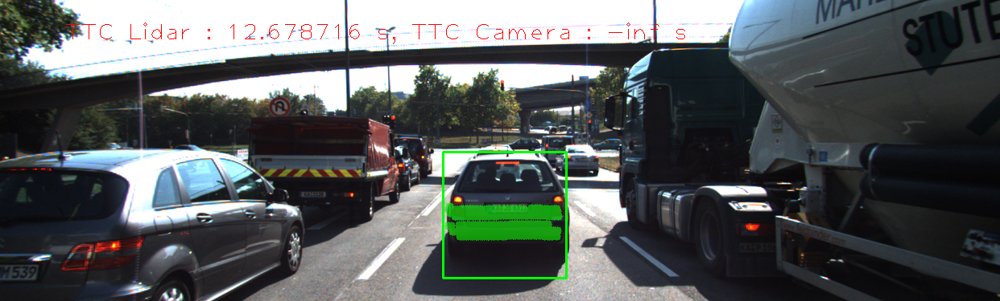 | 344 | 15.9082 | 12.6754
6 |  |  | 352 | 12.6787 | -inf
7 |  |  | 317 | 11.9844 | -inf
8 |  |  | 312 | 13.1241 | -inf
9 |  |  | 311 | 13.0241 | 11.5126
10 |  |  | 286 | 11.1746 | -inf
11 |  |  | 302 | 12.8086 | 11.3024
12 |  |  | 302 | 8.95978 | 11.6524
13 |  |  | 316 | 9.96439 | 11.7243
14 |  |  | 312 | 9.59863 | 11.8781
15 |  |  | 289 | 8.57352 | 9.33785
16 |  |  | 297 | 9.51617 | 11.3079
17 |  |  | 279 | 9.54658 | 11.4487
18 |  |  | 303 | 8.3988 | 9.12792
Experiment has 1 result sets
ResultSet has 18 results

## Performance Results (Detector = Shi_Tomasi, Descriptor = BRIEF)

Frame | Lidar points | TTC Lidar | TTC Camera
---:  | ---:  | ---:  | ---: 
1 | 340 | 12.5156 | 13.8948
2 | 309 | 12.6142 | 13.1487
3 | 326 | 14.091 | 22.6781
4 | 322 | 16.6894 | 13.81
5 | 344 | 15.9082 | 12.1886
6 | 352 | 12.6787 | 15.1561
7 | 317 | 11.9844 | 18.3368
8 | 312 | 13.1241 | 12.3793
9 | 311 | 13.0241 | 12.463
10 | 286 | 11.1746 | 13.3448
11 | 302 | 12.8086 | 12.2
12 | 302 | 8.95978 | 12.2294
13 | 316 | 9.96439 | 12.3292
14 | 312 | 9.59863 | 12.7102
15 | 289 | 8.57352 | 12.9788
16 | 297 | 9.51617 | 11.3856
17 | 279 | 9.54658 | 13.6063
18 | 303 | 8.3988 | 7.75039

## Performance Results (Detector = Shi_Tomasi, Descriptor = BRIEF)

Frame | Top view perspective of Lidar points showing distance markers | Image with TTC estimates from Lidar and Camera | Lidar points | TTC Lidar | TTC Camera
:---:  | :---:  | :---:  | ---:  | ---:  | ---: 
1 |  |  | 340 | 12.5156 | 13.8948
2 |  |  | 309 | 12.6142 | 13.1487
3 |  |  | 326 | 14.091 | 22.6781
4 |  |  | 322 | 16.6894 | 13.81
5 |  |  | 344 | 15.9082 | 12.1886
6 |  |  | 352 | 12.6787 | 15.1561
7 |  |  | 317 | 11.9844 | 18.3368
8 |  | 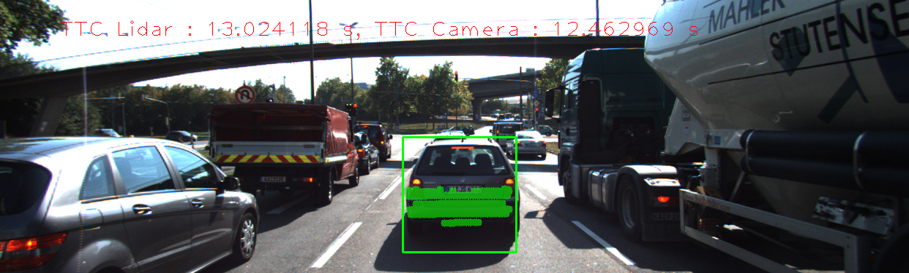 | 312 | 13.1241 | 12.3793
9 |  |  | 311 | 13.0241 | 12.463
10 |  |  | 286 | 11.1746 | 13.3448
11 |  |  | 302 | 12.8086 | 12.2
12 |  |  | 302 | 8.95978 | 12.2294
13 |  |  | 316 | 9.96439 | 12.3292
14 |  |  | 312 | 9.59863 | 12.7102
15 |  |  | 289 | 8.57352 | 12.9788
16 |  |  | 297 | 9.51617 | 11.3856
17 |  |  | 279 | 9.54658 | 13.6063
18 |  |  | 303 | 8.3988 | 7.75039
Experiment has 2 result sets
ResultSet has 18 results

## Performance Results (Detector = Shi_Tomasi, Descriptor = ORB)

Frame | Lidar points | TTC Lidar | TTC Camera
---:  | ---:  | ---:  | ---: 
1 | 340 | 12.5156 | 13.8801
2 | 309 | 12.6142 | 17.7333
3 | 326 | 14.091 | 11.6626
4 | 322 | 16.6894 | 12.1506
5 | 344 | 15.9082 | 12.3305
6 | 352 | 12.6787 | 15.1536
7 | 317 | 11.9844 | 15.0065
8 | 312 | 13.1241 | 12.1848
9 | 311 | 13.0241 | 11.274
10 | 286 | 11.1746 | 13.1345
11 | 302 | 12.8086 | 11.3027
12 | 302 | 8.95978 | 12.7698
13 | 316 | 9.96439 | 12.1119
14 | 312 | 9.59863 | 14.6845
15 | 289 | 8.57352 | 10.2642
16 | 297 | 9.51617 | 13.4357
17 | 279 | 9.54658 | 13.5261
18 | 303 | 8.3988 | 12.0906

## Performance Results (Detector = Shi_Tomasi, Descriptor = ORB)

Frame | Top view perspective of Lidar points showing distance markers | Image with TTC estimates from Lidar and Camera | Lidar points | TTC Lidar | TTC Camera
:---:  | :---:  | :---:  | ---:  | ---:  | ---: 
1 |  |  | 340 | 12.5156 | 13.8801
2 |  |  | 309 | 12.6142 | 17.7333
3 |  |  | 326 | 14.091 | 11.6626
4 |  |  | 322 | 16.6894 | 12.1506
5 |  |  | 344 | 15.9082 | 12.3305
6 |  |  | 352 | 12.6787 | 15.1536
7 |  |  | 317 | 11.9844 | 15.0065
8 |  |  | 312 | 13.1241 | 12.1848
9 |  |  | 311 | 13.0241 | 11.274
10 |  |  | 286 | 11.1746 | 13.1345
11 |  |  | 302 | 12.8086 | 11.3027
12 |  |  | 302 | 8.95978 | 12.7698
13 |  |  | 316 | 9.96439 | 12.1119
14 |  |  | 312 | 9.59863 | 14.6845
15 |  |  | 289 | 8.57352 | 10.2642
16 |  |  | 297 | 9.51617 | 13.4357
17 |  |  | 279 | 9.54658 | 13.5261
18 |  |  | 303 | 8.3988 | 12.0906
ResultSet has 18 results

## Performance Results (Detector = Shi_Tomasi, Descriptor = ORB)

Frame | Lidar points | TTC Lidar | TTC Camera
---:  | ---:  | ---:  | ---: 
1 | 340 | 12.5156 | 13.8801
2 | 309 | 12.6142 | 17.7333
3 | 326 | 14.091 | 11.6626
4 | 322 | 16.6894 | 12.1506
5 | 344 | 15.9082 | 12.3305
6 | 352 | 12.6787 | 15.1536
7 | 317 | 11.9844 | 15.0065
8 | 312 | 13.1241 | 12.1848
9 | 311 | 13.0241 | 11.274
10 | 286 | 11.1746 | 13.1345
11 | 302 | 12.8086 | 11.3027
12 | 302 | 8.95978 | 12.7698
13 | 316 | 9.96439 | 12.1119
14 | 312 | 9.59863 | 14.6845
15 | 289 | 8.57352 | 10.2642
16 | 297 | 9.51617 | 13.4357
17 | 279 | 9.54658 | 13.5261
18 | 303 | 8.3988 | 12.0906

## Performance Results (Detector = Shi_Tomasi, Descriptor = ORB)

Frame | Top view perspective of Lidar points showing distance markers | Image with TTC estimates from Lidar and Camera | Lidar points | TTC Lidar | TTC Camera
:---:  | :---:  | :---:  | ---:  | ---:  | ---: 
1 |  |  | 340 | 12.5156 | 13.8801
2 |  |  | 309 | 12.6142 | 17.7333
3 |  |  | 326 | 14.091 | 11.6626
4 |  |  | 322 | 16.6894 | 12.1506
5 |  |  | 344 | 15.9082 | 12.3305
6 |  |  | 352 | 12.6787 | 15.1536
7 |  |  | 317 | 11.9844 | 15.0065
8 |  |  | 312 | 13.1241 | 12.1848
9 |  |  | 311 | 13.0241 | 11.274
10 |  |  | 286 | 11.1746 | 13.1345
11 |  |  | 302 | 12.8086 | 11.3027
12 |  |  | 302 | 8.95978 | 12.7698
13 |  |  | 316 | 9.96439 | 12.1119
14 |  |  | 312 | 9.59863 | 14.6845
15 |  |  | 289 | 8.57352 | 10.2642
16 |  |  | 297 | 9.51617 | 13.4357
17 |  |  | 279 | 9.54658 | 13.5261
18 |  |  | 303 | 8.3988 | 12.0906
Experiment has 1 result sets
ResultSet has 18 results

## Performance Results (Detector = Shi_Tomasi, Descriptor = FREAK)

Frame | Lidar points | TTC Lidar | TTC Camera
---:  | ---:  | ---:  | ---: 
1 | 340 | 12.5156 | 13.6546
2 | 309 | 12.6142 | 13.1487
3 | 326 | 14.091 | 11.0399
4 | 322 | 16.6894 | 12.9162
5 | 344 | 15.9082 | 12.5939
6 | 352 | 12.6787 | 14.2385
7 | 317 | 11.9844 | 12.8908
8 | 312 | 13.1241 | 12.8515
9 | 311 | 13.0241 | 11.6077
10 | 286 | 11.1746 | 13.203
11 | 302 | 12.8086 | 11.8783
12 | 302 | 8.95978 | 11.7855
13 | 316 | 9.96439 | 12.26
14 | 312 | 9.59863 | 11.5161
15 | 289 | 8.57352 | 10.1
16 | 297 | 9.51617 | 18.0421
17 | 279 | 9.54658 | 12.963
18 | 303 | 8.3988 | 11.2811

## Performance Results (Detector = Shi_Tomasi, Descriptor = FREAK)

Frame | Top view perspective of Lidar points showing distance markers | Image with TTC estimates from Lidar and Camera | Lidar points | TTC Lidar | TTC Camera
:---:  | :---:  | :---:  | ---:  | ---:  | ---: 
1 |  |  | 340 | 12.5156 | 13.6546
2 |  |  | 309 | 12.6142 | 13.1487
3 |  |  | 326 | 14.091 | 11.0399
4 |  | 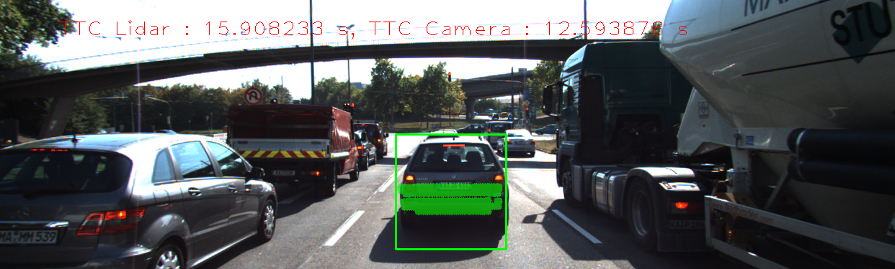 | 322 | 16.6894 | 12.9162
5 |  |  | 344 | 15.9082 | 12.5939
6 |  |  | 352 | 12.6787 | 14.2385
7 |  |  | 317 | 11.9844 | 12.8908
8 |  |  | 312 | 13.1241 | 12.8515
9 |  |  | 311 | 13.0241 | 11.6077
10 |  |  | 286 | 11.1746 | 13.203
11 |  | 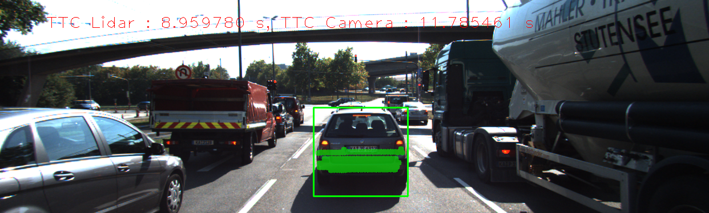 | 302 | 12.8086 | 11.8783
12 |  |  | 302 | 8.95978 | 11.7855
13 |  |  | 316 | 9.96439 | 12.26
14 |  |  | 312 | 9.59863 | 11.5161
15 |  |  | 289 | 8.57352 | 10.1
16 |  |  | 297 | 9.51617 | 18.0421
17 |  |  | 279 | 9.54658 | 12.963
18 |  |  | 303 | 8.3988 | 11.2811
Experiment has 1 result sets
ResultSet has 18 results

## Performance Results (Detector = Shi_Tomasi, Descriptor = SIFT)

Frame | Lidar points | TTC Lidar | TTC Camera
---:  | ---:  | ---:  | ---: 
1 | 340 | 12.5156 | 14.0746
2 | 309 | 12.6142 | 14.6503
3 | 326 | 14.091 | 14.3827
4 | 322 | 16.6894 | 12.9162
5 | 344 | 15.9082 | 13.4113
6 | 352 | 12.6787 | 15.1561
7 | 317 | 11.9844 | 13.935
8 | 312 | 13.1241 | 15.3284
9 | 311 | 13.0241 | 12.4803
10 | 286 | 11.1746 | 13.2947
11 | 302 | 12.8086 | 12.3562
12 | 302 | 8.95978 | 12.7698
13 | 316 | 9.96439 | 11.6194
14 | 312 | 9.59863 | 12.7102
15 | 289 | 8.57352 | 12.3541
16 | 297 | 9.51617 | 13.3159
17 | 279 | 9.54658 | 13.5261
18 | 303 | 8.3988 | 12.0881

## Performance Results (Detector = Shi_Tomasi, Descriptor = SIFT)

Frame | Top view perspective of Lidar points showing distance markers | Image with TTC estimates from Lidar and Camera | Lidar points | TTC Lidar | TTC Camera
:---:  | :---:  | :---:  | ---:  | ---:  | ---: 
1 |  |  | 340 | 12.5156 | 14.0746
2 |  |  | 309 | 12.6142 | 14.6503
3 |  |  | 326 | 14.091 | 14.3827
4 |  |  | 322 | 16.6894 | 12.9162
5 |  |  | 344 | 15.9082 | 13.4113
6 |  |  | 352 | 12.6787 | 15.1561
7 |  |  | 317 | 11.9844 | 13.935
8 |  |  | 312 | 13.1241 | 15.3284
9 |  |  | 311 | 13.0241 | 12.4803
10 |  |  | 286 | 11.1746 | 13.2947
11 |  |  | 302 | 12.8086 | 12.3562
12 |  |  | 302 | 8.95978 | 12.7698
13 |  |  | 316 | 9.96439 | 11.6194
14 |  |  | 312 | 9.59863 | 12.7102
15 |  |  | 289 | 8.57352 | 12.3541
16 |  |  | 297 | 9.51617 | 13.3159
17 |  |  | 279 | 9.54658 | 13.5261
18 |  |  | 303 | 8.3988 | 12.0881
Experiment has 1 result sets
ResultSet has 18 results

## Performance Results (Detector = HARRIS, Descriptor = BRISK)

Frame | Lidar points | TTC Lidar | TTC Camera
---:  | ---:  | ---:  | ---: 
1 | 340 | 12.5156 | -inf
2 | 309 | 12.6142 | 10.586
3 | 326 | 14.091 | 26.2905
4 | 322 | 16.6894 | 11.5792
5 | 344 | 15.9082 | -inf
6 | 352 | 12.6787 | nan
7 | 317 | 11.9844 | 11.6947
8 | 312 | 13.1241 | 17.6204
9 | 311 | 13.0241 | nan
10 | 286 | 11.1746 | -inf
11 | 302 | 12.8086 | -inf
12 | 302 | 8.95978 | -inf
13 | 316 | 9.96439 | -inf
14 | 312 | 9.59863 | nan
15 | 289 | 8.57352 | -13.6263
16 | 297 | 9.51617 | 6.65726
17 | 279 | 9.54658 | 12.5848
18 | 303 | 8.3988 | -inf

## Performance Results (Detector = HARRIS, Descriptor = BRISK)

Frame | Top view perspective of Lidar points showing distance markers | Image with TTC estimates from Lidar and Camera | Lidar points | TTC Lidar | TTC Camera
:---:  | :---:  | :---:  | ---:  | ---:  | ---: 
1 |  |  | 340 | 12.5156 | -inf
2 |  |  | 309 | 12.6142 | 10.586
3 |  |  | 326 | 14.091 | 26.2905
4 |  |  | 322 | 16.6894 | 11.5792
5 |  |  | 344 | 15.9082 | -inf
6 |  |  | 352 | 12.6787 | nan
7 |  |  | 317 | 11.9844 | 11.6947
8 |  |  | 312 | 13.1241 | 17.6204
9 |  |  | 311 | 13.0241 | nan
10 |  |  | 286 | 11.1746 | -inf
11 |  |  | 302 | 12.8086 | -inf
12 |  |  | 302 | 8.95978 | -inf
13 |  |  | 316 | 9.96439 | -inf
14 |  |  | 312 | 9.59863 | nan
15 |  |  | 289 | 8.57352 | -13.6263
16 |  |  | 297 | 9.51617 | 6.65726
17 |  |  | 279 | 9.54658 | 12.5848
18 |  |  | 303 | 8.3988 | -inf
Experiment has 1 result sets
ResultSet has 18 results

## Performance Results (Detector = HARRIS, Descriptor = BRIEF)

Frame | Lidar points | TTC Lidar | TTC Camera
---:  | ---:  | ---:  | ---: 
1 | 340 | 12.5156 | 10.9082
2 | 309 | 12.6142 | nan
3 | 326 | 14.091 | -inf
4 | 322 | 16.6894 | 11.5792
5 | 344 | 15.9082 | 35.3833
6 | 352 | 12.6787 | 13.5907
7 | 317 | 11.9844 | 14.2744
8 | 312 | 13.1241 | -inf
9 | 311 | 13.0241 | nan
10 | 286 | 11.1746 | 20.5862
11 | 302 | 12.8086 | -inf
12 | 302 | 8.95978 | 12.245
13 | 316 | 9.96439 | 13.4327
14 | 312 | 9.59863 | 5.6061
15 | 289 | 8.57352 | -inf
16 | 297 | 9.51617 | 6.71705
17 | 279 | 9.54658 | 12.5848
18 | 303 | 8.3988 | -inf

## Performance Results (Detector = HARRIS, Descriptor = BRIEF)

Frame | Top view perspective of Lidar points showing distance markers | Image with TTC estimates from Lidar and Camera | Lidar points | TTC Lidar | TTC Camera
:---:  | :---:  | :---:  | ---:  | ---:  | ---: 
1 |  |  | 340 | 12.5156 | 10.9082
2 |  |  | 309 | 12.6142 | nan
3 |  |  | 326 | 14.091 | -inf
4 |  |  | 322 | 16.6894 | 11.5792
5 |  |  | 344 | 15.9082 | 35.3833
6 |  |  | 352 | 12.6787 | 13.5907
7 |  |  | 317 | 11.9844 | 14.2744
8 |  |  | 312 | 13.1241 | -inf
9 |  | 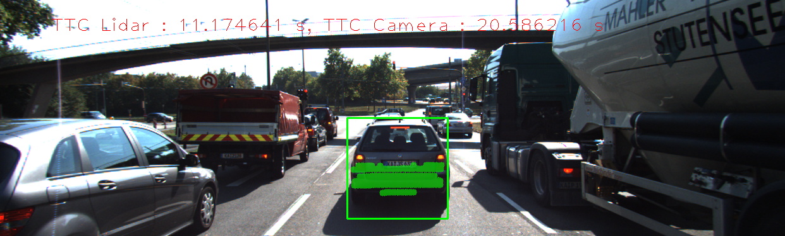 | 311 | 13.0241 | nan
10 |  |  | 286 | 11.1746 | 20.5862
11 |  |  | 302 | 12.8086 | -inf
12 |  |  | 302 | 8.95978 | 12.245
13 |  |  | 316 | 9.96439 | 13.4327
14 |  |  | 312 | 9.59863 | 5.6061
15 |  |  | 289 | 8.57352 | -inf
16 |  |  | 297 | 9.51617 | 6.71705
17 |  |  | 279 | 9.54658 | 12.5848
18 |  |  | 303 | 8.3988 | -inf
Experiment has 2 result sets
ResultSet has 18 results

## Performance Results (Detector = HARRIS, Descriptor = ORB)

Frame | Lidar points | TTC Lidar | TTC Camera
---:  | ---:  | ---:  | ---: 
1 | 340 | 12.5156 | 10.9082
2 | 309 | 12.6142 | nan
3 | 326 | 14.091 | -inf
4 | 322 | 16.6894 | 11.5792
5 | 344 | 15.9082 | 35.3833
6 | 352 | 12.6787 | nan
7 | 317 | 11.9844 | 13.497
8 | 312 | 13.1241 | -inf
9 | 311 | 13.0241 | nan
10 | 286 | 11.1746 | 20.5862
11 | 302 | 12.8086 | 11.7414
12 | 302 | 8.95978 | 12.245
13 | 316 | 9.96439 | 568.322
14 | 312 | 9.59863 | 5.66097
15 | 289 | 8.57352 | -inf
16 | 297 | 9.51617 | 10.9325
17 | 279 | 9.54658 | 12.5848
18 | 303 | 8.3988 | -inf

## Performance Results (Detector = HARRIS, Descriptor = ORB)

Frame | Top view perspective of Lidar points showing distance markers | Image with TTC estimates from Lidar and Camera | Lidar points | TTC Lidar | TTC Camera
:---:  | :---:  | :---:  | ---:  | ---:  | ---: 
1 |  |  | 340 | 12.5156 | 10.9082
2 |  |  | 309 | 12.6142 | nan
3 |  |  | 326 | 14.091 | -inf
4 |  |  | 322 | 16.6894 | 11.5792
5 |  |  | 344 | 15.9082 | 35.3833
6 |  | 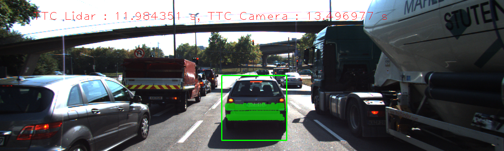 | 352 | 12.6787 | nan
7 |  |  | 317 | 11.9844 | 13.497
8 |  |  | 312 | 13.1241 | -inf
9 |  |  | 311 | 13.0241 | nan
10 |  |  | 286 | 11.1746 | 20.5862
11 |  |  | 302 | 12.8086 | 11.7414
12 |  |  | 302 | 8.95978 | 12.245
13 |  |  | 316 | 9.96439 | 568.322
14 |  |  | 312 | 9.59863 | 5.66097
15 |  |  | 289 | 8.57352 | -inf
16 |  |  | 297 | 9.51617 | 10.9325
17 |  |  | 279 | 9.54658 | 12.5848
18 |  |  | 303 | 8.3988 | -inf
ResultSet has 18 results

## Performance Results (Detector = HARRIS, Descriptor = ORB)

Frame | Lidar points | TTC Lidar | TTC Camera
---:  | ---:  | ---:  | ---: 
1 | 340 | 12.5156 | 10.9082
2 | 309 | 12.6142 | nan
3 | 326 | 14.091 | -inf
4 | 322 | 16.6894 | 11.5792
5 | 344 | 15.9082 | 35.3833
6 | 352 | 12.6787 | nan
7 | 317 | 11.9844 | 13.497
8 | 312 | 13.1241 | -inf
9 | 311 | 13.0241 | nan
10 | 286 | 11.1746 | 20.5862
11 | 302 | 12.8086 | 11.7414
12 | 302 | 8.95978 | 12.245
13 | 316 | 9.96439 | 568.322
14 | 312 | 9.59863 | 5.66097
15 | 289 | 8.57352 | -inf
16 | 297 | 9.51617 | 10.9325
17 | 279 | 9.54658 | 12.5848
18 | 303 | 8.3988 | -inf

## Performance Results (Detector = HARRIS, Descriptor = ORB)

Frame | Top view perspective of Lidar points showing distance markers | Image with TTC estimates from Lidar and Camera | Lidar points | TTC Lidar | TTC Camera
:---:  | :---:  | :---:  | ---:  | ---:  | ---: 
1 |  |  | 340 | 12.5156 | 10.9082
2 |  |  | 309 | 12.6142 | nan
3 |  |  | 326 | 14.091 | -inf
4 |  |  | 322 | 16.6894 | 11.5792
5 |  |  | 344 | 15.9082 | 35.3833
6 |  |  | 352 | 12.6787 | nan
7 |  |  | 317 | 11.9844 | 13.497
8 |  |  | 312 | 13.1241 | -inf
9 |  |  | 311 | 13.0241 | nan
10 |  |  | 286 | 11.1746 | 20.5862
11 |  |  | 302 | 12.8086 | 11.7414
12 |  |  | 302 | 8.95978 | 12.245
13 |  |  | 316 | 9.96439 | 568.322
14 |  |  | 312 | 9.59863 | 5.66097
15 |  |  | 289 | 8.57352 | -inf
16 |  |  | 297 | 9.51617 | 10.9325
17 |  |  | 279 | 9.54658 | 12.5848
18 |  |  | 303 | 8.3988 | -inf
Experiment has 1 result sets
ResultSet has 18 results

## Performance Results (Detector = HARRIS, Descriptor = FREAK)

Frame | Lidar points | TTC Lidar | TTC Camera
---:  | ---:  | ---:  | ---: 
1 | 340 | 12.5156 | 21.8164
2 | 309 | 12.6142 | nan
3 | 326 | 14.091 | -80.8525
4 | 322 | 16.6894 | 12.1284
5 | 344 | 15.9082 | 39.584
6 | 352 | 12.6787 | nan
7 | 317 | 11.9844 | 12.3379
7 | 317 | 11.9844 | 12.3379
9 | 311 | 13.0241 | nan
10 | 286 | 11.1746 | -inf
11 | 302 | 12.8086 | -inf
12 | 302 | 8.95978 | -inf
13 | 316 | 9.96439 | 13.4327
14 | 312 | 9.59863 | nan
15 | 289 | 8.57352 | -inf
16 | 297 | 9.51617 | 6.71705
17 | 279 | 9.54658 | nan
18 | 303 | 8.3988 | nan

## Performance Results (Detector = HARRIS, Descriptor = FREAK)

Frame | Top view perspective of Lidar points showing distance markers | Image with TTC estimates from Lidar and Camera | Lidar points | TTC Lidar | TTC Camera
:---:  | :---:  | :---:  | ---:  | ---:  | ---: 
1 |  |  | 340 | 12.5156 | 21.8164
2 |  |  | 309 | 12.6142 | nan
3 |  |  | 326 | 14.091 | -80.8525
4 |  |  | 322 | 16.6894 | 12.1284
5 |  |  | 344 | 15.9082 | 39.584
6 |  |  | 352 | 12.6787 | nan
7 |  |  | 317 | 11.9844 | 12.3379
7 |  |  | 317 | 11.9844 | 12.3379
9 |  |  | 311 | 13.0241 | nan
10 |  |  | 286 | 11.1746 | -inf
11 |  |  | 302 | 12.8086 | -inf
12 |  |  | 302 | 8.95978 | -inf
13 |  |  | 316 | 9.96439 | 13.4327
14 |  |  | 312 | 9.59863 | nan
15 |  |  | 289 | 8.57352 | -inf
16 |  |  | 297 | 9.51617 | 6.71705
17 |  | 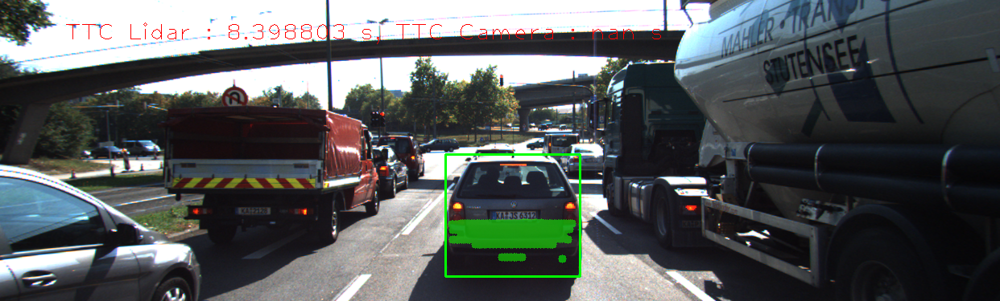 | 279 | 9.54658 | nan
18 |  |  | 303 | 8.3988 | nan
Experiment has 1 result sets
ResultSet has 18 results

## Performance Results (Detector = HARRIS, Descriptor = SIFT)

Frame | Lidar points | TTC Lidar | TTC Camera
---:  | ---:  | ---:  | ---: 
1 | 340 | 12.5156 | 10.9082
2 | 309 | 12.6142 | nan
3 | 326 | 14.091 | -11.4731
4 | 322 | 16.6894 | 11.5792
5 | 344 | 15.9082 | 35.3833
6 | 352 | 12.6787 | 13.6217
7 | 317 | 11.9844 | 13.497
8 | 312 | 13.1241 | -inf
9 | 311 | 13.0241 | nan
10 | 286 | 11.1746 | 10.2931
11 | 302 | 12.8086 | 11.7414
12 | 302 | 8.95978 | 12.245
13 | 316 | 9.96439 | 568.322
14 | 312 | 9.59863 | 5.6061
15 | 289 | 8.57352 | -13.6263
16 | 297 | 9.51617 | 7.03775
17 | 279 | 9.54658 | 12.5848
18 | 303 | 8.3988 | -inf

## Performance Results (Detector = HARRIS, Descriptor = SIFT)

Frame | Top view perspective of Lidar points showing distance markers | Image with TTC estimates from Lidar and Camera | Lidar points | TTC Lidar | TTC Camera
:---:  | :---:  | :---:  | ---:  | ---:  | ---: 
1 |  |  | 340 | 12.5156 | 10.9082
2 |  |  | 309 | 12.6142 | nan
3 |  |  | 326 | 14.091 | -11.4731
4 |  |  | 322 | 16.6894 | 11.5792
5 | 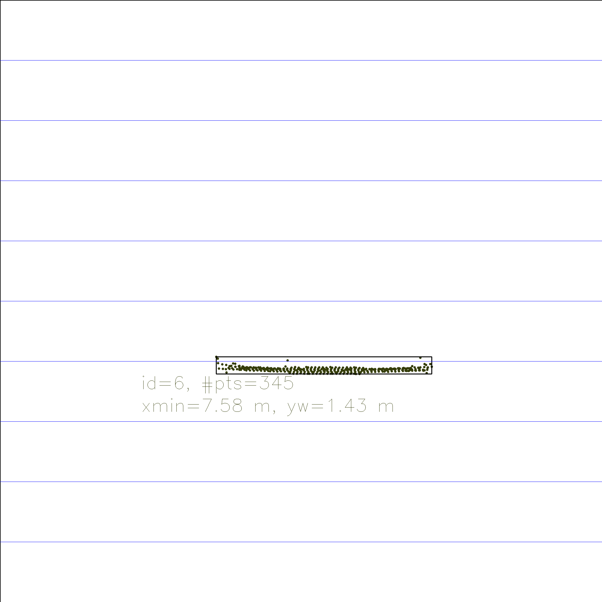 |  | 344 | 15.9082 | 35.3833
6 |  |  | 352 | 12.6787 | 13.6217
7 |  |  | 317 | 11.9844 | 13.497
8 |  |  | 312 | 13.1241 | -inf
9 |  |  | 311 | 13.0241 | nan
10 |  |  | 286 | 11.1746 | 10.2931
11 |  |  | 302 | 12.8086 | 11.7414
12 |  |  | 302 | 8.95978 | 12.245
13 |  |  | 316 | 9.96439 | 568.322
14 |  |  | 312 | 9.59863 | 5.6061
15 |  |  | 289 | 8.57352 | -13.6263
16 |  |  | 297 | 9.51617 | 7.03775
17 |  |  | 279 | 9.54658 | 12.5848
18 |  |  | 303 | 8.3988 | -inf
Experiment has 1 result sets
ResultSet has 18 results

## Performance Results (Detector = FAST, Descriptor = BRISK)

Frame | Lidar points | TTC Lidar | TTC Camera
---:  | ---:  | ---:  | ---: 
1 | 340 | 12.5156 | 12.3
2 | 309 | 12.6142 | 12.3453
3 | 326 | 14.091 | 16.6163
4 | 322 | 16.6894 | 12.8857
5 | 344 | 15.9082 | -inf
6 | 352 | 12.6787 | 13.0386
7 | 317 | 11.9844 | 12.041
8 | 312 | 13.1241 | 11.4066
9 | 311 | 13.0241 | 11.8684
10 | 286 | 11.1746 | 13.3473
11 | 302 | 12.8086 | 12.9492
12 | 302 | 8.95978 | 12.1174
13 | 316 | 9.96439 | 12.7784
14 | 312 | 9.59863 | 11.6077
15 | 289 | 8.57352 | 11.4079
16 | 297 | 9.51617 | 12.2566
17 | 279 | 9.54658 | 9.2933
18 | 303 | 8.3988 | 11.8606

## Performance Results (Detector = FAST, Descriptor = BRISK)

Frame | Top view perspective of Lidar points showing distance markers | Image with TTC estimates from Lidar and Camera | Lidar points | TTC Lidar | TTC Camera
:---:  | :---:  | :---:  | ---:  | ---:  | ---: 
1 |  |  | 340 | 12.5156 | 12.3
2 |  |  | 309 | 12.6142 | 12.3453
3 |  |  | 326 | 14.091 | 16.6163
4 |  |  | 322 | 16.6894 | 12.8857
5 |  |  | 344 | 15.9082 | -inf
6 |  |  | 352 | 12.6787 | 13.0386
7 |  |  | 317 | 11.9844 | 12.041
8 |  |  | 312 | 13.1241 | 11.4066
9 |  |  | 311 | 13.0241 | 11.8684
10 |  |  | 286 | 11.1746 | 13.3473
11 |  |  | 302 | 12.8086 | 12.9492
12 |  |  | 302 | 8.95978 | 12.1174
13 |  |  | 316 | 9.96439 | 12.7784
14 |  |  | 312 | 9.59863 | 11.6077
15 |  |  | 289 | 8.57352 | 11.4079
16 |  |  | 297 | 9.51617 | 12.2566
17 |  |  | 279 | 9.54658 | 9.2933
18 |  |  | 303 | 8.3988 | 11.8606
Experiment has 1 result sets
ResultSet has 18 results

## Performance Results (Detector = FAST, Descriptor = BRIEF)

Frame | Lidar points | TTC Lidar | TTC Camera
---:  | ---:  | ---:  | ---: 
1 | 340 | 12.5156 | 11.1776
2 | 309 | 12.6142 | 13.0069
3 | 326 | 14.091 | 14.8206
4 | 322 | 16.6894 | 13.6686
5 | 344 | 15.9082 | -inf
6 | 352 | 12.6787 | 41.7823
7 | 317 | 11.9844 | 12.7583
8 | 312 | 13.1241 | 12.7664
9 | 311 | 13.0241 | 13.9231
10 | 286 | 11.1746 | 16.2141
11 | 302 | 12.8086 | 13.6355
12 | 302 | 8.95978 | 12.9831
13 | 316 | 9.96439 | 13.1487
14 | 312 | 9.59863 | 11.7034
15 | 289 | 8.57352 | 12.6071
16 | 297 | 9.51617 | 13.0069
17 | 279 | 9.54658 | 11.2586
18 | 303 | 8.3988 | 13.7908

## Performance Results (Detector = FAST, Descriptor = BRIEF)

Frame | Top view perspective of Lidar points showing distance markers | Image with TTC estimates from Lidar and Camera | Lidar points | TTC Lidar | TTC Camera
:---:  | :---:  | :---:  | ---:  | ---:  | ---: 
1 |  |  | 340 | 12.5156 | 11.1776
2 |  |  | 309 | 12.6142 | 13.0069
3 |  |  | 326 | 14.091 | 14.8206
4 |  |  | 322 | 16.6894 | 13.6686
5 |  |  | 344 | 15.9082 | -inf
6 |  |  | 352 | 12.6787 | 41.7823
7 |  |  | 317 | 11.9844 | 12.7583
8 |  |  | 312 | 13.1241 | 12.7664
9 |  |  | 311 | 13.0241 | 13.9231
10 |  |  | 286 | 11.1746 | 16.2141
11 |  |  | 302 | 12.8086 | 13.6355
12 |  | 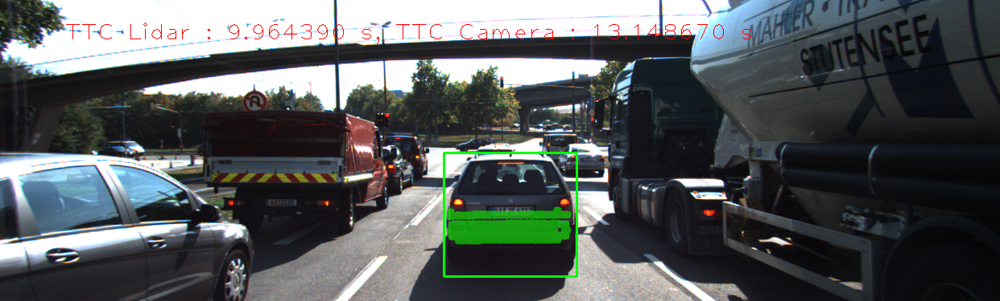 | 302 | 8.95978 | 12.9831
13 |  |  | 316 | 9.96439 | 13.1487
14 |  |  | 312 | 9.59863 | 11.7034
15 |  |  | 289 | 8.57352 | 12.6071
16 |  |  | 297 | 9.51617 | 13.0069
17 |  |  | 279 | 9.54658 | 11.2586
18 |  |  | 303 | 8.3988 | 13.7908
Experiment has 2 result sets
ResultSet has 18 results

## Performance Results (Detector = FAST, Descriptor = ORB)

Frame | Lidar points | TTC Lidar | TTC Camera
---:  | ---:  | ---:  | ---: 
1 | 340 | 12.5156 | 11.9993
2 | 309 | 12.6142 | 12.9793
3 | 326 | 14.091 | 16.6163
4 | 322 | 16.6894 | 13.7508
5 | 344 | 15.9082 | -inf
6 | 352 | 12.6787 | 55.9788
7 | 317 | 11.9844 | 12.4264
8 | 312 | 13.1241 | 12.186
9 | 311 | 13.0241 | 12.8711
10 | 286 | 11.1746 | -inf
11 | 302 | 12.8086 | 14.1395
12 | 302 | 8.95978 | 13.1636
13 | 316 | 9.96439 | 13.5629
14 | 312 | 9.59863 | 11.1115
15 | 289 | 8.57352 | 10.8439
16 | 297 | 9.51617 | 11.3939
17 | 279 | 9.54658 | 12.1656
18 | 303 | 8.3988 | 13.7843

## Performance Results (Detector = FAST, Descriptor = ORB)

Frame | Top view perspective of Lidar points showing distance markers | Image with TTC estimates from Lidar and Camera | Lidar points | TTC Lidar | TTC Camera
:---:  | :---:  | :---:  | ---:  | ---:  | ---: 
1 |  |  | 340 | 12.5156 | 11.9993
2 |  |  | 309 | 12.6142 | 12.9793
3 |  |  | 326 | 14.091 | 16.6163
4 |  |  | 322 | 16.6894 | 13.7508
5 |  |  | 344 | 15.9082 | -inf
6 |  |  | 352 | 12.6787 | 55.9788
7 |  |  | 317 | 11.9844 | 12.4264
8 |  |  | 312 | 13.1241 | 12.186
9 |  |  | 311 | 13.0241 | 12.8711
10 |  |  | 286 | 11.1746 | -inf
11 |  |  | 302 | 12.8086 | 14.1395
12 |  |  | 302 | 8.95978 | 13.1636
13 |  |  | 316 | 9.96439 | 13.5629
14 |  |  | 312 | 9.59863 | 11.1115
15 |  |  | 289 | 8.57352 | 10.8439
16 |  |  | 297 | 9.51617 | 11.3939
17 |  |  | 279 | 9.54658 | 12.1656
18 |  |  | 303 | 8.3988 | 13.7843
ResultSet has 18 results

## Performance Results (Detector = FAST, Descriptor = ORB)

Frame | Lidar points | TTC Lidar | TTC Camera
---:  | ---:  | ---:  | ---: 
1 | 340 | 12.5156 | 11.9993
2 | 309 | 12.6142 | 12.9793
3 | 326 | 14.091 | 16.6163
4 | 322 | 16.6894 | 13.7508
5 | 344 | 15.9082 | -inf
6 | 352 | 12.6787 | 55.9788
7 | 317 | 11.9844 | 12.4264
8 | 312 | 13.1241 | 12.186
9 | 311 | 13.0241 | 12.8711
10 | 286 | 11.1746 | -inf
11 | 302 | 12.8086 | 14.1395
12 | 302 | 8.95978 | 13.1636
13 | 316 | 9.96439 | 13.5629
14 | 312 | 9.59863 | 11.1115
15 | 289 | 8.57352 | 10.8439
16 | 297 | 9.51617 | 11.3939
17 | 279 | 9.54658 | 12.1656
18 | 303 | 8.3988 | 13.7843

## Performance Results (Detector = FAST, Descriptor = ORB)

Frame | Top view perspective of Lidar points showing distance markers | Image with TTC estimates from Lidar and Camera | Lidar points | TTC Lidar | TTC Camera
:---:  | :---:  | :---:  | ---:  | ---:  | ---: 
1 |  |  | 340 | 12.5156 | 11.9993
2 |  |  | 309 | 12.6142 | 12.9793
3 |  |  | 326 | 14.091 | 16.6163
4 |  |  | 322 | 16.6894 | 13.7508
5 |  |  | 344 | 15.9082 | -inf
6 |  |  | 352 | 12.6787 | 55.9788
7 |  |  | 317 | 11.9844 | 12.4264
8 |  |  | 312 | 13.1241 | 12.186
9 |  |  | 311 | 13.0241 | 12.8711
10 |  |  | 286 | 11.1746 | -inf
11 |  |  | 302 | 12.8086 | 14.1395
12 |  |  | 302 | 8.95978 | 13.1636
13 |  |  | 316 | 9.96439 | 13.5629
14 |  |  | 312 | 9.59863 | 11.1115
15 |  |  | 289 | 8.57352 | 10.8439
16 |  |  | 297 | 9.51617 | 11.3939
17 |  |  | 279 | 9.54658 | 12.1656
18 |  |  | 303 | 8.3988 | 13.7843
Experiment has 1 result sets
ResultSet has 18 results

## Performance Results (Detector = FAST, Descriptor = FREAK)

Frame | Lidar points | TTC Lidar | TTC Camera
---:  | ---:  | ---:  | ---: 
1 | 340 | 12.5156 | 11.9002
2 | 309 | 12.6142 | 13.8852
3 | 326 | 14.091 | 13.2228
4 | 322 | 16.6894 | 13.8462
5 | 344 | 15.9082 | 44.8072
6 | 352 | 12.6787 | 12.5009
7 | 317 | 11.9844 | 12.2695
8 | 312 | 13.1241 | 11.5467
9 | 311 | 13.0241 | -inf
10 | 286 | 11.1746 | 13.4169
11 | 302 | 12.8086 | 13.0373
12 | 302 | 8.95978 | 12.1376
13 | 316 | 9.96439 | 11.9908
14 | 312 | 9.59863 | 11.2961
15 | 289 | 8.57352 | 13.4268
16 | 297 | 9.51617 | 12.0008
17 | 279 | 9.54658 | 8.79801
18 | 303 | 8.3988 | 12.0558

## Performance Results (Detector = FAST, Descriptor = FREAK)

Frame | Top view perspective of Lidar points showing distance markers | Image with TTC estimates from Lidar and Camera | Lidar points | TTC Lidar | TTC Camera
:---:  | :---:  | :---:  | ---:  | ---:  | ---: 
1 |  |  | 340 | 12.5156 | 11.9002
2 |  |  | 309 | 12.6142 | 13.8852
3 |  |  | 326 | 14.091 | 13.2228
4 |  | 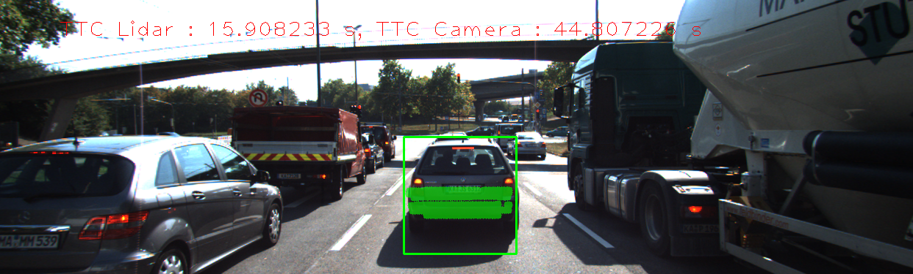 | 322 | 16.6894 | 13.8462
5 |  |  | 344 | 15.9082 | 44.8072
6 |  |  | 352 | 12.6787 | 12.5009
7 |  |  | 317 | 11.9844 | 12.2695
8 |  |  | 312 | 13.1241 | 11.5467
9 |  |  | 311 | 13.0241 | -inf
10 |  |  | 286 | 11.1746 | 13.4169
11 |  |  | 302 | 12.8086 | 13.0373
12 |  |  | 302 | 8.95978 | 12.1376
13 |  |  | 316 | 9.96439 | 11.9908
14 |  |  | 312 | 9.59863 | 11.2961
15 |  |  | 289 | 8.57352 | 13.4268
16 |  |  | 297 | 9.51617 | 12.0008
17 |  |  | 279 | 9.54658 | 8.79801
18 |  |  | 303 | 8.3988 | 12.0558
Experiment has 1 result sets
ResultSet has 18 results

## Performance Results (Detector = FAST, Descriptor = SIFT)

Frame | Lidar points | TTC Lidar | TTC Camera
---:  | ---:  | ---:  | ---: 
1 | 340 | 12.5156 | 12.313
2 | 309 | 12.6142 | 12.826
3 | 326 | 14.091 | 18.7478
4 | 322 | 16.6894 | 15.4897
5 | 344 | 15.9082 | -inf
6 | 352 | 12.6787 | 74.5672
7 | 317 | 11.9844 | 12.7282
8 | 312 | 13.1241 | 12.6536
9 | 311 | 13.0241 | 13.8873
10 | 286 | 11.1746 | 14.0112
11 | 302 | 12.8086 | 13.7238
12 | 302 | 8.95978 | 13.0717
13 | 316 | 9.96439 | 12.9215
14 | 312 | 9.59863 | 12.879
15 | 289 | 8.57352 | 12.6071
16 | 297 | 9.51617 | 12.9069
17 | 279 | 9.54658 | 10.4572
18 | 303 | 8.3988 | 13.1502

## Performance Results (Detector = FAST, Descriptor = SIFT)

Frame | Top view perspective of Lidar points showing distance markers | Image with TTC estimates from Lidar and Camera | Lidar points | TTC Lidar | TTC Camera
:---:  | :---:  | :---:  | ---:  | ---:  | ---: 
1 |  |  | 340 | 12.5156 | 12.313
2 |  |  | 309 | 12.6142 | 12.826
3 |  |  | 326 | 14.091 | 18.7478
4 |  |  | 322 | 16.6894 | 15.4897
5 |  |  | 344 | 15.9082 | -inf
6 |  |  | 352 | 12.6787 | 74.5672
7 |  |  | 317 | 11.9844 | 12.7282
8 |  |  | 312 | 13.1241 | 12.6536
9 |  |  | 311 | 13.0241 | 13.8873
10 |  |  | 286 | 11.1746 | 14.0112
11 |  |  | 302 | 12.8086 | 13.7238
12 |  |  | 302 | 8.95978 | 13.0717
13 |  |  | 316 | 9.96439 | 12.9215
14 |  |  | 312 | 9.59863 | 12.879
15 |  |  | 289 | 8.57352 | 12.6071
16 |  |  | 297 | 9.51617 | 12.9069
17 |  |  | 279 | 9.54658 | 10.4572
18 |  |  | 303 | 8.3988 | 13.1502
Experiment has 1 result sets
ResultSet has 18 results

## Performance Results (Detector = BRISK, Descriptor = BRISK)

Frame | Lidar points | TTC Lidar | TTC Camera
---:  | ---:  | ---:  | ---: 
1 | 340 | 12.5156 | 13.031
2 | 309 | 12.6142 | 23.1027
3 | 326 | 14.091 | 17.5172
4 | 322 | 16.6894 | 15.2031
5 | 344 | 15.9082 | 28.2877
6 | 352 | 12.6787 | 17.6743
7 | 317 | 11.9844 | 16.8563
8 | 312 | 13.1241 | 23.0521
9 | 311 | 13.0241 | 15.1936
10 | 286 | 11.1746 | 13.4121
11 | 302 | 12.8086 | 12.4948
12 | 302 | 8.95978 | 11.0107
13 | 316 | 9.96439 | 11.8505
14 | 312 | 9.59863 | 12.0376
15 | 289 | 8.57352 | 16.061
16 | 297 | 9.51617 | 11.2969
17 | 279 | 9.54658 | 9.70123
18 | 303 | 8.3988 | 11.6176

## Performance Results (Detector = BRISK, Descriptor = BRISK)

Frame | Top view perspective of Lidar points showing distance markers | Image with TTC estimates from Lidar and Camera | Lidar points | TTC Lidar | TTC Camera
:---:  | :---:  | :---:  | ---:  | ---:  | ---: 
1 |  |  | 340 | 12.5156 | 13.031
2 |  |  | 309 | 12.6142 | 23.1027
3 |  |  | 326 | 14.091 | 17.5172
4 |  |  | 322 | 16.6894 | 15.2031
5 |  |  | 344 | 15.9082 | 28.2877
6 |  |  | 352 | 12.6787 | 17.6743
7 |  |  | 317 | 11.9844 | 16.8563
8 |  |  | 312 | 13.1241 | 23.0521
9 |  |  | 311 | 13.0241 | 15.1936
10 |  |  | 286 | 11.1746 | 13.4121
11 |  |  | 302 | 12.8086 | 12.4948
12 |  |  | 302 | 8.95978 | 11.0107
13 |  |  | 316 | 9.96439 | 11.8505
14 |  |  | 312 | 9.59863 | 12.0376
15 |  |  | 289 | 8.57352 | 16.061
16 |  |  | 297 | 9.51617 | 11.2969
17 |  |  | 279 | 9.54658 | 9.70123
18 |  |  | 303 | 8.3988 | 11.6176
Experiment has 1 result sets
ResultSet has 18 results

## Performance Results (Detector = BRISK, Descriptor = BRIEF)

Frame | Lidar points | TTC Lidar | TTC Camera
---:  | ---:  | ---:  | ---: 
1 | 340 | 12.5156 | 14.863
2 | 309 | 12.6142 | 23.7824
3 | 326 | 14.091 | 18.0446
4 | 322 | 16.6894 | 22.7832
5 | 344 | 15.9082 | 25.5059
6 | 352 | 12.6787 | 56.735
7 | 317 | 11.9844 | 25.2647
8 | 312 | 13.1241 | 18.4064
9 | 311 | 13.0241 | 20.3103
10 | 286 | 11.1746 | 18.4689
11 | 302 | 12.8086 | 21.829
12 | 302 | 8.95978 | 17.7779
13 | 316 | 9.96439 | 17.4963
14 | 312 | 9.59863 | 14.8559
15 | 289 | 8.57352 | 11.054
16 | 297 | 9.51617 | 16.1143
17 | 279 | 9.54658 | 15.0108
18 | 303 | 8.3988 | 17.6601

## Performance Results (Detector = BRISK, Descriptor = BRIEF)

Frame | Top view perspective of Lidar points showing distance markers | Image with TTC estimates from Lidar and Camera | Lidar points | TTC Lidar | TTC Camera
:---:  | :---:  | :---:  | ---:  | ---:  | ---: 
1 |  |  | 340 | 12.5156 | 14.863
2 |  |  | 309 | 12.6142 | 23.7824
3 |  |  | 326 | 14.091 | 18.0446
4 |  |  | 322 | 16.6894 | 22.7832
5 |  |  | 344 | 15.9082 | 25.5059
6 |  |  | 352 | 12.6787 | 56.735
7 |  |  | 317 | 11.9844 | 25.2647
8 |  |  | 312 | 13.1241 | 18.4064
9 |  |  | 311 | 13.0241 | 20.3103
10 |  |  | 286 | 11.1746 | 18.4689
11 |  |  | 302 | 12.8086 | 21.829
12 |  |  | 302 | 8.95978 | 17.7779
13 |  |  | 316 | 9.96439 | 17.4963
14 |  |  | 312 | 9.59863 | 14.8559
15 |  |  | 289 | 8.57352 | 11.054
16 |  |  | 297 | 9.51617 | 16.1143
17 |  |  | 279 | 9.54658 | 15.0108
18 |  |  | 303 | 8.3988 | 17.6601
Experiment has 2 result sets
ResultSet has 18 results

## Performance Results (Detector = BRISK, Descriptor = ORB)

Frame | Lidar points | TTC Lidar | TTC Camera
---:  | ---:  | ---:  | ---: 
1 | 340 | 12.5156 | 26.2405
2 | 309 | 12.6142 | 20.1555
3 | 326 | 14.091 | 18.0446
4 | 322 | 16.6894 | 17.1207
5 | 344 | 15.9082 | 26.3307
6 | 352 | 12.6787 | 20.629
7 | 317 | 11.9844 | 20.1205
8 | 312 | 13.1241 | 16.0691
9 | 311 | 13.0241 | 15.4645
10 | 286 | 11.1746 | 12.5995
11 | 302 | 12.8086 | 13.9703
12 | 302 | 8.95978 | 14.8314
13 | 316 | 9.96439 | 11.5189
14 | 312 | 9.59863 | 12.1556
15 | 289 | 8.57352 | 11.4651
16 | 297 | 9.51617 | 17.3574
17 | 279 | 9.54658 | 10.7717
18 | 303 | 8.3988 | 12.1291

## Performance Results (Detector = BRISK, Descriptor = ORB)

Frame | Top view perspective of Lidar points showing distance markers | Image with TTC estimates from Lidar and Camera | Lidar points | TTC Lidar | TTC Camera
:---:  | :---:  | :---:  | ---:  | ---:  | ---: 
1 |  |  | 340 | 12.5156 | 26.2405
2 |  |  | 309 | 12.6142 | 20.1555
3 |  |  | 326 | 14.091 | 18.0446
4 |  |  | 322 | 16.6894 | 17.1207
5 |  |  | 344 | 15.9082 | 26.3307
6 |  |  | 352 | 12.6787 | 20.629
7 |  |  | 317 | 11.9844 | 20.1205
8 |  |  | 312 | 13.1241 | 16.0691
9 |  |  | 311 | 13.0241 | 15.4645
10 |  |  | 286 | 11.1746 | 12.5995
11 |  |  | 302 | 12.8086 | 13.9703
12 |  |  | 302 | 8.95978 | 14.8314
13 |  |  | 316 | 9.96439 | 11.5189
14 |  |  | 312 | 9.59863 | 12.1556
15 |  |  | 289 | 8.57352 | 11.4651
16 |  |  | 297 | 9.51617 | 17.3574
17 |  |  | 279 | 9.54658 | 10.7717
18 |  |  | 303 | 8.3988 | 12.1291
ResultSet has 18 results

## Performance Results (Detector = BRISK, Descriptor = ORB)

Frame | Lidar points | TTC Lidar | TTC Camera
---:  | ---:  | ---:  | ---: 
1 | 340 | 12.5156 | 26.2405
2 | 309 | 12.6142 | 20.1555
3 | 326 | 14.091 | 18.0446
4 | 322 | 16.6894 | 17.1207
5 | 344 | 15.9082 | 26.3307
6 | 352 | 12.6787 | 20.629
7 | 317 | 11.9844 | 20.1205
8 | 312 | 13.1241 | 16.0691
9 | 311 | 13.0241 | 15.4645
10 | 286 | 11.1746 | 12.5995
11 | 302 | 12.8086 | 13.9703
12 | 302 | 8.95978 | 14.8314
13 | 316 | 9.96439 | 11.5189
14 | 312 | 9.59863 | 12.1556
15 | 289 | 8.57352 | 11.4651
16 | 297 | 9.51617 | 17.3574
17 | 279 | 9.54658 | 10.7717
18 | 303 | 8.3988 | 12.1291

## Performance Results (Detector = BRISK, Descriptor = ORB)

Frame | Top view perspective of Lidar points showing distance markers | Image with TTC estimates from Lidar and Camera | Lidar points | TTC Lidar | TTC Camera
:---:  | :---:  | :---:  | ---:  | ---:  | ---: 
1 |  |  | 340 | 12.5156 | 26.2405
2 |  |  | 309 | 12.6142 | 20.1555
3 |  |  | 326 | 14.091 | 18.0446
4 |  |  | 322 | 16.6894 | 17.1207
5 |  |  | 344 | 15.9082 | 26.3307
6 |  |  | 352 | 12.6787 | 20.629
7 |  |  | 317 | 11.9844 | 20.1205
8 |  |  | 312 | 13.1241 | 16.0691
9 |  |  | 311 | 13.0241 | 15.4645
10 |  |  | 286 | 11.1746 | 12.5995
11 |  |  | 302 | 12.8086 | 13.9703
12 |  |  | 302 | 8.95978 | 14.8314
13 |  |  | 316 | 9.96439 | 11.5189
14 |  |  | 312 | 9.59863 | 12.1556
15 |  |  | 289 | 8.57352 | 11.4651
16 |  |  | 297 | 9.51617 | 17.3574
17 |  |  | 279 | 9.54658 | 10.7717
18 |  |  | 303 | 8.3988 | 12.1291
Experiment has 1 result sets
ResultSet has 18 results

## Performance Results (Detector = BRISK, Descriptor = FREAK)

Frame | Lidar points | TTC Lidar | TTC Camera
---:  | ---:  | ---:  | ---: 
1 | 340 | 12.5156 | 12.3601
2 | 309 | 12.6142 | 28.3183
3 | 326 | 14.091 | 13.9222
4 | 322 | 16.6894 | 13.6652
5 | 344 | 15.9082 | 22.615
6 | 352 | 12.6787 | 16.0739
7 | 317 | 11.9844 | 15.4463
8 | 312 | 13.1241 | 21.665
9 | 311 | 13.0241 | 19.6271
10 | 286 | 11.1746 | 13.9062
11 | 302 | 12.8086 | 15.9755
12 | 302 | 8.95978 | 12.7469
13 | 316 | 9.96439 | 16.184
14 | 312 | 9.59863 | 12.3014
15 | 289 | 8.57352 | 18.2318
16 | 297 | 9.51617 | 10.3542
17 | 279 | 9.54658 | 9.18413
18 | 303 | 8.3988 | 11.2906

## Performance Results (Detector = BRISK, Descriptor = FREAK)

Frame | Top view perspective of Lidar points showing distance markers | Image with TTC estimates from Lidar and Camera | Lidar points | TTC Lidar | TTC Camera
:---:  | :---:  | :---:  | ---:  | ---:  | ---: 
1 |  |  | 340 | 12.5156 | 12.3601
2 |  |  | 309 | 12.6142 | 28.3183
3 |  |  | 326 | 14.091 | 13.9222
4 |  |  | 322 | 16.6894 | 13.6652
5 |  |  | 344 | 15.9082 | 22.615
6 |  |  | 352 | 12.6787 | 16.0739
7 |  |  | 317 | 11.9844 | 15.4463
8 |  |  | 312 | 13.1241 | 21.665
9 |  |  | 311 | 13.0241 | 19.6271
10 |  |  | 286 | 11.1746 | 13.9062
11 |  |  | 302 | 12.8086 | 15.9755
12 |  |  | 302 | 8.95978 | 12.7469
13 |  |  | 316 | 9.96439 | 16.184
14 |  |  | 312 | 9.59863 | 12.3014
15 |  | 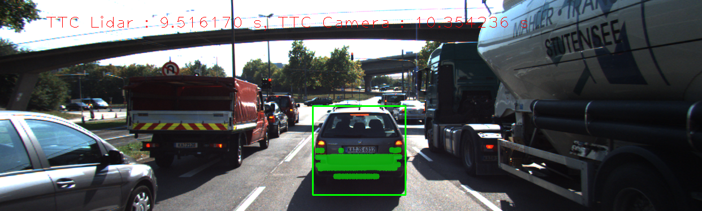 | 289 | 8.57352 | 18.2318
16 |  |  | 297 | 9.51617 | 10.3542
17 |  |  | 279 | 9.54658 | 9.18413
18 |  |  | 303 | 8.3988 | 11.2906
Experiment has 1 result sets
ResultSet has 18 results

## Performance Results (Detector = BRISK, Descriptor = SIFT)

Frame | Lidar points | TTC Lidar | TTC Camera
---:  | ---:  | ---:  | ---: 
1 | 340 | 12.5156 | 13.1273
2 | 309 | 12.6142 | 17.8514
3 | 326 | 14.091 | 16.3788
4 | 322 | 16.6894 | 13.6674
5 | 344 | 15.9082 | 27.708
6 | 352 | 12.6787 | 17.2879
7 | 317 | 11.9844 | 14.2253
8 | 312 | 13.1241 | 17.4067
9 | 311 | 13.0241 | 16.5198
10 | 286 | 11.1746 | 14.2644
11 | 302 | 12.8086 | 12.7231
12 | 302 | 8.95978 | 11.8815
13 | 316 | 9.96439 | 13.8559
14 | 312 | 9.59863 | 10.4874
15 | 289 | 8.57352 | 13.3519
16 | 297 | 9.51617 | 10.9036
17 | 279 | 9.54658 | 10.7831
18 | 303 | 8.3988 | 12.3655

## Performance Results (Detector = BRISK, Descriptor = SIFT)

Frame | Top view perspective of Lidar points showing distance markers | Image with TTC estimates from Lidar and Camera | Lidar points | TTC Lidar | TTC Camera
:---:  | :---:  | :---:  | ---:  | ---:  | ---: 
1 |  |  | 340 | 12.5156 | 13.1273
2 |  | 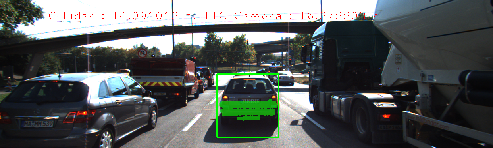 | 309 | 12.6142 | 17.8514
3 |  |  | 326 | 14.091 | 16.3788
4 |  |  | 322 | 16.6894 | 13.6674
5 |  |  | 344 | 15.9082 | 27.708
6 |  |  | 352 | 12.6787 | 17.2879
7 |  |  | 317 | 11.9844 | 14.2253
8 |  |  | 312 | 13.1241 | 17.4067
9 |  |  | 311 | 13.0241 | 16.5198
10 |  |  | 286 | 11.1746 | 14.2644
11 |  |  | 302 | 12.8086 | 12.7231
12 |  |  | 302 | 8.95978 | 11.8815
13 |  |  | 316 | 9.96439 | 13.8559
14 |  |  | 312 | 9.59863 | 10.4874
15 |  |  | 289 | 8.57352 | 13.3519
16 |  |  | 297 | 9.51617 | 10.9036
17 |  |  | 279 | 9.54658 | 10.7831
18 |  |  | 303 | 8.3988 | 12.3655
Experiment has 1 result sets
ResultSet has 18 results

## Performance Results (Detector = ORB, Descriptor = BRISK)

Frame | Lidar points | TTC Lidar | TTC Camera
---:  | ---:  | ---:  | ---: 
1 | 340 | 12.5156 | 37.4084
2 | 309 | 12.6142 | -inf
3 | 326 | 14.091 | 36.2012
4 | 322 | 16.6894 | 21.7788
5 | 344 | 15.9082 | -inf
6 | 352 | 12.6787 | 11.1075
7 | 317 | 11.9844 | -inf
8 | 312 | 13.1241 | 51.3026
9 | 311 | 13.0241 | -inf
10 | 286 | 11.1746 | -inf
11 | 302 | 12.8086 | 8.46717
12 | 302 | 8.95978 | -inf
13 | 316 | 9.96439 | 7.53169
14 | 312 | 9.59863 | 24.6173
15 | 289 | 8.57352 | 13.594
16 | 297 | 9.51617 | -inf
17 | 279 | 9.54658 | 23.6587
18 | 303 | 8.3988 | 29.89

## Performance Results (Detector = ORB, Descriptor = BRISK)

Frame | Top view perspective of Lidar points showing distance markers | Image with TTC estimates from Lidar and Camera | Lidar points | TTC Lidar | TTC Camera
:---:  | :---:  | :---:  | ---:  | ---:  | ---: 
1 |  |  | 340 | 12.5156 | 37.4084
2 |  |  | 309 | 12.6142 | -inf
3 |  |  | 326 | 14.091 | 36.2012
4 |  |  | 322 | 16.6894 | 21.7788
5 |  |  | 344 | 15.9082 | -inf
6 |  |  | 352 | 12.6787 | 11.1075
7 |  | 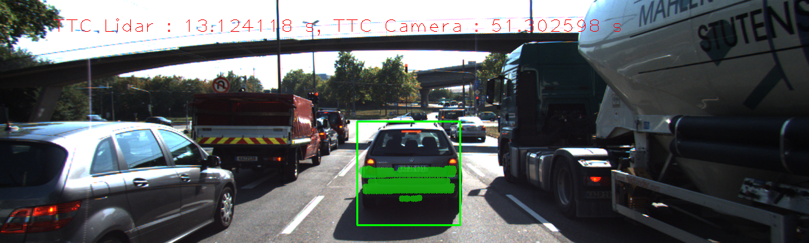 | 317 | 11.9844 | -inf
8 |  |  | 312 | 13.1241 | 51.3026
9 |  |  | 311 | 13.0241 | -inf
10 |  |  | 286 | 11.1746 | -inf
11 |  |  | 302 | 12.8086 | 8.46717
12 |  |  | 302 | 8.95978 | -inf
13 |  |  | 316 | 9.96439 | 7.53169
14 |  |  | 312 | 9.59863 | 24.6173
15 |  |  | 289 | 8.57352 | 13.594
16 |  |  | 297 | 9.51617 | -inf
17 |  |  | 279 | 9.54658 | 23.6587
18 |  |  | 303 | 8.3988 | 29.89
Experiment has 1 result sets
ResultSet has 18 results

## Performance Results (Detector = ORB, Descriptor = BRIEF)

Frame | Lidar points | TTC Lidar | TTC Camera
---:  | ---:  | ---:  | ---: 
1 | 340 | 12.5156 | 27.5288
2 | 309 | 12.6142 | -inf
3 | 326 | 14.091 | 113.496
4 | 322 | 16.6894 | 16.7244
5 | 344 | 15.9082 | 28.5454
6 | 352 | 12.6787 | -48.152
7 | 317 | 11.9844 | -inf
8 | 312 | 13.1241 | 34.6298
9 | 311 | 13.0241 | -inf
10 | 286 | 11.1746 | 168.345
11 | 302 | 12.8086 | 33.5123
12 | 302 | 8.95978 | 36.2236
13 | 316 | 9.96439 | -inf
14 | 312 | 9.59863 | 13.5006
15 | 289 | 8.57352 | -inf
16 | 297 | 9.51617 | 13.0005
17 | 279 | 9.54658 | 20.3758
18 | 303 | 8.3988 | 25.8155

## Performance Results (Detector = ORB, Descriptor = BRIEF)

Frame | Top view perspective of Lidar points showing distance markers | Image with TTC estimates from Lidar and Camera | Lidar points | TTC Lidar | TTC Camera
:---:  | :---:  | :---:  | ---:  | ---:  | ---: 
1 |  |  | 340 | 12.5156 | 27.5288
2 |  |  | 309 | 12.6142 | -inf
3 |  |  | 326 | 14.091 | 113.496
4 |  |  | 322 | 16.6894 | 16.7244
5 |  |  | 344 | 15.9082 | 28.5454
6 |  |  | 352 | 12.6787 | -48.152
7 |  |  | 317 | 11.9844 | -inf
8 |  |  | 312 | 13.1241 | 34.6298
9 |  |  | 311 | 13.0241 | -inf
10 |  |  | 286 | 11.1746 | 168.345
11 |  |  | 302 | 12.8086 | 33.5123
12 |  |  | 302 | 8.95978 | 36.2236
13 |  |  | 316 | 9.96439 | -inf
14 |  |  | 312 | 9.59863 | 13.5006
15 |  |  | 289 | 8.57352 | -inf
16 |  |  | 297 | 9.51617 | 13.0005
17 |  |  | 279 | 9.54658 | 20.3758
18 |  |  | 303 | 8.3988 | 25.8155
Experiment has 2 result sets
ResultSet has 18 results

## Performance Results (Detector = ORB, Descriptor = ORB)

Frame | Lidar points | TTC Lidar | TTC Camera
---:  | ---:  | ---:  | ---: 
1 | 340 | 12.5156 | -inf
2 | 309 | 12.6142 | 10.7758
3 | 326 | 14.091 | 33.1568
4 | 322 | 16.6894 | 25.1615
5 | 344 | 15.9082 | -inf
6 | 352 | 12.6787 | 19.5874
7 | 317 | 11.9844 | -inf
8 | 312 | 13.1241 | -inf
9 | 311 | 13.0241 | -inf
10 | 286 | 11.1746 | -inf
11 | 302 | 12.8086 | 10.8962
12 | 302 | 8.95978 | -inf
13 | 316 | 9.96439 | -inf
14 | 312 | 9.59863 | -inf
15 | 289 | 8.57352 | -inf
16 | 297 | 9.51617 | -inf
17 | 279 | 9.54658 | 12.8853
18 | 303 | 8.3988 | -inf

## Performance Results (Detector = ORB, Descriptor = ORB)

Frame | Top view perspective of Lidar points showing distance markers | Image with TTC estimates from Lidar and Camera | Lidar points | TTC Lidar | TTC Camera
:---:  | :---:  | :---:  | ---:  | ---:  | ---: 
1 |  |  | 340 | 12.5156 | -inf
2 |  |  | 309 | 12.6142 | 10.7758
3 |  | 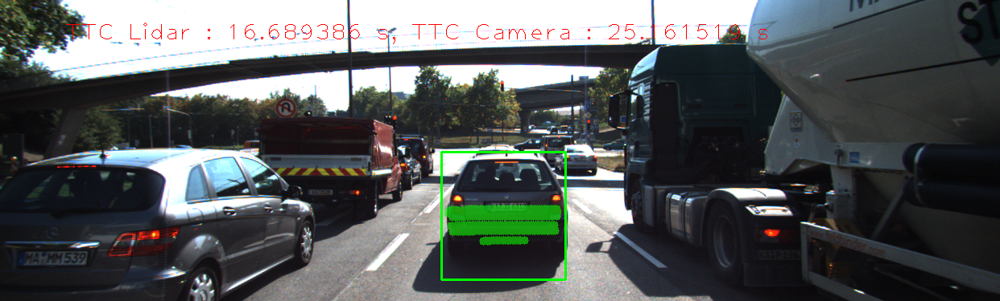 | 326 | 14.091 | 33.1568
4 |  |  | 322 | 16.6894 | 25.1615
5 |  |  | 344 | 15.9082 | -inf
6 |  |  | 352 | 12.6787 | 19.5874
7 |  |  | 317 | 11.9844 | -inf
8 |  |  | 312 | 13.1241 | -inf
9 |  |  | 311 | 13.0241 | -inf
10 |  |  | 286 | 11.1746 | -inf
11 |  |  | 302 | 12.8086 | 10.8962
12 |  |  | 302 | 8.95978 | -inf
13 |  |  | 316 | 9.96439 | -inf
14 |  |  | 312 | 9.59863 | -inf
15 |  |  | 289 | 8.57352 | -inf
16 |  |  | 297 | 9.51617 | -inf
17 |  |  | 279 | 9.54658 | 12.8853
18 |  |  | 303 | 8.3988 | -inf
ResultSet has 18 results

## Performance Results (Detector = ORB, Descriptor = ORB)

Frame | Lidar points | TTC Lidar | TTC Camera
---:  | ---:  | ---:  | ---: 
1 | 340 | 12.5156 | -inf
2 | 309 | 12.6142 | 10.7758
3 | 326 | 14.091 | 33.1568
4 | 322 | 16.6894 | 25.1615
5 | 344 | 15.9082 | -inf
6 | 352 | 12.6787 | 19.5874
7 | 317 | 11.9844 | -inf
8 | 312 | 13.1241 | -inf
9 | 311 | 13.0241 | -inf
10 | 286 | 11.1746 | -inf
11 | 302 | 12.8086 | 10.8962
12 | 302 | 8.95978 | -inf
13 | 316 | 9.96439 | -inf
14 | 312 | 9.59863 | -inf
15 | 289 | 8.57352 | -inf
16 | 297 | 9.51617 | -inf
17 | 279 | 9.54658 | 12.8853
18 | 303 | 8.3988 | -inf

## Performance Results (Detector = ORB, Descriptor = ORB)

Frame | Top view perspective of Lidar points showing distance markers | Image with TTC estimates from Lidar and Camera | Lidar points | TTC Lidar | TTC Camera
:---:  | :---:  | :---:  | ---:  | ---:  | ---: 
1 |  |  | 340 | 12.5156 | -inf
2 |  |  | 309 | 12.6142 | 10.7758
3 |  |  | 326 | 14.091 | 33.1568
4 |  |  | 322 | 16.6894 | 25.1615
5 |  |  | 344 | 15.9082 | -inf
6 |  |  | 352 | 12.6787 | 19.5874
7 |  |  | 317 | 11.9844 | -inf
8 |  |  | 312 | 13.1241 | -inf
9 |  |  | 311 | 13.0241 | -inf
10 |  |  | 286 | 11.1746 | -inf
11 |  |  | 302 | 12.8086 | 10.8962
12 |  |  | 302 | 8.95978 | -inf
13 |  |  | 316 | 9.96439 | -inf
14 |  |  | 312 | 9.59863 | -inf
15 |  |  | 289 | 8.57352 | -inf
16 |  |  | 297 | 9.51617 | -inf
17 |  |  | 279 | 9.54658 | 12.8853
18 |  |  | 303 | 8.3988 | -inf
Experiment has 1 result sets
ResultSet has 18 results

## Performance Results (Detector = ORB, Descriptor = FREAK)

Frame | Lidar points | TTC Lidar | TTC Camera
---:  | ---:  | ---:  | ---: 
1 | 340 | 12.5156 | 11.2686
2 | 309 | 12.6142 | -inf
3 | 326 | 14.091 | 11.669
4 | 322 | 16.6894 | 12.605
5 | 344 | 15.9082 | 167.629
6 | 352 | 12.6787 | 12.8194
7 | 317 | 11.9844 | -inf
8 | 312 | 13.1241 | 11.9978
9 | 311 | 13.0241 | 20.7736
10 | 286 | 11.1746 | -inf
11 | 302 | 12.8086 | 8.34928
12 | 302 | 8.95978 | 25.9864
13 | 316 | 9.96439 | 9.59835
14 | 312 | 9.59863 | 63.442
15 | 289 | 8.57352 | -inf
15 | 289 | 8.57352 | -inf
17 | 279 | 9.54658 | -inf
18 | 303 | 8.3988 | 8.14326

## Performance Results (Detector = ORB, Descriptor = FREAK)

Frame | Top view perspective of Lidar points showing distance markers | Image with TTC estimates from Lidar and Camera | Lidar points | TTC Lidar | TTC Camera
:---:  | :---:  | :---:  | ---:  | ---:  | ---: 
1 |  | 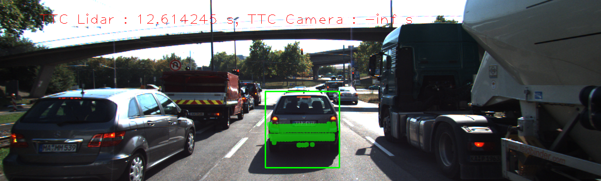 | 340 | 12.5156 | 11.2686
2 |  |  | 309 | 12.6142 | -inf
3 |  |  | 326 | 14.091 | 11.669
4 |  |  | 322 | 16.6894 | 12.605
5 |  |  | 344 | 15.9082 | 167.629
6 |  |  | 352 | 12.6787 | 12.8194
7 |  |  | 317 | 11.9844 | -inf
8 |  |  | 312 | 13.1241 | 11.9978
9 |  |  | 311 | 13.0241 | 20.7736
10 |  | 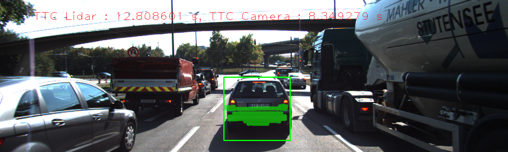 | 286 | 11.1746 | -inf
11 |  |  | 302 | 12.8086 | 8.34928
12 |  |  | 302 | 8.95978 | 25.9864
13 |  |  | 316 | 9.96439 | 9.59835
14 |  | 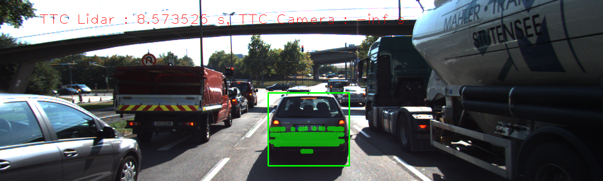 | 312 | 9.59863 | 63.442
15 |  |  | 289 | 8.57352 | -inf
15 |  |  | 289 | 8.57352 | -inf
17 |  |  | 279 | 9.54658 | -inf
18 |  |  | 303 | 8.3988 | 8.14326
Experiment has 1 result sets
ResultSet has 18 results

## Performance Results (Detector = ORB, Descriptor = SIFT)

Frame | Lidar points | TTC Lidar | TTC Camera
---:  | ---:  | ---:  | ---: 
1 | 340 | 12.5156 | 15.8655
2 | 309 | 12.6142 | 16.0911
3 | 326 | 14.091 | 15.3451
4 | 322 | 16.6894 | 293.964
5 | 344 | 15.9082 | 59.0092
6 | 352 | 12.6787 | 15.5425
7 | 317 | 11.9844 | 129.898
8 | 312 | 13.1241 | 12.2933
9 | 311 | 13.0241 | 19.8085
10 | 286 | 11.1746 | -inf
11 | 302 | 12.8086 | 7.44098
12 | 302 | 8.95978 | -inf
13 | 316 | 9.96439 | 65.2345
14 | 312 | 9.59863 | 12.8361
15 | 289 | 8.57352 | -inf
16 | 297 | 9.51617 | 13.2776
17 | 279 | 9.54658 | 21.392
18 | 303 | 8.3988 | 17.0851

## Performance Results (Detector = ORB, Descriptor = SIFT)

Frame | Top view perspective of Lidar points showing distance markers | Image with TTC estimates from Lidar and Camera | Lidar points | TTC Lidar | TTC Camera
:---:  | :---:  | :---:  | ---:  | ---:  | ---: 
1 |  |  | 340 | 12.5156 | 15.8655
2 |  |  | 309 | 12.6142 | 16.0911
3 |  |  | 326 | 14.091 | 15.3451
4 | 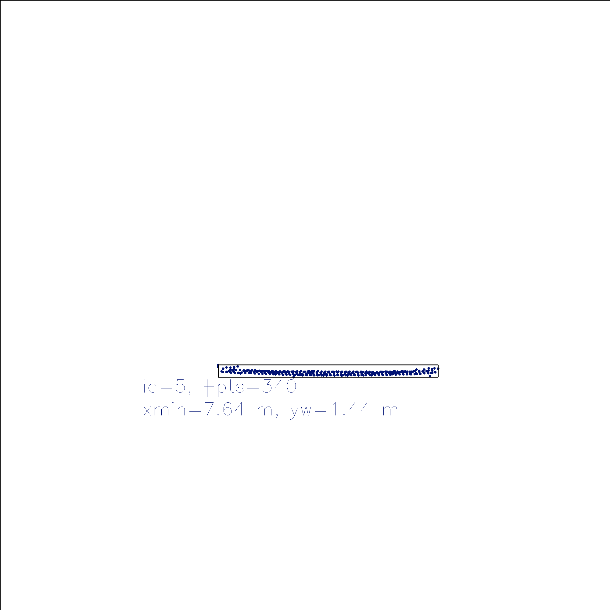 |  | 322 | 16.6894 | 293.964
5 |  |  | 344 | 15.9082 | 59.0092
6 |  |  | 352 | 12.6787 | 15.5425
7 |  |  | 317 | 11.9844 | 129.898
8 |  |  | 312 | 13.1241 | 12.2933
9 |  |  | 311 | 13.0241 | 19.8085
10 |  |  | 286 | 11.1746 | -inf
11 |  |  | 302 | 12.8086 | 7.44098
12 |  |  | 302 | 8.95978 | -inf
13 |  |  | 316 | 9.96439 | 65.2345
14 |  |  | 312 | 9.59863 | 12.8361
15 |  |  | 289 | 8.57352 | -inf
16 |  |  | 297 | 9.51617 | 13.2776
17 |  |  | 279 | 9.54658 | 21.392
18 |  |  | 303 | 8.3988 | 17.0851
Experiment has 1 result sets
ResultSet has 18 results

## Performance Results (Detector = AKAZE, Descriptor = BRISK)

Frame | Lidar points | TTC Lidar | TTC Camera
---:  | ---:  | ---:  | ---: 
1 | 340 | 12.5156 | 16.6557
2 | 309 | 12.6142 | 20.3352
3 | 326 | 14.091 | 13.3659
4 | 322 | 16.6894 | 17.5261
5 | 344 | 15.9082 | 18.0806
6 | 352 | 12.6787 | 14.7084
7 | 317 | 11.9844 | 15.8833
8 | 312 | 13.1241 | 13.9229
9 | 311 | 13.0241 | 13.8234
10 | 286 | 11.1746 | 15.7516
11 | 302 | 12.8086 | 12.3627
12 | 302 | 8.95978 | 15.532
13 | 316 | 9.96439 | 10.0855
14 | 312 | 9.59863 | 14.1883
15 | 289 | 8.57352 | 17.3489
16 | 297 | 9.51617 | 13.8749
17 | 279 | 9.54658 | 11.5526
18 | 303 | 8.3988 | 8.92524

## Performance Results (Detector = AKAZE, Descriptor = BRISK)

Frame | Top view perspective of Lidar points showing distance markers | Image with TTC estimates from Lidar and Camera | Lidar points | TTC Lidar | TTC Camera
:---:  | :---:  | :---:  | ---:  | ---:  | ---: 
1 |  |  | 340 | 12.5156 | 16.6557
2 |  |  | 309 | 12.6142 | 20.3352
3 |  |  | 326 | 14.091 | 13.3659
4 |  |  | 322 | 16.6894 | 17.5261
5 |  |  | 344 | 15.9082 | 18.0806
6 |  |  | 352 | 12.6787 | 14.7084
7 |  |  | 317 | 11.9844 | 15.8833
8 |  | 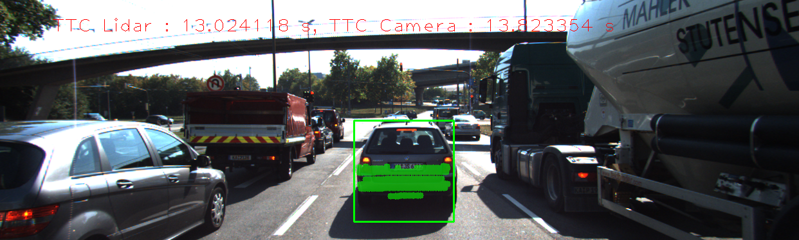 | 312 | 13.1241 | 13.9229
9 |  |  | 311 | 13.0241 | 13.8234
10 |  |  | 286 | 11.1746 | 15.7516
11 |  |  | 302 | 12.8086 | 12.3627
12 |  |  | 302 | 8.95978 | 15.532
13 |  |  | 316 | 9.96439 | 10.0855
14 |  | 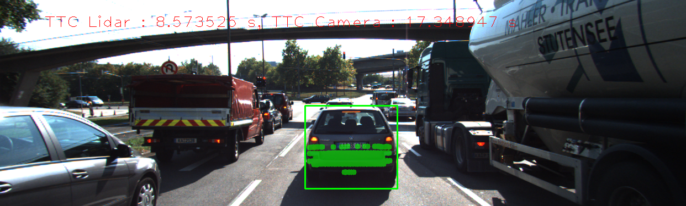 | 312 | 9.59863 | 14.1883
15 |  |  | 289 | 8.57352 | 17.3489
16 |  |  | 297 | 9.51617 | 13.8749
17 |  |  | 279 | 9.54658 | 11.5526
18 |  |  | 303 | 8.3988 | 8.92524
Experiment has 1 result sets
ResultSet has 18 results

## Performance Results (Detector = AKAZE, Descriptor = BRIEF)

Frame | Lidar points | TTC Lidar | TTC Camera
---:  | ---:  | ---:  | ---: 
1 | 340 | 12.5156 | 19.0025
2 | 309 | 12.6142 | 15.0455
3 | 326 | 14.091 | 16.3543
4 | 322 | 16.6894 | 13.8482
5 | 344 | 15.9082 | 18.0853
6 | 352 | 12.6787 | 19.7851
7 | 317 | 11.9844 | 21.0141
8 | 312 | 13.1241 | 14.121
9 | 311 | 13.0241 | 21.3561
10 | 286 | 11.1746 | 11.5709
11 | 302 | 12.8086 | 15.7328
12 | 302 | 8.95978 | 17.6087
13 | 316 | 9.96439 | 10.1939
14 | 312 | 9.59863 | 14.1695
15 | 289 | 8.57352 | 15.078
16 | 297 | 9.51617 | 11.8398
17 | 279 | 9.54658 | 11.0314
18 | 303 | 8.3988 | 10.4702

## Performance Results (Detector = AKAZE, Descriptor = BRIEF)

Frame | Top view perspective of Lidar points showing distance markers | Image with TTC estimates from Lidar and Camera | Lidar points | TTC Lidar | TTC Camera
:---:  | :---:  | :---:  | ---:  | ---:  | ---: 
1 |  |  | 340 | 12.5156 | 19.0025
2 |  |  | 309 | 12.6142 | 15.0455
3 |  | 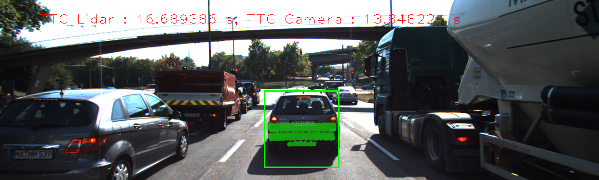 | 326 | 14.091 | 16.3543
4 |  |  | 322 | 16.6894 | 13.8482
5 |  |  | 344 | 15.9082 | 18.0853
6 |  |  | 352 | 12.6787 | 19.7851
7 |  |  | 317 | 11.9844 | 21.0141
8 |  |  | 312 | 13.1241 | 14.121
9 |  |  | 311 | 13.0241 | 21.3561
10 |  |  | 286 | 11.1746 | 11.5709
11 |  |  | 302 | 12.8086 | 15.7328
12 | 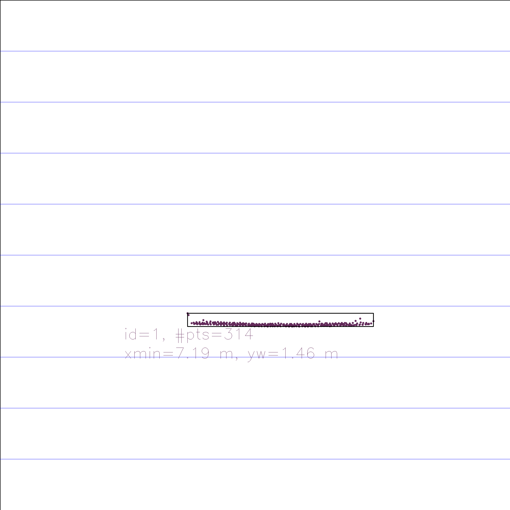 |  | 302 | 8.95978 | 17.6087
13 |  |  | 316 | 9.96439 | 10.1939
14 |  |  | 312 | 9.59863 | 14.1695
15 |  |  | 289 | 8.57352 | 15.078
16 |  |  | 297 | 9.51617 | 11.8398
17 |  |  | 279 | 9.54658 | 11.0314
18 |  |  | 303 | 8.3988 | 10.4702
Experiment has 2 result sets
ResultSet has 18 results

## Performance Results (Detector = AKAZE, Descriptor = ORB)

Frame | Lidar points | TTC Lidar | TTC Camera
---:  | ---:  | ---:  | ---: 
1 | 340 | 12.5156 | 15.9469
2 | 309 | 12.6142 | 19.9608
3 | 326 | 14.091 | 15.4594
4 | 322 | 16.6894 | 16.9392
5 | 344 | 15.9082 | 15.8082
6 | 352 | 12.6787 | 20.2502
7 | 317 | 11.9844 | 21.2964
8 | 312 | 13.1241 | 20.762
9 | 311 | 13.0241 | 21.0915
10 | 286 | 11.1746 | 11.5597
11 | 302 | 12.8086 | 16.191
12 | 302 | 8.95978 | 11.4861
13 | 316 | 9.96439 | 13.9327
14 | 312 | 9.59863 | 12.2712
15 | 289 | 8.57352 | 10.2055
16 | 297 | 9.51617 | 9.73338
17 | 279 | 9.54658 | 11.0158
18 | 303 | 8.3988 | 11.8134

## Performance Results (Detector = AKAZE, Descriptor = ORB)

Frame | Top view perspective of Lidar points showing distance markers | Image with TTC estimates from Lidar and Camera | Lidar points | TTC Lidar | TTC Camera
:---:  | :---:  | :---:  | ---:  | ---:  | ---: 
1 |  |  | 340 | 12.5156 | 15.9469
2 |  |  | 309 | 12.6142 | 19.9608
3 |  |  | 326 | 14.091 | 15.4594
4 |  |  | 322 | 16.6894 | 16.9392
5 |  |  | 344 | 15.9082 | 15.8082
6 |  |  | 352 | 12.6787 | 20.2502
7 |  |  | 317 | 11.9844 | 21.2964
8 |  |  | 312 | 13.1241 | 20.762
9 |  |  | 311 | 13.0241 | 21.0915
10 |  |  | 286 | 11.1746 | 11.5597
11 |  |  | 302 | 12.8086 | 16.191
12 |  |  | 302 | 8.95978 | 11.4861
13 |  |  | 316 | 9.96439 | 13.9327
14 |  |  | 312 | 9.59863 | 12.2712
15 |  |  | 289 | 8.57352 | 10.2055
16 |  |  | 297 | 9.51617 | 9.73338
17 |  |  | 279 | 9.54658 | 11.0158
18 |  |  | 303 | 8.3988 | 11.8134
ResultSet has 18 results

## Performance Results (Detector = AKAZE, Descriptor = ORB)

Frame | Lidar points | TTC Lidar | TTC Camera
---:  | ---:  | ---:  | ---: 
1 | 340 | 12.5156 | 15.9469
2 | 309 | 12.6142 | 19.9608
3 | 326 | 14.091 | 15.4594
4 | 322 | 16.6894 | 16.9392
5 | 344 | 15.9082 | 15.8082
6 | 352 | 12.6787 | 20.2502
7 | 317 | 11.9844 | 21.2964
8 | 312 | 13.1241 | 20.762
9 | 311 | 13.0241 | 21.0915
10 | 286 | 11.1746 | 11.5597
11 | 302 | 12.8086 | 16.191
12 | 302 | 8.95978 | 11.4861
13 | 316 | 9.96439 | 13.9327
14 | 312 | 9.59863 | 12.2712
15 | 289 | 8.57352 | 10.2055
16 | 297 | 9.51617 | 9.73338
17 | 279 | 9.54658 | 11.0158
18 | 303 | 8.3988 | 11.8134

## Performance Results (Detector = AKAZE, Descriptor = ORB)

Frame | Top view perspective of Lidar points showing distance markers | Image with TTC estimates from Lidar and Camera | Lidar points | TTC Lidar | TTC Camera
:---:  | :---:  | :---:  | ---:  | ---:  | ---: 
1 |  |  | 340 | 12.5156 | 15.9469
2 |  |  | 309 | 12.6142 | 19.9608
3 |  |  | 326 | 14.091 | 15.4594
4 |  |  | 322 | 16.6894 | 16.9392
5 |  |  | 344 | 15.9082 | 15.8082
6 |  |  | 352 | 12.6787 | 20.2502
7 |  |  | 317 | 11.9844 | 21.2964
8 |  |  | 312 | 13.1241 | 20.762
9 |  |  | 311 | 13.0241 | 21.0915
10 |  |  | 286 | 11.1746 | 11.5597
11 |  |  | 302 | 12.8086 | 16.191
12 |  |  | 302 | 8.95978 | 11.4861
13 |  |  | 316 | 9.96439 | 13.9327
14 |  |  | 312 | 9.59863 | 12.2712
15 |  |  | 289 | 8.57352 | 10.2055
16 |  |  | 297 | 9.51617 | 9.73338
17 |  |  | 279 | 9.54658 | 11.0158
18 |  |  | 303 | 8.3988 | 11.8134
Experiment has 1 result sets
ResultSet has 18 results

## Performance Results (Detector = AKAZE, Descriptor = FREAK)

Frame | Lidar points | TTC Lidar | TTC Camera
---:  | ---:  | ---:  | ---: 
1 | 340 | 12.5156 | 13.0099
2 | 309 | 12.6142 | 15.7044
3 | 326 | 14.091 | 16.028
4 | 322 | 16.6894 | 14.1762
5 | 344 | 15.9082 | 16.2229
6 | 352 | 12.6787 | 14.4455
7 | 317 | 11.9844 | 15.372
8 | 312 | 13.1241 | 20.6109
9 | 311 | 13.0241 | 21.3561
10 | 286 | 11.1746 | 11.8941
11 | 302 | 12.8086 | 12.162
12 | 302 | 8.95978 | 16.9222
13 | 316 | 9.96439 | 10.6851
14 | 312 | 9.59863 | 9.87627
15 | 289 | 8.57352 | 9.89452
16 | 297 | 9.51617 | 13.4374
17 | 279 | 9.54658 | 11.0174
18 | 303 | 8.3988 | 8.79442

## Performance Results (Detector = AKAZE, Descriptor = FREAK)

Frame | Top view perspective of Lidar points showing distance markers | Image with TTC estimates from Lidar and Camera | Lidar points | TTC Lidar | TTC Camera
:---:  | :---:  | :---:  | ---:  | ---:  | ---: 
1 |  |  | 340 | 12.5156 | 13.0099
2 |  |  | 309 | 12.6142 | 15.7044
3 |  |  | 326 | 14.091 | 16.028
4 |  |  | 322 | 16.6894 | 14.1762
5 |  |  | 344 | 15.9082 | 16.2229
6 |  |  | 352 | 12.6787 | 14.4455
7 |  |  | 317 | 11.9844 | 15.372
8 |  |  | 312 | 13.1241 | 20.6109
9 |  |  | 311 | 13.0241 | 21.3561
10 |  |  | 286 | 11.1746 | 11.8941
11 |  |  | 302 | 12.8086 | 12.162
12 |  |  | 302 | 8.95978 | 16.9222
13 |  |  | 316 | 9.96439 | 10.6851
14 |  |  | 312 | 9.59863 | 9.87627
15 |  |  | 289 | 8.57352 | 9.89452
16 |  |  | 297 | 9.51617 | 13.4374
17 |  |  | 279 | 9.54658 | 11.0174
18 |  |  | 303 | 8.3988 | 8.79442
Experiment has 2 result sets
ResultSet has 18 results

## Performance Results (Detector = AKAZE, Descriptor = AKAZE)

Frame | Lidar points | TTC Lidar | TTC Camera
---:  | ---:  | ---:  | ---: 
1 | 340 | 12.5156 | 14.1092
2 | 309 | 12.6142 | 19.3702
3 | 326 | 14.091 | 14.6982
4 | 322 | 16.6894 | 14.2488
5 | 344 | 15.9082 | 16.4623
6 | 352 | 12.6787 | 18.819
7 | 317 | 11.9844 | 16.0062
8 | 312 | 13.1241 | 19.157
9 | 311 | 13.0241 | 19.2298
10 | 286 | 11.1746 | 15.7359
11 | 302 | 12.8086 | 14.7002
12 | 302 | 8.95978 | 13.718
13 | 316 | 9.96439 | 11.0846
14 | 312 | 9.59863 | 13.7665
15 | 289 | 8.57352 | 13.9045
16 | 297 | 9.51617 | 12.4994
17 | 279 | 9.54658 | 10.8614
18 | 303 | 8.3988 | 11.0561

## Performance Results (Detector = AKAZE, Descriptor = AKAZE)

Frame | Top view perspective of Lidar points showing distance markers | Image with TTC estimates from Lidar and Camera | Lidar points | TTC Lidar | TTC Camera
:---:  | :---:  | :---:  | ---:  | ---:  | ---: 
1 |  |  | 340 | 12.5156 | 14.1092
2 |  |  | 309 | 12.6142 | 19.3702
3 |  |  | 326 | 14.091 | 14.6982
4 |  |  | 322 | 16.6894 | 14.2488
5 |  |  | 344 | 15.9082 | 16.4623
6 |  |  | 352 | 12.6787 | 18.819
7 |  |  | 317 | 11.9844 | 16.0062
8 |  |  | 312 | 13.1241 | 19.157
9 |  |  | 311 | 13.0241 | 19.2298
10 |  |  | 286 | 11.1746 | 15.7359
11 |  |  | 302 | 12.8086 | 14.7002
12 |  |  | 302 | 8.95978 | 13.718
13 |  |  | 316 | 9.96439 | 11.0846
14 |  |  | 312 | 9.59863 | 13.7665
15 |  |  | 289 | 8.57352 | 13.9045
16 |  |  | 297 | 9.51617 | 12.4994
17 |  |  | 279 | 9.54658 | 10.8614
18 |  |  | 303 | 8.3988 | 11.0561
ResultSet has 18 results

## Performance Results (Detector = AKAZE, Descriptor = AKAZE)

Frame | Lidar points | TTC Lidar | TTC Camera
---:  | ---:  | ---:  | ---: 
1 | 340 | 12.5156 | 14.1092
2 | 309 | 12.6142 | 19.3702
3 | 326 | 14.091 | 14.6982
4 | 322 | 16.6894 | 14.2488
5 | 344 | 15.9082 | 16.4623
6 | 352 | 12.6787 | 18.819
7 | 317 | 11.9844 | 16.0062
8 | 312 | 13.1241 | 19.157
9 | 311 | 13.0241 | 19.2298
10 | 286 | 11.1746 | 15.7359
11 | 302 | 12.8086 | 14.7002
12 | 302 | 8.95978 | 13.718
13 | 316 | 9.96439 | 11.0846
14 | 312 | 9.59863 | 13.7665
15 | 289 | 8.57352 | 13.9045
16 | 297 | 9.51617 | 12.4994
17 | 279 | 9.54658 | 10.8614
18 | 303 | 8.3988 | 11.0561

## Performance Results (Detector = AKAZE, Descriptor = AKAZE)

Frame | Top view perspective of Lidar points showing distance markers | Image with TTC estimates from Lidar and Camera | Lidar points | TTC Lidar | TTC Camera
:---:  | :---:  | :---:  | ---:  | ---:  | ---: 
1 |  |  | 340 | 12.5156 | 14.1092
2 |  |  | 309 | 12.6142 | 19.3702
3 |  |  | 326 | 14.091 | 14.6982
4 |  |  | 322 | 16.6894 | 14.2488
5 |  |  | 344 | 15.9082 | 16.4623
6 |  |  | 352 | 12.6787 | 18.819
7 |  |  | 317 | 11.9844 | 16.0062
8 |  |  | 312 | 13.1241 | 19.157
9 |  |  | 311 | 13.0241 | 19.2298
10 |  |  | 286 | 11.1746 | 15.7359
11 |  |  | 302 | 12.8086 | 14.7002
12 |  |  | 302 | 8.95978 | 13.718
13 |  |  | 316 | 9.96439 | 11.0846
14 |  |  | 312 | 9.59863 | 13.7665
15 |  |  | 289 | 8.57352 | 13.9045
16 |  |  | 297 | 9.51617 | 12.4994
17 |  |  | 279 | 9.54658 | 10.8614
18 |  |  | 303 | 8.3988 | 11.0561
Experiment has 1 result sets
ResultSet has 18 results

## Performance Results (Detector = AKAZE, Descriptor = SIFT)

Frame | Lidar points | TTC Lidar | TTC Camera
---:  | ---:  | ---:  | ---: 
1 | 340 | 12.5156 | 12.1702
2 | 309 | 12.6142 | 19.6201
3 | 326 | 14.091 | 15.4951
4 | 322 | 16.6894 | 16.3802
5 | 344 | 15.9082 | 19.5266
6 | 352 | 12.6787 | 22.9059
7 | 317 | 11.9844 | 15.5453
8 | 312 | 13.1241 | 17.5596
9 | 311 | 13.0241 | 16.7731
10 | 286 | 11.1746 | 12.9801
11 | 302 | 12.8086 | 13.419
12 | 302 | 8.95978 | 13.2617
13 | 316 | 9.96439 | 14.5664
14 | 312 | 9.59863 | 14.3813
15 | 289 | 8.57352 | 14.4444
16 | 297 | 9.51617 | 10.0024
17 | 279 | 9.54658 | 11.0174
18 | 303 | 8.3988 | 10.5579

## Performance Results (Detector = AKAZE, Descriptor = SIFT)

Frame | Top view perspective of Lidar points showing distance markers | Image with TTC estimates from Lidar and Camera | Lidar points | TTC Lidar | TTC Camera
:---:  | :---:  | :---:  | ---:  | ---:  | ---: 
1 |  |  | 340 | 12.5156 | 12.1702
2 |  |  | 309 | 12.6142 | 19.6201
3 |  |  | 326 | 14.091 | 15.4951
4 |  |  | 322 | 16.6894 | 16.3802
5 |  | 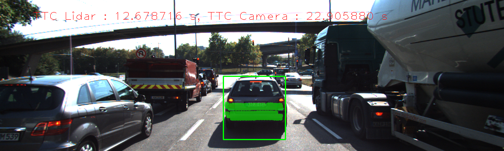 | 344 | 15.9082 | 19.5266
6 |  |  | 352 | 12.6787 | 22.9059
7 |  |  | 317 | 11.9844 | 15.5453
8 |  |  | 312 | 13.1241 | 17.5596
9 |  |  | 311 | 13.0241 | 16.7731
10 |  |  | 286 | 11.1746 | 12.9801
11 |  |  | 302 | 12.8086 | 13.419
12 |  |  | 302 | 8.95978 | 13.2617
13 |  |  | 316 | 9.96439 | 14.5664
14 |  |  | 312 | 9.59863 | 14.3813
15 |  |  | 289 | 8.57352 | 14.4444
16 |  | 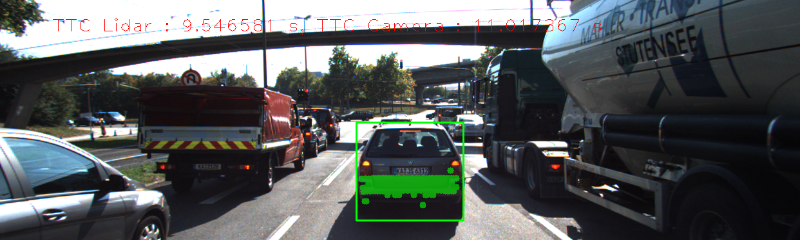 | 297 | 9.51617 | 10.0024
17 |  |  | 279 | 9.54658 | 11.0174
18 |  |  | 303 | 8.3988 | 10.5579
Experiment has 1 result sets
ResultSet has 9 results

## Performance Results (Detector = SIFT, Descriptor = BRISK)

Frame | Lidar points | TTC Lidar | TTC Camera
---:  | ---:  | ---:  | ---: 
1 | 340 | 12.5156 | 12.2506
3 | 326 | 14.091 | 21.4077
5 | 344 | 15.9082 | 23.9242
7 | 317 | 11.9844 | 15.5788
9 | 311 | 13.0241 | 12.5821
11 | 302 | 12.8086 | 13.6225
13 | 316 | 9.96439 | 9.85855
15 | 289 | 8.57352 | 12.3265
17 | 279 | 9.54658 | 9.47992

## Performance Results (Detector = SIFT, Descriptor = BRISK)

Frame | Top view perspective of Lidar points showing distance markers | Image with TTC estimates from Lidar and Camera | Lidar points | TTC Lidar | TTC Camera
:---:  | :---:  | :---:  | ---:  | ---:  | ---: 
1 |  |  | 340 | 12.5156 | 12.2506
3 |  |  | 326 | 14.091 | 21.4077
5 |  |  | 344 | 15.9082 | 23.9242
7 |  |  | 317 | 11.9844 | 15.5788
9 |  |  | 311 | 13.0241 | 12.5821
11 |  |  | 302 | 12.8086 | 13.6225
13 |  |  | 316 | 9.96439 | 9.85855
15 |  |  | 289 | 8.57352 | 12.3265
17 |  |  | 279 | 9.54658 | 9.47992
Experiment has 1 result sets
ResultSet has 9 results

## Performance Results (Detector = SIFT, Descriptor = BRIEF)

Frame | Lidar points | TTC Lidar | TTC Camera
---:  | ---:  | ---:  | ---: 
1 | 340 | 12.5156 | 11.9436
3 | 326 | 14.091 | 15.5012
5 | 344 | 15.9082 | 14.7056
7 | 317 | 11.9844 | 15.1492
9 | 311 | 13.0241 | 12.009
11 | 302 | 12.8086 | 11.9281
13 | 316 | 9.96439 | 9.52669
15 | 289 | 8.57352 | 9.24158
17 | 279 | 9.54658 | 10.8549

## Performance Results (Detector = SIFT, Descriptor = BRIEF)

Frame | Top view perspective of Lidar points showing distance markers | Image with TTC estimates from Lidar and Camera | Lidar points | TTC Lidar | TTC Camera
:---:  | :---:  | :---:  | ---:  | ---:  | ---: 
1 |  |  | 340 | 12.5156 | 11.9436
3 |  |  | 326 | 14.091 | 15.5012
5 |  |  | 344 | 15.9082 | 14.7056
7 |  |  | 317 | 11.9844 | 15.1492
9 |  |  | 311 | 13.0241 | 12.009
11 |  |  | 302 | 12.8086 | 11.9281
13 |  |  | 316 | 9.96439 | 9.52669
15 |  |  | 289 | 8.57352 | 9.24158
17 |  |  | 279 | 9.54658 | 10.8549
Experiment has 1 result sets
ResultSet has 9 results

## Performance Results (Detector = SIFT, Descriptor = FREAK)

Frame | Lidar points | TTC Lidar | TTC Camera
---:  | ---:  | ---:  | ---: 
1 | 340 | 12.5156 | 12.0485
3 | 326 | 14.091 | 14.1195
5 | 344 | 15.9082 | 16.4509
7 | 317 | 11.9844 | 15.2205
9 | 311 | 13.0241 | 14.2745
11 | 302 | 12.8086 | 16.9532
13 | 316 | 9.96439 | 11.4831
15 | 289 | 8.57352 | 9.48731
17 | 279 | 9.54658 | 9.40456

## Performance Results (Detector = SIFT, Descriptor = FREAK)

Frame | Top view perspective of Lidar points showing distance markers | Image with TTC estimates from Lidar and Camera | Lidar points | TTC Lidar | TTC Camera
:---:  | :---:  | :---:  | ---:  | ---:  | ---: 
1 |  |  | 340 | 12.5156 | 12.0485
3 |  |  | 326 | 14.091 | 14.1195
5 |  |  | 344 | 15.9082 | 16.4509
7 |  |  | 317 | 11.9844 | 15.2205
9 |  |  | 311 | 13.0241 | 14.2745
11 |  |  | 302 | 12.8086 | 16.9532
13 |  |  | 316 | 9.96439 | 11.4831
15 |  |  | 289 | 8.57352 | 9.48731
17 |  |  | 279 | 9.54658 | 9.40456
Experiment has 1 result sets
ResultSet has 18 results

## Performance Results (Detector = SIFT, Descriptor = SIFT)

Frame | Lidar points | TTC Lidar | TTC Camera
---:  | ---:  | ---:  | ---: 
1 | 340 | 12.5156 | 11.3868
2 | 309 | 12.6142 | 12.4937
3 | 326 | 14.091 | 12.9327
4 | 322 | 16.6894 | 18.8184
5 | 344 | 15.9082 | 12.4983
6 | 352 | 12.6787 | 11.2969
7 | 317 | 11.9844 | 13.5231
8 | 312 | 13.1241 | 15.0608
9 | 311 | 13.0241 | 12.9662
10 | 286 | 11.1746 | 10.5698
11 | 302 | 12.8086 | 11.2481
12 | 302 | 8.95978 | 10.9771
13 | 316 | 9.96439 | 13.5733
14 | 312 | 9.59863 | 10.5836
15 | 289 | 8.57352 | 9.77464
16 | 297 | 9.51617 | 9.05267
17 | 279 | 9.54658 | 8.69186
18 | 303 | 8.3988 | 8.93007

## Performance Results (Detector = SIFT, Descriptor = SIFT)

Frame | Top view perspective of Lidar points showing distance markers | Image with TTC estimates from Lidar and Camera | Lidar points | TTC Lidar | TTC Camera
:---:  | :---:  | :---:  | ---:  | ---:  | ---: 
1 |  |  | 340 | 12.5156 | 11.3868
2 |  |  | 309 | 12.6142 | 12.4937
3 |  |  | 326 | 14.091 | 12.9327
4 |  |  | 322 | 16.6894 | 18.8184
5 |  |  | 344 | 15.9082 | 12.4983
6 |  |  | 352 | 12.6787 | 11.2969
7 |  |  | 317 | 11.9844 | 13.5231
8 |  |  | 312 | 13.1241 | 15.0608
9 |  |  | 311 | 13.0241 | 12.9662
10 |  |  | 286 | 11.1746 | 10.5698
11 |  |  | 302 | 12.8086 | 11.2481
12 |  |  | 302 | 8.95978 | 10.9771
13 |  |  | 316 | 9.96439 | 13.5733
14 |  |  | 312 | 9.59863 | 10.5836
15 |  |  | 289 | 8.57352 | 9.77464
16 |  |  | 297 | 9.51617 | 9.05267
17 |  | 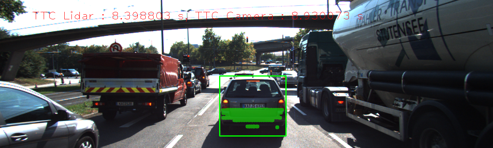 | 279 | 9.54658 | 8.69186
18 |  |  | 303 | 8.3988 | 8.93007
