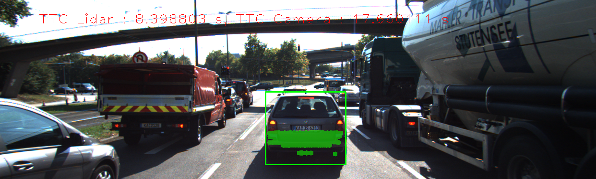
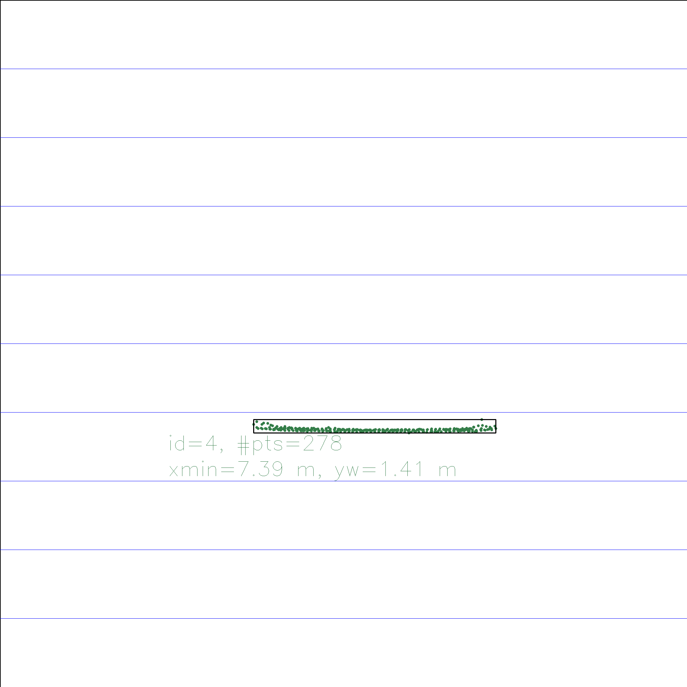

Size of Experiment Set = 35
Experiment has 1 result sets
ResultSet has 18 results

## Performance Results (Detector = Shi_Tomasi, Descriptor = BRISK)

Frame | Lidar points | TTC Lidar | TTC Camera
---:  | ---:  | ---:  | ---: 
1 | 340 | 12.5156 | 14.1119
2 | 309 | 12.6142 | 14.7273
3 | 326 | 14.091 | 13.4904
4 | 322 | 16.6894 | 12.398
5 | 344 | 15.9082 | 12.6754
6 | 352 | 12.6787 | -inf
7 | 317 | 11.9844 | -inf
8 | 312 | 13.1241 | -inf
9 | 311 | 13.0241 | 11.5126
10 | 286 | 11.1746 | -inf
11 | 302 | 12.8086 | 11.3024
12 | 302 | 8.95978 | 11.6524
13 | 316 | 9.96439 | 11.7243
14 | 312 | 9.59863 | 11.8781
15 | 289 | 8.57352 | 9.33785
16 | 297 | 9.51617 | 11.3079
17 | 279 | 9.54658 | 11.4487
18 | 303 | 8.3988 | 9.12792

## Performance Results (Detector = Shi_Tomasi, Descriptor = BRISK)

Frame | Top view perspective of Lidar points showing distance markers | Image with TTC estimates from Lidar and Camera | Lidar points | TTC Lidar | TTC Camera
:---:  | :---:  | :---:  | ---:  | ---:  | ---: 
1 |  |  | 340 | 12.5156 | 14.1119
2 |  |  | 309 | 12.6142 | 14.7273
3 |  |  | 326 | 14.091 | 13.4904
4 |  |  | 322 | 16.6894 | 12.398
5 |  |  | 344 | 15.9082 | 12.6754
6 |  |  | 352 | 12.6787 | -inf
7 |  |  | 317 | 11.9844 | -inf
8 |  |  | 312 | 13.1241 | -inf
9 |  |  | 311 | 13.0241 | 11.5126
10 |  |  | 286 | 11.1746 | -inf
11 |  |  | 302 | 12.8086 | 11.3024
12 |  |  | 302 | 8.95978 | 11.6524
13 |  |  | 316 | 9.96439 | 11.7243
14 |  |  | 312 | 9.59863 | 11.8781
15 |  |  | 289 | 8.57352 | 9.33785
16 |  |  | 297 | 9.51617 | 11.3079
17 |  |  | 279 | 9.54658 | 11.4487
18 |  |  | 303 | 8.3988 | 9.12792
Experiment has 1 result sets
ResultSet has 18 results

## Performance Results (Detector = Shi_Tomasi, Descriptor = BRIEF)

Frame | Lidar points | TTC Lidar | TTC Camera
---:  | ---:  | ---:  | ---: 
1 | 340 | 12.5156 | 13.8948
2 | 309 | 12.6142 | 13.1487
3 | 326 | 14.091 | 22.6781
4 | 322 | 16.6894 | 13.81
5 | 344 | 15.9082 | 12.1886
6 | 352 | 12.6787 | 15.1561
7 | 317 | 11.9844 | 18.3368
8 | 312 | 13.1241 | 12.3793
9 | 311 | 13.0241 | 12.463
10 | 286 | 11.1746 | 13.3448
11 | 302 | 12.8086 | 12.2
12 | 302 | 8.95978 | 12.2294
13 | 316 | 9.96439 | 12.3292
14 | 312 | 9.59863 | 12.7102
15 | 289 | 8.57352 | 12.9788
16 | 297 | 9.51617 | 11.3856
17 | 279 | 9.54658 | 13.6063
18 | 303 | 8.3988 | 7.75039

## Performance Results (Detector = Shi_Tomasi, Descriptor = BRIEF)

Frame | Top view perspective of Lidar points showing distance markers | Image with TTC estimates from Lidar and Camera | Lidar points | TTC Lidar | TTC Camera
:---:  | :---:  | :---:  | ---:  | ---:  | ---: 
1 |  |  | 340 | 12.5156 | 13.8948
2 |  |  | 309 | 12.6142 | 13.1487
3 |  |  | 326 | 14.091 | 22.6781
4 |  |  | 322 | 16.6894 | 13.81
5 |  |  | 344 | 15.9082 | 12.1886
6 |  |  | 352 | 12.6787 | 15.1561
7 |  |  | 317 | 11.9844 | 18.3368
8 |  |  | 312 | 13.1241 | 12.3793
9 |  |  | 311 | 13.0241 | 12.463
10 |  |  | 286 | 11.1746 | 13.3448
11 |  |  | 302 | 12.8086 | 12.2
12 |  |  | 302 | 8.95978 | 12.2294
13 |  |  | 316 | 9.96439 | 12.3292
14 |  |  | 312 | 9.59863 | 12.7102
15 |  |  | 289 | 8.57352 | 12.9788
16 |  |  | 297 | 9.51617 | 11.3856
17 |  |  | 279 | 9.54658 | 13.6063
18 |  |  | 303 | 8.3988 | 7.75039
Experiment has 2 result sets
ResultSet has 18 results

## Performance Results (Detector = Shi_Tomasi, Descriptor = ORB)

Frame | Lidar points | TTC Lidar | TTC Camera
---:  | ---:  | ---:  | ---: 
1 | 340 | 12.5156 | 13.8801
2 | 309 | 12.6142 | 17.7333
3 | 326 | 14.091 | 11.6626
4 | 322 | 16.6894 | 12.1506
5 | 344 | 15.9082 | 12.3305
6 | 352 | 12.6787 | 15.1536
7 | 317 | 11.9844 | 15.0065
8 | 312 | 13.1241 | 12.1848
9 | 311 | 13.0241 | 11.274
10 | 286 | 11.1746 | 13.1345
11 | 302 | 12.8086 | 11.3027
12 | 302 | 8.95978 | 12.7698
13 | 316 | 9.96439 | 12.1119
14 | 312 | 9.59863 | 14.6845
15 | 289 | 8.57352 | 10.2642
16 | 297 | 9.51617 | 13.4357
17 | 279 | 9.54658 | 13.5261
18 | 303 | 8.3988 | 12.0906

## Performance Results (Detector = Shi_Tomasi, Descriptor = ORB)

Frame | Top view perspective of Lidar points showing distance markers | Image with TTC estimates from Lidar and Camera | Lidar points | TTC Lidar | TTC Camera
:---:  | :---:  | :---:  | ---:  | ---:  | ---: 
1 |  |  | 340 | 12.5156 | 13.8801
2 |  |  | 309 | 12.6142 | 17.7333
3 |  |  | 326 | 14.091 | 11.6626
4 |  |  | 322 | 16.6894 | 12.1506
5 |  |  | 344 | 15.9082 | 12.3305
6 |  |  | 352 | 12.6787 | 15.1536
7 |  |  | 317 | 11.9844 | 15.0065
8 |  |  | 312 | 13.1241 | 12.1848
9 |  |  | 311 | 13.0241 | 11.274
10 |  |  | 286 | 11.1746 | 13.1345
11 |  |  | 302 | 12.8086 | 11.3027
12 |  |  | 302 | 8.95978 | 12.7698
13 |  |  | 316 | 9.96439 | 12.1119
14 |  |  | 312 | 9.59863 | 14.6845
15 |  |  | 289 | 8.57352 | 10.2642
16 |  |  | 297 | 9.51617 | 13.4357
17 |  |  | 279 | 9.54658 | 13.5261
18 |  |  | 303 | 8.3988 | 12.0906
ResultSet has 18 results

## Performance Results (Detector = Shi_Tomasi, Descriptor = ORB)

Frame | Lidar points | TTC Lidar | TTC Camera
---:  | ---:  | ---:  | ---: 
1 | 340 | 12.5156 | 13.8801
2 | 309 | 12.6142 | 17.7333
3 | 326 | 14.091 | 11.6626
4 | 322 | 16.6894 | 12.1506
5 | 344 | 15.9082 | 12.3305
6 | 352 | 12.6787 | 15.1536
7 | 317 | 11.9844 | 15.0065
8 | 312 | 13.1241 | 12.1848
9 | 311 | 13.0241 | 11.274
10 | 286 | 11.1746 | 13.1345
11 | 302 | 12.8086 | 11.3027
12 | 302 | 8.95978 | 12.7698
13 | 316 | 9.96439 | 12.1119
14 | 312 | 9.59863 | 14.6845
15 | 289 | 8.57352 | 10.2642
16 | 297 | 9.51617 | 13.4357
17 | 279 | 9.54658 | 13.5261
18 | 303 | 8.3988 | 12.0906

## Performance Results (Detector = Shi_Tomasi, Descriptor = ORB)

Frame | Top view perspective of Lidar points showing distance markers | Image with TTC estimates from Lidar and Camera | Lidar points | TTC Lidar | TTC Camera
:---:  | :---:  | :---:  | ---:  | ---:  | ---: 
1 |  |  | 340 | 12.5156 | 13.8801
2 |  |  | 309 | 12.6142 | 17.7333
3 |  |  | 326 | 14.091 | 11.6626
4 |  |  | 322 | 16.6894 | 12.1506
5 |  |  | 344 | 15.9082 | 12.3305
6 |  |  | 352 | 12.6787 | 15.1536
7 |  |  | 317 | 11.9844 | 15.0065
8 |  |  | 312 | 13.1241 | 12.1848
9 |  |  | 311 | 13.0241 | 11.274
10 |  |  | 286 | 11.1746 | 13.1345
11 |  |  | 302 | 12.8086 | 11.3027
12 |  |  | 302 | 8.95978 | 12.7698
13 |  |  | 316 | 9.96439 | 12.1119
14 |  |  | 312 | 9.59863 | 14.6845
15 |  |  | 289 | 8.57352 | 10.2642
16 |  |  | 297 | 9.51617 | 13.4357
17 |  |  | 279 | 9.54658 | 13.5261
18 |  |  | 303 | 8.3988 | 12.0906
Experiment has 1 result sets
ResultSet has 18 results

## Performance Results (Detector = Shi_Tomasi, Descriptor = FREAK)

Frame | Lidar points | TTC Lidar | TTC Camera
---:  | ---:  | ---:  | ---: 
1 | 340 | 12.5156 | 13.6546
2 | 309 | 12.6142 | 13.1487
3 | 326 | 14.091 | 11.0399
4 | 322 | 16.6894 | 12.9162
5 | 344 | 15.9082 | 12.5939
6 | 352 | 12.6787 | 14.2385
7 | 317 | 11.9844 | 12.8908
8 | 312 | 13.1241 | 12.8515
9 | 311 | 13.0241 | 11.6077
10 | 286 | 11.1746 | 13.203
11 | 302 | 12.8086 | 11.8783
12 | 302 | 8.95978 | 11.7855
13 | 316 | 9.96439 | 12.26
14 | 312 | 9.59863 | 11.5161
15 | 289 | 8.57352 | 10.1
16 | 297 | 9.51617 | 18.0421
17 | 279 | 9.54658 | 12.963
18 | 303 | 8.3988 | 11.2811

## Performance Results (Detector = Shi_Tomasi, Descriptor = FREAK)

Frame | Top view perspective of Lidar points showing distance markers | Image with TTC estimates from Lidar and Camera | Lidar points | TTC Lidar | TTC Camera
:---:  | :---:  | :---:  | ---:  | ---:  | ---: 
1 |  |  | 340 | 12.5156 | 13.6546
2 |  |  | 309 | 12.6142 | 13.1487
3 |  |  | 326 | 14.091 | 11.0399
4 |  |  | 322 | 16.6894 | 12.9162
5 |  |  | 344 | 15.9082 | 12.5939
6 |  |  | 352 | 12.6787 | 14.2385
7 |  |  | 317 | 11.9844 | 12.8908
8 |  |  | 312 | 13.1241 | 12.8515
9 |  |  | 311 | 13.0241 | 11.6077
10 |  |  | 286 | 11.1746 | 13.203
11 |  |  | 302 | 12.8086 | 11.8783
12 |  |  | 302 | 8.95978 | 11.7855
13 |  |  | 316 | 9.96439 | 12.26
14 |  |  | 312 | 9.59863 | 11.5161
15 |  |  | 289 | 8.57352 | 10.1
16 |  |  | 297 | 9.51617 | 18.0421
17 |  |  | 279 | 9.54658 | 12.963
18 |  |  | 303 | 8.3988 | 11.2811
Experiment has 1 result sets
ResultSet has 18 results

## Performance Results (Detector = Shi_Tomasi, Descriptor = SIFT)

Frame | Lidar points | TTC Lidar | TTC Camera
---:  | ---:  | ---:  | ---: 
1 | 340 | 12.5156 | 14.0746
2 | 309 | 12.6142 | 14.6503
3 | 326 | 14.091 | 14.3827
4 | 322 | 16.6894 | 12.9162
5 | 344 | 15.9082 | 13.4113
6 | 352 | 12.6787 | 15.1561
7 | 317 | 11.9844 | 13.935
8 | 312 | 13.1241 | 15.3284
9 | 311 | 13.0241 | 12.4803
10 | 286 | 11.1746 | 13.2947
11 | 302 | 12.8086 | 12.3562
12 | 302 | 8.95978 | 12.7698
13 | 316 | 9.96439 | 11.6194
14 | 312 | 9.59863 | 12.7102
15 | 289 | 8.57352 | 12.3541
16 | 297 | 9.51617 | 13.3159
17 | 279 | 9.54658 | 13.5261
18 | 303 | 8.3988 | 12.0881

## Performance Results (Detector = Shi_Tomasi, Descriptor = SIFT)

Frame | Top view perspective of Lidar points showing distance markers | Image with TTC estimates from Lidar and Camera | Lidar points | TTC Lidar | TTC Camera
:---:  | :---:  | :---:  | ---:  | ---:  | ---: 
1 |  |  | 340 | 12.5156 | 14.0746
2 |  |  | 309 | 12.6142 | 14.6503
3 |  |  | 326 | 14.091 | 14.3827
4 |  |  | 322 | 16.6894 | 12.9162
5 |  |  | 344 | 15.9082 | 13.4113
6 |  |  | 352 | 12.6787 | 15.1561
7 |  |  | 317 | 11.9844 | 13.935
8 |  |  | 312 | 13.1241 | 15.3284
9 |  |  | 311 | 13.0241 | 12.4803
10 |  |  | 286 | 11.1746 | 13.2947
11 |  |  | 302 | 12.8086 | 12.3562
12 |  |  | 302 | 8.95978 | 12.7698
13 |  |  | 316 | 9.96439 | 11.6194
14 |  |  | 312 | 9.59863 | 12.7102
15 |  |  | 289 | 8.57352 | 12.3541
16 |  |  | 297 | 9.51617 | 13.3159
17 |  |  | 279 | 9.54658 | 13.5261
18 |  |  | 303 | 8.3988 | 12.0881
Experiment has 1 result sets
ResultSet has 18 results

## Performance Results (Detector = HARRIS, Descriptor = BRISK)

Frame | Lidar points | TTC Lidar | TTC Camera
---:  | ---:  | ---:  | ---: 
1 | 340 | 12.5156 | -inf
2 | 309 | 12.6142 | 10.586
3 | 326 | 14.091 | 26.2905
4 | 322 | 16.6894 | 11.5792
5 | 344 | 15.9082 | -inf
6 | 352 | 12.6787 | nan
7 | 317 | 11.9844 | 11.6947
8 | 312 | 13.1241 | 17.6204
9 | 311 | 13.0241 | nan
10 | 286 | 11.1746 | -inf
11 | 302 | 12.8086 | -inf
12 | 302 | 8.95978 | -inf
13 | 316 | 9.96439 | -inf
14 | 312 | 9.59863 | nan
15 | 289 | 8.57352 | -13.6263
16 | 297 | 9.51617 | 6.65726
17 | 279 | 9.54658 | 12.5848
18 | 303 | 8.3988 | -inf

## Performance Results (Detector = HARRIS, Descriptor = BRISK)

Frame | Top view perspective of Lidar points showing distance markers | Image with TTC estimates from Lidar and Camera | Lidar points | TTC Lidar | TTC Camera
:---:  | :---:  | :---:  | ---:  | ---:  | ---: 
1 |  |  | 340 | 12.5156 | -inf
2 |  |  | 309 | 12.6142 | 10.586
3 |  |  | 326 | 14.091 | 26.2905
4 |  |  | 322 | 16.6894 | 11.5792
5 |  |  | 344 | 15.9082 | -inf
6 |  |  | 352 | 12.6787 | nan
7 |  |  | 317 | 11.9844 | 11.6947
8 |  |  | 312 | 13.1241 | 17.6204
9 |  |  | 311 | 13.0241 | nan
10 |  |  | 286 | 11.1746 | -inf
11 |  |  | 302 | 12.8086 | -inf
12 |  |  | 302 | 8.95978 | -inf
13 |  |  | 316 | 9.96439 | -inf
14 |  |  | 312 | 9.59863 | nan
15 |  |  | 289 | 8.57352 | -13.6263
16 |  |  | 297 | 9.51617 | 6.65726
17 |  |  | 279 | 9.54658 | 12.5848
18 |  |  | 303 | 8.3988 | -inf
Experiment has 1 result sets
ResultSet has 18 results

## Performance Results (Detector = HARRIS, Descriptor = BRIEF)

Frame | Lidar points | TTC Lidar | TTC Camera
---:  | ---:  | ---:  | ---: 
1 | 340 | 12.5156 | 10.9082
2 | 309 | 12.6142 | nan
3 | 326 | 14.091 | -inf
4 | 322 | 16.6894 | 11.5792
5 | 344 | 15.9082 | 35.3833
6 | 352 | 12.6787 | 13.5907
7 | 317 | 11.9844 | 14.2744
8 | 312 | 13.1241 | -inf
9 | 311 | 13.0241 | nan
10 | 286 | 11.1746 | 20.5862
11 | 302 | 12.8086 | -inf
12 | 302 | 8.95978 | 12.245
13 | 316 | 9.96439 | 13.4327
14 | 312 | 9.59863 | 5.6061
15 | 289 | 8.57352 | -inf
16 | 297 | 9.51617 | 6.71705
17 | 279 | 9.54658 | 12.5848
18 | 303 | 8.3988 | -inf

## Performance Results (Detector = HARRIS, Descriptor = BRIEF)

Frame | Top view perspective of Lidar points showing distance markers | Image with TTC estimates from Lidar and Camera | Lidar points | TTC Lidar | TTC Camera
:---:  | :---:  | :---:  | ---:  | ---:  | ---: 
1 |  |  | 340 | 12.5156 | 10.9082
2 |  |  | 309 | 12.6142 | nan
3 |  |  | 326 | 14.091 | -inf
4 |  |  | 322 | 16.6894 | 11.5792
5 |  |  | 344 | 15.9082 | 35.3833
6 |  |  | 352 | 12.6787 | 13.5907
7 |  |  | 317 | 11.9844 | 14.2744
8 |  |  | 312 | 13.1241 | -inf
9 |  |  | 311 | 13.0241 | nan
10 |  |  | 286 | 11.1746 | 20.5862
11 |  |  | 302 | 12.8086 | -inf
12 |  |  | 302 | 8.95978 | 12.245
13 |  |  | 316 | 9.96439 | 13.4327
14 |  |  | 312 | 9.59863 | 5.6061
15 |  |  | 289 | 8.57352 | -inf
16 |  |  | 297 | 9.51617 | 6.71705
17 |  |  | 279 | 9.54658 | 12.5848
18 |  |  | 303 | 8.3988 | -inf
Experiment has 2 result sets
ResultSet has 18 results

## Performance Results (Detector = HARRIS, Descriptor = ORB)

Frame | Lidar points | TTC Lidar | TTC Camera
---:  | ---:  | ---:  | ---: 
1 | 340 | 12.5156 | 10.9082
2 | 309 | 12.6142 | nan
3 | 326 | 14.091 | -inf
4 | 322 | 16.6894 | 11.5792
5 | 344 | 15.9082 | 35.3833
6 | 352 | 12.6787 | nan
7 | 317 | 11.9844 | 13.497
8 | 312 | 13.1241 | -inf
9 | 311 | 13.0241 | nan
10 | 286 | 11.1746 | 20.5862
11 | 302 | 12.8086 | 11.7414
12 | 302 | 8.95978 | 12.245
13 | 316 | 9.96439 | 568.322
14 | 312 | 9.59863 | 5.66097
15 | 289 | 8.57352 | -inf
16 | 297 | 9.51617 | 10.9325
17 | 279 | 9.54658 | 12.5848
18 | 303 | 8.3988 | -inf

## Performance Results (Detector = HARRIS, Descriptor = ORB)

Frame | Top view perspective of Lidar points showing distance markers | Image with TTC estimates from Lidar and Camera | Lidar points | TTC Lidar | TTC Camera
:---:  | :---:  | :---:  | ---:  | ---:  | ---: 
1 |  |  | 340 | 12.5156 | 10.9082
2 |  |  | 309 | 12.6142 | nan
3 |  |  | 326 | 14.091 | -inf
4 |  |  | 322 | 16.6894 | 11.5792
5 |  |  | 344 | 15.9082 | 35.3833
6 |  |  | 352 | 12.6787 | nan
7 |  |  | 317 | 11.9844 | 13.497
8 |  |  | 312 | 13.1241 | -inf
9 |  |  | 311 | 13.0241 | nan
10 |  |  | 286 | 11.1746 | 20.5862
11 |  |  | 302 | 12.8086 | 11.7414
12 |  |  | 302 | 8.95978 | 12.245
13 |  |  | 316 | 9.96439 | 568.322
14 |  |  | 312 | 9.59863 | 5.66097
15 |  |  | 289 | 8.57352 | -inf
16 |  |  | 297 | 9.51617 | 10.9325
17 |  |  | 279 | 9.54658 | 12.5848
18 |  |  | 303 | 8.3988 | -inf
ResultSet has 18 results

## Performance Results (Detector = HARRIS, Descriptor = ORB)

Frame | Lidar points | TTC Lidar | TTC Camera
---:  | ---:  | ---:  | ---: 
1 | 340 | 12.5156 | 10.9082
2 | 309 | 12.6142 | nan
3 | 326 | 14.091 | -inf
4 | 322 | 16.6894 | 11.5792
5 | 344 | 15.9082 | 35.3833
6 | 352 | 12.6787 | nan
7 | 317 | 11.9844 | 13.497
8 | 312 | 13.1241 | -inf
9 | 311 | 13.0241 | nan
10 | 286 | 11.1746 | 20.5862
11 | 302 | 12.8086 | 11.7414
12 | 302 | 8.95978 | 12.245
13 | 316 | 9.96439 | 568.322
14 | 312 | 9.59863 | 5.66097
15 | 289 | 8.57352 | -inf
16 | 297 | 9.51617 | 10.9325
17 | 279 | 9.54658 | 12.5848
18 | 303 | 8.3988 | -inf

## Performance Results (Detector = HARRIS, Descriptor = ORB)

Frame | Top view perspective of Lidar points showing distance markers | Image with TTC estimates from Lidar and Camera | Lidar points | TTC Lidar | TTC Camera
:---:  | :---:  | :---:  | ---:  | ---:  | ---: 
1 |  |  | 340 | 12.5156 | 10.9082
2 |  |  | 309 | 12.6142 | nan
3 |  |  | 326 | 14.091 | -inf
4 |  |  | 322 | 16.6894 | 11.5792
5 |  |  | 344 | 15.9082 | 35.3833
6 |  |  | 352 | 12.6787 | nan
7 |  |  | 317 | 11.9844 | 13.497
8 |  |  | 312 | 13.1241 | -inf
9 |  |  | 311 | 13.0241 | nan
10 |  |  | 286 | 11.1746 | 20.5862
11 |  |  | 302 | 12.8086 | 11.7414
12 |  |  | 302 | 8.95978 | 12.245
13 |  |  | 316 | 9.96439 | 568.322
14 |  |  | 312 | 9.59863 | 5.66097
15 |  |  | 289 | 8.57352 | -inf
16 |  |  | 297 | 9.51617 | 10.9325
17 |  |  | 279 | 9.54658 | 12.5848
18 |  |  | 303 | 8.3988 | -inf
Experiment has 1 result sets
ResultSet has 18 results

## Performance Results (Detector = HARRIS, Descriptor = FREAK)

Frame | Lidar points | TTC Lidar | TTC Camera
---:  | ---:  | ---:  | ---: 
1 | 340 | 12.5156 | 21.8164
2 | 309 | 12.6142 | nan
3 | 326 | 14.091 | -80.8525
4 | 322 | 16.6894 | 12.1284
5 | 344 | 15.9082 | 39.584
6 | 352 | 12.6787 | nan
7 | 317 | 11.9844 | 12.3379
7 | 317 | 11.9844 | 12.3379
9 | 311 | 13.0241 | nan
10 | 286 | 11.1746 | -inf
11 | 302 | 12.8086 | -inf
12 | 302 | 8.95978 | -inf
13 | 316 | 9.96439 | 13.4327
14 | 312 | 9.59863 | nan
15 | 289 | 8.57352 | -inf
16 | 297 | 9.51617 | 6.71705
17 | 279 | 9.54658 | nan
18 | 303 | 8.3988 | nan

## Performance Results (Detector = HARRIS, Descriptor = FREAK)

Frame | Top view perspective of Lidar points showing distance markers | Image with TTC estimates from Lidar and Camera | Lidar points | TTC Lidar | TTC Camera
:---:  | :---:  | :---:  | ---:  | ---:  | ---: 
1 |  |  | 340 | 12.5156 | 21.8164
2 |  |  | 309 | 12.6142 | nan
3 |  |  | 326 | 14.091 | -80.8525
4 |  |  | 322 | 16.6894 | 12.1284
5 |  |  | 344 | 15.9082 | 39.584
6 |  |  | 352 | 12.6787 | nan
7 |  |  | 317 | 11.9844 | 12.3379
7 |  |  | 317 | 11.9844 | 12.3379
9 |  |  | 311 | 13.0241 | nan
10 |  |  | 286 | 11.1746 | -inf
11 |  |  | 302 | 12.8086 | -inf
12 |  |  | 302 | 8.95978 | -inf
13 |  |  | 316 | 9.96439 | 13.4327
14 |  |  | 312 | 9.59863 | nan
15 |  |  | 289 | 8.57352 | -inf
16 |  |  | 297 | 9.51617 | 6.71705
17 |  |  | 279 | 9.54658 | nan
18 |  |  | 303 | 8.3988 | nan
Experiment has 1 result sets
ResultSet has 18 results

## Performance Results (Detector = HARRIS, Descriptor = SIFT)

Frame | Lidar points | TTC Lidar | TTC Camera
---:  | ---:  | ---:  | ---: 
1 | 340 | 12.5156 | 10.9082
2 | 309 | 12.6142 | nan
3 | 326 | 14.091 | -11.4731
4 | 322 | 16.6894 | 11.5792
5 | 344 | 15.9082 | 35.3833
6 | 352 | 12.6787 | 13.6217
7 | 317 | 11.9844 | 13.497
8 | 312 | 13.1241 | -inf
9 | 311 | 13.0241 | nan
10 | 286 | 11.1746 | 10.2931
11 | 302 | 12.8086 | 11.7414
12 | 302 | 8.95978 | 12.245
13 | 316 | 9.96439 | 568.322
14 | 312 | 9.59863 | 5.6061
15 | 289 | 8.57352 | -13.6263
16 | 297 | 9.51617 | 7.03775
17 | 279 | 9.54658 | 12.5848
18 | 303 | 8.3988 | -inf

## Performance Results (Detector = HARRIS, Descriptor = SIFT)

Frame | Top view perspective of Lidar points showing distance markers | Image with TTC estimates from Lidar and Camera | Lidar points | TTC Lidar | TTC Camera
:---:  | :---:  | :---:  | ---:  | ---:  | ---: 
1 |  |  | 340 | 12.5156 | 10.9082
2 |  |  | 309 | 12.6142 | nan
3 |  |  | 326 | 14.091 | -11.4731
4 |  |  | 322 | 16.6894 | 11.5792
5 |  |  | 344 | 15.9082 | 35.3833
6 |  |  | 352 | 12.6787 | 13.6217
7 |  |  | 317 | 11.9844 | 13.497
8 |  |  | 312 | 13.1241 | -inf
9 |  |  | 311 | 13.0241 | nan
10 |  |  | 286 | 11.1746 | 10.2931
11 |  |  | 302 | 12.8086 | 11.7414
12 |  |  | 302 | 8.95978 | 12.245
13 |  |  | 316 | 9.96439 | 568.322
14 |  |  | 312 | 9.59863 | 5.6061
15 |  |  | 289 | 8.57352 | -13.6263
16 |  |  | 297 | 9.51617 | 7.03775
17 |  |  | 279 | 9.54658 | 12.5848
18 |  |  | 303 | 8.3988 | -inf
Experiment has 1 result sets
ResultSet has 18 results

## Performance Results (Detector = FAST, Descriptor = BRISK)

Frame | Lidar points | TTC Lidar | TTC Camera
---:  | ---:  | ---:  | ---: 
1 | 340 | 12.5156 | 12.3
2 | 309 | 12.6142 | 12.3453
3 | 326 | 14.091 | 16.6163
4 | 322 | 16.6894 | 12.8857
5 | 344 | 15.9082 | -inf
6 | 352 | 12.6787 | 13.0386
7 | 317 | 11.9844 | 12.041
8 | 312 | 13.1241 | 11.4066
9 | 311 | 13.0241 | 11.8684
10 | 286 | 11.1746 | 13.3473
11 | 302 | 12.8086 | 12.9492
12 | 302 | 8.95978 | 12.1174
13 | 316 | 9.96439 | 12.7784
14 | 312 | 9.59863 | 11.6077
15 | 289 | 8.57352 | 11.4079
16 | 297 | 9.51617 | 12.2566
17 | 279 | 9.54658 | 9.2933
18 | 303 | 8.3988 | 11.8606

## Performance Results (Detector = FAST, Descriptor = BRISK)

Frame | Top view perspective of Lidar points showing distance markers | Image with TTC estimates from Lidar and Camera | Lidar points | TTC Lidar | TTC Camera
:---:  | :---:  | :---:  | ---:  | ---:  | ---: 
1 |  |  | 340 | 12.5156 | 12.3
2 |  |  | 309 | 12.6142 | 12.3453
3 |  |  | 326 | 14.091 | 16.6163
4 |  |  | 322 | 16.6894 | 12.8857
5 |  |  | 344 | 15.9082 | -inf
6 |  |  | 352 | 12.6787 | 13.0386
7 |  |  | 317 | 11.9844 | 12.041
8 |  |  | 312 | 13.1241 | 11.4066
9 |  |  | 311 | 13.0241 | 11.8684
10 |  |  | 286 | 11.1746 | 13.3473
11 |  |  | 302 | 12.8086 | 12.9492
12 |  |  | 302 | 8.95978 | 12.1174
13 |  |  | 316 | 9.96439 | 12.7784
14 |  |  | 312 | 9.59863 | 11.6077
15 |  |  | 289 | 8.57352 | 11.4079
16 |  |  | 297 | 9.51617 | 12.2566
17 |  |  | 279 | 9.54658 | 9.2933
18 |  |  | 303 | 8.3988 | 11.8606
Experiment has 1 result sets
ResultSet has 18 results

## Performance Results (Detector = FAST, Descriptor = BRIEF)

Frame | Lidar points | TTC Lidar | TTC Camera
---:  | ---:  | ---:  | ---: 
1 | 340 | 12.5156 | 11.1776
2 | 309 | 12.6142 | 13.0069
3 | 326 | 14.091 | 14.8206
4 | 322 | 16.6894 | 13.6686
5 | 344 | 15.9082 | -inf
6 | 352 | 12.6787 | 41.7823
7 | 317 | 11.9844 | 12.7583
8 | 312 | 13.1241 | 12.7664
9 | 311 | 13.0241 | 13.9231
10 | 286 | 11.1746 | 16.2141
11 | 302 | 12.8086 | 13.6355
12 | 302 | 8.95978 | 12.9831
13 | 316 | 9.96439 | 13.1487
14 | 312 | 9.59863 | 11.7034
15 | 289 | 8.57352 | 12.6071
16 | 297 | 9.51617 | 13.0069
17 | 279 | 9.54658 | 11.2586
18 | 303 | 8.3988 | 13.7908

## Performance Results (Detector = FAST, Descriptor = BRIEF)

Frame | Top view perspective of Lidar points showing distance markers | Image with TTC estimates from Lidar and Camera | Lidar points | TTC Lidar | TTC Camera
:---:  | :---:  | :---:  | ---:  | ---:  | ---: 
1 |  |  | 340 | 12.5156 | 11.1776
2 |  |  | 309 | 12.6142 | 13.0069
3 |  |  | 326 | 14.091 | 14.8206
4 |  |  | 322 | 16.6894 | 13.6686
5 |  |  | 344 | 15.9082 | -inf
6 |  |  | 352 | 12.6787 | 41.7823
7 |  |  | 317 | 11.9844 | 12.7583
8 |  |  | 312 | 13.1241 | 12.7664
9 |  |  | 311 | 13.0241 | 13.9231
10 |  |  | 286 | 11.1746 | 16.2141
11 |  |  | 302 | 12.8086 | 13.6355
12 |  |  | 302 | 8.95978 | 12.9831
13 |  |  | 316 | 9.96439 | 13.1487
14 |  |  | 312 | 9.59863 | 11.7034
15 |  |  | 289 | 8.57352 | 12.6071
16 |  |  | 297 | 9.51617 | 13.0069
17 |  |  | 279 | 9.54658 | 11.2586
18 |  |  | 303 | 8.3988 | 13.7908
Experiment has 2 result sets
ResultSet has 18 results

## Performance Results (Detector = FAST, Descriptor = ORB)

Frame | Lidar points | TTC Lidar | TTC Camera
---:  | ---:  | ---:  | ---: 
1 | 340 | 12.5156 | 11.9993
2 | 309 | 12.6142 | 12.9793
3 | 326 | 14.091 | 16.6163
4 | 322 | 16.6894 | 13.7508
5 | 344 | 15.9082 | -inf
6 | 352 | 12.6787 | 55.9788
7 | 317 | 11.9844 | 12.4264
8 | 312 | 13.1241 | 12.186
9 | 311 | 13.0241 | 12.8711
10 | 286 | 11.1746 | -inf
11 | 302 | 12.8086 | 14.1395
12 | 302 | 8.95978 | 13.1636
13 | 316 | 9.96439 | 13.5629
14 | 312 | 9.59863 | 11.1115
15 | 289 | 8.57352 | 10.8439
16 | 297 | 9.51617 | 11.3939
17 | 279 | 9.54658 | 12.1656
18 | 303 | 8.3988 | 13.7843

## Performance Results (Detector = FAST, Descriptor = ORB)

Frame | Top view perspective of Lidar points showing distance markers | Image with TTC estimates from Lidar and Camera | Lidar points | TTC Lidar | TTC Camera
:---:  | :---:  | :---:  | ---:  | ---:  | ---: 
1 |  |  | 340 | 12.5156 | 11.9993
2 |  |  | 309 | 12.6142 | 12.9793
3 |  |  | 326 | 14.091 | 16.6163
4 |  |  | 322 | 16.6894 | 13.7508
5 |  |  | 344 | 15.9082 | -inf
6 |  |  | 352 | 12.6787 | 55.9788
7 |  |  | 317 | 11.9844 | 12.4264
8 |  |  | 312 | 13.1241 | 12.186
9 |  |  | 311 | 13.0241 | 12.8711
10 |  |  | 286 | 11.1746 | -inf
11 |  |  | 302 | 12.8086 | 14.1395
12 |  |  | 302 | 8.95978 | 13.1636
13 |  |  | 316 | 9.96439 | 13.5629
14 |  |  | 312 | 9.59863 | 11.1115
15 |  |  | 289 | 8.57352 | 10.8439
16 |  |  | 297 | 9.51617 | 11.3939
17 |  |  | 279 | 9.54658 | 12.1656
18 |  |  | 303 | 8.3988 | 13.7843
ResultSet has 18 results

## Performance Results (Detector = FAST, Descriptor = ORB)

Frame | Lidar points | TTC Lidar | TTC Camera
---:  | ---:  | ---:  | ---: 
1 | 340 | 12.5156 | 11.9993
2 | 309 | 12.6142 | 12.9793
3 | 326 | 14.091 | 16.6163
4 | 322 | 16.6894 | 13.7508
5 | 344 | 15.9082 | -inf
6 | 352 | 12.6787 | 55.9788
7 | 317 | 11.9844 | 12.4264
8 | 312 | 13.1241 | 12.186
9 | 311 | 13.0241 | 12.8711
10 | 286 | 11.1746 | -inf
11 | 302 | 12.8086 | 14.1395
12 | 302 | 8.95978 | 13.1636
13 | 316 | 9.96439 | 13.5629
14 | 312 | 9.59863 | 11.1115
15 | 289 | 8.57352 | 10.8439
16 | 297 | 9.51617 | 11.3939
17 | 279 | 9.54658 | 12.1656
18 | 303 | 8.3988 | 13.7843

## Performance Results (Detector = FAST, Descriptor = ORB)

Frame | Top view perspective of Lidar points showing distance markers | Image with TTC estimates from Lidar and Camera | Lidar points | TTC Lidar | TTC Camera
:---:  | :---:  | :---:  | ---:  | ---:  | ---: 
1 |  |  | 340 | 12.5156 | 11.9993
2 |  |  | 309 | 12.6142 | 12.9793
3 |  |  | 326 | 14.091 | 16.6163
4 |  |  | 322 | 16.6894 | 13.7508
5 |  |  | 344 | 15.9082 | -inf
6 |  |  | 352 | 12.6787 | 55.9788
7 |  |  | 317 | 11.9844 | 12.4264
8 |  |  | 312 | 13.1241 | 12.186
9 |  |  | 311 | 13.0241 | 12.8711
10 |  |  | 286 | 11.1746 | -inf
11 |  |  | 302 | 12.8086 | 14.1395
12 |  |  | 302 | 8.95978 | 13.1636
13 |  |  | 316 | 9.96439 | 13.5629
14 |  |  | 312 | 9.59863 | 11.1115
15 |  |  | 289 | 8.57352 | 10.8439
16 |  |  | 297 | 9.51617 | 11.3939
17 |  |  | 279 | 9.54658 | 12.1656
18 |  |  | 303 | 8.3988 | 13.7843
Experiment has 1 result sets
ResultSet has 18 results

## Performance Results (Detector = FAST, Descriptor = FREAK)

Frame | Lidar points | TTC Lidar | TTC Camera
---:  | ---:  | ---:  | ---: 
1 | 340 | 12.5156 | 11.9002
2 | 309 | 12.6142 | 13.8852
3 | 326 | 14.091 | 13.2228
4 | 322 | 16.6894 | 13.8462
5 | 344 | 15.9082 | 44.8072
6 | 352 | 12.6787 | 12.5009
7 | 317 | 11.9844 | 12.2695
8 | 312 | 13.1241 | 11.5467
9 | 311 | 13.0241 | -inf
10 | 286 | 11.1746 | 13.4169
11 | 302 | 12.8086 | 13.0373
12 | 302 | 8.95978 | 12.1376
13 | 316 | 9.96439 | 11.9908
14 | 312 | 9.59863 | 11.2961
15 | 289 | 8.57352 | 13.4268
16 | 297 | 9.51617 | 12.0008
17 | 279 | 9.54658 | 8.79801
18 | 303 | 8.3988 | 12.0558

## Performance Results (Detector = FAST, Descriptor = FREAK)

Frame | Top view perspective of Lidar points showing distance markers | Image with TTC estimates from Lidar and Camera | Lidar points | TTC Lidar | TTC Camera
:---:  | :---:  | :---:  | ---:  | ---:  | ---: 
1 |  |  | 340 | 12.5156 | 11.9002
2 |  |  | 309 | 12.6142 | 13.8852
3 |  |  | 326 | 14.091 | 13.2228
4 |  |  | 322 | 16.6894 | 13.8462
5 |  |  | 344 | 15.9082 | 44.8072
6 |  |  | 352 | 12.6787 | 12.5009
7 |  |  | 317 | 11.9844 | 12.2695
8 |  |  | 312 | 13.1241 | 11.5467
9 |  |  | 311 | 13.0241 | -inf
10 |  |  | 286 | 11.1746 | 13.4169
11 |  |  | 302 | 12.8086 | 13.0373
12 |  |  | 302 | 8.95978 | 12.1376
13 |  |  | 316 | 9.96439 | 11.9908
14 |  |  | 312 | 9.59863 | 11.2961
15 |  |  | 289 | 8.57352 | 13.4268
16 |  |  | 297 | 9.51617 | 12.0008
17 |  |  | 279 | 9.54658 | 8.79801
18 |  |  | 303 | 8.3988 | 12.0558
Experiment has 1 result sets
ResultSet has 18 results

## Performance Results (Detector = FAST, Descriptor = SIFT)

Frame | Lidar points | TTC Lidar | TTC Camera
---:  | ---:  | ---:  | ---: 
1 | 340 | 12.5156 | 12.313
2 | 309 | 12.6142 | 12.826
3 | 326 | 14.091 | 18.7478
4 | 322 | 16.6894 | 15.4897
5 | 344 | 15.9082 | -inf
6 | 352 | 12.6787 | 74.5672
7 | 317 | 11.9844 | 12.7282
8 | 312 | 13.1241 | 12.6536
9 | 311 | 13.0241 | 13.8873
10 | 286 | 11.1746 | 14.0112
11 | 302 | 12.8086 | 13.7238
12 | 302 | 8.95978 | 13.0717
13 | 316 | 9.96439 | 12.9215
14 | 312 | 9.59863 | 12.879
15 | 289 | 8.57352 | 12.6071
16 | 297 | 9.51617 | 12.9069
17 | 279 | 9.54658 | 10.4572
18 | 303 | 8.3988 | 13.1502

## Performance Results (Detector = FAST, Descriptor = SIFT)

Frame | Top view perspective of Lidar points showing distance markers | Image with TTC estimates from Lidar and Camera | Lidar points | TTC Lidar | TTC Camera
:---:  | :---:  | :---:  | ---:  | ---:  | ---: 
1 |  |  | 340 | 12.5156 | 12.313
2 |  |  | 309 | 12.6142 | 12.826
3 |  |  | 326 | 14.091 | 18.7478
4 |  |  | 322 | 16.6894 | 15.4897
5 |  |  | 344 | 15.9082 | -inf
6 |  |  | 352 | 12.6787 | 74.5672
7 |  |  | 317 | 11.9844 | 12.7282
8 |  |  | 312 | 13.1241 | 12.6536
9 |  |  | 311 | 13.0241 | 13.8873
10 |  |  | 286 | 11.1746 | 14.0112
11 |  |  | 302 | 12.8086 | 13.7238
12 |  |  | 302 | 8.95978 | 13.0717
13 |  |  | 316 | 9.96439 | 12.9215
14 |  |  | 312 | 9.59863 | 12.879
15 |  |  | 289 | 8.57352 | 12.6071
16 |  |  | 297 | 9.51617 | 12.9069
17 |  |  | 279 | 9.54658 | 10.4572
18 |  |  | 303 | 8.3988 | 13.1502
Experiment has 1 result sets
ResultSet has 18 results

## Performance Results (Detector = BRISK, Descriptor = BRISK)

Frame | Lidar points | TTC Lidar | TTC Camera
---:  | ---:  | ---:  | ---: 
1 | 340 | 12.5156 | 13.031
2 | 309 | 12.6142 | 23.1027
3 | 326 | 14.091 | 17.5172
4 | 322 | 16.6894 | 15.2031
5 | 344 | 15.9082 | 28.2877
6 | 352 | 12.6787 | 17.6743
7 | 317 | 11.9844 | 16.8563
8 | 312 | 13.1241 | 23.0521
9 | 311 | 13.0241 | 15.1936
10 | 286 | 11.1746 | 13.4121
11 | 302 | 12.8086 | 12.4948
12 | 302 | 8.95978 | 11.0107
13 | 316 | 9.96439 | 11.8505
14 | 312 | 9.59863 | 12.0376
15 | 289 | 8.57352 | 16.061
16 | 297 | 9.51617 | 11.2969
17 | 279 | 9.54658 | 9.70123
18 | 303 | 8.3988 | 11.6176

## Performance Results (Detector = BRISK, Descriptor = BRISK)

Frame | Top view perspective of Lidar points showing distance markers | Image with TTC estimates from Lidar and Camera | Lidar points | TTC Lidar | TTC Camera
:---:  | :---:  | :---:  | ---:  | ---:  | ---: 
1 |  |  | 340 | 12.5156 | 13.031
2 |  |  | 309 | 12.6142 | 23.1027
3 |  |  | 326 | 14.091 | 17.5172
4 |  |  | 322 | 16.6894 | 15.2031
5 |  |  | 344 | 15.9082 | 28.2877
6 |  |  | 352 | 12.6787 | 17.6743
7 |  |  | 317 | 11.9844 | 16.8563
8 |  |  | 312 | 13.1241 | 23.0521
9 |  |  | 311 | 13.0241 | 15.1936
10 |  |  | 286 | 11.1746 | 13.4121
11 |  |  | 302 | 12.8086 | 12.4948
12 |  |  | 302 | 8.95978 | 11.0107
13 |  |  | 316 | 9.96439 | 11.8505
14 |  |  | 312 | 9.59863 | 12.0376
15 |  |  | 289 | 8.57352 | 16.061
16 |  |  | 297 | 9.51617 | 11.2969
17 |  |  | 279 | 9.54658 | 9.70123
18 |  |  | 303 | 8.3988 | 11.6176
Experiment has 1 result sets
ResultSet has 18 results

## Performance Results (Detector = BRISK, Descriptor = BRIEF)

Frame | Lidar points | TTC Lidar | TTC Camera
---:  | ---:  | ---:  | ---: 
1 | 340 | 12.5156 | 14.863
2 | 309 | 12.6142 | 23.7824
3 | 326 | 14.091 | 18.0446
4 | 322 | 16.6894 | 22.7832
5 | 344 | 15.9082 | 25.5059
6 | 352 | 12.6787 | 56.735
7 | 317 | 11.9844 | 25.2647
8 | 312 | 13.1241 | 18.4064
9 | 311 | 13.0241 | 20.3103
10 | 286 | 11.1746 | 18.4689
11 | 302 | 12.8086 | 21.829
12 | 302 | 8.95978 | 17.7779
13 | 316 | 9.96439 | 17.4963
14 | 312 | 9.59863 | 14.8559
15 | 289 | 8.57352 | 11.054
16 | 297 | 9.51617 | 16.1143
17 | 279 | 9.54658 | 15.0108
18 | 303 | 8.3988 | 17.6601

## Performance Results (Detector = BRISK, Descriptor = BRIEF)

Frame | Top view perspective of Lidar points showing distance markers | Image with TTC estimates from Lidar and Camera | Lidar points | TTC Lidar | TTC Camera
:---:  | :---:  | :---:  | ---:  | ---:  | ---: 
1 |  |  | 340 | 12.5156 | 14.863
2 |  |  | 309 | 12.6142 | 23.7824
3 |  |  | 326 | 14.091 | 18.0446
4 |  |  | 322 | 16.6894 | 22.7832
5 |  |  | 344 | 15.9082 | 25.5059
6 |  |  | 352 | 12.6787 | 56.735
7 |  |  | 317 | 11.9844 | 25.2647
8 |  |  | 312 | 13.1241 | 18.4064
9 |  |  | 311 | 13.0241 | 20.3103
10 |  |  | 286 | 11.1746 | 18.4689
11 |  |  | 302 | 12.8086 | 21.829
12 |  |  | 302 | 8.95978 | 17.7779
13 |  |  | 316 | 9.96439 | 17.4963
14 |  |  | 312 | 9.59863 | 14.8559
15 |  |  | 289 | 8.57352 | 11.054
16 |  |  | 297 | 9.51617 | 16.1143
17 |  |  | 279 | 9.54658 | 15.0108
18 |  |  | 303 | 8.3988 | 17.6601
Experiment has 2 result sets
ResultSet has 18 results

## Performance Results (Detector = BRISK, Descriptor = ORB)

Frame | Lidar points | TTC Lidar | TTC Camera
---:  | ---:  | ---:  | ---: 
1 | 340 | 12.5156 | 26.2405
2 | 309 | 12.6142 | 20.1555
3 | 326 | 14.091 | 18.0446
4 | 322 | 16.6894 | 17.1207
5 | 344 | 15.9082 | 26.3307
6 | 352 | 12.6787 | 20.629
7 | 317 | 11.9844 | 20.1205
8 | 312 | 13.1241 | 16.0691
9 | 311 | 13.0241 | 15.4645
10 | 286 | 11.1746 | 12.5995
11 | 302 | 12.8086 | 13.9703
12 | 302 | 8.95978 | 14.8314
13 | 316 | 9.96439 | 11.5189
14 | 312 | 9.59863 | 12.1556
15 | 289 | 8.57352 | 11.4651
16 | 297 | 9.51617 | 17.3574
17 | 279 | 9.54658 | 10.7717
18 | 303 | 8.3988 | 12.1291

## Performance Results (Detector = BRISK, Descriptor = ORB)

Frame | Top view perspective of Lidar points showing distance markers | Image with TTC estimates from Lidar and Camera | Lidar points | TTC Lidar | TTC Camera
:---:  | :---:  | :---:  | ---:  | ---:  | ---: 
1 |  |  | 340 | 12.5156 | 26.2405
2 |  |  | 309 | 12.6142 | 20.1555
3 |  |  | 326 | 14.091 | 18.0446
4 |  |  | 322 | 16.6894 | 17.1207
5 |  |  | 344 | 15.9082 | 26.3307
6 |  |  | 352 | 12.6787 | 20.629
7 |  |  | 317 | 11.9844 | 20.1205
8 |  |  | 312 | 13.1241 | 16.0691
9 |  |  | 311 | 13.0241 | 15.4645
10 |  |  | 286 | 11.1746 | 12.5995
11 |  |  | 302 | 12.8086 | 13.9703
12 |  |  | 302 | 8.95978 | 14.8314
13 |  |  | 316 | 9.96439 | 11.5189
14 |  |  | 312 | 9.59863 | 12.1556
15 |  |  | 289 | 8.57352 | 11.4651
16 |  |  | 297 | 9.51617 | 17.3574
17 |  |  | 279 | 9.54658 | 10.7717
18 |  |  | 303 | 8.3988 | 12.1291
ResultSet has 18 results

## Performance Results (Detector = BRISK, Descriptor = ORB)

Frame | Lidar points | TTC Lidar | TTC Camera
---:  | ---:  | ---:  | ---: 
1 | 340 | 12.5156 | 26.2405
2 | 309 | 12.6142 | 20.1555
3 | 326 | 14.091 | 18.0446
4 | 322 | 16.6894 | 17.1207
5 | 344 | 15.9082 | 26.3307
6 | 352 | 12.6787 | 20.629
7 | 317 | 11.9844 | 20.1205
8 | 312 | 13.1241 | 16.0691
9 | 311 | 13.0241 | 15.4645
10 | 286 | 11.1746 | 12.5995
11 | 302 | 12.8086 | 13.9703
12 | 302 | 8.95978 | 14.8314
13 | 316 | 9.96439 | 11.5189
14 | 312 | 9.59863 | 12.1556
15 | 289 | 8.57352 | 11.4651
16 | 297 | 9.51617 | 17.3574
17 | 279 | 9.54658 | 10.7717
18 | 303 | 8.3988 | 12.1291

## Performance Results (Detector = BRISK, Descriptor = ORB)

Frame | Top view perspective of Lidar points showing distance markers | Image with TTC estimates from Lidar and Camera | Lidar points | TTC Lidar | TTC Camera
:---:  | :---:  | :---:  | ---:  | ---:  | ---: 
1 |  |  | 340 | 12.5156 | 26.2405
2 |  |  | 309 | 12.6142 | 20.1555
3 |  |  | 326 | 14.091 | 18.0446
4 |  |  | 322 | 16.6894 | 17.1207
5 |  |  | 344 | 15.9082 | 26.3307
6 |  |  | 352 | 12.6787 | 20.629
7 |  |  | 317 | 11.9844 | 20.1205
8 |  |  | 312 | 13.1241 | 16.0691
9 |  |  | 311 | 13.0241 | 15.4645
10 |  |  | 286 | 11.1746 | 12.5995
11 |  |  | 302 | 12.8086 | 13.9703
12 |  |  | 302 | 8.95978 | 14.8314
13 |  |  | 316 | 9.96439 | 11.5189
14 |  |  | 312 | 9.59863 | 12.1556
15 |  |  | 289 | 8.57352 | 11.4651
16 |  |  | 297 | 9.51617 | 17.3574
17 |  |  | 279 | 9.54658 | 10.7717
18 |  |  | 303 | 8.3988 | 12.1291
Experiment has 1 result sets
ResultSet has 18 results

## Performance Results (Detector = BRISK, Descriptor = FREAK)

Frame | Lidar points | TTC Lidar | TTC Camera
---:  | ---:  | ---:  | ---: 
1 | 340 | 12.5156 | 12.3601
2 | 309 | 12.6142 | 28.3183
3 | 326 | 14.091 | 13.9222
4 | 322 | 16.6894 | 13.6652
5 | 344 | 15.9082 | 22.615
6 | 352 | 12.6787 | 16.0739
7 | 317 | 11.9844 | 15.4463
8 | 312 | 13.1241 | 21.665
9 | 311 | 13.0241 | 19.6271
10 | 286 | 11.1746 | 13.9062
11 | 302 | 12.8086 | 15.9755
12 | 302 | 8.95978 | 12.7469
13 | 316 | 9.96439 | 16.184
14 | 312 | 9.59863 | 12.3014
15 | 289 | 8.57352 | 18.2318
16 | 297 | 9.51617 | 10.3542
17 | 279 | 9.54658 | 9.18413
18 | 303 | 8.3988 | 11.2906

## Performance Results (Detector = BRISK, Descriptor = FREAK)

Frame | Top view perspective of Lidar points showing distance markers | Image with TTC estimates from Lidar and Camera | Lidar points | TTC Lidar | TTC Camera
:---:  | :---:  | :---:  | ---:  | ---:  | ---: 
1 |  |  | 340 | 12.5156 | 12.3601
2 |  |  | 309 | 12.6142 | 28.3183
3 |  |  | 326 | 14.091 | 13.9222
4 |  |  | 322 | 16.6894 | 13.6652
5 |  |  | 344 | 15.9082 | 22.615
6 |  |  | 352 | 12.6787 | 16.0739
7 |  |  | 317 | 11.9844 | 15.4463
8 |  |  | 312 | 13.1241 | 21.665
9 |  |  | 311 | 13.0241 | 19.6271
10 |  |  | 286 | 11.1746 | 13.9062
11 |  |  | 302 | 12.8086 | 15.9755
12 |  |  | 302 | 8.95978 | 12.7469
13 |  |  | 316 | 9.96439 | 16.184
14 |  |  | 312 | 9.59863 | 12.3014
15 |  |  | 289 | 8.57352 | 18.2318
16 |  |  | 297 | 9.51617 | 10.3542
17 |  |  | 279 | 9.54658 | 9.18413
18 |  |  | 303 | 8.3988 | 11.2906
Experiment has 1 result sets
ResultSet has 18 results

## Performance Results (Detector = BRISK, Descriptor = SIFT)

Frame | Lidar points | TTC Lidar | TTC Camera
---:  | ---:  | ---:  | ---: 
1 | 340 | 12.5156 | 13.1273
2 | 309 | 12.6142 | 17.8514
3 | 326 | 14.091 | 16.3788
4 | 322 | 16.6894 | 13.6674
5 | 344 | 15.9082 | 27.708
6 | 352 | 12.6787 | 17.2879
7 | 317 | 11.9844 | 14.2253
8 | 312 | 13.1241 | 17.4067
9 | 311 | 13.0241 | 16.5198
10 | 286 | 11.1746 | 14.2644
11 | 302 | 12.8086 | 12.7231
12 | 302 | 8.95978 | 11.8815
13 | 316 | 9.96439 | 13.8559
14 | 312 | 9.59863 | 10.4874
15 | 289 | 8.57352 | 13.3519
16 | 297 | 9.51617 | 10.9036
17 | 279 | 9.54658 | 10.7831
18 | 303 | 8.3988 | 12.3655

## Performance Results (Detector = BRISK, Descriptor = SIFT)

Frame | Top view perspective of Lidar points showing distance markers | Image with TTC estimates from Lidar and Camera | Lidar points | TTC Lidar | TTC Camera
:---:  | :---:  | :---:  | ---:  | ---:  | ---: 
1 |  |  | 340 | 12.5156 | 13.1273
2 |  |  | 309 | 12.6142 | 17.8514
3 |  |  | 326 | 14.091 | 16.3788
4 |  |  | 322 | 16.6894 | 13.6674
5 |  |  | 344 | 15.9082 | 27.708
6 |  |  | 352 | 12.6787 | 17.2879
7 |  |  | 317 | 11.9844 | 14.2253
8 |  |  | 312 | 13.1241 | 17.4067
9 |  |  | 311 | 13.0241 | 16.5198
10 |  |  | 286 | 11.1746 | 14.2644
11 |  |  | 302 | 12.8086 | 12.7231
12 |  |  | 302 | 8.95978 | 11.8815
13 |  |  | 316 | 9.96439 | 13.8559
14 |  |  | 312 | 9.59863 | 10.4874
15 |  |  | 289 | 8.57352 | 13.3519
16 |  |  | 297 | 9.51617 | 10.9036
17 |  |  | 279 | 9.54658 | 10.7831
18 |  |  | 303 | 8.3988 | 12.3655
Experiment has 1 result sets
ResultSet has 18 results

## Performance Results (Detector = ORB, Descriptor = BRISK)

Frame | Lidar points | TTC Lidar | TTC Camera
---:  | ---:  | ---:  | ---: 
1 | 340 | 12.5156 | 37.4084
2 | 309 | 12.6142 | -inf
3 | 326 | 14.091 | 36.2012
4 | 322 | 16.6894 | 21.7788
5 | 344 | 15.9082 | -inf
6 | 352 | 12.6787 | 11.1075
7 | 317 | 11.9844 | -inf
8 | 312 | 13.1241 | 51.3026
9 | 311 | 13.0241 | -inf
10 | 286 | 11.1746 | -inf
11 | 302 | 12.8086 | 8.46717
12 | 302 | 8.95978 | -inf
13 | 316 | 9.96439 | 7.53169
14 | 312 | 9.59863 | 24.6173
15 | 289 | 8.57352 | 13.594
16 | 297 | 9.51617 | -inf
17 | 279 | 9.54658 | 23.6587
18 | 303 | 8.3988 | 29.89

## Performance Results (Detector = ORB, Descriptor = BRISK)

Frame | Top view perspective of Lidar points showing distance markers | Image with TTC estimates from Lidar and Camera | Lidar points | TTC Lidar | TTC Camera
:---:  | :---:  | :---:  | ---:  | ---:  | ---: 
1 |  |  | 340 | 12.5156 | 37.4084
2 |  |  | 309 | 12.6142 | -inf
3 |  |  | 326 | 14.091 | 36.2012
4 |  |  | 322 | 16.6894 | 21.7788
5 |  |  | 344 | 15.9082 | -inf
6 |  |  | 352 | 12.6787 | 11.1075
7 |  |  | 317 | 11.9844 | -inf
8 |  |  | 312 | 13.1241 | 51.3026
9 |  |  | 311 | 13.0241 | -inf
10 |  |  | 286 | 11.1746 | -inf
11 |  |  | 302 | 12.8086 | 8.46717
12 |  |  | 302 | 8.95978 | -inf
13 |  |  | 316 | 9.96439 | 7.53169
14 |  |  | 312 | 9.59863 | 24.6173
15 |  |  | 289 | 8.57352 | 13.594
16 |  |  | 297 | 9.51617 | -inf
17 |  |  | 279 | 9.54658 | 23.6587
18 |  |  | 303 | 8.3988 | 29.89
Experiment has 1 result sets
ResultSet has 18 results

## Performance Results (Detector = ORB, Descriptor = BRIEF)

Frame | Lidar points | TTC Lidar | TTC Camera
---:  | ---:  | ---:  | ---: 
1 | 340 | 12.5156 | 27.5288
2 | 309 | 12.6142 | -inf
3 | 326 | 14.091 | 113.496
4 | 322 | 16.6894 | 16.7244
5 | 344 | 15.9082 | 28.5454
6 | 352 | 12.6787 | -48.152
7 | 317 | 11.9844 | -inf
8 | 312 | 13.1241 | 34.6298
9 | 311 | 13.0241 | -inf
10 | 286 | 11.1746 | 168.345
11 | 302 | 12.8086 | 33.5123
12 | 302 | 8.95978 | 36.2236
13 | 316 | 9.96439 | -inf
14 | 312 | 9.59863 | 13.5006
15 | 289 | 8.57352 | -inf
16 | 297 | 9.51617 | 13.0005
17 | 279 | 9.54658 | 20.3758
18 | 303 | 8.3988 | 25.8155

## Performance Results (Detector = ORB, Descriptor = BRIEF)

Frame | Top view perspective of Lidar points showing distance markers | Image with TTC estimates from Lidar and Camera | Lidar points | TTC Lidar | TTC Camera
:---:  | :---:  | :---:  | ---:  | ---:  | ---: 
1 |  |  | 340 | 12.5156 | 27.5288
2 |  |  | 309 | 12.6142 | -inf
3 |  |  | 326 | 14.091 | 113.496
4 |  |  | 322 | 16.6894 | 16.7244
5 |  |  | 344 | 15.9082 | 28.5454
6 |  |  | 352 | 12.6787 | -48.152
7 |  |  | 317 | 11.9844 | -inf
8 |  |  | 312 | 13.1241 | 34.6298
9 |  |  | 311 | 13.0241 | -inf
10 |  |  | 286 | 11.1746 | 168.345
11 |  |  | 302 | 12.8086 | 33.5123
12 |  |  | 302 | 8.95978 | 36.2236
13 |  |  | 316 | 9.96439 | -inf
14 |  |  | 312 | 9.59863 | 13.5006
15 |  |  | 289 | 8.57352 | -inf
16 |  |  | 297 | 9.51617 | 13.0005
17 |  |  | 279 | 9.54658 | 20.3758
18 |  |  | 303 | 8.3988 | 25.8155
Experiment has 2 result sets
ResultSet has 18 results

## Performance Results (Detector = ORB, Descriptor = ORB)

Frame | Lidar points | TTC Lidar | TTC Camera
---:  | ---:  | ---:  | ---: 
1 | 340 | 12.5156 | -inf
2 | 309 | 12.6142 | 10.7758
3 | 326 | 14.091 | 33.1568
4 | 322 | 16.6894 | 25.1615
5 | 344 | 15.9082 | -inf
6 | 352 | 12.6787 | 19.5874
7 | 317 | 11.9844 | -inf
8 | 312 | 13.1241 | -inf
9 | 311 | 13.0241 | -inf
10 | 286 | 11.1746 | -inf
11 | 302 | 12.8086 | 10.8962
12 | 302 | 8.95978 | -inf
13 | 316 | 9.96439 | -inf
14 | 312 | 9.59863 | -inf
15 | 289 | 8.57352 | -inf
16 | 297 | 9.51617 | -inf
17 | 279 | 9.54658 | 12.8853
18 | 303 | 8.3988 | -inf

## Performance Results (Detector = ORB, Descriptor = ORB)

Frame | Top view perspective of Lidar points showing distance markers | Image with TTC estimates from Lidar and Camera | Lidar points | TTC Lidar | TTC Camera
:---:  | :---:  | :---:  | ---:  | ---:  | ---: 
1 |  |  | 340 | 12.5156 | -inf
2 |  |  | 309 | 12.6142 | 10.7758
3 |  |  | 326 | 14.091 | 33.1568
4 |  |  | 322 | 16.6894 | 25.1615
5 |  |  | 344 | 15.9082 | -inf
6 |  |  | 352 | 12.6787 | 19.5874
7 |  |  | 317 | 11.9844 | -inf
8 |  |  | 312 | 13.1241 | -inf
9 |  |  | 311 | 13.0241 | -inf
10 |  |  | 286 | 11.1746 | -inf
11 |  |  | 302 | 12.8086 | 10.8962
12 |  |  | 302 | 8.95978 | -inf
13 |  |  | 316 | 9.96439 | -inf
14 |  |  | 312 | 9.59863 | -inf
15 |  |  | 289 | 8.57352 | -inf
16 |  |  | 297 | 9.51617 | -inf
17 |  |  | 279 | 9.54658 | 12.8853
18 |  |  | 303 | 8.3988 | -inf
ResultSet has 18 results

## Performance Results (Detector = ORB, Descriptor = ORB)

Frame | Lidar points | TTC Lidar | TTC Camera
---:  | ---:  | ---:  | ---: 
1 | 340 | 12.5156 | -inf
2 | 309 | 12.6142 | 10.7758
3 | 326 | 14.091 | 33.1568
4 | 322 | 16.6894 | 25.1615
5 | 344 | 15.9082 | -inf
6 | 352 | 12.6787 | 19.5874
7 | 317 | 11.9844 | -inf
8 | 312 | 13.1241 | -inf
9 | 311 | 13.0241 | -inf
10 | 286 | 11.1746 | -inf
11 | 302 | 12.8086 | 10.8962
12 | 302 | 8.95978 | -inf
13 | 316 | 9.96439 | -inf
14 | 312 | 9.59863 | -inf
15 | 289 | 8.57352 | -inf
16 | 297 | 9.51617 | -inf
17 | 279 | 9.54658 | 12.8853
18 | 303 | 8.3988 | -inf

## Performance Results (Detector = ORB, Descriptor = ORB)

Frame | Top view perspective of Lidar points showing distance markers | Image with TTC estimates from Lidar and Camera | Lidar points | TTC Lidar | TTC Camera
:---:  | :---:  | :---:  | ---:  | ---:  | ---: 
1 |  |  | 340 | 12.5156 | -inf
2 |  |  | 309 | 12.6142 | 10.7758
3 |  |  | 326 | 14.091 | 33.1568
4 |  |  | 322 | 16.6894 | 25.1615
5 |  |  | 344 | 15.9082 | -inf
6 |  |  | 352 | 12.6787 | 19.5874
7 |  |  | 317 | 11.9844 | -inf
8 |  |  | 312 | 13.1241 | -inf
9 |  |  | 311 | 13.0241 | -inf
10 |  |  | 286 | 11.1746 | -inf
11 |  |  | 302 | 12.8086 | 10.8962
12 |  |  | 302 | 8.95978 | -inf
13 |  |  | 316 | 9.96439 | -inf
14 |  |  | 312 | 9.59863 | -inf
15 |  |  | 289 | 8.57352 | -inf
16 |  |  | 297 | 9.51617 | -inf
17 |  |  | 279 | 9.54658 | 12.8853
18 |  |  | 303 | 8.3988 | -inf
Experiment has 1 result sets
ResultSet has 18 results

## Performance Results (Detector = ORB, Descriptor = FREAK)

Frame | Lidar points | TTC Lidar | TTC Camera
---:  | ---:  | ---:  | ---: 
1 | 340 | 12.5156 | 11.2686
2 | 309 | 12.6142 | -inf
3 | 326 | 14.091 | 11.669
4 | 322 | 16.6894 | 12.605
5 | 344 | 15.9082 | 167.629
6 | 352 | 12.6787 | 12.8194
7 | 317 | 11.9844 | -inf
8 | 312 | 13.1241 | 11.9978
9 | 311 | 13.0241 | 20.7736
10 | 286 | 11.1746 | -inf
11 | 302 | 12.8086 | 8.34928
12 | 302 | 8.95978 | 25.9864
13 | 316 | 9.96439 | 9.59835
14 | 312 | 9.59863 | 63.442
15 | 289 | 8.57352 | -inf
15 | 289 | 8.57352 | -inf
17 | 279 | 9.54658 | -inf
18 | 303 | 8.3988 | 8.14326

## Performance Results (Detector = ORB, Descriptor = FREAK)

Frame | Top view perspective of Lidar points showing distance markers | Image with TTC estimates from Lidar and Camera | Lidar points | TTC Lidar | TTC Camera
:---:  | :---:  | :---:  | ---:  | ---:  | ---: 
1 |  |  | 340 | 12.5156 | 11.2686
2 |  |  | 309 | 12.6142 | -inf
3 |  |  | 326 | 14.091 | 11.669
4 |  |  | 322 | 16.6894 | 12.605
5 |  |  | 344 | 15.9082 | 167.629
6 |  |  | 352 | 12.6787 | 12.8194
7 |  |  | 317 | 11.9844 | -inf
8 |  |  | 312 | 13.1241 | 11.9978
9 |  |  | 311 | 13.0241 | 20.7736
10 |  |  | 286 | 11.1746 | -inf
11 |  |  | 302 | 12.8086 | 8.34928
12 |  |  | 302 | 8.95978 | 25.9864
13 |  |  | 316 | 9.96439 | 9.59835
14 |  |  | 312 | 9.59863 | 63.442
15 |  |  | 289 | 8.57352 | -inf
15 |  |  | 289 | 8.57352 | -inf
17 |  |  | 279 | 9.54658 | -inf
18 |  |  | 303 | 8.3988 | 8.14326
Experiment has 1 result sets
ResultSet has 18 results

## Performance Results (Detector = ORB, Descriptor = SIFT)

Frame | Lidar points | TTC Lidar | TTC Camera
---:  | ---:  | ---:  | ---: 
1 | 340 | 12.5156 | 15.8655
2 | 309 | 12.6142 | 16.0911
3 | 326 | 14.091 | 15.3451
4 | 322 | 16.6894 | 293.964
5 | 344 | 15.9082 | 59.0092
6 | 352 | 12.6787 | 15.5425
7 | 317 | 11.9844 | 129.898
8 | 312 | 13.1241 | 12.2933
9 | 311 | 13.0241 | 19.8085
10 | 286 | 11.1746 | -inf
11 | 302 | 12.8086 | 7.44098
12 | 302 | 8.95978 | -inf
13 | 316 | 9.96439 | 65.2345
14 | 312 | 9.59863 | 12.8361
15 | 289 | 8.57352 | -inf
16 | 297 | 9.51617 | 13.2776
17 | 279 | 9.54658 | 21.392
18 | 303 | 8.3988 | 17.0851

## Performance Results (Detector = ORB, Descriptor = SIFT)

Frame | Top view perspective of Lidar points showing distance markers | Image with TTC estimates from Lidar and Camera | Lidar points | TTC Lidar | TTC Camera
:---:  | :---:  | :---:  | ---:  | ---:  | ---: 
1 |  |  | 340 | 12.5156 | 15.8655
2 |  |  | 309 | 12.6142 | 16.0911
3 |  |  | 326 | 14.091 | 15.3451
4 |  |  | 322 | 16.6894 | 293.964
5 |  |  | 344 | 15.9082 | 59.0092
6 |  |  | 352 | 12.6787 | 15.5425
7 |  |  | 317 | 11.9844 | 129.898
8 |  |  | 312 | 13.1241 | 12.2933
9 |  |  | 311 | 13.0241 | 19.8085
10 |  |  | 286 | 11.1746 | -inf
11 |  |  | 302 | 12.8086 | 7.44098
12 |  |  | 302 | 8.95978 | -inf
13 |  |  | 316 | 9.96439 | 65.2345
14 |  |  | 312 | 9.59863 | 12.8361
15 |  |  | 289 | 8.57352 | -inf
16 |  |  | 297 | 9.51617 | 13.2776
17 |  |  | 279 | 9.54658 | 21.392
18 |  |  | 303 | 8.3988 | 17.0851
Experiment has 1 result sets
ResultSet has 18 results

## Performance Results (Detector = AKAZE, Descriptor = BRISK)

Frame | Lidar points | TTC Lidar | TTC Camera
---:  | ---:  | ---:  | ---: 
1 | 340 | 12.5156 | 16.6557
2 | 309 | 12.6142 | 20.3352
3 | 326 | 14.091 | 13.3659
4 | 322 | 16.6894 | 17.5261
5 | 344 | 15.9082 | 18.0806
6 | 352 | 12.6787 | 14.7084
7 | 317 | 11.9844 | 15.8833
8 | 312 | 13.1241 | 13.9229
9 | 311 | 13.0241 | 13.8234
10 | 286 | 11.1746 | 15.7516
11 | 302 | 12.8086 | 12.3627
12 | 302 | 8.95978 | 15.532
13 | 316 | 9.96439 | 10.0855
14 | 312 | 9.59863 | 14.1883
15 | 289 | 8.57352 | 17.3489
16 | 297 | 9.51617 | 13.8749
17 | 279 | 9.54658 | 11.5526
18 | 303 | 8.3988 | 8.92524

## Performance Results (Detector = AKAZE, Descriptor = BRISK)

Frame | Top view perspective of Lidar points showing distance markers | Image with TTC estimates from Lidar and Camera | Lidar points | TTC Lidar | TTC Camera
:---:  | :---:  | :---:  | ---:  | ---:  | ---: 
1 |  |  | 340 | 12.5156 | 16.6557
2 |  |  | 309 | 12.6142 | 20.3352
3 |  |  | 326 | 14.091 | 13.3659
4 |  |  | 322 | 16.6894 | 17.5261
5 |  |  | 344 | 15.9082 | 18.0806
6 |  |  | 352 | 12.6787 | 14.7084
7 |  |  | 317 | 11.9844 | 15.8833
8 |  |  | 312 | 13.1241 | 13.9229
9 |  |  | 311 | 13.0241 | 13.8234
10 |  |  | 286 | 11.1746 | 15.7516
11 |  |  | 302 | 12.8086 | 12.3627
12 |  |  | 302 | 8.95978 | 15.532
13 |  |  | 316 | 9.96439 | 10.0855
14 |  |  | 312 | 9.59863 | 14.1883
15 |  |  | 289 | 8.57352 | 17.3489
16 |  |  | 297 | 9.51617 | 13.8749
17 |  |  | 279 | 9.54658 | 11.5526
18 |  |  | 303 | 8.3988 | 8.92524
Experiment has 1 result sets
ResultSet has 18 results

## Performance Results (Detector = AKAZE, Descriptor = BRIEF)

Frame | Lidar points | TTC Lidar | TTC Camera
---:  | ---:  | ---:  | ---: 
1 | 340 | 12.5156 | 19.0025
2 | 309 | 12.6142 | 15.0455
3 | 326 | 14.091 | 16.3543
4 | 322 | 16.6894 | 13.8482
5 | 344 | 15.9082 | 18.0853
6 | 352 | 12.6787 | 19.7851
7 | 317 | 11.9844 | 21.0141
8 | 312 | 13.1241 | 14.121
9 | 311 | 13.0241 | 21.3561
10 | 286 | 11.1746 | 11.5709
11 | 302 | 12.8086 | 15.7328
12 | 302 | 8.95978 | 17.6087
13 | 316 | 9.96439 | 10.1939
14 | 312 | 9.59863 | 14.1695
15 | 289 | 8.57352 | 15.078
16 | 297 | 9.51617 | 11.8398
17 | 279 | 9.54658 | 11.0314
18 | 303 | 8.3988 | 10.4702

## Performance Results (Detector = AKAZE, Descriptor = BRIEF)

Frame | Top view perspective of Lidar points showing distance markers | Image with TTC estimates from Lidar and Camera | Lidar points | TTC Lidar | TTC Camera
:---:  | :---:  | :---:  | ---:  | ---:  | ---: 
1 |  |  | 340 | 12.5156 | 19.0025
2 |  |  | 309 | 12.6142 | 15.0455
3 |  |  | 326 | 14.091 | 16.3543
4 |  |  | 322 | 16.6894 | 13.8482
5 |  |  | 344 | 15.9082 | 18.0853
6 |  |  | 352 | 12.6787 | 19.7851
7 |  |  | 317 | 11.9844 | 21.0141
8 |  |  | 312 | 13.1241 | 14.121
9 |  |  | 311 | 13.0241 | 21.3561
10 |  |  | 286 | 11.1746 | 11.5709
11 |  |  | 302 | 12.8086 | 15.7328
12 |  |  | 302 | 8.95978 | 17.6087
13 |  |  | 316 | 9.96439 | 10.1939
14 |  |  | 312 | 9.59863 | 14.1695
15 |  |  | 289 | 8.57352 | 15.078
16 |  |  | 297 | 9.51617 | 11.8398
17 |  |  | 279 | 9.54658 | 11.0314
18 |  |  | 303 | 8.3988 | 10.4702
Experiment has 2 result sets
ResultSet has 18 results

## Performance Results (Detector = AKAZE, Descriptor = ORB)

Frame | Lidar points | TTC Lidar | TTC Camera
---:  | ---:  | ---:  | ---: 
1 | 340 | 12.5156 | 15.9469
2 | 309 | 12.6142 | 19.9608
3 | 326 | 14.091 | 15.4594
4 | 322 | 16.6894 | 16.9392
5 | 344 | 15.9082 | 15.8082
6 | 352 | 12.6787 | 20.2502
7 | 317 | 11.9844 | 21.2964
8 | 312 | 13.1241 | 20.762
9 | 311 | 13.0241 | 21.0915
10 | 286 | 11.1746 | 11.5597
11 | 302 | 12.8086 | 16.191
12 | 302 | 8.95978 | 11.4861
13 | 316 | 9.96439 | 13.9327
14 | 312 | 9.59863 | 12.2712
15 | 289 | 8.57352 | 10.2055
16 | 297 | 9.51617 | 9.73338
17 | 279 | 9.54658 | 11.0158
18 | 303 | 8.3988 | 11.8134

## Performance Results (Detector = AKAZE, Descriptor = ORB)

Frame | Top view perspective of Lidar points showing distance markers | Image with TTC estimates from Lidar and Camera | Lidar points | TTC Lidar | TTC Camera
:---:  | :---:  | :---:  | ---:  | ---:  | ---: 
1 |  |  | 340 | 12.5156 | 15.9469
2 |  |  | 309 | 12.6142 | 19.9608
3 |  |  | 326 | 14.091 | 15.4594
4 |  |  | 322 | 16.6894 | 16.9392
5 |  |  | 344 | 15.9082 | 15.8082
6 |  |  | 352 | 12.6787 | 20.2502
7 |  |  | 317 | 11.9844 | 21.2964
8 |  |  | 312 | 13.1241 | 20.762
9 |  |  | 311 | 13.0241 | 21.0915
10 |  |  | 286 | 11.1746 | 11.5597
11 |  |  | 302 | 12.8086 | 16.191
12 |  |  | 302 | 8.95978 | 11.4861
13 |  |  | 316 | 9.96439 | 13.9327
14 |  |  | 312 | 9.59863 | 12.2712
15 |  |  | 289 | 8.57352 | 10.2055
16 |  |  | 297 | 9.51617 | 9.73338
17 |  |  | 279 | 9.54658 | 11.0158
18 |  |  | 303 | 8.3988 | 11.8134
ResultSet has 18 results

## Performance Results (Detector = AKAZE, Descriptor = ORB)

Frame | Lidar points | TTC Lidar | TTC Camera
---:  | ---:  | ---:  | ---: 
1 | 340 | 12.5156 | 15.9469
2 | 309 | 12.6142 | 19.9608
3 | 326 | 14.091 | 15.4594
4 | 322 | 16.6894 | 16.9392
5 | 344 | 15.9082 | 15.8082
6 | 352 | 12.6787 | 20.2502
7 | 317 | 11.9844 | 21.2964
8 | 312 | 13.1241 | 20.762
9 | 311 | 13.0241 | 21.0915
10 | 286 | 11.1746 | 11.5597
11 | 302 | 12.8086 | 16.191
12 | 302 | 8.95978 | 11.4861
13 | 316 | 9.96439 | 13.9327
14 | 312 | 9.59863 | 12.2712
15 | 289 | 8.57352 | 10.2055
16 | 297 | 9.51617 | 9.73338
17 | 279 | 9.54658 | 11.0158
18 | 303 | 8.3988 | 11.8134

## Performance Results (Detector = AKAZE, Descriptor = ORB)

Frame | Top view perspective of Lidar points showing distance markers | Image with TTC estimates from Lidar and Camera | Lidar points | TTC Lidar | TTC Camera
:---:  | :---:  | :---:  | ---:  | ---:  | ---: 
1 |  |  | 340 | 12.5156 | 15.9469
2 |  |  | 309 | 12.6142 | 19.9608
3 |  |  | 326 | 14.091 | 15.4594
4 |  |  | 322 | 16.6894 | 16.9392
5 |  |  | 344 | 15.9082 | 15.8082
6 |  |  | 352 | 12.6787 | 20.2502
7 |  |  | 317 | 11.9844 | 21.2964
8 |  |  | 312 | 13.1241 | 20.762
9 |  |  | 311 | 13.0241 | 21.0915
10 |  |  | 286 | 11.1746 | 11.5597
11 |  |  | 302 | 12.8086 | 16.191
12 |  |  | 302 | 8.95978 | 11.4861
13 |  |  | 316 | 9.96439 | 13.9327
14 |  |  | 312 | 9.59863 | 12.2712
15 |  |  | 289 | 8.57352 | 10.2055
16 |  |  | 297 | 9.51617 | 9.73338
17 |  |  | 279 | 9.54658 | 11.0158
18 |  |  | 303 | 8.3988 | 11.8134
Experiment has 1 result sets
ResultSet has 18 results

## Performance Results (Detector = AKAZE, Descriptor = FREAK)

Frame | Lidar points | TTC Lidar | TTC Camera
---:  | ---:  | ---:  | ---: 
1 | 340 | 12.5156 | 13.0099
2 | 309 | 12.6142 | 15.7044
3 | 326 | 14.091 | 16.028
4 | 322 | 16.6894 | 14.1762
5 | 344 | 15.9082 | 16.2229
6 | 352 | 12.6787 | 14.4455
7 | 317 | 11.9844 | 15.372
8 | 312 | 13.1241 | 20.6109
9 | 311 | 13.0241 | 21.3561
10 | 286 | 11.1746 | 11.8941
11 | 302 | 12.8086 | 12.162
12 | 302 | 8.95978 | 16.9222
13 | 316 | 9.96439 | 10.6851
14 | 312 | 9.59863 | 9.87627
15 | 289 | 8.57352 | 9.89452
16 | 297 | 9.51617 | 13.4374
17 | 279 | 9.54658 | 11.0174
18 | 303 | 8.3988 | 8.79442

## Performance Results (Detector = AKAZE, Descriptor = FREAK)

Frame | Top view perspective of Lidar points showing distance markers | Image with TTC estimates from Lidar and Camera | Lidar points | TTC Lidar | TTC Camera
:---:  | :---:  | :---:  | ---:  | ---:  | ---: 
1 |  |  | 340 | 12.5156 | 13.0099
2 |  |  | 309 | 12.6142 | 15.7044
3 |  |  | 326 | 14.091 | 16.028
4 |  |  | 322 | 16.6894 | 14.1762
5 |  |  | 344 | 15.9082 | 16.2229
6 |  |  | 352 | 12.6787 | 14.4455
7 |  |  | 317 | 11.9844 | 15.372
8 |  |  | 312 | 13.1241 | 20.6109
9 |  |  | 311 | 13.0241 | 21.3561
10 |  |  | 286 | 11.1746 | 11.8941
11 |  |  | 302 | 12.8086 | 12.162
12 |  |  | 302 | 8.95978 | 16.9222
13 |  |  | 316 | 9.96439 | 10.6851
14 |  |  | 312 | 9.59863 | 9.87627
15 |  |  | 289 | 8.57352 | 9.89452
16 |  |  | 297 | 9.51617 | 13.4374
17 |  |  | 279 | 9.54658 | 11.0174
18 |  |  | 303 | 8.3988 | 8.79442
Experiment has 2 result sets
ResultSet has 18 results

## Performance Results (Detector = AKAZE, Descriptor = AKAZE)

Frame | Lidar points | TTC Lidar | TTC Camera
---:  | ---:  | ---:  | ---: 
1 | 340 | 12.5156 | 14.1092
2 | 309 | 12.6142 | 19.3702
3 | 326 | 14.091 | 14.6982
4 | 322 | 16.6894 | 14.2488
5 | 344 | 15.9082 | 16.4623
6 | 352 | 12.6787 | 18.819
7 | 317 | 11.9844 | 16.0062
8 | 312 | 13.1241 | 19.157
9 | 311 | 13.0241 | 19.2298
10 | 286 | 11.1746 | 15.7359
11 | 302 | 12.8086 | 14.7002
12 | 302 | 8.95978 | 13.718
13 | 316 | 9.96439 | 11.0846
14 | 312 | 9.59863 | 13.7665
15 | 289 | 8.57352 | 13.9045
16 | 297 | 9.51617 | 12.4994
17 | 279 | 9.54658 | 10.8614
18 | 303 | 8.3988 | 11.0561

## Performance Results (Detector = AKAZE, Descriptor = AKAZE)

Frame | Top view perspective of Lidar points showing distance markers | Image with TTC estimates from Lidar and Camera | Lidar points | TTC Lidar | TTC Camera
:---:  | :---:  | :---:  | ---:  | ---:  | ---: 
1 |  |  | 340 | 12.5156 | 14.1092
2 |  |  | 309 | 12.6142 | 19.3702
3 |  |  | 326 | 14.091 | 14.6982
4 |  |  | 322 | 16.6894 | 14.2488
5 |  |  | 344 | 15.9082 | 16.4623
6 |  |  | 352 | 12.6787 | 18.819
7 |  |  | 317 | 11.9844 | 16.0062
8 |  |  | 312 | 13.1241 | 19.157
9 |  |  | 311 | 13.0241 | 19.2298
10 |  |  | 286 | 11.1746 | 15.7359
11 |  |  | 302 | 12.8086 | 14.7002
12 |  |  | 302 | 8.95978 | 13.718
13 |  |  | 316 | 9.96439 | 11.0846
14 |  |  | 312 | 9.59863 | 13.7665
15 |  |  | 289 | 8.57352 | 13.9045
16 |  |  | 297 | 9.51617 | 12.4994
17 |  |  | 279 | 9.54658 | 10.8614
18 |  |  | 303 | 8.3988 | 11.0561
ResultSet has 18 results

## Performance Results (Detector = AKAZE, Descriptor = AKAZE)

Frame | Lidar points | TTC Lidar | TTC Camera
---:  | ---:  | ---:  | ---: 
1 | 340 | 12.5156 | 14.1092
2 | 309 | 12.6142 | 19.3702
3 | 326 | 14.091 | 14.6982
4 | 322 | 16.6894 | 14.2488
5 | 344 | 15.9082 | 16.4623
6 | 352 | 12.6787 | 18.819
7 | 317 | 11.9844 | 16.0062
8 | 312 | 13.1241 | 19.157
9 | 311 | 13.0241 | 19.2298
10 | 286 | 11.1746 | 15.7359
11 | 302 | 12.8086 | 14.7002
12 | 302 | 8.95978 | 13.718
13 | 316 | 9.96439 | 11.0846
14 | 312 | 9.59863 | 13.7665
15 | 289 | 8.57352 | 13.9045
16 | 297 | 9.51617 | 12.4994
17 | 279 | 9.54658 | 10.8614
18 | 303 | 8.3988 | 11.0561

## Performance Results (Detector = AKAZE, Descriptor = AKAZE)

Frame | Top view perspective of Lidar points showing distance markers | Image with TTC estimates from Lidar and Camera | Lidar points | TTC Lidar | TTC Camera
:---:  | :---:  | :---:  | ---:  | ---:  | ---: 
1 |  |  | 340 | 12.5156 | 14.1092
2 |  |  | 309 | 12.6142 | 19.3702
3 |  |  | 326 | 14.091 | 14.6982
4 |  |  | 322 | 16.6894 | 14.2488
5 |  |  | 344 | 15.9082 | 16.4623
6 |  |  | 352 | 12.6787 | 18.819
7 |  |  | 317 | 11.9844 | 16.0062
8 |  |  | 312 | 13.1241 | 19.157
9 |  |  | 311 | 13.0241 | 19.2298
10 |  |  | 286 | 11.1746 | 15.7359
11 |  |  | 302 | 12.8086 | 14.7002
12 |  |  | 302 | 8.95978 | 13.718
13 |  |  | 316 | 9.96439 | 11.0846
14 |  |  | 312 | 9.59863 | 13.7665
15 |  |  | 289 | 8.57352 | 13.9045
16 |  |  | 297 | 9.51617 | 12.4994
17 |  |  | 279 | 9.54658 | 10.8614
18 |  |  | 303 | 8.3988 | 11.0561
Experiment has 1 result sets
ResultSet has 18 results

## Performance Results (Detector = AKAZE, Descriptor = SIFT)

Frame | Lidar points | TTC Lidar | TTC Camera
---:  | ---:  | ---:  | ---: 
1 | 340 | 12.5156 | 12.1702
2 | 309 | 12.6142 | 19.6201
3 | 326 | 14.091 | 15.4951
4 | 322 | 16.6894 | 16.3802
5 | 344 | 15.9082 | 19.5266
6 | 352 | 12.6787 | 22.9059
7 | 317 | 11.9844 | 15.5453
8 | 312 | 13.1241 | 17.5596
9 | 311 | 13.0241 | 16.7731
10 | 286 | 11.1746 | 12.9801
11 | 302 | 12.8086 | 13.419
12 | 302 | 8.95978 | 13.2617
13 | 316 | 9.96439 | 14.5664
14 | 312 | 9.59863 | 14.3813
15 | 289 | 8.57352 | 14.4444
16 | 297 | 9.51617 | 10.0024
17 | 279 | 9.54658 | 11.0174
18 | 303 | 8.3988 | 10.5579

## Performance Results (Detector = AKAZE, Descriptor = SIFT)

Frame | Top view perspective of Lidar points showing distance markers | Image with TTC estimates from Lidar and Camera | Lidar points | TTC Lidar | TTC Camera
:---:  | :---:  | :---:  | ---:  | ---:  | ---: 
1 |  |  | 340 | 12.5156 | 12.1702
2 |  |  | 309 | 12.6142 | 19.6201
3 |  |  | 326 | 14.091 | 15.4951
4 |  |  | 322 | 16.6894 | 16.3802
5 |  |  | 344 | 15.9082 | 19.5266
6 |  |  | 352 | 12.6787 | 22.9059
7 |  |  | 317 | 11.9844 | 15.5453
8 |  |  | 312 | 13.1241 | 17.5596
9 |  |  | 311 | 13.0241 | 16.7731
10 |  |  | 286 | 11.1746 | 12.9801
11 |  |  | 302 | 12.8086 | 13.419
12 |  |  | 302 | 8.95978 | 13.2617
13 |  |  | 316 | 9.96439 | 14.5664
14 |  |  | 312 | 9.59863 | 14.3813
15 |  |  | 289 | 8.57352 | 14.4444
16 |  |  | 297 | 9.51617 | 10.0024
17 |  |  | 279 | 9.54658 | 11.0174
18 |  |  | 303 | 8.3988 | 10.5579
Experiment has 1 result sets
ResultSet has 9 results

## Performance Results (Detector = SIFT, Descriptor = BRISK)

Frame | Lidar points | TTC Lidar | TTC Camera
---:  | ---:  | ---:  | ---: 
1 | 340 | 12.5156 | 12.2506
3 | 326 | 14.091 | 21.4077
5 | 344 | 15.9082 | 23.9242
7 | 317 | 11.9844 | 15.5788
9 | 311 | 13.0241 | 12.5821
11 | 302 | 12.8086 | 13.6225
13 | 316 | 9.96439 | 9.85855
15 | 289 | 8.57352 | 12.3265
17 | 279 | 9.54658 | 9.47992

## Performance Results (Detector = SIFT, Descriptor = BRISK)

Frame | Top view perspective of Lidar points showing distance markers | Image with TTC estimates from Lidar and Camera | Lidar points | TTC Lidar | TTC Camera
:---:  | :---:  | :---:  | ---:  | ---:  | ---: 
1 |  |  | 340 | 12.5156 | 12.2506
3 |  |  | 326 | 14.091 | 21.4077
5 |  |  | 344 | 15.9082 | 23.9242
7 |  |  | 317 | 11.9844 | 15.5788
9 |  |  | 311 | 13.0241 | 12.5821
11 |  |  | 302 | 12.8086 | 13.6225
13 |  |  | 316 | 9.96439 | 9.85855
15 |  |  | 289 | 8.57352 | 12.3265
17 |  |  | 279 | 9.54658 | 9.47992
Experiment has 1 result sets
ResultSet has 9 results

## Performance Results (Detector = SIFT, Descriptor = BRIEF)

Frame | Lidar points | TTC Lidar | TTC Camera
---:  | ---:  | ---:  | ---: 
1 | 340 | 12.5156 | 11.9436
3 | 326 | 14.091 | 15.5012
5 | 344 | 15.9082 | 14.7056
7 | 317 | 11.9844 | 15.1492
9 | 311 | 13.0241 | 12.009
11 | 302 | 12.8086 | 11.9281
13 | 316 | 9.96439 | 9.52669
15 | 289 | 8.57352 | 9.24158
17 | 279 | 9.54658 | 10.8549

## Performance Results (Detector = SIFT, Descriptor = BRIEF)

Frame | Top view perspective of Lidar points showing distance markers | Image with TTC estimates from Lidar and Camera | Lidar points | TTC Lidar | TTC Camera
:---:  | :---:  | :---:  | ---:  | ---:  | ---: 
1 |  |  | 340 | 12.5156 | 11.9436
3 |  |  | 326 | 14.091 | 15.5012
5 |  |  | 344 | 15.9082 | 14.7056
7 |  |  | 317 | 11.9844 | 15.1492
9 |  |  | 311 | 13.0241 | 12.009
11 |  |  | 302 | 12.8086 | 11.9281
13 |  |  | 316 | 9.96439 | 9.52669
15 |  |  | 289 | 8.57352 | 9.24158
17 |  |  | 279 | 9.54658 | 10.8549
Experiment has 1 result sets
ResultSet has 9 results

## Performance Results (Detector = SIFT, Descriptor = FREAK)

Frame | Lidar points | TTC Lidar | TTC Camera
---:  | ---:  | ---:  | ---: 
1 | 340 | 12.5156 | 12.0485
3 | 326 | 14.091 | 14.1195
5 | 344 | 15.9082 | 16.4509
7 | 317 | 11.9844 | 15.2205
9 | 311 | 13.0241 | 14.2745
11 | 302 | 12.8086 | 16.9532
13 | 316 | 9.96439 | 11.4831
15 | 289 | 8.57352 | 9.48731
17 | 279 | 9.54658 | 9.40456

## Performance Results (Detector = SIFT, Descriptor = FREAK)

Frame | Top view perspective of Lidar points showing distance markers | Image with TTC estimates from Lidar and Camera | Lidar points | TTC Lidar | TTC Camera
:---:  | :---:  | :---:  | ---:  | ---:  | ---: 
1 |  |  | 340 | 12.5156 | 12.0485
3 |  |  | 326 | 14.091 | 14.1195
5 |  |  | 344 | 15.9082 | 16.4509
7 |  |  | 317 | 11.9844 | 15.2205
9 |  |  | 311 | 13.0241 | 14.2745
11 |  |  | 302 | 12.8086 | 16.9532
13 |  |  | 316 | 9.96439 | 11.4831
15 |  |  | 289 | 8.57352 | 9.48731
17 |  |  | 279 | 9.54658 | 9.40456
Experiment has 1 result sets
ResultSet has 18 results

## Performance Results (Detector = SIFT, Descriptor = SIFT)

Frame | Lidar points | TTC Lidar | TTC Camera
---:  | ---:  | ---:  | ---: 
1 | 340 | 12.5156 | 11.3868
2 | 309 | 12.6142 | 12.4937
3 | 326 | 14.091 | 12.9327
4 | 322 | 16.6894 | 18.8184
5 | 344 | 15.9082 | 12.4983
6 | 352 | 12.6787 | 11.2969
7 | 317 | 11.9844 | 13.5231
8 | 312 | 13.1241 | 15.0608
9 | 311 | 13.0241 | 12.9662
10 | 286 | 11.1746 | 10.5698
11 | 302 | 12.8086 | 11.2481
12 | 302 | 8.95978 | 10.9771
13 | 316 | 9.96439 | 13.5733
14 | 312 | 9.59863 | 10.5836
15 | 289 | 8.57352 | 9.77464
16 | 297 | 9.51617 | 9.05267
17 | 279 | 9.54658 | 8.69186
18 | 303 | 8.3988 | 8.93007

## Performance Results (Detector = SIFT, Descriptor = SIFT)

Frame | Top view perspective of Lidar points showing distance markers | Image with TTC estimates from Lidar and Camera | Lidar points | TTC Lidar | TTC Camera
:---:  | :---:  | :---:  | ---:  | ---:  | ---: 
1 |  |  | 340 | 12.5156 | 11.3868
2 |  |  | 309 | 12.6142 | 12.4937
3 |  |  | 326 | 14.091 | 12.9327
4 |  |  | 322 | 16.6894 | 18.8184
5 |  |  | 344 | 15.9082 | 12.4983
6 |  |  | 352 | 12.6787 | 11.2969
7 |  |  | 317 | 11.9844 | 13.5231
8 |  |  | 312 | 13.1241 | 15.0608
9 |  |  | 311 | 13.0241 | 12.9662
10 |  |  | 286 | 11.1746 | 10.5698
11 |  |  | 302 | 12.8086 | 11.2481
12 |  |  | 302 | 8.95978 | 10.9771
13 |  |  | 316 | 9.96439 | 13.5733
14 |  |  | 312 | 9.59863 | 10.5836
15 |  |  | 289 | 8.57352 | 9.77464
16 |  |  | 297 | 9.51617 | 9.05267
17 |  |  | 279 | 9.54658 | 8.69186
18 |  |  | 303 | 8.3988 | 8.93007
